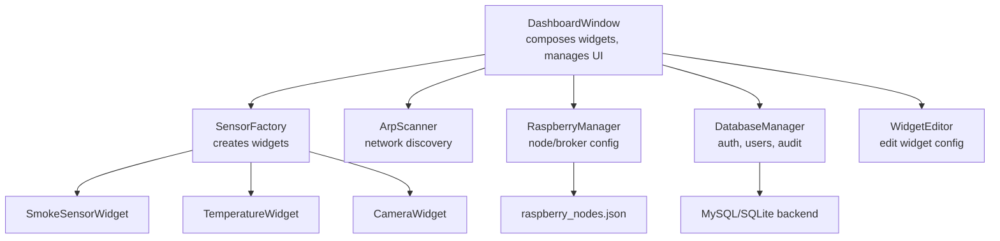
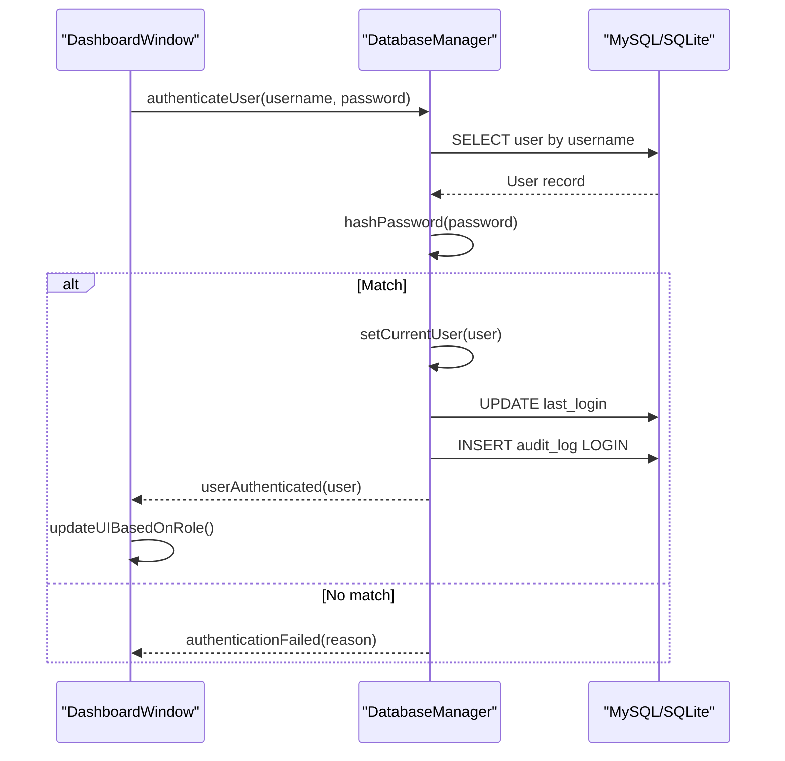
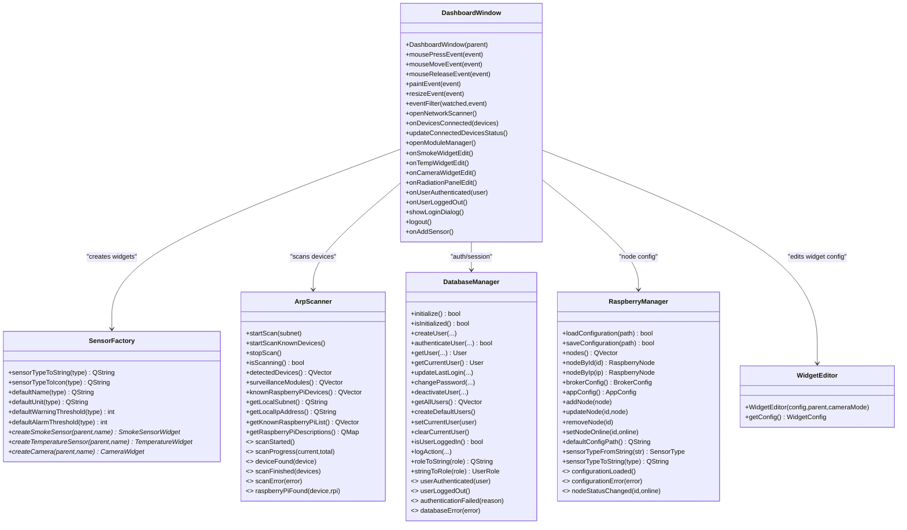

# API Reference

<cite>
**Referenced Files in This Document**
- [dashboardwindow.h](file://dashboardwindow.h)
- [dashboardwindow.cpp](file://dashboardwindow.cpp)
- [databasemanager.h](file://databasemanager.h)
- [databasemanager.cpp](file://databasemanager.cpp)
- [sensorfactory.h](file://sensorfactory.h)
- [sensorfactory.cpp](file://sensorfactory.cpp)
- [raspberrymanager.h](file://raspberrymanager.h)
- [raspberrymanager.cpp](file://raspberrymanager.cpp)
- [arpscanner.h](file://arpscanner.h)
- [arpscanner.cpp](file://arpscanner.cpp)
- [widgeteditor.h](file://widgeteditor.h)
- [widgeteditor.cpp](file://widgeteditor.cpp)
- [smokesensorwidget.h](file://smokesensorwidget.h)
- [temperaturewidget.h](file://temperaturewidget.h)
- [camerawidget.h](file://camerawidget.h)
</cite>

## Table of Contents
1. [Introduction](#introduction)
2. [Project Structure](#project-structure)
3. [Core Components](#core-components)
4. [Architecture Overview](#architecture-overview)
5. [Detailed Component Analysis](#detailed-component-analysis)
6. [Dependency Analysis](#dependency-analysis)
7. [Performance Considerations](#performance-considerations)
8. [Troubleshooting Guide](#troubleshooting-guide)
9. [Conclusion](#conclusion)
10. [Appendices](#appendices)

## Introduction
This document provides a comprehensive API reference for the public interfaces in SurveillanceQT. It covers the primary classes and their public methods, signals, slots, enums, and data structures used to build the surveillance dashboard, manage sensors, scan networks, and persist user sessions. It also includes integration patterns, best practices, and diagrams to help developers extend the system effectively.

## Project Structure
The project is organized around modular UI widgets and supporting managers:
- DashboardWindow composes and orchestrates sensor widgets and authentication.
- SensorFactory creates sensor widgets with standardized defaults.
- ArpScanner discovers network devices and identifies known Raspberry Pi nodes.
- RaspberryManager loads/saves MQTT broker and node configurations.
- DatabaseManager handles user authentication, permissions, and audit logs.
- WidgetEditor provides a configurable dialog for editing widget metadata.

**Diagram sources**
- [dashboardwindow.h:19-98](file://dashboardwindow.h#L19-L98)
- [sensorfactory.h:28-40](file://sensorfactory.h#L28-L40)
- [arpscanner.h:31-87](file://arpscanner.h#L31-L87)
- [raspberrymanager.h:63-106](file://raspberrymanager.h#L63-L106)
- [databasemanager.h:34-87](file://databasemanager.h#L34-L87)
- [widgeteditor.h:20-40](file://widgeteditor.h#L20-L40)
- [smokesensorwidget.h:10-52](file://smokesensorwidget.h#L10-L52)
- [temperaturewidget.h:11-53](file://temperaturewidget.h#L11-L53)
- [camerawidget.h:9-39](file://camerawidget.h#L9-L39)

**Section sources**
- [dashboardwindow.h:19-98](file://dashboardwindow.h#L19-L98)
- [sensorfactory.h:28-40](file://sensorfactory.h#L28-L40)
- [arpscanner.h:31-87](file://arpscanner.h#L31-L87)
- [raspberrymanager.h:63-106](file://raspberrymanager.h#L63-L106)
- [databasemanager.h:34-87](file://databasemanager.h#L34-L87)
- [widgeteditor.h:20-40](file://widgeteditor.h#L20-L40)

## Core Components
This section summarizes the public APIs of the core classes.

- DashboardWindow
  - Purpose: Main dashboard window composing sensor widgets, authentication, and network scanning.
  - Signals and Slots: See “Signals and Slots” subsection below.
  - Public Methods: Constructor, UI composition helpers, drag-and-drop support, authentication hooks, and status updates.
  - Properties: None declared; manages internal UI state via member variables.

- DatabaseManager
  - Purpose: User management, authentication, session control, and audit logging.
  - Signals: userAuthenticated, userLoggedOut, authenticationFailed, databaseError.
  - Public Methods: initialize, isInitialized, createUser, authenticateUser, getUser, getCurrentUser, updateLastLogin, changePassword, deactivateUser, getAllUsers, createDefaultUsers, setCurrentUser, clearCurrentUser, isUserLoggedIn, logAction, roleToString, stringToRole.

- SensorFactory
  - Purpose: Factory for creating smoke, temperature, and camera widgets with sensible defaults.
  - Static Methods: sensorTypeToString, sensorTypeToIcon, defaultName, defaultUnit, defaultWarningThreshold, defaultAlarmThreshold, createSmokeSensor, createTemperatureSensor, createCamera.

- RaspberryManager
  - Purpose: Load/save MQTT broker and node configuration, manage node lists, and convert between types and JSON.
  - Signals: configurationLoaded, configurationError, nodeStatusChanged.
  - Public Methods: loadConfiguration, saveConfiguration, nodes, nodeById, nodeByIp, brokerConfig, appConfig, addNode, updateNode, removeNode, setNodeOnline, defaultConfigPath, sensorTypeFromString, sensorTypeToString.

- ArpScanner
  - Purpose: Discover devices on LAN, identify surveillance modules and known Raspberry Pi nodes.
  - Signals: scanStarted, scanProgress, deviceFound, scanFinished, scanError, raspberryPiFound.
  - Public Methods: startScan, startScanKnownDevices, stopScan, isScanning, detectedDevices, surveillanceModules, knownRaspberryPiDevices, getLocalSubnet, getLocalIpAddress, getKnownRaspberryPiList, getRaspberryPiDescriptions.

- WidgetEditor
  - Purpose: Dialog to edit widget configuration (name, type, thresholds, unit).
  - Public Methods: Constructor, getConfig.
  - Data Model: WidgetConfig struct with id, name, type, warningThreshold, alarmThreshold, unit, enabled.

- Sensor Widgets
  - SmokeSensorWidget: Enum Severity, buttons edit/close, getters for summary/value/severity, simulation/reset, setTitle, setResizable.
  - TemperatureWidget: Same pattern as smoke sensor.
  - CameraWidget: Buttons edit/close/reload/snapshot/fullscreen/record, currentFrame, reloadFrame, isRecording, setTitle, setResizable.

**Section sources**
- [dashboardwindow.h:19-98](file://dashboardwindow.h#L19-L98)
- [databasemanager.h:34-87](file://databasemanager.h#L34-L87)
- [sensorfactory.h:28-40](file://sensorfactory.h#L28-L40)
- [raspberrymanager.h:63-106](file://raspberrymanager.h#L63-L106)
- [arpscanner.h:31-87](file://arpscanner.h#L31-L87)
- [widgeteditor.h:20-40](file://widgeteditor.h#L20-L40)
- [smokesensorwidget.h:10-52](file://smokesensorwidget.h#L10-L52)
- [temperaturewidget.h:11-53](file://temperaturewidget.h#L11-L53)
- [camerawidget.h:9-39](file://camerawidget.h#L9-L39)

## Architecture Overview
The dashboard integrates UI widgets with managers for persistence, networking, and configuration. The following sequence illustrates a typical user login flow and subsequent dashboard updates.

**Diagram sources**
- [dashboardwindow.h:34-46](file://dashboardwindow.h#L34-L46)
- [databasemanager.h:72-86](file://databasemanager.h#L72-L86)
- [databasemanager.cpp:158-198](file://databasemanager.cpp#L158-L198)

## Detailed Component Analysis

### DashboardWindow
- Inheritance: QWidget
- Signals and Slots:
  - Private slots: openNetworkScanner, onDevicesConnected, updateConnectedDevicesStatus, openModuleManager, onSmokeWidgetEdit, onTempWidgetEdit, onCameraWidgetEdit, onRadiationPanelEdit, onUserAuthenticated, onUserLoggedOut, showLoginDialog, logout, onAddSensor.
  - Protected overrides: mousePressEvent, mouseMoveEvent, mouseReleaseEvent, paintEvent, resizeEvent, eventFilter.
- Public Methods:
  - Constructor: DashboardWindow(QWidget* parent = nullptr)
  - UI composition helpers: createTitleBar, createBottomBar, createRadiationPanel.
  - Interaction helpers: showCameraFullscreen, setupNetworkFeatures, setupWidgetEditButtons, addSensorToGrid, setWidgetSize, resetWidgetSize, enableWidgetDragging.
  - Authentication helpers: setupAuthentication, createLockOverlay, updateUIBasedOnRole, setWidgetsEnabled.
- Data Structures:
  - Internal members include pointers to LoginWidget, sensor widgets, status labels, network controls, timers, and dynamic sensor container.

Usage example (high level):
- Instantiate DashboardWindow and connect its private slots to external components (e.g., ArpScanner, DatabaseManager).
- Use addSensorToGrid and setWidgetSize to place and size widgets dynamically.

Best practices:
- Encapsulate widget creation via SensorFactory for consistency.
- Use updateBottomStatus to reflect real-time widget states.
- Apply authentication gating via setupAuthentication and lock overlay.

**Section sources**
- [dashboardwindow.h:19-98](file://dashboardwindow.h#L19-L98)
- [dashboardwindow.cpp:71-244](file://dashboardwindow.cpp#L71-L244)
- [dashboardwindow.cpp:668-728](file://dashboardwindow.cpp#L668-L728)
- [dashboardwindow.cpp:730-740](file://dashboardwindow.cpp#L730-L740)
- [dashboardwindow.cpp:742-800](file://dashboardwindow.cpp#L742-L800)

### DatabaseManager
- Inheritance: QObject
- Signals:
  - userAuthenticated(const User&)
  - userLoggedOut()
  - authenticationFailed(const QString&)
  - databaseError(const QString&)
- Enums and Structs:
  - UserRole: Admin, Operator, Viewer
  - User struct with fields: id, username, password, role, fullName, email, isActive, lastLogin, createdAt; plus helper methods hasPermission, getRoleString, canEditWidgets, canManageModules, canConfigureSystem, canViewSensors.
- Public Methods:
  - initialize(), isInitialized()
  - User management: createUser, authenticateUser, getUser, getCurrentUser, updateLastLogin, changePassword, deactivateUser, getAllUsers
  - Defaults: createDefaultUsers
  - Session: setCurrentUser, clearCurrentUser, isUserLoggedIn
  - Audit: logAction
  - Utilities: roleToString, stringToRole

Usage example (high level):
- Initialize the manager, create default users, authenticate a user, and react to userAuthenticated to unlock UI features.

Best practices:
- Hash passwords using the built-in hashing utility.
- Emit databaseError for UI feedback on failures.
- Use User helper methods to enforce role-based permissions.

**Section sources**
- [databasemanager.h:9-32](file://databasemanager.h#L9-L32)
- [databasemanager.h:34-87](file://databasemanager.h#L34-L87)
- [databasemanager.cpp:21-46](file://databasemanager.cpp#L21-L46)
- [databasemanager.cpp:158-198](file://databasemanager.cpp#L158-L198)
- [databasemanager.cpp:343-381](file://databasemanager.cpp#L343-L381)

### SensorFactory
- Purpose: Centralized factory for creating sensor widgets with consistent defaults.
- Static Methods:
  - sensorTypeToString, sensorTypeToIcon, defaultName, defaultUnit, defaultWarningThreshold, defaultAlarmThreshold
  - createSmokeSensor, createTemperatureSensor, createCamera

Usage example (high level):
- Call createSmokeSensor(parent, name) to instantiate a configured widget.

Best practices:
- Use defaultName/defaultUnit/default thresholds to prefill UI dialogs.
- Keep widget-specific logic inside the widget classes; factory should only construct and set titles.

**Section sources**
- [sensorfactory.h:10-17](file://sensorfactory.h#L10-L17)
- [sensorfactory.h:19-26](file://sensorfactory.h#L19-L26)
- [sensorfactory.h:28-40](file://sensorfactory.h#L28-L40)
- [sensorfactory.cpp:7-81](file://sensorfactory.cpp#L7-L81)
- [sensorfactory.cpp:83-102](file://sensorfactory.cpp#L83-L102)

### RaspberryManager
- Inheritance: QObject
- Signals:
  - configurationLoaded()
  - configurationError(const QString&)
  - nodeStatusChanged(const QString&, bool)
- Structs:
  - SensorInfo: id, name, type, topic, unit, warningThreshold, alarmThreshold, extraConfig; methods getTypeString, getIcon
  - RaspberryNode: id, name, ipAddress, macAddress, description, sensors, extraConfig, isOnline, lastSeen; helper hasSensors
  - BrokerConfig: host, port, protocol, username, password
  - AppConfig: autoConnectOnStartup, reconnectIntervalMs, heartbeatIntervalMs, logLevel
- Public Methods:
  - loadConfiguration(filePath), saveConfiguration(filePath), nodes(), nodeById(id), nodeByIp(ip), brokerConfig(), appConfig()
  - addNode, updateNode, removeNode, setNodeOnline(id, online)
  - defaultConfigPath, sensorTypeFromString, sensorTypeToString

Usage example (high level):
- Load configuration from config/raspberry_nodes.json, iterate nodes, and monitor nodeStatusChanged.

Best practices:
- Validate JSON structure before parsing.
- Use sensorTypeToString for serialization to maintain consistency.

**Section sources**
- [raspberrymanager.h:10-18](file://raspberrymanager.h#L10-L18)
- [raspberrymanager.h:20-32](file://raspberrymanager.h#L20-L32)
- [raspberrymanager.h:34-46](file://raspberrymanager.h#L34-L46)
- [raspberrymanager.h:48-61](file://raspberrymanager.h#L48-L61)
- [raspberrymanager.h:63-106](file://raspberrymanager.h#L63-L106)
- [raspberrymanager.cpp:24-52](file://raspberrymanager.cpp#L24-L52)
- [raspberrymanager.cpp:112-150](file://raspberrymanager.cpp#L112-L150)
- [raspberrymanager.cpp:181-209](file://raspberrymanager.cpp#L181-L209)
- [raspberrymanager.cpp:239-273](file://raspberrymanager.cpp#L239-L273)
- [raspberrymanager.cpp:306-330](file://raspberrymanager.cpp#L306-L330)

### ArpScanner
- Inheritance: QObject
- Signals:
  - scanStarted(), scanProgress(int, int), deviceFound(const NetworkDevice&), scanFinished(const QVector<NetworkDevice>&), scanError(const QString&), raspberryPiFound(const NetworkDevice&, const KnownRaspberryPi&)
- Structs:
  - NetworkDevice: ipAddress, macAddress, hostname, deviceType, description, isOnline, rssi; equality operator
  - KnownRaspberryPi: ipAddress, name, description, expectedType
- Public Methods:
  - startScan(subnet), startScanKnownDevices(), stopScan(), isScanning()
  - detectedDevices(), surveillanceModules(), knownRaspberryPiDevices()
  - getLocalSubnet(), getLocalIpAddress()
  - getKnownRaspberryPiList(), getRaspberryPiDescriptions()

Usage example (high level):
- Start a subnet sweep; connect to deviceFound and scanFinished to populate UI and trigger downstream actions.

Best practices:
- Use KNOWN_RASPBERRY_PI list to pre-validate known devices.
- Emit progress updates periodically for responsive UI.

**Section sources**
- [arpscanner.h:10-22](file://arpscanner.h#L10-L22)
- [arpscanner.h:24-29](file://arpscanner.h#L24-L29)
- [arpscanner.h:31-87](file://arpscanner.h#L31-L87)
- [arpscanner.cpp:108-143](file://arpscanner.cpp#L108-L143)
- [arpscanner.cpp:145-172](file://arpscanner.cpp#L145-L172)
- [arpscanner.cpp:174-196](file://arpscanner.cpp#L174-L196)
- [arpscanner.cpp:281-316](file://arpscanner.cpp#L281-L316)

### WidgetEditor
- Inheritance: QDialog
- Struct:
  - WidgetConfig: id, name, type, warningThreshold, alarmThreshold, unit, enabled
- Public Methods:
  - Constructor: WidgetEditor(const WidgetConfig&, QWidget*, bool cameraMode=false)
  - getConfig(): WidgetConfig

Usage example (high level):
- Construct with a WidgetConfig, show dialog, and apply returned config to the target widget.

Best practices:
- Hide threshold controls in cameraMode.
- Validate inputs before accepting.

**Section sources**
- [widgeteditor.h:10-18](file://widgeteditor.h#L10-L18)
- [widgeteditor.h:20-40](file://widgeteditor.h#L20-L40)
- [widgeteditor.cpp:12-31](file://widgeteditor.cpp#L12-L31)
- [widgeteditor.cpp:119-128](file://widgeteditor.cpp#L119-L128)

### Sensor Widgets
- SmokeSensorWidget
  - Enum: Severity { Normal, Warning, Alarm }
  - Public: editButton(), closeButton(), currentSummary(), currentValue(), severity(), simulateStep(), resetSensor(), setTitle(), setResizable()
- TemperatureWidget
  - Same API as smoke sensor.
- CameraWidget
  - Public: editButton(), closeButton(), reloadButton(), snapshotButton(), fullscreenButton(), recordButton(), currentFrame(), reloadFrame(), isRecording(), setTitle(), setResizable()

Usage example (high level):
- Create via SensorFactory, embed in DashboardWindow, connect to ArpScanner events to update values.

Best practices:
- Use setResizable to integrate with resizing UI features.
- Keep thresholds synchronized with WidgetEditor.

**Section sources**
- [smokesensorwidget.h:14-18](file://smokesensorwidget.h#L14-L18)
- [smokesensorwidget.h:20-34](file://smokesensorwidget.h#L20-L34)
- [temperaturewidget.h:15-19](file://temperaturewidget.h#L15-L19)
- [temperaturewidget.h:21-34](file://temperaturewidget.h#L21-L34)
- [camerawidget.h:15-27](file://camerawidget.h#L15-L27)

## Dependency Analysis
The following diagram shows key dependencies among the public classes.

**Diagram sources**
- [dashboardwindow.h:19-98](file://dashboardwindow.h#L19-L98)
- [databasemanager.h:34-87](file://databasemanager.h#L34-L87)
- [sensorfactory.h:28-40](file://sensorfactory.h#L28-L40)
- [arpscanner.h:31-87](file://arpscanner.h#L31-L87)
- [raspberrymanager.h:63-106](file://raspberrymanager.h#L63-L106)
- [widgeteditor.h:20-40](file://widgeteditor.h#L20-L40)

**Section sources**
- [dashboardwindow.h:19-98](file://dashboardwindow.h#L19-L98)
- [databasemanager.h:34-87](file://databasemanager.h#L34-L87)
- [sensorfactory.h:28-40](file://sensorfactory.h#L28-L40)
- [arpscanner.h:31-87](file://arpscanner.h#L31-L87)
- [raspberrymanager.h:63-106](file://raspberrymanager.h#L63-L106)
- [widgeteditor.h:20-40](file://widgeteditor.h#L20-L40)

## Performance Considerations
- Network scanning:
  - Use startScanKnownDevices to limit host count and reduce overhead when targeting known Raspberry Pi IPs.
  - Monitor scanProgress to provide responsive UI feedback.
- Database operations:
  - Batch operations where possible; avoid repeated queries in tight loops.
  - Use prepared statements for frequent inserts/updates.
- Widget updates:
  - Throttle timer-based updates to avoid excessive UI repaints.
- JSON configuration:
  - Validate and cache parsed structures to minimize repeated parsing.

## Troubleshooting Guide
Common issues and resolutions:
- Authentication failures:
  - Ensure credentials match hashed records; listen to authenticationFailed and databaseError signals.
- Database connectivity:
  - Verify MySQL connection parameters and that the database is initialized.
- Network scanning errors:
  - Confirm local subnet detection and platform-specific ping/arp commands are available.
- Widget editing:
  - In cameraMode, threshold controls are hidden; ensure UI reflects this state.

**Section sources**
- [databasemanager.cpp:158-198](file://databasemanager.cpp#L158-L198)
- [arpscanner.cpp:108-143](file://arpscanner.cpp#L108-L143)
- [widgeteditor.cpp:27-31](file://widgeteditor.cpp#L27-L31)

## Conclusion
SurveillanceQT’s API centers on a cohesive set of managers and widgets that integrate seamlessly. By leveraging DatabaseManager for authentication, ArpScanner for discovery, RaspberryManager for configuration, SensorFactory for widget creation, and WidgetEditor for customization, developers can extend the system reliably. Following the documented patterns ensures consistent behavior, robust error handling, and maintainable code.

## Appendices

### API Definitions: Signals and Slots
- DashboardWindow
  - Private slots: openNetworkScanner, onDevicesConnected, updateConnectedDevicesStatus, openModuleManager, onSmokeWidgetEdit, onTempWidgetEdit, onCameraWidgetEdit, onRadiationPanelEdit, onUserAuthenticated, onUserLoggedOut, showLoginDialog, logout, onAddSensor.
- DatabaseManager
  - Signals: userAuthenticated, userLoggedOut, authenticationFailed, databaseError.
- ArpScanner
  - Signals: scanStarted, scanProgress, deviceFound, scanFinished, scanError, raspberryPiFound.
- RaspberryManager
  - Signals: configurationLoaded, configurationError, nodeStatusChanged.

**Section sources**
- [dashboardwindow.h:34-46](file://dashboardwindow.h#L34-L46)
- [databasemanager.h:72-76](file://databasemanager.h#L72-L76)
- [arpscanner.h:53-59](file://arpscanner.h#L53-L59)
- [raspberrymanager.h:89-92](file://raspberrymanager.h#L89-L92)

### Data Models
- User
  - Fields: id, username, password, role, fullName, email, isActive, lastLogin, createdAt
  - Helpers: hasPermission, getRoleString, canEditWidgets, canManageModules, canConfigureSystem, canViewSensors
- NetworkDevice
  - Fields: ipAddress, macAddress, hostname, deviceType, description, isOnline, rssi
  - Equality: compares MAC address
- KnownRaspberryPi
  - Fields: ipAddress, name, description, expectedType
- SensorInfo
  - Fields: id, name, type, topic, unit, warningThreshold, alarmThreshold, extraConfig
  - Helpers: getTypeString, getIcon
- RaspberryNode
  - Fields: id, name, ipAddress, macAddress, description, sensors, extraConfig, isOnline, lastSeen
  - Helper: hasSensors
- BrokerConfig
  - Fields: host, port, protocol, username, password
- AppConfig
  - Fields: autoConnectOnStartup, reconnectIntervalMs, heartbeatIntervalMs, logLevel
- WidgetConfig
  - Fields: id, name, type, warningThreshold, alarmThreshold, unit, enabled

**Section sources**
- [databasemanager.h:15-32](file://databasemanager.h#L15-L32)
- [arpscanner.h:10-22](file://arpscanner.h#L10-L22)
- [arpscanner.h:24-29](file://arpscanner.h#L24-L29)
- [raspberrymanager.h:20-32](file://raspberrymanager.h#L20-L32)
- [raspberrymanager.h:34-46](file://raspberrymanager.h#L34-L46)
- [raspberrymanager.h:48-61](file://raspberrymanager.h#L48-L61)
- [widgeteditor.h:10-18](file://widgeteditor.h#L10-L18)