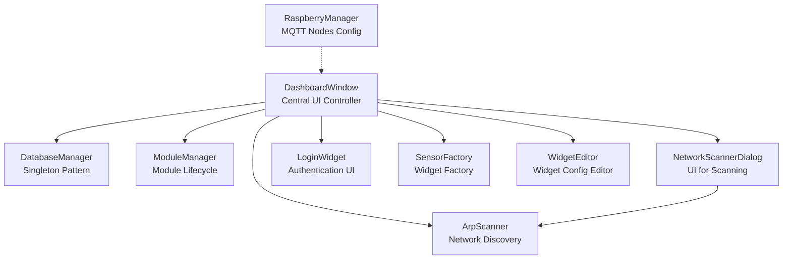
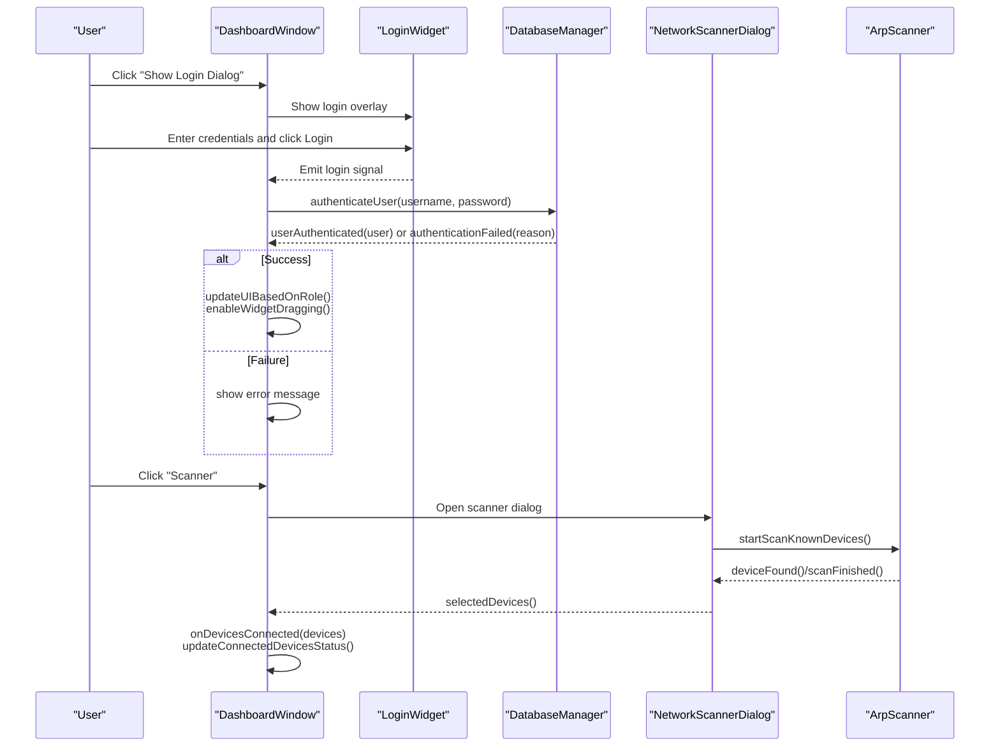
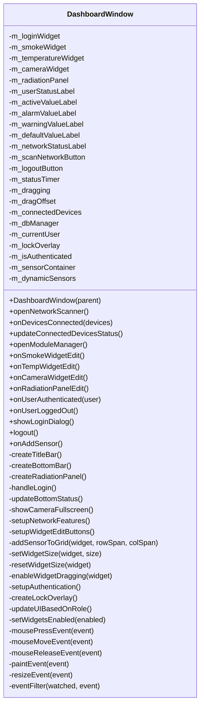
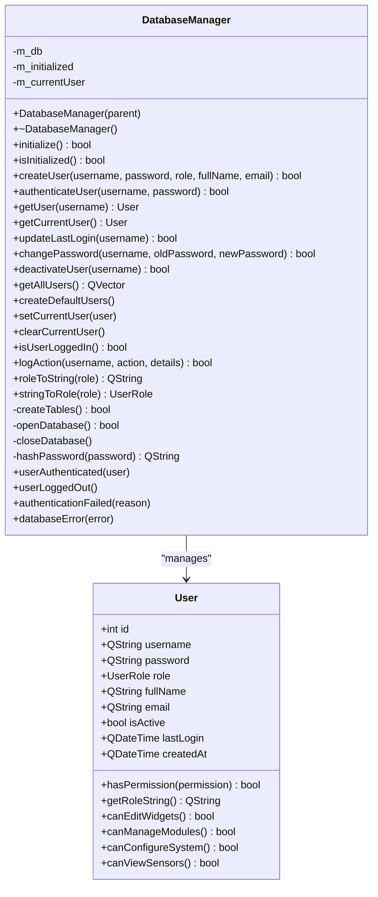
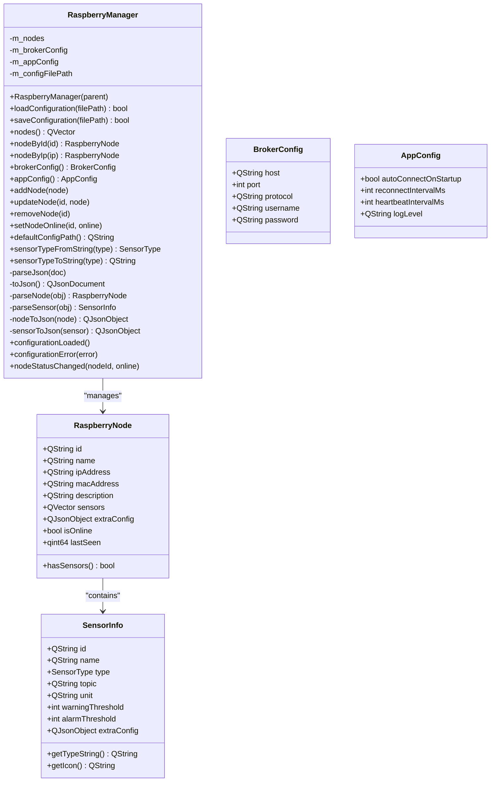
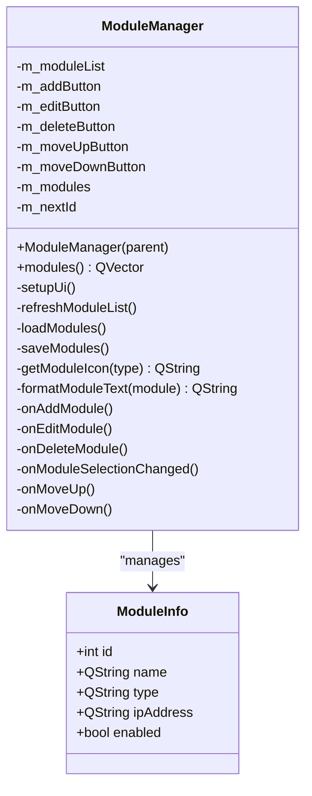
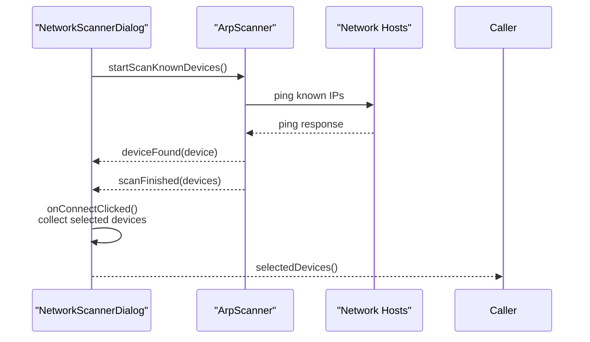
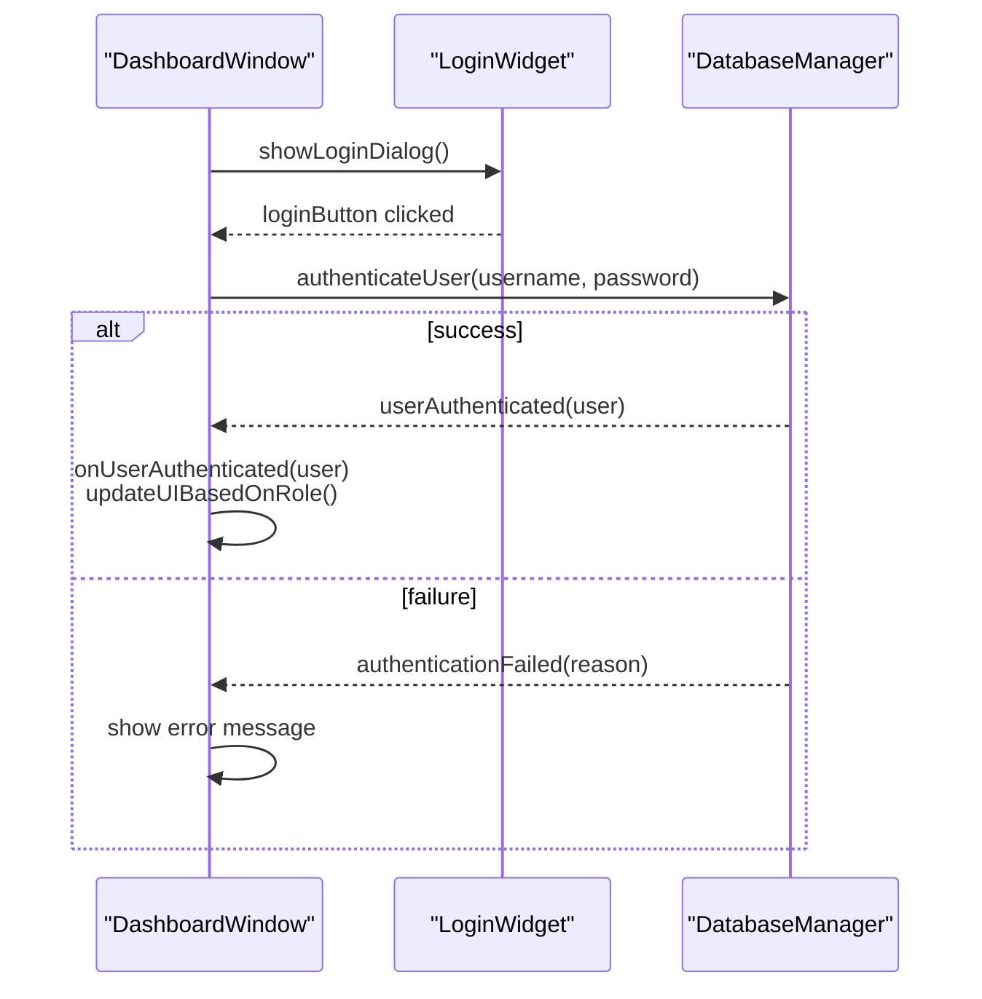
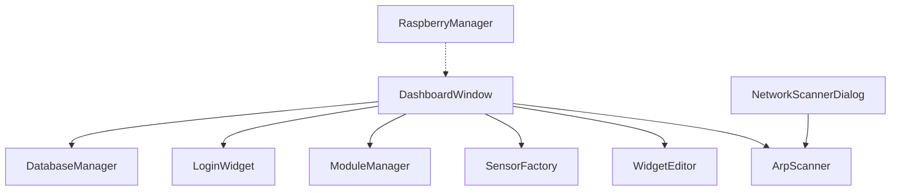

# Core Components API

<cite>
**Referenced Files in This Document**
- [dashboardwindow.h](file://dashboardwindow.h)
- [dashboardwindow.cpp](file://dashboardwindow.cpp)
- [databasemanager.h](file://databasemanager.h)
- [databasemanager.cpp](file://databasemanager.cpp)
- [raspberrymanager.h](file://raspberrymanager.h)
- [raspberrymanager.cpp](file://raspberrymanager.cpp)
- [modulemanager.h](file://modulemanager.h)
- [modulemanager.cpp](file://modulemanager.cpp)
- [arpscanner.h](file://arpscanner.h)
- [arpscanner.cpp](file://arpscanner.cpp)
- [networkscannerdialog.h](file://networkscannerdialog.h)
- [networkscannerdialog.cpp](file://networkscannerdialog.cpp)
- [loginwidget.h](file://loginwidget.h)
- [loginwidget.cpp](file://loginwidget.cpp)
- [sensorfactory.h](file://sensorfactory.h)
- [sensorfactory.cpp](file://sensorfactory.cpp)
- [widgeteditor.h](file://widgeteditor.h)
- [widgeteditor.cpp](file://widgeteditor.cpp)
</cite>

## Table of Contents
1. [Introduction](#introduction)
2. [Project Structure](#project-structure)
3. [Core Components](#core-components)
4. [Architecture Overview](#architecture-overview)
5. [Detailed Component Analysis](#detailed-component-analysis)
6. [Dependency Analysis](#dependency-analysis)
7. [Performance Considerations](#performance-considerations)
8. [Troubleshooting Guide](#troubleshooting-guide)
9. [Conclusion](#conclusion)

## Introduction
This document provides comprehensive API documentation for the core system components in SurveillanceQT. It focuses on:
- DashboardWindow as the central controller for UI orchestration, authentication, and sensor widget management
- DatabaseManager singleton pattern for database connectivity, user management, and audit logging
- RaspberryManager for MQTT broker coordination, node management, and sensor network configuration
- ModuleManager for system module lifecycle management
It includes method signatures, parameters, return values, error handling, and practical usage examples demonstrating component interactions.

## Project Structure
The core components are organized around a Qt-based desktop application with modular UI widgets and service managers:
- Central UI controller: DashboardWindow
- Data persistence and auth: DatabaseManager
- Sensor network configuration: RaspberryManager
- Module management: ModuleManager
- Network scanning utilities: ArpScanner and NetworkScannerDialog
- UI helpers: LoginWidget, SensorFactory, WidgetEditor

**Diagram sources**
- [dashboardwindow.h:19-99](file://dashboardwindow.h#L19-L99)
- [databasemanager.h:34-88](file://databasemanager.h#L34-L88)
- [raspberrymanager.h:63-107](file://raspberrymanager.h#L63-L107)
- [modulemanager.h:18-52](file://modulemanager.h#L18-L52)
- [arpscanner.h:31-88](file://arpscanner.h#L31-L88)
- [networkscannerdialog.h:14-57](file://networkscannerdialog.h#L14-L57)
- [loginwidget.h:8-22](file://loginwidget.h#L8-L22)
- [sensorfactory.h:28-41](file://sensorfactory.h#L28-L41)
- [widgeteditor.h:20-41](file://widgeteditor.h#L20-L41)

**Section sources**
- [dashboardwindow.h:1-99](file://dashboardwindow.h#L1-L99)
- [databasemanager.h:1-88](file://databasemanager.h#L1-L88)
- [raspberrymanager.h:1-107](file://raspberrymanager.h#L1-L107)
- [modulemanager.h:1-52](file://modulemanager.h#L1-L52)
- [arpscanner.h:1-88](file://arpscanner.h#L1-L88)
- [networkscannerdialog.h:1-57](file://networkscannerdialog.h#L1-L57)
- [loginwidget.h:1-22](file://loginwidget.h#L1-L22)
- [sensorfactory.h:1-41](file://sensorfactory.h#L1-L41)
- [widgeteditor.h:1-41](file://widgeteditor.h#L1-L41)

## Core Components

### DashboardWindow
Central controller managing the main dashboard UI, authentication, sensor widgets, and network scanning integration.

- Public constructor
  - Signature: DashboardWindow(QWidget *parent = nullptr)
  - Description: Initializes UI layout, sensor widgets, timers, and connects signals/slots for UI interactions and network updates.
  - Parameters:
    - parent: Parent widget (optional)
  - Returns: Instance of DashboardWindow
  - Errors: None thrown directly; UI initialization errors are handled internally via message boxes.

- Protected event handlers
  - mousePressEvent(QMouseEvent *event): Enables window dragging when clicking the title bar region.
  - mouseMoveEvent(QMouseEvent *event): Moves the window during drag operation.
  - mouseReleaseEvent(QMouseEvent *event): Ends window dragging.
  - paintEvent(QPaintEvent *event): Standard painting event.
  - resizeEvent(QResizeEvent *event): Handles window resizing.
  - eventFilter(QObject *watched, QEvent *event): Generic event filter hook.

- Public slots (UI actions)
  - openNetworkScanner(): Opens the NetworkScannerDialog and processes selected devices.
  - onDevicesConnected(const QVector<NetworkDevice> &devices): Updates connected devices list and status.
  - updateConnectedDevicesStatus(): Refreshes the network status label with counts.
  - openModuleManager(): Launches the ModuleManager dialog.
  - onSmokeWidgetEdit(): Opens WidgetEditor for smoke sensor configuration.
  - onTempWidgetEdit(): Opens WidgetEditor for temperature sensor configuration.
  - onCameraWidgetEdit(): Opens WidgetEditor for camera configuration.
  - onRadiationPanelEdit(): Placeholder for future radiation panel editing.
  - onUserAuthenticated(const User &user): Updates UI after successful authentication.
  - onUserLoggedOut(): Clears current user and resets UI state.
  - showLoginDialog(): Displays the LoginWidget overlay.
  - logout(): Logs out the current user and clears session.
  - onAddSensor(): Adds a new dynamic sensor to the dashboard grid.

- Private helpers
  - createTitleBar(): Builds the top title bar with window controls.
  - createBottomBar(): Builds the bottom status bar with device counters and actions.
  - createRadiationPanel(): Creates a placeholder panel for radiation monitoring.
  - handleLogin(): Processes login credentials and updates user label.
  - updateBottomStatus(): Recomputes active sensors and severity counts.
  - showCameraFullscreen(): Displays the current camera frame in a fullscreen dialog.
  - setupNetworkFeatures(): Initializes network status with local IP and subnet.
  - setupWidgetEditButtons(): Connects edit buttons on sensor widgets.
  - addSensorToGrid(QWidget *widget, int rowSpan = 1, int colSpan = 1): Places a widget in the sensor container.
  - setWidgetSize(QWidget *widget, const QSize &size): Resizes a widget to a fixed size.
  - resetWidgetSize(QWidget *widget): Resets a widget to automatic sizing.
  - enableWidgetDragging(QWidget *widget): Enables drag-and-drop movement for a widget.
  - setupAuthentication(): Initializes authentication UI and binds login signals.
  - createLockOverlay(): Creates an overlay for restricted access.
  - updateUIBasedOnRole(): Adjusts UI visibility based on user role.
  - setWidgetsEnabled(bool enabled): Enables/disables interactive widgets.

- Signals (none declared in public API)
- Properties (none declared in public API)

- Internal state
  - m_loginWidget: Embedded login UI
  - m_smokeWidget, m_temperatureWidget, m_cameraWidget, m_radiationPanel: Sensor widgets
  - m_userStatusLabel, m_activeValueLabel, m_alarmValueLabel, m_warningValueLabel, m_defaultValueLabel: Status labels
  - m_networkStatusLabel, m_scanNetworkButton, m_logoutButton: Network controls
  - m_statusTimer: Periodic timer for status updates
  - m_dragging, m_dragOffset: Drag state
  - m_connectedDevices: List of currently connected surveillance modules
  - m_dbManager: DatabaseManager instance pointer
  - m_currentUser: Currently authenticated user
  - m_lockOverlay: Overlay for access restrictions
  - m_isAuthenticated: Authentication flag
  - m_sensorContainer: Dynamic sensor container with absolute positioning
  - m_dynamicSensors: Vector of dynamically added sensors

- Practical usage example
  - Initialize DashboardWindow and connect authentication signals from DatabaseManager to update UI on login/logout events.
  - Use openNetworkScanner to launch NetworkScannerDialog, then apply onDevicesConnected to reflect discovered modules in the UI.
  - Invoke onAddSensor to programmatically add a new sensor widget to the dashboard grid.

**Section sources**
- [dashboardwindow.h:19-99](file://dashboardwindow.h#L19-L99)
- [dashboardwindow.cpp:71-244](file://dashboardwindow.cpp#L71-L244)
- [dashboardwindow.cpp:561-614](file://dashboardwindow.cpp#L561-L614)
- [dashboardwindow.cpp:616-639](file://dashboardwindow.cpp#L616-L639)
- [dashboardwindow.cpp:641-666](file://dashboardwindow.cpp#L641-L666)
- [dashboardwindow.cpp:668-728](file://dashboardwindow.cpp#L668-L728)
- [dashboardwindow.cpp:730-740](file://dashboardwindow.cpp#L730-L740)
- [dashboardwindow.cpp:742-800](file://dashboardwindow.cpp#L742-L800)
- [dashboardwindow.cpp:801-840](file://dashboardwindow.cpp#L801-L840)

### DatabaseManager (Singleton Pattern)
Manages database initialization, user authentication, user lifecycle, and audit logging.

- Public API
  - Constructor/Destructor: DatabaseManager(QObject *parent = nullptr); ~DatabaseManager()
  - initialize(): Initializes database connection and creates tables for SQLite; returns bool indicating success.
  - isInitialized() const: Returns whether initialization succeeded.
  - createUser(const QString &username, const QString &password, UserRole role, const QString &fullName = QString(), const QString &email = QString()): Creates a new user with hashed password; returns bool.
  - authenticateUser(const QString &username, const QString &password): Authenticates user, sets current user, logs last login, and emits userAuthenticated or authenticationFailed; returns bool.
  - getUser(const QString &username): Retrieves a user record; returns User struct.
  - getCurrentUser() const: Returns the currently logged-in User.
  - updateLastLogin(const QString &username): Updates last login timestamp; returns bool.
  - changePassword(const QString &username, const QString &oldPassword, const QString &newPassword): Verifies old password and updates to new hashed password; returns bool.
  - deactivateUser(const QString &username): Deactivates a user; returns bool.
  - getAllUsers(): Returns a vector of all users.
  - createDefaultUsers(): Creates admin/operator/viewer accounts if none exist.
  - setCurrentUser(const User &user): Sets the current user session.
  - clearCurrentUser(): Clears current user and emits userLoggedOut.
  - isUserLoggedIn() const: Checks if a user is currently logged in.
  - logAction(const QString &username, const QString &action, const QString &details = QString()): Logs an audit event; returns bool.
  - roleToString(UserRole role): Static conversion from enum to string.
  - stringToRole(const QString &role): Static conversion from string to enum.

- Signals
  - userAuthenticated(const User &user): Emitted upon successful authentication.
  - userLoggedOut(): Emitted upon logout.
  - authenticationFailed(const QString &reason): Emitted on authentication failure.
  - databaseError(const QString &error): Emitted on database-related errors.

- Private helpers
  - createTables(): Creates users and audit_log tables for SQLite.
  - openDatabase(): Opens MySQL connection to localhost:3306 with default credentials.
  - closeDatabase(): Closes the database connection.
  - hashPassword(const QString &password): Hashes password using SHA-256.

- Data structures
  - UserRole enum: Admin, Operator, Viewer
  - User struct: id, username, password, role, fullName, email, isActive, lastLogin, createdAt; includes permission helpers.

- Practical usage example
  - Initialize DatabaseManager during application startup, then call authenticateUser with credentials from LoginWidget. On userAuthenticated, update DashboardWindow UI and enable privileged actions.

**Section sources**
- [databasemanager.h:34-88](file://databasemanager.h#L34-L88)
- [databasemanager.cpp:10-41](file://databasemanager.cpp#L10-L41)
- [databasemanager.cpp:48-65](file://databasemanager.cpp#L48-L65)
- [databasemanager.cpp:74-115](file://databasemanager.cpp#L74-L115)
- [databasemanager.cpp:117-135](file://databasemanager.cpp#L117-L135)
- [databasemanager.cpp:137-156](file://databasemanager.cpp#L137-L156)
- [databasemanager.cpp:158-198](file://databasemanager.cpp#L158-L198)
- [databasemanager.cpp:200-221](file://databasemanager.cpp#L200-L221)
- [databasemanager.cpp:223-234](file://databasemanager.cpp#L223-L234)
- [databasemanager.cpp:236-259](file://databasemanager.cpp#L236-L259)
- [databasemanager.cpp:261-288](file://databasemanager.cpp#L261-L288)
- [databasemanager.cpp:290-307](file://databasemanager.cpp#L290-L307)
- [databasemanager.cpp:309-319](file://databasemanager.cpp#L309-L319)
- [databasemanager.cpp:321-341](file://databasemanager.cpp#L321-L341)
- [databasemanager.cpp:343-382](file://databasemanager.cpp#L343-L382)

### RaspberryManager
Handles MQTT broker configuration, application settings, and Raspberry Pi node definitions with JSON serialization.

- Public API
  - Constructor: RaspberryManager(QObject *parent = nullptr)
  - loadConfiguration(const QString &filePath = QString()): Loads configuration from JSON; emits configurationLoaded or configurationError.
  - saveConfiguration(const QString &filePath = QString()): Saves configuration to JSON; returns bool.
  - nodes() const: Returns the loaded node list.
  - nodeById(const QString &id) const: Finds a node by ID; returns empty node if not found.
  - nodeByIp(const QString &ip) const: Finds a node by IP; returns empty node if not found.
  - brokerConfig() const: Returns BrokerConfig.
  - appConfig() const: Returns AppConfig.
  - addNode(const RaspberryNode &node): Appends a node to the list.
  - updateNode(const QString &id, const RaspberryNode &node): Replaces existing node by ID.
  - removeNode(const QString &id): Removes node by ID.
  - setNodeOnline(const QString &id, bool online): Updates online status and lastSeen timestamp; emits nodeStatusChanged if changed.
  - defaultConfigPath(): Static path to default configuration file.
  - sensorTypeFromString(const QString &type): Converts string to SensorType.
  - sensorTypeToString(SensorType type): Converts SensorType to string.

- Data structures
  - SensorType enum: Temperature_DHT22, Humidity_DHT22, Smoke_MQ2, AirQuality_PIM480, VOC_PIM480, Camera, Unknown
  - SensorInfo: id, name, type, topic, unit, warningThreshold, alarmThreshold, extraConfig; includes typeString and icon helpers.
  - RaspberryNode: id, name, ipAddress, macAddress, description, sensors, extraConfig, isOnline, lastSeen; includes hasSensors().
  - BrokerConfig: host, port, protocol, username, password
  - AppConfig: autoConnectOnStartup, reconnectIntervalMs, heartbeatIntervalMs, logLevel

- Signals
  - configurationLoaded(): Emitted after successful load/save.
  - configurationError(const QString &error): Emitted on invalid JSON or file errors.
  - nodeStatusChanged(const QString &nodeId, bool online): Emitted when a node’s online status changes.

- Private helpers
  - parseJson(const QJsonDocument &doc): Parses JSON into internal structures.
  - toJson() const: Serializes internal structures to JSON.
  - parseNode(const QJsonObject &obj): Converts JSON to RaspberryNode.
  - parseSensor(const QJsonObject &obj): Converts JSON to SensorInfo.
  - nodeToJson(const RaspberryNode &node) const: Serializes node to JSON.
  - sensorToJson(const SensorInfo &sensor) const: Serializes sensor to JSON.

- Practical usage example
  - Load configuration on startup via loadConfiguration; subscribe to nodeStatusChanged to update UI indicators for online/offline nodes.

**Section sources**
- [raspberrymanager.h:63-107](file://raspberrymanager.h#L63-L107)
- [raspberrymanager.cpp:11-22](file://raspberrymanager.cpp#L11-L22)
- [raspberrymanager.cpp:24-52](file://raspberrymanager.cpp#L24-L52)
- [raspberrymanager.cpp:54-75](file://raspberrymanager.cpp#L54-L75)
- [raspberrymanager.cpp:77-110](file://raspberrymanager.cpp#L77-L110)
- [raspberrymanager.cpp:112-150](file://raspberrymanager.cpp#L112-L150)
- [raspberrymanager.cpp:152-155](file://raspberrymanager.cpp#L152-L155)
- [raspberrymanager.cpp:157-179](file://raspberrymanager.cpp#L157-L179)
- [raspberrymanager.cpp:181-209](file://raspberrymanager.cpp#L181-L209)
- [raspberrymanager.cpp:211-237](file://raspberrymanager.cpp#L211-L237)
- [raspberrymanager.cpp:239-273](file://raspberrymanager.cpp#L239-L273)
- [raspberrymanager.cpp:275-304](file://raspberrymanager.cpp#L275-L304)
- [raspberrymanager.cpp:306-331](file://raspberrymanager.cpp#L306-L331)

### ModuleManager
Provides a dialog-based UI for managing surveillance modules (add, edit, delete, reorder).

- Public API
  - Constructor: ModuleManager(QWidget *parent = nullptr)
  - modules() const: Returns the current module list.

- Private slots
  - onAddModule(): Prompts for name/type/IP and adds a new module.
  - onEditModule(): Edits selected module fields.
  - onDeleteModule(): Confirms and removes selected module.
  - onModuleSelectionChanged(): Enables/disables buttons based on selection.
  - onMoveUp(): Moves selected module up in the list.
  - onMoveDown(): Moves selected module down in the list.

- Private helpers
  - setupUi(): Builds the dialog UI with lists and buttons.
  - refreshModuleList(): Renders the module list items with icons and status.
  - loadModules(): Initializes default modules for demonstration.
  - saveModules(): Placeholder for persisting module changes.
  - getModuleIcon(const QString &type) const: Returns an icon based on module type.
  - formatModuleText(const ModuleInfo &module) const: Formats display text for list items.

- Data structures
  - ModuleInfo: id, name, type, ipAddress, enabled

- Practical usage example
  - Open ModuleManager from DashboardWindow’s settings button to manage connected modules and their order.

**Section sources**
- [modulemanager.h:18-52](file://modulemanager.h#L18-L52)
- [modulemanager.cpp:17-32](file://modulemanager.cpp#L17-L32)
- [modulemanager.cpp:33-125](file://modulemanager.cpp#L33-L125)
- [modulemanager.cpp:127-142](file://modulemanager.cpp#L127-L142)
- [modulemanager.cpp:144-146](file://modulemanager.cpp#L144-L146)
- [modulemanager.cpp:148-159](file://modulemanager.cpp#L148-L159)
- [modulemanager.cpp:161-179](file://modulemanager.cpp#L161-L179)
- [modulemanager.cpp:181-229](file://modulemanager.cpp#L181-L229)
- [modulemanager.cpp:231-278](file://modulemanager.cpp#L231-L278)
- [modulemanager.cpp:280-297](file://modulemanager.cpp#L280-L297)
- [modulemanager.cpp:299-326](file://modulemanager.cpp#L299-L326)
- [modulemanager.cpp:328-332](file://modulemanager.cpp#L328-L332)

## Architecture Overview
The system integrates UI orchestration, authentication, network discovery, and configuration management:
- DashboardWindow orchestrates UI interactions, authentication, and sensor widgets
- DatabaseManager handles user sessions and audit logging
- ArpScanner and NetworkScannerDialog discover and select surveillance modules
- RaspberryManager manages MQTT node configurations
- ModuleManager maintains module lifecycles
- SensorFactory and WidgetEditor support dynamic widget creation and customization

**Diagram sources**
- [dashboardwindow.cpp:561-572](file://dashboardwindow.cpp#L561-L572)
- [dashboardwindow.cpp:681-688](file://dashboardwindow.cpp#L681-L688)
- [dashboardwindow.cpp:690-709](file://dashboardwindow.cpp#L690-L709)
- [dashboardwindow.cpp:711-728](file://dashboardwindow.cpp#L711-L728)
- [networkscannerdialog.cpp:16-45](file://networkscannerdialog.cpp#L16-L45)
- [networkscannerdialog.cpp:198-222](file://networkscannerdialog.cpp#L198-L222)
- [arpscanner.cpp:174-196](file://arpscanner.cpp#L174-L196)
- [databasemanager.cpp:158-198](file://databasemanager.cpp#L158-L198)

## Detailed Component Analysis

### DashboardWindow Class

**Diagram sources**
- [dashboardwindow.h:19-99](file://dashboardwindow.h#L19-L99)

**Section sources**
- [dashboardwindow.h:19-99](file://dashboardwindow.h#L19-L99)
- [dashboardwindow.cpp:71-244](file://dashboardwindow.cpp#L71-L244)

### DatabaseManager Singleton Pattern

**Diagram sources**
- [databasemanager.h:34-88](file://databasemanager.h#L34-L88)
- [databasemanager.cpp:10-41](file://databasemanager.cpp#L10-L41)

**Section sources**
- [databasemanager.h:34-88](file://databasemanager.h#L34-L88)
- [databasemanager.cpp:10-41](file://databasemanager.cpp#L10-L41)

### RaspberryManager Configuration Management

**Diagram sources**
- [raspberrymanager.h:63-107](file://raspberrymanager.h#L63-L107)
- [raspberrymanager.cpp:11-22](file://raspberrymanager.cpp#L11-L22)

**Section sources**
- [raspberrymanager.h:63-107](file://raspberrymanager.h#L63-L107)
- [raspberrymanager.cpp:11-22](file://raspberrymanager.cpp#L11-L22)

### ModuleManager Dialog

**Diagram sources**
- [modulemanager.h:18-52](file://modulemanager.h#L18-L52)
- [modulemanager.cpp:17-32](file://modulemanager.cpp#L17-L32)

**Section sources**
- [modulemanager.h:18-52](file://modulemanager.h#L18-L52)
- [modulemanager.cpp:17-32](file://modulemanager.cpp#L17-L32)

### Network Discovery and Selection

**Diagram sources**
- [networkscannerdialog.cpp:16-45](file://networkscannerdialog.cpp#L16-L45)
- [networkscannerdialog.cpp:198-222](file://networkscannerdialog.cpp#L198-L222)
- [arpscanner.cpp:174-196](file://arpscanner.cpp#L174-L196)
- [arpscanner.cpp:318-332](file://arpscanner.cpp#L318-L332)
- [networkscannerdialog.cpp:224-246](file://networkscannerdialog.cpp#L224-L246)

**Section sources**
- [arpscanner.h:31-88](file://arpscanner.h#L31-L88)
- [arpscanner.cpp:174-196](file://arpscanner.cpp#L174-L196)
- [arpscanner.cpp:318-332](file://arpscanner.cpp#L318-L332)
- [networkscannerdialog.h:14-57](file://networkscannerdialog.h#L14-L57)
- [networkscannerdialog.cpp:16-45](file://networkscannerdialog.cpp#L16-L45)

### Authentication Flow

**Diagram sources**
- [dashboardwindow.cpp:561-572](file://dashboardwindow.cpp#L561-L572)
- [databasemanager.cpp:158-198](file://databasemanager.cpp#L158-L198)

**Section sources**
- [loginwidget.h:8-22](file://loginwidget.h#L8-L22)
- [loginwidget.cpp:99-113](file://loginwidget.cpp#L99-L113)
- [databasemanager.cpp:158-198](file://databasemanager.cpp#L158-L198)

## Dependency Analysis
- DashboardWindow depends on:
  - DatabaseManager for authentication and user permissions
  - ArpScanner/NetworkScannerDialog for network discovery
  - SensorFactory and WidgetEditor for dynamic widget management
  - ModuleManager for module lifecycle
- DatabaseManager depends on Qt SQL for MySQL connectivity and QCryptographicHash for password hashing
- RaspberryManager depends on QJson for configuration serialization/deserialization
- NetworkScannerDialog depends on ArpScanner for device discovery

**Diagram sources**
- [dashboardwindow.h:19-99](file://dashboardwindow.h#L19-L99)
- [databasemanager.h:34-88](file://databasemanager.h#L34-L88)
- [arpscanner.h:31-88](file://arpscanner.h#L31-L88)
- [networkscannerdialog.h:14-57](file://networkscannerdialog.h#L14-L57)
- [raspberrymanager.h:63-107](file://raspberrymanager.h#L63-L107)
- [modulemanager.h:18-52](file://modulemanager.h#L18-L52)
- [loginwidget.h:8-22](file://loginwidget.h#L8-L22)
- [sensorfactory.h:28-41](file://sensorfactory.h#L28-L41)
- [widgeteditor.h:20-41](file://widgeteditor.h#L20-L41)

**Section sources**
- [dashboardwindow.h:19-99](file://dashboardwindow.h#L19-L99)
- [databasemanager.h:34-88](file://databasemanager.h#L34-L88)
- [raspberrymanager.h:63-107](file://raspberrymanager.h#L63-L107)
- [arpscanner.h:31-88](file://arpscanner.h#L31-L88)
- [networkscannerdialog.h:14-57](file://networkscannerdialog.h#L14-L57)
- [modulemanager.h:18-52](file://modulemanager.h#L18-L52)
- [loginwidget.h:8-22](file://loginwidget.h#L8-L22)
- [sensorfactory.h:28-41](file://sensorfactory.h#L28-L41)
- [widgeteditor.h:20-41](file://widgeteditor.h#L20-L41)

## Performance Considerations
- DatabaseManager uses SHA-256 hashing for passwords; consider configurable cost factors for stronger security if needed.
- ArpScanner performs ping sweeps and ARP parsing; avoid excessive scans to prevent network overhead.
- DashboardWindow uses a periodic timer for status updates; tune interval to balance responsiveness and CPU usage.
- RaspberryManager loads/saves JSON configuration; cache frequently accessed nodes to reduce I/O.

## Troubleshooting Guide
- Database connection failures:
  - Verify MySQL server availability at localhost:3306 and correct credentials.
  - Check databaseError signal emissions for detailed messages.
- Authentication failures:
  - Confirm user exists, is active, and password matches hash.
  - Review authenticationFailed signal for reasons like unknown user or incorrect password.
- Network scanning issues:
  - Ensure local subnet detection succeeds; check scanError signals for underlying causes.
  - Validate ICMP/ping permissions on target hosts.
- Configuration errors:
  - Validate JSON syntax and required fields; listen for configurationError signals.

**Section sources**
- [databasemanager.cpp:48-65](file://databasemanager.cpp#L48-L65)
- [databasemanager.cpp:158-198](file://databasemanager.cpp#L158-L198)
- [arpscanner.cpp:108-131](file://arpscanner.cpp#L108-L131)
- [arpscanner.cpp:318-332](file://arpscanner.cpp#L318-L332)
- [raspberrymanager.cpp:24-52](file://raspberrymanager.cpp#L24-L52)

## Conclusion
The SurveillanceQT core components provide a cohesive architecture for dashboard orchestration, secure authentication, network discovery, and configuration management. DashboardWindow acts as the central controller integrating UI, authentication, and sensor widgets. DatabaseManager ensures robust user lifecycle and audit logging. RaspberryManager encapsulates MQTT node configuration and status. ModuleManager supports module lifecycle management. Together, these components enable scalable and maintainable surveillance dashboards.