# UI Components API

<cite>
**Referenced Files in This Document**
- [smokesensorwidget.h](file://smokesensorwidget.h)
- [smokesensorwidget.cpp](file://smokesensorwidget.cpp)
- [temperaturewidget.h](file://temperaturewidget.h)
- [temperaturewidget.cpp](file://temperaturewidget.cpp)
- [camerawidget.h](file://camerawidget.h)
- [camerawidget.cpp](file://camerawidget.cpp)
- [loginwidget.h](file://loginwidget.h)
- [loginwidget.cpp](file://loginwidget.cpp)
- [authenticationdialog.h](file://authenticationdialog.h)
- [authenticationdialog.cpp](file://authenticationdialog.cpp)
- [networkscannerdialog.h](file://networkscannerdialog.h)
- [networkscannerdialog.cpp](file://networkscannerdialog.cpp)
- [addsensordialog.h](file://addsensordialog.h)
- [addsensordialog.cpp](file://addsensordialog.cpp)
- [widgeteditor.h](file://widgeteditor.h)
</cite>

## Table of Contents
1. [Introduction](#introduction)
2. [Project Structure](#project-structure)
3. [Core Components](#core-components)
4. [Architecture Overview](#architecture-overview)
5. [Detailed Component Analysis](#detailed-component-analysis)
6. [Dependency Analysis](#dependency-analysis)
7. [Performance Considerations](#performance-considerations)
8. [Troubleshooting Guide](#troubleshooting-guide)
9. [Conclusion](#conclusion)

## Introduction
This document provides comprehensive API documentation for the user interface components in SurveillanceQT. It covers:
- SmokeSensorWidget and TemperatureWidget for displaying environmental sensor data, thresholds, and real-time updates
- CameraWidget for video streaming, frame management, and display controls
- LoginWidget and AuthenticationDialog for user authentication, role hints, and session initiation
- NetworkScannerDialog and AddSensorDialog for network device discovery and sensor configuration
- WidgetEditor for editing widget configurations via a structured dialog

Each component’s API includes method signatures, property bindings, signal-slot connections, and practical usage guidance.

## Project Structure
The UI components are organized as individual widgets and dialogs, each with a dedicated header and implementation file. They rely on Qt’s model-view framework, signal-slot mechanisms, and custom models for configuration.

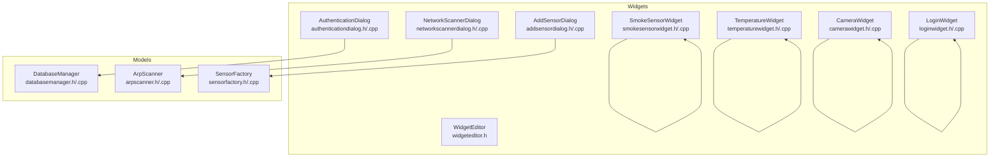

**Diagram sources**
- [smokesensorwidget.h:10-53](file://smokesensorwidget.h#L10-L53)
- [smokesensorwidget.cpp:157-237](file://smokesensorwidget.cpp#L157-L237)
- [temperaturewidget.h:11-54](file://temperaturewidget.h#L11-L54)
- [temperaturewidget.cpp:148-227](file://temperaturewidget.cpp#L148-L227)
- [camerawidget.h:9-40](file://camerawidget.h#L9-L40)
- [camerawidget.cpp:85-180](file://camerawidget.cpp#L85-L180)
- [loginwidget.h:8-22](file://loginwidget.h#L8-L22)
- [loginwidget.cpp:10-97](file://loginwidget.cpp#L10-L97)
- [authenticationdialog.h:14-47](file://authenticationdialog.h#L14-L47)
- [authenticationdialog.cpp:14-41](file://authenticationdialog.cpp#L14-L41)
- [networkscannerdialog.h:14-57](file://networkscannerdialog.h#L14-L57)
- [networkscannerdialog.cpp:16-45](file://networkscannerdialog.cpp#L16-L45)
- [addsensordialog.h:10-30](file://addsensordialog.h#L10-L30)
- [addsensordialog.cpp:12-21](file://addsensordialog.cpp#L12-L21)
- [widgeteditor.h:20-41](file://widgeteditor.h#L20-L41)

**Section sources**
- [smokesensorwidget.h:10-53](file://smokesensorwidget.h#L10-L53)
- [temperaturewidget.h:11-54](file://temperaturewidget.h#L11-L54)
- [camerawidget.h:9-40](file://camerawidget.h#L9-L40)
- [loginwidget.h:8-22](file://loginwidget.h#L8-L22)
- [authenticationdialog.h:14-47](file://authenticationdialog.h#L14-L47)
- [networkscannerdialog.h:14-57](file://networkscannerdialog.h#L14-L57)
- [addsensordialog.h:10-30](file://addsensordialog.h#L10-L30)
- [widgeteditor.h:20-41](file://widgeteditor.h#L20-L41)

## Core Components
This section summarizes the primary UI components and their responsibilities.

- SmokeSensorWidget: Displays smoke concentration with dynamic charts, severity states, and threshold visualization. Provides simulated updates and reset capabilities.
- TemperatureWidget: Displays temperature history with dynamic charts, severity states, and threshold visualization. Provides simulated updates and reset capabilities.
- CameraWidget: Renders a still image with overlay controls for record, snapshot, fullscreen, reload, edit, and close actions.
- LoginWidget: Provides username/password inputs and a login action with Enter-key support.
- AuthenticationDialog: Full-screen authentication dialog with role hints, error feedback, and database-backed authentication.
- NetworkScannerDialog: Scans LAN for known Raspberry Pi devices, displays status, and allows selection for connection.
- AddSensorDialog: Allows selecting sensor type and naming, generating a SensorConfig suitable for creation.
- WidgetEditor: Edits widget configuration (name, type, thresholds, unit, enabled) with a typed configuration model.

**Section sources**
- [smokesensorwidget.h:10-53](file://smokesensorwidget.h#L10-L53)
- [temperaturewidget.h:11-54](file://temperaturewidget.h#L11-L54)
- [camerawidget.h:9-40](file://camerawidget.h#L9-L40)
- [loginwidget.h:8-22](file://loginwidget.h#L8-L22)
- [authenticationdialog.h:14-47](file://authenticationdialog.h#L14-L47)
- [networkscannerdialog.h:14-57](file://networkscannerdialog.h#L14-L57)
- [addsensordialog.h:10-30](file://addsensordialog.h#L10-L30)
- [widgeteditor.h:10-41](file://widgeteditor.h#L10-L41)

## Architecture Overview
The UI components integrate with supporting models and services:
- DatabaseManager powers AuthenticationDialog user lookup and authentication.
- ArpScanner powers NetworkScannerDialog device discovery.
- SensorFactory supports AddSensorDialog sensor type and defaults.
- WidgetEditor uses a typed configuration model for editing.

```mermaid
classDiagram
class SmokeSensorWidget {
+enum Severity
+SmokeSensorWidget(parent)
+editButton() QPushButton*
+closeButton() QPushButton*
+currentSummary() QString
+currentValue() int
+severity() Severity
+simulateStep() void
+resetSensor() void
+setTitle(title) void
+setResizable(enabled) void
-refreshUi() void
-setSeverity(severity) void
}
class TemperatureWidget {
+enum Severity
+TemperatureWidget(parent)
+editButton() QPushButton*
+closeButton() QPushButton*
+currentSummary() QString
+currentValue() int
+severity() Severity
+simulateStep() void
+resetSensor() void
+setTitle(title) void
+setResizable(enabled) void
-refreshUi() void
-setSeverity(severity) void
}
class CameraWidget {
+CameraWidget(parent)
+editButton() QPushButton*
+closeButton() QPushButton*
+reloadButton() QPushButton*
+snapshotButton() QPushButton*
+fullscreenButton() QPushButton*
+recordButton() QPushButton*
+currentFrame() QPixmap
+reloadFrame() bool
+isRecording() bool
+setTitle(title) void
+setResizable(enabled) void
}
class LoginWidget {
+LoginWidget(parent)
+username() QString
+password() QString
+loginButton() QPushButton*
}
class AuthenticationDialog {
+AuthenticationDialog(dbManager,parent)
+authenticatedUser() User
-onLoginClicked() void
-onCancelClicked() void
-onInputChanged() void
-showError(message) void
-clearError() void
-updateUserInfo(username) void
-setupUi() void
-paintEvent(event) void
}
class NetworkScannerDialog {
+NetworkScannerDialog(parent)
+~NetworkScannerDialog()
+selectedDevices() QVector<NetworkDevice>
-onScanClicked() void
-onConnectClicked() void
-onDeviceFound(device) void
-onScanProgress(current,total) void
-onScanFinished(devices) void
-onScanError(error) void
-onDeviceItemChanged(item) void
-onSelectAllClicked() void
-onDeselectAllClicked() void
-updateStatusLabel() void
-setupUi() void
-displayKnownRaspberryPiList() void
-updateRaspberryPiInList(device) void
-addDeviceToList(device) void
-formatDeviceInfo(device) QString
-getSignalIcon(rssi) QString
}
class AddSensorDialog {
+AddSensorDialog(parent)
+getSensorConfig() SensorConfig
-onSensorTypeSelected() void
-onAccept() void
-setupUi() void
}
class WidgetEditor {
+WidgetEditor(config,parent,cameraMode)
+getConfig() WidgetConfig
-setupUi() void
}
class DatabaseManager
class ArpScanner
class SensorFactory
AuthenticationDialog --> DatabaseManager : "uses"
NetworkScannerDialog --> ArpScanner : "uses"
AddSensorDialog --> SensorFactory : "uses"
```

**Diagram sources**
- [smokesensorwidget.h:10-53](file://smokesensorwidget.h#L10-L53)
- [smokesensorwidget.cpp:157-378](file://smokesensorwidget.cpp#L157-L378)
- [temperaturewidget.h:11-54](file://temperaturewidget.h#L11-L54)
- [temperaturewidget.cpp:148-368](file://temperaturewidget.cpp#L148-L368)
- [camerawidget.h:9-40](file://camerawidget.h#L9-L40)
- [camerawidget.cpp:85-249](file://camerawidget.cpp#L85-L249)
- [loginwidget.h:8-22](file://loginwidget.h#L8-L22)
- [loginwidget.cpp:10-113](file://loginwidget.cpp#L10-L113)
- [authenticationdialog.h:14-47](file://authenticationdialog.h#L14-L47)
- [authenticationdialog.cpp:14-249](file://authenticationdialog.cpp#L14-L249)
- [networkscannerdialog.h:14-57](file://networkscannerdialog.h#L14-L57)
- [networkscannerdialog.cpp:16-433](file://networkscannerdialog.cpp#L16-L433)
- [addsensordialog.h:10-30](file://addsensordialog.h#L10-L30)
- [addsensordialog.cpp:12-148](file://addsensordialog.cpp#L12-L148)
- [widgeteditor.h:20-41](file://widgeteditor.h#L20-L41)

## Detailed Component Analysis

### SmokeSensorWidget API
- Purpose: Visualize smoke sensor readings with dynamic charts, severity indicators, and threshold overlays.
- Key methods:
  - Accessors: editButton(), closeButton(), currentSummary(), currentValue(), severity()
  - Behavior: simulateStep(), resetSensor(), setTitle(title), setResizable(enabled)
- Threshold visualization:
  - Internal thresholds define Warning and Alarm severity boundaries.
  - Chart widget draws horizontal threshold lines and colored segments based on values.
- Real-time binding:
  - A timer triggers periodic updates; values are appended and capped to a rolling window.
- Signal-slot connections:
  - Timer timeout connects to internal lambda invoking simulateStep().
- Property bindings:
  - Title label, state label, and chart widget are updated via refreshUi().

Usage example (conceptual):
- Instantiate, add to a layout, connect edit/close buttons to handlers, and rely on automatic updates.

**Section sources**
- [smokesensorwidget.h:10-53](file://smokesensorwidget.h#L10-L53)
- [smokesensorwidget.cpp:157-378](file://smokesensorwidget.cpp#L157-L378)

#### SmokeSensorWidget Class Diagram
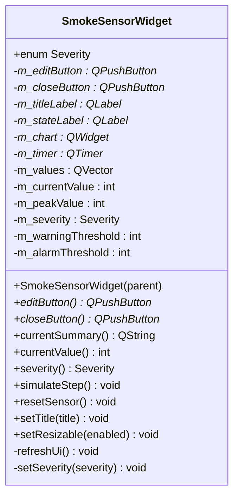

**Diagram sources**
- [smokesensorwidget.h:10-53](file://smokesensorwidget.h#L10-L53)

### TemperatureWidget API
- Purpose: Visualize temperature sensor readings with dynamic charts, severity indicators, and threshold overlays.
- Key methods:
  - Accessors: editButton(), closeButton(), currentSummary(), currentValue(), severity()
  - Behavior: simulateStep(), resetSensor(), setTitle(title), setResizable(enabled)
- Threshold visualization:
  - Internal thresholds define Warning and Alarm severity boundaries.
  - Chart widget draws horizontal threshold lines and colored segments based on values.
- Real-time binding:
  - A timer triggers periodic updates; values are appended and capped to a rolling window.
- Signal-slot connections:
  - Timer timeout connects to internal lambda invoking simulateStep().
- Property bindings:
  - Title label, state label, and chart widget are updated via refreshUi().

Usage example (conceptual):
- Instantiate, add to a layout, connect edit/close buttons to handlers, and rely on automatic updates.

**Section sources**
- [temperaturewidget.h:11-54](file://temperaturewidget.h#L11-L54)
- [temperaturewidget.cpp:148-368](file://temperaturewidget.cpp#L148-L368)

#### TemperatureWidget Class Diagram
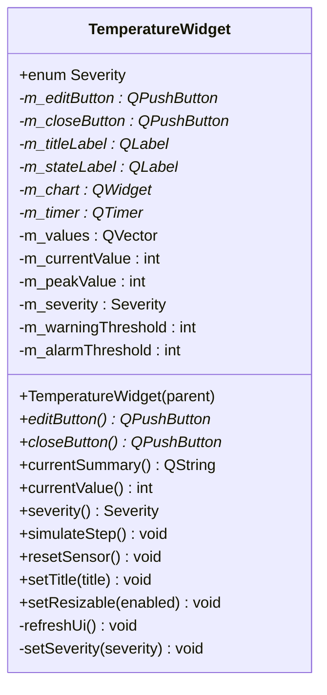

**Diagram sources**
- [temperaturewidget.h:11-54](file://temperaturewidget.h#L11-L54)

### CameraWidget API
- Purpose: Display a camera image with overlay controls for recording, snapshot, fullscreen, reload, edit, and close.
- Key methods:
  - Accessors: editButton(), closeButton(), reloadButton(), snapshotButton(), fullscreenButton(), recordButton()
  - State: currentFrame(), reloadFrame(), isRecording(), setTitle(title), setResizable(enabled)
- Image loading:
  - Loads a fallback asset with multiple resolution attempts; sets a scaled pixmap to an image label.
- Overlay controls:
  - Record button is checkable and styled differently when checked.
- Property bindings:
  - Title label and image label are updated via setters.

Usage example (conceptual):
- Instantiate, add to a layout, connect overlay buttons to handlers, and optionally trigger reloadFrame() to refresh the image.

**Section sources**
- [camerawidget.h:9-40](file://camerawidget.h#L9-L40)
- [camerawidget.cpp:85-249](file://camerawidget.cpp#L85-L249)

#### CameraWidget Class Diagram
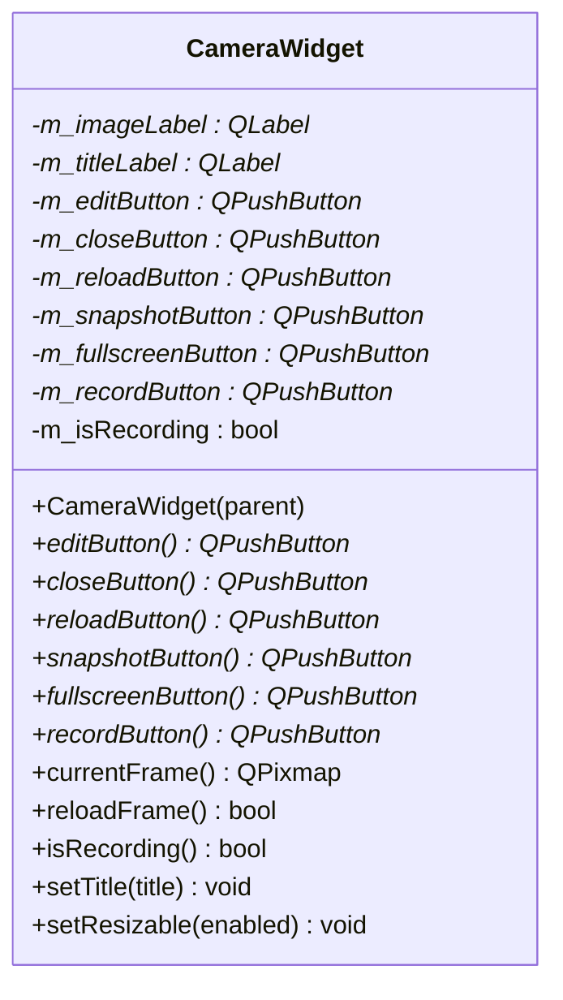

**Diagram sources**
- [camerawidget.h:9-40](file://camerawidget.h#L9-L40)

### LoginWidget API
- Purpose: Provide a minimal login panel with username and password fields and a login action.
- Key methods:
  - Accessors: username(), password(), loginButton()
- Behavior:
  - Connects Enter key events from inputs to trigger the login button click.
- Property bindings:
  - Stylesheet applied for consistent look-and-feel.

Usage example (conceptual):
- Instantiate, add to a layout, connect loginButton clicked signal to a handler that validates credentials.

**Section sources**
- [loginwidget.h:8-22](file://loginwidget.h#L8-L22)
- [loginwidget.cpp:10-113](file://loginwidget.cpp#L10-L113)

#### LoginWidget Class Diagram
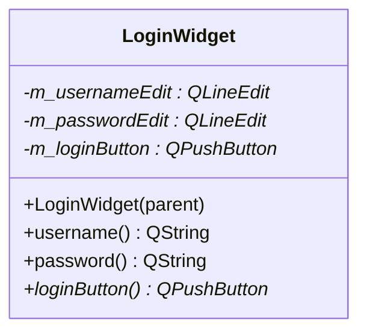

**Diagram sources**
- [loginwidget.h:8-22](file://loginwidget.h#L8-L22)

### AuthenticationDialog API
- Purpose: Full-screen authentication dialog with role hints, error feedback, and database-backed authentication.
- Key methods:
  - Accessors: authenticatedUser()
  - Slots: onLoginClicked(), onCancelClicked(), onInputChanged(), updateUserInfo(username)
  - Internals: showError(message), clearError(), setupUi(), paintEvent(event)
- Signal-slot connections:
  - DatabaseManager emits authenticationFailed; dialog subscribes to show errors.
  - LineEdits emit textChanged and returnPressed; dialog enables/disables login and triggers validation.
- Property bindings:
  - Error label toggled visible/invisible; role label shows detected role when username exists.

Usage example (conceptual):
- Construct with DatabaseManager*, showModal, then read authenticatedUser() after accept().

**Section sources**
- [authenticationdialog.h:14-47](file://authenticationdialog.h#L14-L47)
- [authenticationdialog.cpp:14-249](file://authenticationdialog.cpp#L14-L249)

#### AuthenticationDialog Class Diagram
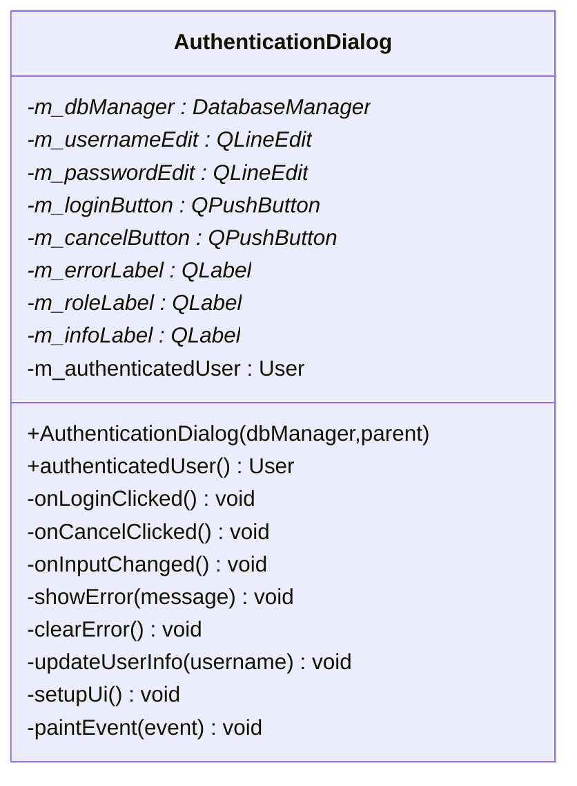

**Diagram sources**
- [authenticationdialog.h:14-47](file://authenticationdialog.h#L14-L47)

### NetworkScannerDialog API
- Purpose: Scan LAN for known Raspberry Pi devices, present status, and allow selection for connection.
- Key methods:
  - Accessors: selectedDevices()
  - Slots: onScanClicked(), onConnectClicked(), onDeviceFound(device), onScanProgress(current,total), onScanFinished(devices), onScanError(error), onDeviceItemChanged(item), onSelectAllClicked(), onDeselectAllClicked(), updateStatusLabel()
  - Internals: setupUi(), displayKnownRaspberryPiList(), updateRaspberryPiInList(device), addDeviceToList(device), formatDeviceInfo(device), getSignalIcon(rssi)
- Signal-slot connections:
  - ArpScanner emits deviceFound, scanProgress, scanFinished, scanError; dialog subscribes to update UI and lists.
- Property bindings:
  - Progress bar, status label, connect button enable/disable, and list items reflect scan state and selections.

Usage example (conceptual):
- Construct, start scanning, select devices, then accept to retrieve selectedDevices().

**Section sources**
- [networkscannerdialog.h:14-57](file://networkscannerdialog.h#L14-L57)
- [networkscannerdialog.cpp:16-433](file://networkscannerdialog.cpp#L16-L433)

#### NetworkScannerDialog Class Diagram
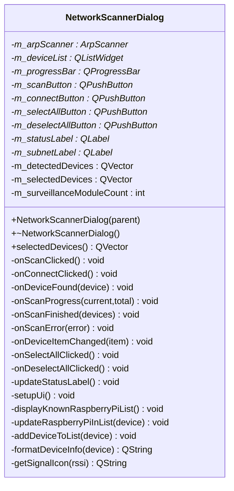

**Diagram sources**
- [networkscannerdialog.h:14-57](file://networkscannerdialog.h#L14-L57)

### AddSensorDialog API
- Purpose: Select sensor type and name, returning a SensorConfig for creation.
- Key methods:
  - Accessors: getSensorConfig()
  - Slots: onSensorTypeSelected(), onAccept()
  - Internals: setupUi()
- Signal-slot connections:
  - List selection changed triggers placeholder update; accept validates name and returns defaults.
- Property bindings:
  - Selected type drives default name/unit/thresholds; name field defaults if empty on accept.

Usage example (conceptual):
- Construct, showModal, then read getSensorConfig() after accept().

**Section sources**
- [addsensordialog.h:10-30](file://addsensordialog.h#L10-L30)
- [addsensordialog.cpp:12-148](file://addsensordialog.cpp#L12-L148)

#### AddSensorDialog Class Diagram
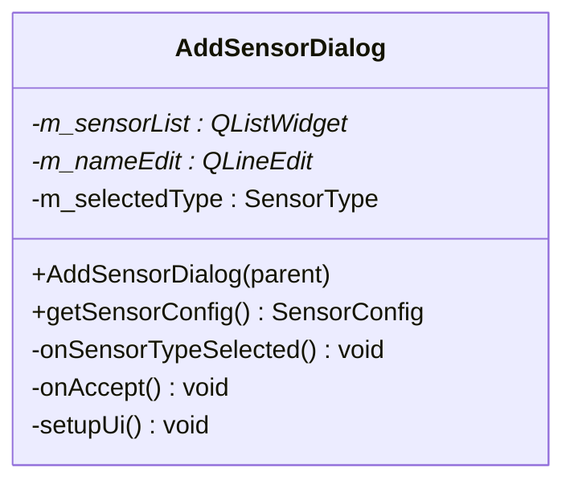

**Diagram sources**
- [addsensordialog.h:10-30](file://addsensordialog.h#L10-L30)

### WidgetEditor API
- Purpose: Edit widget configuration (id, name, type, warningThreshold, alarmThreshold, unit, enabled).
- Key methods:
  - Accessors: getConfig()
  - Internals: setupUi()
- Property bindings:
  - Uses typed configuration model WidgetConfig for editing and retrieval.

Usage example (conceptual):
- Construct with existing WidgetConfig, showModal, then read getConfig() after accept().

**Section sources**
- [widgeteditor.h:20-41](file://widgeteditor.h#L20-L41)

#### WidgetEditor Class Diagram
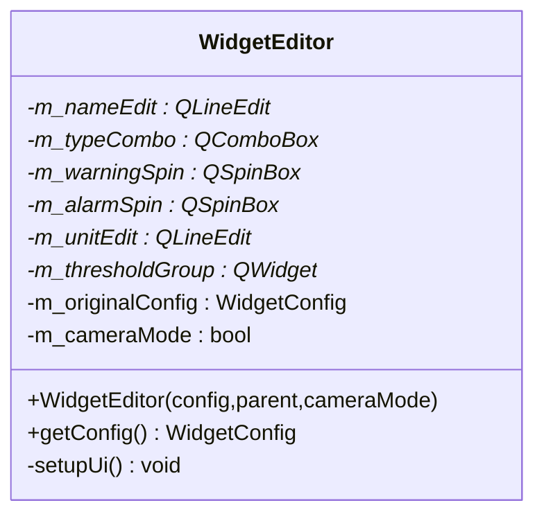

**Diagram sources**
- [widgeteditor.h:20-41](file://widgeteditor.h#L20-L41)

## Architecture Overview
The following sequence diagram illustrates the authentication flow from user input to session initiation.

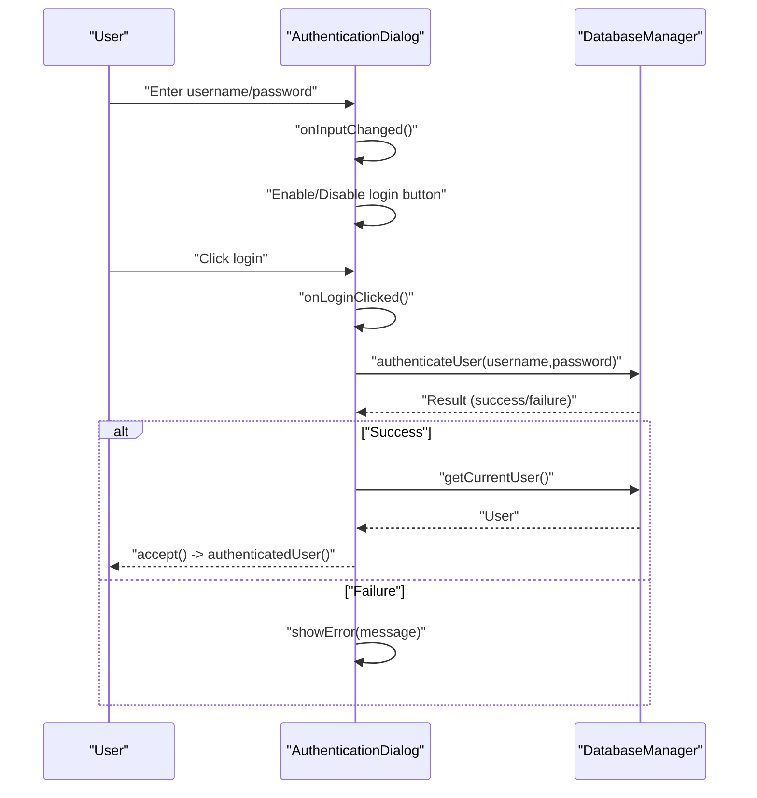

**Diagram sources**
- [authenticationdialog.cpp:178-194](file://authenticationdialog.cpp#L178-L194)
- [authenticationdialog.cpp:39-41](file://authenticationdialog.cpp#L39-L41)

## Detailed Component Analysis

### SmokeSensorWidget and TemperatureWidget: Real-Time Data Binding and Threshold Visualization
- Real-time updates:
  - Both widgets use a QTimer to periodically call simulateStep(), which adjusts current value with noise and clamps it to a range.
  - Values are appended to a rolling vector; older entries are removed to maintain window size.
- Threshold visualization:
  - Charts draw horizontal threshold lines and segment colors based on current and neighboring values.
  - Severity is recalculated and reflected in the state label’s text and background.
- Signal-slot connections:
  - Timer timeout invokes simulateStep() internally.
- Property bindings:
  - Title and state label are updated via refreshUi().

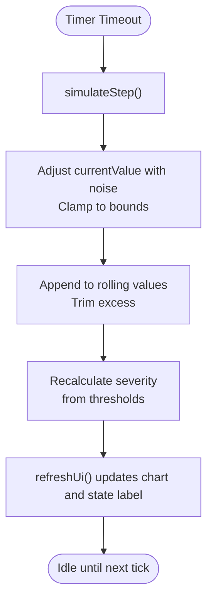

**Diagram sources**
- [smokesensorwidget.cpp:280-307](file://smokesensorwidget.cpp#L280-L307)
- [temperaturewidget.cpp:270-297](file://temperaturewidget.cpp#L270-L297)

**Section sources**
- [smokesensorwidget.cpp:280-378](file://smokesensorwidget.cpp#L280-L378)
- [temperaturewidget.cpp:270-368](file://temperaturewidget.cpp#L270-L368)

### CameraWidget: Stream Management and Display Controls
- Initialization:
  - Builds a stacked layout with an image label and an overlay widget containing control buttons.
  - Loads a fallback image from multiple candidate paths.
- Controls:
  - Record button is checkable and styled differently when recording.
  - Reload, snapshot, fullscreen, edit, and close buttons are exposed via accessors.
- Display:
  - currentFrame() returns the current pixmap; reloadFrame() replaces it with a fresh load.

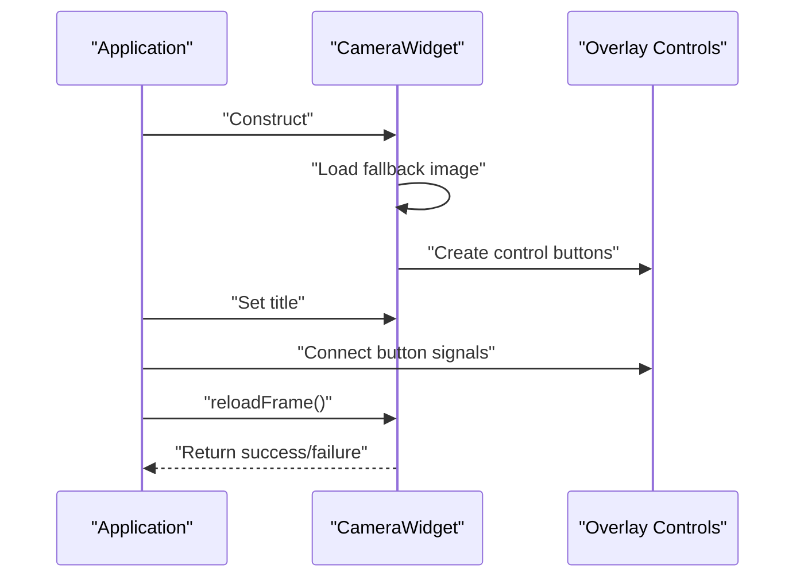

**Diagram sources**
- [camerawidget.cpp:85-249](file://camerawidget.cpp#L85-L249)

**Section sources**
- [camerawidget.cpp:85-249](file://camerawidget.cpp#L85-L249)

### LoginWidget and AuthenticationDialog: Validation, Role Hints, and Session Initiation
- LoginWidget:
  - Exposes username(), password(), and loginButton().
  - Connects Enter key events to trigger login.
- AuthenticationDialog:
  - Subscribes to DatabaseManager authentication failures.
  - Enables login only when both fields are non-empty.
  - Shows detected role when username is found; displays errors via styled label.

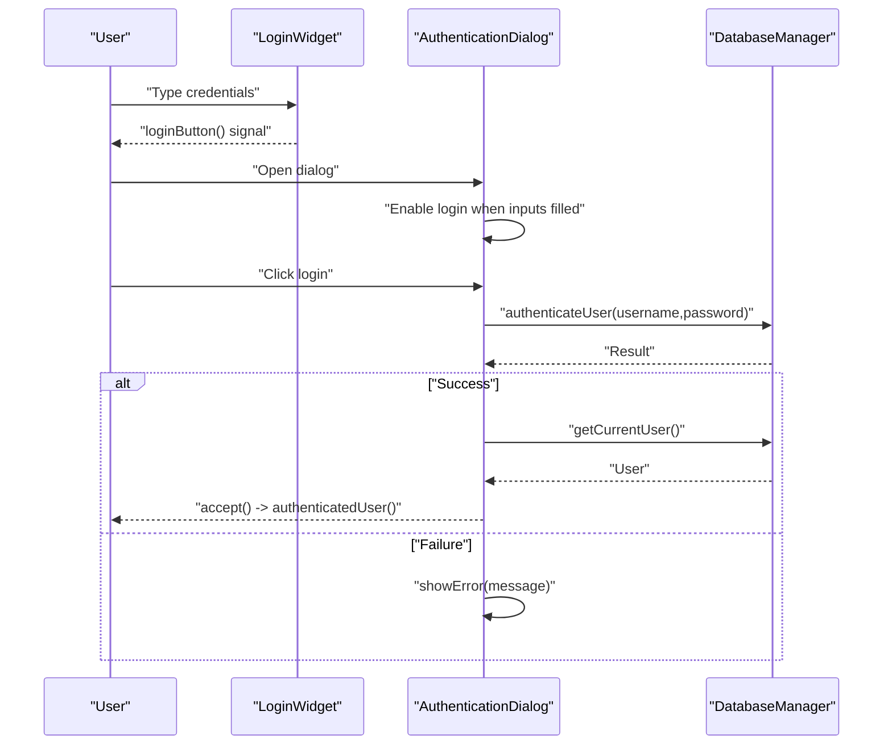

**Diagram sources**
- [loginwidget.cpp:95-97](file://loginwidget.cpp#L95-L97)
- [authenticationdialog.cpp:178-194](file://authenticationdialog.cpp#L178-L194)
- [authenticationdialog.cpp:39-41](file://authenticationdialog.cpp#L39-L41)

**Section sources**
- [loginwidget.cpp:95-113](file://loginwidget.cpp#L95-L113)
- [authenticationdialog.cpp:178-249](file://authenticationdialog.cpp#L178-L249)

### NetworkScannerDialog: Device Discovery and Selection
- Discovery:
  - Starts scanning known devices; emits deviceFound, scanProgress, scanFinished, scanError.
- UI:
  - Displays a list of discovered devices with online/offline status and selectable checkboxes.
  - Updates progress bar and status label during scan.
- Selection:
  - onConnectClicked() collects checked items into selectedDevices().

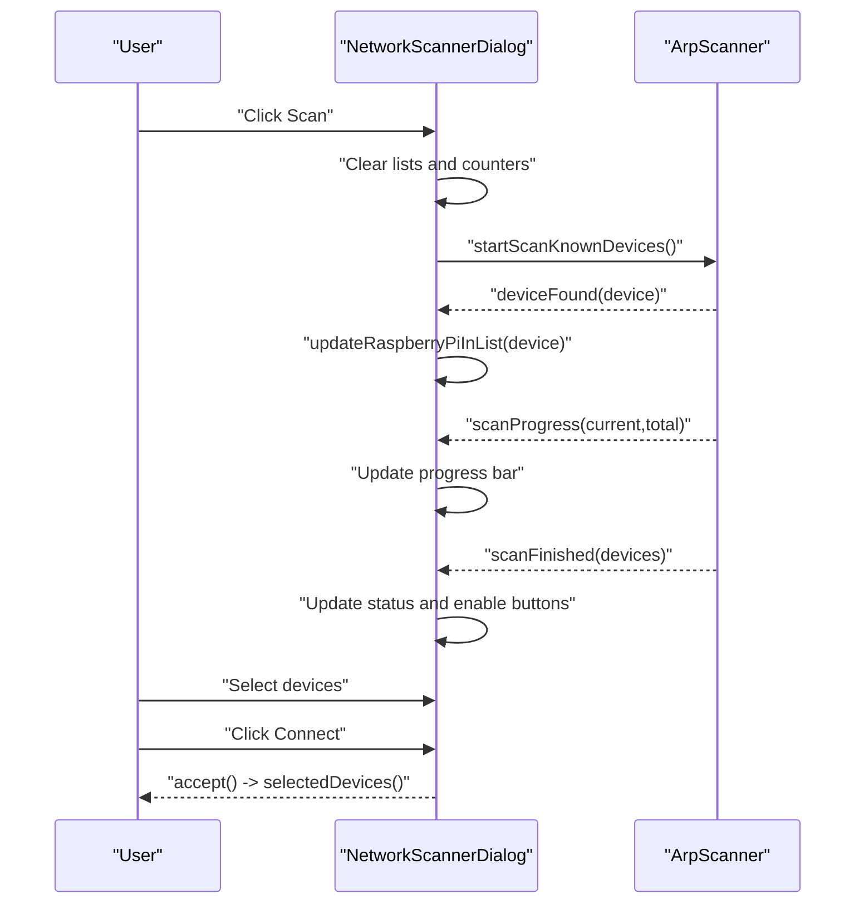

**Diagram sources**
- [networkscannerdialog.cpp:198-222](file://networkscannerdialog.cpp#L198-L222)
- [networkscannerdialog.cpp:248-261](file://networkscannerdialog.cpp#L248-L261)
- [networkscannerdialog.cpp:291-308](file://networkscannerdialog.cpp#L291-L308)
- [networkscannerdialog.cpp:300-322](file://networkscannerdialog.cpp#L300-L322)
- [networkscannerdialog.cpp:224-246](file://networkscannerdialog.cpp#L224-L246)

**Section sources**
- [networkscannerdialog.cpp:198-433](file://networkscannerdialog.cpp#L198-L433)

### AddSensorDialog: Sensor Type Selection and Configuration Generation
- Selection:
  - Provides a list of sensor types with icons; selection updates the placeholder name.
- Accept:
  - Ensures a non-empty name; generates SensorConfig with defaults for unit and thresholds.

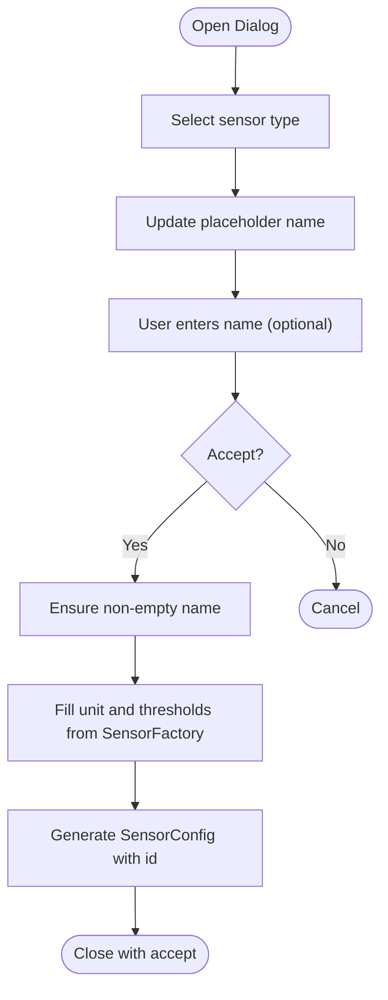

**Diagram sources**
- [addsensordialog.cpp:117-132](file://addsensordialog.cpp#L117-L132)
- [addsensordialog.cpp:134-147](file://addsensordialog.cpp#L134-L147)

**Section sources**
- [addsensordialog.cpp:117-148](file://addsensordialog.cpp#L117-L148)

### WidgetEditor: Drag-and-Drop Configuration Editing
- Purpose:
  - Edits a typed configuration (WidgetConfig) for widgets, including thresholds and units.
- Behavior:
  - Exposes getConfig() after modal acceptance.

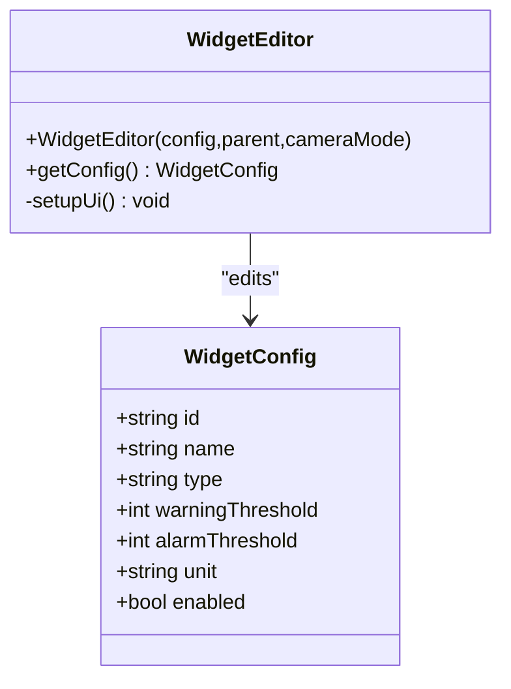

**Diagram sources**
- [widgeteditor.h:10-18](file://widgeteditor.h#L10-L18)
- [widgeteditor.h:20-41](file://widgeteditor.h#L20-L41)

**Section sources**
- [widgeteditor.h:10-41](file://widgeteditor.h#L10-L41)

## Dependency Analysis
- AuthenticationDialog depends on DatabaseManager for user authentication and current user retrieval.
- NetworkScannerDialog depends on ArpScanner for device discovery and status reporting.
- AddSensorDialog depends on SensorFactory for default sensor metadata.
- SmokeSensorWidget and TemperatureWidget are self-contained, relying on internal timers and rendering logic.
- CameraWidget relies on asset loading and overlay controls.

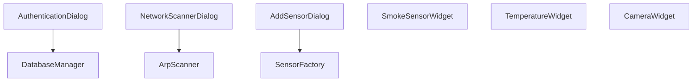

**Diagram sources**
- [authenticationdialog.cpp:39-41](file://authenticationdialog.cpp#L39-L41)
- [networkscannerdialog.cpp:33-41](file://networkscannerdialog.cpp#L33-L41)
- [addsensordialog.cpp:12-21](file://addsensordialog.cpp#L12-L21)

**Section sources**
- [authenticationdialog.cpp:39-41](file://authenticationdialog.cpp#L39-L41)
- [networkscannerdialog.cpp:33-41](file://networkscannerdialog.cpp#L33-L41)
- [addsensordialog.cpp:12-21](file://addsensordialog.cpp#L12-L21)

## Performance Considerations
- Timers in SmokeSensorWidget and TemperatureWidget drive periodic updates; ensure intervals balance responsiveness and CPU usage.
- Chart rendering in both sensor widgets is lightweight but redraws on resize; avoid excessive resizes to prevent unnecessary repaints.
- CameraWidget loads images from assets; caching and avoiding repeated reloads improves performance.
- NetworkScannerDialog updates UI frequently during scans; keep list updates efficient and avoid blocking the event loop.

## Troubleshooting Guide
- AuthenticationDialog shows errors via a styled label; ensure DatabaseManager emits authenticationFailed to trigger error display.
- If login button remains disabled, verify that both username and password fields emit textChanged and onInputChanged is connected.
- NetworkScannerDialog status label indicates scan progress and outcomes; check scanFinished and onScanError branches for diagnostics.
- CameraWidget reloadFrame() returns false if the image fails to load; verify asset paths and permissions.

**Section sources**
- [authenticationdialog.cpp:209-218](file://authenticationdialog.cpp#L209-L218)
- [authenticationdialog.cpp:201-207](file://authenticationdialog.cpp#L201-L207)
- [networkscannerdialog.cpp:291-330](file://networkscannerdialog.cpp#L291-L330)
- [camerawidget.cpp:225-234](file://camerawidget.cpp#L225-L234)

## Conclusion
The SurveillanceQT UI components provide a cohesive set of widgets and dialogs for monitoring environmental sensors, managing cameras, authenticating users, discovering network devices, configuring sensors, and editing widget settings. Their APIs emphasize straightforward property accessors, signal-slot connections, and clear configuration models, enabling robust integration and extensible behavior.