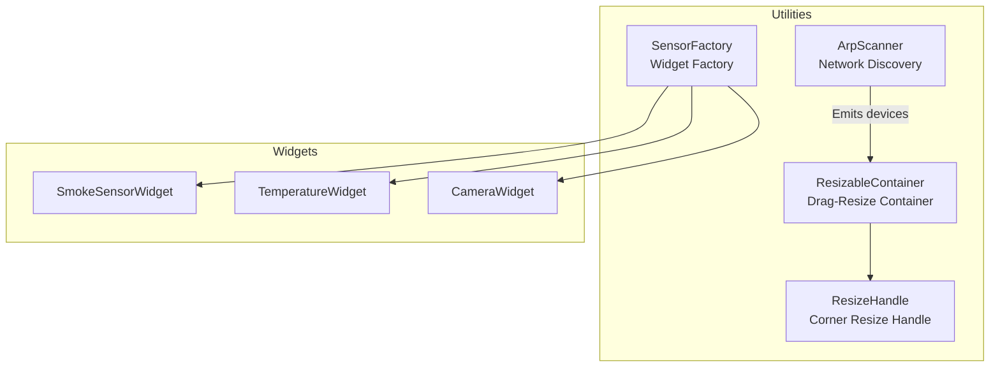
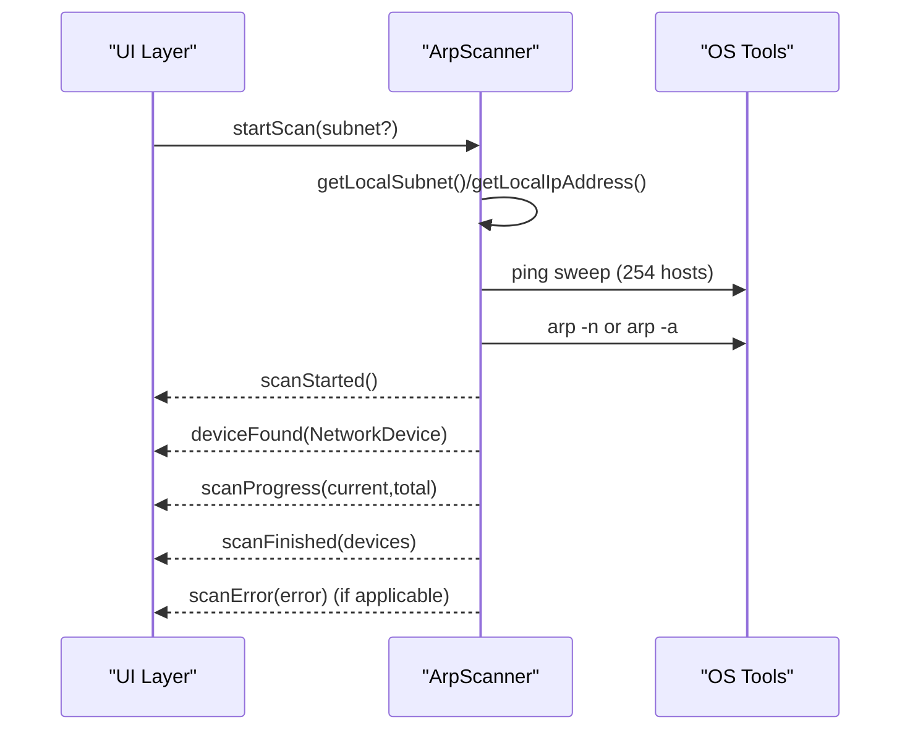
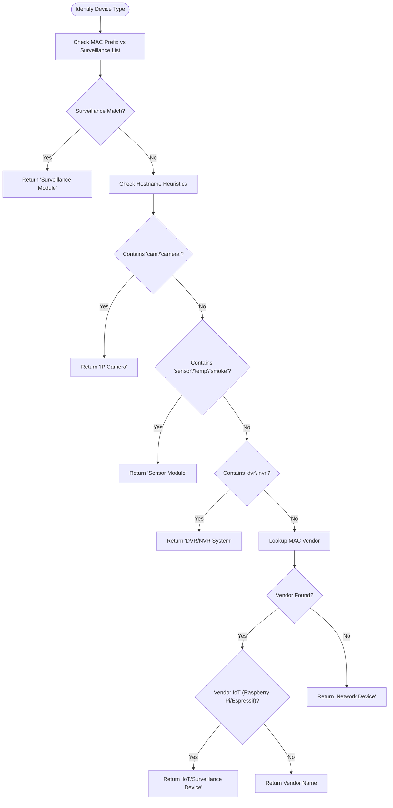
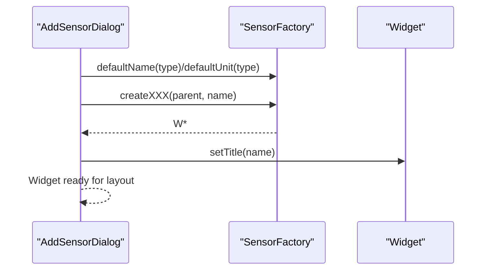
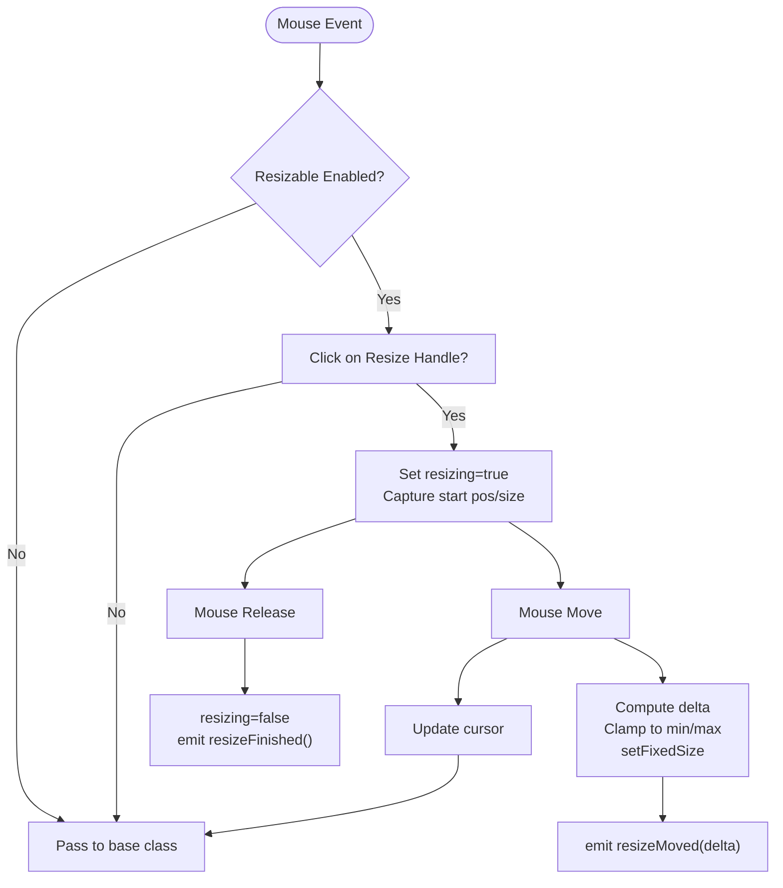
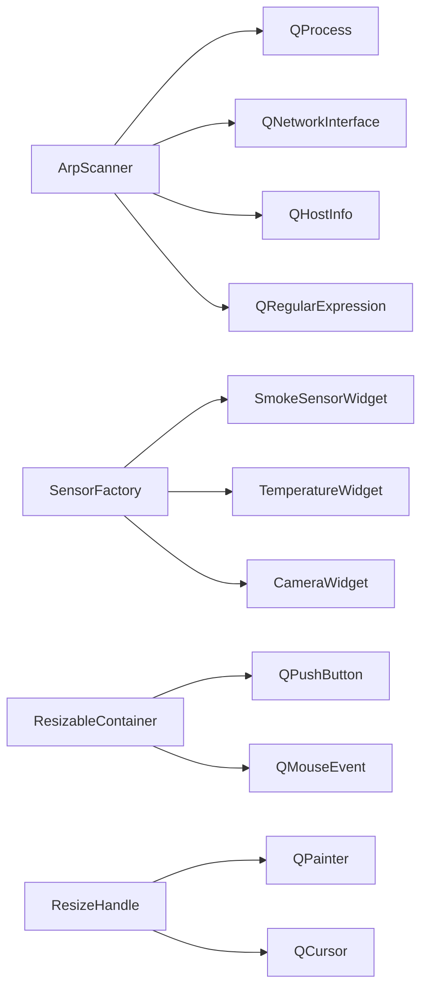

# Utility Classes API

<cite>
**Referenced Files in This Document**
- [arpscanner.h](file://arpscanner.h)
- [arpscanner.cpp](file://arpscanner.cpp)
- [sensorfactory.h](file://sensorfactory.h)
- [sensorfactory.cpp](file://sensorfactory.cpp)
- [resizablehelper.h](file://resizablehelper.h)
- [resizablehelper.cpp](file://resizablehelper.cpp)
- [resizehandle.h](file://resizehandle.h)
- [resizehandle.cpp](file://resizehandle.cpp)
- [smokesensorwidget.h](file://smokesensorwidget.h)
- [temperaturewidget.h](file://temperaturewidget.h)
- [camerawidget.h](file://camerawidget.h)
</cite>

## Table of Contents
1. [Introduction](#introduction)
2. [Project Structure](#project-structure)
3. [Core Components](#core-components)
4. [Architecture Overview](#architecture-overview)
5. [Detailed Component Analysis](#detailed-component-analysis)
6. [Dependency Analysis](#dependency-analysis)
7. [Performance Considerations](#performance-considerations)
8. [Troubleshooting Guide](#troubleshooting-guide)
9. [Conclusion](#conclusion)

## Introduction
This document provides detailed API documentation for utility classes that support the main system functionality. It covers:
- ArpScanner: network device discovery, scanning methods, device classification algorithms, and ARP table analysis functions
- SensorFactory: factory pattern implementation for creating specialized sensor widgets
- ResizableHelper and ResizeHandle: drag-and-drop interface resizing utilities
It includes method signatures, parameter specifications, return values, integration examples, and usage patterns for extending functionality and customizing behavior.

## Project Structure
The utility classes are implemented as standalone components with minimal coupling to the rest of the application. They are designed to be reusable across different contexts.

**Diagram sources**
- [arpscanner.h:31-87](file://arpscanner.h#L31-L87)
- [sensorfactory.h:28-40](file://sensorfactory.h#L28-L40)
- [resizablehelper.h:8-37](file://resizablehelper.h#L8-L37)
- [resizehandle.h:6-33](file://resizehandle.h#L6-L33)
- [smokesensorwidget.h:10-52](file://smokesensorwidget.h#L10-L52)
- [temperaturewidget.h:11-53](file://temperaturewidget.h#L11-L53)
- [camerawidget.h:9-39](file://camerawidget.h#L9-L39)

**Section sources**
- [arpscanner.h:1-88](file://arpscanner.h#L1-L88)
- [sensorfactory.h:1-41](file://sensorfactory.h#L1-L41)
- [resizablehelper.h:1-38](file://resizablehelper.h#L1-L38)
- [resizehandle.h:1-34](file://resizehandle.h#L1-L34)

## Core Components
This section summarizes the primary responsibilities and APIs of each utility class.

- ArpScanner
  - Purpose: Discover network devices via ping sweep and ARP table parsing; classify devices; emit progress and results
  - Key methods: startScan, startScanKnownDevices, stopScan, isScanning, detectedDevices, surveillanceModules, knownRaspberryPiDevices, getLocalSubnet, getLocalIpAddress, getKnownRaspberryPiList, getRaspberryPiDescriptions
  - Signals: scanStarted, scanProgress, deviceFound, scanFinished, scanError, raspberryPiFound
  - Classification: MAC prefix matching, hostname heuristics, vendor lookup, known Raspberry Pi list

- SensorFactory
  - Purpose: Factory for creating specialized sensor widgets with consistent defaults and metadata
  - Key methods: sensorTypeToString, sensorTypeToIcon, defaultName, defaultUnit, defaultWarningThreshold, defaultAlarmThreshold, createSmokeSensor, createTemperatureSensor, createCamera
  - Returns: Widget pointers configured with default thresholds and titles

- ResizableContainer
  - Purpose: Frame container enabling drag-to-resize behavior with min/max constraints
  - Key methods: setResizable, setMinSize, setMaxSize, resizeEvent, mousePressEvent, mouseMoveEvent, mouseReleaseEvent
  - Behavior: Shows a resize handle in the bottom-right corner; enforces size bounds

- ResizeHandle
  - Purpose: Corner resize handle widget emitting resize events
  - Key methods: mousePressEvent, mouseMoveEvent, mouseReleaseEvent, paintEvent
  - Signals: resizeStarted, resizeMoved, resizeFinished
  - Cursor behavior: Adjusts based on handle position

**Section sources**
- [arpscanner.h:31-87](file://arpscanner.h#L31-L87)
- [sensorfactory.h:28-40](file://sensorfactory.h#L28-L40)
- [resizablehelper.h:8-37](file://resizablehelper.h#L8-L37)
- [resizehandle.h:6-33](file://resizehandle.h#L6-L33)

## Architecture Overview
The utility classes integrate with the broader system as follows:
- ArpScanner emits discovered devices and progress updates; consumers can filter surveillance modules or known Raspberry Pi devices
- SensorFactory centralizes widget creation and default configurations; integrates with AddSensorDialog and other UI flows
- ResizableContainer and ResizeHandle provide a reusable drag-to-resize UI pattern applicable to various widgets

**Diagram sources**
- [arpscanner.cpp:108-131](file://arpscanner.cpp#L108-L131)
- [arpscanner.cpp:386-415](file://arpscanner.cpp#L386-L415)
- [arpscanner.cpp:334-384](file://arpscanner.cpp#L334-L384)

## Detailed Component Analysis

### ArpScanner API
- Constructor and lifecycle
  - ArpScanner(QObject* parent = nullptr)
  - ~ArpScanner()
- Scanning control
  - void startScan(const QString& subnet = QString())
  - void startScanKnownDevices()
  - void stopScan()
  - bool isScanning() const
- Data accessors
  - QVector<NetworkDevice> detectedDevices() const
  - QVector<NetworkDevice> surveillanceModules() const
  - QVector<NetworkDevice> knownRaspberryPiDevices() const
- Static helpers
  - static QString getLocalSubnet()
  - static QString getLocalIpAddress()
  - static QVector<KnownRaspberryPi> getKnownRaspberryPiList()
  - static QMap<QString, QString> getRaspberryPiDescriptions()
- Signals
  - scanStarted()
  - scanProgress(int current, int total)
  - deviceFound(const NetworkDevice&)
  - scanFinished(const QVector<NetworkDevice>&)
  - scanError(const QString&)
  - raspberryPiFound(const NetworkDevice&, const KnownRaspberryPi&)

Implementation highlights:
- Uses QProcess to execute platform-specific ping and arp commands
- Parses ARP output with regular expressions to extract IP/MAC pairs
- Resolves hostnames via QHostInfo
- Classifies devices using:
  - MAC address prefix lists for surveillance equipment
  - Hostname heuristics (camera, sensor, DVR/NVR keywords)
  - Vendor lookup for IoT devices (e.g., Raspberry Pi, Espressif)
- Known Raspberry Pi list drives targeted scans and emits dedicated signals

Usage patterns:
- Start a full subnet scan; listen to scanProgress and deviceFound; collect results via detectedDevices()
- Filter surveillanceModules() for dashboard or module management views
- Use startScanKnownDevices() for targeted discovery of predefined nodes

Integration examples:
- Connect to scanStarted() to enable UI scanning indicators
- Connect to deviceFound() to incrementally render discovered devices
- Connect to scanFinished() to finalize UI state and persist results

Extending functionality:
- Add new MAC prefixes to SURVEILLANCE_MAC_PREFIXES
- Extend identifyDeviceType() with additional hostname or vendor rules
- Expand KNOWN_RASPBERRY_PI with new nodes and descriptions

**Section sources**
- [arpscanner.h:31-87](file://arpscanner.h#L31-L87)
- [arpscanner.cpp:83-106](file://arpscanner.cpp#L83-L106)
- [arpscanner.cpp:108-131](file://arpscanner.cpp#L108-L131)
- [arpscanner.cpp:174-196](file://arpscanner.cpp#L174-L196)
- [arpscanner.cpp:145-172](file://arpscanner.cpp#L145-L172)
- [arpscanner.cpp:198-210](file://arpscanner.cpp#L198-L210)
- [arpscanner.cpp:281-316](file://arpscanner.cpp#L281-L316)
- [arpscanner.cpp:334-384](file://arpscanner.cpp#L334-L384)
- [arpscanner.cpp:426-462](file://arpscanner.cpp#L426-L462)
- [arpscanner.cpp:464-517](file://arpscanner.cpp#L464-L517)

#### ArpScanner Device Classification Flow

**Diagram sources**
- [arpscanner.cpp:426-462](file://arpscanner.cpp#L426-L462)
- [arpscanner.cpp:464-517](file://arpscanner.cpp#L464-L517)

### SensorFactory API
- Enumerations and configuration
  - SensorType: Smoke, Temperature, Humidity, CO2, VOC, Camera
  - SensorConfig: id, name, type, warningThreshold, alarmThreshold, unit
- Metadata and defaults
  - static QString sensorTypeToString(SensorType)
  - static QString sensorTypeToIcon(SensorType)
  - static QString defaultName(SensorType)
  - static QString defaultUnit(SensorType)
  - static int defaultWarningThreshold(SensorType)
  - static int defaultAlarmThreshold(SensorType)
- Widget creation
  - static SmokeSensorWidget* createSmokeSensor(QWidget* parent, const QString& name)
  - static TemperatureWidget* createTemperatureSensor(QWidget* parent, const QString& name)
  - static CameraWidget* createCamera(QWidget* parent, const QString& name)

Behavior:
- Creates widget instances and sets titles
- Provides sensible defaults for thresholds and units per sensor type
- Centralizes icon and label mapping for UI consistency

Usage patterns:
- Populate selection lists with sensorTypeToIcon and sensorTypeToString
- Initialize dialogs with defaultName and defaultUnit
- On confirm, construct SensorConfig and create the appropriate widget via factory methods

Integration examples:
- AddSensorDialog uses SensorFactory to populate choices and initialize placeholders
- Dashboard widgets can be instantiated using factory methods for consistent behavior

Extending functionality:
- Add new SensorType variants and corresponding defaults
- Extend createXXX methods to support additional widget types

**Section sources**
- [sensorfactory.h:10-26](file://sensorfactory.h#L10-L26)
- [sensorfactory.h:28-40](file://sensorfactory.h#L28-L40)
- [sensorfactory.cpp:7-18](file://sensorfactory.cpp#L7-L18)
- [sensorfactory.cpp:20-31](file://sensorfactory.cpp#L20-L31)
- [sensorfactory.cpp:33-57](file://sensorfactory.cpp#L33-L57)
- [sensorfactory.cpp:59-81](file://sensorfactory.cpp#L59-L81)
- [sensorfactory.cpp:83-102](file://sensorfactory.cpp#L83-L102)

#### SensorFactory Widget Creation Sequence

**Diagram sources**
- [sensorfactory.cpp:83-102](file://sensorfactory.cpp#L83-L102)
- [sensorfactory.cpp:33-57](file://sensorfactory.cpp#L33-L57)

### ResizableHelper and ResizeHandle API
- ResizableContainer
  - Public methods: setResizable(bool), setMinSize(QSize), setMaxSize(QSize), resizeEvent(QResizeEvent*), mousePressEvent(QMouseEvent*), mouseMoveEvent(QMouseEvent*), mouseReleaseEvent(QMouseEvent*)
  - Behavior: Shows a resize handle in the bottom-right corner when enabled; enforces minimum and maximum sizes; updates handle position on resize
- ResizeHandle
  - Enum Position: TopLeft, TopRight, BottomLeft, BottomRight
  - Public methods: mousePressEvent(QMouseEvent*), mouseMoveEvent(QMouseEvent*), mouseReleaseEvent(QMouseEvent*), paintEvent(QPaintEvent*)
  - Signals: resizeStarted(), resizeMoved(const QPoint&), resizeFinished()
  - Behavior: Emits resize events; cursor changes based on handle position

Usage patterns:
- Wrap content widgets inside ResizableContainer
- Enable resizing via setResizable(true)
- Connect ResizeHandle signals to adjust parent widget geometry
- Use setMinSize/setMaxSize to constrain resizing

Integration examples:
- Dashboard widgets that support manual resizing
- Dialogs requiring flexible sizing

Extending functionality:
- Add support for additional corners or edges by extending ResizeHandle positions and updating cursor logic
- Integrate with layout managers for responsive behavior

**Section sources**
- [resizablehelper.h:8-37](file://resizablehelper.h#L8-L37)
- [resizablehelper.cpp:7-44](file://resizablehelper.cpp#L7-L44)
- [resizablehelper.cpp:46-68](file://resizablehelper.cpp#L46-L68)
- [resizablehelper.cpp:70-74](file://resizablehelper.cpp#L70-L74)
- [resizablehelper.cpp:76-81](file://resizablehelper.cpp#L76-L81)
- [resizablehelper.cpp:83-101](file://resizablehelper.cpp#L83-L101)
- [resizablehelper.cpp:103-128](file://resizablehelper.cpp#L103-L128)
- [resizablehelper.cpp:130-139](file://resizablehelper.cpp#L130-L139)
- [resizablehelper.cpp:141-149](file://resizablehelper.cpp#L141-L149)
- [resizehandle.h:6-33](file://resizehandle.h#L6-L33)
- [resizehandle.cpp:6-25](file://resizehandle.cpp#L6-L25)
- [resizehandle.cpp:27-53](file://resizehandle.cpp#L27-L53)
- [resizehandle.cpp:55-80](file://resizehandle.cpp#L55-L80)

#### ResizableContainer Drag-to-Resize Flow

**Diagram sources**
- [resizablehelper.cpp:83-101](file://resizablehelper.cpp#L83-L101)
- [resizablehelper.cpp:103-128](file://resizablehelper.cpp#L103-L128)
- [resizablehelper.cpp:130-139](file://resizablehelper.cpp#L130-L139)
- [resizehandle.cpp:27-53](file://resizehandle.cpp#L27-L53)

## Dependency Analysis
- ArpScanner depends on:
  - QProcess for ping and arp commands
  - QNetworkInterface and QHostInfo for local IP detection and hostname resolution
  - Regular expressions for ARP output parsing
- SensorFactory depends on:
  - Concrete widget headers (SmokeSensorWidget, TemperatureWidget, CameraWidget)
  - Enum SensorType for dispatch
- ResizableContainer depends on:
  - QPushButton for the resize handle
  - QMouseEvent handling for drag operations
- ResizeHandle depends on:
  - QPainter for visual rendering
  - QCursor for directional cursors

**Diagram sources**
- [arpscanner.cpp:3-7](file://arpscanner.cpp#L3-L7)
- [sensorfactory.cpp:3-5](file://sensorfactory.cpp#L3-L5)
- [resizablehelper.cpp:3-5](file://resizablehelper.cpp#L3-L5)
- [resizehandle.cpp:3-4](file://resizehandle.cpp#L3-L4)

**Section sources**
- [arpscanner.cpp:3-7](file://arpscanner.cpp#L3-L7)
- [sensorfactory.cpp:3-5](file://sensorfactory.cpp#L3-L5)
- [resizablehelper.cpp:3-5](file://resizablehelper.cpp#L3-L5)
- [resizehandle.cpp:3-4](file://resizehandle.cpp#L3-L4)

## Performance Considerations
- ArpScanner
  - Ping sweep targets 254 hosts; consider limiting scope or adding early termination conditions
  - ARP parsing runs after ping sweep; ensure timeouts are reasonable for network latency
  - Hostname resolution may block; consider asynchronous resolution or caching
- SensorFactory
  - Widget creation is lightweight; defaults are computed via switch statements
- ResizableHelper/ResizeHandle
  - Mouse event handling is O(1); cursor updates are frequent but inexpensive
  - Enforce min/max sizes to prevent excessive memory usage in large layouts

## Troubleshooting Guide
- ArpScanner
  - If getLocalSubnet() returns empty, verify network interfaces and permissions
  - If scanError is emitted, check platform-specific ping/arp availability
  - For missing devices, verify firewall rules and ARP cache freshness
- SensorFactory
  - Ensure widget headers are included before use
  - Validate SensorType values to avoid default case fallback
- ResizableHelper/ResizeHandle
  - If resizing does not work, confirm setResizable(true) and proper parent-child relationships
  - Verify mouse event propagation and transparency attributes

**Section sources**
- [arpscanner.cpp:281-316](file://arpscanner.cpp#L281-L316)
- [arpscanner.cpp:118-123](file://arpscanner.cpp#L118-L123)
- [resizablehelper.cpp:46-58](file://resizablehelper.cpp#L46-L58)
- [resizablehelper.cpp:83-101](file://resizablehelper.cpp#L83-L101)

## Conclusion
These utility classes provide robust, extensible foundations for network discovery, widget creation, and interactive resizing:
- ArpScanner offers comprehensive device discovery with configurable classification
- SensorFactory ensures consistent widget instantiation and configuration
- ResizableHelper and ResizeHandle deliver a polished, customizable resizing experience

They are designed for easy extension and integration into larger systems, with clear separation of concerns and well-defined APIs.