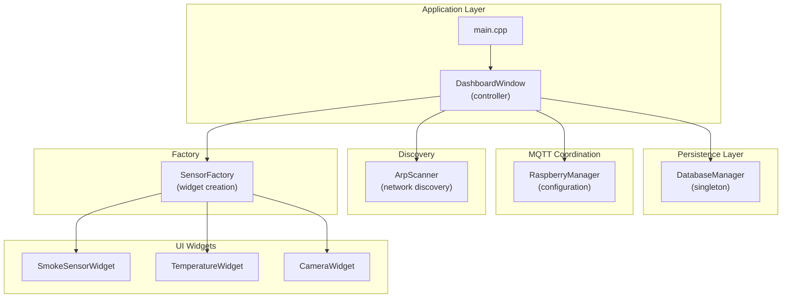
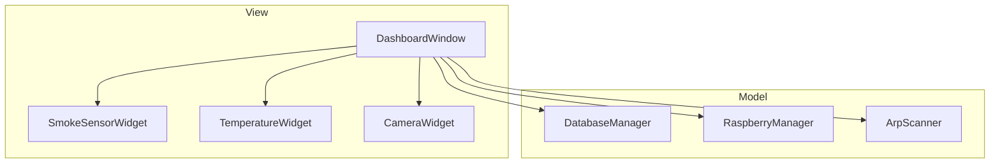
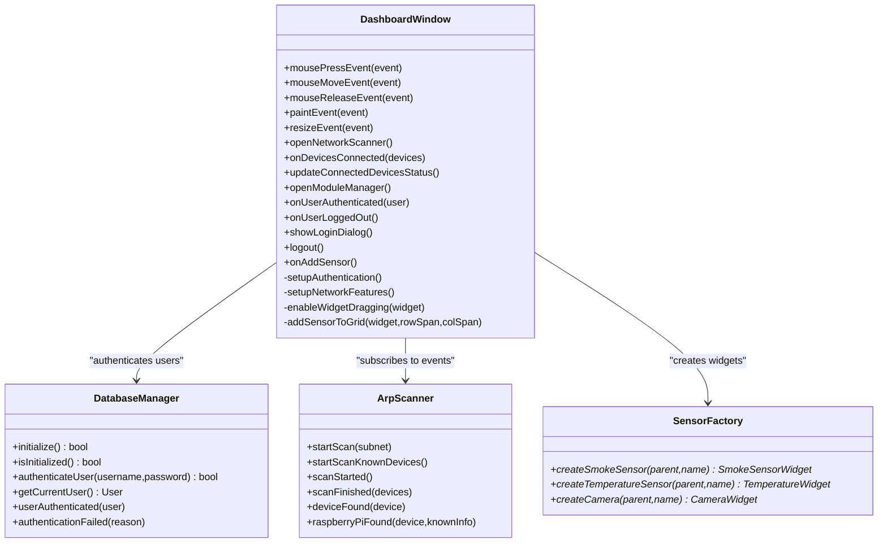
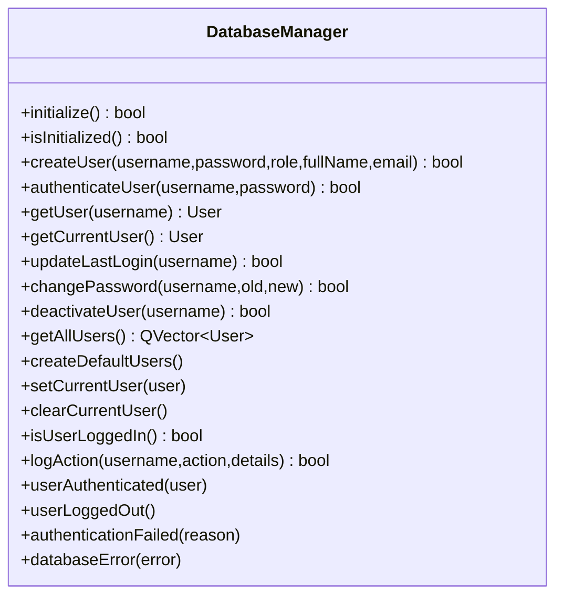
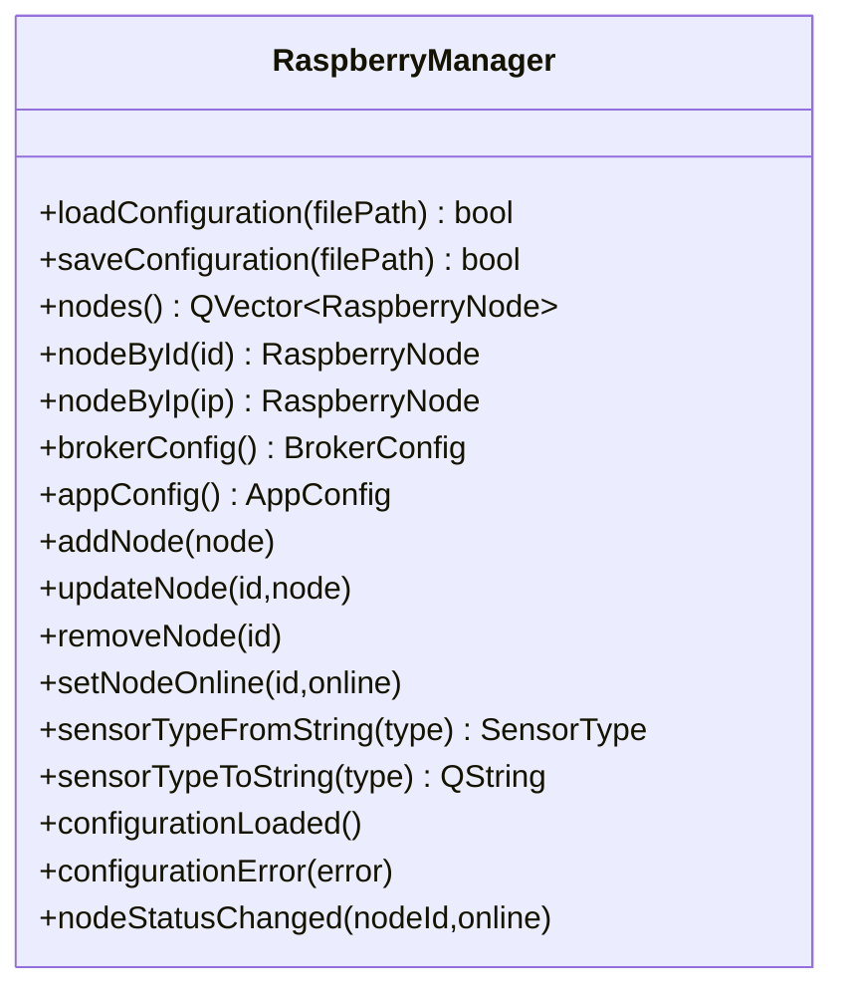
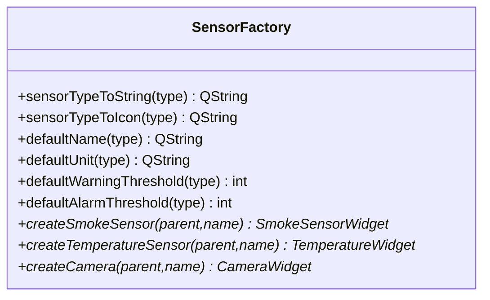
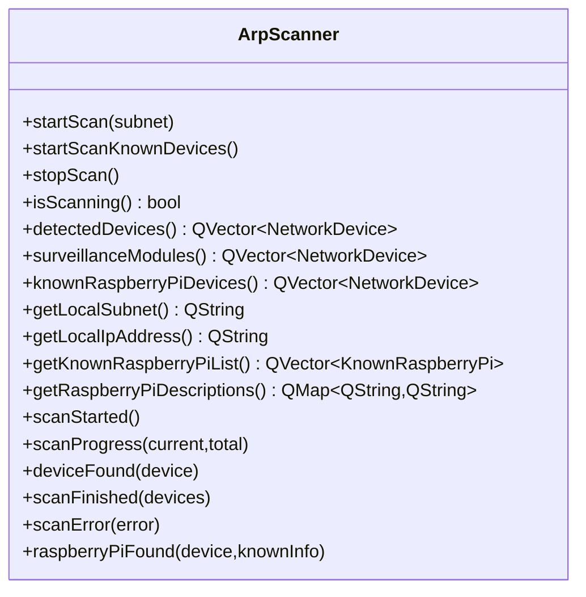
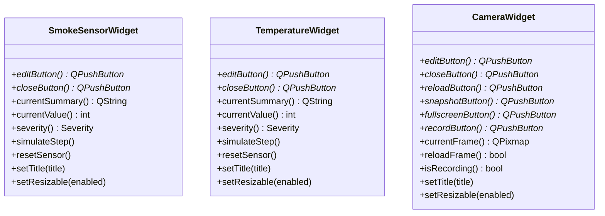
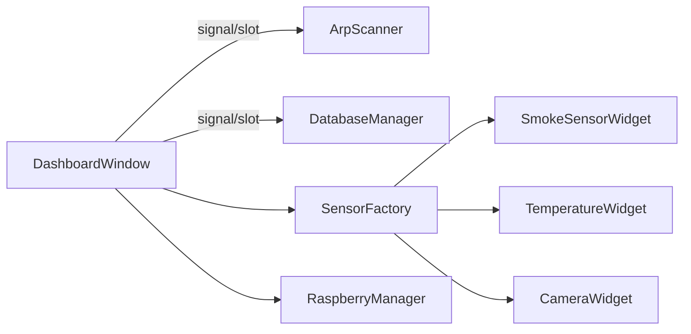

# Architecture Overview

<cite>
**Referenced Files in This Document**
- [main.cpp](file://main.cpp)
- [dashboardwindow.h](file://dashboardwindow.h)
- [dashboardwindow.cpp](file://dashboardwindow.cpp)
- [databasemanager.h](file://databasemanager.h)
- [databasemanager.cpp](file://databasemanager.cpp)
- [raspberrymanager.h](file://raspberrymanager.h)
- [raspberrymanager.cpp](file://raspberrymanager.cpp)
- [sensorfactory.h](file://sensorfactory.h)
- [sensorfactory.cpp](file://sensorfactory.cpp)
- [arpscanner.h](file://arpscanner.h)
- [arpscanner.cpp](file://arpscanner.cpp)
- [loginwidget.h](file://loginwidget.h)
- [smokesensorwidget.h](file://smokesensorwidget.h)
- [temperaturewidget.h](file://temperaturewidget.h)
- [camerawidget.h](file://camerawidget.h)
</cite>

## Table of Contents
1. [Introduction](#introduction)
2. [Project Structure](#project-structure)
3. [Core Components](#core-components)
4. [Architecture Overview](#architecture-overview)
5. [Detailed Component Analysis](#detailed-component-analysis)
6. [Dependency Analysis](#dependency-analysis)
7. [Performance Considerations](#performance-considerations)
8. [Troubleshooting Guide](#troubleshooting-guide)
9. [Conclusion](#conclusion)

## Introduction
This document presents the architecture of the SurveillanceQT system, a Qt-based monitoring dashboard designed for distributed sensor nodes. The system follows an MVC-inspired structure centered around a primary controller (DashboardWindow) that orchestrates UI composition, user authentication, and dynamic sensor widgets. Persistence is handled by a centralized DatabaseManager singleton, while MQTT coordination is delegated to RaspberryManager. Discovery and connectivity are managed by ArpScanner, and dynamic widget instantiation is performed by SensorFactory. The design leverages Qt’s signal/slot mechanism for decoupled communication and employs classic patterns such as Factory, Observer, and Singleton.

## Project Structure
The project is organized into cohesive modules:
- Application entry point and top-level controller
- Data persistence and user management
- MQTT configuration and node management
- Network discovery and device identification
- Widget factory and reusable UI components
- UI widgets for smoke, temperature, and camera sensors

**Diagram sources**
- [main.cpp:1-15](file://main.cpp#L1-L15)
- [dashboardwindow.h:19-99](file://dashboardwindow.h#L19-L99)
- [databasemanager.h:34-88](file://databasemanager.h#L34-L88)
- [raspberrymanager.h:63-107](file://raspberrymanager.h#L63-L107)
- [arpscanner.h:31-88](file://arpscanner.h#L31-L88)
- [sensorfactory.h:28-41](file://sensorfactory.h#L28-L41)
- [smokesensorwidget.h:10-53](file://smokesensorwidget.h#L10-L53)
- [temperaturewidget.h:11-54](file://temperaturewidget.h#L11-L54)
- [camerawidget.h:9-40](file://camerawidget.h#L9-L40)

**Section sources**
- [main.cpp:1-15](file://main.cpp#L1-L15)
- [dashboardwindow.h:19-99](file://dashboardwindow.h#L19-L99)

## Core Components
- DashboardWindow (Central Controller)
  - Orchestrates UI layout, drag-and-drop, edit modes, and bottom-bar status.
  - Manages authentication lifecycle and permissions.
  - Coordinates network scanning and module management.
  - References to widgets and containers for dynamic sensor grid.
  - Declares numerous slots for UI actions and integration events.

- DatabaseManager (Singleton)
  - Provides user authentication, session management, and audit logging.
  - Initializes database schema for supported drivers and creates default users.
  - Emits signals for authentication outcomes and database errors.

- RaspberryManager (Configuration Manager)
  - Loads/stores MQTT and application configuration from JSON.
  - Maintains lists of nodes and their sensors, with online status tracking.
  - Emits node status changes and configuration-related signals.

- SensorFactory (Factory Pattern)
  - Static factory methods to instantiate sensor widgets with default attributes.
  - Encapsulates defaults for units, thresholds, icons, and names per sensor type.

- ArpScanner (Network Discovery)
  - Scans LAN for devices, identifies known Raspberry Pi devices, and emits discovery events.
  - Supports progress reporting and error signaling.

**Section sources**
- [dashboardwindow.h:19-99](file://dashboardwindow.h#L19-L99)
- [databasemanager.h:34-88](file://databasemanager.h#L34-L88)
- [databasemanager.cpp:21-46](file://databasemanager.cpp#L21-L46)
- [raspberrymanager.h:63-107](file://raspberrymanager.h#L63-L107)
- [raspberrymanager.cpp:24-52](file://raspberrymanager.cpp#L24-L52)
- [sensorfactory.h:28-41](file://sensorfactory.h#L28-L41)
- [sensorfactory.cpp:83-103](file://sensorfactory.cpp#L83-L103)
- [arpscanner.h:31-88](file://arpscanner.h#L31-L88)
- [arpscanner.cpp:108-131](file://arpscanner.cpp#L108-L131)

## Architecture Overview
The system follows an MVC-inspired pattern:
- Model: DatabaseManager (user data, audit logs), RaspberryManager (node and sensor metadata), and ArpScanner (discovered devices).
- View: DashboardWindow composes and arranges UI widgets (SmokeSensorWidget, TemperatureWidget, CameraWidget) and manages their interactivity.
- Controller: DashboardWindow coordinates user actions, authentication, network scanning, and widget lifecycle.

**Diagram sources**
- [dashboardwindow.h:19-99](file://dashboardwindow.h#L19-L99)
- [databasemanager.h:34-88](file://databasemanager.h#L34-L88)
- [raspberrymanager.h:63-107](file://raspberrymanager.h#L63-L107)
- [arpscanner.h:31-88](file://arpscanner.h#L31-L88)
- [smokesensorwidget.h:10-53](file://smokesensorwidget.h#L10-L53)
- [temperaturewidget.h:11-54](file://temperaturewidget.h#L11-L54)
- [camerawidget.h:9-40](file://camerawidget.h#L9-L40)

## Detailed Component Analysis

### DashboardWindow (Central Controller)
- Responsibilities
  - Builds UI chrome, title bar, bottom bar, and dynamic sensor container.
  - Implements drag-and-drop and resizing for widgets.
  - Integrates authentication via LoginWidget and manages user roles and permissions.
  - Triggers network scans and opens module manager dialog.
  - Updates status indicators and handles widget edit/close actions.

- Interactions
  - Uses DatabaseManager for authentication and permission checks.
  - Subscribes to ArpScanner signals for discovered devices and updates UI accordingly.
  - Delegates widget creation to SensorFactory and places widgets in an absolute-positioned container.

**Diagram sources**
- [dashboardwindow.h:19-99](file://dashboardwindow.h#L19-L99)
- [databasemanager.h:34-88](file://databasemanager.h#L34-L88)
- [arpscanner.h:31-88](file://arpscanner.h#L31-L88)
- [sensorfactory.h:28-41](file://sensorfactory.h#L28-L41)

**Section sources**
- [dashboardwindow.h:19-99](file://dashboardwindow.h#L19-L99)
- [dashboardwindow.cpp:71-200](file://dashboardwindow.cpp#L71-L200)

### DatabaseManager (Singleton)
- Responsibilities
  - Initialize database connection and schema.
  - Manage user lifecycle: create, authenticate, update last login, change password, deactivate.
  - Provide audit logging and expose current user context.
  - Emit signals for authentication and database errors.

- Design Notes
  - Singleton pattern ensures a single persistence context across the application.
  - Uses driver-specific initialization and default user creation for SQLite; MySQL configuration is present for WAMP environments.

**Diagram sources**
- [databasemanager.h:34-88](file://databasemanager.h#L34-L88)

**Section sources**
- [databasemanager.h:34-88](file://databasemanager.h#L34-L88)
- [databasemanager.cpp:21-46](file://databasemanager.cpp#L21-L46)
- [databasemanager.cpp:117-135](file://databasemanager.cpp#L117-L135)
- [databasemanager.cpp:158-198](file://databasemanager.cpp#L158-L198)

### RaspberryManager (MQTT Configuration)
- Responsibilities
  - Load/save configuration from JSON, including broker settings and application behavior.
  - Maintain node list with sensors and online status.
  - Convert between string and enum sensor types.
  - Emit configuration and node status signals.

- Integration
  - Used by DashboardWindow to configure MQTT connectivity and manage nodes.

**Diagram sources**
- [raspberrymanager.h:63-107](file://raspberrymanager.h#L63-L107)

**Section sources**
- [raspberrymanager.h:63-107](file://raspberrymanager.h#L63-L107)
- [raspberrymanager.cpp:24-52](file://raspberrymanager.cpp#L24-L52)
- [raspberrymanager.cpp:181-200](file://raspberrymanager.cpp#L181-L200)

### SensorFactory (Factory Pattern)
- Responsibilities
  - Provide static factory methods to create sensor widgets.
  - Supply defaults for names, units, thresholds, and icons based on sensor type.

- Usage
  - DashboardWindow uses SensorFactory to instantiate widgets and populate the dashboard.

**Diagram sources**
- [sensorfactory.h:28-41](file://sensorfactory.h#L28-L41)

**Section sources**
- [sensorfactory.h:28-41](file://sensorfactory.h#L28-L41)
- [sensorfactory.cpp:83-103](file://sensorfactory.cpp#L83-L103)

### ArpScanner (Network Discovery)
- Responsibilities
  - Scan LAN for devices, resolve hostnames, and identify known Raspberry Pi devices.
  - Emit progress, completion, and discovery signals.

- Integration
  - DashboardWindow subscribes to ArpScanner signals to update connected devices and status panels.

**Diagram sources**
- [arpscanner.h:31-88](file://arpscanner.h#L31-L88)

**Section sources**
- [arpscanner.h:31-88](file://arpscanner.h#L31-L88)
- [arpscanner.cpp:108-131](file://arpscanner.cpp#L108-L131)

### UI Widgets (View Layer)
- SmokeSensorWidget, TemperatureWidget, CameraWidget
  - Each widget exposes edit/close controls and state-related methods.
  - Widgets integrate with DashboardWindow for drag-and-drop and resizing.

**Diagram sources**
- [smokesensorwidget.h:10-53](file://smokesensorwidget.h#L10-L53)
- [temperaturewidget.h:11-54](file://temperaturewidget.h#L11-L54)
- [camerawidget.h:9-40](file://camerawidget.h#L9-L40)

**Section sources**
- [smokesensorwidget.h:10-53](file://smokesensorwidget.h#L10-L53)
- [temperaturewidget.h:11-54](file://temperaturewidget.h#L11-L54)
- [camerawidget.h:9-40](file://camerawidget.h#L9-L40)

## Dependency Analysis
- Coupling and Cohesion
  - DashboardWindow has high cohesion around UI orchestration and integrates with DatabaseManager, RaspberryManager, ArpScanner, and SensorFactory.
  - SensorFactory encapsulates widget creation logic, reducing coupling in DashboardWindow.
  - DatabaseManager and RaspberryManager are cohesive around their respective domains.

- Signals and Slots
  - Qt signals propagate events from ArpScanner and DatabaseManager to DashboardWindow, enabling loose coupling.
  - Example: ArpScanner emits scan progress and finished events; DatabaseManager emits authentication outcomes.

- External Dependencies
  - Qt SQL for database abstraction and QMYSQL for MySQL connectivity.
  - JSON parsing for configuration management.
  - Network scanning utilities for ARP and ping operations.

**Diagram sources**
- [dashboardwindow.h:19-99](file://dashboardwindow.h#L19-L99)
- [arpscanner.h:53-59](file://arpscanner.h#L53-L59)
- [databasemanager.h:72-77](file://databasemanager.h#L72-L77)
- [sensorfactory.h:28-41](file://sensorfactory.h#L28-L41)
- [raspberrymanager.h:89-93](file://raspberrymanager.h#L89-L93)

**Section sources**
- [dashboardwindow.h:19-99](file://dashboardwindow.h#L19-L99)
- [arpscanner.h:53-59](file://arpscanner.h#L53-L59)
- [databasemanager.h:72-77](file://databasemanager.h#L72-L77)
- [raspberrymanager.h:89-93](file://raspberrymanager.h#L89-L93)

## Performance Considerations
- Signal emission frequency: ArpScanner’s progress timer emits periodic updates; tune interval to balance responsiveness and overhead.
- Database operations: Batch writes for audit logs and avoid synchronous queries on the UI thread.
- Widget rendering: Limit frequent re-layouts during drag-and-drop; defer expensive operations until idle.
- MQTT configuration: Keep reconnect intervals reasonable to prevent resource exhaustion while ensuring timely recovery.

## Troubleshooting Guide
- Authentication failures
  - Verify database initialization and default user creation.
  - Confirm credentials and active status; check emitted authentication failure reasons.

- Database errors
  - Inspect emitted database error signals and driver configuration.
  - Ensure MySQL service is reachable and credentials are correct.

- Network scanning issues
  - Validate subnet detection and permissions for network operations.
  - Monitor scan error signals and ensure timers are properly started/stopped.

- Widget lifecycle
  - Confirm SensorFactory defaults align with expected units and thresholds.
  - Ensure DashboardWindow enables dragging and resizing appropriately.

**Section sources**
- [databasemanager.cpp:158-198](file://databasemanager.cpp#L158-L198)
- [databasemanager.cpp:48-65](file://databasemanager.cpp#L48-L65)
- [arpscanner.cpp:108-131](file://arpscanner.cpp#L108-L131)
- [arpscanner.cpp:133-139](file://arpscanner.cpp#L133-L139)

## Conclusion
SurveillanceQT applies a clean separation of concerns with DashboardWindow as the central controller, DatabaseManager as the persistence singleton, RaspberryManager for MQTT configuration, SensorFactory for widget creation, and ArpScanner for discovery. Qt’s signals/slots facilitate observer-style communication, while Factory and Singleton patterns support modularity and controlled access. The architecture balances maintainability and extensibility, with clear system boundaries and observable integration points.