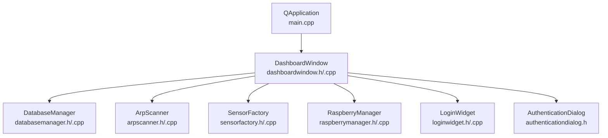
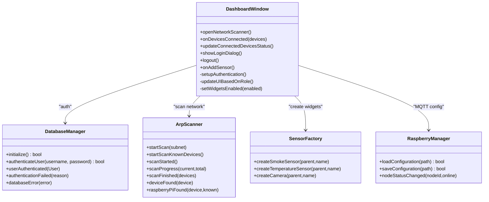
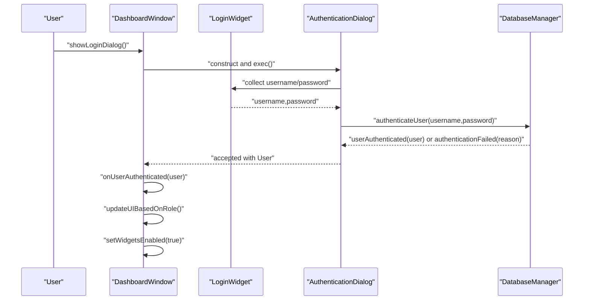
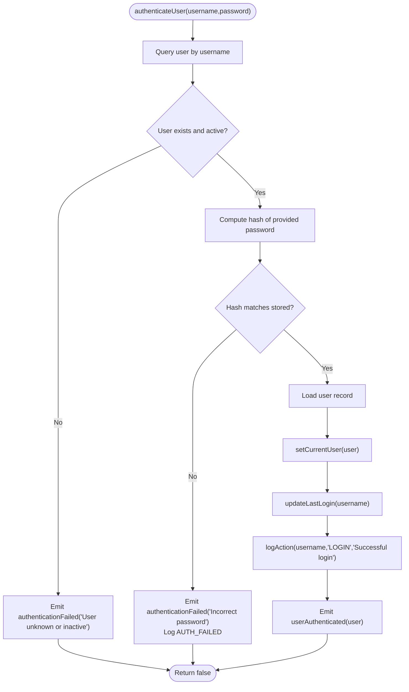
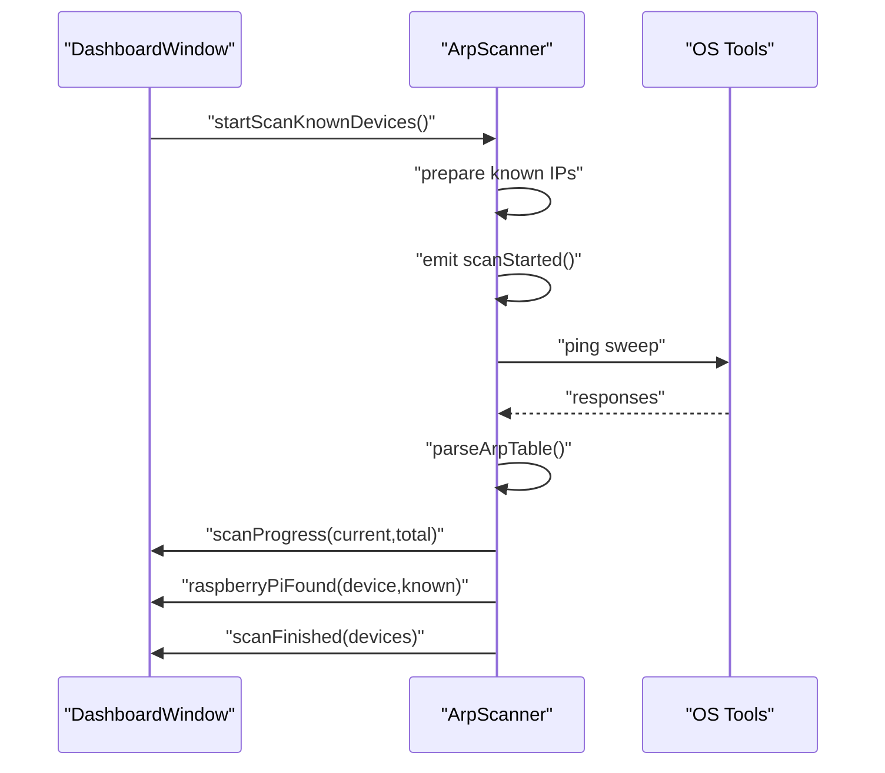
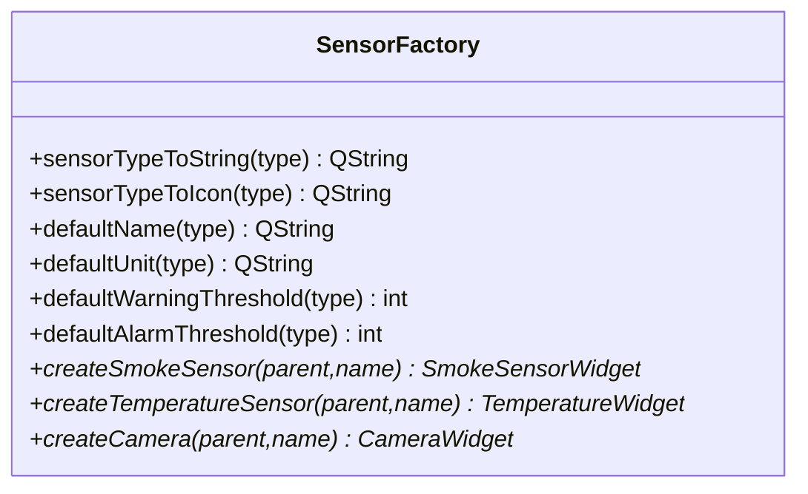
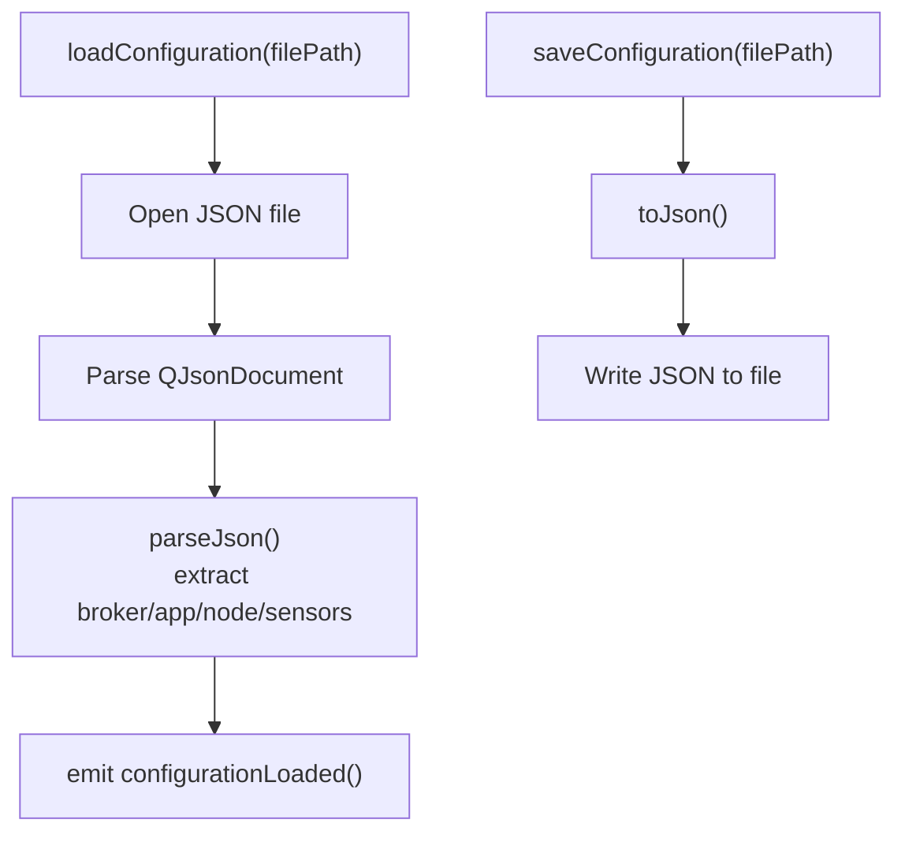
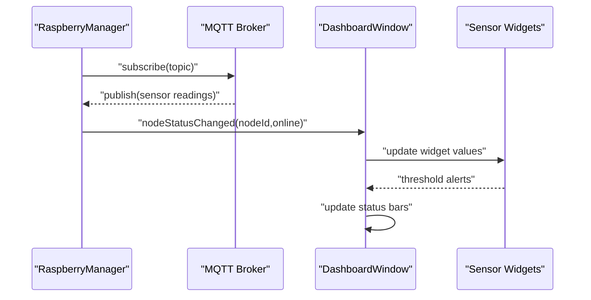
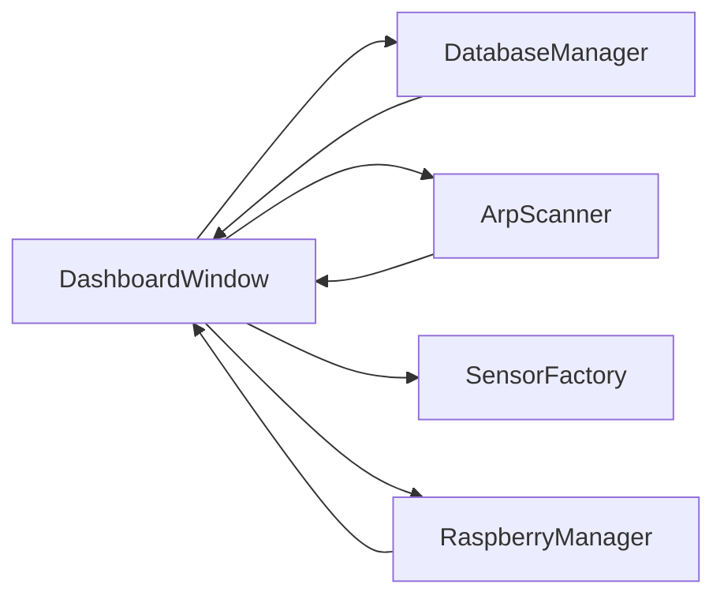

# Component Interactions

<cite>
**Referenced Files in This Document**
- [main.cpp](file://main.cpp)
- [dashboardwindow.h](file://dashboardwindow.h)
- [dashboardwindow.cpp](file://dashboardwindow.cpp)
- [databasemanager.h](file://databasemanager.h)
- [databasemanager.cpp](file://databasemanager.cpp)
- [authenticationdialog.h](file://authenticationdialog.h)
- [loginwidget.h](file://loginwidget.h)
- [loginwidget.cpp](file://loginwidget.cpp)
- [arpscanner.h](file://arpscanner.h)
- [arpscanner.cpp](file://arpscanner.cpp)
- [sensorfactory.h](file://sensorfactory.h)
- [sensorfactory.cpp](file://sensorfactory.cpp)
- [raspberrymanager.h](file://raspberrymanager.h)
- [raspberrymanager.cpp](file://raspberrymanager.cpp)
</cite>

## Table of Contents
1. [Introduction](#introduction)
2. [Project Structure](#project-structure)
3. [Core Components](#core-components)
4. [Architecture Overview](#architecture-overview)
5. [Detailed Component Analysis](#detailed-component-analysis)
6. [Dependency Analysis](#dependency-analysis)
7. [Performance Considerations](#performance-considerations)
8. [Troubleshooting Guide](#troubleshooting-guide)
9. [Conclusion](#conclusion)

## Introduction
This document explains the component interactions within the SurveillanceQT architecture, focusing on the central coordinator DashboardWindow and its managed subsystems: DatabaseManager, RaspberryManager, SensorFactory, and ArpScanner. It documents the event-driven Qt signals-and-slots communication model, data flow from sensor data collection through MQTT topics to widget updates, user authentication via database verification, and network discovery results to UI updates. Sequence diagrams illustrate typical workflows for user login, sensor data processing, and network scanning operations. Error propagation, exception handling, and component lifecycle management are addressed to support robust operation.

## Project Structure
The application initializes the DashboardWindow as the main UI surface and composes several specialized managers and factories to orchestrate authentication, sensor widgets, network scanning, and Raspberry Pi configuration. The structure emphasizes separation of concerns and Qt’s event-driven paradigm.

**Diagram sources**
- [main.cpp:5-14](file://main.cpp#L5-L14)
- [dashboardwindow.h:19-99](file://dashboardwindow.h#L19-L99)
- [databasemanager.h:34-88](file://databasemanager.h#L34-L88)
- [arpscanner.h:31-88](file://arpscanner.h#L31-L88)
- [sensorfactory.h:28-41](file://sensorfactory.h#L28-L41)
- [raspberrymanager.h:63-107](file://raspberrymanager.h#L63-L107)
- [loginwidget.h:8-22](file://loginwidget.h#L8-L22)
- [authenticationdialog.h:14-47](file://authenticationdialog.h#L14-L47)

**Section sources**
- [main.cpp:5-14](file://main.cpp#L5-L14)
- [dashboardwindow.h:19-99](file://dashboardwindow.h#L19-L99)

## Core Components
- DashboardWindow: Central UI coordinator managing widgets, authentication overlay, network scanning integration, and bottom-bar status reporting. It exposes slots for user actions and integrates DatabaseManager, ArpScanner, SensorFactory, and RaspberryManager.
- DatabaseManager: Provides user authentication, session management, and audit logging via Qt signals. Emits userAuthenticated, userLoggedOut, authenticationFailed, and databaseError.
- ArpScanner: Performs ARP-based network discovery, identifies known Raspberry Pi devices, and emits scan progress and results as NetworkDevice lists.
- SensorFactory: Creates sensor widgets (Smoke, Temperature, Camera) with default configurations and icons.
- RaspberryManager: Manages MQTT broker configuration, application settings, and node definitions for Raspberry Pi modules.

**Section sources**
- [dashboardwindow.h:19-99](file://dashboardwindow.h#L19-L99)
- [databasemanager.h:34-88](file://databasemanager.h#L34-L88)
- [arpscanner.h:31-88](file://arpscanner.h#L31-L88)
- [sensorfactory.h:28-41](file://sensorfactory.h#L28-L41)
- [raspberrymanager.h:63-107](file://raspberrymanager.h#L63-L107)

## Architecture Overview
The system follows an event-driven architecture using Qt signals and slots. DashboardWindow acts as the orchestrator, wiring UI events to internal handlers and delegating work to managers. Managers operate independently, emitting domain-specific signals that DashboardWindow consumes to update UI and maintain state.

**Diagram sources**
- [dashboardwindow.h:34-47](file://dashboardwindow.h#L34-L47)
- [databasemanager.h:72-77](file://databasemanager.h#L72-L77)
- [arpscanner.h:53-60](file://arpscanner.h#L53-L60)
- [sensorfactory.cpp:83-102](file://sensorfactory.cpp#L83-L102)
- [raspberrymanager.h:89-93](file://raspberrymanager.h#L89-L93)

## Detailed Component Analysis

### DashboardWindow: Central Coordinator
- Responsibilities:
  - Compose UI panels (title bar, bottom bar, sensor grid).
  - Manage authentication overlay and user role-based UI enablement.
  - Integrate network scanning and present discovered devices.
  - Coordinate widget creation and editing actions.
- Key interactions:
  - Uses ArpScanner to populate network status and device lists.
  - Delegates authentication to DatabaseManager and displays results via LoginWidget.
  - Creates sensor widgets via SensorFactory and manages drag-and-drop and edit modes.
  - Exposes slots for user actions (login, logout, add sensor, open scanner).

**Diagram sources**
- [dashboardwindow.h:43-46](file://dashboardwindow.h#L43-L46)
- [loginwidget.h:13-15](file://loginwidget.h#L13-L15)
- [authenticationdialog.h:25-28](file://authenticationdialog.h#L25-L28)
- [databasemanager.h:72-77](file://databasemanager.h#L72-L77)

**Section sources**
- [dashboardwindow.h:34-47](file://dashboardwindow.h#L34-L47)
- [dashboardwindow.cpp:681-705](file://dashboardwindow.cpp#L681-L705)

### DatabaseManager: Authentication and Session Management
- Initialization:
  - Opens MySQL connection and creates tables for SQLite.
  - Seeds default users if none exist.
- Authentication flow:
  - Validates credentials against stored hashed passwords.
  - Emits userAuthenticated upon success or authenticationFailed on errors.
  - Logs audit entries for successful and failed attempts.
- Signals:
  - userAuthenticated(User)
  - authenticationFailed(QString)
  - databaseError(QString)

**Diagram sources**
- [databasemanager.cpp:158-198](file://databasemanager.cpp#L158-L198)
- [databasemanager.h:72-77](file://databasemanager.h#L72-L77)

**Section sources**
- [databasemanager.h:41-63](file://databasemanager.h#L41-L63)
- [databasemanager.cpp:158-198](file://databasemanager.cpp#L158-L198)

### ArpScanner: Network Discovery
- Features:
  - Scans local subnet or known Raspberry Pi IPs.
  - Tracks progress via scanProgress and emits scanStarted/scanFinished.
  - Identifies known Raspberry Pi devices and emits raspberryPiFound.
- Outputs:
  - QVector<NetworkDevice> for discovered devices.
  - Filters for surveillance-related devices via surveillanceModules().

**Diagram sources**
- [dashboardwindow.cpp:681-688](file://dashboardwindow.cpp#L681-L688)
- [arpscanner.cpp:174-196](file://arpscanner.cpp#L174-L196)
- [arpscanner.h:53-60](file://arpscanner.h#L53-L60)

**Section sources**
- [arpscanner.h:38-46](file://arpscanner.h#L38-L46)
- [arpscanner.cpp:108-131](file://arpscanner.cpp#L108-L131)
- [arpscanner.cpp:174-196](file://arpscanner.cpp#L174-L196)

### SensorFactory: Widget Creation
- Purpose:
  - Provides factory methods to instantiate sensor widgets (Smoke, Temperature, Camera).
  - Supplies defaults for names, units, thresholds, and icons per sensor type.
- Integration:
  - DashboardWindow uses SensorFactory to create and place widgets in the sensor grid.

**Diagram sources**
- [sensorfactory.h:28-41](file://sensorfactory.h#L28-L41)
- [sensorfactory.cpp:83-102](file://sensorfactory.cpp#L83-L102)

**Section sources**
- [sensorfactory.h:19-26](file://sensorfactory.h#L19-L26)
- [sensorfactory.cpp:83-102](file://sensorfactory.cpp#L83-L102)

### RaspberryManager: MQTT and Node Configuration
- Responsibilities:
  - Load/save configuration JSON containing broker settings and application config.
  - Maintain list of RaspberryNode entries with sensors and online status.
  - Emit nodeStatusChanged when a node’s online state flips.
- Data structures:
  - BrokerConfig (host, port, protocol, credentials).
  - AppConfig (autoConnectOnStartup, reconnectIntervalMs, heartbeatIntervalMs, logLevel).
  - RaspberryNode (id, name, ipAddress, macAddress, sensors, isOnline, lastSeen).

**Diagram sources**
- [raspberrymanager.cpp:24-52](file://raspberrymanager.cpp#L24-L52)
- [raspberrymanager.cpp:181-200](file://raspberrymanager.cpp#L181-L200)
- [raspberrymanager.h:89-93](file://raspberrymanager.h#L89-L93)

**Section sources**
- [raspberrymanager.h:48-61](file://raspberrymanager.h#L48-L61)
- [raspberrymanager.cpp:24-52](file://raspberrymanager.cpp#L24-L52)

### Sensor Data Processing Workflow (Conceptual)
This workflow illustrates how sensor data might flow from MQTT topics to widget updates, complementing the existing ArpScanner and DatabaseManager roles. The diagram is conceptual and does not map to specific source files.

[No sources needed since this diagram shows conceptual workflow, not actual code structure]

## Dependency Analysis
- DashboardWindow depends on:
  - DatabaseManager for authentication and session state.
  - ArpScanner for network discovery and device lists.
  - SensorFactory for widget instantiation.
  - RaspberryManager for MQTT configuration and node status.
- ArpScanner and DatabaseManager are independent producers of signals consumed by DashboardWindow.
- SensorFactory is a pure factory with no external dependencies.
- RaspberryManager encapsulates JSON configuration and emits node status changes.

**Diagram sources**
- [dashboardwindow.h:3-17](file://dashboardwindow.h#L3-L17)
- [databasemanager.h:34-88](file://databasemanager.h#L34-L88)
- [arpscanner.h:31-88](file://arpscanner.h#L31-L88)
- [sensorfactory.h:28-41](file://sensorfactory.h#L28-L41)
- [raspberrymanager.h:63-107](file://raspberrymanager.h#L63-L107)

**Section sources**
- [dashboardwindow.h:3-17](file://dashboardwindow.h#L3-L17)

## Performance Considerations
- Network scanning:
  - Progress updates are emitted periodically; avoid excessive UI refreshes during scans.
  - Known-device scanning limits host count and reduces overhead.
- Database operations:
  - Use prepared statements and batch operations where applicable.
  - Minimize repeated queries by caching user sessions.
- Widget updates:
  - Batch UI updates after collecting multiple sensor readings.
  - Debounce threshold alert notifications to prevent UI thrashing.

[No sources needed since this section provides general guidance]

## Troubleshooting Guide
- Authentication failures:
  - Verify database connectivity and credentials. Check databaseError signals from DatabaseManager.
  - Confirm user existence and active status; review authenticationFailed messages.
- Network scanning issues:
  - Ensure local subnet detection succeeds; ArpScanner emits scanError on failure.
  - Validate permissions for ping sweeps and ARP table parsing.
- Configuration problems:
  - Confirm JSON configuration file validity and path resolution.
  - On load/save errors, inspect configurationError signals and file permissions.
- Widget visibility and editing:
  - Check user role-based UI enablement via updateUIBasedOnRole and setWidgetsEnabled.

**Section sources**
- [databasemanager.h:75-77](file://databasemanager.h#L75-L77)
- [arpscanner.h:58-59](file://arpscanner.h#L58-L59)
- [raspberrymanager.h:90-92](file://raspberrymanager.h#L90-L92)
- [dashboardwindow.cpp:662-666](file://dashboardwindow.cpp#L662-L666)

## Conclusion
SurveillanceQT’s DashboardWindow orchestrates a cohesive, event-driven system integrating authentication, network discovery, and sensor visualization. DatabaseManager and ArpScanner provide reliable domain services via Qt signals, while SensorFactory and RaspberryManager encapsulate widget creation and configuration. The documented workflows and diagrams offer a blueprint for extending sensor data pipelines, refining error handling, and maintaining component lifecycle hygiene.