# Data Flow Architecture

<cite>
**Referenced Files in This Document**
- [main.cpp](file://main.cpp)
- [dashboardwindow.h](file://dashboardwindow.h)
- [dashboardwindow.cpp](file://dashboardwindow.cpp)
- [raspberrymanager.h](file://raspberrymanager.h)
- [raspberrymanager.cpp](file://raspberrymanager.cpp)
- [databasemanager.h](file://databasemanager.h)
- [databasemanager.cpp](file://databasemanager.cpp)
- [sensorfactory.h](file://sensorfactory.h)
- [sensorfactory.cpp](file://sensorfactory.cpp)
- [arpscanner.h](file://arpscanner.h)
- [networkscannerdialog.h](file://networkscannerdialog.h)
- [loginwidget.h](file://loginwidget.h)
- [config/raspberry_nodes.json](file://config/raspberry_nodes.json)
- [database/surveillance_schema.sql](file://database/surveillance_schema.sql)
</cite>

## Table of Contents
1. [Introduction](#introduction)
2. [Project Structure](#project-structure)
3. [Core Components](#core-components)
4. [Architecture Overview](#architecture-overview)
5. [Detailed Component Analysis](#detailed-component-analysis)
6. [Dependency Analysis](#dependency-analysis)
7. [Performance Considerations](#performance-considerations)
8. [Troubleshooting Guide](#troubleshooting-guide)
9. [Conclusion](#conclusion)
10. [Appendices](#appendices)

## Introduction
This document describes the complete data flow architecture in SurveillanceQT, covering sensor data acquisition through Raspberry Pi nodes, real-time display in widgets, MQTT message routing, database operations for user management and audit logging, and configuration storage. It also documents data transformation processes, caching strategies, real-time update mechanisms, error handling, validation, and fallbacks. Typical scenarios such as sensor readings, user authentication, and network status updates are illustrated with diagrams.

## Project Structure
SurveillanceQT is a Qt-based desktop application. The primary runtime entry point initializes the dashboard window. The dashboard orchestrates widgets, authentication, network scanning, and real-time status updates. Configuration is loaded from a JSON file, and persistent data is stored in a MySQL database via a dedicated manager.

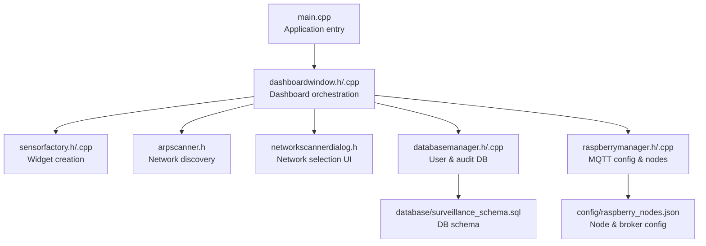

**Diagram sources**
- [main.cpp:1-15](file://main.cpp#L1-L15)
- [dashboardwindow.h:1-99](file://dashboardwindow.h#L1-L99)
- [dashboardwindow.cpp:1-244](file://dashboardwindow.cpp#L1-L244)
- [sensorfactory.h:1-41](file://sensorfactory.h#L1-L41)
- [sensorfactory.cpp:1-103](file://sensorfactory.cpp#L1-L103)
- [arpscanner.h:1-88](file://arpscanner.h#L1-L88)
- [networkscannerdialog.h:1-57](file://networkscannerdialog.h#L1-L57)
- [databasemanager.h:1-88](file://databasemanager.h#L1-L88)
- [databasemanager.cpp:1-382](file://databasemanager.cpp#L1-L382)
- [raspberrymanager.h:1-107](file://raspberrymanager.h#L1-L107)
- [raspberrymanager.cpp:1-331](file://raspberrymanager.cpp#L1-L331)
- [config/raspberry_nodes.json:1-122](file://config/raspberry_nodes.json#L1-L122)
- [database/surveillance_schema.sql:1-157](file://database/surveillance_schema.sql#L1-L157)

**Section sources**
- [main.cpp:1-15](file://main.cpp#L1-L15)
- [dashboardwindow.h:1-99](file://dashboardwindow.h#L1-L99)
- [dashboardwindow.cpp:71-244](file://dashboardwindow.cpp#L71-L244)
- [raspberrymanager.h:1-107](file://raspberrymanager.h#L1-L107)
- [raspberrymanager.cpp:24-110](file://raspberrymanager.cpp#L24-L110)
- [databasemanager.h:1-88](file://databasemanager.h#L1-L88)
- [databasemanager.cpp:21-115](file://databasemanager.cpp#L21-L115)
- [sensorfactory.h:1-41](file://sensorfactory.h#L1-L41)
- [sensorfactory.cpp:1-103](file://sensorfactory.cpp#L1-L103)
- [arpscanner.h:1-88](file://arpscanner.h#L1-L88)
- [networkscannerdialog.h:1-57](file://networkscannerdialog.h#L1-L57)
- [config/raspberry_nodes.json:1-122](file://config/raspberry_nodes.json#L1-L122)
- [database/surveillance_schema.sql:1-157](file://database/surveillance_schema.sql#L1-L157)

## Core Components
- DashboardWindow: Central UI controller managing widgets, authentication, network status, and bottom bar counters. It initializes smoke, temperature, and camera widgets and handles drag-and-resize behaviors.
- RaspberryManager: Loads and persists MQTT broker and node configuration from JSON, exposes node and sensor metadata, and emits node status changes.
- DatabaseManager: Initializes MySQL connection, creates tables for users and audit logs, supports user CRUD, authentication, session management, and audit logging.
- SensorFactory: Provides factory methods to create sensor widgets with default thresholds and units.
- ArpScanner and NetworkScannerDialog: Discover and select surveillance modules on the network, reporting connectivity status to the dashboard.
- Configuration and Schema: JSON configuration defines nodes, topics, and MQTT broker settings; SQL schema defines persistent entities for users, audit logs, nodes, sensors, sensor data, and system configuration.

**Section sources**
- [dashboardwindow.h:19-99](file://dashboardwindow.h#L19-L99)
- [dashboardwindow.cpp:71-244](file://dashboardwindow.cpp#L71-L244)
- [raspberrymanager.h:63-107](file://raspberrymanager.h#L63-L107)
- [raspberrymanager.cpp:24-110](file://raspberrymanager.cpp#L24-L110)
- [databasemanager.h:34-88](file://databasemanager.h#L34-L88)
- [databasemanager.cpp:21-115](file://databasemanager.cpp#L21-L115)
- [sensorfactory.h:28-41](file://sensorfactory.h#L28-L41)
- [sensorfactory.cpp:83-103](file://sensorfactory.cpp#L83-L103)
- [arpscanner.h:31-88](file://arpscanner.h#L31-L88)
- [networkscannerdialog.h:14-57](file://networkscannerdialog.h#L14-L57)
- [config/raspberry_nodes.json:1-122](file://config/raspberry_nodes.json#L1-L122)
- [database/surveillance_schema.sql:14-116](file://database/surveillance_schema.sql#L14-L116)

## Architecture Overview
The system follows a layered architecture:
- Presentation Layer: DashboardWindow and widgets render real-time sensor data and manage user interactions.
- Control Layer: DashboardWindow coordinates authentication, network scanning, and widget lifecycle.
- Data Access Layer: DatabaseManager handles user and audit persistence; RaspberryManager manages MQTT configuration and node metadata.
- External Integrations: MQTT broker (configured in JSON) and network scanning via ARP.

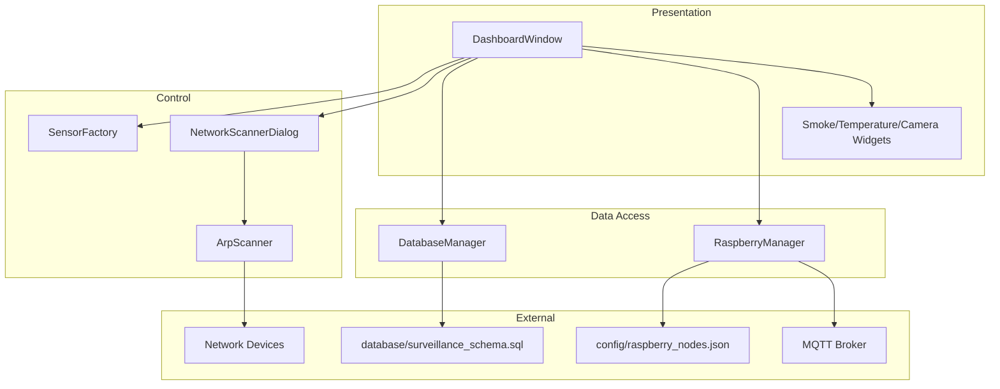

**Diagram sources**
- [dashboardwindow.h:19-99](file://dashboardwindow.h#L19-L99)
- [dashboardwindow.cpp:71-244](file://dashboardwindow.cpp#L71-L244)
- [sensorfactory.h:28-41](file://sensorfactory.h#L28-L41)
- [networkscannerdialog.h:14-57](file://networkscannerdialog.h#L14-L57)
- [arpscanner.h:31-88](file://arpscanner.h#L31-L88)
- [databasemanager.h:34-88](file://databasemanager.h#L34-L88)
- [databasemanager.cpp:21-115](file://databasemanager.cpp#L21-L115)
- [raspberrymanager.h:63-107](file://raspberrymanager.h#L63-L107)
- [raspberrymanager.cpp:24-110](file://raspberrymanager.cpp#L24-L110)
- [config/raspberry_nodes.json:1-122](file://config/raspberry_nodes.json#L1-L122)
- [database/surveillance_schema.sql:14-116](file://database/surveillance_schema.sql#L14-L116)

## Detailed Component Analysis

### Sensor Data Pipeline and Real-Time Updates
- Configuration-driven sensors: Nodes and sensors are defined in JSON with topics and thresholds. RaspberryManager loads this configuration and exposes node and sensor metadata.
- Widget rendering: DashboardWindow instantiates smoke, temperature, and camera widgets and places them in a dynamic container. Each widget displays real-time values and severity states.
- Network discovery: ArpScanner detects devices and reports surveillance modules; NetworkScannerDialog allows selection and updates the dashboard’s network status.
- Real-time counters: DashboardWindow periodically updates bottom bar counts for active sensors, alarms, warnings, and defaults based on widget visibility and severity.

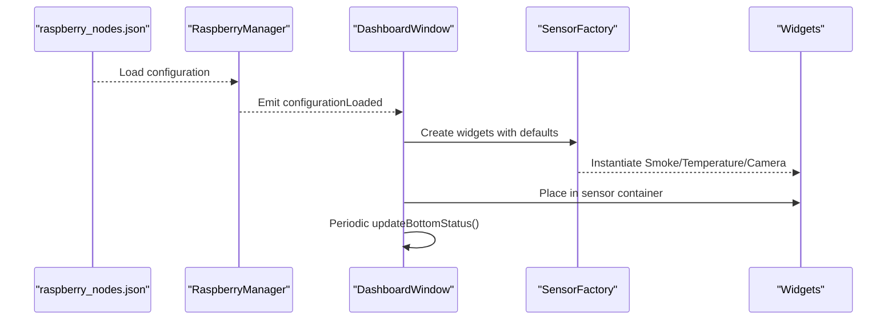

**Diagram sources**
- [config/raspberry_nodes.json:1-122](file://config/raspberry_nodes.json#L1-L122)
- [raspberrymanager.cpp:24-52](file://raspberrymanager.cpp#L24-L52)
- [dashboardwindow.cpp:71-244](file://dashboardwindow.cpp#L71-L244)
- [sensorfactory.cpp:83-103](file://sensorfactory.cpp#L83-L103)

**Section sources**
- [config/raspberry_nodes.json:6-106](file://config/raspberry_nodes.json#L6-L106)
- [raspberrymanager.cpp:181-237](file://raspberrymanager.cpp#L181-L237)
- [dashboardwindow.cpp:163-244](file://dashboardwindow.cpp#L163-L244)
- [sensorfactory.cpp:83-103](file://sensorfactory.cpp#L83-L103)

### MQTT Message Flow: Sensor Nodes → RaspberryManager → DashboardWindow
- Broker configuration: Host, port, protocol, and credentials are loaded from JSON and exposed by RaspberryManager.
- Node and sensor metadata: Nodes include IP, MAC, sensors array with topic, unit, and thresholds. These drive MQTT subscriptions and widget updates.
- Status propagation: RaspberryManager emits node status changes when online/offline states change, enabling UI updates in DashboardWindow.

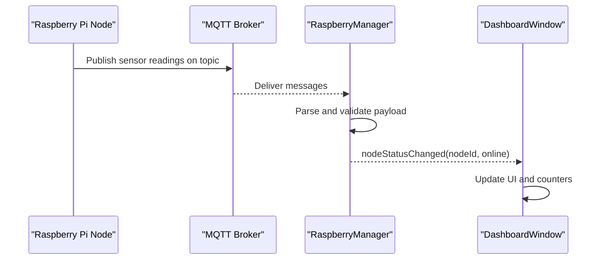

**Diagram sources**
- [raspberrymanager.h:89-93](file://raspberrymanager.h#L89-L93)
- [raspberrymanager.cpp:137-150](file://raspberrymanager.cpp#L137-L150)
- [config/raspberry_nodes.json:108-121](file://config/raspberry_nodes.json#L108-L121)

**Section sources**
- [raspberrymanager.h:48-107](file://raspberrymanager.h#L48-L107)
- [raspberrymanager.cpp:181-237](file://raspberrymanager.cpp#L181-L237)
- [config/raspberry_nodes.json:108-121](file://config/raspberry_nodes.json#L108-L121)

### Database Data Flow: User Management, Audit Logging, Configuration Storage
- Initialization: DatabaseManager opens a MySQL connection and ensures tables exist (users and audit_log). On SQLite, tables are created programmatically; on MySQL, the schema is provided by SQL script.
- User management: Create users, authenticate with hashed passwords, update last login, change passwords, deactivate users, and fetch all users.
- Audit logging: Logs actions with username, action type, and details; integrates with authentication events.
- Configuration storage: System configuration is persisted in a dedicated table; default values are inserted during schema initialization.

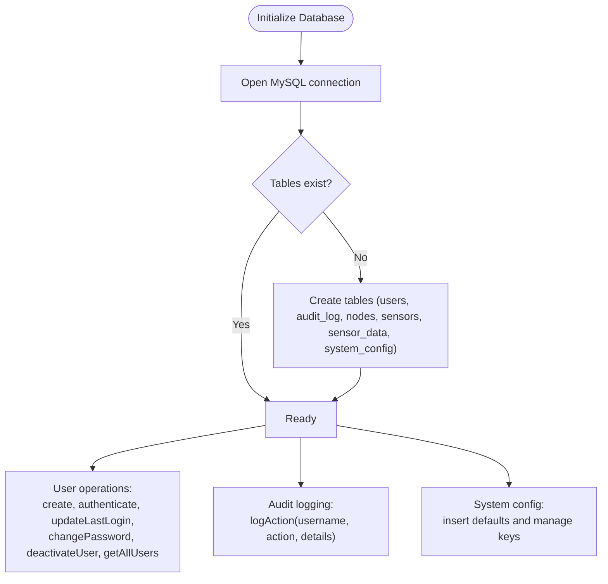

**Diagram sources**
- [databasemanager.cpp:21-115](file://databasemanager.cpp#L21-L115)
- [databasemanager.cpp:137-288](file://databasemanager.cpp#L137-L288)
- [databasemanager.cpp:309-319](file://databasemanager.cpp#L309-L319)
- [database/surveillance_schema.sql:14-116](file://database/surveillance_schema.sql#L14-L116)

**Section sources**
- [databasemanager.cpp:21-115](file://databasemanager.cpp#L21-L115)
- [databasemanager.cpp:137-288](file://databasemanager.cpp#L137-L288)
- [databasemanager.cpp:309-319](file://databasemanager.cpp#L309-L319)
- [database/surveillance_schema.sql:14-116](file://database/surveillance_schema.sql#L14-L116)

### Authentication Flow: User Login → Database → UI Update
- LoginWidget captures credentials and triggers authentication.
- DatabaseManager authenticates against hashed passwords, sets current user, updates last login, and logs the action.
- DashboardWindow receives signals and updates UI status and permissions.

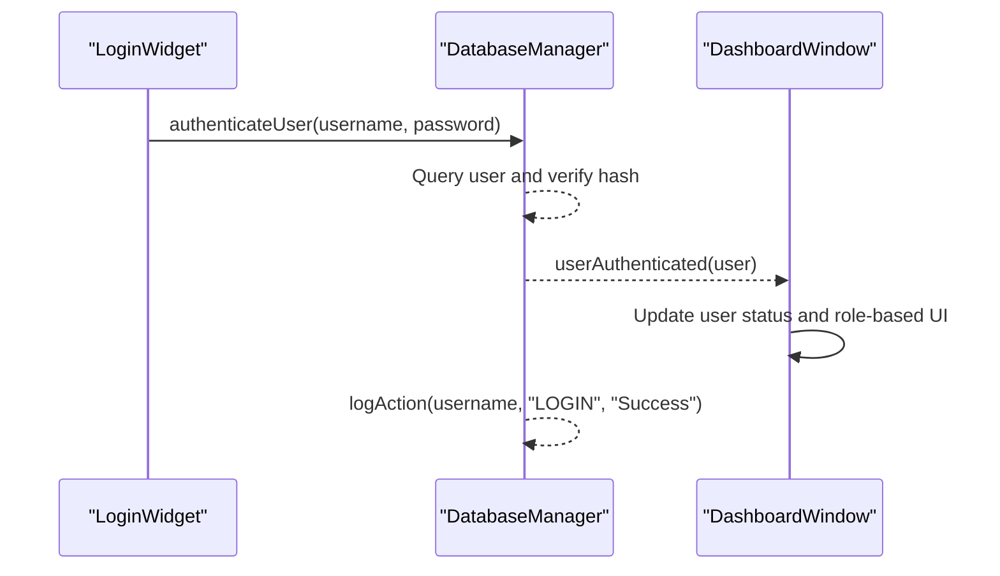

**Diagram sources**
- [loginwidget.h:8-22](file://loginwidget.h#L8-L22)
- [databasemanager.cpp:158-198](file://databasemanager.cpp#L158-L198)
- [databasemanager.cpp:290-302](file://databasemanager.cpp#L290-L302)
- [dashboardwindow.h:43-46](file://dashboardwindow.h#L43-L46)

**Section sources**
- [loginwidget.h:8-22](file://loginwidget.h#L8-L22)
- [databasemanager.cpp:158-198](file://databasemanager.cpp#L158-L198)
- [databasemanager.cpp:290-302](file://databasemanager.cpp#L290-L302)
- [dashboardwindow.h:43-46](file://dashboardwindow.h#L43-L46)

### Network Status Updates: ARP Scan → Module Selection → Dashboard
- ArpScanner performs ARP sweeps and identifies known surveillance modules, emitting discovered devices.
- NetworkScannerDialog presents selectable devices and updates selection.
- DashboardWindow receives selected devices and updates the bottom bar with network status.

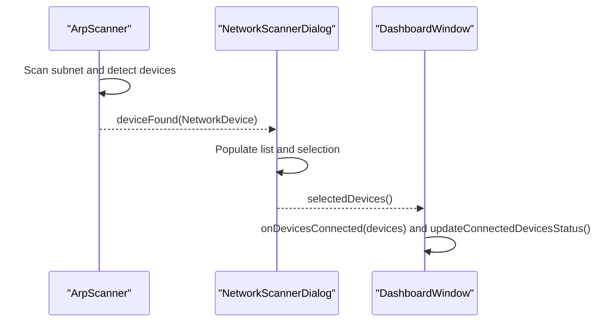

**Diagram sources**
- [arpscanner.h:53-60](file://arpscanner.h#L53-L60)
- [networkscannerdialog.h:23-33](file://networkscannerdialog.h#L23-L33)
- [dashboardwindow.cpp:681-728](file://dashboardwindow.cpp#L681-L728)

**Section sources**
- [arpscanner.h:31-88](file://arpscanner.h#L31-L88)
- [networkscannerdialog.h:14-57](file://networkscannerdialog.h#L14-L57)
- [dashboardwindow.cpp:668-728](file://dashboardwindow.cpp#L668-L728)

### Data Transformation and Validation
- JSON parsing: RaspberryManager validates JSON structure and populates broker and node configurations, including sensor metadata with topics and thresholds.
- Widget defaults: SensorFactory provides default names, units, and thresholds per sensor type to ensure consistent UI behavior.
- Network device normalization: ArpScanner resolves hostnames, identifies device types, and normalizes RSSI values for UI presentation.

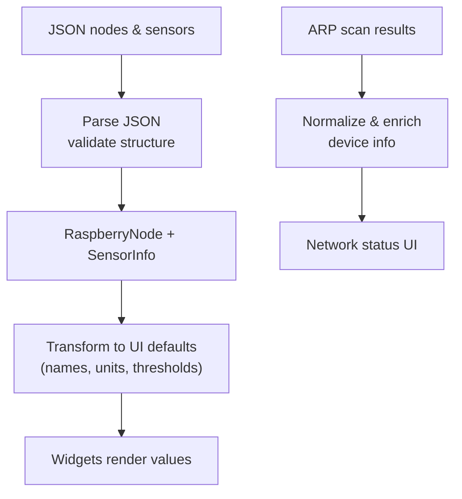

**Diagram sources**
- [raspberrymanager.cpp:181-237](file://raspberrymanager.cpp#L181-L237)
- [sensorfactory.cpp:33-81](file://sensorfactory.cpp#L33-L81)
- [arpscanner.h:66-73](file://arpscanner.h#L66-L73)

**Section sources**
- [raspberrymanager.cpp:181-237](file://raspberrymanager.cpp#L181-L237)
- [sensorfactory.cpp:33-81](file://sensorfactory.cpp#L33-L81)
- [arpscanner.h:66-73](file://arpscanner.h#L66-L73)

### Caching Strategies and Real-Time Update Mechanisms
- In-memory node cache: RaspberryManager maintains nodes and broker/app configs in memory for fast access and UI updates.
- Widget state cache: Widgets maintain internal state for visibility, severity, and recent values; DashboardWindow aggregates counts periodically.
- Timer-based refresh: A status timer triggers periodic updates of bottom bar metrics.

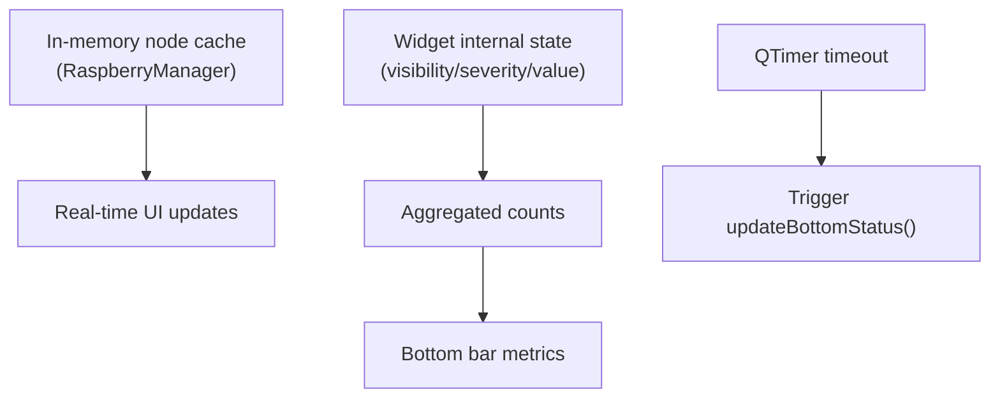

**Diagram sources**
- [raspberrymanager.h:94-99](file://raspberrymanager.h#L94-L99)
- [dashboardwindow.cpp:236-239](file://dashboardwindow.cpp#L236-L239)
- [dashboardwindow.cpp:574-614](file://dashboardwindow.cpp#L574-L614)

**Section sources**
- [raspberrymanager.h:94-99](file://raspberrymanager.h#L94-L99)
- [dashboardwindow.cpp:236-239](file://dashboardwindow.cpp#L236-L239)
- [dashboardwindow.cpp:574-614](file://dashboardwindow.cpp#L574-L614)

### Error Handling, Validation, and Fallbacks
- Configuration errors: RaspberryManager emits configurationError when JSON is invalid or file cannot be opened.
- Database errors: DatabaseManager emits databaseError and authenticationFailed with descriptive reasons.
- Fallbacks: Default broker host/port and application settings are embedded in RaspberryManager; default users are created if none exist in SQLite mode.

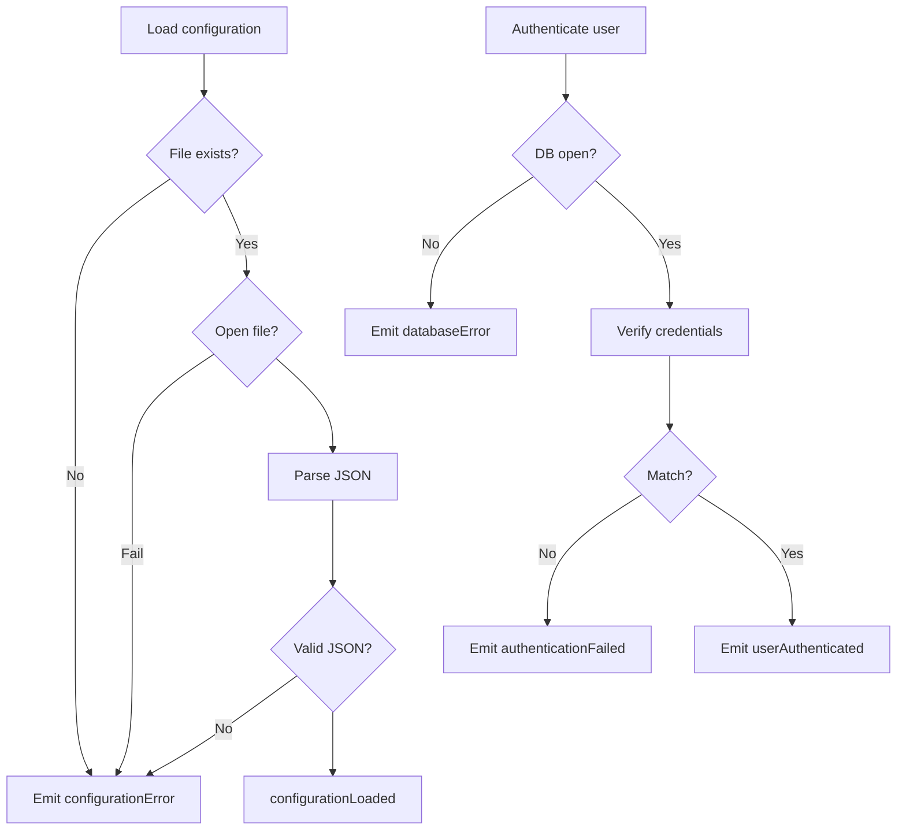

**Diagram sources**
- [raspberrymanager.cpp:24-52](file://raspberrymanager.cpp#L24-L52)
- [databasemanager.cpp:48-65](file://databasemanager.cpp#L48-L65)
- [databasemanager.cpp:158-198](file://databasemanager.cpp#L158-L198)

**Section sources**
- [raspberrymanager.cpp:24-52](file://raspberrymanager.cpp#L24-L52)
- [databasemanager.cpp:48-65](file://databasemanager.cpp#L48-L65)
- [databasemanager.cpp:158-198](file://databasemanager.cpp#L158-L198)

## Dependency Analysis
- DashboardWindow depends on SensorFactory for widget creation, ArpScanner/NetworkScannerDialog for network discovery, DatabaseManager for authentication, and RaspberryManager for configuration and node status.
- RaspberryManager depends on JSON configuration and exposes typed sensor metadata for widgets.
- DatabaseManager depends on the SQL schema and provides user and audit services.

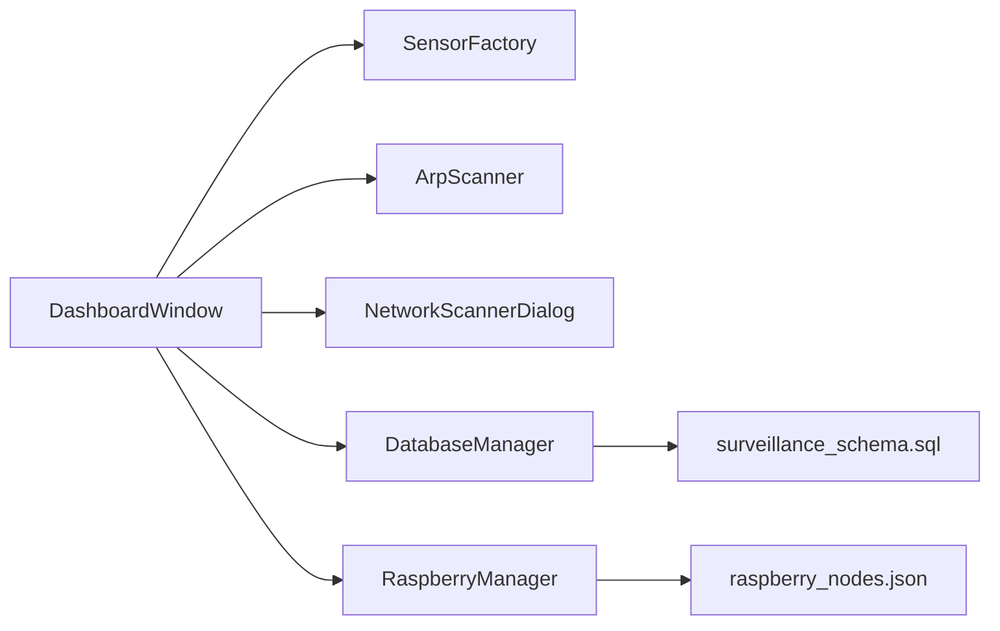

**Diagram sources**
- [dashboardwindow.h:1-99](file://dashboardwindow.h#L1-L99)
- [sensorfactory.h:1-41](file://sensorfactory.h#L1-L41)
- [arpscanner.h:1-88](file://arpscanner.h#L1-L88)
- [networkscannerdialog.h:1-57](file://networkscannerdialog.h#L1-L57)
- [databasemanager.h:1-88](file://databasemanager.h#L1-L88)
- [databasemanager.cpp:21-115](file://databasemanager.cpp#L21-L115)
- [raspberrymanager.h:1-107](file://raspberrymanager.h#L1-L107)
- [config/raspberry_nodes.json:1-122](file://config/raspberry_nodes.json#L1-L122)
- [database/surveillance_schema.sql:1-157](file://database/surveillance_schema.sql#L1-L157)

**Section sources**
- [dashboardwindow.h:1-99](file://dashboardwindow.h#L1-L99)
- [sensorfactory.h:1-41](file://sensorfactory.h#L1-L41)
- [arpscanner.h:1-88](file://arpscanner.h#L1-L88)
- [networkscannerdialog.h:1-57](file://networkscannerdialog.h#L1-L57)
- [databasemanager.h:1-88](file://databasemanager.h#L1-L88)
- [raspberrymanager.h:1-107](file://raspberrymanager.h#L1-L107)
- [config/raspberry_nodes.json:1-122](file://config/raspberry_nodes.json#L1-L122)
- [database/surveillance_schema.sql:1-157](file://database/surveillance_schema.sql#L1-L157)

## Performance Considerations
- Minimize JSON parsing overhead: Load configuration once at startup and cache parsed nodes.
- Efficient UI updates: Batch widget visibility and severity checks in updateBottomStatus to avoid redundant UI redraws.
- Database operations: Use prepared statements and batch inserts where applicable; limit frequent writes to audit log.
- Network scanning: Limit ARP sweep intervals and avoid scanning unknown subnets unnecessarily.

## Troubleshooting Guide
- Configuration loading failures: Verify JSON validity and file accessibility; check emitted configurationError details.
- Authentication failures: Confirm database connectivity, user existence, and password hashing; review authenticationFailed signals.
- MQTT connectivity: Validate broker host/port/credentials from JSON; ensure nodes’ topics match published payloads.
- Network discovery: Confirm ARP scanner permissions and subnet correctness; check scanStarted/scanError signals.

**Section sources**
- [raspberrymanager.cpp:24-52](file://raspberrymanager.cpp#L24-L52)
- [databasemanager.cpp:48-65](file://databasemanager.cpp#L48-L65)
- [databasemanager.cpp:158-198](file://databasemanager.cpp#L158-L198)
- [arpscanner.h:53-60](file://arpscanner.h#L53-L60)

## Conclusion
SurveillanceQT implements a clear separation of concerns: configuration-driven sensor metadata, robust database-backed user and audit services, and reactive UI updates. The MQTT integration is configuration-first, enabling flexible deployments. Network discovery and authentication are tightly integrated into the dashboard for a cohesive user experience. Error handling and validation are centralized in managers, ensuring predictable failure modes and actionable diagnostics.

## Appendices

### Data Model Overview
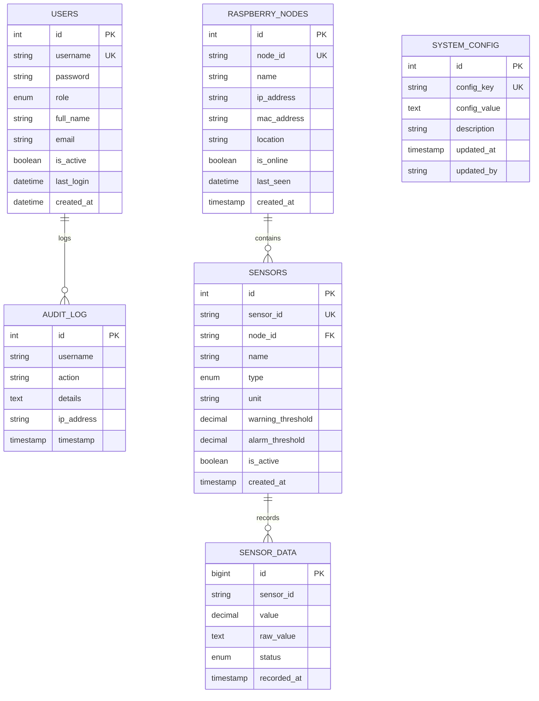

**Diagram sources**
- [database/surveillance_schema.sql:14-116](file://database/surveillance_schema.sql#L14-L116)