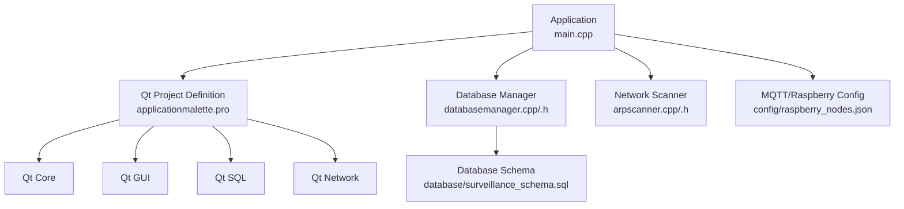
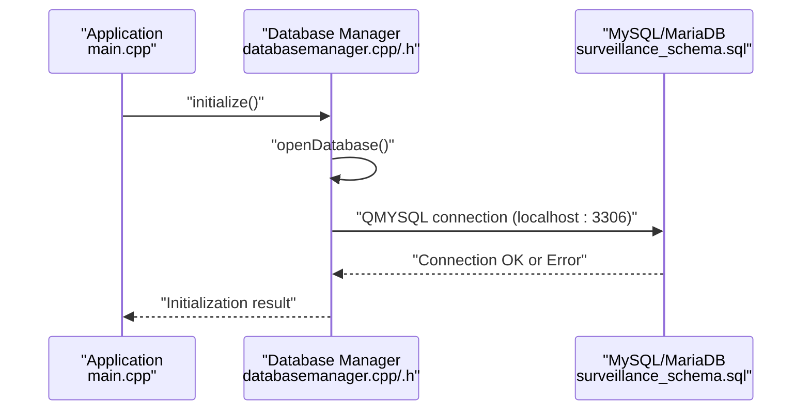
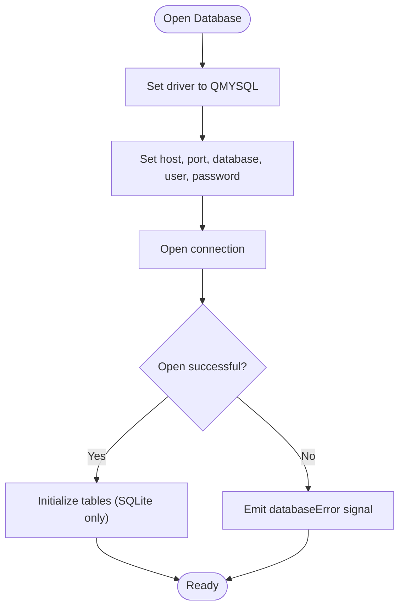
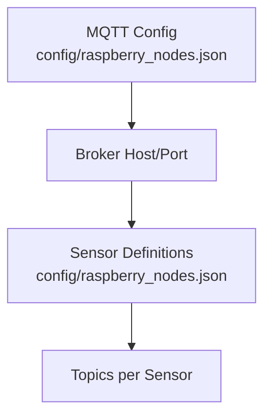
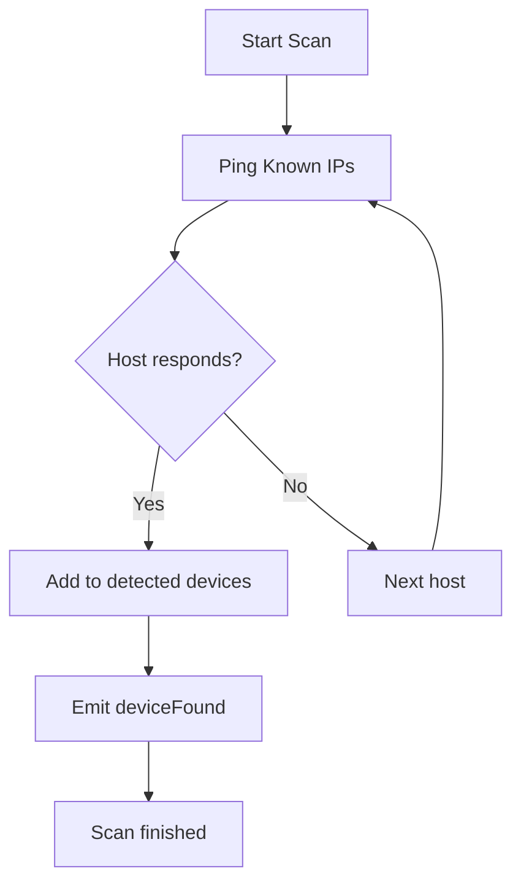
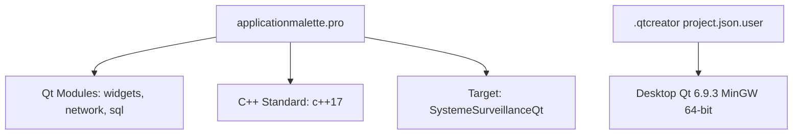
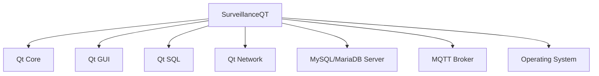

# External Dependencies

<cite>
**Referenced Files in This Document**
- [applicationmalette.pro](file://applicationmalette.pro)
- [.qtcreator project.json.user](file://.qtcreator/project.json.user)
- [main.cpp](file://main.cpp)
- [databasemanager.h](file://databasemanager.h)
- [databasemanager.cpp](file://databasemanager.cpp)
- [database/surveillance_schema.sql](file://database/surveillance_schema.sql)
- [config/raspberry_nodes.json](file://config/raspberry_nodes.json)
- [arpscanner.h](file://arpscanner.h)
- [arpscanner.cpp](file://arpscanner.cpp)
- [modulemanager.h](file://modulemanager.h)
- [sensorfactory.h](file://sensorfactory.h)
</cite>

## Table of Contents
1. [Introduction](#introduction)
2. [Project Structure](#project-structure)
3. [Core Components](#core-components)
4. [Architecture Overview](#architecture-overview)
5. [Detailed Component Analysis](#detailed-component-analysis)
6. [Dependency Analysis](#dependency-analysis)
7. [Performance Considerations](#performance-considerations)
8. [Troubleshooting Guide](#troubleshooting-guide)
9. [Conclusion](#conclusion)
10. [Appendices](#appendices)

## Introduction
This document details the external dependencies and system requirements for SurveillanceQT. It covers:
- Qt framework dependencies (Core, GUI, SQL, Network)
- MySQL/MariaDB database integration and configuration
- Real-time sensor communication via MQTT (configuration and integration points)
- Build system requirements, compiler versions, and platform-specific considerations
- Runtime dependencies, shared libraries, and system prerequisites
- Dependency management via Qt’s qmake/pro file system
- Version compatibility, upgrade paths, and troubleshooting

## Project Structure
SurveillanceQT is a Qt-based desktop application structured around:
- A Qt project definition using qmake/pro
- A main application entry point
- A database manager integrating with MySQL/MariaDB
- Network scanning utilities leveraging Qt’s networking capabilities
- Configuration files for MQTT broker and Raspberry Pi nodes
- UI components and factories for sensor widgets

**Diagram sources**
- [main.cpp:1-15](file://main.cpp#L1-L15)
- [applicationmalette.pro:1-47](file://applicationmalette.pro#L1-L47)
- [databasemanager.cpp:48-65](file://databasemanager.cpp#L48-L65)
- [arpscanner.h:31-88](file://arpscanner.h#L31-L88)
- [config/raspberry_nodes.json:1-122](file://config/raspberry_nodes.json#L1-L122)
- [database/surveillance_schema.sql:1-157](file://database/surveillance_schema.sql#L1-L157)

**Section sources**
- [applicationmalette.pro:1-47](file://applicationmalette.pro#L1-L47)
- [main.cpp:1-15](file://main.cpp#L1-L15)

## Core Components
- Qt project definition declares required modules and C++ standard.
- Database manager initializes and connects to MySQL/MariaDB, handles user management, and emits signals for authentication and database errors.
- Network scanner uses Qt’s process and networking facilities to discover devices and Raspberry Pi nodes.
- Configuration files define MQTT broker settings and node sensor topics.

**Section sources**
- [applicationmalette.pro:1-47](file://applicationmalette.pro#L1-L47)
- [databasemanager.h:34-87](file://databasemanager.h#L34-L87)
- [databasemanager.cpp:48-65](file://databasemanager.cpp#L48-L65)
- [arpscanner.h:31-88](file://arpscanner.h#L31-L88)
- [config/raspberry_nodes.json:108-121](file://config/raspberry_nodes.json#L108-L121)

## Architecture Overview
The application integrates Qt modules with a MySQL/MariaDB backend and MQTT-based sensor data. The flow below illustrates how the application initializes, connects to the database, and prepares for MQTT sensor integration.

**Diagram sources**
- [main.cpp:5-14](file://main.cpp#L5-L14)
- [databasemanager.cpp:21-41](file://databasemanager.cpp#L21-L41)
- [databasemanager.cpp:48-65](file://databasemanager.cpp#L48-L65)
- [database/surveillance_schema.sql:6-11](file://database/surveillance_schema.sql#L6-L11)

## Detailed Component Analysis

### Qt Framework Dependencies
- Modules declared in the project file:
  - Widgets: UI components and dialogs
  - Network: Networking and process execution for scanning
  - SQL: Database connectivity and queries
- C++ standard set to C++17.

These declarations indicate the application requires:
- Qt Core (implicit through all Qt usage)
- Qt GUI (widgets and dialogs)
- Qt SQL (database drivers and queries)
- Qt Network (process execution and networking)

**Section sources**
- [applicationmalette.pro:1-6](file://applicationmalette.pro#L1-L6)

### Database Integration (MySQL/MariaDB)
- Driver: The application uses the QMYSQL driver to connect to a MySQL-compatible server.
- Connection defaults: localhost, port 3306, database name, username, and empty password are configured in the database manager.
- Schema: The schema defines tables for users, audit logs, nodes, sensors, sensor data, and system configuration. It also seeds default users and system configuration.

**Diagram sources**
- [databasemanager.cpp:48-65](file://databasemanager.cpp#L48-L65)
- [database/surveillance_schema.sql:6-47](file://database/surveillance_schema.sql#L6-L47)

**Section sources**
- [databasemanager.cpp:48-65](file://databasemanager.cpp#L48-L65)
- [database/surveillance_schema.sql:6-157](file://database/surveillance_schema.sql#L6-L157)

### MQTT Integration and Sensor Communication
- Configuration: The MQTT broker host, port, protocol, and credentials are defined in the configuration JSON.
- Topics: Each sensor defines a topic used for publishing telemetry.
- Integration points: While the current code does not show MQTT client usage, the configuration and sensor structures indicate MQTT is intended for real-time sensor communication.

**Diagram sources**
- [config/raspberry_nodes.json:108-121](file://config/raspberry_nodes.json#L108-L121)
- [config/raspberry_nodes.json:13-106](file://config/raspberry_nodes.json#L13-L106)

**Section sources**
- [config/raspberry_nodes.json:108-121](file://config/raspberry_nodes.json#L108-L121)
- [config/raspberry_nodes.json:13-106](file://config/raspberry_nodes.json#L13-L106)

### Network Scanning and Device Discovery
- Uses Qt’s process execution and networking utilities to ping and discover devices.
- Known Raspberry Pi IP ranges and device identification are embedded in the scanner.

**Diagram sources**
- [arpscanner.cpp:232-279](file://arpscanner.cpp#L232-L279)
- [arpscanner.h:31-88](file://arpscanner.h#L31-L88)

**Section sources**
- [arpscanner.cpp:232-279](file://arpscanner.cpp#L232-L279)
- [arpscanner.h:31-88](file://arpscanner.h#L31-L88)

### Build System and Compiler Requirements
- qmake/pro project file:
  - Declares required Qt modules (widgets, network, sql)
  - Sets C++ standard to C++17
  - Defines the target application name
- Qt Creator project metadata indicates a Desktop Qt kit with MinGW 64-bit.

**Diagram sources**
- [applicationmalette.pro:1-8](file://applicationmalette.pro#L1-L8)
- [.qtcreator project.json.user:92-101](file://.qtcreator/project.json.user#L92-L101)

**Section sources**
- [applicationmalette.pro:1-8](file://applicationmalette.pro#L1-L8)
- [.qtcreator project.json.user:92-101](file://.qtcreator/project.json.user#L92-L101)

## Dependency Analysis
The application’s external dependencies can be summarized as follows:

- Qt modules:
  - Core: Required for all Qt applications
  - GUI: Required for UI components and dialogs
  - SQL: Required for database connectivity
  - Network: Required for process execution and networking tasks
- Database:
  - MySQL/MariaDB server with QMYSQL driver
  - Database schema and seed data included
- MQTT:
  - Broker configuration present in JSON; MQTT client usage not shown in current code
- Build toolchain:
  - qmake/pro project system
  - C++17 compiler support
  - Qt 6.x toolchain (as indicated by the kit)

**Diagram sources**
- [applicationmalette.pro:1-6](file://applicationmalette.pro#L1-L6)
- [databasemanager.cpp:48-65](file://databasemanager.cpp#L48-L65)
- [config/raspberry_nodes.json:108-121](file://config/raspberry_nodes.json#L108-L121)

**Section sources**
- [applicationmalette.pro:1-6](file://applicationmalette.pro#L1-L6)
- [databasemanager.cpp:48-65](file://databasemanager.cpp#L48-L65)
- [config/raspberry_nodes.json:108-121](file://config/raspberry_nodes.json#L108-L121)

## Performance Considerations
- Database connections: Prefer reusing a single QSqlDatabase connection per thread and avoid frequent open/close operations.
- Network scans: Limit concurrent pings and use timers to batch scan operations to reduce CPU and I/O overhead.
- MQTT: Configure appropriate reconnect intervals and heartbeat intervals to balance responsiveness and resource usage.

[No sources needed since this section provides general guidance]

## Troubleshooting Guide
Common issues and resolutions:
- Database connection failures:
  - Verify MySQL/MariaDB service is running and accessible at localhost:3306.
  - Confirm credentials match the schema defaults.
  - Check that the database exists and schema is applied.
- Missing Qt modules:
  - Ensure the selected Qt kit includes widgets, network, and sql modules.
  - Re-run qmake after adding modules to the pro file.
- MQTT configuration:
  - Validate broker host/port in the configuration JSON.
  - Confirm sensor topics align with broker subscriptions.
- Platform-specific scanning:
  - On Windows, the scanner uses ping with specific flags; ensure ICMP is permitted by firewall policies.

**Section sources**
- [databasemanager.cpp:48-65](file://databasemanager.cpp#L48-L65)
- [database/surveillance_schema.sql:6-11](file://database/surveillance_schema.sql#L6-L11)
- [arpscanner.cpp:273-278](file://arpscanner.cpp#L273-L278)
- [config/raspberry_nodes.json:108-121](file://config/raspberry_nodes.json#L108-L121)

## Conclusion
SurveillanceQT depends on Qt 6.x with Core, GUI, SQL, and Network modules, a MySQL/MariaDB backend, and MQTT for sensor communication. The qmake/pro project file and Qt Creator configuration define the build environment. Proper database schema deployment, broker configuration, and platform-specific networking settings are essential for reliable operation.

[No sources needed since this section summarizes without analyzing specific files]

## Appendices

### Installation Procedures
- Install Qt 6.x with MinGW 64-bit toolchain and ensure widgets, network, and sql modules are available.
- Install MySQL/MariaDB server and configure a user with appropriate privileges.
- Apply the database schema to create tables and seed default data.
- Configure the MQTT broker host/port and sensor topics in the configuration JSON.
- Build and run the project using qmake/pro within Qt Creator.

**Section sources**
- [.qtcreator project.json.user:92-101](file://.qtcreator/project.json.user#L92-L101)
- [database/surveillance_schema.sql:6-157](file://database/surveillance_schema.sql#L6-L157)
- [config/raspberry_nodes.json:108-121](file://config/raspberry_nodes.json#L108-L121)

### Verification Steps
- Launch the application and confirm the main window displays.
- Verify database initialization completes without emitting database errors.
- Confirm network scanning discovers known Raspberry Pi devices.
- Validate MQTT configuration loads and matches expected broker settings.

**Section sources**
- [main.cpp:5-14](file://main.cpp#L5-L14)
- [databasemanager.h:72-77](file://databasemanager.h#L72-L77)
- [arpscanner.h:53-60](file://arpscanner.h#L53-L60)
- [config/raspberry_nodes.json:108-121](file://config/raspberry_nodes.json#L108-L121)