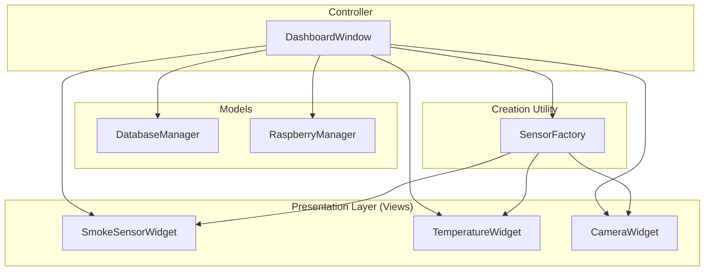
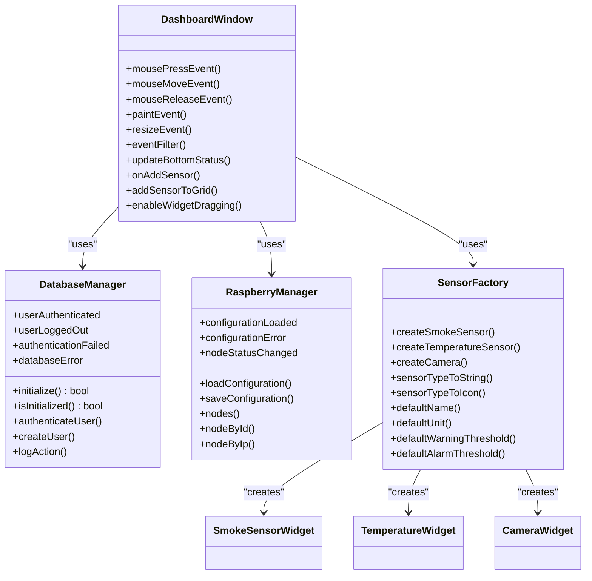
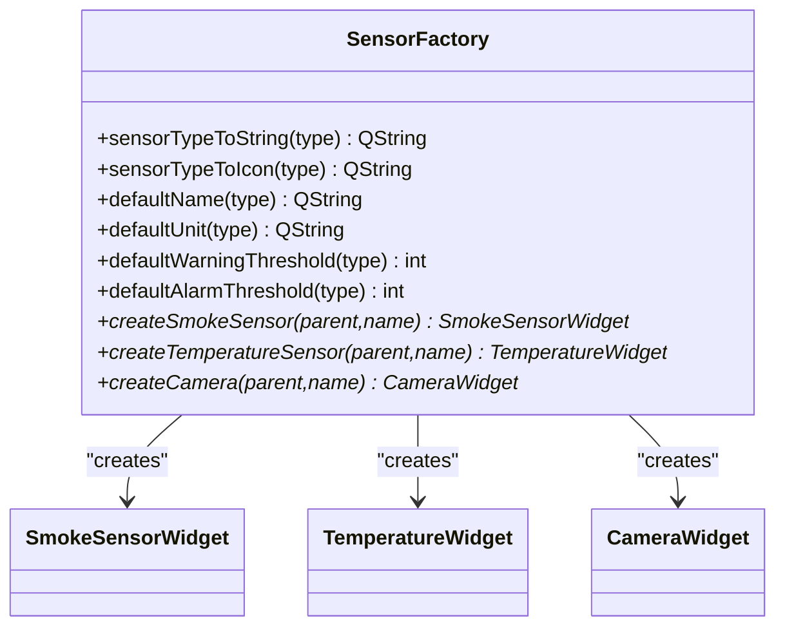
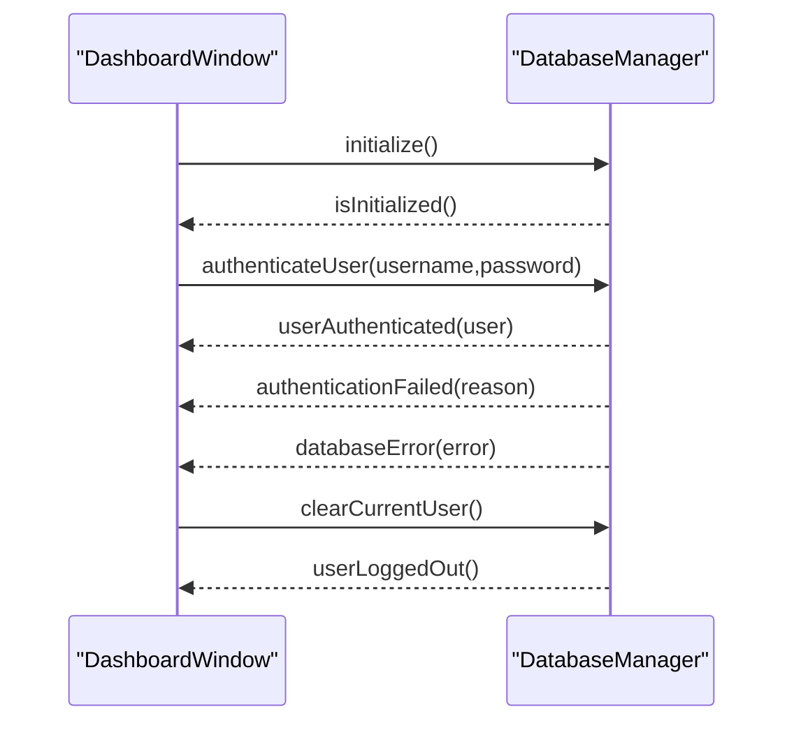
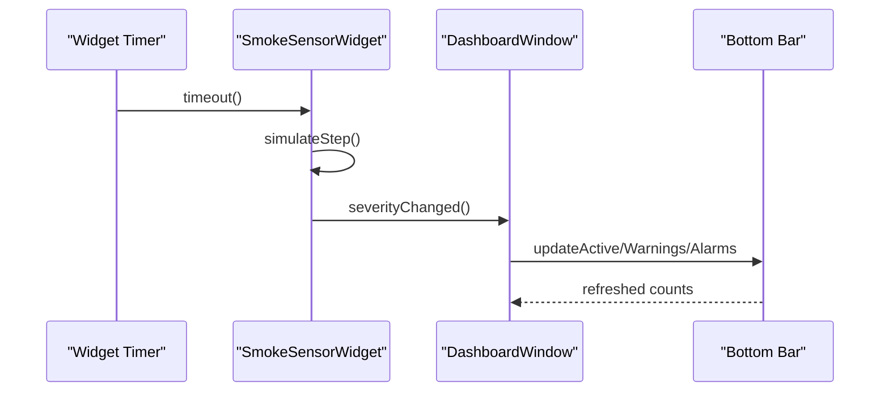
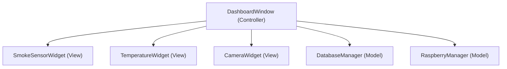
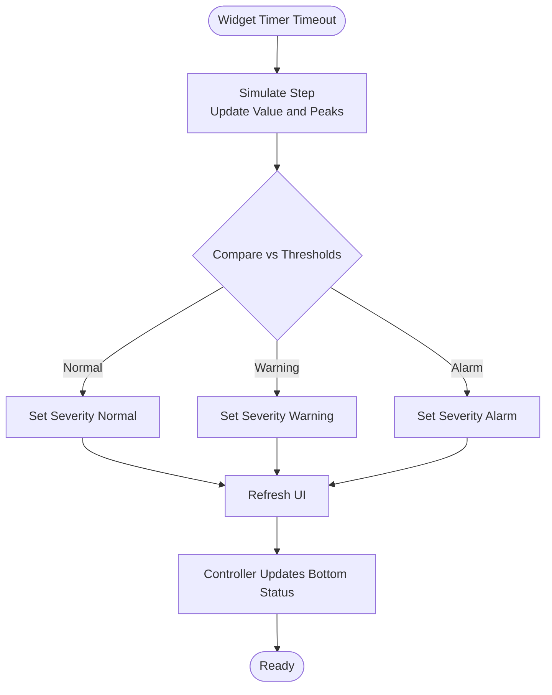
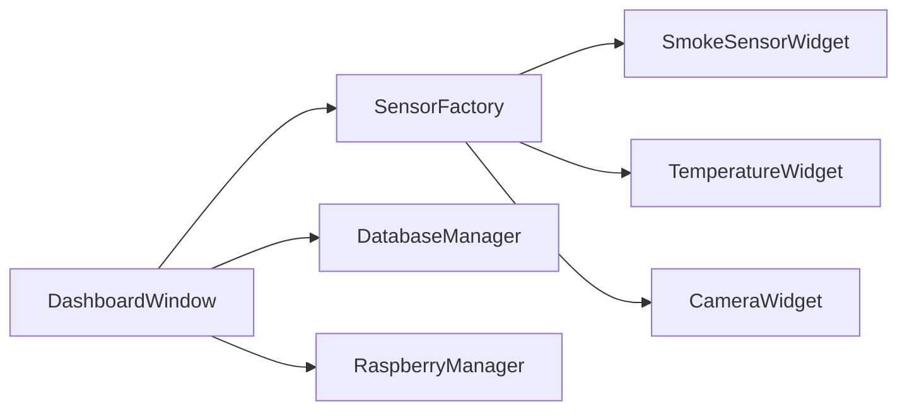

# System Design Patterns

<cite>
**Referenced Files in This Document**
- [sensorfactory.h](file://sensorfactory.h)
- [sensorfactory.cpp](file://sensorfactory.cpp)
- [databasemanager.h](file://databasemanager.h)
- [databasemanager.cpp](file://databasemanager.cpp)
- [dashboardwindow.h](file://dashboardwindow.h)
- [dashboardwindow.cpp](file://dashboardwindow.cpp)
- [smokesensorwidget.h](file://smokesensorwidget.h)
- [smokesensorwidget.cpp](file://smokesensorwidget.cpp)
- [temperaturewidget.h](file://temperaturewidget.h)
- [temperaturewidget.cpp](file://temperaturewidget.cpp)
- [camerawidget.h](file://camerawidget.h)
- [camerawidget.cpp](file://camerawidget.cpp)
- [raspberrymanager.h](file://raspberrymanager.h)
- [raspberrymanager.cpp](file://raspberrymanager.cpp)
</cite>

## Table of Contents
1. [Introduction](#introduction)
2. [Project Structure](#project-structure)
3. [Core Components](#core-components)
4. [Architecture Overview](#architecture-overview)
5. [Detailed Component Analysis](#detailed-component-analysis)
6. [Dependency Analysis](#dependency-analysis)
7. [Performance Considerations](#performance-considerations)
8. [Troubleshooting Guide](#troubleshooting-guide)
9. [Conclusion](#conclusion)

## Introduction
This document explains the design patterns implemented in SurveillanceQT and how they contribute to modularity, maintainability, and scalability. It focuses on:
- Factory pattern for creating specialized sensor widgets
- Centralized database access via a singleton-like model
- Observer pattern using Qt’s signal-slot mechanism for real-time updates
- MVC structure with DashboardWindow as controller, sensor widgets as views, and DatabaseManager/RaspberryManager as models

## Project Structure
The application is organized around reusable UI widgets (views), a central controller (DashboardWindow), and models for data and configuration. The sensor factory encapsulates creation logic, while models manage persistence and remote device configuration.

**Diagram sources**
- [dashboardwindow.h:19-99](file://dashboardwindow.h#L19-L99)
- [dashboardwindow.cpp:71-244](file://dashboardwindow.cpp#L71-L244)
- [sensorfactory.h:28-40](file://sensorfactory.h#L28-L40)
- [sensorfactory.cpp:83-102](file://sensorfactory.cpp#L83-L102)
- [databasemanager.h:34-87](file://databasemanager.h#L34-L87)
- [raspberrymanager.h:63-106](file://raspberrymanager.h#L63-L106)

**Section sources**
- [dashboardwindow.h:19-99](file://dashboardwindow.h#L19-L99)
- [dashboardwindow.cpp:71-244](file://dashboardwindow.cpp#L71-L244)
- [sensorfactory.h:28-40](file://sensorfactory.h#L28-L40)
- [sensorfactory.cpp:83-102](file://sensorfactory.cpp#L83-L102)
- [databasemanager.h:34-87](file://databasemanager.h#L34-L87)
- [raspberrymanager.h:63-106](file://raspberrymanager.h#L63-L106)

## Core Components
- SensorFactory: Encapsulates creation of sensor widgets and provides default metadata per sensor type.
- DashboardWindow: Orchestrates UI composition, user interactions, real-time updates, and integrates models.
- Sensor widgets: Self-contained views rendering live data and exposing controls.
- DatabaseManager: Centralized model for user management, authentication, sessions, and audit logging.
- RaspberryManager: Model for MQTT broker configuration and device/node management.

**Section sources**
- [sensorfactory.h:28-40](file://sensorfactory.h#L28-L40)
- [sensorfactory.cpp:83-102](file://sensorfactory.cpp#L83-L102)
- [dashboardwindow.h:19-99](file://dashboardwindow.h#L19-L99)
- [dashboardwindow.cpp:71-244](file://dashboardwindow.cpp#L71-L244)
- [databasemanager.h:34-87](file://databasemanager.h#L34-L87)
- [raspberrymanager.h:63-106](file://raspberrymanager.h#L63-L106)

## Architecture Overview
The system follows an MVC-like structure:
- Controller: DashboardWindow manages UI lifecycle, user actions, timers, and orchestrates model interactions.
- Views: Sensor widgets render live data and expose controls.
- Models: DatabaseManager and RaspberryManager encapsulate persistence and configuration logic.

Qt’s signal-slot mechanism underpins real-time updates and decouples components.

**Diagram sources**
- [dashboardwindow.h:19-99](file://dashboardwindow.h#L19-L99)
- [dashboardwindow.cpp:899-921](file://dashboardwindow.cpp#L899-L921)
- [databasemanager.h:34-87](file://databasemanager.h#L34-L87)
- [raspberrymanager.h:63-106](file://raspberrymanager.h#L63-L106)
- [sensorfactory.h:28-40](file://sensorfactory.h#L28-L40)
- [smokesensorwidget.h:10-52](file://smokesensorwidget.h#L10-L52)
- [temperaturewidget.h:11-53](file://temperaturewidget.h#L11-L53)
- [camerawidget.h:9-39](file://camerawidget.h#L9-L39)

## Detailed Component Analysis

### Factory Pattern: SensorFactory
Purpose:
- Centralize creation of specialized sensor widgets and provide default configurations per sensor type.

Key characteristics:
- Static methods for creation and metadata retrieval
- Encapsulates widget instantiation and initial configuration
- Supports extensibility by adding new sensor types in the factory interface and implementation

Implementation highlights:
- Creation methods return pointers to specific widget types
- Metadata helpers supply localized labels, icons, units, and thresholds

Benefits:
- Decouples client code from widget constructors
- Simplifies UI composition and reduces duplication
- Eases future additions of new sensor types

**Diagram sources**
- [sensorfactory.h:28-40](file://sensorfactory.h#L28-L40)
- [sensorfactory.cpp:7-102](file://sensorfactory.cpp#L7-L102)

**Section sources**
- [sensorfactory.h:10-40](file://sensorfactory.h#L10-L40)
- [sensorfactory.cpp:7-102](file://sensorfactory.cpp#L7-L102)

### Singleton Pattern: DatabaseManager
Observation:
- While DatabaseManager inherits QObject and is instantiated by the controller, it is used as a shared resource across the application. The controller constructs it once and passes it around, effectively acting as a singleton for the process lifetime.

Key aspects:
- Initialization and connection management
- User authentication and session control
- Audit logging and error signaling

Signals and slots:
- Emits signals for authentication events and database errors
- Receives callbacks from the controller to update UI and enforce permissions

Benefits:
- Centralized access to database resources
- Unified error propagation and user state management
- Clear separation of concerns between UI and persistence

**Diagram sources**
- [dashboardwindow.cpp:899-921](file://dashboardwindow.cpp#L899-L921)
- [databasemanager.cpp:21-41](file://databasemanager.cpp#L21-L41)
- [databasemanager.cpp:158-198](file://databasemanager.cpp#L158-L198)
- [databasemanager.cpp:290-302](file://databasemanager.cpp#L290-L302)

**Section sources**
- [databasemanager.h:34-87](file://databasemanager.h#L34-L87)
- [databasemanager.cpp:10-19](file://databasemanager.cpp#L10-L19)
- [dashboardwindow.cpp:899-921](file://dashboardwindow.cpp#L899-L921)

### Observer Pattern: Qt Signals and Slots
Real-time updates are handled via Qt’s signal-slot mechanism:
- Widgets emit internal state changes (e.g., severity levels)
- Controller subscribes to widget signals and updates summary/status bars
- DatabaseManager emits authentication and error signals consumed by the controller

Examples:
- Widget timers trigger state updates; controller aggregates counts and displays status
- Authentication signals drive UI enable/disable and overlays

**Diagram sources**
- [smokesensorwidget.cpp:231-234](file://smokesensorwidget.cpp#L231-L234)
- [dashboardwindow.cpp:574-614](file://dashboardwindow.cpp#L574-L614)

**Section sources**
- [smokesensorwidget.cpp:231-234](file://smokesensorwidget.cpp#L231-L234)
- [dashboardwindow.cpp:574-614](file://dashboardwindow.cpp#L574-L614)

### MVC Pattern: DashboardWindow as Controller
DashboardWindow acts as the controller:
- Composes and arranges views (widgets)
- Manages user interactions and workflows (login, add sensor, edit widgets)
- Coordinates models (DatabaseManager, RaspberryManager) for data and configuration
- Implements drag-and-drop and resizing behaviors for widgets

Views:
- SmokeSensorWidget, TemperatureWidget, CameraWidget

Models:
- DatabaseManager (users, sessions, audit)
- RaspberryManager (MQTT broker and node configuration)

**Diagram sources**
- [dashboardwindow.h:19-99](file://dashboardwindow.h#L19-L99)
- [dashboardwindow.cpp:71-244](file://dashboardwindow.cpp#L71-L244)
- [databasemanager.h:34-87](file://databasemanager.h#L34-L87)
- [raspberrymanager.h:63-106](file://raspberrymanager.h#L63-L106)

**Section sources**
- [dashboardwindow.h:19-99](file://dashboardwindow.h#L19-L99)
- [dashboardwindow.cpp:71-244](file://dashboardwindow.cpp#L71-L244)

### Real-Time Data Simulation and Thresholds
Sensor widgets simulate live readings and compute severity levels based on configurable thresholds. The controller periodically refreshes the bottom status bar reflecting active widgets and alert conditions.

**Diagram sources**
- [smokesensorwidget.cpp:280-307](file://smokesensorwidget.cpp#L280-L307)
- [temperaturewidget.cpp:270-297](file://temperaturewidget.cpp#L270-L297)
- [dashboardwindow.cpp:574-614](file://dashboardwindow.cpp#L574-L614)

**Section sources**
- [smokesensorwidget.cpp:280-307](file://smokesensorwidget.cpp#L280-L307)
- [temperaturewidget.cpp:270-297](file://temperaturewidget.cpp#L270-L297)
- [dashboardwindow.cpp:574-614](file://dashboardwindow.cpp#L574-L614)

## Dependency Analysis
- DashboardWindow depends on:
  - SensorFactory for widget creation
  - DatabaseManager for authentication and session control
  - RaspberryManager for configuration and node discovery
- Sensor widgets depend on internal timers and charts; they do not directly depend on models
- SensorFactory depends on widget headers to instantiate specialized views

**Diagram sources**
- [dashboardwindow.cpp:1155-1252](file://dashboardwindow.cpp#L1155-L1252)
- [sensorfactory.cpp:83-102](file://sensorfactory.cpp#L83-L102)

**Section sources**
- [dashboardwindow.cpp:1155-1252](file://dashboardwindow.cpp#L1155-L1252)
- [sensorfactory.cpp:83-102](file://sensorfactory.cpp#L83-L102)

## Performance Considerations
- Timers in widgets: Ensure intervals balance responsiveness and CPU usage. Consider adjusting timer intervals per widget type.
- Rendering: Chart widgets draw on paint events; avoid excessive repaint triggers by batching updates.
- Memory: Limit history arrays to reasonable sizes to prevent memory growth over time.
- Database operations: Batch writes and avoid synchronous blocking operations on the UI thread.

## Troubleshooting Guide
Common issues and resolutions:
- Database initialization failure:
  - Verify driver availability and credentials; check emitted databaseError signals.
- Authentication failures:
  - Confirm username/password and user activation; inspect authenticationFailed signals.
- Widget visibility and status:
  - Ensure updateBottomStatus is invoked after widget visibility changes.
- Drag-and-drop or resize behavior:
  - Validate event filters and boundary checks; confirm minimum/maximum sizes are enforced.

**Section sources**
- [databasemanager.cpp:48-65](file://databasemanager.cpp#L48-L65)
- [databasemanager.cpp:158-198](file://databasemanager.cpp#L158-L198)
- [dashboardwindow.cpp:574-614](file://dashboardwindow.cpp#L574-L614)
- [dashboardwindow.cpp:1293-1475](file://dashboardwindow.cpp#L1293-L1475)

## Conclusion
SurveillanceQT leverages well-established design patterns to achieve a clean separation of concerns:
- Factory pattern simplifies widget creation and default configuration
- Centralized model (DatabaseManager) ensures consistent access and state management
- Qt signals and slots enable reactive, decoupled updates
- MVC structure clarifies responsibilities and improves maintainability

These patterns collectively enhance modularity, testability, and scalability, enabling straightforward extension with new sensors, widgets, and models.