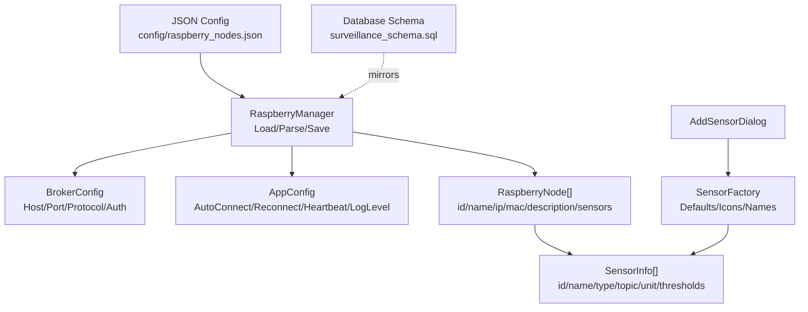
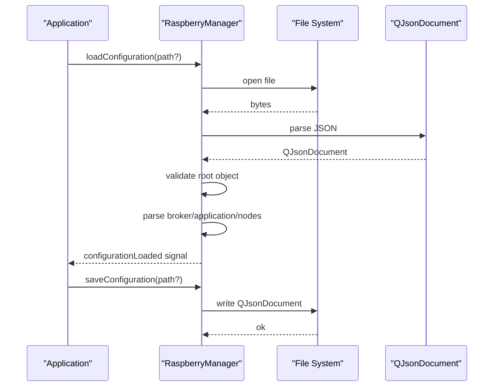
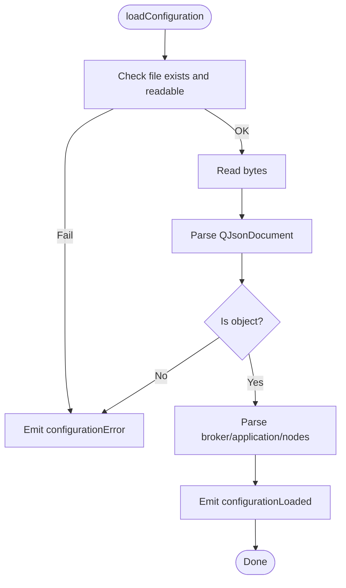
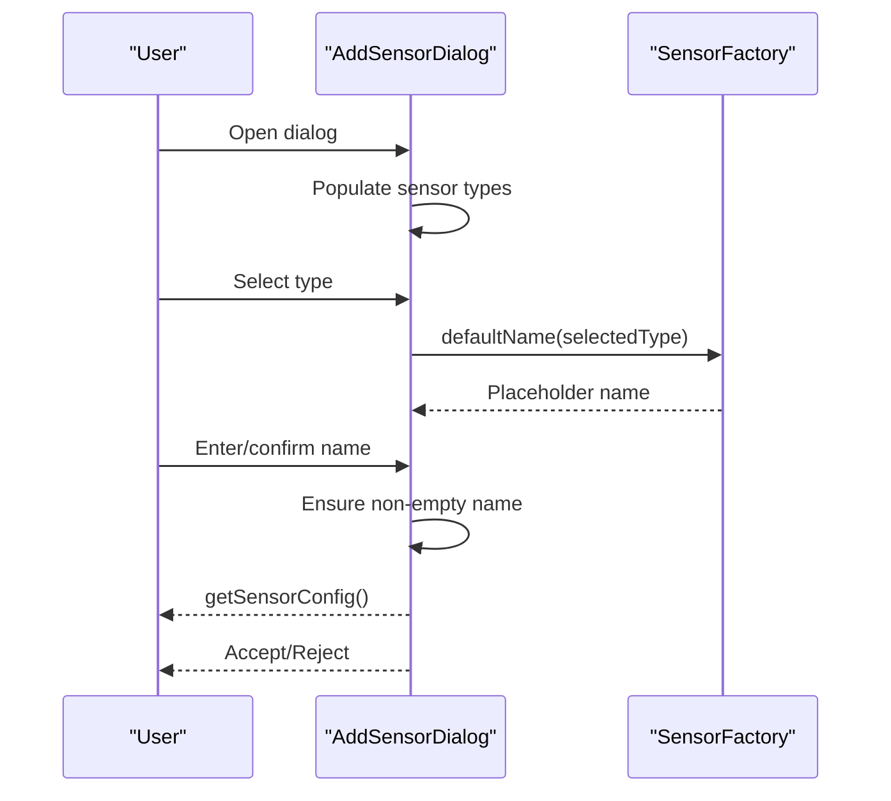
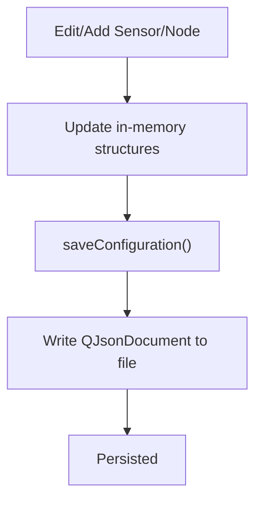
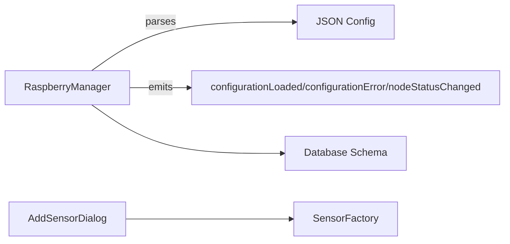

# Configuration Management

<cite>
**Referenced Files in This Document**
- [raspberry_nodes.json](file://config/raspberry_nodes.json)
- [raspberrymanager.h](file://raspberrymanager.h)
- [raspberrymanager.cpp](file://raspberrymanager.cpp)
- [addsensordialog.h](file://addsensordialog.h)
- [addsensordialog.cpp](file://addsensordialog.cpp)
- [sensorfactory.h](file://sensorfactory.h)
- [sensorfactory.cpp](file://sensorfactory.cpp)
- [surveillance_schema.sql](file://database/surveillance_schema.sql)
- [main.cpp](file://main.cpp)
</cite>

## Table of Contents
1. [Introduction](#introduction)
2. [Project Structure](#project-structure)
3. [Core Components](#core-components)
4. [Architecture Overview](#architecture-overview)
5. [Detailed Component Analysis](#detailed-component-analysis)
6. [Dependency Analysis](#dependency-analysis)
7. [Performance Considerations](#performance-considerations)
8. [Troubleshooting Guide](#troubleshooting-guide)
9. [Conclusion](#conclusion)
10. [Appendices](#appendices)

## Introduction
This document explains the configuration management system for Raspberry Pi nodes within the SurveillanceQT application. It covers the JSON configuration structure, validation and error handling, default templates, migration strategies, dynamic sensor configuration via AddSensorDialog, persistence and runtime updates, best practices, security considerations, and troubleshooting steps.

## Project Structure
The configuration system centers around:
- A JSON configuration file that defines broker settings, network parameters, and Raspberry Pi nodes with their sensors.
- A manager component that loads, validates, persists, and exposes configuration data.
- A dialog for dynamically adding sensors with defaults derived from a factory.
- A database schema that mirrors and extends configuration for persistent storage.

**Diagram sources**
- [raspberry_nodes.json:1-122](file://config/raspberry_nodes.json#L1-L122)
- [raspberrymanager.h:48-106](file://raspberrymanager.h#L48-L106)
- [raspberrymanager.cpp:181-304](file://raspberrymanager.cpp#L181-L304)
- [addsensordialog.cpp:126-147](file://addsensordialog.cpp#L126-L147)
- [sensorfactory.cpp:33-81](file://sensorfactory.cpp#L33-L81)
- [surveillance_schema.sql:50-116](file://database/surveillance_schema.sql#L50-L116)

**Section sources**
- [raspberry_nodes.json:1-122](file://config/raspberry_nodes.json#L1-L122)
- [raspberrymanager.h:63-106](file://raspberrymanager.h#L63-L106)
- [raspberrymanager.cpp:24-75](file://raspberrymanager.cpp#L24-L75)
- [addsensordialog.h:10-29](file://addsensordialog.h#L10-L29)
- [addsensordialog.cpp:12-21](file://addsensordialog.cpp#L12-L21)
- [sensorfactory.h:19-40](file://sensorfactory.h#L19-L40)
- [sensorfactory.cpp:1-103](file://sensorfactory.cpp#L1-L103)
- [surveillance_schema.sql:50-116](file://database/surveillance_schema.sql#L50-L116)

## Core Components
- JSON configuration file: Defines broker, application, network, and Raspberry Pi nodes with sensors.
- RaspberryManager: Loads, parses, validates, and saves configuration; exposes nodes and global settings.
- AddSensorDialog: UI for selecting sensor type and naming; produces SensorConfig with defaults.
- SensorFactory: Supplies default units, thresholds, icons, and names per sensor type.
- Database schema: Provides persistent storage for nodes, sensors, and system configuration.

**Section sources**
- [raspberry_nodes.json:1-122](file://config/raspberry_nodes.json#L1-L122)
- [raspberrymanager.h:63-106](file://raspberrymanager.h#L63-L106)
- [raspberrymanager.cpp:24-75](file://raspberrymanager.cpp#L24-L75)
- [addsensordialog.cpp:126-147](file://addsensordialog.cpp#L126-L147)
- [sensorfactory.cpp:33-81](file://sensorfactory.cpp#L33-L81)
- [surveillance_schema.sql:50-116](file://database/surveillance_schema.sql#L50-L116)

## Architecture Overview
The configuration lifecycle:
- Load JSON and validate structure.
- Parse broker, application, and nodes arrays.
- Persist parsed data in memory and optionally write back to disk.
- Expose configuration via typed structs and convenience queries.
- Allow dynamic sensor creation with defaults and append to a node.

**Diagram sources**
- [raspberrymanager.cpp:24-75](file://raspberrymanager.cpp#L24-L75)
- [raspberrymanager.cpp:181-237](file://raspberrymanager.cpp#L181-L237)

## Detailed Component Analysis

### JSON Configuration Structure
The configuration file organizes:
- Network: subnet and gateway.
- Broker: host, port, protocol, username, password.
- Application: auto_connect_on_startup, reconnect_interval_ms, heartbeat_interval_ms, log_level.
- Raspberry nodes: id, name, ip_address, mac_address, description, sensors array.
- Sensors: id, name, type, topic, unit, warning_threshold, alarm_threshold, plus device-specific fields (e.g., pin, stream_url, snapshot_url, resolution, fps, i2c_address).

Example references:
- [Network block:2-5](file://config/raspberry_nodes.json#L2-L5)
- [Broker block:108-114](file://config/raspberry_nodes.json#L108-L114)
- [Application block:115-120](file://config/raspberry_nodes.json#L115-L120)
- [Node with sensors:6-106](file://config/raspberry_nodes.json#L6-L106)
- [Camera sensor:42-52](file://config/raspberry_nodes.json#L42-L52)
- [Air quality sensors:61-92](file://config/raspberry_nodes.json#L61-L92)

Validation and defaults:
- Validation checks for existence and readability of the file, and a valid JSON object.
- Defaults are applied for missing broker/app settings during parsing.

Persistence:
- Save writes the current in-memory state back to the configured path.

**Section sources**
- [raspberry_nodes.json:1-122](file://config/raspberry_nodes.json#L1-L122)
- [raspberrymanager.cpp:24-75](file://raspberrymanager.cpp#L24-L75)
- [raspberrymanager.cpp:181-237](file://raspberrymanager.cpp#L181-L237)

### Configuration Loading and Parsing
Key behaviors:
- File existence and read permissions are verified.
- JSON is parsed into a document and validated as an object.
- Broker and application settings are extracted with sensible defaults.
- Nodes and sensors are iterated and stored in typed structures.

**Diagram sources**
- [raspberrymanager.cpp:24-52](file://raspberrymanager.cpp#L24-L52)
- [raspberrymanager.cpp:181-209](file://raspberrymanager.cpp#L181-L209)

**Section sources**
- [raspberrymanager.cpp:24-52](file://raspberrymanager.cpp#L24-L52)
- [raspberrymanager.cpp:181-209](file://raspberrymanager.cpp#L181-L209)

### Default Configuration Templates
Default values are embedded in the manager for broker and application settings. These act as fallbacks when keys are missing in the JSON.

- Broker defaults: host, port, protocol.
- Application defaults: autoConnectOnStartup, reconnectIntervalMs, heartbeatIntervalMs, logLevel.

These defaults are also reflected in the database schema’s system configuration table for operational parameters.

**Section sources**
- [raspberrymanager.cpp:11-22](file://raspberrymanager.cpp#L11-L22)
- [surveillance_schema.sql:131-139](file://database/surveillance_schema.sql#L131-L139)

### AddSensorDialog Implementation
Purpose:
- Provide a UI to select a sensor type and enter a name.
- Generate a SensorConfig with defaults for unit, thresholds, and an auto-generated ID.

Behavior:
- Populates a list of sensor types with icons.
- On selection, sets a placeholder name based on the selected type.
- On accept, ensures a non-empty name and returns a SensorConfig with defaults.

**Diagram sources**
- [addsensordialog.cpp:23-115](file://addsensordialog.cpp#L23-L115)
- [addsensordialog.cpp:117-147](file://addsensordialog.cpp#L117-L147)
- [sensorfactory.cpp:33-81](file://sensorfactory.cpp#L33-L81)

**Section sources**
- [addsensordialog.h:10-29](file://addsensordialog.h#L10-L29)
- [addsensordialog.cpp:12-21](file://addsensordialog.cpp#L12-L21)
- [addsensordialog.cpp:117-147](file://addsensordialog.cpp#L117-L147)
- [sensorfactory.h:19-40](file://sensorfactory.h#L19-L40)
- [sensorfactory.cpp:33-81](file://sensorfactory.cpp#L33-L81)

### SensorFactory Defaults
Provides:
- Default names per sensor type.
- Default units per sensor type.
- Default warning and alarm thresholds per sensor type.
- Icons and string representations for UI.

These defaults are used by AddSensorDialog to prefill values and ensure consistent initial configuration.

**Section sources**
- [sensorfactory.cpp:33-81](file://sensorfactory.cpp#L33-L81)

### Configuration Persistence and Runtime Updates
Persistence:
- Save method serializes in-memory structures to JSON and writes to disk.
- Ensures target directory exists before writing.

Runtime updates:
- Manager supports adding, updating, and removing nodes.
- Online status and last-seen timestamps can be updated, emitting signals for observers.

**Diagram sources**
- [raspberrymanager.cpp:112-135](file://raspberrymanager.cpp#L112-L135)
- [raspberrymanager.cpp:54-75](file://raspberrymanager.cpp#L54-L75)

**Section sources**
- [raspberrymanager.cpp:54-75](file://raspberrymanager.cpp#L54-L75)
- [raspberrymanager.cpp:112-135](file://raspberrymanager.cpp#L112-L135)

### Database Mirroring and Migration Strategies
The database schema mirrors configuration for persistent storage:
- Nodes and sensors are persisted with foreign key relationships.
- System configuration table stores operational parameters (e.g., MQTT host/port, network subnet).
- Default inserts provide baseline data.

Migration strategies:
- Versioned keys in system_config enable controlled upgrades.
- When migrating, read old keys, apply defaults if missing, and write new keys.
- Validate persisted nodes against current JSON schema expectations; reconcile differences.

**Section sources**
- [surveillance_schema.sql:50-116](file://database/surveillance_schema.sql#L50-L116)
- [surveillance_schema.sql:131-156](file://database/surveillance_schema.sql#L131-L156)

## Dependency Analysis
High-level dependencies:
- RaspberryManager depends on Qt JSON and file APIs.
- AddSensorDialog depends on SensorFactory for defaults.
- Database schema is external but aligns with configuration semantics.

**Diagram sources**
- [raspberrymanager.h:89-92](file://raspberrymanager.h#L89-L92)
- [addsensordialog.cpp:126-147](file://addsensordialog.cpp#L126-L147)
- [sensorfactory.cpp:33-81](file://sensorfactory.cpp#L33-L81)
- [surveillance_schema.sql:50-116](file://database/surveillance_schema.sql#L50-L116)

**Section sources**
- [raspberrymanager.h:89-92](file://raspberrymanager.h#L89-L92)
- [addsensordialog.cpp:126-147](file://addsensordialog.cpp#L126-L147)
- [sensorfactory.cpp:33-81](file://sensorfactory.cpp#L33-L81)
- [surveillance_schema.sql:50-116](file://database/surveillance_schema.sql#L50-L116)

## Performance Considerations
- Keep JSON small and avoid unnecessary nested structures.
- Batch updates to nodes and sensors to minimize repeated writes.
- Use incremental parsing and targeted updates for large configurations.
- Cache frequently accessed settings (e.g., broker/app) in memory.

## Troubleshooting Guide
Common issues and resolutions:
- Configuration file not found or unreadable:
  - Verify path and permissions; ensure the default path resolves correctly.
  - Check for typos in the filename or directory.
- Invalid JSON:
  - Validate JSON syntax; ensure root is an object.
  - Confirm arrays and required keys are present.
- Broker/App defaults not applied:
  - Ensure missing keys are absent from JSON; defaults are applied only for missing keys.
- Sensors not appearing:
  - Confirm sensor entries are inside the raspberry_nodes array and include required fields.
- Runtime updates not persisting:
  - Call saveConfiguration after modifying nodes or sensors.
- Node online status not updating:
  - Ensure setNodeOnline is invoked with a valid node ID.

**Section sources**
- [raspberrymanager.cpp:24-52](file://raspberrymanager.cpp#L24-L52)
- [raspberrymanager.cpp:54-75](file://raspberrymanager.cpp#L54-L75)
- [raspberrymanager.cpp:137-150](file://raspberrymanager.cpp#L137-L150)

## Conclusion
The configuration management system provides a robust, JSON-driven approach to define and manage Raspberry Pi nodes, sensors, and application behavior. It includes validation, defaults, persistence, and dynamic sensor creation. Aligning with the database schema enables long-term persistence and operational continuity.

## Appendices

### Best Practices for Configuration Management
- Use descriptive IDs and topics for nodes and sensors.
- Store only essential settings in JSON; keep secrets out of version control.
- Validate configuration at startup and fail fast on errors.
- Provide clear defaults for optional settings.
- Use incremental updates and batch writes to reduce I/O overhead.

### Security Considerations for Sensitive Settings
- Do not commit credentials to the JSON file.
- Prefer environment variables or secure secret stores for passwords and tokens.
- Restrict file permissions on configuration files.
- Rotate credentials periodically and update system_config accordingly.

### Example References
- [Main application entry:5-14](file://main.cpp#L5-L14)
- [JSON configuration:1-122](file://config/raspberry_nodes.json#L1-L122)
- [RaspberryManager API:63-106](file://raspberrymanager.h#L63-L106)
- [AddSensorDialog UI:10-29](file://addsensordialog.h#L10-L29)
- [SensorFactory defaults:33-81](file://sensorfactory.cpp#L33-L81)
- [Database schema:50-116](file://database/surveillance_schema.sql#L50-L116)