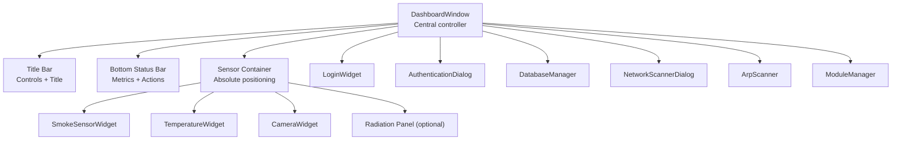
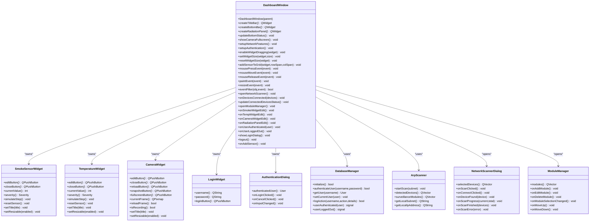
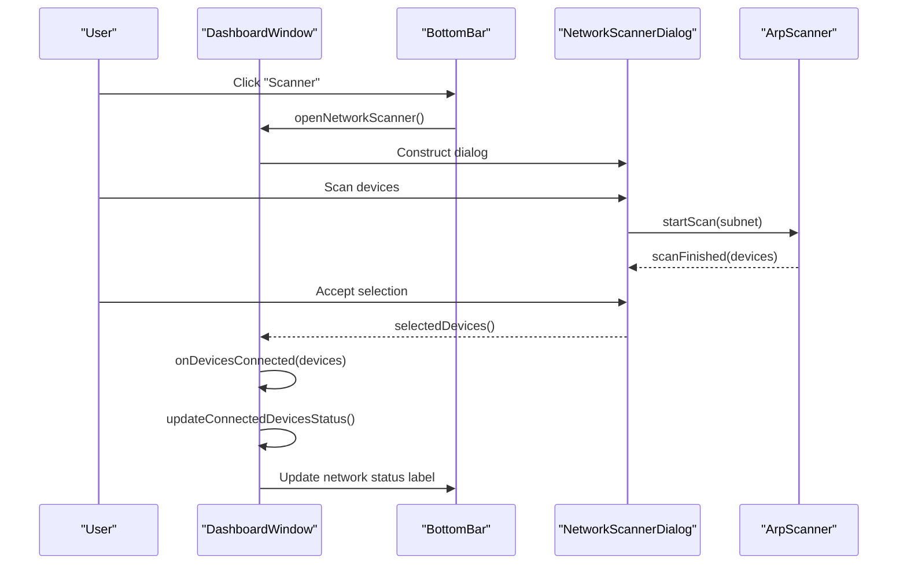
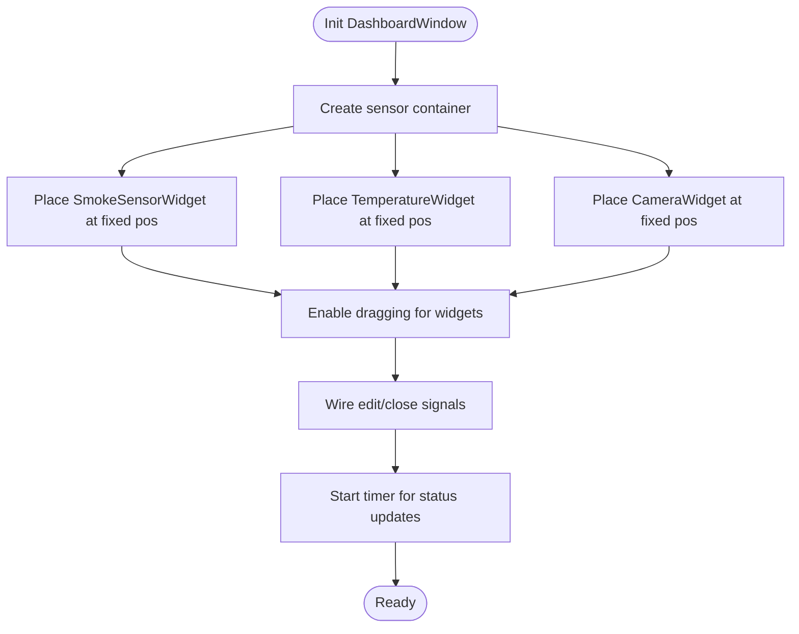
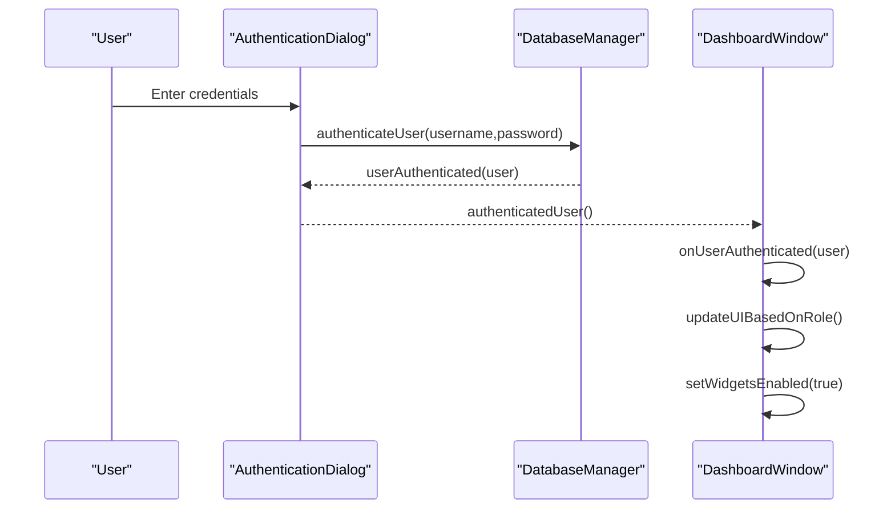
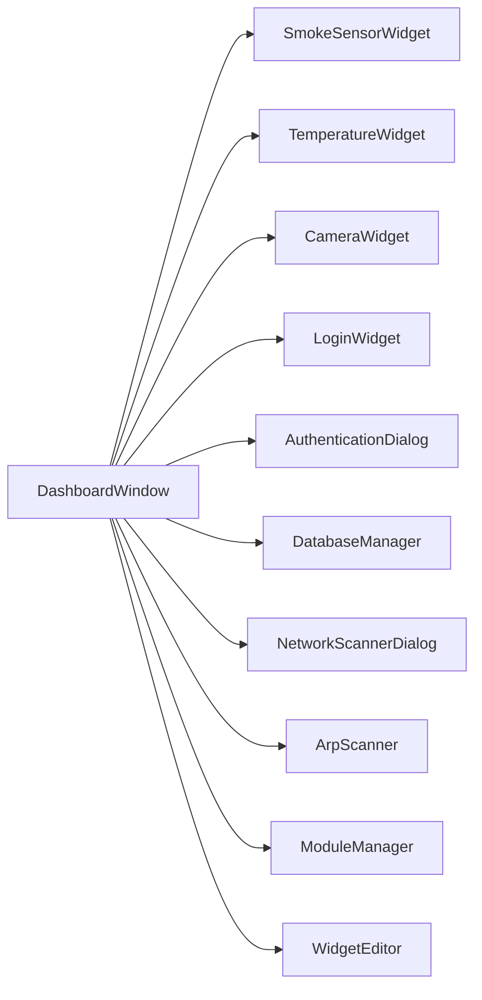

# Dashboard Interface

<cite>
**Referenced Files in This Document**
- [dashboardwindow.h](file://dashboardwindow.h)
- [dashboardwindow.cpp](file://dashboardwindow.cpp)
- [mainwindow.h](file://mainwindow.h)
- [mainwindow.cpp](file://mainwindow.cpp)
- [mainwindow.ui](file://mainwindow.ui)
- [smokesensorwidget.h](file://smokesensorwidget.h)
- [temperaturewidget.h](file://temperaturewidget.h)
- [camerawidget.h](file://camerawidget.h)
- [loginwidget.h](file://loginwidget.h)
- [widgeteditor.h](file://widgeteditor.h)
- [authenticationdialog.h](file://authenticationdialog.h)
- [databasemanager.h](file://databasemanager.h)
- [arpscanner.h](file://arpscanner.h)
- [networkscannerdialog.h](file://networkscannerdialog.h)
- [modulemanager.h](file://modulemanager.h)
</cite>

## Table of Contents
1. [Introduction](#introduction)
2. [Project Structure](#project-structure)
3. [Core Components](#core-components)
4. [Architecture Overview](#architecture-overview)
5. [Detailed Component Analysis](#detailed-component-analysis)
6. [Dependency Analysis](#dependency-analysis)
7. [Performance Considerations](#performance-considerations)
8. [Troubleshooting Guide](#troubleshooting-guide)
9. [Conclusion](#conclusion)
10. [Appendices](#appendices)

## Introduction
This document describes the dashboard interface components, focusing on the main window layout, title bar, bottom status bar, and sensor container management. It documents the DashboardWindow implementation as the central controller, event handling and user interactions, and integration with authentication, sensor management, and network discovery systems. It also covers the MainWindow UI design, window controls, layout management, responsive design principles, and accessibility features.

## Project Structure
The dashboard interface is primarily implemented in a custom QWidget-based window called DashboardWindow. Supporting components include sensor widgets (smoke, temperature, camera), login/authentication dialogs, network scanning utilities, and module management. The traditional MainWindow class exists but appears to be minimal and likely used elsewhere in the application lifecycle.

**Diagram sources**
- [dashboardwindow.cpp:71-244](file://dashboardwindow.cpp#L71-L244)
- [dashboardwindow.h:19-98](file://dashboardwindow.h#L19-L98)
- [smokesensorwidget.h:10-52](file://smokesensorwidget.h#L10-L52)
- [temperaturewidget.h:11-53](file://temperaturewidget.h#L11-L53)
- [camerawidget.h:9-39](file://camerawidget.h#L9-L39)
- [loginwidget.h:8-21](file://loginwidget.h#L8-L21)
- [authenticationdialog.h:14-46](file://authenticationdialog.h#L14-L46)
- [databasemanager.h:34-87](file://databasemanager.h#L34-L87)
- [networkscannerdialog.h:14-56](file://networkscannerdialog.h#L14-L56)
- [arpscanner.h:31-87](file://arpscanner.h#L31-L87)
- [modulemanager.h:18-51](file://modulemanager.h#L18-L51)

**Section sources**
- [dashboardwindow.cpp:71-244](file://dashboardwindow.cpp#L71-L244)
- [dashboardwindow.h:19-98](file://dashboardwindow.h#L19-L98)
- [mainwindow.h:12-22](file://mainwindow.h#L12-L22)
- [mainwindow.cpp:4-14](file://mainwindow.cpp#L4-L14)
- [mainwindow.ui:1-32](file://mainwindow.ui#L1-L32)

## Core Components
- DashboardWindow: Central controller managing layout, events, authentication, sensors, and network features. Implements drag-and-drop window movement, dynamic sensor containers, and bottom status updates.
- Sensor Widgets: SmokeSensorWidget, TemperatureWidget, and CameraWidget encapsulate sensor data, thresholds, UI, and actions (edit, close, reload, snapshot, fullscreen).
- Login and Authentication: LoginWidget and AuthenticationDialog integrate with DatabaseManager for user authentication and session management.
- Network Discovery: ArpScanner and NetworkScannerDialog provide subnet scanning and device selection.
- Module Management: ModuleManager handles module configuration and lifecycle.

Key responsibilities:
- Layout management via nested QWidgets with QVBoxLayout/HBoxLayout.
- Event handling for mouse drag, resize, timers, and button clicks.
- Integration with DatabaseManager for permissions and roles.
- Real-time status updates for active sensors and connected modules.

**Section sources**
- [dashboardwindow.h:19-98](file://dashboardwindow.h#L19-L98)
- [dashboardwindow.cpp:71-244](file://dashboardwindow.cpp#L71-L244)
- [smokesensorwidget.h:10-52](file://smokesensorwidget.h#L10-L52)
- [temperaturewidget.h:11-53](file://temperaturewidget.h#L11-L53)
- [camerawidget.h:9-39](file://camerawidget.h#L9-L39)
- [loginwidget.h:8-21](file://loginwidget.h#L8-L21)
- [authenticationdialog.h:14-46](file://authenticationdialog.h#L14-L46)
- [databasemanager.h:34-87](file://databasemanager.h#L34-L87)
- [arpscanner.h:31-87](file://arpscanner.h#L31-L87)
- [networkscannerdialog.h:14-56](file://networkscannerdialog.h#L14-L56)
- [modulemanager.h:18-51](file://modulemanager.h#L18-L51)

## Architecture Overview
The DashboardWindow composes the UI hierarchy and orchestrates interactions among widgets and subsystems. It initializes fixed-position sensor widgets inside an absolute-positioned container, sets up authentication and network features, and wires signals/slots for real-time updates.

**Diagram sources**
- [dashboardwindow.h:19-98](file://dashboardwindow.h#L19-L98)
- [dashboardwindow.cpp:71-244](file://dashboardwindow.cpp#L71-L244)
- [smokesensorwidget.h:10-52](file://smokesensorwidget.h#L10-L52)
- [temperaturewidget.h:11-53](file://temperaturewidget.h#L11-L53)
- [camerawidget.h:9-39](file://camerawidget.h#L9-L39)
- [loginwidget.h:8-21](file://loginwidget.h#L8-L21)
- [authenticationdialog.h:14-46](file://authenticationdialog.h#L14-L46)
- [databasemanager.h:34-87](file://databasemanager.h#L34-L87)
- [arpscanner.h:31-87](file://arpscanner.h#L31-L87)
- [networkscannerdialog.h:14-56](file://networkscannerdialog.h#L14-L56)
- [modulemanager.h:18-51](file://modulemanager.h#L18-L51)

## Detailed Component Analysis

### DashboardWindow: Central Controller
- Window chrome and root panel: Uses nested QWidgets with styled backgrounds and rounded corners.
- Title bar: Contains back, minimize, maximize, and close buttons; displays the main title.
- Bottom status bar: Shows active sensors count, alarms, warnings, defaults, network status, and quick actions (scan, add sensor, resize, settings).
- Sensor container: Absolute positioning for fixed widgets (smoke, temperature, camera). Dragging is enabled per widget.
- Timers: Periodic status updates for bottom bar metrics.
- Authentication overlay: Lock overlay and authentication gating for restricted actions.
- Network features: Local IP/subnet display and device scanning dialog integration.
- Widget editing: Per-widget edit dialogs via WidgetEditor.

User interactions:
- Mouse drag: Draggable window area near the title bar.
- Button actions: Scan network, add sensor, resize presets, open module manager, logout, fullscreen camera.
- Edit widgets: Opens WidgetEditor with configurable thresholds and units.

Integration points:
- DatabaseManager for authentication and permissions.
- ArpScanner and NetworkScannerDialog for network discovery.
- ModuleManager for module configuration.
- Sensor widgets for status aggregation.

**Section sources**
- [dashboardwindow.cpp:71-244](file://dashboardwindow.cpp#L71-L244)
- [dashboardwindow.cpp:246-300](file://dashboardwindow.cpp#L246-L300)
- [dashboardwindow.cpp:375-559](file://dashboardwindow.cpp#L375-L559)
- [dashboardwindow.cpp:574-614](file://dashboardwindow.cpp#L574-L614)
- [dashboardwindow.cpp:616-639](file://dashboardwindow.cpp#L616-L639)
- [dashboardwindow.cpp:641-666](file://dashboardwindow.cpp#L641-L666)
- [dashboardwindow.cpp:668-679](file://dashboardwindow.cpp#L668-L679)
- [dashboardwindow.cpp:681-709](file://dashboardwindow.cpp#L681-L709)
- [dashboardwindow.cpp:711-728](file://dashboardwindow.cpp#L711-L728)
- [dashboardwindow.cpp:730-740](file://dashboardwindow.cpp#L730-L740)
- [dashboardwindow.cpp:742-800](file://dashboardwindow.cpp#L742-L800)
- [dashboardwindow.h:19-98](file://dashboardwindow.h#L19-L98)

#### Layout Management and Responsive Design
- Fixed layout with margins and spacing for chrome, root panel, title bar, and bottom bar.
- Sensor container uses absolute positioning for fixed widgets; dragging allows repositioning.
- Resize presets adjust widget sizes; “Auto” resets sizing.
- Bottom bar uses stretch to keep right-side controls aligned.

Accessibility considerations:
- High contrast color scheme with dark backgrounds and light text.
- Keyboard-accessible buttons and dialogs.
- Visual status bubbles for severity levels.

**Section sources**
- [dashboardwindow.cpp:135-193](file://dashboardwindow.cpp#L135-L193)
- [dashboardwindow.cpp:163-186](file://dashboardwindow.cpp#L163-L186)
- [dashboardwindow.cpp:474-537](file://dashboardwindow.cpp#L474-L537)
- [dashboardwindow.cpp:574-614](file://dashboardwindow.cpp#L574-L614)

#### Event Handling and User Interactions
- Mouse drag: Detects click in top region, tracks global mouse movement, moves window while dragging.
- Timer-driven status updates: Aggregates active sensors and severity counts.
- Dialogs: Camera fullscreen preview, network scanner, module manager, widget editor.

**Diagram sources**
- [dashboardwindow.cpp:681-709](file://dashboardwindow.cpp#L681-L709)
- [dashboardwindow.cpp:711-728](file://dashboardwindow.cpp#L711-L728)
- [arpscanner.h:35-60](file://arpscanner.h#L35-L60)
- [networkscannerdialog.h:17-33](file://networkscannerdialog.h#L17-L33)

### MainWindow UI Design
- Minimal QMainWindow wrapper with central widget, menu bar, and status bar.
- Likely used as the initial application window before transitioning to DashboardWindow.

**Section sources**
- [mainwindow.h:12-22](file://mainwindow.h#L12-L22)
- [mainwindow.cpp:4-14](file://mainwindow.cpp#L4-L14)
- [mainwindow.ui:1-32](file://mainwindow.ui#L1-L32)

### Sensor Container Management
- Absolute positioning for smoke, temperature, and camera widgets.
- Dragging enabled per widget to allow repositioning.
- Edit/close buttons wired to hide/show and update status.

**Diagram sources**
- [dashboardwindow.cpp:163-186](file://dashboardwindow.cpp#L163-L186)
- [dashboardwindow.cpp:196-231](file://dashboardwindow.cpp#L196-L231)
- [dashboardwindow.cpp:236-239](file://dashboardwindow.cpp#L236-L239)

### Authentication and Permissions
- AuthenticationDialog integrates with DatabaseManager for login and user info.
- DashboardWindow manages lock overlay and permission-based UI updates.
- User roles influence available actions and visibility of sensitive features.

**Diagram sources**
- [authenticationdialog.h:25-34](file://authenticationdialog.h#L25-L34)
- [databasemanager.h:48-51](file://databasemanager.h#L48-L51)
- [dashboardwindow.h:43-65](file://dashboardwindow.h#L43-L65)
- [dashboardwindow.cpp:561-572](file://dashboardwindow.cpp#L561-L572)

### Network Discovery Integration
- DashboardWindow queries local IP and subnet and displays them.
- NetworkScannerDialog performs ARP scans and lets users select devices.
- Selected devices update the bottom bar network status.

**Section sources**
- [dashboardwindow.cpp:668-679](file://dashboardwindow.cpp#L668-L679)
- [dashboardwindow.cpp:681-709](file://dashboardwindow.cpp#L681-L709)
- [dashboardwindow.cpp:711-728](file://dashboardwindow.cpp#L711-L728)
- [arpscanner.h:47-48](file://arpscanner.h#L47-L48)
- [arpscanner.h:40-45](file://arpscanner.h#L40-L45)
- [networkscannerdialog.h:23-33](file://networkscannerdialog.h#L23-L33)

### Module Management Integration
- Settings button opens ModuleManager dialog for module configuration.
- ModuleManager supports add/edit/delete and ordering.

**Section sources**
- [dashboardwindow.cpp:423-424](file://dashboardwindow.cpp#L423-L424)
- [modulemanager.h:26-32](file://modulemanager.h#L26-L32)

## Dependency Analysis
- DashboardWindow depends on sensor widgets, login/authentication components, network utilities, and module manager.
- Sensor widgets expose edit/close buttons and severity metrics used by DashboardWindow’s status bar.
- AuthenticationDialog and DatabaseManager enforce role-based access.
- NetworkScannerDialog and ArpScanner provide device discovery.

**Diagram sources**
- [dashboardwindow.h:19-98](file://dashboardwindow.h#L19-L98)
- [smokesensorwidget.h:10-52](file://smokesensorwidget.h#L10-L52)
- [temperaturewidget.h:11-53](file://temperaturewidget.h#L11-L53)
- [camerawidget.h:9-39](file://camerawidget.h#L9-L39)
- [loginwidget.h:8-21](file://loginwidget.h#L8-L21)
- [authenticationdialog.h:14-46](file://authenticationdialog.h#L14-L46)
- [databasemanager.h:34-87](file://databasemanager.h#L34-L87)
- [networkscannerdialog.h:14-56](file://networkscannerdialog.h#L14-L56)
- [arpscanner.h:31-87](file://arpscanner.h#L31-L87)
- [modulemanager.h:18-51](file://modulemanager.h#L18-L51)
- [widgeteditor.h:20-40](file://widgeteditor.h#L20-L40)

**Section sources**
- [dashboardwindow.h:19-98](file://dashboardwindow.h#L19-L98)
- [dashboardwindow.cpp:71-244](file://dashboardwindow.cpp#L71-L244)

## Performance Considerations
- Status updates are timer-driven; avoid excessive recalculation by caching visibility and severity states.
- Camera fullscreen dialog scales images; consider lazy loading and memory management for large frames.
- Network scanning should be throttled to prevent UI blocking; progress updates keep the interface responsive.
- Dragging and resizing operations should minimize layout recalculations by batching updates.

## Troubleshooting Guide
Common issues and resolutions:
- No network status: Verify local IP/subnet detection and ensure ArpScanner is initialized.
- Camera snapshot fails: Confirm current frame availability and write permissions for the chosen file path.
- Widget edit dialog does not apply changes: Ensure WidgetEditor returns a valid configuration and that the widget’s title is updated accordingly.
- Authentication failures: Check DatabaseManager logs and credential validation.
- Sensor visibility not reflected: Ensure updateBottomStatus accounts for widget visibility and severity.

**Section sources**
- [dashboardwindow.cpp:218-231](file://dashboardwindow.cpp#L218-L231)
- [dashboardwindow.cpp:574-614](file://dashboardwindow.cpp#L574-L614)
- [authenticationdialog.h:25-34](file://authenticationdialog.h#L25-L34)
- [databasemanager.h:48-51](file://databasemanager.h#L48-L51)

## Conclusion
The DashboardWindow serves as the central hub for the surveillance dashboard, integrating sensor widgets, authentication, network discovery, and module management. Its layout system combines styled panels, absolute-positioned sensors, and a responsive bottom bar. Robust event handling, timer-driven updates, and dialog integrations provide a cohesive user experience with clear accessibility and permission-aware controls.

## Appendices
- WidgetEditor configuration model supports threshold-based widgets and camera-specific modes.
- Role-based permissions determine which actions are enabled in the UI.

**Section sources**
- [widgeteditor.h:10-40](file://widgeteditor.h#L10-L40)
- [databasemanager.h:9-32](file://databasemanager.h#L9-L32)