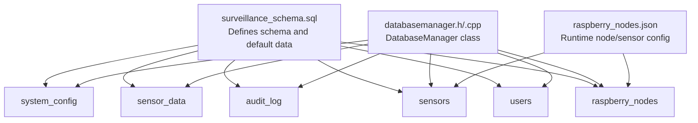
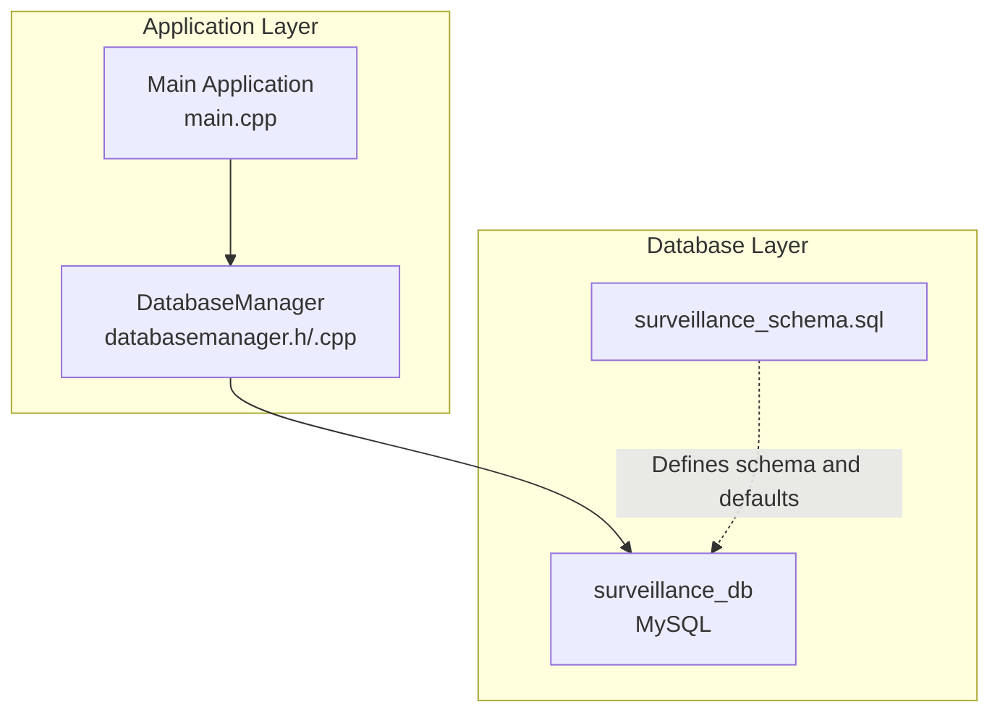
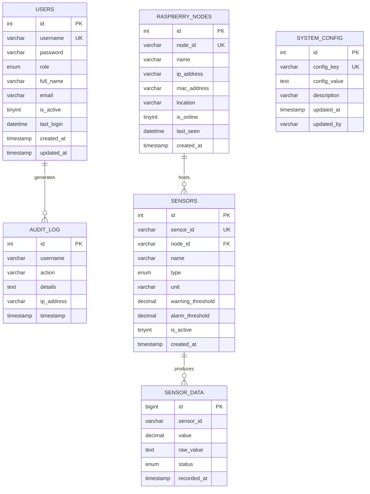
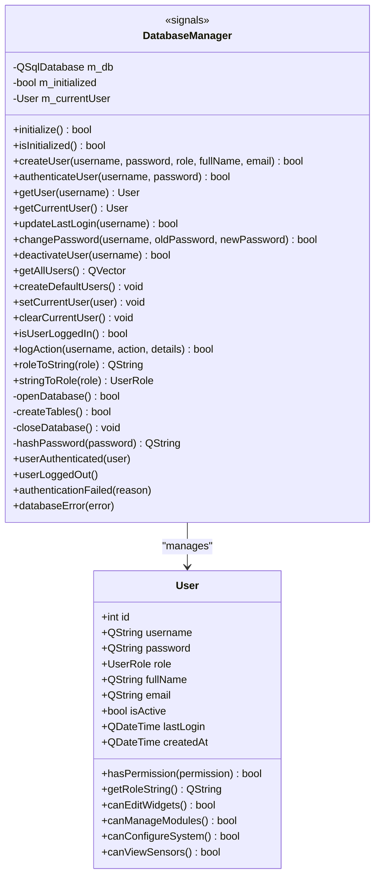
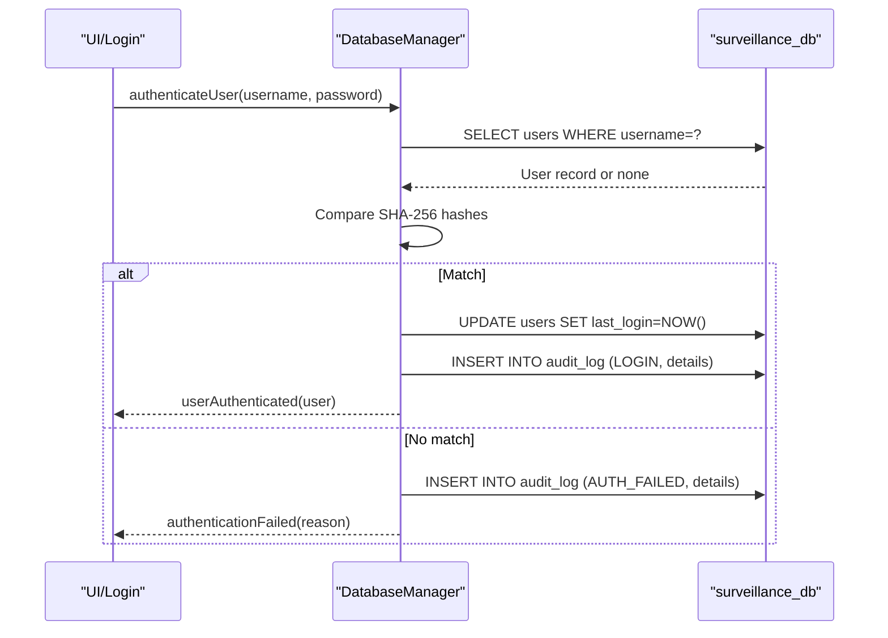
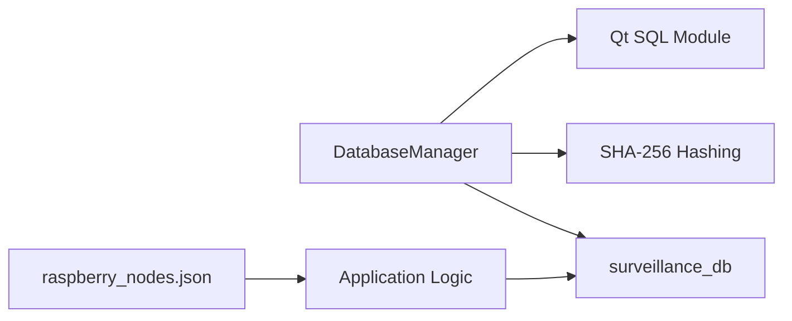

# Database Design

<cite>
**Referenced Files in This Document**
- [surveillance_schema.sql](file://database/surveillance_schema.sql)
- [databasemanager.h](file://databasemanager.h)
- [databasemanager.cpp](file://databasemanager.cpp)
- [main.cpp](file://main.cpp)
- [raspberry_nodes.json](file://config/raspberry_nodes.json)
</cite>

## Table of Contents
1. [Introduction](#introduction)
2. [Project Structure](#project-structure)
3. [Core Components](#core-components)
4. [Architecture Overview](#architecture-overview)
5. [Detailed Component Analysis](#detailed-component-analysis)
6. [Dependency Analysis](#dependency-analysis)
7. [Performance Considerations](#performance-considerations)
8. [Troubleshooting Guide](#troubleshooting-guide)
9. [Conclusion](#conclusion)
10. [Appendices](#appendices)

## Introduction
This document provides comprehensive data model documentation for the SurveillanceQT database schema. It details all database tables, their relationships, primary and foreign keys, indexes, and constraints. It also explains the initialization process, default data population, schema evolution strategies, and the DatabaseManager implementation covering connection handling, query execution patterns, and error signaling. Finally, it outlines common queries and data access patterns used throughout the application.

## Project Structure
The database design is defined by a single schema script and complemented by a Qt-based DatabaseManager that handles connections and user/session management. Additional configuration files define runtime node and sensor metadata consumed by the application.

**Diagram sources**
- [surveillance_schema.sql:1-157](file://database/surveillance_schema.sql#L1-L157)
- [databasemanager.h:34-87](file://databasemanager.h#L34-L87)
- [databasemanager.cpp:48-115](file://databasemanager.cpp#L48-L115)
- [raspberry_nodes.json:1-122](file://config/raspberry_nodes.json#L1-L122)

**Section sources**
- [surveillance_schema.sql:1-157](file://database/surveillance_schema.sql#L1-L157)
- [databasemanager.h:34-87](file://databasemanager.h#L34-L87)
- [databasemanager.cpp:48-115](file://databasemanager.cpp#L48-L115)
- [raspberry_nodes.json:1-122](file://config/raspberry_nodes.json#L1-L122)

## Core Components
This section documents the database schema and the DatabaseManager that interacts with it.

- Database schema definition script creates the following tables:
  - users
  - audit_log
  - raspberry_nodes
  - sensors
  - sensor_data
  - system_config

- Default data includes:
  - Predefined users with hashed passwords
  - System configuration entries
  - Default Raspberry Pi nodes and sensors

- DatabaseManager responsibilities:
  - Initialize database connection
  - Create tables for SQLite (MySQL uses the schema script)
  - Manage users and sessions
  - Log actions to audit_log
  - Hash passwords using SHA-256

**Section sources**
- [surveillance_schema.sql:14-157](file://database/surveillance_schema.sql#L14-L157)
- [databasemanager.cpp:21-41](file://databasemanager.cpp#L21-L41)
- [databasemanager.cpp:74-115](file://databasemanager.cpp#L74-L115)
- [databasemanager.cpp:117-135](file://databasemanager.cpp#L117-L135)

## Architecture Overview
The SurveillanceQT application uses a MySQL database for production and supports an embedded SQLite mode via the DatabaseManager. The schema script defines the canonical structure, while the DatabaseManager encapsulates connection and user management logic.

**Diagram sources**
- [main.cpp:5-14](file://main.cpp#L5-L14)
- [databasemanager.cpp:48-65](file://databasemanager.cpp#L48-L65)
- [surveillance_schema.sql:6-11](file://database/surveillance_schema.sql#L6-L11)

**Section sources**
- [main.cpp:5-14](file://main.cpp#L5-L14)
- [databasemanager.cpp:48-65](file://databasemanager.cpp#L48-L65)
- [surveillance_schema.sql:6-11](file://database/surveillance_schema.sql#L6-L11)

## Detailed Component Analysis

### Database Schema Model
The schema defines six tables with explicit primary keys, indexes, and constraints. Relationships are enforced via foreign keys and unique constraints.

**Diagram sources**
- [surveillance_schema.sql:16-116](file://database/surveillance_schema.sql#L16-L116)

**Section sources**
- [surveillance_schema.sql:16-116](file://database/surveillance_schema.sql#L16-L116)

### Entity Relationships and Constraints
- Primary keys:
  - users.id
  - audit_log.id
  - raspberry_nodes.id
  - sensors.id
  - sensor_data.id
  - system_config.id

- Unique keys:
  - users.username
  - raspberry_nodes.node_id
  - sensors.sensor_id
  - system_config.config_key

- Foreign keys:
  - sensors.node_id → raspberry_nodes.node_id (ON DELETE CASCADE)

- Indexes:
  - users: idx_username, idx_role, idx_active
  - audit_log: idx_username, idx_action, idx_timestamp
  - raspberry_nodes: idx_ip, idx_online
  - sensors: idx_node, idx_type, idx_active
  - sensor_data: idx_sensor, idx_recorded, idx_status
  - system_config: idx_key

- Data integrity rules:
  - ENUM constraints for role, type, and status
  - Timestamp defaults and updates
  - Numeric thresholds for warning/alarm
  - Active flag for user and sensor records

**Section sources**
- [surveillance_schema.sql:16-116](file://database/surveillance_schema.sql#L16-L116)

### Database Initialization and Default Data
- Database creation and selection:
  - Creates surveillance_db with utf8mb4 character set and collation
  - Uses surveillance_db for subsequent operations

- Default data population:
  - Users: admin, operator, viewer with pre-hashed passwords
  - System configuration: MQTT broker host/port, network subnet, retention days, alert settings
  - Raspberry nodes and sensors: sample hardware configurations

- Initialization flow:
  - DatabaseManager::initialize opens MySQL connection
  - For SQLite, DatabaseManager creates minimal tables and default users
  - For MySQL, the schema script is responsible for full schema and defaults

**Section sources**
- [surveillance_schema.sql:6-11](file://database/surveillance_schema.sql#L6-L11)
- [surveillance_schema.sql:122-157](file://database/surveillance_schema.sql#L122-L157)
- [databasemanager.cpp:21-41](file://databasemanager.cpp#L21-L41)
- [databasemanager.cpp:74-115](file://databasemanager.cpp#L74-L115)
- [databasemanager.cpp:117-135](file://databasemanager.cpp#L117-L135)

### DatabaseManager Implementation
The DatabaseManager class encapsulates database connectivity and user/session management. It emits signals for authentication events and database errors.

**Diagram sources**
- [databasemanager.h:34-87](file://databasemanager.h#L34-L87)
- [databasemanager.cpp:10-19](file://databasemanager.cpp#L10-L19)
- [databasemanager.cpp:158-198](file://databasemanager.cpp#L158-L198)
- [databasemanager.cpp:309-319](file://databasemanager.cpp#L309-L319)

**Section sources**
- [databasemanager.h:34-87](file://databasemanager.h#L34-L87)
- [databasemanager.cpp:10-19](file://databasemanager.cpp#L10-L19)
- [databasemanager.cpp:158-198](file://databasemanager.cpp#L158-L198)
- [databasemanager.cpp:309-319](file://databasemanager.cpp#L309-L319)

### Authentication and Session Flow

**Diagram sources**
- [databasemanager.cpp:158-198](file://databasemanager.cpp#L158-L198)
- [databasemanager.cpp:228-234](file://databasemanager.cpp#L228-L234)
- [databasemanager.cpp:309-319](file://databasemanager.cpp#L309-L319)

**Section sources**
- [databasemanager.cpp:158-198](file://databasemanager.cpp#L158-L198)
- [databasemanager.cpp:228-234](file://databasemanager.cpp#L228-L234)
- [databasemanager.cpp:309-319](file://databasemanager.cpp#L309-L319)

### Data Access Patterns and Common Queries
- User management:
  - Insert user with hashed password
  - Authenticate by username and active status
  - Update last login timestamp
  - Change password after verifying current hash
  - Deactivate user
  - List all users ordered by creation date

- Audit logging:
  - Log successful login and failed attempts
  - Emit logout event with action logging

- Connection handling:
  - Open MySQL connection with localhost credentials
  - Close database on destruction
  - Initialize only once

- Runtime configuration:
  - Raspberry Pi nodes and sensors are defined in JSON and mapped to sensors and raspberry_nodes tables

**Section sources**
- [databasemanager.cpp:137-156](file://databasemanager.cpp#L137-L156)
- [databasemanager.cpp:158-198](file://databasemanager.cpp#L158-L198)
- [databasemanager.cpp:228-234](file://databasemanager.cpp#L228-L234)
- [databasemanager.cpp:236-259](file://databasemanager.cpp#L236-L259)
- [databasemanager.cpp:261-267](file://databasemanager.cpp#L261-L267)
- [databasemanager.cpp:269-288](file://databasemanager.cpp#L269-L288)
- [databasemanager.cpp:295-302](file://databasemanager.cpp#L295-L302)
- [databasemanager.cpp:309-319](file://databasemanager.cpp#L309-L319)
- [databasemanager.cpp:48-65](file://databasemanager.cpp#L48-L65)
- [databasemanager.cpp:16-19](file://databasemanager.cpp#L16-L19)
- [raspberry_nodes.json:1-122](file://config/raspberry_nodes.json#L1-L122)

## Dependency Analysis
- DatabaseManager depends on Qt SQL module and cryptographic hashing.
- The schema script defines the authoritative structure; DatabaseManager aligns with it for MySQL and provides fallbacks for SQLite.
- Runtime node/sensor configuration is externalized in JSON and does not alter the schema but influences sensor records.

**Diagram sources**
- [databasemanager.cpp:3-8](file://databasemanager.cpp#L3-L8)
- [databasemanager.cpp:338-341](file://databasemanager.cpp#L338-L341)
- [surveillance_schema.sql:6-11](file://database/surveillance_schema.sql#L6-L11)
- [raspberry_nodes.json:1-122](file://config/raspberry_nodes.json#L1-L122)

**Section sources**
- [databasemanager.cpp:3-8](file://databasemanager.cpp#L3-L8)
- [databasemanager.cpp:338-341](file://databasemanager.cpp#L338-L341)
- [surveillance_schema.sql:6-11](file://database/surveillance_schema.sql#L6-L11)
- [raspberry_nodes.json:1-122](file://config/raspberry_nodes.json#L1-L122)

## Performance Considerations
- Indexes:
  - Users: username, role, is_active
  - Audit log: username, action, timestamp
  - Raspberry nodes: ip_address, is_online
  - Sensors: node_id, type, is_active
  - Sensor data: sensor_id, recorded_at, status
  - System config: config_key
- Recommendations:
  - Use appropriate ENUM values to minimize storage overhead
  - Keep threshold columns precise decimals for accurate comparisons
  - Monitor audit_log growth; consider partitioning or retention policies aligned with system_config.data_retention_days
  - Ensure MySQL server tuning for concurrent reads/writes from sensor_data

[No sources needed since this section provides general guidance]

## Troubleshooting Guide
- Connection failures:
  - Verify MySQL service is running and accessible
  - Confirm host, port, database name, and credentials
  - Check for firewall or driver availability

- Initialization issues:
  - Ensure surveillance_db exists or is creatable
  - Validate schema script ran successfully
  - For SQLite mode, confirm table creation and default user insertion

- Authentication problems:
  - Confirm user is_active
  - Verify password hashing matches SHA-256 expectations
  - Review audit_log entries for AUTH_FAILED details

- Signals and error reporting:
  - Listen for databaseError and authenticationFailed signals
  - Use userLoggedOut signal to handle session cleanup

**Section sources**
- [databasemanager.cpp:48-65](file://databasemanager.cpp#L48-L65)
- [databasemanager.cpp:164-178](file://databasemanager.cpp#L164-L178)
- [databasemanager.cpp:309-319](file://databasemanager.cpp#L309-L319)

## Conclusion
The SurveillanceQT database schema provides a robust foundation for user management, auditing, device and sensor tracking, and system configuration. The DatabaseManager centralizes connection handling, user operations, and audit logging, while the schema script ensures consistent structure and default data. Runtime configuration is externalized for flexibility, enabling dynamic node and sensor definitions without altering the core schema.

[No sources needed since this section summarizes without analyzing specific files]

## Appendices

### Schema Evolution Strategies
- Versioned migrations:
  - Add migration scripts incrementally
  - Track applied migrations in a dedicated table
- Backward compatibility:
  - Use optional columns and defaults
  - Avoid dropping columns; mark deprecated fields
- Data retention:
  - Align retention policies with system_config.data_retention_days
  - Periodically prune sensor_data older than configured threshold

[No sources needed since this section provides general guidance]