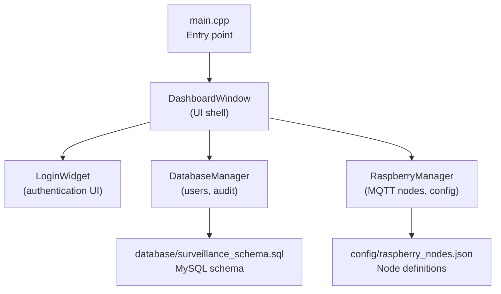
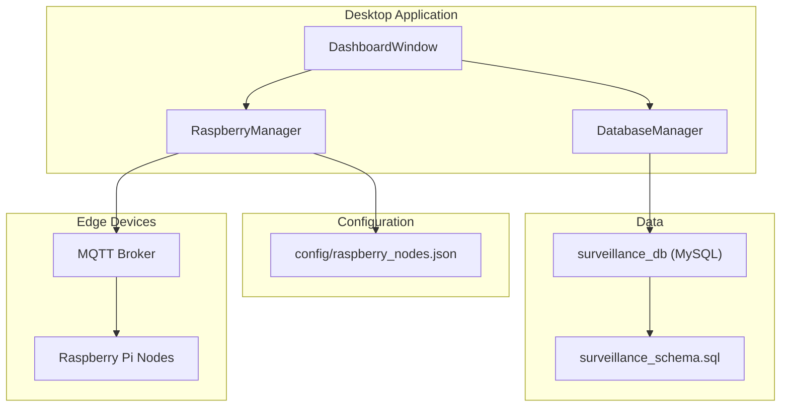
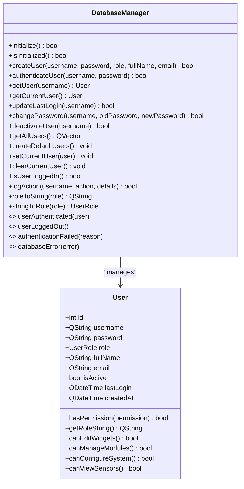
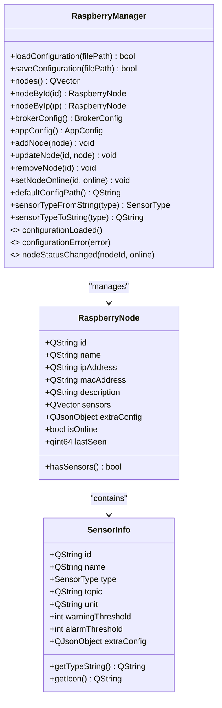
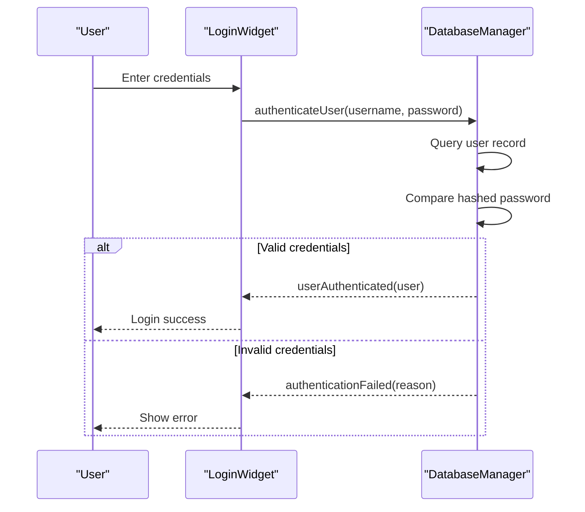
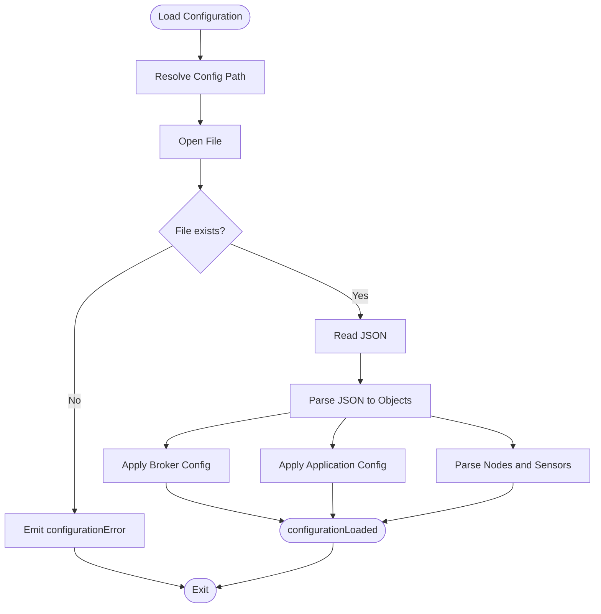
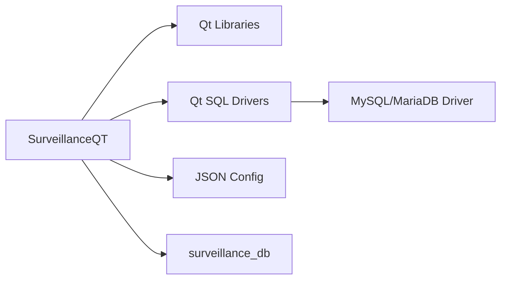

# Deployment and Maintenance

<cite>
**Referenced Files in This Document**
- [main.cpp](file://main.cpp)
- [dashboardwindow.h](file://dashboardwindow.h)
- [loginwidget.h](file://loginwidget.h)
- [databasemanager.h](file://databasemanager.h)
- [databasemanager.cpp](file://databasemanager.cpp)
- [database\surveillance_schema.sql](file://database/surveillance_schema.sql)
- [raspberrymanager.h](file://raspberrymanager.h)
- [raspberrymanager.cpp](file://raspberrymanager.cpp)
- [config\raspberry_nodes.json](file://config/raspberry_nodes.json)
- [.gitignore](file://.gitignore)
</cite>

## Table of Contents
1. [Introduction](#introduction)
2. [Project Structure](#project-structure)
3. [Core Components](#core-components)
4. [Architecture Overview](#architecture-overview)
5. [Detailed Component Analysis](#detailed-component-analysis)
6. [Dependency Analysis](#dependency-analysis)
7. [Performance Considerations](#performance-considerations)
8. [Troubleshooting Guide](#troubleshooting-guide)
9. [Conclusion](#conclusion)
10. [Appendices](#appendices)

## Introduction
This document provides comprehensive deployment and maintenance guidance for SurveillanceQT across Windows, Linux, and Raspberry Pi platforms. It covers system requirements, dependency installation, configuration, service setup, monitoring, backups, updates, troubleshooting, security hardening, performance tuning, and capacity planning. The application is a Qt-based desktop dashboard that manages MQTT-connected Raspberry Pi sensor nodes, authenticates users against a local database, and displays real-time sensor data and camera streams.

## Project Structure
SurveillanceQT is organized around a Qt/C++ desktop application with modular components for authentication, database management, MQTT node configuration, and UI widgets. Configuration is primarily JSON-based for MQTT broker and node definitions, while the database schema is provided for MySQL/MariaDB environments.

**Diagram sources**
- [main.cpp:1-15](file://main.cpp#L1-L15)
- [dashboardwindow.h:1-99](file://dashboardwindow.h#L1-L99)
- [loginwidget.h:1-22](file://loginwidget.h#L1-L22)
- [databasemanager.h:1-88](file://databasemanager.h#L1-L88)
- [raspberrymanager.h:1-107](file://raspberrymanager.h#L1-L107)
- [config\raspberry_nodes.json:1-122](file://config/raspberry_nodes.json#L1-L122)
- [database\surveillance_schema.sql:1-157](file://database/surveillance_schema.sql#L1-L157)

**Section sources**
- [main.cpp:1-15](file://main.cpp#L1-L15)
- [dashboardwindow.h:1-99](file://dashboardwindow.h#L1-L99)
- [loginwidget.h:1-22](file://loginwidget.h#L1-L22)
- [databasemanager.h:1-88](file://databasemanager.h#L1-L88)
- [raspberrymanager.h:1-107](file://raspberrymanager.h#L1-L107)
- [config\raspberry_nodes.json:1-122](file://config/raspberry_nodes.json#L1-L122)
- [database\surveillance_schema.sql:1-157](file://database/surveillance_schema.sql#L1-L157)

## Core Components
- Application entry and UI shell:
  - Entry point initializes the Qt application and opens the main dashboard window.
  - The dashboard integrates authentication, device scanning, module management, and sensor widgets.
- Database manager:
  - Handles user creation, authentication, session tracking, and audit logging.
  - Initializes database tables for SQLite or relies on schema for MySQL/MariaDB.
- Raspberry Pi manager:
  - Loads/stores MQTT broker and node configuration from JSON.
  - Manages node lists, online status, and sensor metadata.
- Configuration:
  - JSON configuration defines MQTT broker, application behavior, and per-node sensors.
  - Database schema defines persistent storage for users, audit logs, nodes, sensors, and system config.

**Section sources**
- [main.cpp:1-15](file://main.cpp#L1-L15)
- [dashboardwindow.h:1-99](file://dashboardwindow.h#L1-L99)
- [databasemanager.h:1-88](file://databasemanager.h#L1-L88)
- [databasemanager.cpp:21-41](file://databasemanager.cpp#L21-L41)
- [raspberrymanager.h:1-107](file://raspberrymanager.h#L1-L107)
- [raspberrymanager.cpp:24-52](file://raspberrymanager.cpp#L24-L52)
- [config\raspberry_nodes.json:1-122](file://config/raspberry_nodes.json#L1-L122)
- [database\surveillance_schema.sql:1-157](file://database/surveillance_schema.sql#L1-L157)

## Architecture Overview
The system architecture centers on a Qt desktop application that:
- Authenticates users via a local database.
- Connects to an MQTT broker to receive telemetry from Raspberry Pi nodes.
- Renders live sensor readings and camera streams in a configurable dashboard.
- Persists configuration and operational data locally or in a MySQL database.

**Diagram sources**
- [dashboardwindow.h:1-99](file://dashboardwindow.h#L1-L99)
- [databasemanager.h:1-88](file://databasemanager.h#L1-L88)
- [databasemanager.cpp:48-65](file://databasemanager.cpp#L48-L65)
- [raspberrymanager.cpp:112-155](file://raspberrymanager.cpp#L112-L155)
- [config\raspberry_nodes.json:1-122](file://config/raspberry_nodes.json#L1-L122)
- [database\surveillance_schema.sql:1-157](file://database/surveillance_schema.sql#L1-L157)

## Detailed Component Analysis

### Database Management
- Initialization:
  - Attempts to open a MySQL connection to localhost on the default port with a database name and credentials suitable for WAMP environments.
  - For SQLite drivers, creates tables and seeds default users.
- Authentication:
  - Validates credentials against hashed passwords and tracks last login and audit actions.
- Audit logging:
  - Records user actions with timestamps for compliance and troubleshooting.

**Diagram sources**
- [databasemanager.h:1-88](file://databasemanager.h#L1-L88)
- [databasemanager.cpp:10-382](file://databasemanager.cpp#L10-L382)

**Section sources**
- [databasemanager.cpp:21-41](file://databasemanager.cpp#L21-L41)
- [databasemanager.cpp:48-65](file://databasemanager.cpp#L48-L65)
- [databasemanager.cpp:158-198](file://databasemanager.cpp#L158-L198)
- [databasemanager.cpp:309-319](file://databasemanager.cpp#L309-L319)
- [database\surveillance_schema.sql:16-47](file://database/surveillance_schema.sql#L16-L47)

### Raspberry Pi Manager and Configuration
- Configuration loading and saving:
  - Loads JSON configuration from a default path under the application directory.
  - Supports dynamic updates and emits signals on status changes.
- Node and sensor model:
  - Defines node and sensor structures with thresholds and topics.
- MQTT defaults:
  - Provides default broker host, port, and protocol suitable for typical LAN deployments.

**Diagram sources**
- [raspberrymanager.h:1-107](file://raspberrymanager.h#L1-L107)
- [raspberrymanager.cpp:112-155](file://raspberrymanager.cpp#L112-L155)
- [raspberrymanager.cpp:181-209](file://raspberrymanager.cpp#L181-L209)
- [raspberrymanager.cpp:239-273](file://raspberrymanager.cpp#L239-L273)

**Section sources**
- [raspberrymanager.cpp:24-52](file://raspberrymanager.cpp#L24-L52)
- [raspberrymanager.cpp:112-155](file://raspberrymanager.cpp#L112-L155)
- [config\raspberry_nodes.json:1-122](file://config/raspberry_nodes.json#L1-L122)

### Authentication Flow
The authentication flow connects the login UI to the database manager, validates credentials, sets the current user, and logs successful or failed attempts.

**Diagram sources**
- [loginwidget.h:1-22](file://loginwidget.h#L1-L22)
- [databasemanager.cpp:158-198](file://databasemanager.cpp#L158-L198)

**Section sources**
- [loginwidget.h:1-22](file://loginwidget.h#L1-L22)
- [databasemanager.cpp:158-198](file://databasemanager.cpp#L158-L198)

### Configuration Loading Flow
The configuration loader reads JSON, parses broker and application settings, and loads node definitions with sensors.

**Diagram sources**
- [raspberrymanager.cpp:24-52](file://raspberrymanager.cpp#L24-L52)
- [raspberrymanager.cpp:181-209](file://raspberrymanager.cpp#L181-L209)

**Section sources**
- [raspberrymanager.cpp:24-52](file://raspberrymanager.cpp#L24-L52)
- [raspberrymanager.cpp:181-209](file://raspberrymanager.cpp#L181-L209)

## Dependency Analysis
- Qt runtime and plugins:
  - The application requires Qt libraries and platform-specific plugins for GUI rendering.
- Database connectivity:
  - Uses Qt SQL with MySQL driver; ensure the appropriate Qt SQL driver plugin is available.
- Platform-specific considerations:
  - Windows/Linux: standard Qt deployment with bundled runtime and drivers.
  - Raspberry Pi: ensure ARM-compatible Qt build and drivers; consider headless operation if needed.

**Diagram sources**
- [databasemanager.cpp:48-65](file://databasemanager.cpp#L48-L65)
- [config\raspberry_nodes.json:1-122](file://config/raspberry_nodes.json#L1-L122)
- [database\surveillance_schema.sql:1-157](file://database/surveillance_schema.sql#L1-L157)

**Section sources**
- [databasemanager.cpp:48-65](file://databasemanager.cpp#L48-L65)
- [config\raspberry_nodes.json:1-122](file://config/raspberry_nodes.json#L1-L122)
- [database\surveillance_schema.sql:1-157](file://database/surveillance_schema.sql#L1-L157)

## Performance Considerations
- Database:
  - Use MySQL/MariaDB for production; ensure indexes on frequently queried columns (users, audit_log, sensors).
  - Monitor slow queries and tune retention policies for sensor data.
- MQTT:
  - Adjust heartbeat and reconnect intervals based on network stability.
  - Limit message volume by filtering topics and avoiding excessive polling.
- UI:
  - Minimize frequent re-layouts; batch widget updates where possible.
  - Use lazy loading for camera streams and avoid unnecessary repaints.
- Storage:
  - Archive or purge historical sensor data according to compliance requirements.
  - Monitor disk usage for logs and media streams.

[No sources needed since this section provides general guidance]

## Troubleshooting Guide
- Database connection failures:
  - Verify MySQL service is running and reachable.
  - Confirm credentials and database name match the configured values.
  - Check that the MySQL Qt driver is present and loaded.
- Authentication errors:
  - Ensure default users exist or create users via the database schema.
  - Confirm password hashing and stored hashes align with expected values.
- Configuration loading errors:
  - Validate JSON syntax and required keys.
  - Confirm the configuration file path exists and is readable.
- Network and MQTT issues:
  - Verify broker host/port and network accessibility.
  - Check firewall rules and MQTT broker logs for client connections.
- Logs:
  - Review application logs for databaseError and configurationError signals.
  - Enable higher log levels in the application configuration for diagnostics.

**Section sources**
- [databasemanager.cpp:48-65](file://databasemanager.cpp#L48-L65)
- [databasemanager.cpp:158-198](file://databasemanager.cpp#L158-L198)
- [raspberrymanager.cpp:24-52](file://raspberrymanager.cpp#L24-L52)
- [config\raspberry_nodes.json:1-122](file://config/raspberry_nodes.json#L1-L122)

## Conclusion
SurveillanceQT provides a modular, Qt-based solution for managing distributed sensor nodes over MQTT with integrated authentication and configuration. Proper deployment requires MySQL/MariaDB for persistence, correct Qt SQL driver availability, and validated JSON configuration. Robust monitoring, backups, and performance tuning ensure reliable operations at scale.

[No sources needed since this section summarizes without analyzing specific files]

## Appendices

### A. Production Deployment Procedures

- Windows
  - Install Qt runtime and required SQL drivers.
  - Set up MySQL/MariaDB and apply the schema.
  - Place configuration file under the application directory and ensure permissions.
  - Configure Windows service or startup entry to launch the application.
- Linux
  - Install Qt and platform plugins; ensure SQL drivers are available.
  - Initialize MySQL/MariaDB and import the schema.
  - Deploy configuration file and set restrictive file permissions.
  - Register a systemd service for automatic startup.
- Raspberry Pi
  - Cross-compile or build Qt for ARM; include required SQL drivers.
  - Prepare minimal Linux image with networking and MQTT client support.
  - Copy configuration and ensure read-only access for security.
  - Run as a desktop session or kiosk mode depending on use case.

[No sources needed since this section provides general guidance]

### B. System Monitoring and Maintenance
- Health checks:
  - Monitor database connectivity, MQTT broker reachability, and node online status.
  - Track application logs for authentication and database errors.
- Auditing:
  - Review audit logs for login/logout and administrative actions.
- Capacity planning:
  - Scale MySQL horizontally if needed; monitor I/O and CPU.
  - Optimize sensor data retention and indexing strategy.

[No sources needed since this section provides general guidance]

### C. Backup and Recovery
- Database:
  - Schedule regular logical backups of the surveillance database.
  - Test restore procedures periodically.
- Configuration:
  - Version control the configuration JSON and maintain recent snapshots.
- Recovery:
  - Restore database from backups; reapply configuration and restart services.

[No sources needed since this section provides general guidance]

### D. Update Procedures and Rollback
- Updates:
  - Package new binaries with compatible Qt and driver versions.
  - Apply database schema changes carefully with downtime windows.
- Rollback:
  - Keep previous binary and database backups.
  - Revert to prior versions if post-update issues arise.

[No sources needed since this section provides general guidance]

### E. Security Hardening
- Database:
  - Enforce strong passwords and restrict database user privileges.
  - Enable TLS for MySQL connections.
- Application:
  - Restrict file permissions on configuration and logs.
  - Sanitize configuration inputs and validate JSON.
- Network:
  - Use secure MQTT transport (TLS) and strong credentials.
  - Segment networks and limit access to MQTT brokers.

[No sources needed since this section provides general guidance]