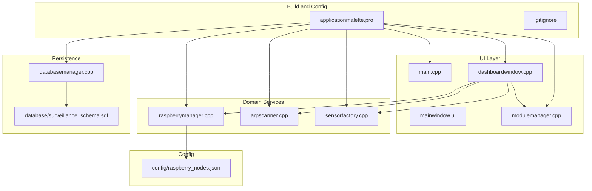
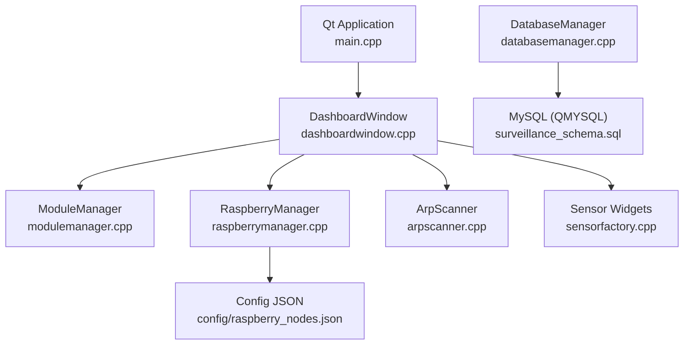
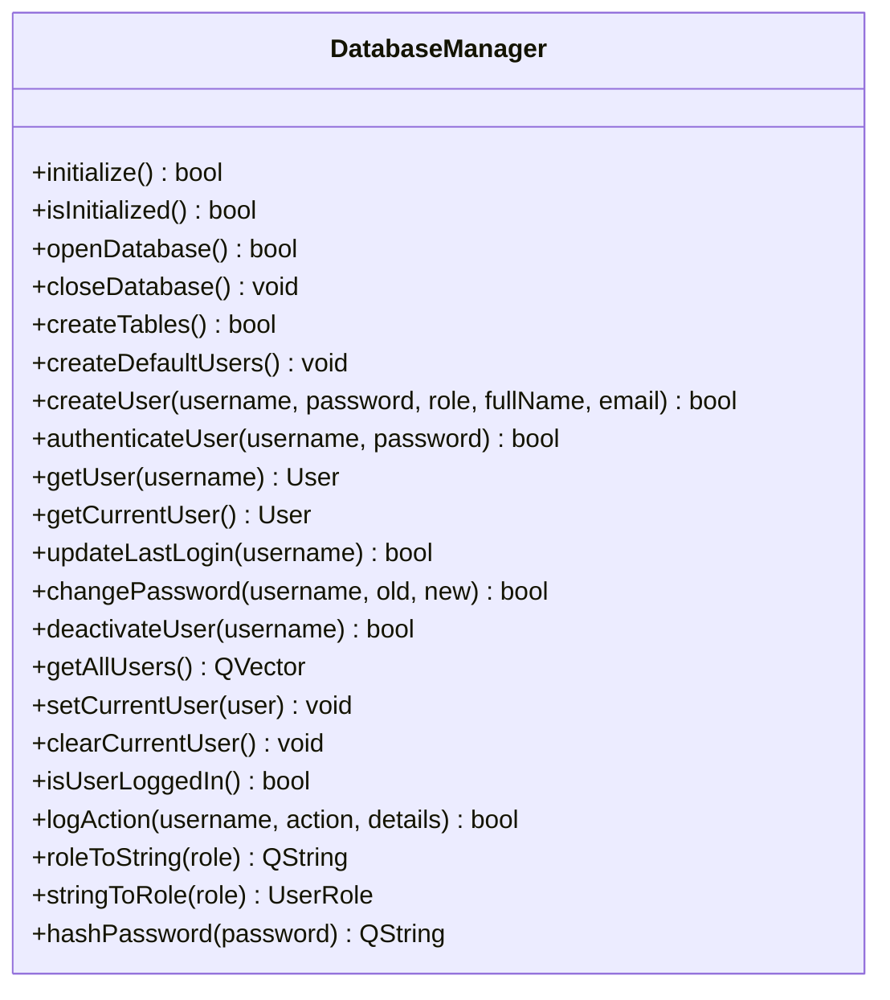
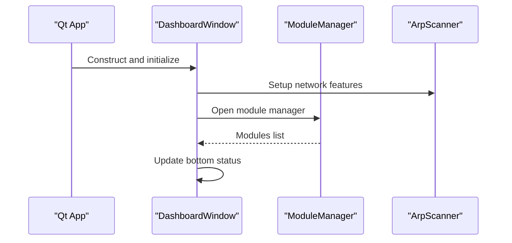
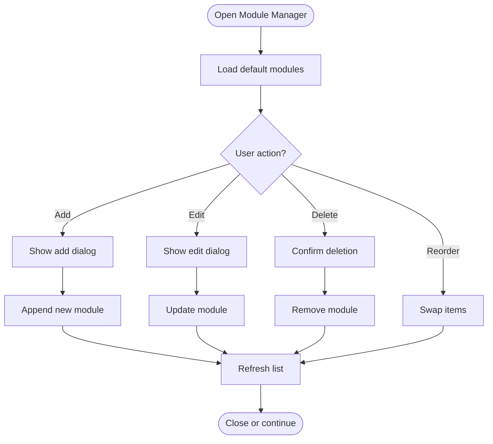
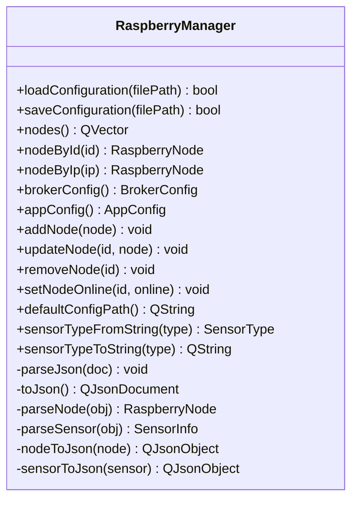
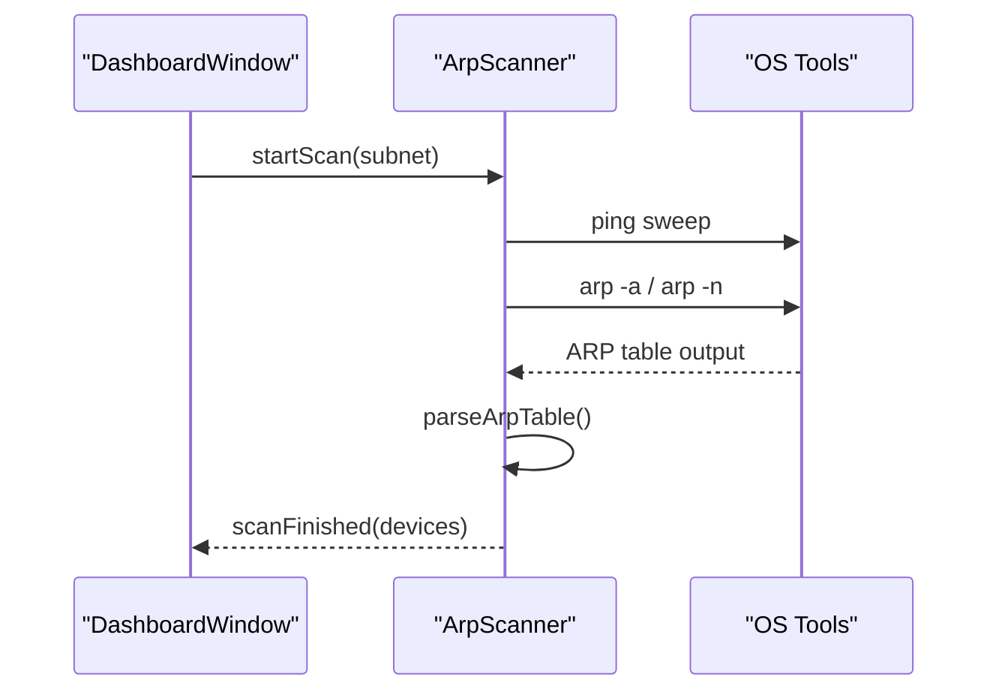
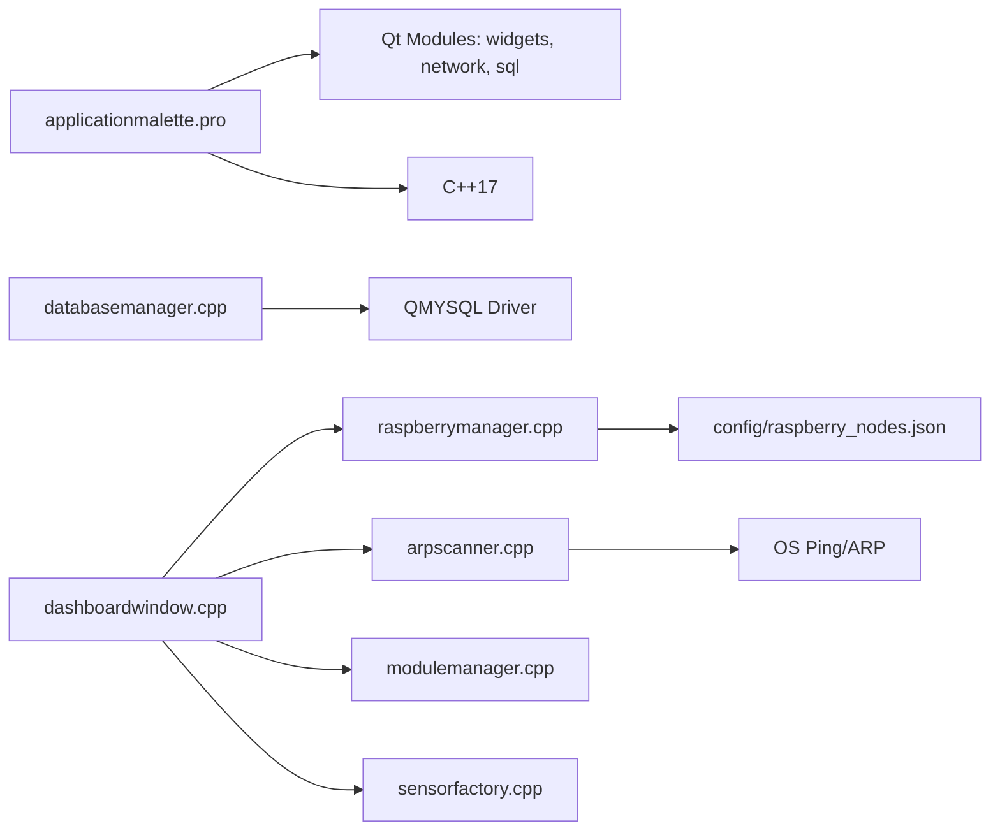

# Development and Testing

<cite>
**Referenced Files in This Document**
- [applicationmalette.pro](file://applicationmalette.pro)
- [.gitignore](file://.gitignore)
- [main.cpp](file://main.cpp)
- [mainwindow.ui](file://mainwindow.ui)
- [databasemanager.cpp](file://databasemanager.cpp)
- [database/surveillance_schema.sql](file://database/surveillance_schema.sql)
- [dashboardwindow.cpp](file://dashboardwindow.cpp)
- [modulemanager.cpp](file://modulemanager.cpp)
- [raspberrymanager.cpp](file://raspberrymanager.cpp)
- [sensorfactory.cpp](file://sensorfactory.cpp)
- [arpscanner.cpp](file://arpscanner.cpp)
- [config/raspberry_nodes.json](file://config/raspberry_nodes.json)
</cite>

## Table of Contents
1. [Introduction](#introduction)
2. [Project Structure](#project-structure)
3. [Core Components](#core-components)
4. [Architecture Overview](#architecture-overview)
5. [Detailed Component Analysis](#detailed-component-analysis)
6. [Dependency Analysis](#dependency-analysis)
7. [Performance Considerations](#performance-considerations)
8. [Testing Strategies](#testing-strategies)
9. [Debugging Techniques](#debugging-techniques)
10. [Code Quality Standards and Best Practices](#code-quality-standards-and-best-practices)
11. [Development Workflow and Version Control](#development-workflow-and-version-control)
12. [Troubleshooting Guide](#troubleshooting-guide)
13. [Conclusion](#conclusion)

## Introduction
This document provides comprehensive development and testing guidance for SurveillanceQT. It covers environment setup (Qt Creator, MySQL/WAMP), cross-platform compilation via qmake, project structure, build configuration, dependency management, testing strategies (unit, integration, end-to-end), debugging techniques (Qt Creator, database, network), code quality standards, and contribution workflow. The goal is to help developers quickly understand the codebase and contribute effectively across platforms.

## Project Structure
SurveillanceQT is a Qt/C++ desktop application organized around modular UI components, a database manager, and network scanning capabilities. The project uses qmake for building and includes a configuration file for Raspberry Pi nodes and MQTT broker settings.

**Diagram sources**
- [applicationmalette.pro:1-47](file://applicationmalette.pro#L1-L47)
- [main.cpp:1-15](file://main.cpp#L1-L15)
- [mainwindow.ui:1-32](file://mainwindow.ui#L1-L32)
- [dashboardwindow.cpp:1-244](file://dashboardwindow.cpp#L1-L244)
- [modulemanager.cpp:1-125](file://modulemanager.cpp#L1-L125)
- [raspberrymanager.cpp:1-110](file://raspberrymanager.cpp#L1-L110)
- [arpscanner.cpp:1-131](file://arpscanner.cpp#L1-L131)
- [sensorfactory.cpp:1-103](file://sensorfactory.cpp#L1-L103)
- [databasemanager.cpp:1-65](file://databasemanager.cpp#L1-L65)
- [database/surveillance_schema.sql:1-157](file://database/surveillance_schema.sql#L1-L157)
- [config/raspberry_nodes.json:1-122](file://config/raspberry_nodes.json#L1-L122)

**Section sources**
- [applicationmalette.pro:1-47](file://applicationmalette.pro#L1-L47)
- [.gitignore:1-36](file://.gitignore#L1-L36)

## Core Components
- Application entry point initializes the Qt application and main dashboard window.
- Database manager handles connection to MySQL (via QMYSQL), initialization, user authentication, and audit logging.
- Dashboard orchestrates UI panels, widgets, and interactions; integrates with network scanning and module management.
- Module manager provides UI for managing connected modules and their order.
- Raspberry manager loads and persists MQTT broker and node configuration from JSON.
- ARP scanner performs network discovery and device identification across subnets.
- Sensor factory provides default configurations and creation helpers for sensor widgets.

**Section sources**
- [main.cpp:1-15](file://main.cpp#L1-L15)
- [databasemanager.cpp:48-65](file://databasemanager.cpp#L48-L65)
- [dashboardwindow.cpp:71-244](file://dashboardwindow.cpp#L71-L244)
- [modulemanager.cpp:17-125](file://modulemanager.cpp#L17-L125)
- [raspberrymanager.cpp:11-110](file://raspberrymanager.cpp#L11-L110)
- [arpscanner.cpp:108-131](file://arpscanner.cpp#L108-L131)
- [sensorfactory.cpp:7-103](file://sensorfactory.cpp#L7-L103)

## Architecture Overview
The application follows a layered architecture:
- Presentation layer: DashboardWindow and child widgets.
- Domain services: ModuleManager, RaspberryManager, ArpScanner.
- Persistence: DatabaseManager with MySQL backend.
- Configuration: JSON-based Raspberry nodes and MQTT settings.

**Diagram sources**
- [main.cpp:5-14](file://main.cpp#L5-L14)
- [dashboardwindow.cpp:1-244](file://dashboardwindow.cpp#L1-L244)
- [modulemanager.cpp:17-125](file://modulemanager.cpp#L17-L125)
- [raspberrymanager.cpp:24-110](file://raspberrymanager.cpp#L24-L110)
- [arpscanner.cpp:108-131](file://arpscanner.cpp#L108-L131)
- [sensorfactory.cpp:83-103](file://sensorfactory.cpp#L83-L103)
- [databasemanager.cpp:48-65](file://databasemanager.cpp#L48-L65)
- [database/surveillance_schema.sql:6-157](file://database/surveillance_schema.sql#L6-L157)
- [config/raspberry_nodes.json:1-122](file://config/raspberry_nodes.json#L1-L122)

## Detailed Component Analysis

### Database Manager
Responsibilities:
- Initialize database connection using QMYSQL.
- Create tables for SQLite (when applicable) and seed default users.
- Authenticate users, manage sessions, and log actions.
- Provide user CRUD and audit logging.

Key behaviors:
- Connection configured for localhost, port 3306, database “surveillance_db”, empty password for WAMP default.
- Uses SHA-256 hashing for passwords.
- Emits signals for errors and authentication events.

**Diagram sources**
- [databasemanager.cpp:10-382](file://databasemanager.cpp#L10-L382)

**Section sources**
- [databasemanager.cpp:48-65](file://databasemanager.cpp#L48-L65)
- [databasemanager.cpp:158-198](file://databasemanager.cpp#L158-L198)
- [databasemanager.cpp:309-319](file://databasemanager.cpp#L309-L319)

### Dashboard Window
Responsibilities:
- Host sensor widgets (smoke, temperature, camera).
- Manage drag-and-drop, resizing, and editing of widgets.
- Integrate network scanning and module management.
- Provide status bar with counts and controls.

**Diagram sources**
- [dashboardwindow.cpp:71-244](file://dashboardwindow.cpp#L71-L244)
- [modulemanager.cpp:17-125](file://modulemanager.cpp#L17-L125)
- [arpscanner.cpp:668-688](file://arpscanner.cpp#L668-L688)

**Section sources**
- [dashboardwindow.cpp:71-244](file://dashboardwindow.cpp#L71-L244)
- [dashboardwindow.cpp:668-728](file://dashboardwindow.cpp#L668-L728)

### Module Manager
Responsibilities:
- Add/edit/delete modules.
- Reorder modules.
- Persist module list (placeholder).

**Diagram sources**
- [modulemanager.cpp:127-142](file://modulemanager.cpp#L127-L142)
- [modulemanager.cpp:181-229](file://modulemanager.cpp#L181-L229)
- [modulemanager.cpp:231-278](file://modulemanager.cpp#L231-L278)
- [modulemanager.cpp:280-297](file://modulemanager.cpp#L280-L297)
- [modulemanager.cpp:308-326](file://modulemanager.cpp#L308-L326)

**Section sources**
- [modulemanager.cpp:17-125](file://modulemanager.cpp#L17-L125)
- [modulemanager.cpp:127-142](file://modulemanager.cpp#L127-L142)

### Raspberry Manager
Responsibilities:
- Load/save JSON configuration for broker and nodes.
- Parse and serialize node and sensor metadata.
- Map sensor types to string identifiers.

**Diagram sources**
- [raspberrymanager.cpp:11-331](file://raspberrymanager.cpp#L11-L331)

**Section sources**
- [raspberrymanager.cpp:24-75](file://raspberrymanager.cpp#L24-L75)
- [raspberrymanager.cpp:181-237](file://raspberrymanager.cpp#L181-L237)
- [config/raspberry_nodes.json:1-122](file://config/raspberry_nodes.json#L1-L122)

### ARP Scanner
Responsibilities:
- Discover devices on the local network.
- Identify known Raspberry Pi devices and generic surveillance modules.
- Parse ARP table and resolve hostnames.

**Diagram sources**
- [arpscanner.cpp:108-131](file://arpscanner.cpp#L108-L131)
- [arpscanner.cpp:318-332](file://arpscanner.cpp#L318-L332)
- [arpscanner.cpp:334-384](file://arpscanner.cpp#L334-L384)

**Section sources**
- [arpscanner.cpp:108-131](file://arpscanner.cpp#L108-L131)
- [arpscanner.cpp:281-316](file://arpscanner.cpp#L281-L316)
- [arpscanner.cpp:334-384](file://arpscanner.cpp#L334-L384)

### Sensor Factory
Responsibilities:
- Provide default names, units, thresholds, and icons per sensor type.
- Create sensor widgets with sensible defaults.

**Section sources**
- [sensorfactory.cpp:7-103](file://sensorfactory.cpp#L7-L103)

## Dependency Analysis
- Build system: qmake project defines Qt modules (widgets, network, sql) and C++17 standard.
- Runtime dependencies:
  - Qt 5.x/6.x widgets, network, and SQL drivers.
  - MySQL server/client (QMYSQL).
  - Platform-specific network tools for ARP/ping.
- Project organization:
  - Sources and headers grouped by feature modules.
  - UI defined via .ui and dynamically composed in code.
  - Configuration files externalized (JSON, SQL schema).

**Diagram sources**
- [applicationmalette.pro:1-8](file://applicationmalette.pro#L1-L8)
- [databasemanager.cpp:51-62](file://databasemanager.cpp#L51-L62)
- [arpscanner.cpp:273-278](file://arpscanner.cpp#L273-L278)
- [raspberrymanager.cpp:24-52](file://raspberrymanager.cpp#L24-L52)
- [dashboardwindow.cpp:1-28](file://dashboardwindow.cpp#L1-L28)
- [modulemanager.cpp:1-31](file://modulemanager.cpp#L1-L31)
- [sensorfactory.cpp:1-6](file://sensorfactory.cpp#L1-L6)

**Section sources**
- [applicationmalette.pro:1-8](file://applicationmalette.pro#L1-L8)
- [.gitignore:1-36](file://.gitignore#L1-L36)

## Performance Considerations
- Network scans: Ping sweeps and ARP parsing are CPU-bound; throttle progress updates and avoid blocking UI threads.
- Database queries: Batch operations and prepared statements reduce overhead; ensure indexes exist on frequently queried columns.
- UI responsiveness: Use timers and asynchronous operations for long-running tasks (e.g., camera reload, snapshot save).
- Memory: Prefer stack allocation for small objects; ensure proper ownership and RAII for dynamic widgets.

## Testing Strategies
- Unit testing:
  - Test isolated components (DatabaseManager, RaspberryManager, ArpScanner) using QTest framework.
  - Mock external dependencies (network, file system) to validate logic deterministically.
- Integration testing:
  - Validate database initialization and schema creation against the provided SQL script.
  - Verify JSON configuration loading and serialization correctness.
- End-to-end testing:
  - Simulate user flows: login → dashboard → network scan → module management → widget editing.
  - Cross-check UI state transitions and emitted signals.

[No sources needed since this section provides general guidance]

## Debugging Techniques
- Qt Creator:
  - Set breakpoints in constructors and event handlers (e.g., DashboardWindow, ModuleManager).
  - Inspect widget hierarchy and signal/slot connections in the Object Inspector.
- Database:
  - Enable Qt SQL logging and verify connection parameters; confirm MySQL service is running and accessible.
  - Use the provided SQL script to recreate the schema and seed data.
- Network:
  - Verify platform-specific ping/arp commands are available.
  - Log ARP table parsing and hostname resolution outcomes.

**Section sources**
- [databasemanager.cpp:48-65](file://databasemanager.cpp#L48-L65)
- [database/surveillance_schema.sql:6-157](file://database/surveillance_schema.sql#L6-L157)
- [arpscanner.cpp:334-384](file://arpscanner.cpp#L334-L384)

## Code Quality Standards and Best Practices
- Naming:
  - Use camelCase for member variables (e.g., m_db, m_initialized).
  - Prefix private members with m_ to distinguish from public APIs.
- Error handling:
  - Emit signals for errors and failures; callers should handle and notify users.
  - Validate inputs early and fail fast.
- Resource management:
  - Use RAII; ensure destructors close database connections and clean up timers.
- UI composition:
  - Keep UI logic cohesive within DashboardWindow; delegate domain logic to managers/services.
- Configuration:
  - Externalize environment-specific settings (MQTT host/port, subnet) into JSON and SQL scripts.

**Section sources**
- [databasemanager.cpp:10-19](file://databasemanager.cpp#L10-L19)
- [dashboardwindow.cpp:71-92](file://dashboardwindow.cpp#L71-L92)
- [modulemanager.cpp:17-31](file://modulemanager.cpp#L17-L31)
- [arpscanner.cpp:83-106](file://arpscanner.cpp#L83-L106)

## Development Workflow and Version Control
- Branching:
  - Feature branches per component (e.g., database, network, UI).
- Commits:
  - Atomic commits with clear messages; separate build artifacts from source.
- Dependencies:
  - Keep qmake project minimal and explicit; rely on system-installed Qt and MySQL drivers.
- CI:
  - Run qmake configure and build on target platforms; test database connectivity and ARP tool availability.

**Section sources**
- [.gitignore:1-36](file://.gitignore#L1-L36)
- [applicationmalette.pro:1-8](file://applicationmalette.pro#L1-L8)

## Troubleshooting Guide
- Database connection fails:
  - Confirm MySQL is running and accessible at localhost:3306.
  - Adjust credentials in DatabaseManager if not using WAMP defaults.
- Schema not initialized:
  - Ensure the SQL script is applied to create tables and seed data.
- ARP scan returns no devices:
  - Verify platform-specific ping/arp tools are present and executable.
  - Check firewall and permissions.
- JSON configuration errors:
  - Validate JSON syntax and required keys; ensure default path exists.

**Section sources**
- [databasemanager.cpp:48-65](file://databasemanager.cpp#L48-L65)
- [database/surveillance_schema.sql:6-157](file://database/surveillance_schema.sql#L6-L157)
- [arpscanner.cpp:273-278](file://arpscanner.cpp#L273-L278)
- [raspberrymanager.cpp:24-52](file://raspberrymanager.cpp#L24-L52)

## Conclusion
SurveillanceQT is structured for maintainability and extensibility across platforms. By following the build configuration, modular component design, and the outlined testing and debugging practices, contributors can efficiently develop, validate, and deploy enhancements. Adhering to code quality standards and version control best practices ensures a robust and collaborative development lifecycle.