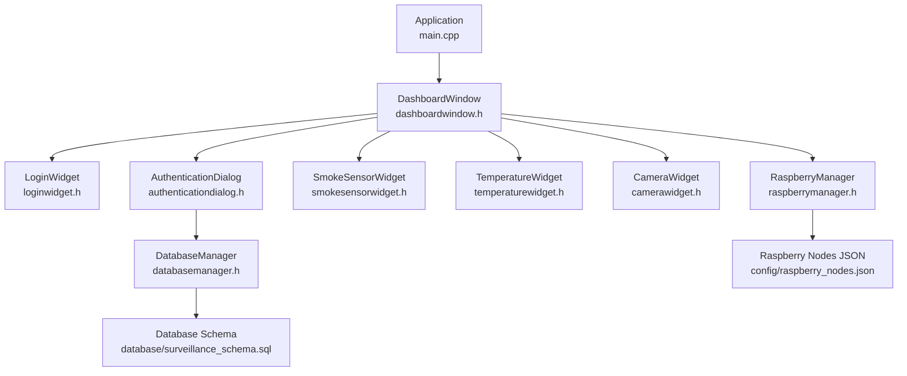
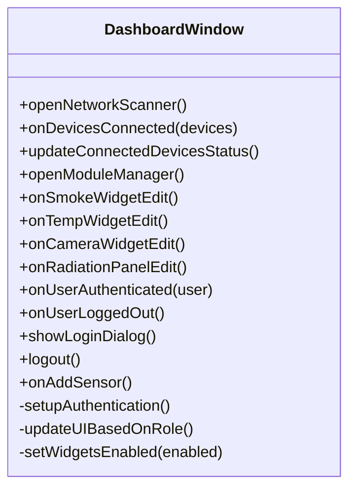
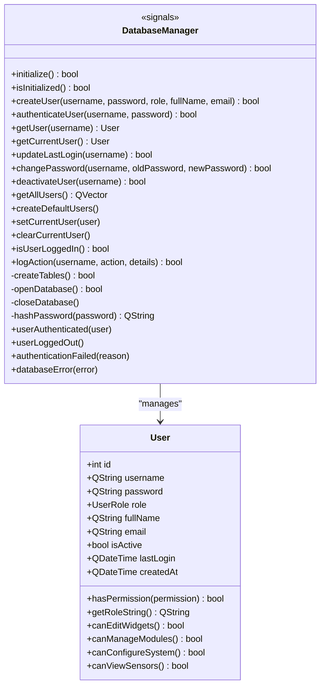
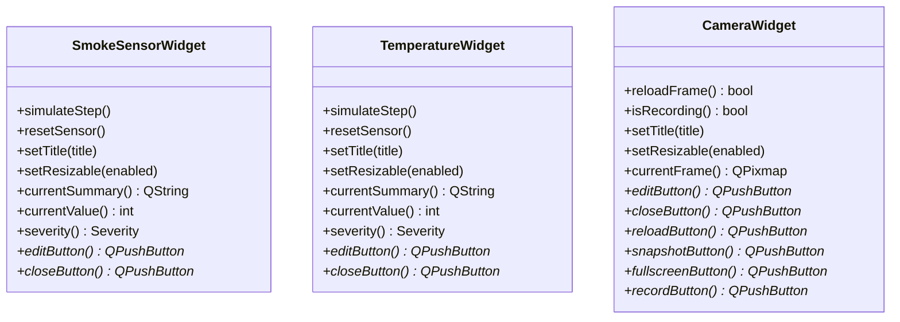
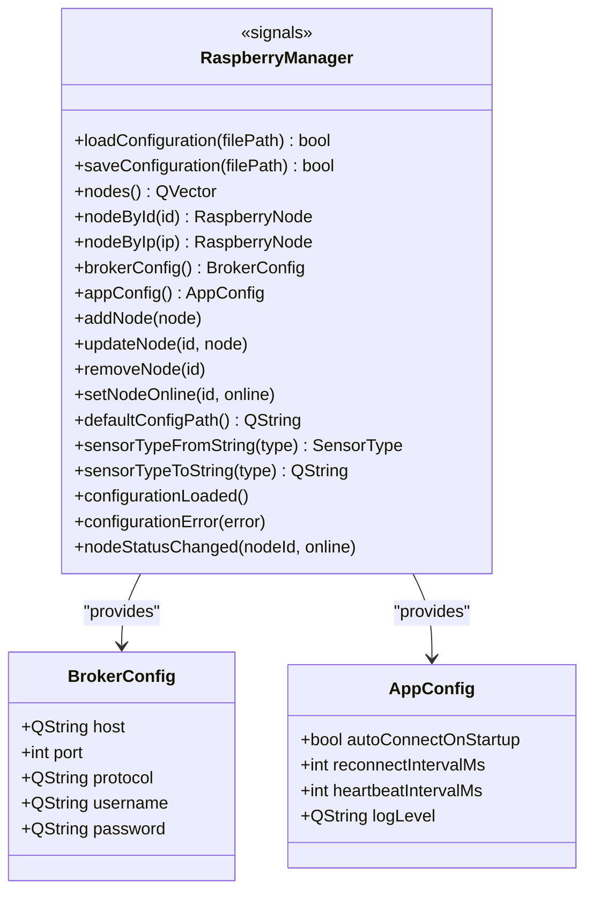
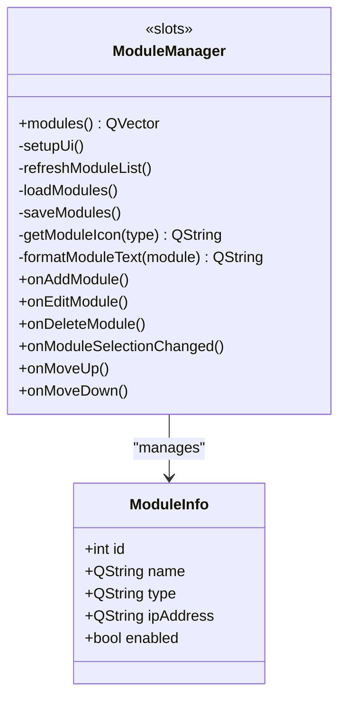
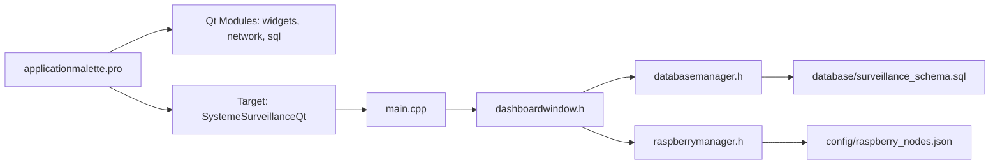

# Getting Started

<cite>
**Referenced Files in This Document**
- [applicationmalette.pro](file://applicationmalette.pro)
- [main.cpp](file://main.cpp)
- [dashboardwindow.h](file://dashboardwindow.h)
- [loginwidget.h](file://loginwidget.h)
- [authenticationdialog.h](file://authenticationdialog.h)
- [databasemanager.h](file://databasemanager.h)
- [database/surveillance_schema.sql](file://database/surveillance_schema.sql)
- [config/raspberry_nodes.json](file://config/raspberry_nodes.json)
- [raspberrymanager.h](file://raspberrymanager.h)
- [modulemanager.h](file://modulemanager.h)
- [smokesensorwidget.h](file://smokesensorwidget.h)
- [temperaturewidget.h](file://temperaturewidget.h)
- [camerawidget.h](file://camerawidget.h)
</cite>

## Table of Contents
1. [Introduction](#introduction)
2. [Prerequisites](#prerequisites)
3. [Installation](#installation)
4. [Build Instructions](#build-instructions)
5. [First Run Configuration](#first-run-configuration)
6. [Basic Usage](#basic-usage)
7. [Architecture Overview](#architecture-overview)
8. [Detailed Component Analysis](#detailed-component-analysis)
9. [Dependency Analysis](#dependency-analysis)
10. [Performance Considerations](#performance-considerations)
11. [Troubleshooting Guide](#troubleshooting-guide)
12. [Conclusion](#conclusion)

## Introduction
SurveillanceQT is a Qt-based desktop application for monitoring sensor networks and camera feeds, with built-in database-backed authentication and a configurable MQTT broker integration. It provides a dashboard for real-time visualization of smoke, temperature, and camera sensors, along with user management and system configuration.

## Prerequisites
- Qt 5.15 or newer with C++17 support
- MySQL or MariaDB server
- Optional: Raspberry Pi devices for sensor nodes and camera streams (see Raspberry Pi setup below)
- Platform-specific toolchains:
  - Windows: MinGW or MSVC toolchain via Qt
  - Linux: GCC toolchain via Qt
  - Raspberry Pi: GCC toolchain via Qt (cross-compilation or native build)

Raspberry Pi setup requirements:
- Pre-configured nodes with IP addresses and optional sensor topics
- MQTT broker reachable from the host machine
- Camera stream endpoints accessible from the host machine (HTTP URLs)

**Section sources**
- [applicationmalette.pro:1-10](file://applicationmalette.pro#L1-L10)
- [config/raspberry_nodes.json:1-122](file://config/raspberry_nodes.json#L1-L122)

## Installation
Follow platform-specific steps to install and run SurveillanceQT.

### Windows
- Install Qt 5.15+ and a compatible compiler (MinGW or MSVC)
- Install MySQL or MariaDB
- Clone or extract the project
- Open the .pro file in Qt Creator and build the project
- Run the application executable

### Linux
- Install Qt 5.15+ and GCC
- Install MySQL or MariaDB
- Clone or extract the project
- Open the .pro file in Qt Creator and build the project
- Run the application executable

### Raspberry Pi
- Install Qt 5.15+ and GCC toolchain
- Install MySQL or MariaDB
- Clone or extract the project
- Build using qmake and make
- Run the application executable

Notes:
- Ensure the MySQL driver is available for Qt SQL
- On Raspberry Pi, verify network connectivity to MQTT broker and camera endpoints

**Section sources**
- [applicationmalette.pro:1-10](file://applicationmalette.pro#L1-L10)
- [main.cpp:1-15](file://main.cpp#L1-L15)

## Build Instructions
The project uses qmake with a .pro file. The target binary is named according to the .pro configuration.

Steps:
- Configure with qmake using the provided project file
- Build with make or the IDE’s build system
- The application entry point initializes the main window and starts the event loop

Key build configuration highlights:
- Qt modules: widgets, network, sql
- C++ standard: C++17
- Application target name is defined in the .pro file

Verification:
- Confirm the executable is generated after a successful build
- Launch the application to verify the GUI loads

**Section sources**
- [applicationmalette.pro:1-47](file://applicationmalette.pro#L1-L47)
- [main.cpp:5-14](file://main.cpp#L5-L14)

## First Run Configuration
Complete the following setup to initialize the system for the first time.

### Database Initialization
- Create the database and tables using the provided SQL script
- The schema defines users, audit logs, nodes, sensors, sensor data, and system configuration
- Default users and system configuration are inserted during initialization

Steps:
- Connect to MySQL/MariaDB
- Execute the SQL script to create the database and tables
- Verify default users and configuration entries are present

Verification:
- Confirm the database exists and contains the expected tables and rows
- Test authentication with default credentials

**Section sources**
- [database/surveillance_schema.sql:1-157](file://database/surveillance_schema.sql#L1-L157)
- [databasemanager.h:34-87](file://databasemanager.h#L34-L87)

### MQTT Broker Setup
- Configure the MQTT broker host, port, and credentials in the configuration JSON
- The application reads broker settings from the configuration file

Steps:
- Edit the configuration JSON to set broker host/port/credentials
- Save the file and restart the application if needed

Verification:
- Confirm the application connects to the broker and subscribes to sensor topics
- Monitor logs for connection status

**Section sources**
- [config/raspberry_nodes.json:108-121](file://config/raspberry_nodes.json#L108-L121)
- [raspberrymanager.h:48-61](file://raspberrymanager.h#L48-L61)

### Sensor Network Configuration
- Define nodes, sensors, and topics in the configuration JSON
- Optionally configure camera stream URLs and resolutions
- The application parses this configuration to render widgets and connect to MQTT

Steps:
- Review and adjust node definitions and sensor configurations
- Save the configuration and restart the application

Verification:
- Confirm sensor widgets appear on the dashboard
- Verify MQTT subscriptions and data updates

**Section sources**
- [config/raspberry_nodes.json:1-122](file://config/raspberry_nodes.json#L1-L122)
- [raspberrymanager.h:34-46](file://raspberrymanager.h#L34-L46)

## Basic Usage
Learn how to log in, navigate the dashboard, and manage sensors.

### Login Procedures
- Launch the application
- The dashboard shows a login prompt
- Enter credentials and authenticate
- The application validates against the database and sets the current user

Verification:
- Successful login triggers user-specific UI permissions
- Audit logs record the login event

**Section sources**
- [dashboardwindow.h:34-48](file://dashboardwindow.h#L34-L48)
- [loginwidget.h:8-22](file://loginwidget.h#L8-L22)
- [authenticationdialog.h:14-46](file://authenticationdialog.h#L14-L46)
- [databasemanager.h:44-63](file://databasemanager.h#L44-L63)

### Dashboard Navigation
- After login, the dashboard displays:
  - Title bar with user status and actions
  - Bottom bar with network status and controls
  - Sensor widgets for smoke, temperature, and camera
  - Edit and close buttons per widget
- Drag and resize widgets as needed
- Use the network scanner and module manager for advanced features

**Section sources**
- [dashboardwindow.h:19-98](file://dashboardwindow.h#L19-L98)

### Initial Sensor Setup
- Add sensors via the “Add Sensor” action
- Configure thresholds and units per sensor type
- Widgets update automatically with live data from MQTT

Verification:
- Widgets reflect current sensor values and severity
- Threshold warnings and alarms are visible

**Section sources**
- [dashboardwindow.h:47-48](file://dashboardwindow.h#L47-L48)
- [smokesensorwidget.h:10-52](file://smokesensorwidget.h#L10-L52)
- [temperaturewidget.h:11-53](file://temperaturewidget.h#L11-L53)
- [camerawidget.h:9-39](file://camerawidget.h#L9-L39)

## Architecture Overview
The application follows a modular Qt architecture with a dashboard window hosting sensor widgets and a database-backed authentication system.

**Diagram sources**
- [main.cpp:1-15](file://main.cpp#L1-L15)
- [dashboardwindow.h:19-98](file://dashboardwindow.h#L19-L98)
- [loginwidget.h:8-22](file://loginwidget.h#L8-L22)
- [authenticationdialog.h:14-46](file://authenticationdialog.h#L14-L46)
- [databasemanager.h:34-87](file://databasemanager.h#L34-L87)
- [smokesensorwidget.h:10-52](file://smokesensorwidget.h#L10-L52)
- [temperaturewidget.h:11-53](file://temperaturewidget.h#L11-L53)
- [camerawidget.h:9-39](file://camerawidget.h#L9-L39)
- [raspberrymanager.h:63-106](file://raspberrymanager.h#L63-L106)
- [config/raspberry_nodes.json:1-122](file://config/raspberry_nodes.json#L1-L122)
- [database/surveillance_schema.sql:1-157](file://database/surveillance_schema.sql#L1-L157)

## Detailed Component Analysis

### Dashboard Window
The dashboard orchestrates authentication, sensor widgets, and system controls.

**Diagram sources**
- [dashboardwindow.h:19-98](file://dashboardwindow.h#L19-L98)

**Section sources**
- [dashboardwindow.h:34-48](file://dashboardwindow.h#L34-L48)
- [dashboardwindow.h:62-66](file://dashboardwindow.h#L62-L66)

### Authentication and Database Manager
Authentication relies on a local database with hashed passwords and roles.

**Diagram sources**
- [databasemanager.h:34-87](file://databasemanager.h#L34-L87)

**Section sources**
- [databasemanager.h:9-32](file://databasemanager.h#L9-L32)
- [databasemanager.h:44-63](file://databasemanager.h#L44-L63)

### Sensor Widgets
The application includes dedicated widgets for smoke, temperature, and camera sensors.

**Diagram sources**
- [smokesensorwidget.h:10-52](file://smokesensorwidget.h#L10-L52)
- [temperaturewidget.h:11-53](file://temperaturewidget.h#L11-L53)
- [camerawidget.h:9-39](file://camerawidget.h#L9-L39)

**Section sources**
- [smokesensorwidget.h:25-31](file://smokesensorwidget.h#L25-L31)
- [temperaturewidget.h:26-32](file://temperaturewidget.h#L26-L32)
- [camerawidget.h:22-25](file://camerawidget.h#L22-L25)

### Raspberry Pi Manager and Configuration
The application loads node and broker configuration from a JSON file.

**Diagram sources**
- [raspberrymanager.h:63-106](file://raspberrymanager.h#L63-L106)

**Section sources**
- [raspberrymanager.h:48-61](file://raspberrymanager.h#L48-L61)
- [config/raspberry_nodes.json:108-121](file://config/raspberry_nodes.json#L108-L121)

### Module Manager
The module manager dialog allows managing modules and their order.

**Diagram sources**
- [modulemanager.h:18-51](file://modulemanager.h#L18-L51)

**Section sources**
- [modulemanager.h:10-16](file://modulemanager.h#L10-L16)

## Dependency Analysis
The application depends on Qt modules and a local database. The dashboard integrates authentication, sensor widgets, and Raspberry Pi configuration.

**Diagram sources**
- [applicationmalette.pro:1-47](file://applicationmalette.pro#L1-L47)
- [main.cpp:1-15](file://main.cpp#L1-L15)
- [dashboardwindow.h:19-98](file://dashboardwindow.h#L19-L98)
- [databasemanager.h:34-87](file://databasemanager.h#L34-L87)
- [raspberrymanager.h:63-106](file://raspberrymanager.h#L63-L106)
- [config/raspberry_nodes.json:1-122](file://config/raspberry_nodes.json#L1-L122)
- [database/surveillance_schema.sql:1-157](file://database/surveillance_schema.sql#L1-L157)

**Section sources**
- [applicationmalette.pro:1-10](file://applicationmalette.pro#L1-L10)
- [main.cpp:5-14](file://main.cpp#L5-L14)

## Performance Considerations
- Keep sensor data aggregation intervals reasonable to avoid excessive database writes
- Limit widget refresh rates to balance responsiveness and resource usage
- Use appropriate MQTT subscription filters to reduce message volume
- Optimize camera stream resolution and FPS for the target hardware

## Troubleshooting Guide
Common installation and runtime issues:

- Qt modules missing
  - Symptom: Build errors related to missing Qt modules
  - Resolution: Install Qt 5.15+ with widgets, network, and sql modules

- MySQL driver not found
  - Symptom: Database connection failures
  - Resolution: Ensure the MySQL driver is available for Qt SQL

- Database initialization failure
  - Symptom: Missing tables or default data
  - Resolution: Run the SQL script to create schema and default entries

- MQTT broker unreachable
  - Symptom: No sensor updates or connection errors
  - Resolution: Verify broker host/port and network connectivity

- Camera stream not loading
  - Symptom: Blank image or timeout
  - Resolution: Confirm stream URL accessibility and correct configuration

Verification checklist:
- Confirm the application launches and shows the login prompt
- Authenticate with default credentials
- Verify sensor widgets display values and status
- Confirm MQTT subscriptions and data updates
- Check database connectivity and default user presence

**Section sources**
- [applicationmalette.pro:1-10](file://applicationmalette.pro#L1-L10)
- [database/surveillance_schema.sql:122-139](file://database/surveillance_schema.sql#L122-L139)
- [config/raspberry_nodes.json:108-121](file://config/raspberry_nodes.json#L108-L121)

## Conclusion
You are now ready to deploy and operate SurveillanceQT. Ensure the database is initialized, the MQTT broker is configured, and the sensor network is defined. Use the dashboard to monitor sensors, manage users, and configure modules. For persistent operation, verify network connectivity, database availability, and MQTT broker reachability across platforms.