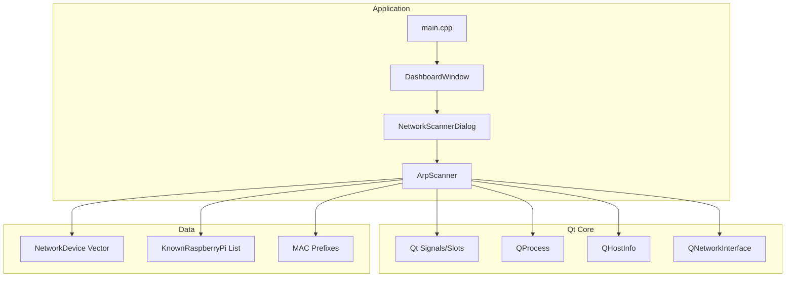
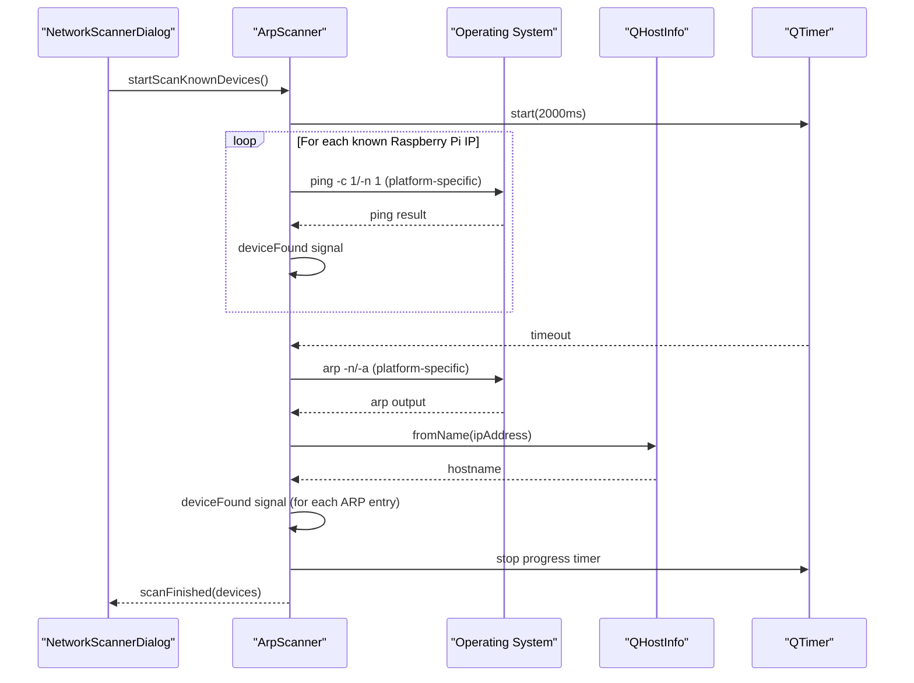
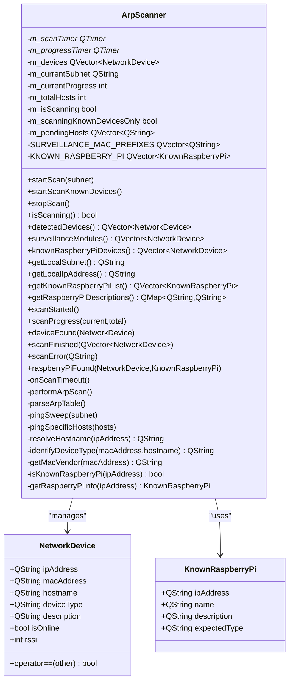
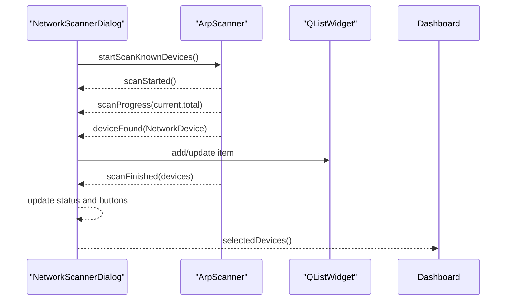
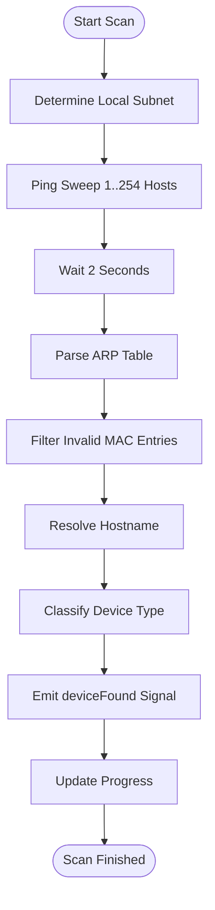
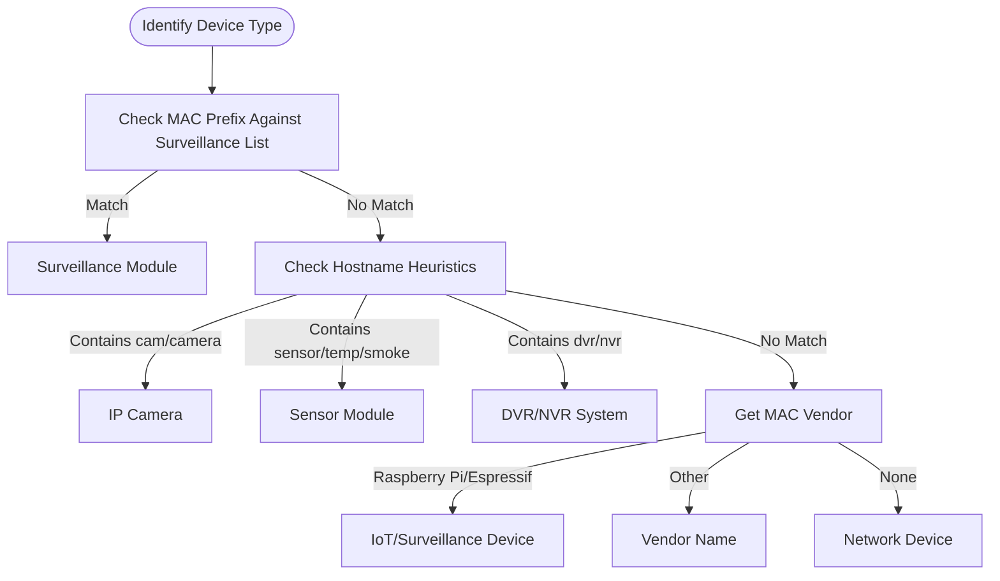
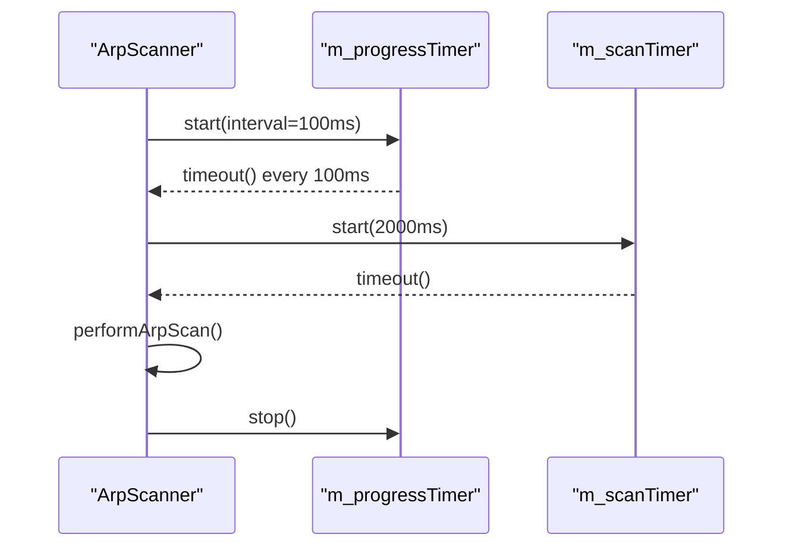
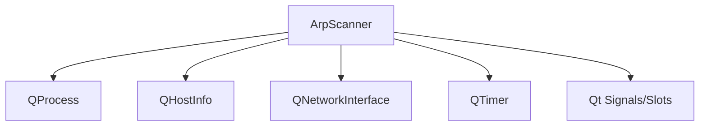
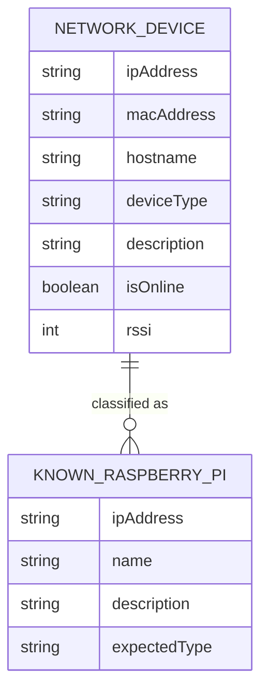

# ARP Scanner Implementation

<cite>
**Referenced Files in This Document**
- [arpscanner.h](file://arpscanner.h)
- [arpscanner.cpp](file://arpscanner.cpp)
- [networkscannerdialog.h](file://networkscannerdialog.h)
- [networkscannerdialog.cpp](file://networkscannerdialog.cpp)
- [dashboardwindow.h](file://dashboardwindow.h)
- [dashboardwindow.cpp](file://dashboardwindow.cpp)
- [main.cpp](file://main.cpp)
- [databasemanager.h](file://databasemanager.h)
- [databasemanager.cpp](file://databasemanager.cpp)
- [authenticationdialog.h](file://authenticationdialog.h)
- [authenticationdialog.cpp](file://authenticationdialog.cpp)
- [config/raspberry_nodes.json](file://config/raspberry_nodes.json)
</cite>

## Table of Contents
1. [Introduction](#introduction)
2. [Project Structure](#project-structure)
3. [Core Components](#core-components)
4. [Architecture Overview](#architecture-overview)
5. [Detailed Component Analysis](#detailed-component-analysis)
6. [Dependency Analysis](#dependency-analysis)
7. [Performance Considerations](#performance-considerations)
8. [Troubleshooting Guide](#troubleshooting-guide)
9. [Conclusion](#conclusion)
10. [Appendices](#appendices)

## Introduction
This document provides comprehensive technical documentation for the ARP scanner implementation used to discover and classify network devices on local subnets. It explains the ArpScanner class architecture, the NetworkDevice and KnownRaspberryPi data structures, ARP scanning algorithms, ping sweep functionality, and host discovery mechanisms. It also covers MAC address vendor identification, device type classification, hostname resolution, scanning strategies for local subnets, timeout handling, progress tracking, and integration with Qt's signal-slot mechanism for real-time updates and error handling. Practical examples demonstrate how to initiate scans, parse discovered devices, and process results.

## Project Structure
The ARP scanner is implemented as a standalone Qt-based component integrated into the larger surveillance dashboard application. The scanner is composed of:
- ArpScanner: Core scanning engine with ARP table parsing, ping sweeps, device classification, and Qt signals for progress and results.
- NetworkScannerDialog: UI wrapper around ArpScanner that displays discovered devices, tracks progress, and allows selection for connection.
- DashboardWindow: Application entry point that provides access to the network scanner and displays network status.
- Supporting infrastructure: Database manager and authentication dialogs for user access control.

**Diagram sources**
- [main.cpp:1-15](file://main.cpp#L1-L15)
- [dashboardwindow.cpp:681-688](file://dashboardwindow.cpp#L681-L688)
- [networkscannerdialog.cpp:16-45](file://networkscannerdialog.cpp#L16-L45)
- [arpscanner.cpp:83-106](file://arpscanner.cpp#L83-L106)

**Section sources**
- [main.cpp:1-15](file://main.cpp#L1-L15)
- [dashboardwindow.cpp:681-688](file://dashboardwindow.cpp#L681-L688)
- [networkscannerdialog.cpp:16-45](file://networkscannerdialog.cpp#L16-L45)
- [arpscanner.cpp:83-106](file://arpscanner.cpp#L83-L106)

## Core Components
This section documents the primary data structures and scanning primitives used by the ARP scanner.

- NetworkDevice: Encapsulates discovered device metadata including IP address, MAC address, hostname, device type, description, online status, and RSSI.
- KnownRaspberryPi: Defines pre-configured Raspberry Pi nodes with IP, name, description, and expected device type for targeted scanning.
- ArpScanner: Implements ARP scanning, ping sweeps, device classification, hostname resolution, and emits Qt signals for progress and results.

Key responsibilities:
- Local subnet detection and ping sweep across 254 hosts.
- ARP table parsing to extract live devices.
- Device type classification based on MAC prefixes, hostnames, and vendor databases.
- MAC vendor identification for IoT and surveillance devices.
- Real-time progress reporting and completion notifications.

**Section sources**
- [arpscanner.h:10-29](file://arpscanner.h#L10-L29)
- [arpscanner.h:31-87](file://arpscanner.h#L31-L87)
- [arpscanner.cpp:9-18](file://arpscanner.cpp#L9-L18)
- [arpscanner.cpp:20-81](file://arpscanner.cpp#L20-L81)

## Architecture Overview
The ARP scanner architecture centers on ArpScanner, which orchestrates scanning operations and communicates with the UI via Qt signals. The scanning pipeline consists of:
- Subnet determination and ping sweep to probe hosts.
- ARP table parsing to discover active devices.
- Hostname resolution and device type classification.
- Vendor identification for IoT devices.
- Progress tracking and completion signaling.

**Diagram sources**
- [networkscannerdialog.cpp:198-222](file://networkscannerdialog.cpp#L198-L222)
- [arpscanner.cpp:174-196](file://arpscanner.cpp#L174-L196)
- [arpscanner.cpp:318-332](file://arpscanner.cpp#L318-L332)
- [arpscanner.cpp:334-384](file://arpscanner.cpp#L334-L384)
- [arpscanner.cpp:417-424](file://arpscanner.cpp#L417-L424)

## Detailed Component Analysis

### ArpScanner Class
The ArpScanner class encapsulates the scanning logic and device classification. It maintains internal state for scanning progress, pending hosts, and discovered devices. It exposes public methods to start scans, stop scans, and query results, along with Qt signals for real-time updates.

Key methods and behaviors:
- startScanKnownDevices(): Scans only known Raspberry Pi IPs, emitting deviceFound for each responding host and raspberryPiFound for known devices.
- startScan(): Determines local subnet, performs ping sweep across 254 hosts, then parses ARP table after a delay.
- stopScan(): Stops timers and cancels ongoing operations.
- isScanning(): Reports scanning state.
- detectedDevices()/surveillanceModules()/knownRaspberryPiDevices(): Accessor methods to retrieve filtered device lists.
- getLocalSubnet()/getLocalIpAddress(): Utility methods to derive network parameters.
- pingSweep()/pingSpecificHosts(): Executes platform-appropriate ping commands to probe hosts.
- parseArpTable(): Parses ARP output to extract IP/MAC pairs, filters invalid entries, resolves hostnames, classifies devices, and emits signals.
- resolveHostname(): Uses QHostInfo to resolve hostnames.
- identifyDeviceType()/getMacVendor(): Classifies devices based on MAC prefixes, hostnames, and vendor mappings.
- Internal timers: m_scanTimer (delay before ARP parsing) and m_progressTimer (periodic progress emission).

**Diagram sources**
- [arpscanner.h:10-29](file://arpscanner.h#L10-L29)
- [arpscanner.h:24-29](file://arpscanner.h#L24-L29)
- [arpscanner.h:31-87](file://arpscanner.h#L31-L87)

**Section sources**
- [arpscanner.h:31-87](file://arpscanner.h#L31-L87)
- [arpscanner.cpp:83-106](file://arpscanner.cpp#L83-L106)
- [arpscanner.cpp:174-196](file://arpscanner.cpp#L174-L196)
- [arpscanner.cpp:318-332](file://arpscanner.cpp#L318-L332)
- [arpscanner.cpp:334-384](file://arpscanner.cpp#L334-L384)
- [arpscanner.cpp:417-424](file://arpscanner.cpp#L417-L424)
- [arpscanner.cpp:426-462](file://arpscanner.cpp#L426-L462)
- [arpscanner.cpp:464-517](file://arpscanner.cpp#L464-L517)

### NetworkScannerDialog Integration
NetworkScannerDialog acts as the UI controller for the ARP scanner. It connects to ArpScanner signals to update the progress bar, device list, and status messages. It also manages device selection and prepares the final list of connected devices.

Key behaviors:
- Connects to ArpScanner signals: deviceFound, scanProgress, scanFinished, scanError.
- Displays known Raspberry Pi list with placeholders and updates statuses upon discovery.
- Updates progress bar percentage and format string.
- Filters surveillance modules and counts online devices.
- Emits selected devices to the dashboard for connection.

**Diagram sources**
- [networkscannerdialog.cpp:16-45](file://networkscannerdialog.cpp#L16-L45)
- [networkscannerdialog.cpp:198-222](file://networkscannerdialog.cpp#L198-L222)
- [networkscannerdialog.cpp:248-261](file://networkscannerdialog.cpp#L248-L261)
- [networkscannerdialog.cpp:291-298](file://networkscannerdialog.cpp#L291-L298)
- [networkscannerdialog.cpp:300-322](file://networkscannerdialog.cpp#L300-L322)

**Section sources**
- [networkscannerdialog.h:14-56](file://networkscannerdialog.h#L14-L56)
- [networkscannerdialog.cpp:16-45](file://networkscannerdialog.cpp#L16-L45)
- [networkscannerdialog.cpp:198-222](file://networkscannerdialog.cpp#L198-L222)
- [networkscannerdialog.cpp:248-261](file://networkscannerdialog.cpp#L248-L261)
- [networkscannerdialog.cpp:291-298](file://networkscannerdialog.cpp#L291-L298)
- [networkscannerdialog.cpp:300-322](file://networkscannerdialog.cpp#L300-L322)

### ARP Scanning Algorithms and Host Discovery
The scanning pipeline combines ping sweeps and ARP table parsing:
- Ping sweep: Iterates through 254 IP addresses in the local subnet and executes platform-specific ping commands. Each ping result increments progress.
- ARP parsing: After a short delay, the ARP table is queried and parsed to extract IP/MAC pairs. Invalid entries are filtered out. Hostnames are resolved, device types are classified, and devices are emitted via signals.

**Diagram sources**
- [arpscanner.cpp:108-131](file://arpscanner.cpp#L108-L131)
- [arpscanner.cpp:386-415](file://arpscanner.cpp#L386-L415)
- [arpscanner.cpp:318-332](file://arpscanner.cpp#L318-L332)
- [arpscanner.cpp:334-384](file://arpscanner.cpp#L334-L384)

**Section sources**
- [arpscanner.cpp:108-131](file://arpscanner.cpp#L108-L131)
- [arpscanner.cpp:386-415](file://arpscanner.cpp#L386-L415)
- [arpscanner.cpp:318-332](file://arpscanner.cpp#L318-L332)
- [arpscanner.cpp:334-384](file://arpscanner.cpp#L334-L384)

### Device Classification and MAC Vendor Identification
Device classification follows a multi-stage process:
- MAC prefix matching against known surveillance device prefixes.
- Hostname heuristics for cameras, sensors, DVR/NVR systems.
- Vendor identification for Raspberry Pi and Espressif devices.
- Fallback to generic categories if classification fails.

**Diagram sources**
- [arpscanner.cpp:426-462](file://arpscanner.cpp#L426-L462)
- [arpscanner.cpp:464-517](file://arpscanner.cpp#L464-L517)

**Section sources**
- [arpscanner.cpp:426-462](file://arpscanner.cpp#L426-L462)
- [arpscanner.cpp:464-517](file://arpscanner.cpp#L464-L517)

### Timeout Handling and Progress Tracking
- Progress timer: Emits periodic scanProgress signals to keep the UI responsive during long scans.
- Scan timer: Delays ARP table parsing to allow ARP cache to populate after ping sweeps.
- Stop scan: Cancels timers and resets state.

**Diagram sources**
- [arpscanner.cpp:95-100](file://arpscanner.cpp#L95-L100)
- [arpscanner.cpp:318-332](file://arpscanner.cpp#L318-L332)

**Section sources**
- [arpscanner.cpp:95-100](file://arpscanner.cpp#L95-L100)
- [arpscanner.cpp:318-332](file://arpscanner.cpp#L318-L332)

### Hostname Resolution Process
Hostname resolution uses QHostInfo::fromName to translate IP addresses to hostnames. Unknown hostnames are represented as "Unknown".

**Section sources**
- [arpscanner.cpp:417-424](file://arpscanner.cpp#L417-L424)

### Known Raspberry Pi Integration
The scanner includes a predefined list of known Raspberry Pi nodes with associated metadata. These nodes are scanned first to quickly identify known devices and provide contextual information.

**Section sources**
- [arpscanner.cpp:9-18](file://arpscanner.cpp#L9-L18)
- [arpscanner.cpp:198-210](file://arpscanner.cpp#L198-L210)
- [config/raspberry_nodes.json:1-122](file://config/raspberry_nodes.json#L1-L122)

### Example Usage Scenarios
- Initiating a known-device scan: Call startScanKnownDevices() from NetworkScannerDialog to probe known Raspberry Pi IPs and receive real-time updates via signals.
- Parsing discovered devices: Use detectedDevices() to retrieve the complete list of discovered devices after scanFinished.
- Processing results: Filter surveillanceModules() or knownRaspberryPiDevices() to focus on specific device categories.

**Section sources**
- [networkscannerdialog.cpp:198-222](file://networkscannerdialog.cpp#L198-L222)
- [arpscanner.cpp:145-172](file://arpscanner.cpp#L145-L172)
- [arpscanner.cpp:150-161](file://arpscanner.cpp#L150-L161)
- [arpscanner.cpp:163-172](file://arpscanner.cpp#L163-L172)

## Dependency Analysis
The ARP scanner relies on Qt core modules for networking, process execution, and asynchronous communication. It integrates with the UI layer via signals and slots, and interacts with the database and authentication systems for user access control.

**Diagram sources**
- [arpscanner.cpp:3-7](file://arpscanner.cpp#L3-L7)
- [arpscanner.cpp:83-106](file://arpscanner.cpp#L83-L106)

**Section sources**
- [arpscanner.cpp:3-7](file://arpscanner.cpp#L3-L7)
- [arpscanner.cpp:83-106](file://arpscanner.cpp#L83-L106)

## Performance Considerations
- Ping sweep across 254 hosts can be resource-intensive. Consider limiting the scan range or using asynchronous ping processes to reduce blocking.
- ARP table parsing occurs after a fixed delay to allow ARP cache population. Adjust the delay based on network conditions.
- Hostname resolution can add latency. Consider caching resolved hostnames to avoid repeated DNS lookups.
- Progress updates occur every 100 ms. Ensure UI updates are efficient to prevent UI lag during scans.

[No sources needed since this section provides general guidance]

## Troubleshooting Guide
Common issues and resolutions:
- Unable to determine local subnet: The scanner emits a scanError signal with a descriptive message. Verify network interface availability and permissions.
- No devices discovered: Confirm ARP table accessibility and firewall settings. Some systems restrict ARP access.
- Hostname resolution failures: QHostInfo may fail for unreachable or misconfigured hosts. The scanner falls back to "Unknown".
- Permission errors on ping/arp: Running with elevated privileges may be required on some platforms.

**Section sources**
- [arpscanner.cpp:118-123](file://arpscanner.cpp#L118-L123)
- [arpscanner.cpp:344-346](file://arpscanner.cpp#L344-L346)
- [arpscanner.cpp:417-424](file://arpscanner.cpp#L417-L424)

## Conclusion
The ARP scanner implementation provides a robust, Qt-integrated solution for discovering and classifying network devices on local subnets. Its modular design, real-time progress reporting, and device classification capabilities make it suitable for surveillance applications requiring quick identification of Raspberry Pi nodes and other IoT devices. The integration with NetworkScannerDialog ensures a responsive UI and seamless user experience.

[No sources needed since this section summarizes without analyzing specific files]

## Appendices

### Data Model Diagram

**Diagram sources**
- [arpscanner.h:10-29](file://arpscanner.h#L10-L29)
- [arpscanner.h:24-29](file://arpscanner.h#L24-L29)

### Example JSON Configuration
The configuration file defines the local network parameters and known Raspberry Pi nodes used by the application.

**Section sources**
- [config/raspberry_nodes.json:1-122](file://config/raspberry_nodes.json#L1-L122)