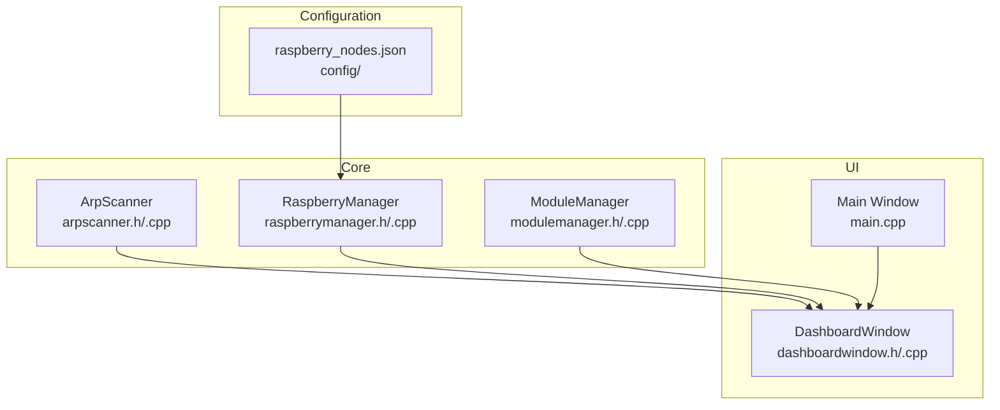
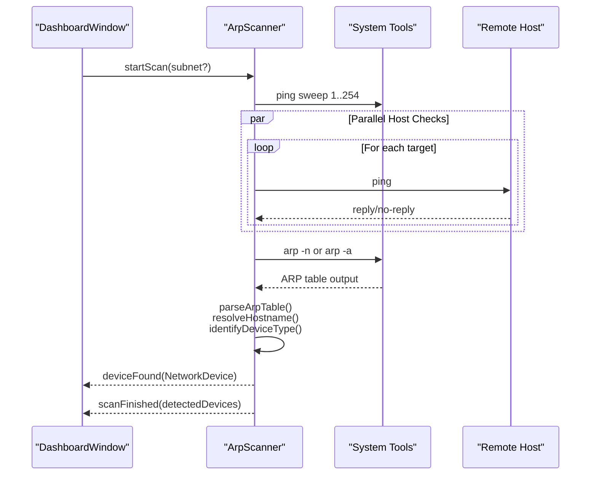
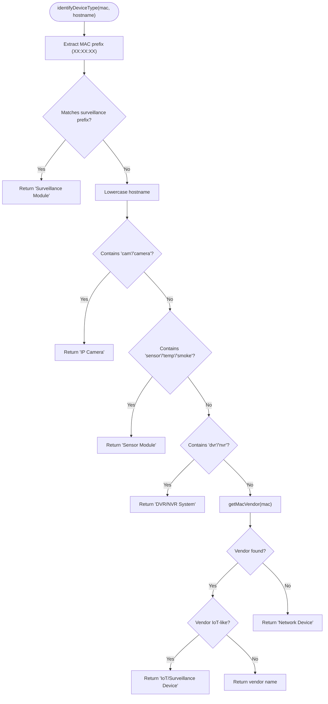
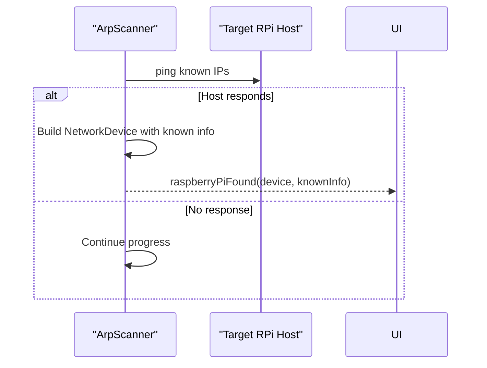
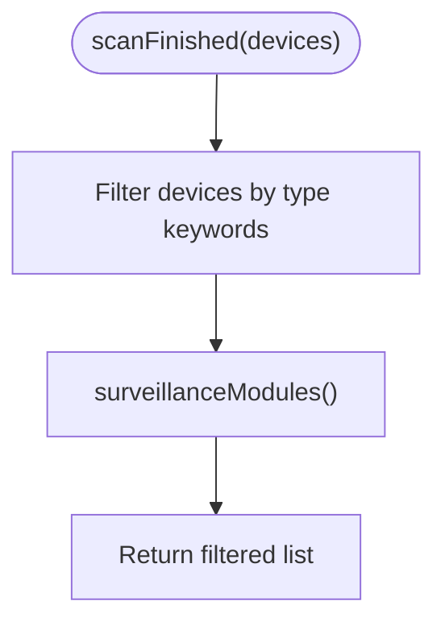
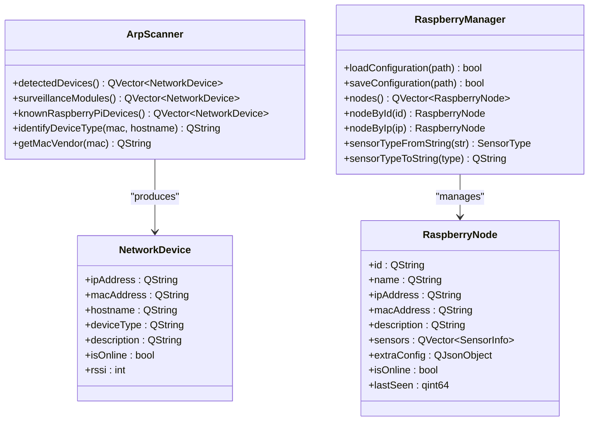
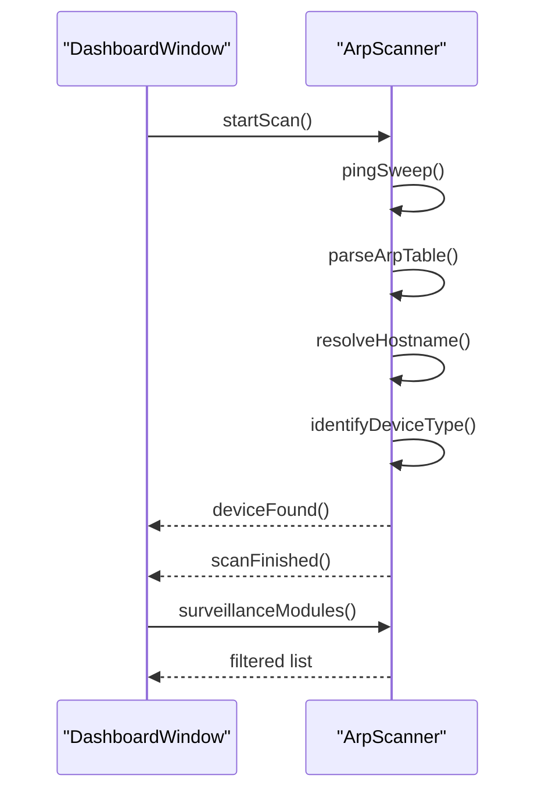
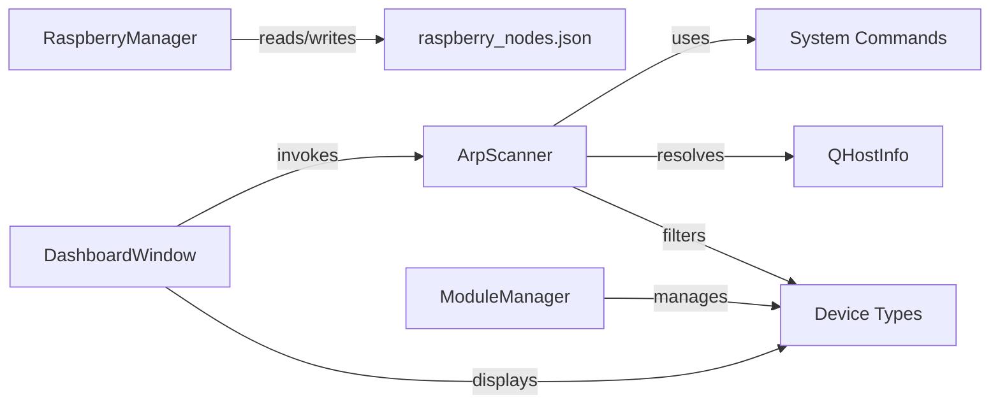

# Device Classification and Recognition

<cite>
**Referenced Files in This Document**
- [arpscanner.h](file://arpscanner.h)
- [arpscanner.cpp](file://arpscanner.cpp)
- [raspberrymanager.h](file://raspberrymanager.h)
- [raspberrymanager.cpp](file://raspberrymanager.cpp)
- [config/raspberry_nodes.json](file://config/raspberry_nodes.json)
- [modulemanager.h](file://modulemanager.h)
- [modulemanager.cpp](file://modulemanager.cpp)
- [dashboardwindow.h](file://dashboardwindow.h)
- [dashboardwindow.cpp](file://dashboardwindow.cpp)
- [main.cpp](file://main.cpp)
</cite>

## Table of Contents
1. [Introduction](#introduction)
2. [Project Structure](#project-structure)
3. [Core Components](#core-components)
4. [Architecture Overview](#architecture-overview)
5. [Detailed Component Analysis](#detailed-component-analysis)
6. [Dependency Analysis](#dependency-analysis)
7. [Performance Considerations](#performance-considerations)
8. [Troubleshooting Guide](#troubleshooting-guide)
9. [Conclusion](#conclusion)
10. [Appendices](#appendices)

## Introduction
This document describes the device classification and recognition subsystem used to identify, categorize, and manage networked surveillance and IoT devices. It covers MAC address prefix matching, hostname-based heuristics, vendor identification, the KnownRaspberryPi detection system, surveillance module classification, and custom device type recognition. It also documents classification criteria, confidence scoring mechanisms, integration with known device databases, and practical workflows for handling unknown or ambiguous devices. Finally, it provides performance considerations and accuracy optimization techniques for large-scale deployments.

## Project Structure
The device classification system is centered around a network scanning and classification engine integrated with configuration-driven device management and UI components for inspection and control.

**Diagram sources**
- [arpscanner.h:1-88](file://arpscanner.h#L1-L88)
- [arpscanner.cpp:1-518](file://arpscanner.cpp#L1-L518)
- [raspberrymanager.h:1-107](file://raspberrymanager.h#L1-L107)
- [raspberrymanager.cpp:1-331](file://raspberrymanager.cpp#L1-L331)
- [modulemanager.h:1-52](file://modulemanager.h#L1-L52)
- [modulemanager.cpp:1-332](file://modulemanager.cpp#L1-L332)
- [config/raspberry_nodes.json:1-122](file://config/raspberry_nodes.json#L1-L122)
- [dashboardwindow.h:1-47](file://dashboardwindow.h#L1-L47)
- [dashboardwindow.cpp:662-750](file://dashboardwindow.cpp#L662-L750)
- [main.cpp:1-15](file://main.cpp#L1-L15)

**Section sources**
- [arpscanner.h:1-88](file://arpscanner.h#L1-L88)
- [arpscanner.cpp:1-518](file://arpscanner.cpp#L1-L518)
- [raspberrymanager.h:1-107](file://raspberrymanager.h#L1-L107)
- [raspberrymanager.cpp:1-331](file://raspberrymanager.cpp#L1-L331)
- [config/raspberry_nodes.json:1-122](file://config/raspberry_nodes.json#L1-L122)
- [modulemanager.h:1-52](file://modulemanager.h#L1-L52)
- [modulemanager.cpp:1-332](file://modulemanager.cpp#L1-L332)
- [dashboardwindow.h:1-47](file://dashboardwindow.h#L1-L47)
- [dashboardwindow.cpp:662-750](file://dashboardwindow.cpp#L662-L750)
- [main.cpp:1-15](file://main.cpp#L1-L15)

## Core Components
- ArpScanner: Scans the local network, resolves hostnames, identifies device types via MAC prefixes, hostname heuristics, and vendor lookup, and emits discovered devices.
- KnownRaspberryPi: A static catalog of known Raspberry Pi nodes used for specialized detection and enrichment.
- RaspberryManager: Loads/stores persistent configuration for nodes, sensors, and broker/application settings; supports type conversion and serialization.
- ModuleManager: Manages surveillance modules (UI-level) with type, IP, and enablement metadata.
- DashboardWindow: Integrates scanning and classification into the UI, displays connected devices, and coordinates with managers.

Key classification logic resides in ArpScanner’s device identification pipeline and KnownRaspberryPi lists.

**Section sources**
- [arpscanner.h:10-87](file://arpscanner.h#L10-L87)
- [arpscanner.cpp:426-462](file://arpscanner.cpp#L426-L462)
- [arpscanner.cpp:9-81](file://arpscanner.cpp#L9-L81)
- [raspberrymanager.h:10-106](file://raspberrymanager.h#L10-L106)
- [raspberrymanager.cpp:24-331](file://raspberrymanager.cpp#L24-L331)
- [modulemanager.h:10-51](file://modulemanager.h#L10-L51)
- [modulemanager.cpp:127-179](file://modulemanager.cpp#L127-L179)
- [dashboardwindow.cpp:681-728](file://dashboardwindow.cpp#L681-L728)

## Architecture Overview
The classification pipeline combines passive ARP table parsing with active ping sweeps, hostname resolution, and deterministic heuristics to produce device categories.

**Diagram sources**
- [arpscanner.cpp:108-131](file://arpscanner.cpp#L108-L131)
- [arpscanner.cpp:386-415](file://arpscanner.cpp#L386-L415)
- [arpscanner.cpp:334-384](file://arpscanner.cpp#L334-L384)
- [arpscanner.cpp:417-424](file://arpscanner.cpp#L417-L424)
- [arpscanner.cpp:426-462](file://arpscanner.cpp#L426-L462)
- [dashboardwindow.cpp:681-709](file://dashboardwindow.cpp#L681-L709)

## Detailed Component Analysis

### ArpScanner: Device Identification Pipeline
ArpScanner performs:
- Subnet discovery and local IP retrieval
- Ping sweep across 254 hosts
- ARP table parsing to extract IP/MAC pairs
- Hostname resolution per IP
- Device type identification using:
  - MAC prefix matching against surveillance vendor prefixes
  - Hostname heuristics (camera, sensor, smoke, DVR/NVR)
  - Vendor lookup for IoT vendors (e.g., Raspberry Pi, Espressif)
  - Fallback to generic categories

**Diagram sources**
- [arpscanner.cpp:426-462](file://arpscanner.cpp#L426-L462)
- [arpscanner.cpp:464-517](file://arpscanner.cpp#L464-L517)

**Section sources**
- [arpscanner.h:10-87](file://arpscanner.h#L10-L87)
- [arpscanner.cpp:426-462](file://arpscanner.cpp#L426-L462)
- [arpscanner.cpp:464-517](file://arpscanner.cpp#L464-L517)

### KnownRaspberryPi Detection System
KnownRaspberryPi enables:
- Dedicated ping checks against predefined IPs
- Enrichment of discovered devices with expected type and description
- Specialized reporting via dedicated signal

**Diagram sources**
- [arpscanner.cpp:174-196](file://arpscanner.cpp#L174-L196)
- [arpscanner.cpp:232-279](file://arpscanner.cpp#L232-L279)
- [arpscanner.cpp:212-230](file://arpscanner.cpp#L212-L230)
- [arpscanner.cpp:9-18](file://arpscanner.cpp#L9-L18)

**Section sources**
- [arpscanner.h:24-29](file://arpscanner.h#L24-L29)
- [arpscanner.cpp:9-18](file://arpscanner.cpp#L9-L18)
- [arpscanner.cpp:174-196](file://arpscanner.cpp#L174-L196)
- [arpscanner.cpp:212-230](file://arpscanner.cpp#L212-L230)
- [arpscanner.cpp:232-279](file://arpscanner.cpp#L232-L279)

### Surveillance Module Classification
Surveillance module filtering is performed post-scan by checking deviceType for keywords indicating cameras, sensors, or DVR/NVR systems.

**Diagram sources**
- [arpscanner.cpp:150-161](file://arpscanner.cpp#L150-L161)

**Section sources**
- [arpscanner.cpp:150-161](file://arpscanner.cpp#L150-L161)

### Custom Device Type Recognition and Threshold-Based Confidence Scoring
- Custom classification rules:
  - MAC prefix matching against surveillance vendor prefixes
  - Hostname heuristics for camera, sensor, smoke, and DVR/NVR
  - Vendor lookup for IoT vendors (Raspberry Pi, Espressif)
  - Fallback to generic categories
- Confidence scoring:
  - Deterministic precedence: exact MAC match > hostname heuristics > vendor match > default
  - No explicit numeric score is computed; categorization is categorical
- Unknown or ambiguous devices:
  - Default category returned when no heuristic applies
  - Hostname fallback to “Unknown” during resolution

**Section sources**
- [arpscanner.cpp:426-462](file://arpscanner.cpp#L426-L462)
- [arpscanner.cpp:417-424](file://arpscanner.cpp#L417-L424)

### Integration with Known Device Databases
- Static KnownRaspberryPi list embedded in scanner
- Persistent configuration via RaspberryManager and JSON:
  - Nodes, sensors, broker, and application settings
  - Sensor type enumeration and thresholds
- UI-level module management complements classification with type and IP metadata

**Diagram sources**
- [arpscanner.h:10-87](file://arpscanner.h#L10-L87)
- [raspberrymanager.h:20-106](file://raspberrymanager.h#L20-L106)
- [config/raspberry_nodes.json:1-122](file://config/raspberry_nodes.json#L1-122)

**Section sources**
- [arpscanner.h:10-87](file://arpscanner.h#L10-L87)
- [raspberrymanager.h:20-106](file://raspberrymanager.h#L20-L106)
- [config/raspberry_nodes.json:1-122](file://config/raspberry_nodes.json#L1-122)

### Examples of Device Categorization Workflows
- Workflow A: General network scan
  - Start scan on local subnet
  - Perform ping sweep and ARP table parse
  - Resolve hostname for each entry
  - Apply identifyDeviceType with MAC prefix, hostname heuristics, and vendor lookup
  - Emit discovered devices and finalize scan
- Workflow B: Known device scan
  - Ping only known Raspberry Pi IPs
  - On success, enrich with expected type and description
  - Emit specialized signal for known devices
- Workflow C: Post-processing
  - Filter surveillance modules by deviceType keywords
  - Persist or display results in UI

**Diagram sources**
- [arpscanner.cpp:108-131](file://arpscanner.cpp#L108-L131)
- [arpscanner.cpp:386-415](file://arpscanner.cpp#L386-L415)
- [arpscanner.cpp:334-384](file://arpscanner.cpp#L334-L384)
- [arpscanner.cpp:417-424](file://arpscanner.cpp#L417-L424)
- [arpscanner.cpp:426-462](file://arpscanner.cpp#L426-L462)
- [arpscanner.cpp:150-161](file://arpscanner.cpp#L150-L161)

**Section sources**
- [arpscanner.cpp:108-131](file://arpscanner.cpp#L108-L131)
- [arpscanner.cpp:334-384](file://arpscanner.cpp#L334-L384)
- [arpscanner.cpp:417-424](file://arpscanner.cpp#L417-L424)
- [arpscanner.cpp:426-462](file://arpscanner.cpp#L426-L462)
- [arpscanner.cpp:150-161](file://arpscanner.cpp#L150-L161)

## Dependency Analysis
- ArpScanner depends on:
  - System commands for ARP and ping
  - Qt networking and host resolution
  - Static lists for surveillance prefixes and known RPi nodes
- RaspberryManager depends on:
  - JSON parsing and serialization
  - Sensor type enums and conversions
- UI integration:
  - DashboardWindow orchestrates scanning and displays results
  - ModuleManager provides UI-level module metadata

**Diagram sources**
- [arpscanner.cpp:334-384](file://arpscanner.cpp#L334-L384)
- [arpscanner.cpp:417-424](file://arpscanner.cpp#L417-L424)
- [arpscanner.cpp:426-462](file://arpscanner.cpp#L426-L462)
- [raspberrymanager.cpp:24-52](file://raspberrymanager.cpp#L24-L52)
- [config/raspberry_nodes.json:1-122](file://config/raspberry_nodes.json#L1-122)
- [dashboardwindow.cpp:681-709](file://dashboardwindow.cpp#L681-L709)
- [modulemanager.cpp:127-179](file://modulemanager.cpp#L127-L179)

**Section sources**
- [arpscanner.cpp:334-384](file://arpscanner.cpp#L334-L384)
- [arpscanner.cpp:417-424](file://arpscanner.cpp#L417-L424)
- [arpscanner.cpp:426-462](file://arpscanner.cpp#L426-L462)
- [raspberrymanager.cpp:24-52](file://raspberrymanager.cpp#L24-L52)
- [config/raspberry_nodes.json:1-122](file://config/raspberry_nodes.json#L1-122)
- [dashboardwindow.cpp:681-709](file://dashboardwindow.cpp#L681-L709)
- [modulemanager.cpp:127-179](file://modulemanager.cpp#L127-L179)

## Performance Considerations
- Parallelization
  - Use asynchronous ping processes to avoid blocking the UI thread
  - Progress updates emitted periodically to reflect completion
- I/O Bound Optimizations
  - Limit ARP parsing to relevant entries and skip invalid MACs
  - Short timeouts for ping and ARP commands to bound latency
- Filtering Early
  - Apply surveillance module filters after scan completion to reduce downstream processing
- Scalability
  - For large networks, consider segmented scans and incremental updates
  - Cache resolved hostnames and vendor lookups where appropriate
- Accuracy vs. Speed
  - Prefer MAC prefix matching before hostname heuristics to minimize false positives
  - Keep vendor lookup minimal and bounded to reduce overhead

[No sources needed since this section provides general guidance]

## Troubleshooting Guide
- No devices detected
  - Verify local subnet detection and network connectivity
  - Confirm ARP command availability and permissions
- Hostname resolution failures
  - Hostname may fall back to “Unknown”; check DNS or local resolver configuration
- Known Raspberry Pi not detected
  - Ensure IP is present in the known list and reachable
  - Confirm ping timeout and platform-specific arguments
- UI does not reflect results
  - Ensure signals are connected and scanFinished is handled to update UI

**Section sources**
- [arpscanner.cpp:281-316](file://arpscanner.cpp#L281-L316)
- [arpscanner.cpp:334-384](file://arpscanner.cpp#L334-L384)
- [arpscanner.cpp:417-424](file://arpscanner.cpp#L417-L424)
- [arpscanner.cpp:174-196](file://arpscanner.cpp#L174-L196)
- [arpscanner.cpp:232-279](file://arpscanner.cpp#L232-L279)

## Conclusion
The device classification system combines deterministic MAC prefix matching, hostname heuristics, and vendor lookup to reliably categorize surveillance and IoT devices. The KnownRaspberryPi subsystem enhances accuracy for known nodes, while the UI integrates scanning results and module management. With careful tuning of timeouts, parallelization, and filtering, the system scales effectively for large deployments and maintains high accuracy through layered heuristics.

[No sources needed since this section summarizes without analyzing specific files]

## Appendices

### Classification Criteria Summary
- Surveillance Module: MAC prefix matches known surveillance vendor list
- IP Camera: Hostname contains camera-related terms
- Sensor Module: Hostname contains sensor/temp/smoke terms
- DVR/NVR System: Hostname contains dvr/nvr terms
- IoT/Surveillance Device: Vendor is Raspberry Pi, Arduino, or Espressif
- Network Device: Default category when no heuristic applies

**Section sources**
- [arpscanner.cpp:426-462](file://arpscanner.cpp#L426-L462)
- [arpscanner.cpp:464-517](file://arpscanner.cpp#L464-L517)

### KnownRaspberryPi Configuration
- Embedded list defines known IPs, names, descriptions, and expected types
- Descriptions map IP to human-readable label
- Used for targeted ping and enriched reporting

**Section sources**
- [arpscanner.cpp:9-18](file://arpscanner.cpp#L9-L18)
- [arpscanner.cpp:203-210](file://arpscanner.cpp#L203-L210)

### Persistent Configuration Schema
- Nodes: id, name, ip_address, mac_address, description, sensors, extraConfig
- Sensors: id, name, type, topic, unit, thresholds, extra fields
- Broker: host, port, protocol, credentials
- Application: autoConnectOnStartup, reconnectIntervalMs, heartbeatIntervalMs, logLevel

**Section sources**
- [config/raspberry_nodes.json:1-122](file://config/raspberry_nodes.json#L1-L122)
- [raspberrymanager.cpp:181-304](file://raspberrymanager.cpp#L181-L304)