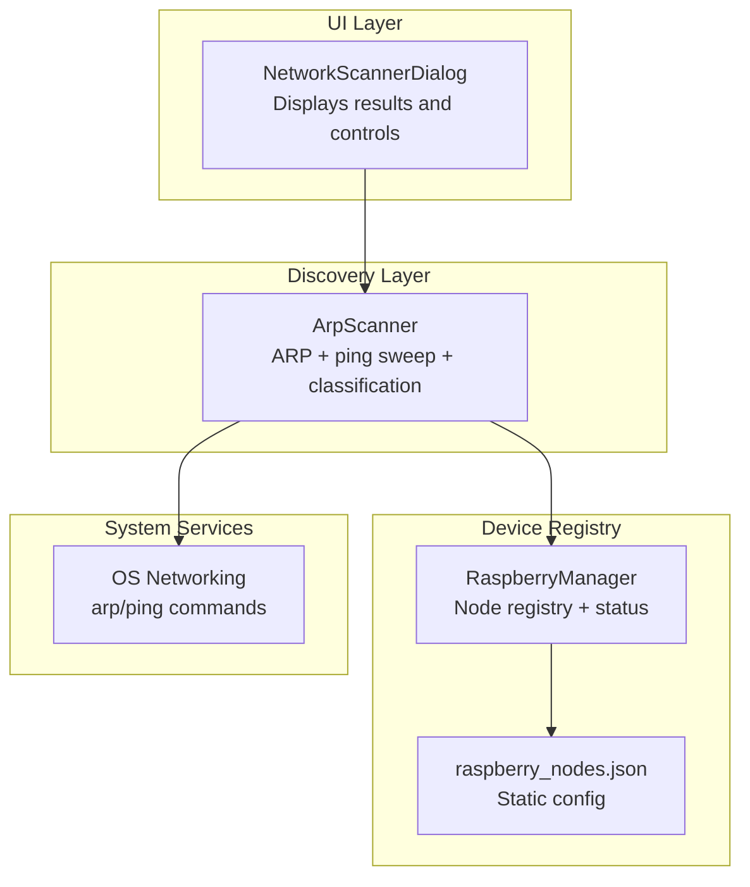
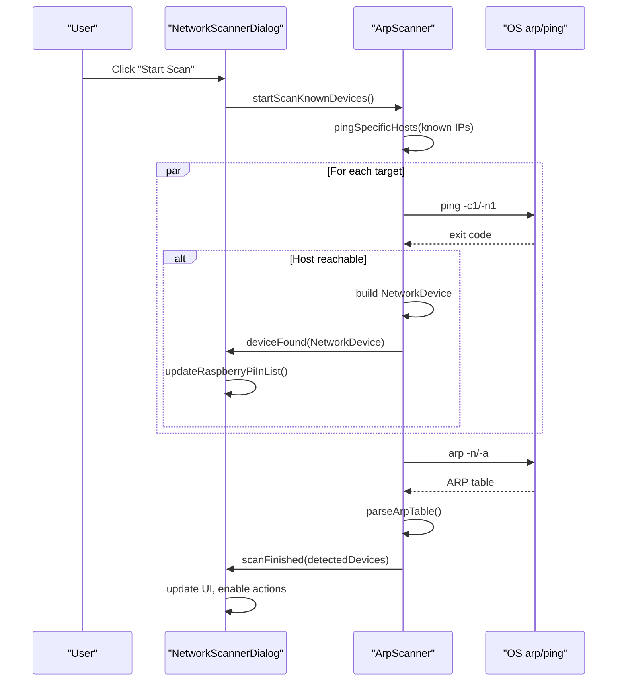
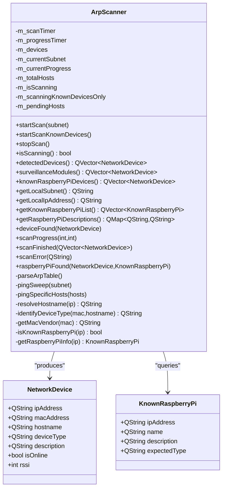
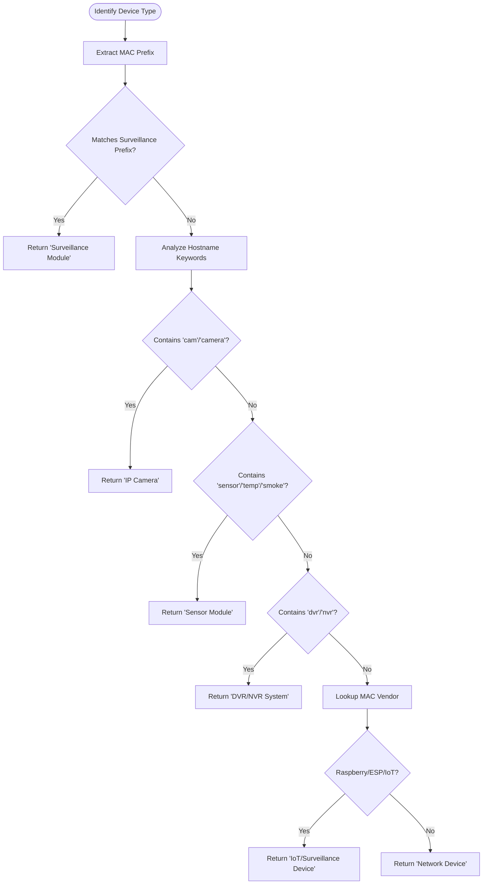
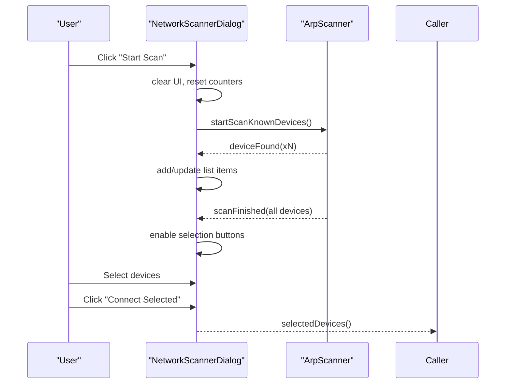
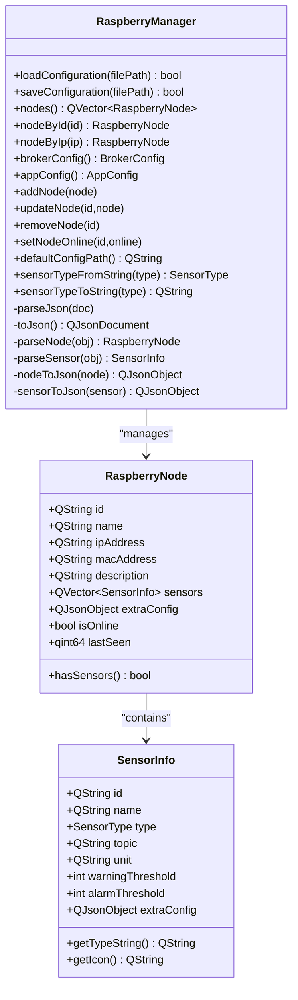
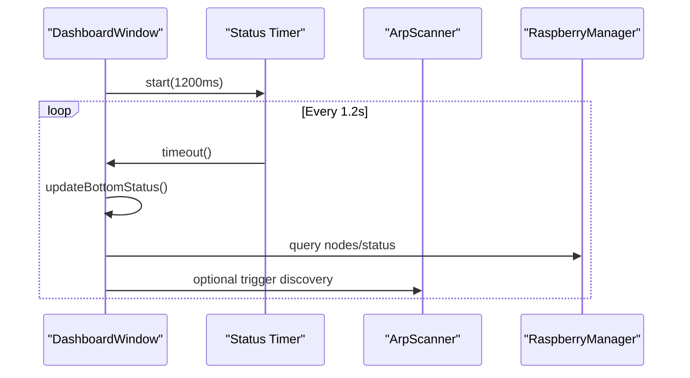
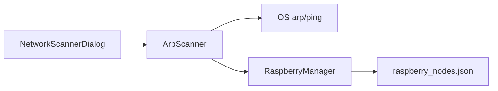

# Network Discovery System

<cite>
**Referenced Files in This Document**
- [arpscanner.h](file://arpscanner.h)
- [arpscanner.cpp](file://arpscanner.cpp)
- [networkscannerdialog.h](file://networkscannerdialog.h)
- [networkscannerdialog.cpp](file://networkscannerdialog.cpp)
- [raspberrymanager.h](file://raspberrymanager.h)
- [raspberrymanager.cpp](file://raspberrymanager.cpp)
- [config/raspberry_nodes.json](file://config/raspberry_nodes.json)
- [dashboardwindow.cpp](file://dashboardwindow.cpp)
</cite>

## Table of Contents
1. [Introduction](#introduction)
2. [Project Structure](#project-structure)
3. [Core Components](#core-components)
4. [Architecture Overview](#architecture-overview)
5. [Detailed Component Analysis](#detailed-component-analysis)
6. [Dependency Analysis](#dependency-analysis)
7. [Performance Considerations](#performance-considerations)
8. [Troubleshooting Guide](#troubleshooting-guide)
9. [Conclusion](#conclusion)

## Introduction
This document describes the network discovery system responsible for detecting, classifying, and tracking surveillance-related devices on a local network. It focuses on the ARP-based scanner implementation, device classification algorithms, real-time monitoring integration, and the NetworkScannerDialog user interface. It also covers Raspberry Pi detection, known device recognition, MAC vendor identification, and practical guidance for performance and troubleshooting.

## Project Structure
The network discovery system is composed of:
- An ARP scanner service that performs ping sweeps and parses ARP tables to discover devices
- A dialog-based UI for initiating scans, displaying results, and selecting devices
- A manager for Raspberry Pi configurations and runtime status tracking
- A configuration file that defines known Raspberry Pi nodes and network parameters

**Diagram sources**
- [networkscannerdialog.cpp:16-45](file://networkscannerdialog.cpp#L16-L45)
- [arpscanner.cpp:83-106](file://arpscanner.cpp#L83-L106)
- [raspberrymanager.cpp:11-22](file://raspberrymanager.cpp#L11-L22)
- [config/raspberry_nodes.json:1-122](file://config/raspberry_nodes.json#L1-L122)

**Section sources**
- [networkscannerdialog.h:14-57](file://networkscannerdialog.h#L14-L57)
- [arpscanner.h:31-88](file://arpscanner.h#L31-L88)
- [raspberrymanager.h:63-107](file://raspberrymanager.h#L63-L107)

## Core Components
- ArpScanner: Performs network discovery via ping sweep and ARP table parsing, classifies devices, and emits signals for UI updates.
- NetworkScannerDialog: Provides the user interface for initiating scans, displaying discovered devices, and selecting targets for connection.
- RaspberryManager: Manages persistent configuration of Raspberry Pi nodes, including sensors, MQTT broker settings, and runtime status.
- Configuration: Static JSON configuration defines known nodes, network parameters, and MQTT settings.

Key responsibilities:
- Discovery: Ping sweep of subnet, ARP table parsing, hostname resolution
- Classification: MAC prefix matching, hostname heuristics, vendor lookup
- Tracking: Known device lists, online/offline status, RSSI simulation
- Integration: UI updates, selection handling, and status reporting

**Section sources**
- [arpscanner.cpp:108-131](file://arpscanner.cpp#L108-L131)
- [arpscanner.cpp:323-332](file://arpscanner.cpp#L323-L332)
- [networkscannerdialog.cpp:198-222](file://networkscannerdialog.cpp#L198-L222)
- [raspberrymanager.cpp:24-52](file://raspberrymanager.cpp#L24-L52)

## Architecture Overview
The system follows a layered design:
- UI layer (NetworkScannerDialog) triggers discovery and renders results
- Discovery layer (ArpScanner) orchestrates ping sweeps and ARP parsing
- Classification layer applies MAC/vendor/host heuristics
- Registry layer (RaspberryManager) persists and tracks nodes
- Configuration layer (JSON) defines known nodes and network parameters

**Diagram sources**
- [networkscannerdialog.cpp:198-222](file://networkscannerdialog.cpp#L198-L222)
- [arpscanner.cpp:232-279](file://arpscanner.cpp#L232-L279)
- [arpscanner.cpp:334-384](file://arpscanner.cpp#L334-L384)

## Detailed Component Analysis

### ArpScanner: Network Discovery and Classification
The ArpScanner is the core discovery engine:
- Subnet detection and local IP resolution
- Ping sweep across 254 hosts in the subnet
- Targeted ping for known Raspberry Pi addresses
- ARP table parsing to extract IP/MAC pairs
- Device classification by MAC prefix, hostname keywords, and vendor lookup
- Known Raspberry Pi detection and specialized notifications

**Diagram sources**
- [arpscanner.h:31-88](file://arpscanner.h#L31-L88)
- [arpscanner.cpp:83-106](file://arpscanner.cpp#L83-L106)

Device classification logic:
- MAC prefix matching against surveillance device prefixes
- Hostname heuristics for cameras, sensors, DVR/NVR
- Vendor lookup for Raspberry Pi and IoT vendors
- Fallback to generic categories

**Diagram sources**
- [arpscanner.cpp:426-462](file://arpscanner.cpp#L426-L462)
- [arpscanner.cpp:464-517](file://arpscanner.cpp#L464-L517)

**Section sources**
- [arpscanner.h:10-88](file://arpscanner.h#L10-L88)
- [arpscanner.cpp:281-316](file://arpscanner.cpp#L281-L316)
- [arpscanner.cpp:426-462](file://arpscanner.cpp#L426-L462)
- [arpscanner.cpp:464-517](file://arpscanner.cpp#L464-L517)

### NetworkScannerDialog: UI for Discovery and Selection
The NetworkScannerDialog provides:
- Scan initiation and cancellation
- Real-time progress updates
- Device list rendering with selection support
- Known Raspberry Pi pre-seeding
- Connectivity action enabling based on selections

**Diagram sources**
- [networkscannerdialog.cpp:198-222](file://networkscannerdialog.cpp#L198-L222)
- [networkscannerdialog.cpp:248-261](file://networkscannerdialog.cpp#L248-L261)
- [networkscannerdialog.cpp:300-322](file://networkscannerdialog.cpp#L300-L322)
- [networkscannerdialog.cpp:224-246](file://networkscannerdialog.cpp#L224-L246)

UI highlights:
- Progress bar with percentage and host counts
- Status label with color-coded feedback
- List items with icons and check-state for selection
- Automatic selection of surveillance-type devices

**Section sources**
- [networkscannerdialog.h:14-57](file://networkscannerdialog.h#L14-L57)
- [networkscannerdialog.cpp:66-196](file://networkscannerdialog.cpp#L66-L196)
- [networkscannerdialog.cpp:248-384](file://networkscannerdialog.cpp#L248-L384)

### RaspberryManager: Configuration and Runtime Tracking
RaspberryManager handles:
- Loading and saving configuration from JSON
- Managing nodes, sensors, and broker/app settings
- Tracking node online status and last-seen timestamps
- Converting between string and enum sensor types

**Diagram sources**
- [raspberrymanager.h:63-107](file://raspberrymanager.h#L63-L107)
- [raspberrymanager.cpp:11-22](file://raspberrymanager.cpp#L11-L22)
- [raspberrymanager.cpp:181-273](file://raspberrymanager.cpp#L181-L273)

**Section sources**
- [raspberrymanager.h:10-107](file://raspberrymanager.h#L10-L107)
- [raspberrymanager.cpp:24-52](file://raspberrymanager.cpp#L24-L52)
- [config/raspberry_nodes.json:1-122](file://config/raspberry_nodes.json#L1-L122)

### Network Topology Mapping and Real-Time Monitoring
While the discovery system focuses on device detection and classification, the dashboard integrates periodic status updates and navigation to discovery features. The status timer triggers regular refreshes of the bottom bar and sensor panels, complementing the discovery workflow.

**Diagram sources**
- [dashboardwindow.cpp:236-239](file://dashboardwindow.cpp#L236-L239)
- [dashboardwindow.cpp:241-243](file://dashboardwindow.cpp#L241-L243)

**Section sources**
- [dashboardwindow.cpp:80-133](file://dashboardwindow.cpp#L80-L133)
- [dashboardwindow.cpp:236-239](file://dashboardwindow.cpp#L236-L239)

## Dependency Analysis
- NetworkScannerDialog depends on ArpScanner for discovery and signals for updates
- ArpScanner depends on OS-level arp/ping commands and Qt networking utilities
- RaspberryManager depends on JSON parsing and maintains in-memory node registry
- Configuration file provides static definitions for known nodes and network parameters

**Diagram sources**
- [networkscannerdialog.cpp:16-45](file://networkscannerdialog.cpp#L16-L45)
- [arpscanner.cpp:83-106](file://arpscanner.cpp#L83-L106)
- [raspberrymanager.cpp:11-22](file://raspberrymanager.cpp#L11-L22)
- [config/raspberry_nodes.json:1-122](file://config/raspberry_nodes.json#L1-L122)

**Section sources**
- [networkscannerdialog.h:14-57](file://networkscannerdialog.h#L14-L57)
- [arpscanner.h:31-88](file://arpscanner.h#L31-L88)
- [raspberrymanager.h:63-107](file://raspberrymanager.h#L63-L107)

## Performance Considerations
- Ping concurrency: The scanner spawns multiple ping processes concurrently. On large networks, consider limiting concurrent pings or batching to reduce resource contention.
- ARP parsing: Parsing ARP output is O(n) with n hosts; ensure timeouts are reasonable to avoid blocking.
- UI updates: Frequent deviceFound signals can cause UI thrashing; batch updates if needed.
- Known devices: Scanning only known IPs reduces total hosts from 254 to a small fixed set, significantly improving speed for targeted discovery.
- RSSI simulation: Random RSSI generation is lightweight but can be replaced with measured values if available.

[No sources needed since this section provides general guidance]

## Troubleshooting Guide
Common issues and resolutions:
- Unable to determine local subnet: Verify network interfaces and permissions; the scanner requires at least one operational IPv4 interface.
- No devices found: Confirm firewall/ICMP restrictions; ensure ping and arp commands are available and executable.
- ARP table empty: On some systems, arp caches may be empty; rely on ping-based detection or adjust OS-level ARP cache settings.
- Hostname resolution failures: Hostnames may be unknown; the scanner defaults to "Unknown" and continues classification via MAC/vendor.
- Known Raspberry Pi not detected: Ensure IP addresses match exactly; verify gateway reachability and that devices respond to ICMP.

Operational checks:
- Validate configuration file syntax and paths
- Confirm MQTT broker connectivity if integrating with RaspberryManager
- Monitor scanError signals for actionable messages

**Section sources**
- [arpscanner.cpp:281-316](file://arpscanner.cpp#L281-L316)
- [arpscanner.cpp:334-384](file://arpscanner.cpp#L334-L384)
- [arpscanner.cpp:417-424](file://arpscanner.cpp#L417-L424)
- [networkscannerdialog.cpp:324-330](file://networkscannerdialog.cpp#L324-L330)

## Conclusion
The network discovery system combines efficient ARP-based scanning, robust device classification, and a user-friendly interface to detect and track surveillance-related devices. By focusing on known devices first and leveraging MAC/vendor heuristics, it achieves fast and accurate results suitable for real-time monitoring dashboards. Integrating with RaspberryManager enables persistent configuration and runtime status tracking, supporting broader surveillance workflows.