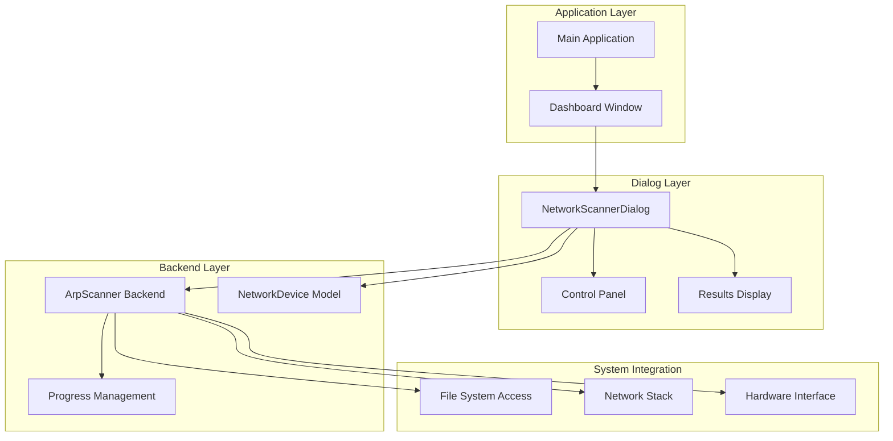
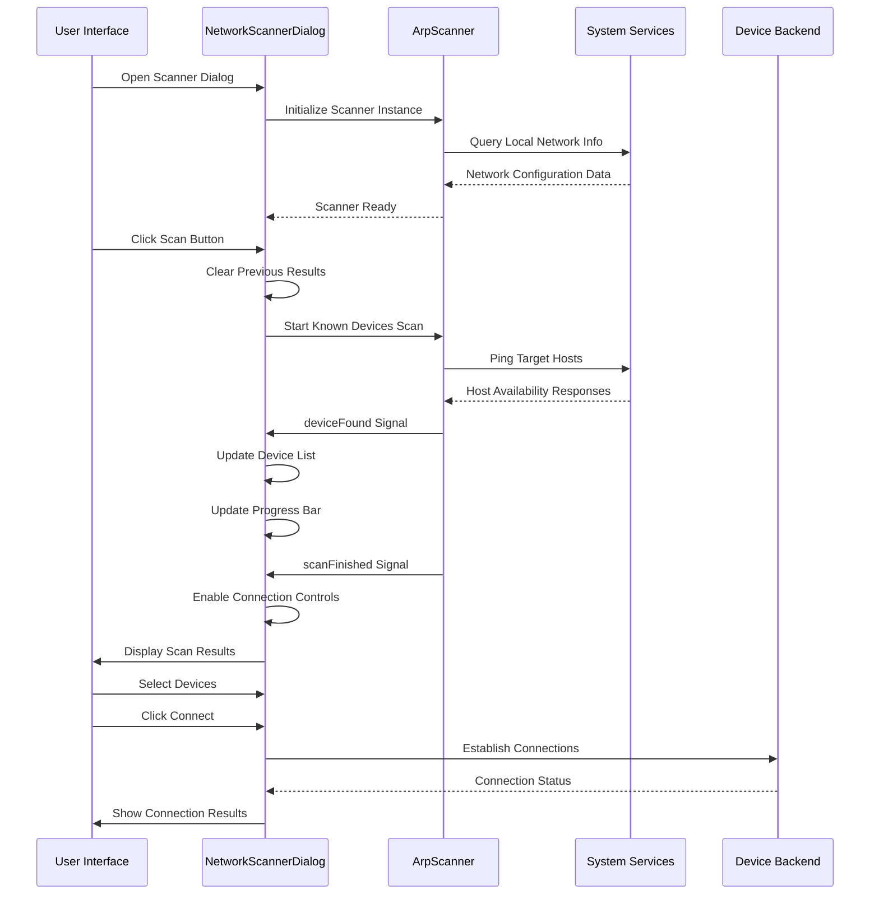
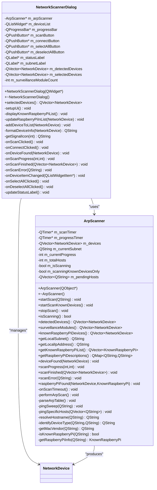
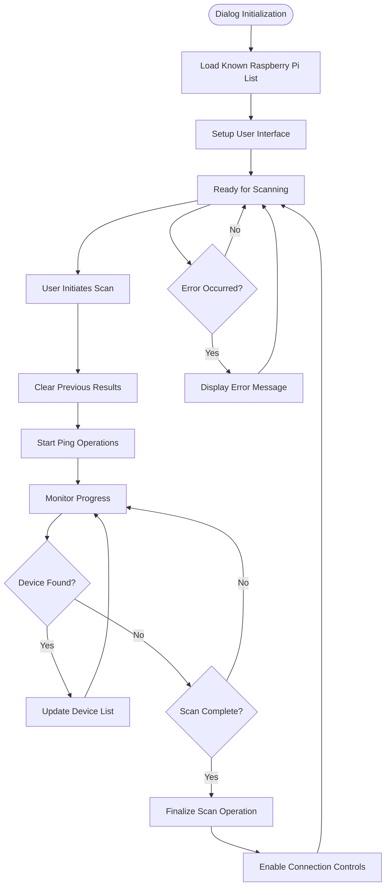
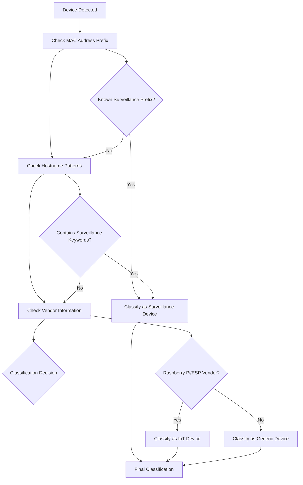
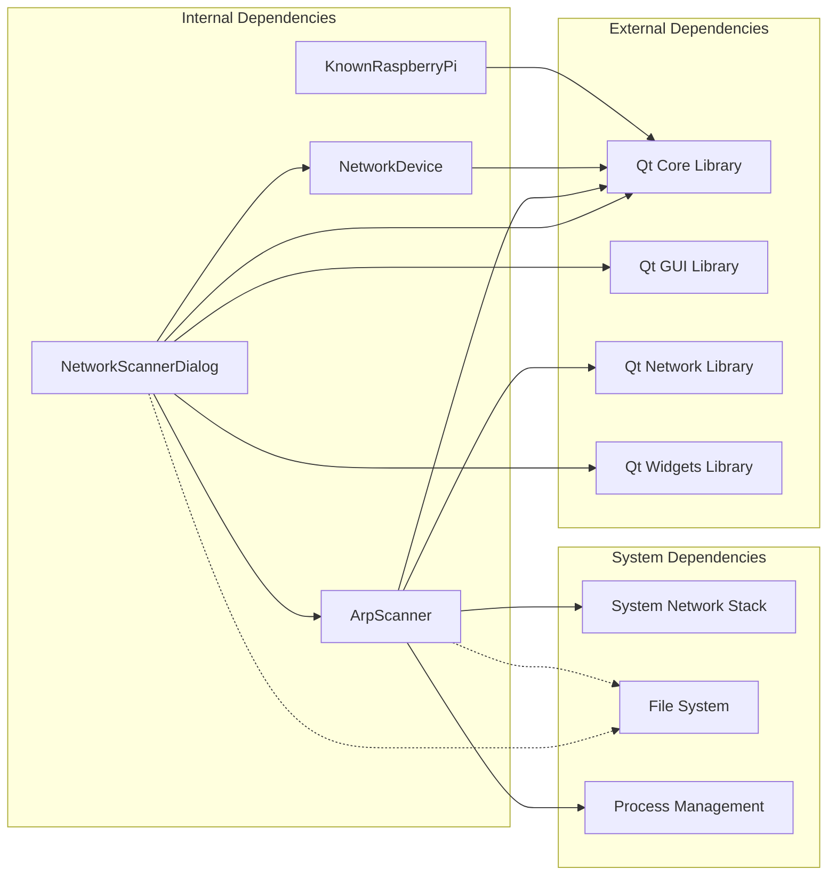

# Network Scanner Dialog Interface

<cite>
**Referenced Files in This Document**
- [networkscannerdialog.h](file://networkscannerdialog.h)
- [networkscannerdialog.cpp](file://networkscannerdialog.cpp)
- [arpscanner.h](file://arpscanner.h)
- [arpscanner.cpp](file://arpscanner.cpp)
- [dashboardwindow.cpp](file://dashboardwindow.cpp)
- [main.cpp](file://main.cpp)
</cite>

## Table of Contents
1. [Introduction](#introduction)
2. [Project Structure](#project-structure)
3. [Core Components](#core-components)
4. [Architecture Overview](#architecture-overview)
5. [Detailed Component Analysis](#detailed-component-analysis)
6. [Dependency Analysis](#dependency-analysis)
7. [Performance Considerations](#performance-considerations)
8. [Troubleshooting Guide](#troubleshooting-guide)
9. [Conclusion](#conclusion)

## Introduction
The Network Scanner Dialog is a specialized user interface component designed to facilitate network scanning operations for surveillance modules within the SurveillanceQT system. This dialog provides a comprehensive solution for detecting, identifying, and connecting to Raspberry Pi-based surveillance devices on a local network. The implementation combines Qt's native widgets with a custom ARP-based scanner backend to deliver real-time network discovery capabilities.

The dialog serves as a critical integration point between the user interface and the underlying network scanning infrastructure, enabling users to discover surveillance modules such as temperature sensors, IP cameras, air quality monitors, and display devices. It provides sophisticated filtering mechanisms, real-time progress tracking, and intuitive selection controls for managing multiple device connections.

## Project Structure
The Network Scanner Dialog is implemented as a standalone QDialog component that integrates seamlessly with the broader surveillance application architecture. The implementation follows Qt's Model-View-Controller pattern with clear separation of concerns between UI presentation, business logic, and network scanning operations.

**Diagram sources**
- [networkscannerdialog.h:14-56](file://networkscannerdialog.h#L14-L56)
- [arpscanner.h:31-87](file://arpscanner.h#L31-L87)
- [dashboardwindow.cpp:681-688](file://dashboardwindow.cpp#L681-L688)

**Section sources**
- [networkscannerdialog.h:1-57](file://networkscannerdialog.h#L1-L57)
- [arpscanner.h:1-88](file://arpscanner.h#L1-L88)
- [dashboardwindow.cpp:681-688](file://dashboardwindow.cpp#L681-L688)

## Core Components
The Network Scanner Dialog consists of several interconnected components that work together to provide a comprehensive network scanning experience:

### Primary UI Components
- **Device List Widget**: Displays discovered network devices with real-time status updates
- **Progress Bar**: Shows scanning progress with percentage completion metrics
- **Control Buttons**: Provides scan initiation, connection, and selection management
- **Status Label**: Communicates current operation state and system feedback
- **Subnet Information**: Displays network topology details and gateway information

### Backend Integration
- **ArpScanner Integration**: Leverages the ArpScanner class for network discovery operations
- **Real-time Updates**: Processes device discovery events and updates UI components dynamically
- **Error Handling**: Manages scanning errors and provides user feedback mechanisms

### Device Management
- **Selection Mechanisms**: Supports individual device selection and bulk operations
- **Filtering Capabilities**: Automatically identifies and categorizes surveillance devices
- **Connection Management**: Handles device connection establishment and validation

**Section sources**
- [networkscannerdialog.cpp:66-196](file://networkscannerdialog.cpp#L66-L196)
- [arpscanner.cpp:174-196](file://arpscanner.cpp#L174-L196)

## Architecture Overview
The Network Scanner Dialog implements a layered architecture that separates user interface concerns from network scanning operations. The design emphasizes modularity, maintainability, and extensibility while ensuring responsive user interactions.

**Diagram sources**
- [networkscannerdialog.cpp:198-222](file://networkscannerdialog.cpp#L198-L222)
- [arpscanner.cpp:174-196](file://arpscanner.cpp#L174-L196)
- [arpscanner.cpp:318-332](file://arpscanner.cpp#L318-L332)

The architecture follows Qt's signal-slot mechanism for asynchronous communication, ensuring thread-safe operations and responsive user interfaces. The dialog maintains state through member variables while delegating intensive network operations to the ArpScanner backend.

**Section sources**
- [networkscannerdialog.cpp:16-45](file://networkscannerdialog.cpp#L16-L45)
- [arpscanner.cpp:83-106](file://arpscanner.cpp#L83-L106)

## Detailed Component Analysis

### NetworkScannerDialog Class Implementation
The NetworkScannerDialog class serves as the primary controller for the network scanning interface, orchestrating user interactions and coordinating with the ArpScanner backend.

**Diagram sources**
- [networkscannerdialog.h:14-56](file://networkscannerdialog.h#L14-L56)
- [arpscanner.h:31-87](file://arpscanner.h#L31-L87)

#### UI Layout and Styling
The dialog implements a comprehensive layout system using Qt's layout managers to ensure responsive design across different screen sizes and resolutions. The styling framework employs CSS-like syntax to create a modern dark-themed interface optimized for surveillance applications.

Key layout components include:
- **Main Vertical Layout**: Organizes dialog elements with consistent spacing and margins
- **Header Section**: Provides clear title and descriptive text for user guidance
- **Progress Section**: Displays scanning progress with visual feedback
- **Device List Group**: Contains interactive device listing with selection capabilities
- **Control Section**: Offers connection and management controls

#### Device Discovery Workflow
The device discovery process follows a structured workflow that ensures reliable detection of surveillance modules:

**Diagram sources**
- [networkscannerdialog.cpp:198-330](file://networkscannerdialog.cpp#L198-L330)
- [arpscanner.cpp:174-196](file://arpscanner.cpp#L174-L196)

**Section sources**
- [networkscannerdialog.h:14-56](file://networkscannerdialog.h#L14-L56)
- [networkscannerdialog.cpp:66-196](file://networkscannerdialog.cpp#L66-L196)
- [arpscanner.cpp:174-196](file://arpscanner.cpp#L174-L196)

### ArpScanner Backend Implementation
The ArpScanner class provides the core network scanning functionality, implementing sophisticated device discovery algorithms and network protocol handling.

#### Network Discovery Algorithms
The backend employs multiple discovery strategies to maximize detection accuracy:

1. **ARP Table Parsing**: Extracts MAC address information from system ARP tables
2. **Ping Sweep Operations**: Performs systematic network scanning using ICMP echo requests
3. **MAC Address Vendor Identification**: Determines device manufacturers from MAC prefixes
4. **Hostname Resolution**: Resolves IP addresses to meaningful hostnames for user identification

#### Device Classification System
The scanner implements intelligent device classification based on multiple criteria:

**Diagram sources**
- [arpscanner.cpp:426-462](file://arpscanner.cpp#L426-L462)

**Section sources**
- [arpscanner.h:10-87](file://arpscanner.h#L10-L87)
- [arpscanner.cpp:426-462](file://arpscanner.cpp#L426-L462)

### User Interaction Patterns
The dialog implements comprehensive user interaction patterns designed to support efficient network management workflows:

#### Selection and Filtering Mechanisms
- **Individual Selection**: Users can select specific devices using checkbox controls
- **Bulk Operations**: All devices can be selected or deselected with single button clicks
- **Automatic Filtering**: Surveillance modules are automatically identified and pre-selected
- **Real-time Feedback**: Selection changes immediately update connection availability

#### Progress and Status Indicators
- **Visual Progress Bar**: Displays scanning progress with percentage completion
- **Dynamic Status Messages**: Provides contextual feedback during operations
- **Color-coded Status**: Uses visual indicators to communicate device states
- **Network Information Display**: Shows subnet details and gateway information

#### Error Handling and Recovery
- **Graceful Error Handling**: Network errors are captured and presented to users
- **Retry Mechanisms**: Failed operations can be retried with user consent
- **Diagnostic Information**: Error messages include actionable diagnostic details
- **State Recovery**: Dialog state is restored after error conditions

**Section sources**
- [networkscannerdialog.cpp:332-366](file://networkscannerdialog.cpp#L332-L366)
- [networkscannerdialog.cpp:324-330](file://networkscannerdialog.cpp#L324-L330)

## Dependency Analysis
The Network Scanner Dialog maintains carefully managed dependencies that balance functionality with maintainability and performance considerations.

**Diagram sources**
- [networkscannerdialog.h:3](file://networkscannerdialog.h#L3)
- [arpscanner.h:3-8](file://arpscanner.h#L3-L8)

### Coupling and Cohesion Analysis
The implementation demonstrates strong internal cohesion with well-defined external boundaries:

- **High Internal Cohesion**: NetworkScannerDialog focuses exclusively on UI and coordination tasks
- **Low External Coupling**: Minimal dependencies on external systems beyond Qt framework
- **Clear Interface Boundaries**: Well-defined contracts between components
- **Encapsulation**: Internal state management prevents external interference

### Integration Points
The dialog integrates with several system components:

1. **Dashboard Integration**: Seamless integration with the main dashboard window
2. **System Services**: Access to network configuration and system information
3. **File System**: Configuration file access for device definitions
4. **Process Management**: System process execution for network operations

**Section sources**
- [networkscannerdialog.cpp:33-40](file://networkscannerdialog.cpp#L33-L40)
- [arpscanner.cpp:281-316](file://arpscanner.cpp#L281-L316)

## Performance Considerations
The Network Scanner Dialog is designed with performance optimization as a primary concern, implementing several strategies to ensure responsive operation under various network conditions.

### Asynchronous Operations
All network scanning operations are performed asynchronously to prevent UI blocking. The dialog uses Qt's event-driven architecture with signal-slot connections to handle long-running operations without freezing the user interface.

### Memory Management
- **Efficient Data Structures**: Uses QVector for optimal memory allocation and access patterns
- **Resource Cleanup**: Automatic cleanup of temporary resources and processes
- **Memory Pool Management**: Minimizes memory fragmentation through strategic allocation patterns

### Network Efficiency
- **Batch Processing**: Groups network operations to minimize system overhead
- **Connection Pooling**: Reuses network connections where possible
- **Timeout Management**: Implements appropriate timeouts to prevent hanging operations

### UI Responsiveness
- **Progress Reporting**: Real-time progress updates prevent user uncertainty
- **State Management**: Maintains consistent UI state during operations
- **Visual Feedback**: Immediate visual responses to user actions

## Troubleshooting Guide
The Network Scanner Dialog implements comprehensive error handling and diagnostic capabilities to assist users in resolving common issues.

### Common Issues and Solutions
**Network Discovery Failures**
- Verify network connectivity and router accessibility
- Check firewall settings that may block ICMP traffic
- Ensure administrator privileges for network scanning operations

**Device Detection Problems**
- Confirm devices are powered on and connected to the network
- Verify network cables and wireless connections are functional
- Check for network segmentation that may isolate devices

**Performance Issues**
- Close unnecessary applications that may interfere with network operations
- Restart the application if scanning becomes unresponsive
- Check system resource usage during scanning operations

### Diagnostic Features
The dialog provides built-in diagnostic capabilities:
- **Error Logging**: Comprehensive error reporting with timestamps
- **Network Status**: Real-time monitoring of network connectivity
- **Device Statistics**: Detailed information about detected devices
- **Operation History**: Tracking of recent scanning activities

### User Guidance Mechanisms
- **Contextual Help**: Inline help text and tooltips for complex operations
- **Progress Indicators**: Clear visual feedback during long operations
- **Status Messages**: Descriptive status updates throughout the scanning process
- **Error Recovery**: Guided recovery procedures for common failure scenarios

**Section sources**
- [networkscannerdialog.cpp:324-330](file://networkscannerdialog.cpp#L324-L330)
- [arpscanner.cpp:108-131](file://arpscanner.cpp#L108-L131)

## Conclusion
The Network Scanner Dialog represents a sophisticated implementation of network discovery and management functionality within the SurveillanceQT system. The component successfully balances user-friendly interface design with robust backend functionality, providing a comprehensive solution for surveillance device management.

The implementation demonstrates excellent architectural principles including clear separation of concerns, modular design, and comprehensive error handling. The dialog's integration with the ArpScanner backend ensures reliable network discovery while maintaining responsive user interactions through asynchronous operations.

Key strengths of the implementation include:
- **Comprehensive Device Support**: Handles diverse surveillance device types with intelligent classification
- **Robust Error Handling**: Provides graceful degradation and user-friendly error communication
- **Responsive Design**: Maintains UI responsiveness during intensive network operations
- **Extensible Architecture**: Well-designed interfaces support future enhancements and modifications

The dialog serves as a critical component in the overall surveillance system, enabling users to efficiently manage their networked surveillance infrastructure while providing valuable insights into network topology and device connectivity status.