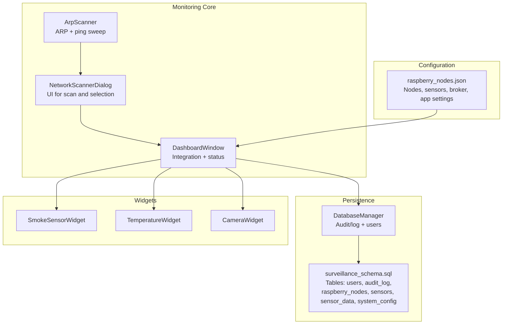
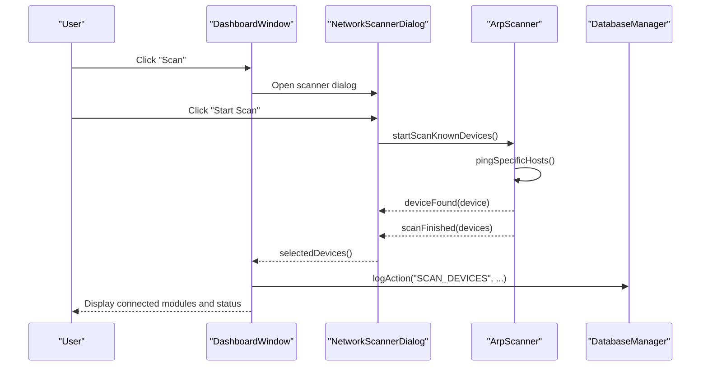
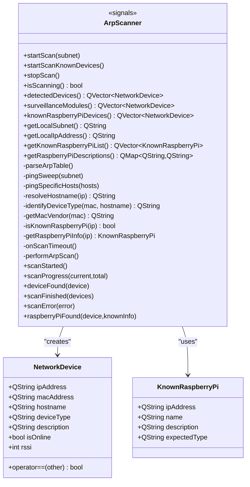
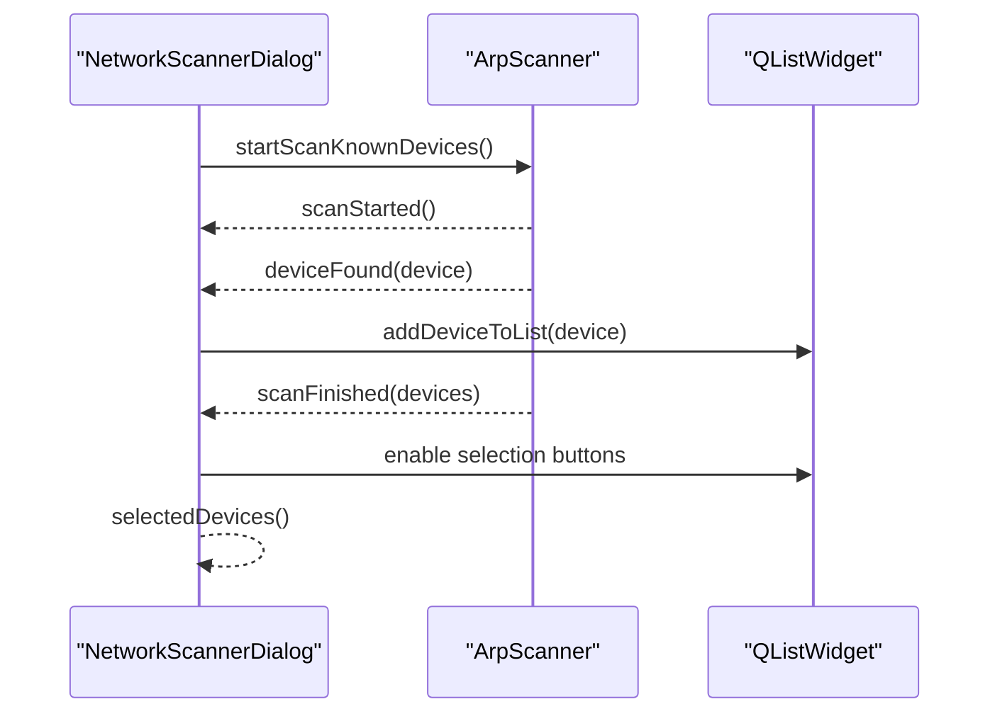
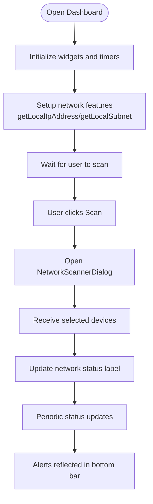
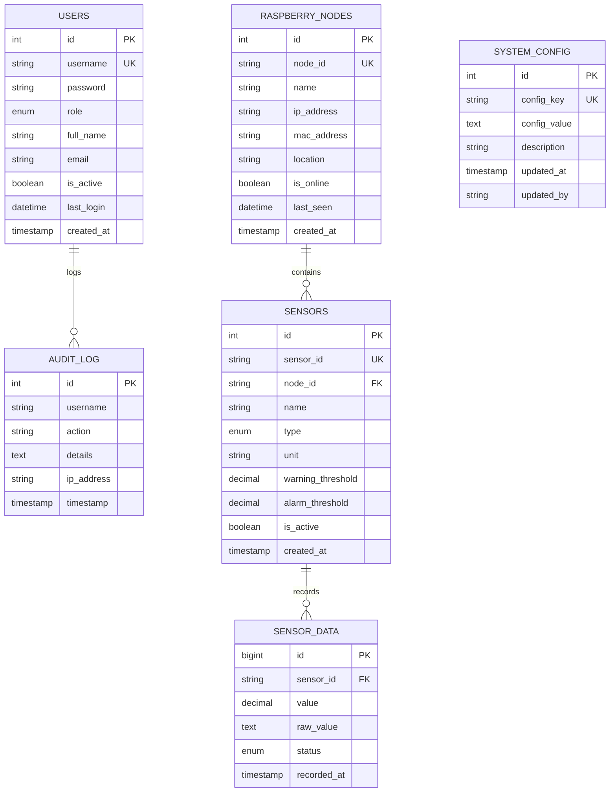
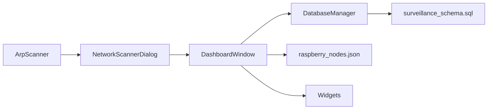

# Real-time Network Monitoring

<cite>
**Referenced Files in This Document**
- [arpscanner.h](file://arpscanner.h)
- [arpscanner.cpp](file://arpscanner.cpp)
- [networkscannerdialog.h](file://networkscannerdialog.h)
- [networkscannerdialog.cpp](file://networkscannerdialog.cpp)
- [dashboardwindow.h](file://dashboardwindow.h)
- [dashboardwindow.cpp](file://dashboardwindow.cpp)
- [databasemanager.h](file://databasemanager.h)
- [databasemanager.cpp](file://databasemanager.cpp)
- [config/raspberry_nodes.json](file://config/raspberry_nodes.json)
- [database/surveillance_schema.sql](file://database/surveillance_schema.sql)
- [smokesensorwidget.h](file://smokesensorwidget.h)
- [temperaturewidget.h](file://temperaturewidget.h)
- [camerawidget.h](file://camerawidget.h)
</cite>

## Table of Contents
1. [Introduction](#introduction)
2. [Project Structure](#project-structure)
3. [Core Components](#core-components)
4. [Architecture Overview](#architecture-overview)
5. [Detailed Component Analysis](#detailed-component-analysis)
6. [Dependency Analysis](#dependency-analysis)
7. [Performance Considerations](#performance-considerations)
8. [Troubleshooting Guide](#troubleshooting-guide)
9. [Conclusion](#conclusion)
10. [Appendices](#appendices)

## Introduction
This document explains the real-time network monitoring capabilities implemented in the SurveillanceQT project. It covers continuous monitoring systems, automatic scan scheduling, dynamic network topology tracking, surveillance module detection, online/offline status tracking, and RSSI monitoring for wireless devices. It also documents integration with the dashboard system, alert generation for network changes, and historical network activity logging. Finally, it provides performance optimization, resource management, and scalability recommendations for large networks, along with configuration examples and troubleshooting guidance.

## Project Structure
The monitoring system centers around a dedicated ARP-based scanner, a network scanning dialog, and a dashboard window that integrates monitoring results into the UI. Supporting infrastructure includes a database manager for audit/logging and a configuration file for Raspberry Pi nodes and MQTT broker settings. The dashboard displays connected surveillance modules and provides controls to initiate scans and manage widgets.

**Diagram sources**
- [arpscanner.h](file://arpscanner.h)
- [arpscanner.cpp](file://arpscanner.cpp)
- [networkscannerdialog.h](file://networkscannerdialog.h)
- [networkscannerdialog.cpp](file://networkscannerdialog.cpp)
- [dashboardwindow.h](file://dashboardwindow.h)
- [dashboardwindow.cpp](file://dashboardwindow.cpp)
- [databasemanager.h](file://databasemanager.h)
- [databasemanager.cpp](file://databasemanager.cpp)
- [config/raspberry_nodes.json](file://config/raspberry_nodes.json)
- [database/surveillance_schema.sql](file://database/surveillance_schema.sql)
- [smokesensorwidget.h](file://smokesensorwidget.h)
- [temperaturewidget.h](file://temperaturewidget.h)
- [camerawidget.h](file://camerawidget.h)

**Section sources**
- [arpscanner.h](file://arpscanner.h)
- [arpscanner.cpp](file://arpscanner.cpp)
- [networkscannerdialog.h](file://networkscannerdialog.h)
- [networkscannerdialog.cpp](file://networkscannerdialog.cpp)
- [dashboardwindow.h](file://dashboardwindow.h)
- [dashboardwindow.cpp](file://dashboardwindow.cpp)
- [databasemanager.h](file://databasemanager.h)
- [databasemanager.cpp](file://databasemanager.cpp)
- [config/raspberry_nodes.json](file://config/raspberry_nodes.json)
- [database/surveillance_schema.sql](file://database/surveillance_schema.sql)
- [smokesensorwidget.h](file://smokesensorwidget.h)
- [temperaturewidget.h](file://temperaturewidget.h)
- [camerawidget.h](file://camerawidget.h)

## Core Components
- ArpScanner: Performs ARP table parsing and ICMP ping sweeps to discover devices, classify surveillance modules, and track online/offline status and RSSI estimates.
- NetworkScannerDialog: Provides a UI to start scans, display discovered devices, select modules, and connect them to the dashboard.
- DashboardWindow: Integrates monitoring results, shows network status, and manages widgets for smoke, temperature, and camera.
- DatabaseManager: Handles user authentication, session management, and audit logging for monitoring actions.
- Configuration: JSON defines Raspberry Pi nodes, sensors, MQTT broker, and application behavior.
- Widgets: Represent real-time sensor data and statuses on the dashboard.

Key monitoring data structures:
- NetworkDevice: Holds IP, MAC, hostname, device type, description, online flag, and RSSI.
- KnownRaspberryPi: Defines known RPi nodes for targeted discovery.
- User: Represents authenticated users with roles and permissions.

**Section sources**
- [arpscanner.h](file://arpscanner.h)
- [arpscanner.cpp](file://arpscanner.cpp)
- [networkscannerdialog.h](file://networkscannerdialog.h)
- [networkscannerdialog.cpp](file://networkscannerdialog.cpp)
- [dashboardwindow.h](file://dashboardwindow.h)
- [dashboardwindow.cpp](file://dashboardwindow.cpp)
- [databasemanager.h](file://databasemanager.h)
- [databasemanager.cpp](file://databasemanager.cpp)
- [config/raspberry_nodes.json](file://config/raspberry_nodes.json)

## Architecture Overview
The monitoring pipeline starts with ArpScanner performing periodic or on-demand scans. Discovered devices are classified and displayed via NetworkScannerDialog. DashboardWindow aggregates results, updates status bars, and connects widgets to monitored modules. DatabaseManager logs user actions and maintains audit trails. Configuration drives node discovery and MQTT connectivity.

**Diagram sources**
- [dashboardwindow.cpp](file://dashboardwindow.cpp)
- [networkscannerdialog.cpp](file://networkscannerdialog.cpp)
- [arpscanner.cpp](file://arpscanner.cpp)
- [databasemanager.cpp](file://databasemanager.cpp)

## Detailed Component Analysis

### ArpScanner: Continuous Discovery and Classification
- Responsibilities:
  - Determine local subnet and IP address.
  - Perform ping sweep across 254 hosts and targeted pings for known RPi nodes.
  - Parse ARP table to extract MAC/IP pairs and derive device types.
  - Resolve hostnames and identify surveillance-related devices by MAC prefixes and hostnames.
  - Estimate RSSI for discovered devices.
  - Emit signals for scan lifecycle and discovered devices.
- Data structures:
  - NetworkDevice: core device record with online flag and RSSI.
  - KnownRaspberryPi: known node list for targeted discovery.
  - Static lists of MAC prefixes for surveillance modules.
- Behavior:
  - Uses timers to schedule scan completion after ping operations.
  - Emits progress updates and final scan results.
  - Tracks scanning state and supports stopping scans.

**Diagram sources**
- [arpscanner.h](file://arpscanner.h)
- [arpscanner.cpp](file://arpscanner.cpp)

**Section sources**
- [arpscanner.h](file://arpscanner.h)
- [arpscanner.cpp](file://arpscanner.cpp)

### NetworkScannerDialog: UI for Scanning and Selection
- Responsibilities:
  - Initialize ArpScanner and subscribe to scan signals.
  - Display discovered devices, update progress, and reflect online/offline status.
  - Allow users to select modules and connect them to the dashboard.
  - Show counts of surveillance modules and formatted device info including RSSI icons.
- Integration:
  - Uses ArpScanner’s known RPi list to pre-populate the device list.
  - Updates UI elements and enables/disables buttons based on scan state and selections.

**Diagram sources**
- [networkscannerdialog.cpp](file://networkscannerdialog.cpp)
- [arpscanner.cpp](file://arpscanner.cpp)

**Section sources**
- [networkscannerdialog.h](file://networkscannerdialog.h)
- [networkscannerdialog.cpp](file://networkscannerdialog.cpp)

### DashboardWindow: Integration and Status Display
- Responsibilities:
  - Show local IP and subnet, and number of connected surveillance modules.
  - Open NetworkScannerDialog to connect modules.
  - Manage widgets for smoke, temperature, and camera.
  - Periodically update bottom status bar with active modules and alerts.
- Integration:
  - Receives selected devices from NetworkScannerDialog and updates network status.
  - Logs actions via DatabaseManager for monitoring events.

**Diagram sources**
- [dashboardwindow.cpp](file://dashboardwindow.cpp)

**Section sources**
- [dashboardwindow.h](file://dashboardwindow.h)
- [dashboardwindow.cpp](file://dashboardwindow.cpp)

### DatabaseManager: Audit Logging and User Management
- Responsibilities:
  - Initialize database (MySQL for WAMP), create tables, and seed default users.
  - Authenticate users, track sessions, and log actions for monitoring-related activities.
  - Provide audit trail for scans and module connections.
- Schema:
  - Users, audit_log, raspberry_nodes, sensors, sensor_data, system_config.

**Diagram sources**
- [database/surveillance_schema.sql](file://database/surveillance_schema.sql)
- [databasemanager.cpp](file://databasemanager.cpp)

**Section sources**
- [databasemanager.h](file://databasemanager.h)
- [databasemanager.cpp](file://databasemanager.cpp)
- [database/surveillance_schema.sql](file://database/surveillance_schema.sql)

### Configuration: Monitoring Settings and Node Definitions
- raspberry_nodes.json:
  - Defines network subnet/gateway, known RPi nodes, sensors with thresholds, camera stream URLs, and MQTT broker settings.
  - Application settings include auto-connect, reconnect interval, heartbeat, and log level.
- Integration:
  - DashboardWindow reads local IP/subnet for display.
  - ArpScanner uses known RPi list for targeted discovery.

**Section sources**
- [config/raspberry_nodes.json](file://config/raspberry_nodes.json)
- [dashboardwindow.cpp](file://dashboardwindow.cpp)
- [arpscanner.cpp](file://arpscanner.cpp)

## Dependency Analysis
- ArpScanner depends on OS-level commands (arp/ping) and Qt networking to discover devices.
- NetworkScannerDialog composes ArpScanner and presents results in a list with selection capability.
- DashboardWindow orchestrates UI, widgets, and monitoring integration, and logs actions.
- DatabaseManager provides persistence for users and audit logs.
- Configuration influences discovery targets and MQTT connectivity.

**Diagram sources**
- [arpscanner.cpp](file://arpscanner.cpp)
- [networkscannerdialog.cpp](file://networkscannerdialog.cpp)
- [dashboardwindow.cpp](file://dashboardwindow.cpp)
- [databasemanager.cpp](file://databasemanager.cpp)
- [config/raspberry_nodes.json](file://config/raspberry_nodes.json)
- [database/surveillance_schema.sql](file://database/surveillance_schema.sql)

**Section sources**
- [arpscanner.cpp](file://arpscanner.cpp)
- [networkscannerdialog.cpp](file://networkscannerdialog.cpp)
- [dashboardwindow.cpp](file://dashboardwindow.cpp)
- [databasemanager.cpp](file://databasemanager.cpp)
- [config/raspberry_nodes.json](file://config/raspberry_nodes.json)
- [database/surveillance_schema.sql](file://database/surveillance_schema.sql)

## Performance Considerations
- Asynchronous scanning:
  - Uses timers and QProcess to avoid blocking the UI during ping sweeps and ARP parsing.
- Batch processing:
  - Processes ARP output in bulk and emits progress updates periodically.
- Resource management:
  - Stops timers and cleans up QProcess instances after scans.
- Scalability:
  - For large networks, consider:
    - Configurable scan intervals via system_config.
    - Parallelizing ping operations with controlled concurrency limits.
    - Indexing database tables for frequent lookups (already present).
    - Offloading heavy computations to background threads and using signals/slots for thread-safe updates.
- RSSI estimation:
  - Current implementation uses random values; replace with measured values from device APIs or RF probes for accuracy.

[No sources needed since this section provides general guidance]

## Troubleshooting Guide
Common issues and resolutions:
- Unable to detect local subnet:
  - Ensure the host has an active IPv4 interface and ArpScanner::getLocalSubnet returns a valid CIDR.
- No devices found:
  - Verify ping and arp commands are available on the platform; confirm firewall rules allow ICMP and ARP responses.
- Incorrect device classification:
  - Check MAC prefix lists and hostname heuristics; update SURVEILLANCE_MAC_PREFIXES or hostname patterns as needed.
- RSSI values appear unrealistic:
  - Replace random RSSI assignment with actual measurements from device telemetry.
- Database connection failures:
  - Confirm MySQL service is running, credentials are correct, and the surveillance_db exists.
- Audit logs not recorded:
  - Ensure DatabaseManager::initialize succeeds and tables are created; check for databaseError signals.

**Section sources**
- [arpscanner.cpp](file://arpscanner.cpp)
- [databasemanager.cpp](file://databasemanager.cpp)

## Conclusion
The SurveillanceQT project implements a practical, UI-integrated real-time network monitoring solution centered on ARP-based discovery and ping sweeps. It classifies surveillance modules, tracks online/offline status, and estimates RSSI, integrating results into a dashboard with configurable widgets. Persistence and audit logging support operational oversight, while configuration files define node and broker settings. With modest enhancements—such as accurate RSSI measurement, configurable scan intervals, and improved concurrency—the system can scale effectively for larger deployments.

[No sources needed since this section summarizes without analyzing specific files]

## Appendices

### Monitoring Data Structures and Update Mechanisms
- NetworkDevice fields:
  - ipAddress, macAddress, hostname, deviceType, description, isOnline, rssi.
- Update mechanisms:
  - ArpScanner emits deviceFound and scanFinished signals; NetworkScannerDialog updates the list; DashboardWindow updates status and logs actions.

**Section sources**
- [arpscanner.h](file://arpscanner.h)
- [arpscanner.cpp](file://arpscanner.cpp)
- [networkscannerdialog.cpp](file://networkscannerdialog.cpp)
- [dashboardwindow.cpp](file://dashboardwindow.cpp)

### Integration with the Broader Surveillance Monitoring System
- MQTT broker settings in configuration drive connectivity for sensors and cameras.
- Dashboard widgets consume sensor data and reflect severity levels.
- Database stores historical sensor readings and system configuration.

**Section sources**
- [config/raspberry_nodes.json](file://config/raspberry_nodes.json)
- [dashboardwindow.cpp](file://dashboardwindow.cpp)
- [database/surveillance_schema.sql](file://database/surveillance_schema.sql)

### Examples of Monitoring Configurations, Alert Thresholds, and Troubleshooting
- Example configurations:
  - raspberry_nodes.json: nodes, sensors with warning/alarm thresholds, camera stream URLs, MQTT broker host/port.
  - system_config: mqtt_broker_host, mqtt_broker_port, network_subnet, arp_scan_interval, data_retention_days.
- Threshold examples:
  - Smoke sensor: warning threshold 28%, alarm threshold 60%.
  - Temperature sensor: warning threshold 45°C, alarm threshold 58°C.
- Troubleshooting steps:
  - Validate local IP/subnet detection.
  - Confirm ARP and ping availability.
  - Review audit logs for failed scans or authentication errors.

**Section sources**
- [config/raspberry_nodes.json](file://config/raspberry_nodes.json)
- [dashboardwindow.cpp](file://dashboardwindow.cpp)
- [databasemanager.cpp](file://databasemanager.cpp)