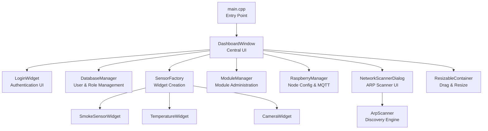
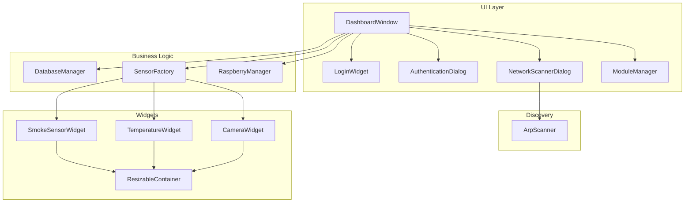
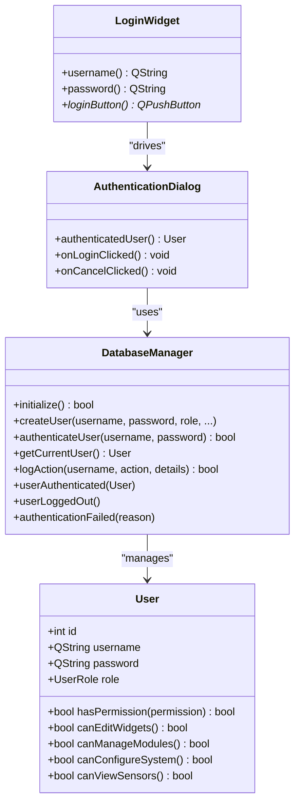
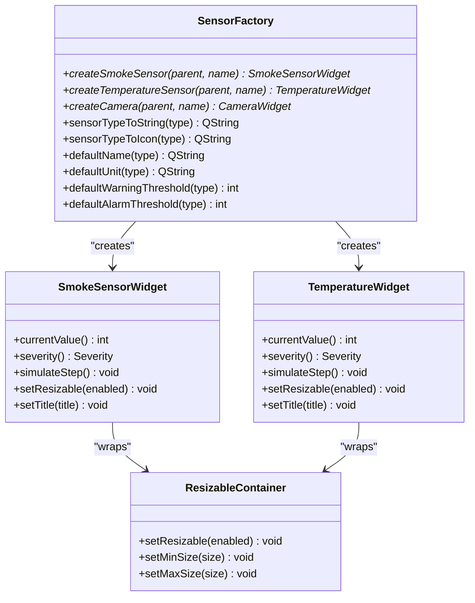
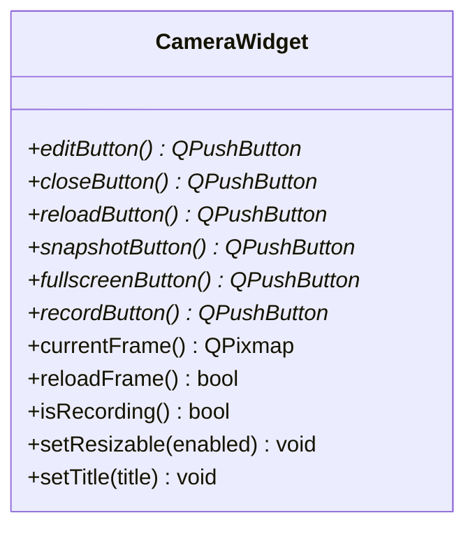
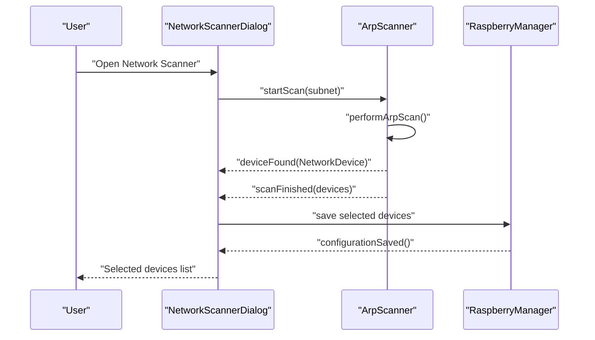
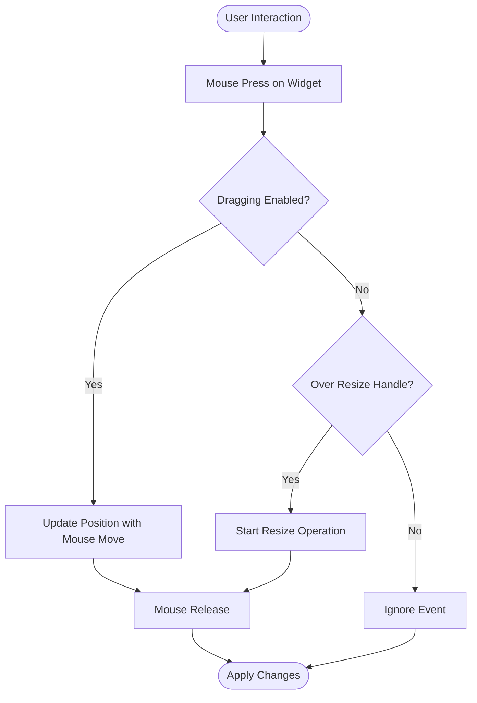
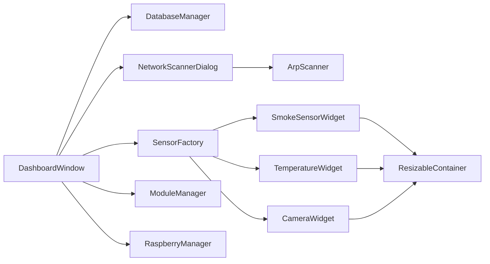

# Project Overview

<cite>
**Referenced Files in This Document**
- [main.cpp](file://main.cpp)
- [dashboardwindow.h](file://dashboardwindow.h)
- [loginwidget.h](file://loginwidget.h)
- [authenticationdialog.h](file://authenticationdialog.h)
- [databasemanager.h](file://databasemanager.h)
- [sensorfactory.h](file://sensorfactory.h)
- [smokesensorwidget.h](file://smokesensorwidget.h)
- [temperaturewidget.h](file://temperaturewidget.h)
- [camerawidget.h](file://camerawidget.h)
- [modulemanager.h](file://modulemanager.h)
- [raspberrymanager.h](file://raspberrymanager.h)
- [networkscannerdialog.h](file://networkscannerdialog.h)
- [arpscanner.h](file://arpscanner.h)
- [resizablehelper.h](file://resizablehelper.h)
</cite>

## Table of Contents
1. [Introduction](#introduction)
2. [Project Structure](#project-structure)
3. [Core Components](#core-components)
4. [Architecture Overview](#architecture-overview)
5. [Detailed Component Analysis](#detailed-component-analysis)
6. [Dependency Analysis](#dependency-analysis)
7. [Performance Considerations](#performance-considerations)
8. [Troubleshooting Guide](#troubleshooting-guide)
9. [Conclusion](#conclusion)

## Introduction
SurveillanceQT is a real-time environmental monitoring and security surveillance system designed for deployment across distributed Raspberry Pi sensor networks. Built with the Qt framework, it provides a modern desktop interface for managing and visualizing sensor data, camera feeds, and network-connected modules. The system emphasizes multi-level user authentication, dynamic widget-based dashboards, and network discovery capabilities to support scalable, embedded deployments.

Key features include:
- Multi-level user authentication with role-based permissions
- Real-time sensor monitoring widgets (e.g., smoke and temperature)
- Camera surveillance widget with recording and snapshot capabilities
- Network discovery via ARP scanning and subnet ping sweeps
- Drag-and-drop and resizeable widget system for flexible dashboard layouts

Target audience:
- Embedded developers integrating Qt with Raspberry Pi sensor nodes
- Security and facility managers requiring centralized monitoring
- System integrators building distributed IoT surveillance setups

System requirements:
- Desktop environment with Qt 5.x or Qt 6.x runtime
- SQLite backend for local user and audit logging
- Optional MQTT broker configuration for sensor telemetry distribution
- Raspberry Pi nodes exposing sensor topics and camera streams

## Project Structure
At a high level, the application initializes a main window and transitions into a dashboard that hosts multiple widgets and management dialogs. The dashboard orchestrates authentication, sensor widgets, camera feeds, and administrative modules. Supporting subsystems handle database-backed user roles, network scanning, and Raspberry Pi node configuration.

**Diagram sources**
- [main.cpp:1-15](file://main.cpp#L1-L15)
- [dashboardwindow.h:19-99](file://dashboardwindow.h#L19-L99)
- [loginwidget.h:8-22](file://loginwidget.h#L8-L22)
- [databasemanager.h:34-88](file://databasemanager.h#L34-L88)
- [sensorfactory.h:28-41](file://sensorfactory.h#L28-L41)
- [smokesensorwidget.h:10-53](file://smokesensorwidget.h#L10-L53)
- [temperaturewidget.h:11-54](file://temperaturewidget.h#L11-L54)
- [camerawidget.h:9-40](file://camerawidget.h#L9-L40)
- [modulemanager.h:18-52](file://modulemanager.h#L18-L52)
- [raspberrymanager.h:63-107](file://raspberrymanager.h#L63-L107)
- [networkscannerdialog.h:14-57](file://networkscannerdialog.h#L14-L57)
- [arpscanner.h:31-88](file://arpscanner.h#L31-L88)
- [resizablehelper.h:8-38](file://resizablehelper.h#L8-L38)

**Section sources**
- [main.cpp:1-15](file://main.cpp#L1-L15)
- [dashboardwindow.h:19-99](file://dashboardwindow.h#L19-L99)

## Core Components
- DashboardWindow: Central widget hosting the UI, authentication overlay, sensor grid, and bottom/status bars. It manages drag-and-drop, resizing, and permission-driven visibility of controls.
- LoginWidget and AuthenticationDialog: Provide credential input and role-aware UI updates upon successful authentication.
- DatabaseManager: Manages user lifecycle, hashing, sessions, and emits signals for authentication events.
- SensorFactory: Creates typed sensor widgets (smoke, temperature, camera) with standardized defaults and icons.
- SmokeSensorWidget and TemperatureWidget: Real-time visualization widgets with thresholds, severity states, and simulated data.
- CameraWidget: Frame capture, snapshot, record toggle, and fullscreen presentation.
- ModuleManager: Dialog for adding, editing, ordering, and persisting modules associated with nodes.
- RaspberryManager: Loads/stores node configurations, broker settings, and application-wide settings; emits node status changes.
- NetworkScannerDialog and ArpScanner: Discover devices on the local network, identify known Raspberry Pi devices, and present selectable results.
- ResizableContainer: Adds drag-to-resize behavior to widgets with min/max constraints.

**Section sources**
- [dashboardwindow.h:19-99](file://dashboardwindow.h#L19-L99)
- [loginwidget.h:8-22](file://loginwidget.h#L8-L22)
- [authenticationdialog.h:14-47](file://authenticationdialog.h#L14-L47)
- [databasemanager.h:34-88](file://databasemanager.h#L34-L88)
- [sensorfactory.h:28-41](file://sensorfactory.h#L28-L41)
- [smokesensorwidget.h:10-53](file://smokesensorwidget.h#L10-L53)
- [temperaturewidget.h:11-54](file://temperaturewidget.h#L11-L54)
- [camerawidget.h:9-40](file://camerawidget.h#L9-L40)
- [modulemanager.h:18-52](file://modulemanager.h#L18-L52)
- [raspberrymanager.h:63-107](file://raspberrymanager.h#L63-L107)
- [networkscannerdialog.h:14-57](file://networkscannerdialog.h#L14-L57)
- [arpscanner.h:31-88](file://arpscanner.h#L31-L88)
- [resizablehelper.h:8-38](file://resizablehelper.h#L8-L38)

## Architecture Overview
The system follows a Qt-based desktop architecture with a central dashboard coordinating multiple subsystems:
- UI Layer: QMainWindow-derived windows and dialogs, custom widgets, and overlays
- Business Logic: DatabaseManager for user/session management, SensorFactory for widget creation, and RaspberryManager for node configuration
- Discovery Layer: ArpScanner performs ARP and ping sweeps; NetworkScannerDialog presents results and selections
- Widget Layer: Reusable, resizable, draggable widgets for sensors and cameras

**Diagram sources**
- [dashboardwindow.h:19-99](file://dashboardwindow.h#L19-L99)
- [loginwidget.h:8-22](file://loginwidget.h#L8-L22)
- [authenticationdialog.h:14-47](file://authenticationdialog.h#L14-L47)
- [databasemanager.h:34-88](file://databasemanager.h#L34-L88)
- [sensorfactory.h:28-41](file://sensorfactory.h#L28-L41)
- [smokesensorwidget.h:10-53](file://smokesensorwidget.h#L10-L53)
- [temperaturewidget.h:11-54](file://temperaturewidget.h#L11-L54)
- [camerawidget.h:9-40](file://camerawidget.h#L9-L40)
- [modulemanager.h:18-52](file://modulemanager.h#L18-L52)
- [raspberrymanager.h:63-107](file://raspberrymanager.h#L63-L107)
- [networkscannerdialog.h:14-57](file://networkscannerdialog.h#L14-L57)
- [arpscanner.h:31-88](file://arpscanner.h#L31-L88)
- [resizablehelper.h:8-38](file://resizablehelper.h#L8-L38)

## Detailed Component Analysis

### Authentication and Authorization
- Multi-level user roles (Admin, Operator, Viewer) define granular permissions for editing widgets, managing modules, configuring the system, and viewing sensors.
- DatabaseManager handles user creation, authentication, session tracking, and audit logs. It exposes signals for authentication lifecycle events.
- LoginWidget captures credentials and integrates with AuthenticationDialog to present role-specific UI and actions.

**Diagram sources**
- [databasemanager.h:34-88](file://databasemanager.h#L34-L88)
- [loginwidget.h:8-22](file://loginwidget.h#L8-L22)
- [authenticationdialog.h:14-47](file://authenticationdialog.h#L14-L47)

**Section sources**
- [databasemanager.h:9-32](file://databasemanager.h#L9-L32)
- [databasemanager.h:44-63](file://databasemanager.h#L44-L63)
- [loginwidget.h:8-22](file://loginwidget.h#L8-L22)
- [authenticationdialog.h:14-47](file://authenticationdialog.h#L14-L47)

### Real-Time Sensor Monitoring Widgets
- SensorFactory creates smoke and temperature widgets with default thresholds, units, and icons.
- SmokeSensorWidget and TemperatureWidget maintain value histories, severity states, and expose edit/close controls.
- These widgets integrate with the dashboard’s grid layout and support resizing via ResizableContainer.

**Diagram sources**
- [sensorfactory.h:28-41](file://sensorfactory.h#L28-L41)
- [smokesensorwidget.h:10-53](file://smokesensorwidget.h#L10-L53)
- [temperaturewidget.h:11-54](file://temperaturewidget.h#L11-L54)
- [resizablehelper.h:8-38](file://resizablehelper.h#L8-L38)

**Section sources**
- [sensorfactory.h:10-41](file://sensorfactory.h#L10-L41)
- [smokesensorwidget.h:14-53](file://smokesensorwidget.h#L14-L53)
- [temperaturewidget.h:15-54](file://temperaturewidget.h#L15-L54)
- [resizablehelper.h:8-38](file://resizablehelper.h#L8-L38)

### Camera Surveillance Widget
- CameraWidget encapsulates image display, snapshot capture, recording toggle, and fullscreen mode.
- It exposes buttons for editing, closing, reloading frames, taking snapshots, toggling recording, and entering fullscreen.

**Diagram sources**
- [camerawidget.h:9-40](file://camerawidget.h#L9-L40)

**Section sources**
- [camerawidget.h:9-40](file://camerawidget.h#L9-L40)

### Network Discovery and Module Management
- NetworkScannerDialog coordinates scanning and selection of devices, leveraging ArpScanner for ARP and ping sweeps.
- ArpScanner identifies known Raspberry Pi devices, resolves hostnames, and emits discovered devices and progress signals.
- ModuleManager provides a dialog for managing modules associated with nodes, including add/edit/delete and reordering.

**Diagram sources**
- [networkscannerdialog.h:14-57](file://networkscannerdialog.h#L14-L57)
- [arpscanner.h:31-88](file://arpscanner.h#L31-L88)
- [raspberrymanager.h:63-107](file://raspberrymanager.h#L63-L107)

**Section sources**
- [networkscannerdialog.h:14-57](file://networkscannerdialog.h#L14-L57)
- [arpscanner.h:31-88](file://arpscanner.h#L31-L88)
- [raspberrymanager.h:63-107](file://raspberrymanager.h#L63-L107)

### Drag-and-Drop Widget System
- DashboardWindow manages absolute-positioned containers for dynamic sensors, enabling drag gestures and overlay lock during unauthenticated sessions.
- ResizableContainer adds interactive resize handles with min/max bounds, while DashboardWindow wires mouse events for dragging and resizing.

**Diagram sources**
- [dashboardwindow.h:26-32](file://dashboardwindow.h#L26-L32)
- [resizablehelper.h:18-37](file://resizablehelper.h#L18-L37)

**Section sources**
- [dashboardwindow.h:26-66](file://dashboardwindow.h#L26-L66)
- [resizablehelper.h:18-37](file://resizablehelper.h#L18-L37)

## Dependency Analysis
The dashboard depends on multiple subsystems for authentication, sensor creation, discovery, and configuration. The following diagram outlines primary dependencies among core classes.

**Diagram sources**
- [dashboardwindow.h:19-99](file://dashboardwindow.h#L19-L99)
- [databasemanager.h:34-88](file://databasemanager.h#L34-L88)
- [sensorfactory.h:28-41](file://sensorfactory.h#L28-L41)
- [networkscannerdialog.h:14-57](file://networkscannerdialog.h#L14-L57)
- [arpscanner.h:31-88](file://arpscanner.h#L31-L88)
- [modulemanager.h:18-52](file://modulemanager.h#L18-L52)
- [raspberrymanager.h:63-107](file://raspberrymanager.h#L63-L107)
- [smokesensorwidget.h:10-53](file://smokesensorwidget.h#L10-L53)
- [temperaturewidget.h:11-54](file://temperaturewidget.h#L11-L54)
- [camerawidget.h:9-40](file://camerawidget.h#L9-L40)
- [resizablehelper.h:8-38](file://resizablehelper.h#L8-L38)

**Section sources**
- [dashboardwindow.h:19-99](file://dashboardwindow.h#L19-L99)
- [sensorfactory.h:28-41](file://sensorfactory.h#L28-L41)
- [arpscanner.h:31-88](file://arpscanner.h#L31-L88)

## Performance Considerations
- Widget rendering: Keep widget update intervals reasonable to avoid excessive repaints; throttle timer-based updates for sensor charts.
- Network scanning: Limit scan scope to known subnets and cap concurrent ping operations to reduce latency and resource usage.
- Database operations: Batch writes for audit logs and user sessions; ensure indexing on frequently queried fields.
- Drag-and-drop: Debounce mouse move events during drag to minimize layout recalculations.
- Camera feeds: Use efficient pixmap updates and disable unnecessary UI decorations during fullscreen playback.

## Troubleshooting Guide
- Authentication failures: Verify user credentials and role permissions; check database initialization and hashed passwords.
- Widget visibility issues: Confirm user role allows editing widgets; ensure lock overlay is cleared after login.
- Network discovery errors: Validate subnet range and firewall rules; confirm ARP and ping utilities are accessible.
- Module persistence: Ensure JSON configuration files are readable/writable and paths are correct.
- Sensor thresholds: Confirm threshold values are set appropriately for each sensor type to avoid false positives.

**Section sources**
- [databasemanager.h:72-77](file://databasemanager.h#L72-L77)
- [dashboardwindow.h:62-66](file://dashboardwindow.h#L62-L66)
- [arpscanner.h:53-59](file://arpscanner.h#L53-L59)
- [raspberrymanager.h:69-70](file://raspberrymanager.h#L69-L70)

## Conclusion
SurveillanceQT delivers a robust, Qt-based solution for real-time environmental monitoring and security surveillance across distributed Raspberry Pi networks. Its modular architecture, role-based access control, and flexible widget system enable scalable deployments for diverse operational needs. Developers can extend sensor types, integrate new discovery mechanisms, and tailor the dashboard to specialized use cases while maintaining a responsive and secure user experience.