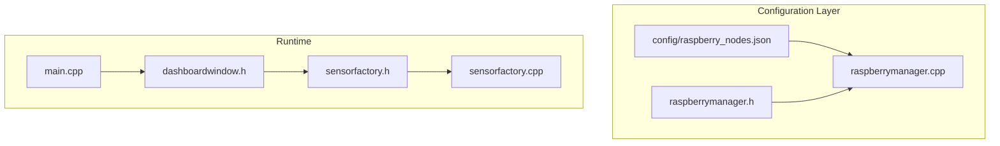
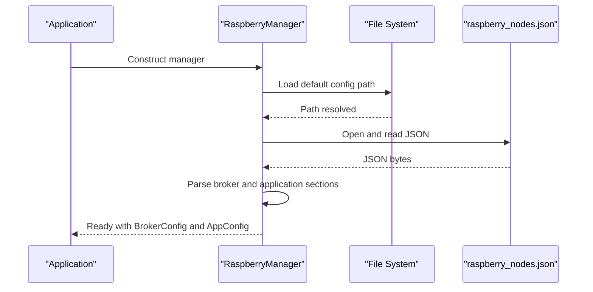
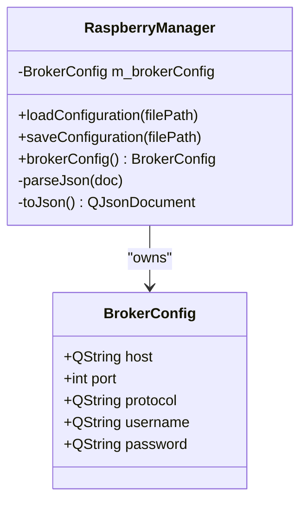
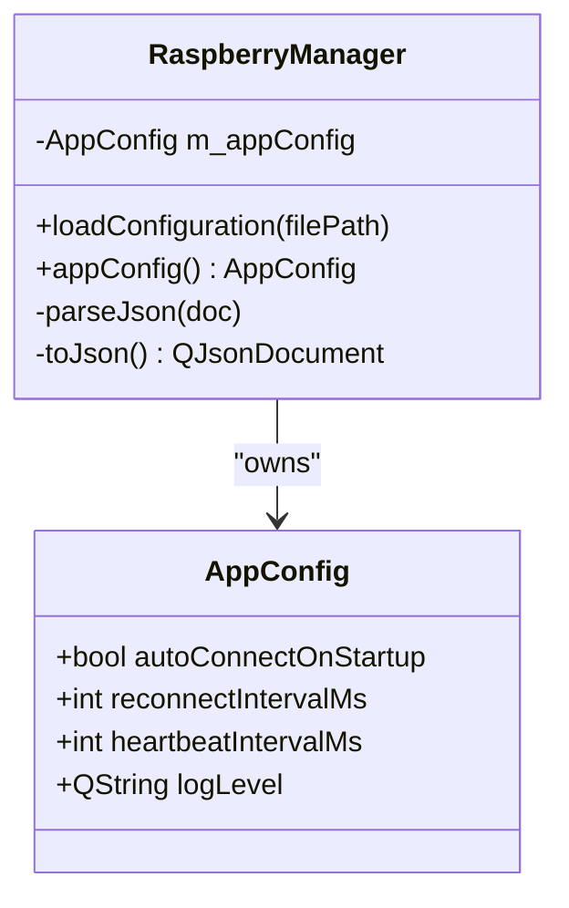
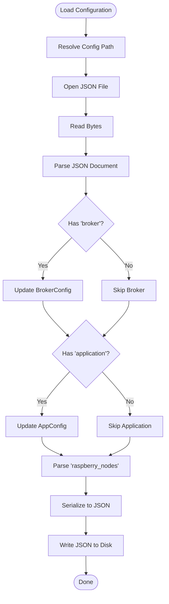
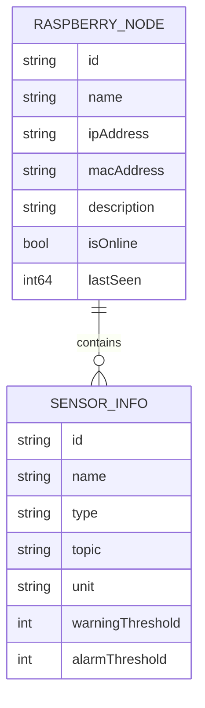
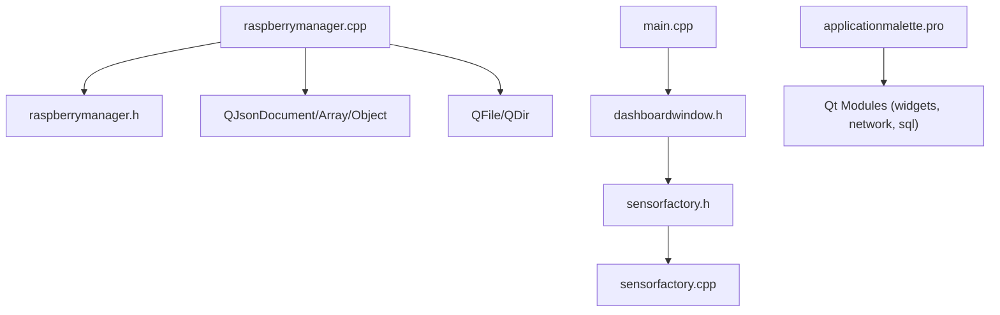

# MQTT Broker Management

<cite>
**Referenced Files in This Document**
- [raspberrymanager.h](file://raspberrymanager.h)
- [raspberrymanager.cpp](file://raspberrymanager.cpp)
- [config/raspberry_nodes.json](file://config/raspberry_nodes.json)
- [main.cpp](file://main.cpp)
- [dashboardwindow.h](file://dashboardwindow.h)
- [sensorfactory.h](file://sensorfactory.h)
- [sensorfactory.cpp](file://sensorfactory.cpp)
- [applicationmalette.pro](file://applicationmalette.pro)
</cite>

## Table of Contents
1. [Introduction](#introduction)
2. [Project Structure](#project-structure)
3. [Core Components](#core-components)
4. [Architecture Overview](#architecture-overview)
5. [Detailed Component Analysis](#detailed-component-analysis)
6. [Dependency Analysis](#dependency-analysis)
7. [Performance Considerations](#performance-considerations)
8. [Troubleshooting Guide](#troubleshooting-guide)
9. [Conclusion](#conclusion)
10. [Appendices](#appendices)

## Introduction
This document explains MQTT broker management within the Raspberry Pi network monitoring system. It focuses on the BrokerConfig structure, configuration loading and saving, connection management parameters, and how topics are organized for sensor data. The system supports configurable broker host, port, protocol, and optional credentials, along with application-level connection management settings such as auto-connect on startup, reconnection intervals, and heartbeat intervals. While the current implementation centralizes configuration and exposes connection parameters, the actual MQTT client integration (e.g., QMQTT usage) is not present in the provided sources and would need to be implemented separately to establish real MQTT connections.

## Project Structure
The MQTT broker management is primarily handled by the RaspberryManager class, which reads and writes configuration files containing broker and application settings. Sensor definitions include MQTT topic fields that define how data is published/subscribed per device.

**Diagram sources**
- [config/raspberry_nodes.json:1-122](file://config/raspberry_nodes.json#L1-L122)
- [raspberrymanager.h:48-61](file://raspberrymanager.h#L48-L61)
- [raspberrymanager.cpp:11-22](file://raspberrymanager.cpp#L11-L22)
- [main.cpp:1-15](file://main.cpp#L1-L15)
- [dashboardwindow.h:1-99](file://dashboardwindow.h#L1-L99)
- [sensorfactory.h:1-41](file://sensorfactory.h#L1-L41)
- [sensorfactory.cpp:1-103](file://sensorfactory.cpp#L1-L103)

**Section sources**
- [config/raspberry_nodes.json:1-122](file://config/raspberry_nodes.json#L1-L122)
- [raspberrymanager.h:48-61](file://raspberrymanager.h#L48-L61)
- [raspberrymanager.cpp:11-22](file://raspberrymanager.cpp#L11-L22)
- [main.cpp:1-15](file://main.cpp#L1-L15)
- [dashboardwindow.h:1-99](file://dashboardwindow.h#L1-L99)
- [sensorfactory.h:1-41](file://sensorfactory.h#L1-L41)
- [sensorfactory.cpp:1-103](file://sensorfactory.cpp#L1-L103)

## Core Components
- BrokerConfig: Holds broker endpoint and credential settings used by the system.
- AppConfig: Holds application-level connection and logging settings.
- RaspberryManager: Loads/saves configuration, parses broker and application settings, and manages node definitions.

Key responsibilities:
- BrokerConfig fields: host, port, protocol, username, password.
- Application settings: autoConnectOnStartup, reconnectIntervalMs, heartbeatIntervalMs, logLevel.
- Configuration persistence via JSON with dedicated "broker" and "application" sections.

**Section sources**
- [raspberrymanager.h:48-61](file://raspberrymanager.h#L48-L61)
- [raspberrymanager.cpp:11-22](file://raspberrymanager.cpp#L11-L22)
- [raspberrymanager.cpp:181-209](file://raspberrymanager.cpp#L181-L209)
- [config/raspberry_nodes.json:108-120](file://config/raspberry_nodes.json#L108-L120)

## Architecture Overview
The system loads configuration at startup, exposing broker and application settings to the rest of the application. Sensor definitions include topic fields that indicate how messages are structured for publishing and subscribing.

**Diagram sources**
- [raspberrymanager.cpp:24-52](file://raspberrymanager.cpp#L24-L52)
- [raspberrymanager.cpp:181-209](file://raspberrymanager.cpp#L181-L209)
- [config/raspberry_nodes.json:1-122](file://config/raspberry_nodes.json#L1-L122)

## Detailed Component Analysis

### BrokerConfig Structure
BrokerConfig encapsulates the MQTT broker endpoint and optional credentials. It is populated either by defaults in the constructor or overridden by values from the configuration file.

**Diagram sources**
- [raspberrymanager.h:48-54](file://raspberrymanager.h#L48-L54)
- [raspberrymanager.cpp:11-22](file://raspberrymanager.cpp#L11-L22)
- [raspberrymanager.cpp:100-105](file://raspberrymanager.cpp#L100-L105)

**Section sources**
- [raspberrymanager.h:48-54](file://raspberrymanager.h#L48-L54)
- [raspberrymanager.cpp:11-22](file://raspberrymanager.cpp#L11-L22)
- [raspberrymanager.cpp:181-192](file://raspberrymanager.cpp#L181-L192)

### Application Configuration and Connection Management
The application configuration controls runtime behavior related to connectivity and logging. These settings are loaded from the "application" section of the configuration file.

**Diagram sources**
- [raspberrymanager.h:56-61](file://raspberrymanager.h#L56-L61)
- [raspberrymanager.cpp:11-22](file://raspberrymanager.cpp#L11-L22)
- [raspberrymanager.cpp:194-200](file://raspberrymanager.cpp#L194-L200)

**Section sources**
- [raspberrymanager.h:56-61](file://raspberrymanager.h#L56-L61)
- [raspberrymanager.cpp:11-22](file://raspberrymanager.cpp#L11-L22)
- [raspberrymanager.cpp:194-200](file://raspberrymanager.cpp#L194-L200)
- [config/raspberry_nodes.json:115-120](file://config/raspberry_nodes.json#L115-L120)

### Configuration Loading and Saving
RaspberryManager handles JSON configuration parsing and serialization. It reads the "broker" and "application" sections and also manages the "raspberry_nodes" array.

**Diagram sources**
- [raspberrymanager.cpp:24-52](file://raspberrymanager.cpp#L24-L52)
- [raspberrymanager.cpp:181-237](file://raspberrymanager.cpp#L181-L237)
- [config/raspberry_nodes.json:1-122](file://config/raspberry_nodes.json#L1-L122)

**Section sources**
- [raspberrymanager.cpp:24-52](file://raspberrymanager.cpp#L24-L52)
- [raspberrymanager.cpp:181-237](file://raspberrymanager.cpp#L181-L237)
- [config/raspberry_nodes.json:1-122](file://config/raspberry_nodes.json#L1-L122)

### Topic Management for Sensors
Each sensor definition includes a topic field indicating the MQTT topic used for publishing or subscribing. The configuration file demonstrates hierarchical topic structures per Raspberry Pi node.

**Diagram sources**
- [config/raspberry_nodes.json:6-107](file://config/raspberry_nodes.json#L6-L107)
- [sensorfactory.h:20-26](file://sensorfactory.h#L20-L26)

**Section sources**
- [config/raspberry_nodes.json:6-107](file://config/raspberry_nodes.json#L6-L107)
- [sensorfactory.h:20-26](file://sensorfactory.h#L20-L26)

## Dependency Analysis
The application links against Qt widgets, network, and SQL modules. The RaspberryManager depends on JSON parsing and file I/O to manage configuration.

**Diagram sources**
- [applicationmalette.pro:1-47](file://applicationmalette.pro#L1-L47)
- [raspberrymanager.cpp:1-10](file://raspberrymanager.cpp#L1-L10)
- [main.cpp:1-15](file://main.cpp#L1-L15)
- [dashboardwindow.h:1-99](file://dashboardwindow.h#L1-L99)
- [sensorfactory.h:1-41](file://sensorfactory.h#L1-L41)
- [sensorfactory.cpp:1-103](file://sensorfactory.cpp#L1-L103)

**Section sources**
- [applicationmalette.pro:1-47](file://applicationmalette.pro#L1-L47)
- [raspberrymanager.cpp:1-10](file://raspberrymanager.cpp#L1-L10)
- [main.cpp:1-15](file://main.cpp#L1-L15)
- [dashboardwindow.h:1-99](file://dashboardwindow.h#L1-L99)
- [sensorfactory.h:1-41](file://sensorfactory.h#L1-L41)
- [sensorfactory.cpp:1-103](file://sensorfactory.cpp#L1-L103)

## Performance Considerations
- Reconnection interval: The default 5 seconds balances responsiveness with resource usage; adjust based on network stability.
- Heartbeat interval: The default 30 seconds provides periodic liveness checks; tune for monitoring latency requirements.
- JSON parsing: Parsing occurs during initialization; keep configuration files minimal and avoid unnecessary nested structures.
- Topic granularity: Hierarchical topics improve filtering but increase payload size; consider compact topic naming for high-frequency telemetry.

[No sources needed since this section provides general guidance]

## Troubleshooting Guide
Common issues and resolutions:
- Configuration file not found: Verify the path resolution and file existence before loading.
- Invalid JSON configuration: Ensure the JSON is well-formed and contains required sections ("broker", "application", "raspberry_nodes").
- Broker connectivity: Confirm host, port, and protocol match the broker settings. If authentication is required, populate username and password fields.
- Auto-connect behavior: Enable autoConnectOnStartup to automatically attempt connection on startup; monitor reconnection attempts using reconnectIntervalMs.
- Logging: Adjust logLevel to capture more verbose logs for diagnostics.

**Section sources**
- [raspberrymanager.cpp:24-52](file://raspberrymanager.cpp#L24-L52)
- [raspberrymanager.cpp:181-209](file://raspberrymanager.cpp#L181-L209)
- [config/raspberry_nodes.json:108-120](file://config/raspberry_nodes.json#L108-L120)

## Conclusion
The system provides a robust configuration framework for MQTT broker settings and application-level connection parameters. While the configuration model supports broker host, port, protocol, and credentials, plus connection management settings, the actual MQTT client integration (e.g., connecting to the broker and managing subscriptions/publishing) is not present in the provided sources. To complete the MQTT integration, implement an MQTT client library (such as QMQTT) and wire it to the RaspberryManager’s configuration to establish connections, handle reconnections, and publish/subscribe to sensor topics.

[No sources needed since this section summarizes without analyzing specific files]

## Appendices

### Configuration Examples
- Broker section: Define host, port, protocol, and optional username/password.
- Application section: Configure autoConnectOnStartup, reconnectIntervalMs, heartbeatIntervalMs, and logLevel.
- Sensor section: Each sensor includes a topic field indicating the MQTT topic for that sensor.

**Section sources**
- [config/raspberry_nodes.json:108-120](file://config/raspberry_nodes.json#L108-L120)
- [config/raspberry_nodes.json:13-92](file://config/raspberry_nodes.json#L13-L92)

### Best Practices for Production Deployments
- Use TLS-enabled brokers and secure credentials; configure protocol accordingly.
- Set heartbeat and reconnection intervals appropriate for network conditions.
- Monitor logLevel during incidents and reduce verbosity under normal operation.
- Keep configuration files versioned and validated before deployment.

[No sources needed since this section provides general guidance]