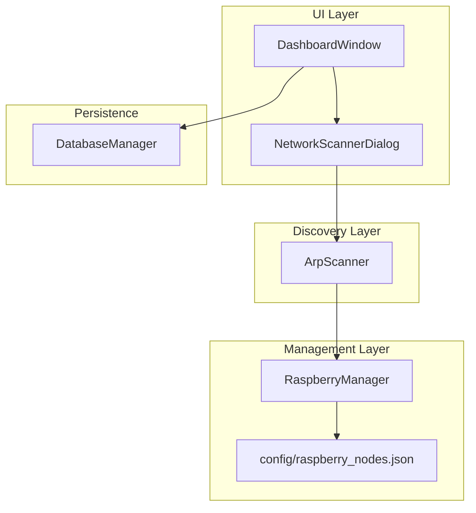
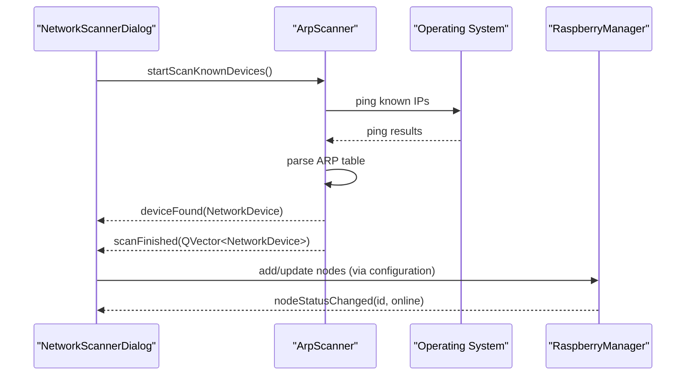
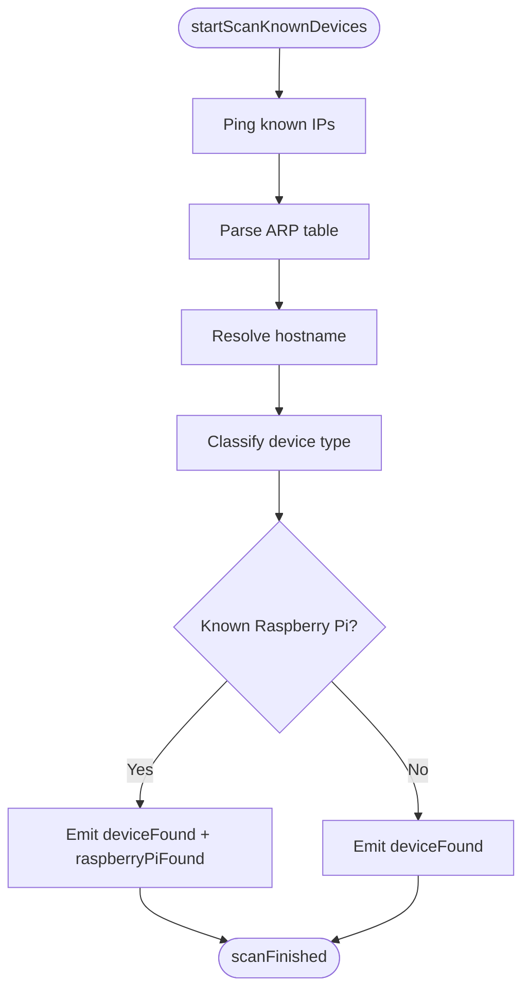
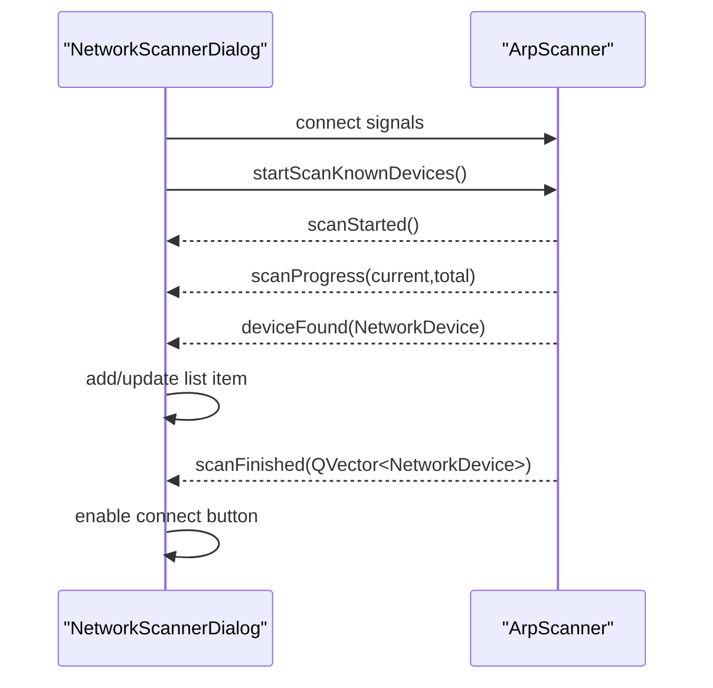
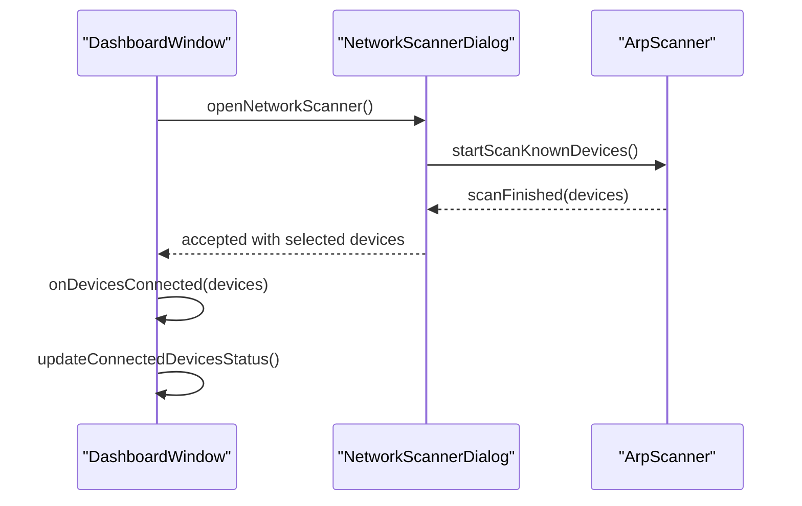
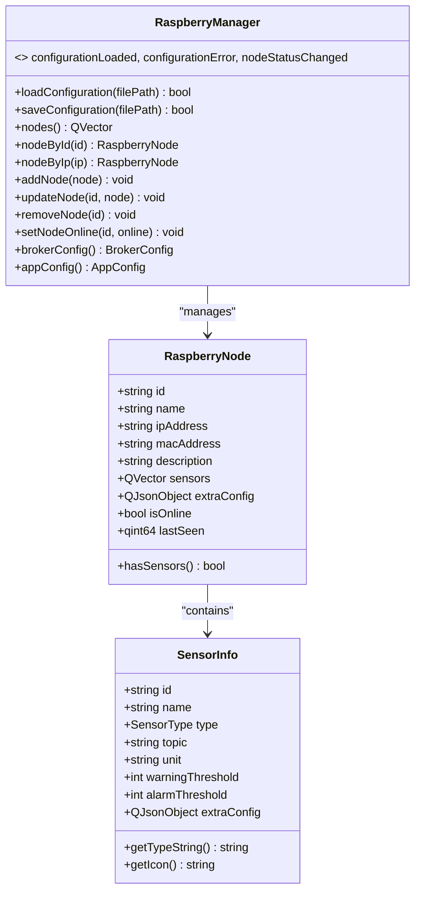
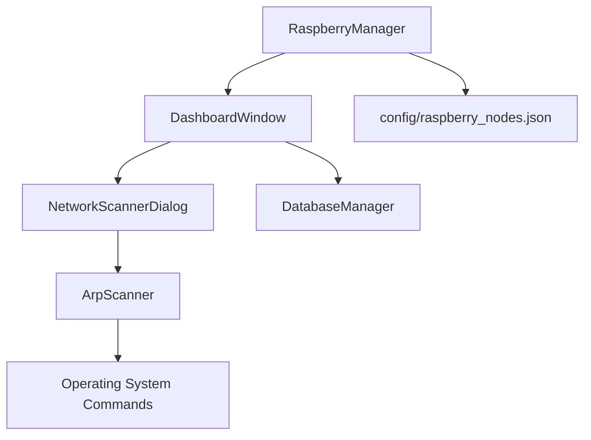

# Network Discovery Integration

<cite>
**Referenced Files in This Document**
- [arpscanner.h](file://arpscanner.h)
- [arpscanner.cpp](file://arpscanner.cpp)
- [networkscannerdialog.h](file://networkscannerdialog.h)
- [networkscannerdialog.cpp](file://networkscannerdialog.cpp)
- [dashboardwindow.h](file://dashboardwindow.h)
- [dashboardwindow.cpp](file://dashboardwindow.cpp)
- [raspberrymanager.h](file://raspberrymanager.h)
- [raspberrymanager.cpp](file://raspberrymanager.cpp)
- [config/raspberry_nodes.json](file://config/raspberry_nodes.json)
- [databasemanager.h](file://databasemanager.h)
- [databasemanager.cpp](file://databasemanager.cpp)
</cite>

## Table of Contents
1. [Introduction](#introduction)
2. [Project Structure](#project-structure)
3. [Core Components](#core-components)
4. [Architecture Overview](#architecture-overview)
5. [Detailed Component Analysis](#detailed-component-analysis)
6. [Dependency Analysis](#dependency-analysis)
7. [Performance Considerations](#performance-considerations)
8. [Troubleshooting Guide](#troubleshooting-guide)
9. [Conclusion](#conclusion)

## Introduction
This document explains how the network discovery system integrates with Raspberry Pi node management. It focuses on how ArpScanner performs automatic discovery of network devices, classifies them, identifies known Raspberry Pi devices, and emits signals consumed by the UI and management layers. It also documents the real-time topology mapping capabilities, automatic node registration via configuration, and synchronization between network scans and node management. Finally, it covers configuration options, filtering criteria, and troubleshooting steps for discovery failures.

## Project Structure
The discovery and management features span several modules:
- ArpScanner: performs ARP and ping sweeps, parses ARP tables, resolves hostnames, classifies devices, and identifies known Raspberry Pi devices.
- NetworkScannerDialog: provides a user interface to initiate scans, display results, and select devices for connection.
- DashboardWindow: orchestrates UI features, opens the scanner, displays network status, and updates connected device counts.
- RaspberryManager: manages persistent node configuration, loads/stores nodes, and exposes node status signals.
- Configuration: defines known Raspberry Pi nodes and broker/application settings.
- DatabaseManager: handles authentication and permissions, indirectly supporting secure access to discovery features.

**Diagram sources**
- [dashboardwindow.cpp:681-728](file://dashboardwindow.cpp#L681-L728)
- [networkscannerdialog.cpp:16-45](file://networkscannerdialog.cpp#L16-L45)
- [arpscanner.cpp:108-131](file://arpscanner.cpp#L108-L131)
- [raspberrymanager.cpp:24-75](file://raspberrymanager.cpp#L24-L75)
- [config/raspberry_nodes.json:1-122](file://config/raspberry_nodes.json#L1-L122)
- [databasemanager.cpp:21-65](file://databasemanager.cpp#L21-L65)

**Section sources**
- [arpscanner.h:31-87](file://arpscanner.h#L31-L87)
- [arpscanner.cpp:83-106](file://arpscanner.cpp#L83-L106)
- [networkscannerdialog.h:14-56](file://networkscannerdialog.h#L14-L56)
- [networkscannerdialog.cpp:16-45](file://networkscannerdialog.cpp#L16-L45)
- [dashboardwindow.h:19-98](file://dashboardwindow.h#L19-L98)
- [dashboardwindow.cpp:668-728](file://dashboardwindow.cpp#L668-L728)
- [raspberrymanager.h:63-106](file://raspberrymanager.h#L63-L106)
- [raspberrymanager.cpp:11-22](file://raspberrymanager.cpp#L11-L22)
- [config/raspberry_nodes.json:1-122](file://config/raspberry_nodes.json#L1-L122)
- [databasemanager.h:34-87](file://databasemanager.h#L34-L87)
- [databasemanager.cpp:21-65](file://databasemanager.cpp#L21-L65)

## Core Components
- ArpScanner
  - Scans a subnet or known devices, pings hosts, parses ARP tables, resolves hostnames, classifies devices, and identifies known Raspberry Pi devices.
  - Emits signals for scan lifecycle and discovered devices.
- NetworkScannerDialog
  - Provides UI controls to start/stop scans, displays discovered devices, and allows selection of devices to connect.
- DashboardWindow
  - Integrates network scanning into the main UI, displays local IP/subnet, and updates status after device connections.
- RaspberryManager
  - Manages persistent node configuration, loads/stores nodes, and exposes node status signals for UI updates.
- Configuration
  - Defines known Raspberry Pi nodes, broker settings, and application configuration.

**Section sources**
- [arpscanner.h:31-87](file://arpscanner.h#L31-L87)
- [arpscanner.cpp:108-196](file://arpscanner.cpp#L108-L196)
- [networkscannerdialog.h:14-56](file://networkscannerdialog.h#L14-L56)
- [networkscannerdialog.cpp:198-246](file://networkscannerdialog.cpp#L198-L246)
- [dashboardwindow.h:19-98](file://dashboardwindow.h#L19-L98)
- [dashboardwindow.cpp:668-728](file://dashboardwindow.cpp#L668-L728)
- [raspberrymanager.h:63-106](file://raspberrymanager.h#L63-L106)
- [raspberrymanager.cpp:24-75](file://raspberrymanager.cpp#L24-L75)
- [config/raspberry_nodes.json:1-122](file://config/raspberry_nodes.json#L1-L122)

## Architecture Overview
The integration follows a reactive pattern:
- UI triggers ArpScanner to start a scan.
- ArpScanner emits deviceFound and scanFinished signals.
- NetworkScannerDialog updates the UI with discovered devices and selections.
- Selected devices are passed to the management layer for registration and status updates.
- DashboardWindow reflects network status and connected devices.

**Diagram sources**
- [networkscannerdialog.cpp:198-246](file://networkscannerdialog.cpp#L198-L246)
- [arpscanner.cpp:174-196](file://arpscanner.cpp#L174-L196)
- [arpscanner.cpp:323-332](file://arpscanner.cpp#L323-L332)
- [raspberrymanager.cpp:112-150](file://raspberrymanager.cpp#L112-L150)

## Detailed Component Analysis

### ArpScanner: Discovery and Classification
ArpScanner performs:
- Subnet detection and optional targeted scanning of known Raspberry Pi IPs.
- Ping sweeps and targeted pings to determine online hosts.
- ARP table parsing to extract IP/MAC pairs.
- Hostname resolution and device classification based on MAC prefixes, hostnames, and vendor lookup.
- Known Raspberry Pi recognition using a predefined list.

Key behaviors:
- Device classification considers surveillance-related MAC prefixes, hostname keywords, and vendor identification.
- Known Raspberry Pi devices are emitted with specialized signals and metadata.
- RSSI values are randomized for simulated signal strength.

**Diagram sources**
- [arpscanner.cpp:174-196](file://arpscanner.cpp#L174-L196)
- [arpscanner.cpp:323-332](file://arpscanner.cpp#L323-L332)
- [arpscanner.cpp:426-462](file://arpscanner.cpp#L426-L462)
- [arpscanner.cpp:464-517](file://arpscanner.cpp#L464-L517)

**Section sources**
- [arpscanner.h:10-29](file://arpscanner.h#L10-L29)
- [arpscanner.cpp:174-196](file://arpscanner.cpp#L174-L196)
- [arpscanner.cpp:334-384](file://arpscanner.cpp#L334-L384)
- [arpscanner.cpp:417-462](file://arpscanner.cpp#L417-L462)
- [arpscanner.cpp:464-517](file://arpscanner.cpp#L464-L517)

### NetworkScannerDialog: UI Integration and Selection
NetworkScannerDialog:
- Initializes ArpScanner and subscribes to its signals.
- Displays detected devices, maintains selection state, and enables connection actions.
- Updates UI status based on scan progress and results.

Integration points:
- Connects to ArpScanner::deviceFound, ::scanProgress, ::scanFinished, and ::scanError.
- Adds items to the list, toggles check states for surveillance modules, and formats device info.

**Diagram sources**
- [networkscannerdialog.cpp:16-45](file://networkscannerdialog.cpp#L16-L45)
- [networkscannerdialog.cpp:198-246](file://networkscannerdialog.cpp#L198-L246)
- [networkscannerdialog.cpp:248-298](file://networkscannerdialog.cpp#L248-L298)
- [networkscannerdialog.cpp:300-322](file://networkscannerdialog.cpp#L300-L322)

**Section sources**
- [networkscannerdialog.h:14-56](file://networkscannerdialog.h#L14-L56)
- [networkscannerdialog.cpp:16-45](file://networkscannerdialog.cpp#L16-L45)
- [networkscannerdialog.cpp:198-246](file://networkscannerdialog.cpp#L198-L246)
- [networkscannerdialog.cpp:248-298](file://networkscannerdialog.cpp#L248-L298)
- [networkscannerdialog.cpp:300-322](file://networkscannerdialog.cpp#L300-L322)

### DashboardWindow: Real-Time Status and Orchestration
DashboardWindow:
- Displays local IP and subnet in the status bar.
- Opens the NetworkScannerDialog and updates status after device connections.
- Reflects the number of connected devices in the network status label.

**Diagram sources**
- [dashboardwindow.cpp:681-688](file://dashboardwindow.cpp#L681-L688)
- [dashboardwindow.cpp:690-709](file://dashboardwindow.cpp#L690-L709)
- [dashboardwindow.cpp:711-728](file://dashboardwindow.cpp#L711-L728)
- [networkscannerdialog.cpp:198-246](file://networkscannerdialog.cpp#L198-L246)

**Section sources**
- [dashboardwindow.h:19-98](file://dashboardwindow.h#L19-L98)
- [dashboardwindow.cpp:668-728](file://dashboardwindow.cpp#L668-L728)
- [networkscannerdialog.cpp:198-246](file://networkscannerdialog.cpp#L198-L246)

### RaspberryManager: Persistent Node Management
RaspberryManager:
- Loads/stores configuration from JSON, exposing nodes and broker/application settings.
- Provides APIs to add/update/remove nodes and to set node online status.
- Emits nodeStatusChanged for UI synchronization.

**Diagram sources**
- [raspberrymanager.h:34-106](file://raspberrymanager.h#L34-L106)
- [raspberrymanager.cpp:24-75](file://raspberrymanager.cpp#L24-L75)
- [raspberrymanager.cpp:112-150](file://raspberrymanager.cpp#L112-L150)
- [raspberrymanager.cpp:239-273](file://raspberrymanager.cpp#L239-L273)

**Section sources**
- [raspberrymanager.h:34-106](file://raspberrymanager.h#L34-L106)
- [raspberrymanager.cpp:24-75](file://raspberrymanager.cpp#L24-L75)
- [raspberrymanager.cpp:112-150](file://raspberrymanager.cpp#L112-L150)
- [raspberrymanager.cpp:239-273](file://raspberrymanager.cpp#L239-L273)

### Configuration: Known Devices and Application Settings
The configuration file defines:
- Known Raspberry Pi nodes with IP addresses, names, descriptions, and expected types.
- Broker settings (host, port, protocol).
- Application settings (auto-connect, reconnect interval, heartbeat interval, log level).

Integration:
- ArpScanner uses the known list to target scanning and emits detailed info for UI updates.
- RaspberryManager reads/writes this configuration to persist node definitions.

**Section sources**
- [config/raspberry_nodes.json:1-122](file://config/raspberry_nodes.json#L1-L122)
- [arpscanner.cpp:9-18](file://arpscanner.cpp#L9-L18)
- [arpscanner.cpp:198-210](file://arpscanner.cpp#L198-L210)
- [raspberrymanager.cpp:181-209](file://raspberrymanager.cpp#L181-L209)
- [raspberrymanager.cpp:211-237](file://raspberrymanager.cpp#L211-L237)

### Device Classification and Vendor Identification
Classification logic:
- MAC prefix matching against surveillance device prefixes.
- Hostname keyword matching (camera, sensor, temp, smoke, dvr/nvr).
- Vendor lookup for Raspberry Pi and Espressif devices.
- Fallback to generic categories.

Vendor identification:
- Specific MAC prefixes mapped to vendor names for Raspberry Pi and Espressif devices.

**Section sources**
- [arpscanner.cpp:426-462](file://arpscanner.cpp#L426-L462)
- [arpscanner.cpp:464-517](file://arpscanner.cpp#L464-L517)
- [arpscanner.cpp:20-81](file://arpscanner.cpp#L20-L81)

### Real-Time Topology Mapping and Automatic Registration
Real-time mapping:
- NetworkScannerDialog continuously updates the device list as ArpScanner emits deviceFound.
- The UI reflects online/offline status and highlights surveillance modules.

Automatic registration:
- After selection, the system can integrate selected devices with RaspberryManager nodes.
- Node status changes are signaled to the UI for immediate feedback.

**Section sources**
- [networkscannerdialog.cpp:248-298](file://networkscannerdialog.cpp#L248-L298)
- [networkscannerdialog.cpp:386-403](file://networkscannerdialog.cpp#L386-L403)
- [dashboardwindow.cpp:690-709](file://dashboardwindow.cpp#L690-L709)
- [raspberrymanager.cpp:137-150](file://raspberrymanager.cpp#L137-L150)

### Integration Points and Data Exchange Formats
- Signals and slots:
  - ArpScanner emits scanStarted, scanProgress, deviceFound, scanFinished, scanError, raspberryPiFound.
  - NetworkScannerDialog connects to these signals to update UI and selections.
  - RaspberryManager emits nodeStatusChanged for UI synchronization.
- Data structures:
  - NetworkDevice: IP, MAC, hostname, deviceType, description, isOnline, RSSI.
  - KnownRaspberryPi: IP, name, description, expectedType.
  - RaspberryNode: id, name, IP, MAC, description, sensors, extraConfig, isOnline, lastSeen.
  - SensorInfo: id, name, type, topic, unit, thresholds, extraConfig.
- Update mechanisms:
  - UI reacts to ArpScanner signals and updates lists and counters.
  - RaspberryManager updates node status and persists configuration.

**Section sources**
- [arpscanner.h:53-59](file://arpscanner.h#L53-L59)
- [arpscanner.h:10-29](file://arpscanner.h#L10-L29)
- [arpscanner.h:24-29](file://arpscanner.h#L24-L29)
- [raspberrymanager.h:34-46](file://raspberrymanager.h#L34-L46)
- [raspberrymanager.h:20-32](file://raspberrymanager.h#L20-L32)
- [networkscannerdialog.h:23-41](file://networkscannerdialog.h#L23-L41)

## Dependency Analysis
- ArpScanner depends on platform-specific commands (ping/arp) and Qt networking utilities.
- NetworkScannerDialog depends on ArpScanner and UI components.
- DashboardWindow depends on NetworkScannerDialog and displays ArpScanner-derived status.
- RaspberryManager depends on JSON configuration and exposes node management APIs.
- DatabaseManager supports authentication and permissions, enabling secure access to discovery features.

**Diagram sources**
- [arpscanner.cpp:334-342](file://arpscanner.cpp#L334-L342)
- [networkscannerdialog.cpp:16-45](file://networkscannerdialog.cpp#L16-L45)
- [dashboardwindow.cpp:668-679](file://dashboardwindow.cpp#L668-L679)
- [raspberrymanager.cpp:24-75](file://raspberrymanager.cpp#L24-L75)
- [databasemanager.cpp:21-65](file://databasemanager.cpp#L21-L65)

**Section sources**
- [arpscanner.cpp:334-342](file://arpscanner.cpp#L334-L342)
- [networkscannerdialog.cpp:16-45](file://networkscannerdialog.cpp#L16-L45)
- [dashboardwindow.cpp:668-679](file://dashboardwindow.cpp#L668-L679)
- [raspberrymanager.cpp:24-75](file://raspberrymanager.cpp#L24-L75)
- [databasemanager.cpp:21-65](file://databasemanager.cpp#L21-L65)

## Performance Considerations
- ARP and ping operations are asynchronous and batched per host; progress updates are emitted periodically.
- RSSI values are randomized to simulate signal strength; adjust ranges as needed for realistic UI feedback.
- Known device scanning targets a small, fixed set of IPs, reducing overhead compared to full subnet sweeps.
- Consider tuning ping timeouts and ARP command parameters for different environments.

[No sources needed since this section provides general guidance]

## Troubleshooting Guide
Common issues and resolutions:
- Unable to determine local subnet:
  - Ensure the host has a valid IPv4 interface up and running.
  - Verify getLocalSubnet and getLocalIpAddress logic.
- Scan errors:
  - Check ping/arp command availability and permissions.
  - Review scanError signal emissions for specific messages.
- No devices detected:
  - Confirm ARP table accessibility and that hosts are responding to pings.
  - Validate hostname resolution and MAC vendor mappings.
- Known Raspberry Pi not recognized:
  - Verify IP addresses match the known list and expected types.
  - Ensure ping responses trigger the known device emission path.

**Section sources**
- [arpscanner.cpp:281-316](file://arpscanner.cpp#L281-L316)
- [arpscanner.cpp:118-123](file://arpscanner.cpp#L118-L123)
- [arpscanner.cpp:334-342](file://arpscanner.cpp#L334-L342)
- [arpscanner.cpp:240-271](file://arpscanner.cpp#L240-L271)
- [arpscanner.cpp:212-230](file://arpscanner.cpp#L212-L230)

## Conclusion
The integration between ArpScanner and RaspberryManager provides a robust foundation for automatic network discovery and node management. ArpScanner’s classification and vendor identification, combined with NetworkScannerDialog’s UI and DashboardWindow’s orchestration, deliver real-time topology mapping and seamless registration of known devices. Configuration-driven persistence ensures continuity across sessions, while signals enable responsive UI updates and status synchronization.