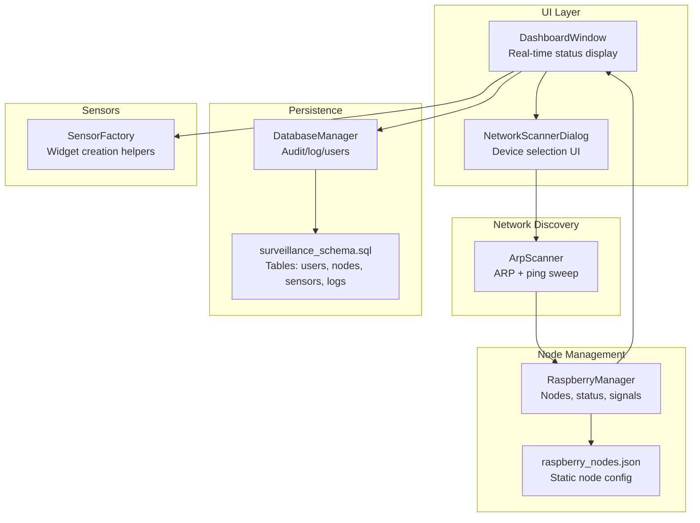
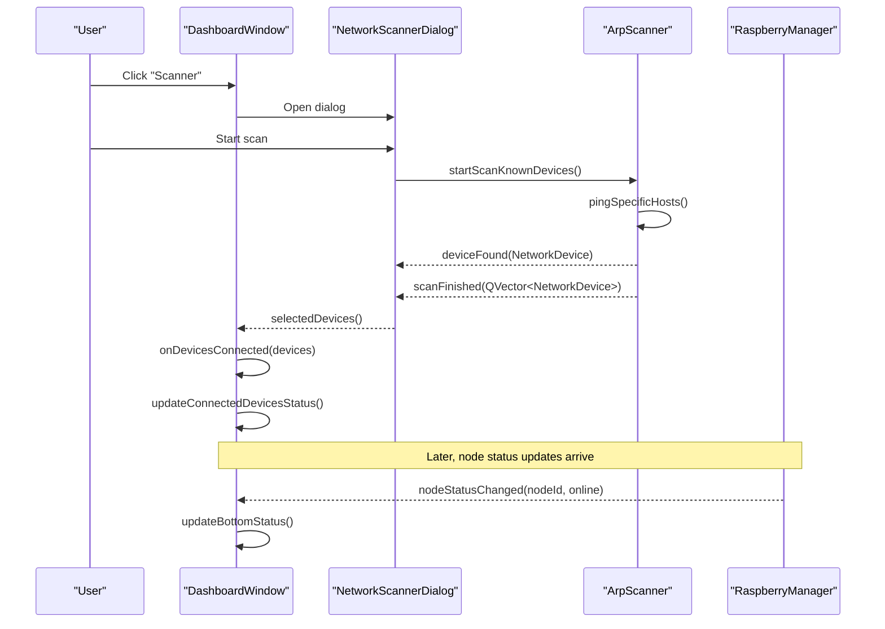
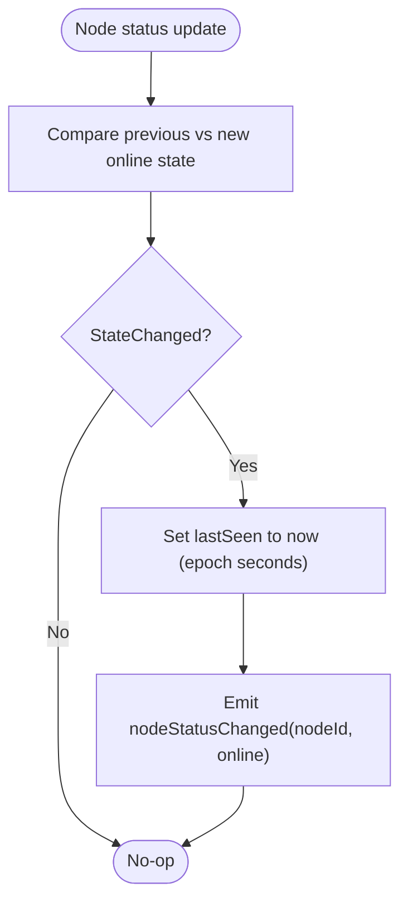
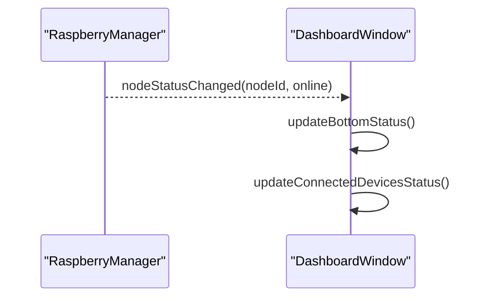
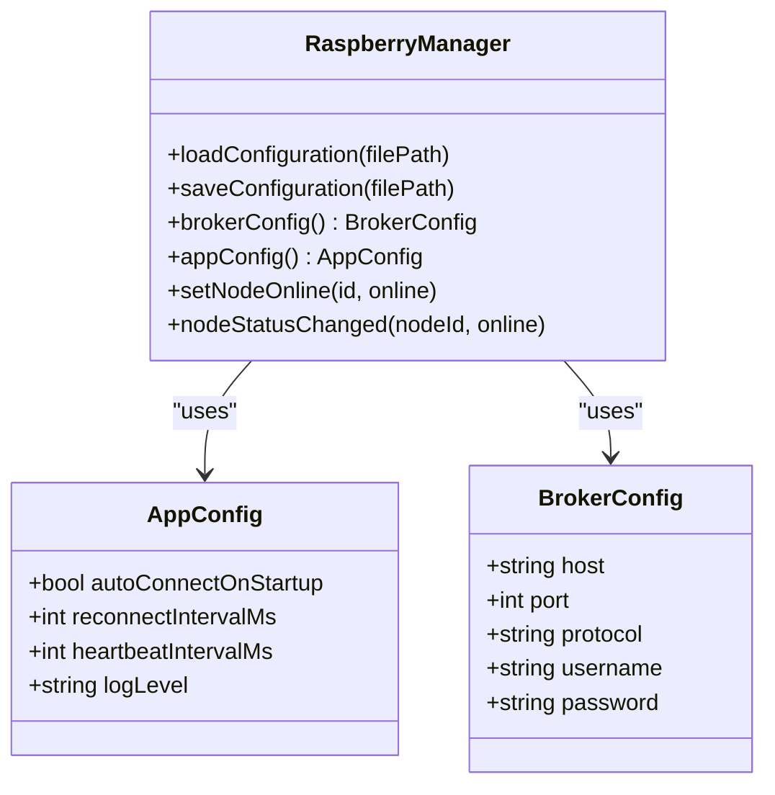
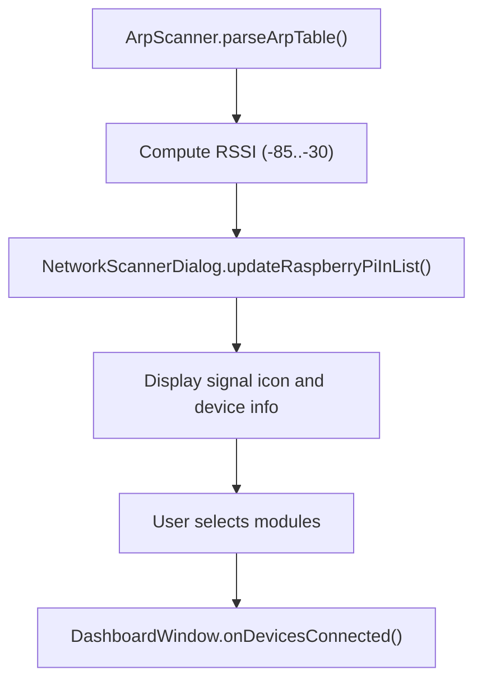
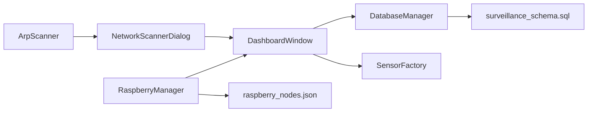
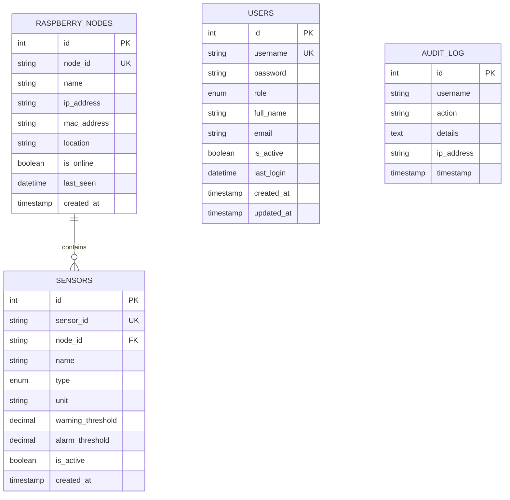

# Network Monitoring and Maintenance

<cite>
**Referenced Files in This Document**
- [dashboardwindow.h](file://dashboardwindow.h)
- [dashboardwindow.cpp](file://dashboardwindow.cpp)
- [arpscanner.h](file://arpscanner.h)
- [arpscanner.cpp](file://arpscanner.cpp)
- [networkscannerdialog.h](file://networkscannerdialog.h)
- [networkscannerdialog.cpp](file://networkscannerdialog.cpp)
- [raspberrymanager.h](file://raspberrymanager.h)
- [raspberrymanager.cpp](file://raspberrymanager.cpp)
- [config/raspberry_nodes.json](file://config/raspberry_nodes.json)
- [databasemanager.h](file://databasemanager.h)
- [database/surveillance_schema.sql](file://database/surveillance_schema.sql)
- [sensorfactory.h](file://sensorfactory.h)
- [sensorfactory.cpp](file://sensorfactory.cpp)
</cite>

## Table of Contents
1. [Introduction](#introduction)
2. [Project Structure](#project-structure)
3. [Core Components](#core-components)
4. [Architecture Overview](#architecture-overview)
5. [Detailed Component Analysis](#detailed-component-analysis)
6. [Dependency Analysis](#dependency-analysis)
7. [Performance Considerations](#performance-considerations)
8. [Troubleshooting Guide](#troubleshooting-guide)
9. [Conclusion](#conclusion)
10. [Appendices](#appendices)

## Introduction
This document describes the network monitoring and maintenance capabilities of the Raspberry Pi sensor network application. It explains how nodes are discovered and tracked, how online/offline status and last seen timestamps are maintained, and how the nodeStatusChanged signal integrates with the dashboard for real-time updates. It also covers fault tolerance, automatic recovery, connection resilience, performance monitoring, latency tracking, bandwidth optimization, maintenance procedures for node cleanup and orphaned device removal, and troubleshooting strategies for connectivity and performance issues.

## Project Structure
The application is organized around a Qt-based desktop interface with modular components for network scanning, node management, and dashboard presentation. Key areas:
- Network discovery and scanning: ArpScanner and NetworkScannerDialog
- Node lifecycle and status: RaspberryManager with node status fields and signals
- Dashboard UI and status display: DashboardWindow
- Database schema and user management: DatabaseManager and surveillance_schema.sql
- Sensor factory and widgets: SensorFactory and related widgets

**Diagram sources**
- [dashboardwindow.h:19-99](file://dashboardwindow.h#L19-L99)
- [dashboardwindow.cpp:668-728](file://dashboardwindow.cpp#L668-L728)
- [arpscanner.h:31-88](file://arpscanner.h#L31-L88)
- [arpscanner.cpp:108-131](file://arpscanner.cpp#L108-L131)
- [networkscannerdialog.h:14-57](file://networkscannerdialog.h#L14-L57)
- [networkscannerdialog.cpp:16-45](file://networkscannerdialog.cpp#L16-L45)
- [raspberrymanager.h:63-107](file://raspberrymanager.h#L63-L107)
- [raspberrymanager.cpp:137-150](file://raspberrymanager.cpp#L137-L150)
- [config/raspberry_nodes.json:1-122](file://config/raspberry_nodes.json#L1-L122)
- [databasemanager.h:34-88](file://databasemanager.h#L34-L88)
- [database/surveillance_schema.sql:1-157](file://database/surveillance_schema.sql#L1-L157)
- [sensorfactory.h:28-41](file://sensorfactory.h#L28-L41)

**Section sources**
- [dashboardwindow.h:19-99](file://dashboardwindow.h#L19-L99)
- [arpscanner.h:31-88](file://arpscanner.h#L31-L88)
- [networkscannerdialog.h:14-57](file://networkscannerdialog.h#L14-L57)
- [raspberrymanager.h:63-107](file://raspberrymanager.h#L63-L107)
- [databasemanager.h:34-88](file://databasemanager.h#L34-L88)
- [database/surveillance_schema.sql:50-116](file://database/surveillance_schema.sql#L50-L116)

## Core Components
- Node status tracking: RaspberryManager maintains per-node isOnline and lastSeen fields and emits nodeStatusChanged when a node’s online state changes.
- Network discovery: ArpScanner performs ARP table parsing and ping sweeps to detect devices, categorizing them and emitting signals for UI updates.
- Dashboard integration: DashboardWindow displays connected modules, updates the bottom status bar, and triggers network scans via NetworkScannerDialog.
- Static configuration: raspberry_nodes.json defines known nodes, topics, thresholds, and broker/application settings.
- Database and audit: DatabaseManager supports user authentication and audit logging; surveillance_schema.sql defines persistent storage for nodes, sensors, and logs.

Key implementation references:
- Node status fields and signal emission: [RaspberryManager::setNodeOnline:137-150](file://raspberrymanager.cpp#L137-L150), [RaspberryNode fields:34-46](file://raspberrymanager.h#L34-L46)
- Status signal definition: [nodeStatusChanged:92-92](file://raspberrymanager.h#L92-L92)
- Dashboard status display and timer: [DashboardWindow::updateBottomStatus:574-614](file://dashboardwindow.cpp#L574-L614), [DashboardWindow::m_statusTimer:83-83](file://dashboardwindow.h#L83-L83)
- Network scanner UI and scan orchestration: [NetworkScannerDialog:16-45](file://networkscannerdialog.cpp#L16-L45), [ArpScanner::startScanKnownDevices:174-196](file://arpscanner.cpp#L174-L196)
- Static node configuration: [raspberry_nodes.json:1-122](file://config/raspberry_nodes.json#L1-L122)

**Section sources**
- [raspberrymanager.cpp:137-150](file://raspberrymanager.cpp#L137-L150)
- [raspberrymanager.h:34-46](file://raspberrymanager.h#L34-L46)
- [raspberrymanager.h:92-92](file://raspberrymanager.h#L92-L92)
- [dashboardwindow.cpp:574-614](file://dashboardwindow.cpp#L574-L614)
- [dashboardwindow.h:83-83](file://dashboardwindow.h#L83-L83)
- [networkscannerdialog.cpp:16-45](file://networkscannerdialog.cpp#L16-L45)
- [arpscanner.cpp:174-196](file://arpscanner.cpp#L174-L196)
- [config/raspberry_nodes.json:1-122](file://config/raspberry_nodes.json#L1-L122)

## Architecture Overview
The system follows a reactive pattern:
- ArpScanner detects devices and emits signals for each discovered device and scan progress.
- NetworkScannerDialog subscribes to ArpScanner signals, builds a selectable list, and returns selected devices.
- DashboardWindow subscribes to NetworkScannerDialog results and updates the bottom status bar with module counts.
- RaspberryManager receives node status updates (e.g., from MQTT or heartbeat logic) and emits nodeStatusChanged to notify observers.
- DashboardWindow connects to nodeStatusChanged to refresh UI and status indicators.

**Diagram sources**
- [dashboardwindow.cpp:681-728](file://dashboardwindow.cpp#L681-L728)
- [networkscannerdialog.cpp:198-246](file://networkscannerdialog.cpp#L198-L246)
- [arpscanner.cpp:174-196](file://arpscanner.cpp#L174-L196)
- [raspberrymanager.h:92-92](file://raspberrymanager.h#L92-L92)

## Detailed Component Analysis

### Node Status Tracking and Heartbeat Monitoring
- Online/offline detection is driven by ArpScanner’s ping sweep and ARP table parsing. Devices are marked isOnline when reachable.
- Last seen timestamps are maintained by RaspberryManager::setNodeOnline, which records the current epoch seconds upon state transitions.
- The nodeStatusChanged signal notifies subscribers when a node’s online state flips, enabling real-time UI updates in the dashboard.

**Diagram sources**
- [raspberrymanager.cpp:137-150](file://raspberrymanager.cpp#L137-L150)
- [raspberrymanager.h:92-92](file://raspberrymanager.h#L92-L92)

**Section sources**
- [arpscanner.cpp:232-279](file://arpscanner.cpp#L232-L279)
- [arpscanner.cpp:334-384](file://arpscanner.cpp#L334-L384)
- [raspberrymanager.cpp:137-150](file://raspberrymanager.cpp#L137-L150)
- [raspberrymanager.h:92-92](file://raspberrymanager.h#L92-L92)

### nodeStatusChanged Signal Integration with Dashboard
- DashboardWindow subscribes to nodeStatusChanged to refresh the bottom status bar and module count indicators.
- The status timer periodically calls updateBottomStatus to aggregate active modules and severity counts.

**Diagram sources**
- [raspberrymanager.h:92-92](file://raspberrymanager.h#L92-L92)
- [dashboardwindow.cpp:574-614](file://dashboardwindow.cpp#L574-L614)
- [dashboardwindow.cpp:711-728](file://dashboardwindow.cpp#L711-L728)

**Section sources**
- [dashboardwindow.cpp:574-614](file://dashboardwindow.cpp#L574-L614)
- [dashboardwindow.cpp:711-728](file://dashboardwindow.cpp#L711-L728)
- [raspberrymanager.h:92-92](file://raspberrymanager.h#L92-L92)

### Fault Tolerance, Automatic Recovery, and Connection Resilience
- Reconnection interval is configurable via AppConfig.reconnectIntervalMs and heartbeat interval via AppConfig.heartbeatIntervalMs.
- The manager initializes default values for broker host/port and protocol, and exposes getters for broker configuration.
- Recovery strategy:
  - Periodic reconnection attempts at reconnectIntervalMs.
  - Heartbeat-driven status updates at heartbeatIntervalMs.
  - Static node configuration ensures known nodes remain discoverable even if transient connectivity issues occur.

**Diagram sources**
- [raspberrymanager.h:48-61](file://raspberrymanager.h#L48-L61)
- [raspberrymanager.h:63-107](file://raspberrymanager.h#L63-L107)
- [raspberrymanager.cpp:11-22](file://raspberrymanager.cpp#L11-L22)

**Section sources**
- [raspberrymanager.cpp:11-22](file://raspberrymanager.cpp#L11-L22)
- [raspberrymanager.h:48-61](file://raspberrymanager.h#L48-L61)
- [config/raspberry_nodes.json:115-121](file://config/raspberry_nodes.json#L115-L121)

### Performance Monitoring, Latency Tracking, and Bandwidth Optimization
- Latency tracking:
  - ArpScanner computes RSSI values for detected devices, enabling basic signal strength feedback in the UI.
  - NetworkScannerDialog displays signal icons and device info; RSSI can be used to infer proximity and potential latency.
- Bandwidth optimization:
  - Static configuration includes camera stream URLs and resolutions; adjust resolution and FPS in the node configuration to balance quality and bandwidth.
  - Heartbeat intervals and reconnect intervals can be tuned to reduce network overhead during idle periods.

**Diagram sources**
- [arpscanner.cpp:334-384](file://arpscanner.cpp#L334-L384)
- [networkscannerdialog.cpp:263-289](file://networkscannerdialog.cpp#L263-L289)
- [dashboardwindow.cpp:690-709](file://dashboardwindow.cpp#L690-L709)

**Section sources**
- [arpscanner.cpp:334-384](file://arpscanner.cpp#L334-L384)
- [networkscannerdialog.cpp:263-289](file://networkscannerdialog.cpp#L263-L289)
- [config/raspberry_nodes.json:42-53](file://config/raspberry_nodes.json#L42-L53)

### Maintenance Procedures: Node Cleanup and Orphaned Device Removal
- Node cleanup:
  - Remove stale nodes from raspberry_nodes.json when hardware is decommissioned.
  - Use DatabaseManager to manage users and audit actions; logs can track maintenance events.
- Orphaned device removal:
  - Periodically run NetworkScannerDialog to re-scan known devices and update the device list.
  - Clear offline devices from the selected list and avoid connecting them until verified.

Operational steps:
- Open NetworkScannerDialog and start a known-device scan.
- Review the list and deselect any offline or unknown devices.
- Proceed to connect only verified modules.

**Section sources**
- [networkscannerdialog.cpp:198-246](file://networkscannerdialog.cpp#L198-L246)
- [networkscannerdialog.cpp:300-330](file://networkscannerdialog.cpp#L300-L330)
- [databasemanager.h:34-88](file://databasemanager.h#L34-L88)
- [database/surveillance_schema.sql:34-47](file://database/surveillance_schema.sql#L34-L47)

### Network Health Assessment
- Use the bottom status bar to monitor active modules and severity counts.
- The dashboard periodically updates status via the status timer; ensure the timer is running to keep the UI responsive.
- Validate network settings:
  - Local IP and subnet detection via ArpScanner.getLocalIpAddress/getLocalSubnet.
  - Broker host/port from AppConfig and BrokerConfig.

**Section sources**
- [dashboardwindow.cpp:236-239](file://dashboardwindow.cpp#L236-L239)
- [dashboardwindow.cpp:574-614](file://dashboardwindow.cpp#L574-L614)
- [arpscanner.cpp:281-316](file://arpscanner.cpp#L281-L316)
- [raspberrymanager.cpp:102-110](file://raspberrymanager.cpp#L102-L110)

## Dependency Analysis
The following diagram highlights key dependencies among components involved in network monitoring and maintenance.

**Diagram sources**
- [arpscanner.h:31-88](file://arpscanner.h#L31-L88)
- [networkscannerdialog.h:14-57](file://networkscannerdialog.h#L14-L57)
- [dashboardwindow.h:19-99](file://dashboardwindow.h#L19-L99)
- [raspberrymanager.h:63-107](file://raspberrymanager.h#L63-L107)
- [config/raspberry_nodes.json:1-122](file://config/raspberry_nodes.json#L1-L122)
- [databasemanager.h:34-88](file://databasemanager.h#L34-L88)
- [database/surveillance_schema.sql:50-116](file://database/surveillance_schema.sql#L50-L116)
- [sensorfactory.h:28-41](file://sensorfactory.h#L28-L41)

**Section sources**
- [arpscanner.h:31-88](file://arpscanner.h#L31-L88)
- [networkscannerdialog.h:14-57](file://networkscannerdialog.h#L14-L57)
- [dashboardwindow.h:19-99](file://dashboardwindow.h#L19-L99)
- [raspberrymanager.h:63-107](file://raspberrymanager.h#L63-L107)
- [config/raspberry_nodes.json:1-122](file://config/raspberry_nodes.json#L1-L122)
- [databasemanager.h:34-88](file://databasemanager.h#L34-L88)
- [database/surveillance_schema.sql:50-116](file://database/surveillance_schema.sql#L50-L116)
- [sensorfactory.h:28-41](file://sensorfactory.h#L28-L41)

## Performance Considerations
- Scan efficiency:
  - Limit scans to known devices when possible to reduce ARP table noise and improve responsiveness.
  - Use progress signals to provide user feedback and avoid blocking the UI thread.
- Heartbeat and reconnect tuning:
  - Increase heartbeatIntervalMs to reduce MQTT traffic during low activity.
  - Adjust reconnectIntervalMs to balance quick recovery against network load.
- UI responsiveness:
  - Keep status updates on a reasonable timer interval (currently 1200 ms) to avoid excessive UI refresh cycles.

[No sources needed since this section provides general guidance]

## Troubleshooting Guide
Common issues and remedies:
- No devices detected:
  - Verify local subnet detection and gateway settings; ensure ArpScanner can execute arp/ping commands.
  - Run a known-device scan to confirm expected IPs are reachable.
- Offline modules:
  - Confirm ping responses and ARP entries for target IPs.
  - Check firewall/NAT rules that might block ICMP or ARP.
- Dashboard not updating:
  - Ensure nodeStatusChanged is emitted when status changes.
  - Verify the status timer is active and updateBottomStatus is invoked.
- Connectivity problems:
  - Review broker host/port and credentials; ensure MQTT broker is reachable.
  - Tune heartbeat and reconnect intervals to stabilize connections under poor network conditions.
- Performance degradation:
  - Lower camera resolution/FPS in node configuration.
  - Increase heartbeat/reconnect intervals to reduce network overhead.

**Section sources**
- [arpscanner.cpp:281-316](file://arpscanner.cpp#L281-L316)
- [arpscanner.cpp:334-384](file://arpscanner.cpp#L334-L384)
- [dashboardwindow.cpp:236-239](file://dashboardwindow.cpp#L236-L239)
- [dashboardwindow.cpp:574-614](file://dashboardwindow.cpp#L574-L614)
- [config/raspberry_nodes.json:108-121](file://config/raspberry_nodes.json#L108-L121)

## Conclusion
The application provides a robust foundation for monitoring and maintaining a Raspberry Pi sensor network. It combines reactive network discovery, persistent node tracking, and real-time dashboard updates. By leveraging configurable heartbeat and reconnect intervals, RSSI-based latency insights, and structured maintenance procedures, operators can sustain reliable operations and quickly diagnose and resolve connectivity and performance issues.

[No sources needed since this section summarizes without analyzing specific files]

## Appendices

### Appendix A: Data Model for Nodes and Sensors

**Diagram sources**
- [database/surveillance_schema.sql:50-116](file://database/surveillance_schema.sql#L50-L116)
- [databasemanager.h:15-32](file://databasemanager.h#L15-L32)

**Section sources**
- [database/surveillance_schema.sql:50-116](file://database/surveillance_schema.sql#L50-L116)
- [databasemanager.h:15-32](file://databasemanager.h#L15-L32)