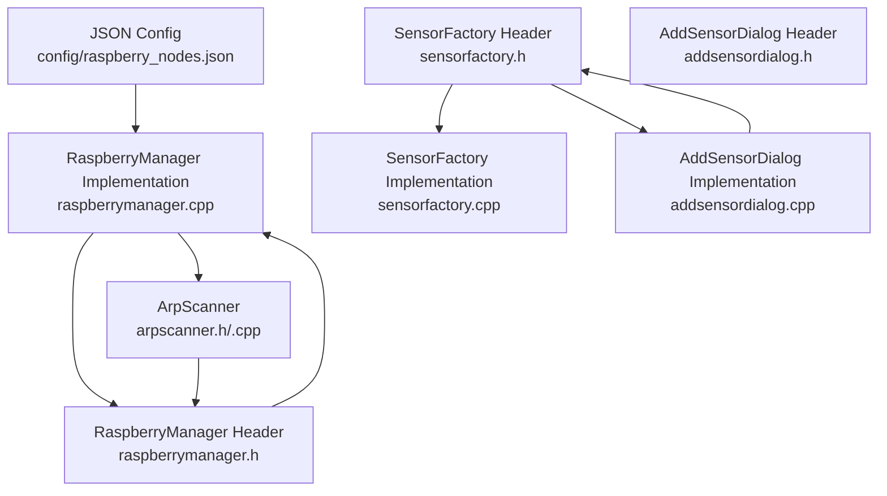
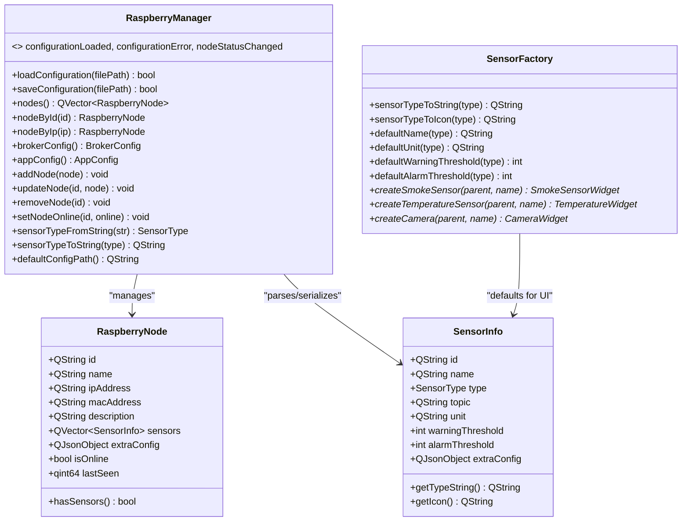
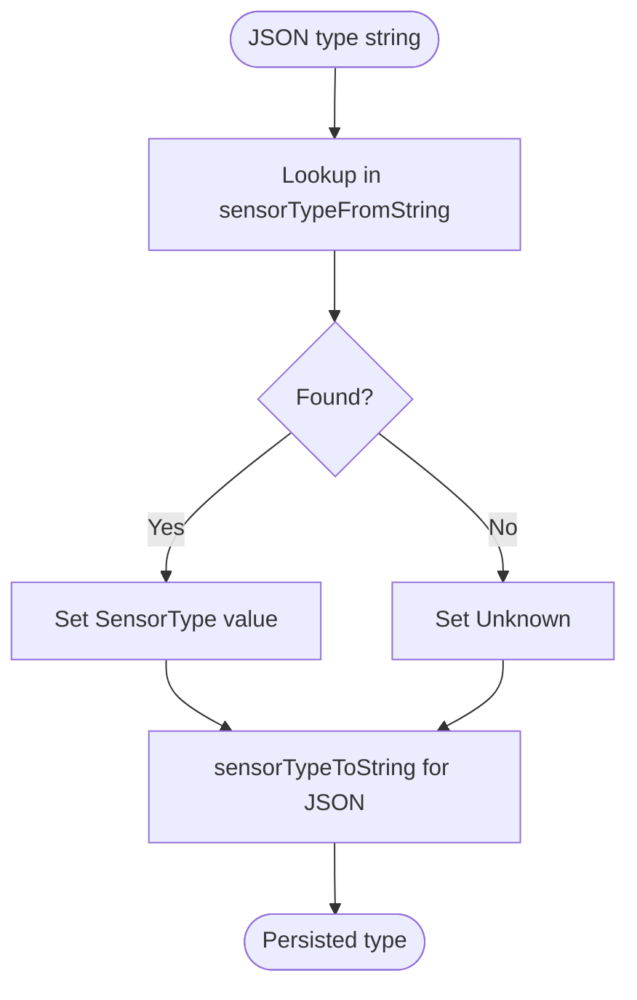
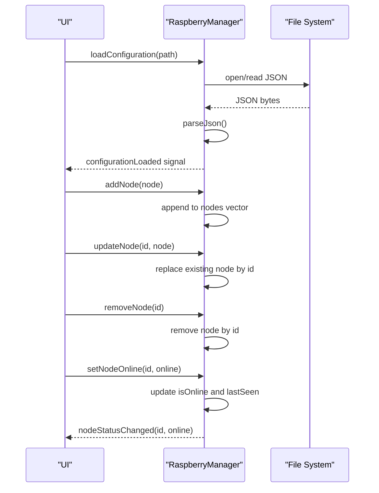
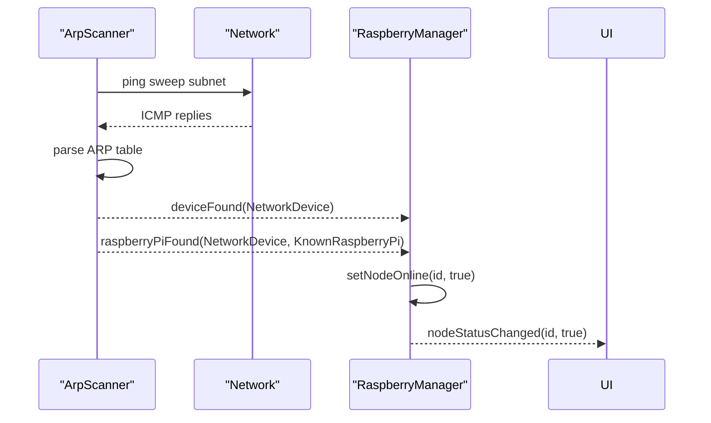
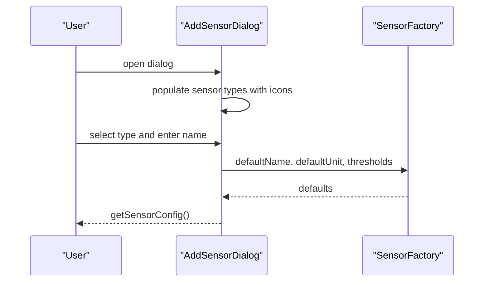
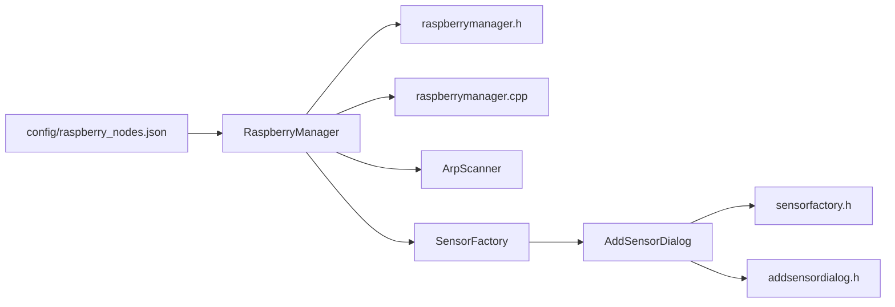

# Node Configuration and Management

<cite>
**Referenced Files in This Document**
- [raspberry_nodes.json](file://config/raspberry_nodes.json)
- [raspberrymanager.h](file://raspberrymanager.h)
- [raspberrymanager.cpp](file://raspberrymanager.cpp)
- [sensorfactory.h](file://sensorfactory.h)
- [sensorfactory.cpp](file://sensorfactory.cpp)
- [arpscanner.h](file://arpscanner.h)
- [arpscanner.cpp](file://arpscanner.cpp)
- [addsensordialog.h](file://addsensordialog.h)
- [addsensordialog.cpp](file://addsensordialog.cpp)
- [struct_raspberry_node.html](file://html/struct_raspberry_node.html)
- [struct_sensor_info.html](file://html/struct_sensor_info.html)
</cite>

## Table of Contents
1. [Introduction](#introduction)
2. [Project Structure](#project-structure)
3. [Core Components](#core-components)
4. [Architecture Overview](#architecture-overview)
5. [Detailed Component Analysis](#detailed-component-analysis)
6. [Dependency Analysis](#dependency-analysis)
7. [Performance Considerations](#performance-considerations)
8. [Troubleshooting Guide](#troubleshooting-guide)
9. [Conclusion](#conclusion)
10. [Appendices](#appendices)

## Introduction
This document explains how Raspberry Pi nodes are configured and managed within the SurveillanceQT application. It covers the data structures for nodes and sensors, the JSON configuration schema, sensor type enumerations, lifecycle operations (add, update, remove), status tracking, and discovery mechanisms. Practical examples and troubleshooting guidance are included to help operators configure and maintain node deployments effectively.

## Project Structure
The node configuration and management functionality spans several modules:
- Configuration storage: JSON file containing network, broker, application, and node definitions
- Data model: C++ structs and enums representing nodes and sensors
- Manager: Loads, parses, serializes, and exposes node/sensor data
- Discovery: Network scanning to detect devices and identify known Raspberry Pi nodes
- UI integration: Dialogs and widgets to add sensors and manage configuration

**Diagram sources**
- [raspberry_nodes.json](file://config/raspberry_nodes.json)
- [raspberrymanager.h](file://raspberrymanager.h)
- [raspberrymanager.cpp](file://raspberrymanager.cpp)
- [sensorfactory.h](file://sensorfactory.h)
- [sensorfactory.cpp](file://sensorfactory.cpp)
- [arpscanner.h](file://arpscanner.h)
- [arpscanner.cpp](file://arpscanner.cpp)
- [addsensordialog.h](file://addsensordialog.h)
- [addsensordialog.cpp](file://addsensordialog.cpp)

**Section sources**
- [raspberry_nodes.json](file://config/raspberry_nodes.json)
- [raspberrymanager.h](file://raspberrymanager.h)
- [raspberrymanager.cpp](file://raspberrymanager.cpp)
- [sensorfactory.h](file://sensorfactory.h)
- [sensorfactory.cpp](file://sensorfactory.cpp)
- [arpscanner.h](file://arpscanner.h)
- [arpscanner.cpp](file://arpscanner.cpp)
- [addsensordialog.h](file://addsensordialog.h)
- [addsensordialog.cpp](file://addsensordialog.cpp)

## Core Components
This section documents the primary data structures and their roles in node and sensor management.

- RaspberryNode
  - Fields: id, name, ipAddress, macAddress, description, sensors (array), extraConfig (object), isOnline (boolean), lastSeen (timestamp)
  - Purpose: Represents a single Raspberry Pi node with optional sensors and metadata
  - Status tracking: isOnline and lastSeen are maintained by the manager and updated via dedicated APIs

- SensorInfo
  - Fields: id, name, type (enumeration), topic, unit, warningThreshold, alarmThreshold, extraConfig (object)
  - Purpose: Describes a physical or virtual sensor attached to a node
  - Type mapping: Enumerated sensor types are mapped to and from human-readable strings

- SensorType (definition)
  - Values: Temperature_DHT22, Humidity_DHT22, Smoke_MQ2, AirQuality_PIM480, VOC_PIM480, Camera, Unknown
  - Used by: RaspberryNode parsing and serialization

- BrokerConfig and AppConfig
  - BrokerConfig: host, port, protocol, username, password
  - AppConfig: autoConnectOnStartup, reconnectIntervalMs, heartbeatIntervalMs, logLevel
  - Purpose: Global MQTT broker and application behavior settings

- SensorFactory
  - Provides UI-friendly defaults and factory methods for creating sensor widgets
  - Includes type-to-string/icon mapping and default threshold/unit naming

**Section sources**
- [struct_raspberry_node.html](file://html/struct_raspberry_node.html)
- [struct_sensor_info.html](file://html/struct_sensor_info.html)
- [raspberrymanager.h](file://raspberrymanager.h)
- [raspberrymanager.cpp](file://raspberrymanager.cpp)
- [sensorfactory.h](file://sensorfactory.h)
- [sensorfactory.cpp](file://sensorfactory.cpp)

## Architecture Overview
The system is organized around a central manager that loads and persists configuration, exposes node and sensor data, and integrates with discovery and UI components.

**Diagram sources**
- [raspberrymanager.h](file://raspberrymanager.h)
- [raspberrymanager.cpp](file://raspberrymanager.cpp)
- [sensorfactory.h](file://sensorfactory.h)
- [sensorfactory.cpp](file://sensorfactory.cpp)
- [struct_raspberry_node.html](file://html/struct_raspberry_node.html)
- [struct_sensor_info.html](file://html/struct_sensor_info.html)

## Detailed Component Analysis

### JSON Configuration Schema
The configuration file defines global settings and per-node sensor definitions. It supports:
- network: subnet and gateway hints for discovery
- raspberry_nodes: array of nodes, each with id, name, ip_address, mac_address, description, sensors[]
- sensors: array of sensor definitions with type, topic, unit, thresholds, and device-specific fields (e.g., pin, i2c_address, stream_url)
- broker: MQTT connection settings
- application: runtime behavior (auto-connect, reconnect interval, heartbeat, log level)

Example highlights:
- Node identification and networking: id, name, ip_address, mac_address, description
- Sensors: id, name, type, topic, unit, warning_threshold, alarm_threshold
- Optional extras: pin, i2c_address, stream_url, snapshot_url, resolution, fps, display block

Practical examples are available in the configuration file itself.

**Section sources**
- [raspberry_nodes.json](file://config/raspberry_nodes.json)

### Sensor Types and Enumerations
Two sensor type systems exist:
- RaspberryManager SensorType (used for parsing/serialization): Temperature_DHT22, Humidity_DHT22, Smoke_MQ2, AirQuality_PIM480, VOC_PIM480, Camera, Unknown
- SensorFactory SensorType (used for UI/widget creation): Smoke, Temperature, Humidity, CO2, VOC, Camera

Mappings:
- RaspberryManager sensorTypeFromString maps JSON type strings to internal enum values
- RaspberryManager sensorTypeToString converts enum values back to JSON strings
- SensorFactory provides localized labels, icons, defaults, and widget creators

**Diagram sources**
- [raspberrymanager.cpp](file://raspberrymanager.cpp)

**Section sources**
- [raspberrymanager.h](file://raspberrymanager.h)
- [raspberrymanager.cpp](file://raspberrymanager.cpp)
- [sensorfactory.h](file://sensorfactory.h)
- [sensorfactory.cpp](file://sensorfactory.cpp)

### Node Lifecycle Management
The manager exposes APIs to manage nodes:
- Load configuration from disk and parse JSON into in-memory structures
- Save configuration back to disk
- Retrieve nodes by id or IP
- Add/update/remove nodes programmatically
- Track online status and last-seen timestamps

**Diagram sources**
- [raspberrymanager.cpp](file://raspberrymanager.cpp)

**Section sources**
- [raspberrymanager.cpp](file://raspberrymanager.cpp)

### Status Tracking and Discovery
- Status tracking: setNodeOnline updates isOnline and lastSeen, emitting nodeStatusChanged when the state flips
- Discovery: ArpScanner performs ping sweeps and ARP table parsing to discover devices, identifies known Raspberry Pi nodes, and emits signals for detected devices

**Diagram sources**
- [arpscanner.cpp](file://arpscanner.cpp)
- [raspberrymanager.cpp](file://raspberrymanager.cpp)

**Section sources**
- [arpscanner.h](file://arpscanner.h)
- [arpscanner.cpp](file://arpscanner.cpp)
- [raspberrymanager.cpp](file://raspberrymanager.cpp)

### Sensor Assignment Patterns and UI Integration
- AddSensorDialog lets users select a sensor type and name, then generates a SensorConfig with defaults for unit and thresholds
- SensorFactory provides localized labels, icons, and default thresholds for each type
- Widgets are created for smoke, temperature, and camera sensors

**Diagram sources**
- [addsensordialog.cpp](file://addsensordialog.cpp)
- [sensorfactory.cpp](file://sensorfactory.cpp)

**Section sources**
- [addsensordialog.h](file://addsensordialog.h)
- [addsensordialog.cpp](file://addsensordialog.cpp)
- [sensorfactory.h](file://sensorfactory.h)
- [sensorfactory.cpp](file://sensorfactory.cpp)

## Dependency Analysis
The following diagram shows key dependencies among components:

**Diagram sources**
- [raspberry_nodes.json](file://config/raspberry_nodes.json)
- [raspberrymanager.h](file://raspberrymanager.h)
- [raspberrymanager.cpp](file://raspberrymanager.cpp)
- [arpscanner.h](file://arpscanner.h)
- [arpscanner.cpp](file://arpscanner.cpp)
- [sensorfactory.h](file://sensorfactory.h)
- [sensorfactory.cpp](file://sensorfactory.cpp)
- [addsensordialog.h](file://addsensordialog.h)
- [addsensordialog.cpp](file://addsensordialog.cpp)

**Section sources**
- [raspberrymanager.h](file://raspberrymanager.h)
- [raspberrymanager.cpp](file://raspberrymanager.cpp)
- [arpscanner.h](file://arpscanner.h)
- [arpscanner.cpp](file://arpscanner.cpp)
- [sensorfactory.h](file://sensorfactory.h)
- [sensorfactory.cpp](file://sensorfactory.cpp)
- [addsensordialog.h](file://addsensordialog.h)
- [addsensordialog.cpp](file://addsensordialog.cpp)

## Performance Considerations
- Parsing and saving configuration: O(n) over number of nodes and sensors; keep configuration files reasonably sized
- Discovery scans: Ping sweeps iterate over subnet ranges; tune intervals and avoid scanning unnecessary networks
- Status updates: Frequent online/offline toggles can cause excessive signals; batch updates when possible
- Widget creation: SensorFactory defaults are lightweight; avoid heavy initialization in UI thread

## Troubleshooting Guide
Common issues and resolutions:
- Configuration file not found or invalid JSON
  - Symptoms: loadConfiguration emits configurationError
  - Actions: Verify path existence and JSON validity; check for syntax errors
  - References: [raspberrymanager.cpp](file://raspberrymanager.cpp)

- Sensor type mismatch
  - Symptoms: Unknown sensor type in parsed data
  - Actions: Ensure type strings match supported values; use sensorTypeToString for serialization
  - References: [raspberrymanager.cpp](file://raspberrymanager.cpp)

- Node not appearing in UI after discovery
  - Symptoms: Device found but node not marked online
  - Actions: Confirm node id/IP mapping; call setNodeOnline with explicit state; verify nodeStatusChanged handlers
  - References: [arpscanner.cpp](file://arpscanner.cpp), [raspberrymanager.cpp](file://raspberrymanager.cpp)

- Sensor defaults incorrect in UI
  - Symptoms: Unexpected unit or thresholds
  - Actions: Use SensorFactory defaultName/defaultUnit/default thresholds; ensure selected type matches backend expectations
  - References: [sensorfactory.cpp](file://sensorfactory.cpp)

**Section sources**
- [raspberrymanager.cpp](file://raspberrymanager.cpp)
- [arpscanner.cpp](file://arpscanner.cpp)
- [sensorfactory.cpp](file://sensorfactory.cpp)

## Conclusion
The node configuration and management system centers on a robust JSON schema, a strongly-typed data model, and a manager that handles persistence, discovery, and status tracking. Sensor types are consistently mapped across the configuration and UI layers, enabling reliable sensor assignment and dynamic widget creation. Following the patterns and troubleshooting steps outlined here will help operators maintain accurate and up-to-date node configurations.

## Appendices

### Practical Examples
- Example node definitions with sensors and camera streams are present in the configuration file
- Example sensor assignments include DHT22 temperature/humidity, MQ-2 smoke, PIM480 CO2/VOC, and camera streaming

**Section sources**
- [raspberry_nodes.json](file://config/raspberry_nodes.json)