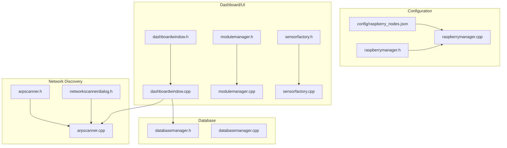
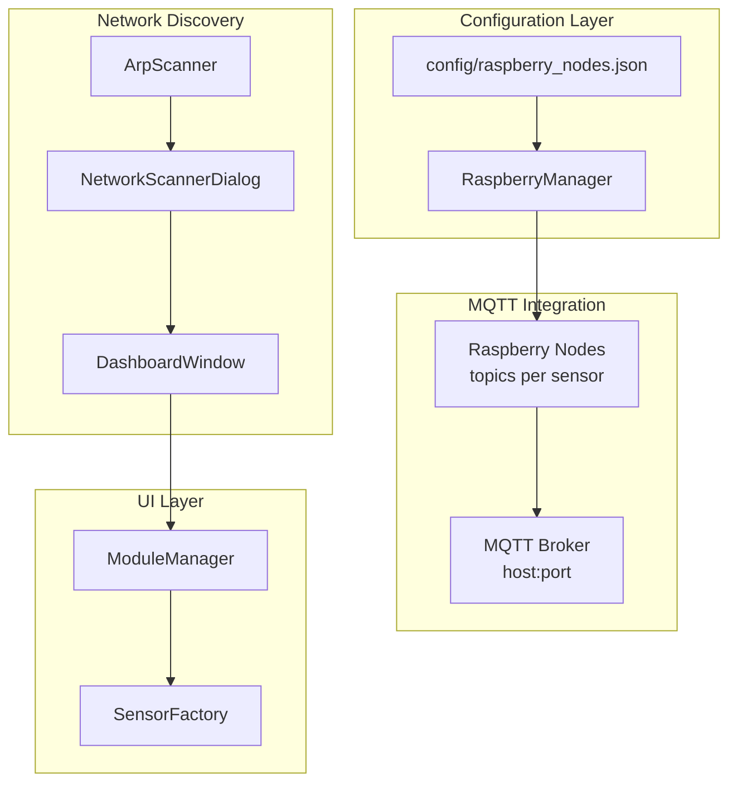
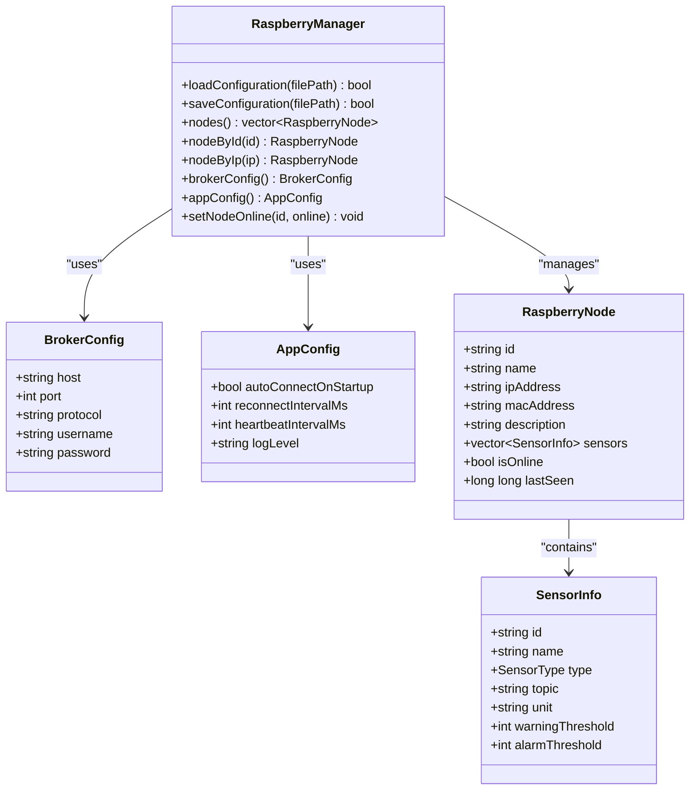
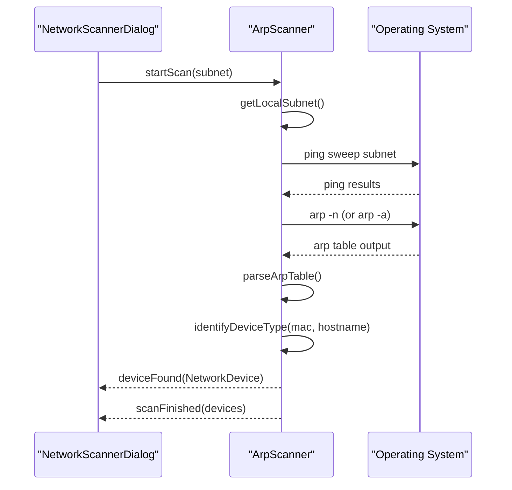
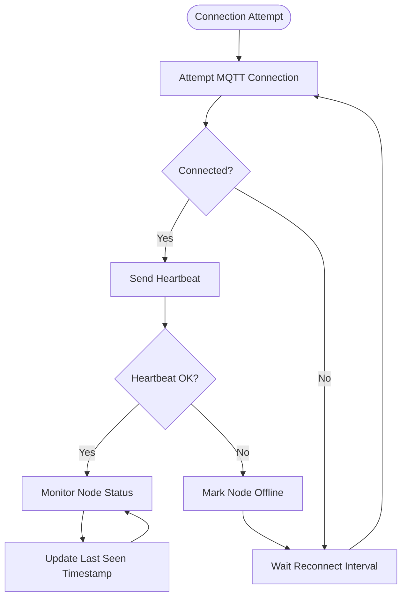
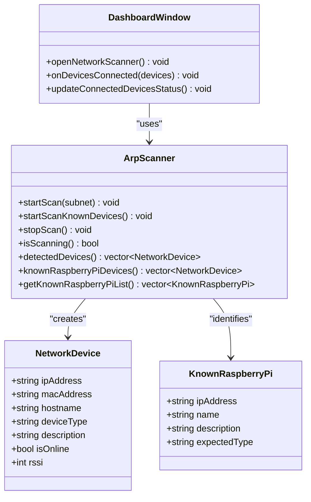
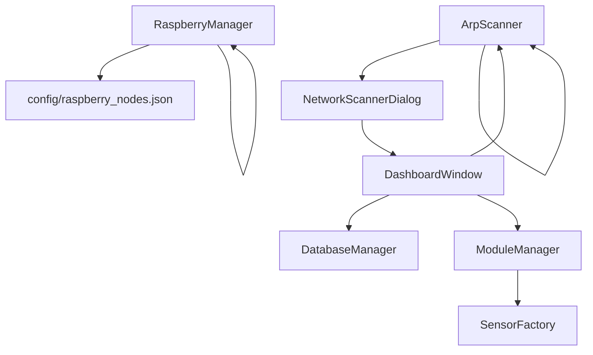

# Raspberry Pi Network Management

<cite>
**Referenced Files in This Document**
- [raspberry_nodes.json](file://config/raspberry_nodes.json)
- [raspberrymanager.h](file://raspberrymanager.h)
- [raspberrymanager.cpp](file://raspberrymanager.cpp)
- [arpscanner.h](file://arpscanner.h)
- [arpscanner.cpp](file://arpscanner.cpp)
- [networkscannerdialog.h](file://networkscannerdialog.h)
- [dashboardwindow.h](file://dashboardwindow.h)
- [dashboardwindow.cpp](file://dashboardwindow.cpp)
- [databasemanager.h](file://databasemanager.h)
- [databasemanager.cpp](file://databasemanager.cpp)
- [modulemanager.h](file://modulemanager.h)
- [modulemanager.cpp](file://modulemanager.cpp)
- [sensorfactory.h](file://sensorfactory.h)
- [sensorfactory.cpp](file://sensorfactory.cpp)
</cite>

## Table of Contents
1. [Introduction](#introduction)
2. [Project Structure](#project-structure)
3. [Core Components](#core-components)
4. [Architecture Overview](#architecture-overview)
5. [Detailed Component Analysis](#detailed-component-analysis)
6. [Dependency Analysis](#dependency-analysis)
7. [Performance Considerations](#performance-considerations)
8. [Troubleshooting Guide](#troubleshooting-guide)
9. [Conclusion](#conclusion)

## Introduction
This document provides comprehensive documentation for Raspberry Pi network management within the SurveillanceQT project. It focuses on MQTT broker configuration and connection management for coordinating distributed sensor networks, node discovery and registration, connection management and recovery mechanisms, and network topology management. The documentation also covers the Raspberry Pi node configuration using JSON format, integration with ArpScanner for automatic device discovery and status tracking, and strategies for network monitoring, fault tolerance, and performance optimization in distributed sensor deployments.

## Project Structure
The project is organized around several key modules:
- Configuration management for Raspberry Pi nodes and MQTT broker settings
- Network scanning and discovery using ArpScanner
- Dashboard and UI integration for monitoring and control
- Database management for user authentication and audit logging
- Module management for dynamic sensor widgets and layouts

**Diagram sources**
- [raspberry_nodes.json](file://config/raspberry_nodes.json)
- [raspberrymanager.h](file://raspberrymanager.h)
- [raspberrymanager.cpp](file://raspberrymanager.cpp)
- [arpscanner.h](file://arpscanner.h)
- [arpscanner.cpp](file://arpscanner.cpp)
- [networkscannerdialog.h](file://networkscannerdialog.h)
- [dashboardwindow.h](file://dashboardwindow.h)
- [dashboardwindow.cpp](file://dashboardwindow.cpp)
- [databasemanager.h](file://databasemanager.h)
- [databasemanager.cpp](file://databasemanager.cpp)
- [modulemanager.h](file://modulemanager.h)
- [modulemanager.cpp](file://modulemanager.cpp)
- [sensorfactory.h](file://sensorfactory.h)
- [sensorfactory.cpp](file://sensorfactory.cpp)

**Section sources**
- [raspberry_nodes.json](file://config/raspberry_nodes.json)
- [raspberrymanager.h](file://raspberrymanager.h)
- [raspberrymanager.cpp](file://raspberrymanager.cpp)
- [arpscanner.h](file://arpscanner.h)
- [arpscanner.cpp](file://arpscanner.cpp)
- [networkscannerdialog.h](file://networkscannerdialog.h)
- [dashboardwindow.h](file://dashboardwindow.h)
- [dashboardwindow.cpp](file://dashboardwindow.cpp)
- [databasemanager.h](file://databasemanager.h)
- [databasemanager.cpp](file://databasemanager.cpp)
- [modulemanager.h](file://modulemanager.h)
- [modulemanager.cpp](file://modulemanager.cpp)
- [sensorfactory.h](file://sensorfactory.h)
- [sensorfactory.cpp](file://sensorfactory.cpp)

## Core Components
This section outlines the primary components responsible for network management and MQTT integration.

- RaspberryManager: Manages configuration loading and saving, node definitions, broker settings, and application configuration. It parses JSON configuration files and exposes structured data for the rest of the application.
- ArpScanner: Performs network scanning to discover devices, identifies known Raspberry Pi devices, and tracks device status and connectivity.
- NetworkScannerDialog: Provides a user interface for initiating scans, viewing discovered devices, and managing connections.
- DashboardWindow: Integrates network scanning capabilities into the main dashboard, displaying device status and enabling network management actions.
- DatabaseManager: Handles user authentication, session management, and audit logging for security and compliance.
- ModuleManager and SensorFactory: Manage dynamic sensor widgets and their configuration, supporting flexible dashboard layouts.

**Section sources**
- [raspberrymanager.h](file://raspberrymanager.h)
- [raspberrymanager.cpp](file://raspberrymanager.cpp)
- [arpscanner.h](file://arpscanner.h)
- [arpscanner.cpp](file://arpscanner.cpp)
- [networkscannerdialog.h](file://networkscannerdialog.h)
- [dashboardwindow.h](file://dashboardwindow.h)
- [dashboardwindow.cpp](file://dashboardwindow.cpp)
- [databasemanager.h](file://databasemanager.h)
- [databasemanager.cpp](file://databasemanager.cpp)
- [modulemanager.h](file://modulemanager.h)
- [modulemanager.cpp](file://modulemanager.cpp)
- [sensorfactory.h](file://sensorfactory.h)
- [sensorfactory.cpp](file://sensorfactory.cpp)

## Architecture Overview
The system architecture integrates configuration-driven node management with network discovery and user interface components. The MQTT broker configuration is embedded within the node configuration JSON, enabling centralized management of broker settings across distributed nodes.

**Diagram sources**
- [raspberry_nodes.json](file://config/raspberry_nodes.json)
- [raspberrymanager.cpp](file://raspberrymanager.cpp)
- [arpscanner.cpp](file://arpscanner.cpp)
- [networkscannerdialog.h](file://networkscannerdialog.h)
- [dashboardwindow.cpp](file://dashboardwindow.cpp)
- [modulemanager.cpp](file://modulemanager.cpp)
- [sensorfactory.cpp](file://sensorfactory.cpp)

## Detailed Component Analysis

### MQTT Broker Configuration and Connection Management
The MQTT broker configuration is defined within the node configuration JSON and loaded by the RaspberryManager. The broker settings include host, port, protocol, and optional credentials. Application-level settings define auto-connect behavior, reconnection intervals, heartbeat intervals, and logging levels.

Key aspects:
- Centralized broker configuration: All nodes share the same broker settings, simplifying deployment and management.
- Application configuration: Auto-connect on startup, reconnect interval, heartbeat interval, and log level are configurable.
- Node-to-broker communication: Each sensor publishes to a topic derived from the node ID, enabling targeted message routing.

**Diagram sources**
- [raspberrymanager.h](file://raspberrymanager.h)
- [raspberrymanager.cpp](file://raspberrymanager.cpp)

**Section sources**
- [raspberry_nodes.json](file://config/raspberry_nodes.json)
- [raspberrymanager.h](file://raspberrymanager.h)
- [raspberrymanager.cpp](file://raspberrymanager.cpp)

### Node Discovery and Registration Process
The ArpScanner performs network discovery by pinging hosts within a subnet and parsing ARP table entries. It identifies known Raspberry Pi devices using predefined IP addresses and vendor MAC prefixes, emitting signals for discovered devices and known Raspberry Pi instances.

Discovery workflow:
- Determine local subnet and IP address
- Ping sweep the subnet to identify live hosts
- Parse ARP table to correlate IP addresses with MAC addresses
- Identify device types using MAC prefixes and hostnames
- Emit signals for device discovery and known Raspberry Pi detection

**Diagram sources**
- [arpscanner.cpp](file://arpscanner.cpp)
- [networkscannerdialog.h](file://networkscannerdialog.h)

**Section sources**
- [arpscanner.h](file://arpscanner.h)
- [arpscanner.cpp](file://arpscanner.cpp)
- [networkscannerdialog.h](file://networkscannerdialog.h)

### Connection Management and Recovery Mechanisms
Connection management involves maintaining node status, handling reconnection attempts, and tracking last-seen timestamps. The RaspberryManager updates node online status and emits signals when status changes occur.

Recovery mechanisms:
- Automatic reconnection: Configurable reconnection interval ensures periodic attempts to restore connectivity.
- Heartbeat monitoring: Periodic heartbeat intervals help detect connectivity issues and trigger recovery actions.
- Status tracking: Last-seen timestamps enable monitoring of node activity and offline detection.

**Diagram sources**
- [raspberrymanager.cpp](file://raspberrymanager.cpp)
- [raspberrymanager.h](file://raspberrymanager.h)

**Section sources**
- [raspberrymanager.cpp](file://raspberrymanager.cpp)
- [raspberrymanager.h](file://raspberrymanager.h)

### Network Topology Management
Network topology management encompasses device discovery, status tracking, and UI integration. The DashboardWindow integrates ArpScanner capabilities to display connected devices and manage network scanning actions.

Topology features:
- Real-time device status: Live updates of device presence and connectivity
- Known device identification: Predefined lists for known Raspberry Pi devices
- Signal strength indicators: RSSI values for wireless devices
- User interface controls: Buttons for scanning, connecting, and managing devices

**Diagram sources**
- [arpscanner.h](file://arpscanner.h)
- [arpscanner.cpp](file://arpscanner.cpp)
- [dashboardwindow.h](file://dashboardwindow.h)
- [dashboardwindow.cpp](file://dashboardwindow.cpp)

**Section sources**
- [arpscanner.h](file://arpscanner.h)
- [arpscanner.cpp](file://arpscanner.cpp)
- [dashboardwindow.h](file://dashboardwindow.h)
- [dashboardwindow.cpp](file://dashboardwindow.cpp)

### Raspberry Pi Node Configuration (JSON Format)
The node configuration JSON defines network parameters, broker settings, application configuration, and individual node definitions with their sensors. Each node includes identification, networking details, sensor assignments, and optional display configuration.

Configuration structure:
- Network: Subnet and gateway settings
- Broker: Host, port, protocol, and credentials
- Application: Auto-connect, reconnect interval, heartbeat interval, and log level
- Raspberry nodes: Each node includes ID, name, IP/MAC addresses, description, sensors array, and optional extra configuration

Example configuration highlights:
- Sensor topics: Derived from node ID for MQTT publishing
- Thresholds: Warning and alarm thresholds per sensor type
- Extra configurations: Additional parameters like pin assignments, I2C addresses, and camera URLs

**Section sources**
- [raspberry_nodes.json](file://config/raspberry_nodes.json)

### Integration with ArpScanner for Automatic Device Discovery
The ArpScanner integrates with the NetworkScannerDialog and DashboardWindow to provide automatic device discovery and status tracking. The scanner supports both full subnet scanning and known device scanning modes, emitting signals for device discovery progress and completion.

Integration points:
- Signal emission: scanStarted, scanProgress, deviceFound, scanFinished, scanError
- Device filtering: Known Raspberry Pi devices and surveillance modules
- UI updates: Progress bars, device lists, and status indicators

**Section sources**
- [arpscanner.h](file://arpscanner.h)
- [arpscanner.cpp](file://arpscanner.cpp)
- [networkscannerdialog.h](file://networkscannerdialog.h)
- [dashboardwindow.h](file://dashboardwindow.h)
- [dashboardwindow.cpp](file://dashboardwindow.cpp)

### Network Monitoring, Fault Tolerance, and Performance Optimization
Network monitoring involves continuous device discovery, status tracking, and alerting mechanisms. Fault tolerance is achieved through configurable reconnection intervals, heartbeat monitoring, and status tracking. Performance optimization strategies include efficient scanning algorithms, selective device identification, and optimized UI rendering.

Monitoring strategies:
- Continuous scanning: Periodic ARP table parsing and ping sweeps
- Status tracking: Online/offline state and last-seen timestamps
- Alerting: Signals for device discovery and status changes

Fault tolerance mechanisms:
- Reconnection intervals: Configurable delays between reconnection attempts
- Heartbeat intervals: Periodic checks to maintain connection health
- Status updates: Reliable node status reporting via signals

Performance optimization:
- Efficient scanning: ARP table parsing and selective host pings
- Device filtering: Known device lists reduce unnecessary scanning
- UI optimization: Batch updates and signal-based rendering

**Section sources**
- [arpscanner.cpp](file://arpscanner.cpp)
- [raspberrymanager.cpp](file://raspberrymanager.cpp)
- [dashboardwindow.cpp](file://dashboardwindow.cpp)

## Dependency Analysis
The following diagram illustrates the dependencies between major components, highlighting the relationships and data flow between configuration management, network discovery, and UI integration.

**Diagram sources**
- [raspberrymanager.cpp](file://raspberrymanager.cpp)
- [arpscanner.cpp](file://arpscanner.cpp)
- [networkscannerdialog.h](file://networkscannerdialog.h)
- [dashboardwindow.cpp](file://dashboardwindow.cpp)
- [databasemanager.cpp](file://databasemanager.cpp)
- [modulemanager.cpp](file://modulemanager.cpp)
- [sensorfactory.cpp](file://sensorfactory.cpp)

**Section sources**
- [raspberrymanager.cpp](file://raspberrymanager.cpp)
- [arpscanner.cpp](file://arpscanner.cpp)
- [networkscannerdialog.h](file://networkscannerdialog.h)
- [dashboardwindow.cpp](file://dashboardwindow.cpp)
- [databasemanager.cpp](file://databasemanager.cpp)
- [modulemanager.cpp](file://modulemanager.cpp)
- [sensorfactory.cpp](file://sensorfactory.cpp)

## Performance Considerations
- Scanning efficiency: ARP table parsing and ping sweeps should be optimized to minimize network overhead and processing time.
- Signal handling: Batch updates and debounced signal emissions prevent excessive UI updates and improve responsiveness.
- Memory management: Proper cleanup of QProcess instances and device lists prevents memory leaks during extended scanning sessions.
- Configuration caching: Cache parsed configuration data to avoid repeated JSON parsing and improve startup times.

## Troubleshooting Guide
Common issues and resolutions:
- Configuration file errors: Validate JSON syntax and required fields; check file permissions and existence.
- Network scanning failures: Verify subnet configuration, firewall settings, and operating system privileges for ping and ARP commands.
- Connection problems: Check broker accessibility, credentials, and network connectivity; adjust reconnection intervals and heartbeat settings.
- UI responsiveness: Ensure proper signal-slot connections and avoid blocking operations in the main thread.

**Section sources**
- [raspberrymanager.cpp](file://raspberrymanager.cpp)
- [arpscanner.cpp](file://arpscanner.cpp)
- [databasemanager.cpp](file://databasemanager.cpp)

## Conclusion
The Raspberry Pi network management system provides a robust framework for configuring MQTT brokers, discovering and registering nodes, and maintaining network topology through integrated scanning and UI components. The modular architecture enables scalable deployment of distributed sensor networks with reliable connection management, fault tolerance, and performance optimization strategies.