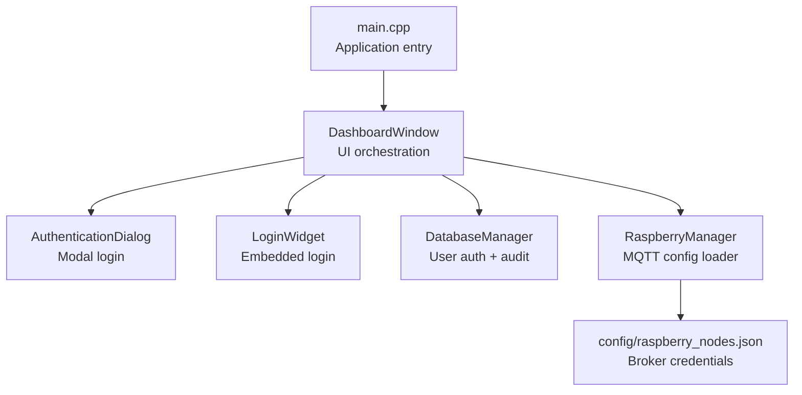
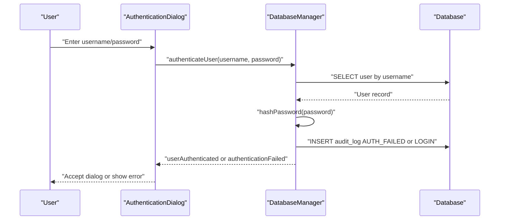
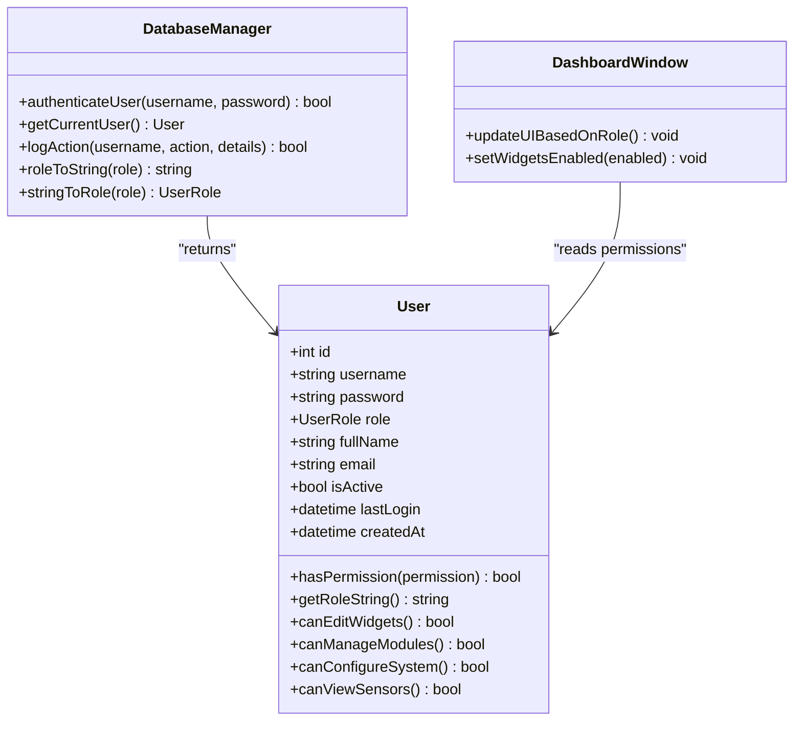
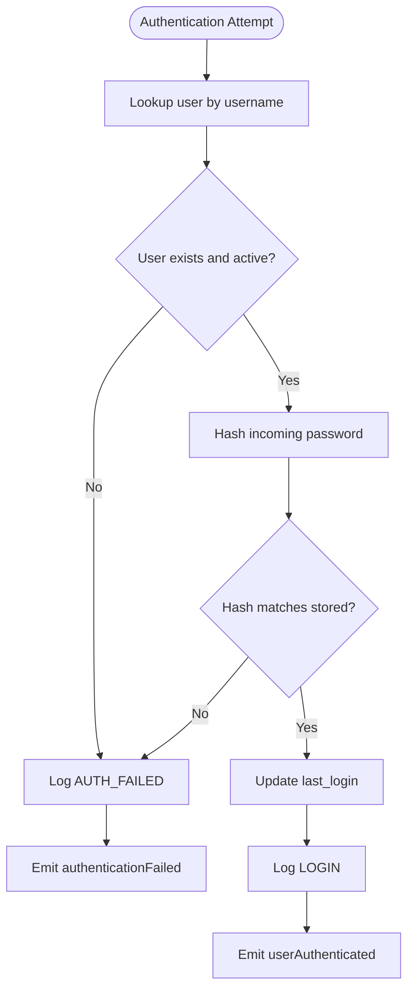
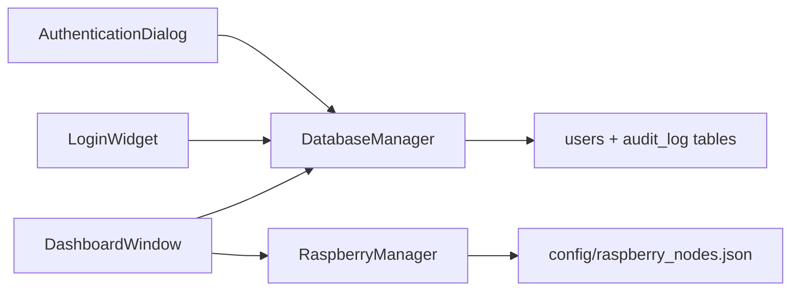

# Security Considerations

<cite>
**Referenced Files in This Document**
- [authenticationdialog.cpp](file://authenticationdialog.cpp)
- [authenticationdialog.h](file://authenticationdialog.h)
- [loginwidget.cpp](file://loginwidget.cpp)
- [loginwidget.h](file://loginwidget.h)
- [databasemanager.cpp](file://databasemanager.cpp)
- [databasemanager.h](file://databasemanager.h)
- [dashboardwindow.cpp](file://dashboardwindow.cpp)
- [dashboardwindow.h](file://dashboardwindow.h)
- [main.cpp](file://main.cpp)
- [raspberrymanager.cpp](file://raspberrymanager.cpp)
- [raspberrymanager.h](file://raspberrymanager.h)
- [config/raspberry_nodes.json](file://config/raspberry_nodes.json)
</cite>

## Table of Contents
1. [Introduction](#introduction)
2. [Project Structure](#project-structure)
3. [Core Components](#core-components)
4. [Architecture Overview](#architecture-overview)
5. [Detailed Component Analysis](#detailed-component-analysis)
6. [Dependency Analysis](#dependency-analysis)
7. [Performance Considerations](#performance-considerations)
8. [Troubleshooting Guide](#troubleshooting-guide)
9. [Conclusion](#conclusion)
10. [Appendices](#appendices)

## Introduction
This document provides comprehensive security documentation for SurveillanceQT. It focuses on password hashing and storage using Qt’s cryptographic functions, the role-based access control (RBAC) model, and the audit trail implementation for compliance. It also covers secure communication considerations for MQTT connections, session management and timeout handling, and production deployment best practices. Guidance is included for authentication dialogs, input validation and sanitization, protection against common vulnerabilities, security audit procedures, penetration testing recommendations, and incident response.

## Project Structure
SurveillanceQT is a Qt-based desktop application with a modular structure:
- Authentication UI and logic: AuthenticationDialog and LoginWidget
- Identity and permissions: DatabaseManager and User model
- Application shell: DashboardWindow orchestrating UI and features
- MQTT configuration: RaspberryManager and configuration JSON
- Entry point: main.cpp

**Diagram sources**
- [main.cpp:1-15](file://main.cpp#L1-L15)
- [dashboardwindow.cpp:71-244](file://dashboardwindow.cpp#L71-L244)
- [authenticationdialog.cpp:14-41](file://authenticationdialog.cpp#L14-L41)
- [loginwidget.cpp:10-97](file://loginwidget.cpp#L10-L97)
- [databasemanager.cpp:10-41](file://databasemanager.cpp#L10-L41)
- [raspberrymanager.cpp:24-52](file://raspberrymanager.cpp#L24-L52)
- [config/raspberry_nodes.json:108-121](file://config/raspberry_nodes.json#L108-L121)

**Section sources**
- [main.cpp:1-15](file://main.cpp#L1-L15)
- [dashboardwindow.cpp:71-244](file://dashboardwindow.cpp#L71-L244)

## Core Components
- AuthenticationDialog: Modal login dialog with username/password fields, role hint, and error feedback. It triggers DatabaseManager authentication and stores the authenticated user.
- LoginWidget: Embedded login panel used during dashboard runtime.
- DatabaseManager: Central service for user creation, authentication, session state, and audit logging. Implements password hashing and RBAC checks via User methods.
- DashboardWindow: Application shell that coordinates UI, authentication, and feature visibility based on user role.
- RaspberryManager: Loads MQTT broker configuration from JSON, including credentials.
- Configuration: JSON file containing broker host, port, protocol, and credentials.

Security-relevant responsibilities:
- Password hashing and verification
- Role-based permission enforcement
- Audit logging for authentication and actions
- Secure credential handling in configuration

**Section sources**
- [authenticationdialog.cpp:14-41](file://authenticationdialog.cpp#L14-L41)
- [authenticationdialog.cpp:178-194](file://authenticationdialog.cpp#L178-L194)
- [loginwidget.cpp:10-97](file://loginwidget.cpp#L10-L97)
- [databasemanager.cpp:158-198](file://databasemanager.cpp#L158-L198)
- [databasemanager.cpp:338-341](file://databasemanager.cpp#L338-L341)
- [databasemanager.cpp:344-381](file://databasemanager.cpp#L344-L381)
- [dashboardwindow.cpp:71-244](file://dashboardwindow.cpp#L71-L244)
- [raspberrymanager.cpp:181-237](file://raspberrymanager.cpp#L181-L237)
- [config/raspberry_nodes.json:108-121](file://config/raspberry_nodes.json#L108-L121)

## Architecture Overview
The authentication and authorization flow integrates UI, identity, and audit services.

**Diagram sources**
- [authenticationdialog.cpp:178-194](file://authenticationdialog.cpp#L178-L194)
- [databasemanager.cpp:158-198](file://databasemanager.cpp#L158-L198)
- [databasemanager.cpp:310-319](file://databasemanager.cpp#L310-L319)

## Detailed Component Analysis

### Password Hashing and Storage
- Hashing algorithm: SHA-256 via QCryptographicHash.
- Storage: Plain text hash stored in the database (password column).
- Verification: Incoming password hashed and compared to stored hash.

Security considerations:
- SHA-256 is fast and unsuitable for password hashing. Use a memory-hard, salted KDF (e.g., Argon2, bcrypt, scrypt) in production.
- No per-user salt is applied; collisions increase risk. Add unique salts and consider PBKDF2 or similar.
- Current implementation does not enforce password policies (length, complexity).

Recommendations:
- Replace QCryptographicHash::Sha256 with a proper password hashing scheme.
- Enforce strong password policies at input and on change.
- Store only hashes; avoid logging raw passwords.

**Section sources**
- [databasemanager.cpp:338-341](file://databasemanager.cpp#L338-L341)
- [databasemanager.cpp:158-198](file://databasemanager.cpp#L158-L198)

### Role-Based Access Control (RBAC)
- Roles: Admin, Operator, Viewer.
- Permission checks: User.hasPermission evaluates role-based capabilities.
- UI visibility: DashboardWindow updates UI based on current user role.

**Diagram sources**
- [databasemanager.h:15-32](file://databasemanager.h#L15-L32)
- [databasemanager.cpp:344-381](file://databasemanager.cpp#L344-L381)
- [dashboardwindow.h:19-99](file://dashboardwindow.h#L19-L99)

**Section sources**
- [databasemanager.h:9-13](file://databasemanager.h#L9-L13)
- [databasemanager.cpp:344-381](file://databasemanager.cpp#L344-L381)
- [dashboardwindow.h:62-65](file://dashboardwindow.h#L62-L65)

### Audit Trail Implementation
- Tables: users and audit_log.
- Events logged: LOGIN, AUTH_FAILED, LOGOUT.
- Details captured: username, action, optional details, timestamp.

**Diagram sources**
- [databasemanager.cpp:78-115](file://databasemanager.cpp#L78-L115)
- [databasemanager.cpp:158-198](file://databasemanager.cpp#L158-L198)
- [databasemanager.cpp:310-319](file://databasemanager.cpp#L310-L319)

**Section sources**
- [databasemanager.cpp:78-115](file://databasemanager.cpp#L78-L115)
- [databasemanager.cpp:158-198](file://databasemanager.cpp#L158-L198)
- [databasemanager.cpp:310-319](file://databasemanager.cpp#L310-L319)

### Authentication Dialogs and Input Validation
- AuthenticationDialog:
  - Trims username, validates non-empty inputs, and triggers authentication.
  - Displays role hint and error messages.
- LoginWidget:
  - Provides embedded username/password fields with echo mode for password.
- Input validation:
  - Minimal client-side validation (presence checks).
  - No server-side sanitization or rate limiting present in the shown code.

Recommendations:
- Sanitize and validate inputs server-side.
- Implement rate limiting and lockout policies.
- Avoid echoing passwords; ensure secure input handling.

**Section sources**
- [authenticationdialog.cpp:178-194](file://authenticationdialog.cpp#L178-L194)
- [authenticationdialog.cpp:220-234](file://authenticationdialog.cpp#L220-L234)
- [loginwidget.cpp:77-82](file://loginwidget.cpp#L77-L82)

### Secure Communication Protocols for MQTT
- Configuration loading: RaspberryManager reads broker host, port, protocol, username, and password from JSON.
- Current defaults: Empty username and password fields in the configuration file.

Security considerations:
- Unencrypted MQTT (tcp://1883) is used by default; sensitive telemetry should use TLS/SSL.
- Hardcoded empty credentials in configuration increase risk if misused.

Recommendations:
- Enable TLS for MQTT connections (e.g., mqtts://).
- Store credentials securely (avoid JSON plaintext; consider encrypted configuration or environment variables).
- Enforce mandatory credentials and strong authentication.

**Section sources**
- [raspberrymanager.cpp:181-237](file://raspberrymanager.cpp#L181-L237)
- [config/raspberry_nodes.json:108-121](file://config/raspberry_nodes.json#L108-L121)

### Session Management and Timeout Handling
- Session state:
  - DatabaseManager tracks current user and emits userLoggedOut on logout.
  - DashboardWindow maintains m_isAuthenticated and UI state.
- Timeouts:
  - No explicit session timeout logic is present in the shown code.

Recommendations:
- Implement configurable idle timeout with automatic logout and warning prompts.
- Use secure random tokens and invalidate sessions on logout.
- Persist minimal session metadata and enforce strict session lifetimes.

**Section sources**
- [databasemanager.cpp:290-302](file://databasemanager.cpp#L290-L302)
- [dashboardwindow.h:89-98](file://dashboardwindow.h#L89-L98)

### Production Deployment Best Practices
- Cryptography
  - Replace SHA-256 with a modern password hashing scheme (Argon2/bcrypt/scrypt).
  - Use per-user salt and tune cost parameters appropriately.
- Secrets Management
  - Do not store credentials in JSON; use encrypted configuration or secret managers.
  - Rotate MQTT credentials regularly.
- Transport Security
  - Enforce TLS for MQTT and database connections.
- Logging and Monitoring
  - Log security-relevant events; protect logs from tampering.
  - Monitor failed authentication attempts and anomalies.
- Least Privilege
  - Restrict UI and feature access based on role checks.
- Input Sanitization
  - Validate and sanitize all inputs; apply Content Security Policy where applicable.
- Patching and Dependencies
  - Keep Qt and third-party libraries updated.

[No sources needed since this section provides general guidance]

## Dependency Analysis

**Diagram sources**
- [authenticationdialog.cpp:14-41](file://authenticationdialog.cpp#L14-L41)
- [loginwidget.cpp:10-97](file://loginwidget.cpp#L10-L97)
- [databasemanager.cpp:10-41](file://databasemanager.cpp#L10-L41)
- [dashboardwindow.cpp:71-244](file://dashboardwindow.cpp#L71-L244)
- [raspberrymanager.cpp:24-52](file://raspberrymanager.cpp#L24-L52)
- [config/raspberry_nodes.json:108-121](file://config/raspberry_nodes.json#L108-L121)

**Section sources**
- [dashboardwindow.cpp:71-244](file://dashboardwindow.cpp#L71-L244)
- [databasemanager.cpp:10-41](file://databasemanager.cpp#L10-L41)
- [raspberrymanager.cpp:24-52](file://raspberrymanager.cpp#L24-L52)

## Performance Considerations
- Authentication hashing: SHA-256 is fast but insecure for passwords; consider PBKDF2 or Argon2 to increase computational cost and reduce brute-force feasibility.
- Database queries: Ensure indexes on username and timestamps for audit_log to support efficient querying.
- UI responsiveness: Keep authentication dialogs modal and avoid blocking the event loop during long computations.

[No sources needed since this section provides general guidance]

## Troubleshooting Guide
Common issues and mitigations:
- Authentication fails silently
  - Ensure authenticationFailed signal is handled and errors are surfaced to the UI.
  - Verify database connectivity and table creation.
- Incorrect password accepted
  - Confirm hashPassword is applied consistently and stored as hex.
- Audit logs missing
  - Check INSERT statements for audit_log and database permissions.
- MQTT connection failures
  - Validate broker host/port/protocol and credentials; enable TLS if required.

**Section sources**
- [authenticationdialog.cpp:39-40](file://authenticationdialog.cpp#L39-L40)
- [databasemanager.cpp:158-198](file://databasemanager.cpp#L158-L198)
- [databasemanager.cpp:310-319](file://databasemanager.cpp#L310-L319)
- [config/raspberry_nodes.json:108-121](file://config/raspberry_nodes.json#L108-L121)

## Conclusion
SurveillanceQT implements basic authentication, RBAC, and audit logging. To meet production-grade security requirements, replace SHA-256 with a robust password hashing scheme, harden MQTT transport and secrets handling, implement session timeouts, and strengthen input validation and error reporting. These changes will significantly improve confidentiality, integrity, and compliance readiness.

[No sources needed since this section summarizes without analyzing specific files]

## Appendices

### Security Audit Guidelines
- Cryptography review
  - Confirm password hashing uses a memory-hard, salted KDF.
  - Verify TLS is enforced for MQTT and database connections.
- Secrets management
  - Inventory all plaintext credentials; migrate to secure storage.
- Access control
  - Validate all UI and feature gating aligns with role checks.
- Logging and monitoring
  - Ensure audit_log captures sufficient context for investigations.
- Penetration testing recommendations
  - Test authentication bypass, SQL injection, and credential stuffing.
  - Validate MQTT topic permissions and broker hardening.
- Incident response
  - Define escalation paths for failed auth spikes, unauthorized access, and credential exposure.
  - Automate detection and remediation for suspicious activities.

[No sources needed since this section provides general guidance]