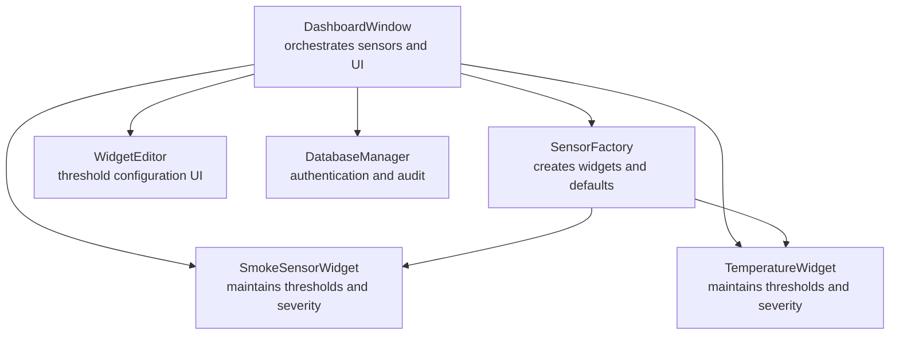
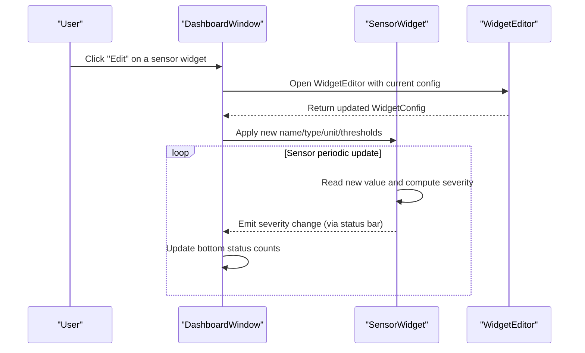
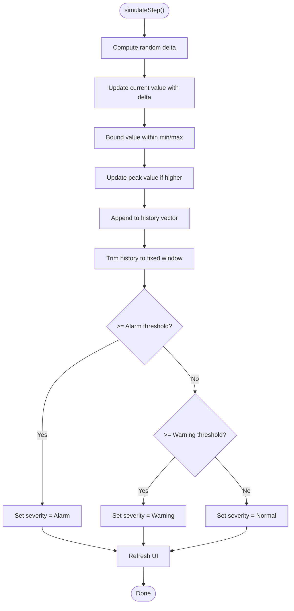
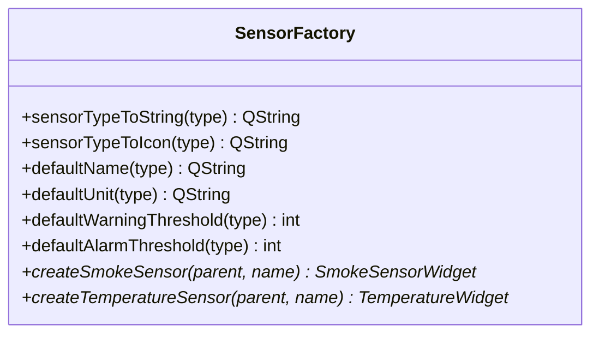
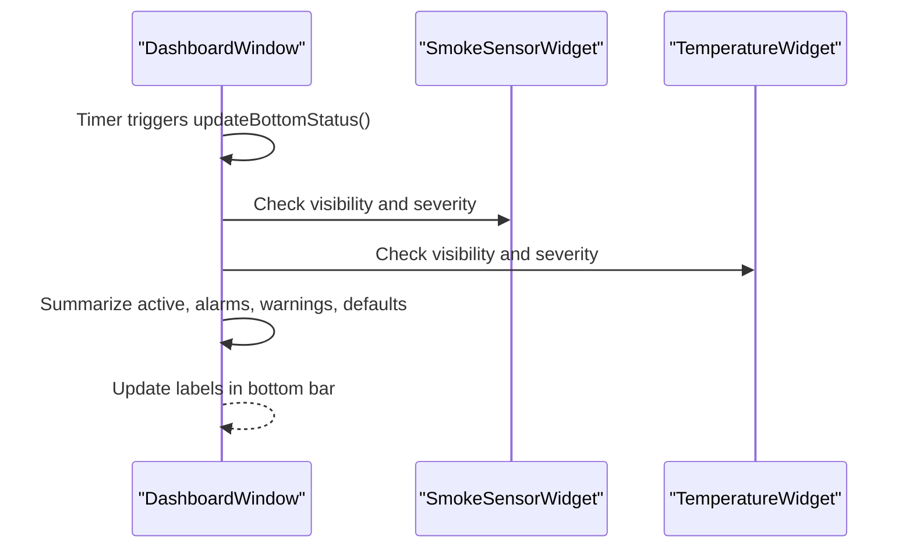
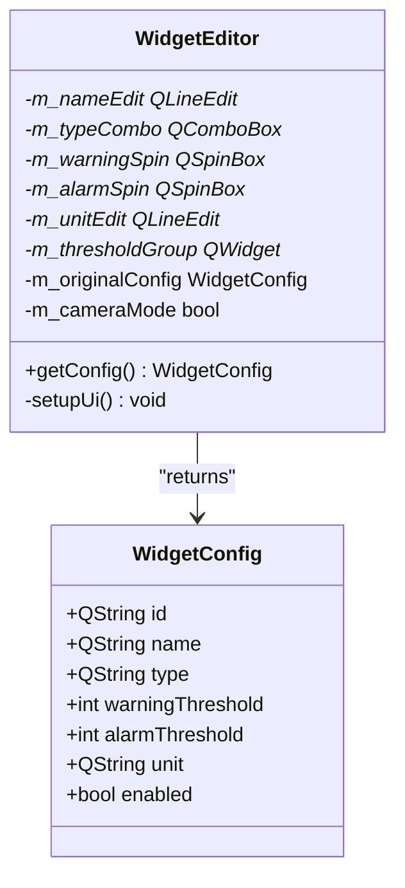
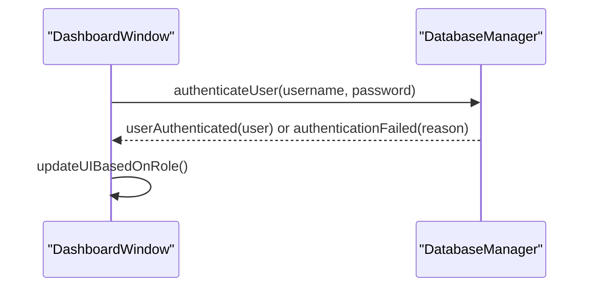
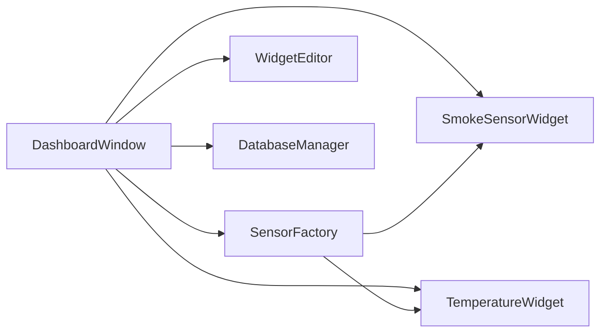

# Alerting and Threshold Management

<cite>
**Referenced Files in This Document**
- [smokesensorwidget.h](file://smokesensorwidget.h)
- [smokesensorwidget.cpp](file://smokesensorwidget.cpp)
- [temperaturewidget.h](file://temperaturewidget.h)
- [temperaturewidget.cpp](file://temperaturewidget.cpp)
- [sensorfactory.h](file://sensorfactory.h)
- [sensorfactory.cpp](file://sensorfactory.cpp)
- [dashboardwindow.h](file://dashboardwindow.h)
- [dashboardwindow.cpp](file://dashboardwindow.cpp)
- [widgeteditor.h](file://widgeteditor.h)
- [widgeteditor.cpp](file://widgeteditor.cpp)
- [databasemanager.h](file://databasemanager.h)
- [databasemanager.cpp](file://databasemanager.cpp)
- [mainwindow.ui](file://mainwindow.ui)
</cite>

## Table of Contents
1. [Introduction](#introduction)
2. [Project Structure](#project-structure)
3. [Core Components](#core-components)
4. [Architecture Overview](#architecture-overview)
5. [Detailed Component Analysis](#detailed-component-analysis)
6. [Dependency Analysis](#dependency-analysis)
7. [Performance Considerations](#performance-considerations)
8. [Troubleshooting Guide](#troubleshooting-guide)
9. [Conclusion](#conclusion)

## Introduction
This document explains the alerting and threshold management system implemented in the SurveillanceQT application. It focuses on how threshold-based alerting works for different sensor types, how violations trigger visual alerts and status updates, and how thresholds are configured and validated. It also covers the relationship between sensor readings and alert states, dynamic threshold updates via the user interface, and the dashboard’s status indicators.

## Project Structure
The alerting system spans several UI components and supporting infrastructure:
- Sensor widgets for smoke and temperature, each maintaining current values, peak values, thresholds, and severity state
- A factory responsible for creating sensor widgets and providing default thresholds per sensor type
- A dashboard window orchestrating sensors, status bars, and user interactions
- A widget editor dialog enabling dynamic threshold configuration
- A database manager providing authentication and audit logging

**Diagram sources**
- [dashboardwindow.cpp:71-244](file://dashboardwindow.cpp#L71-L244)
- [smokesensorwidget.cpp:157-237](file://smokesensorwidget.cpp#L157-L237)
- [temperaturewidget.cpp:148-227](file://temperaturewidget.cpp#L148-L227)
- [sensorfactory.cpp:83-103](file://sensorfactory.cpp#L83-L103)
- [widgeteditor.cpp:12-31](file://widgeteditor.cpp#L12-L31)
- [databasemanager.cpp:21-65](file://databasemanager.cpp#L21-L65)

**Section sources**
- [dashboardwindow.h:19-99](file://dashboardwindow.h#L19-L99)
- [dashboardwindow.cpp:71-244](file://dashboardwindow.cpp#L71-L244)
- [smokesensorwidget.h:10-53](file://smokesensorwidget.h#L10-L53)
- [smokesensorwidget.cpp:157-237](file://smokesensorwidget.cpp#L157-L237)
- [temperaturewidget.h:11-54](file://temperaturewidget.h#L11-L54)
- [temperaturewidget.cpp:148-227](file://temperaturewidget.cpp#L148-L227)
- [sensorfactory.h:28-41](file://sensorfactory.h#L28-L41)
- [sensorfactory.cpp:83-103](file://sensorfactory.cpp#L83-L103)
- [widgeteditor.h:20-41](file://widgeteditor.h#L20-L41)
- [widgeteditor.cpp:12-31](file://widgeteditor.cpp#L12-L31)
- [databasemanager.h:34-88](file://databasemanager.h#L34-L88)
- [databasemanager.cpp:21-65](file://databasemanager.cpp#L21-L65)

## Core Components
- SmokeSensorWidget and TemperatureWidget encapsulate:
  - Current and peak values
  - Warning and alarm thresholds
  - Severity state (Normal, Warning, Alarm)
  - Visualization via custom chart widgets
  - Periodic simulation of readings and severity updates
- SensorFactory centralizes:
  - Sensor creation
  - Default names, units, and thresholds per sensor type
- DashboardWindow manages:
  - Sensor widgets placement and interactivity
  - Bottom status bar aggregating active sensors, alarms, warnings, and defaults
  - Edit dialogs for sensor configuration
- WidgetEditor enables:
  - Editing name, type, warning threshold, alarm threshold, and unit
  - Mode-specific behavior for camera sensors (no thresholds)
- DatabaseManager supports:
  - Authentication and role-based permissions affecting UI behavior
  - Audit logging for actions

**Section sources**
- [smokesensorwidget.h:10-53](file://smokesensorwidget.h#L10-L53)
- [smokesensorwidget.cpp:280-307](file://smokesensorwidget.cpp#L280-L307)
- [temperaturewidget.h:11-54](file://temperaturewidget.h#L11-L54)
- [temperaturewidget.cpp:270-297](file://temperaturewidget.cpp#L270-L297)
- [sensorfactory.h:19-41](file://sensorfactory.h#L19-L41)
- [sensorfactory.cpp:59-81](file://sensorfactory.cpp#L59-L81)
- [dashboardwindow.cpp:574-614](file://dashboardwindow.cpp#L574-L614)
- [widgeteditor.h:10-18](file://widgeteditor.h#L10-L18)
- [widgeteditor.cpp:119-128](file://widgeteditor.cpp#L119-L128)
- [databasemanager.h:9-32](file://databasemanager.h#L9-L32)
- [databasemanager.cpp:158-198](file://databasemanager.cpp#L158-L198)

## Architecture Overview
The alerting pipeline connects sensor widgets to the dashboard status bar and configuration UI:

**Diagram sources**
- [dashboardwindow.cpp:742-782](file://dashboardwindow.cpp#L742-L782)
- [widgeteditor.cpp:119-128](file://widgeteditor.cpp#L119-L128)
- [smokesensorwidget.cpp:280-307](file://smokesensorwidget.cpp#L280-L307)
- [temperaturewidget.cpp:270-297](file://temperaturewidget.cpp#L270-L297)
- [dashboardwindow.cpp:574-614](file://dashboardwindow.cpp#L574-L614)

## Detailed Component Analysis

### Sensor Widgets: Smoke and Temperature
- Threshold-based severity:
  - If current value reaches or exceeds alarm threshold → Alarm
  - Else if current value reaches or exceeds warning threshold → Warning
  - Else → Normal
- Visualization:
  - Dedicated chart widget renders historical values and threshold markers
  - Status label reflects current severity with distinct styling
- Dynamic behavior:
  - Timers periodically simulate new readings
  - Values are bounded and appended to history; older entries are trimmed to maintain a fixed window

**Diagram sources**
- [smokesensorwidget.cpp:280-307](file://smokesensorwidget.cpp#L280-L307)
- [temperaturewidget.cpp:270-297](file://temperaturewidget.cpp#L270-L297)

**Section sources**
- [smokesensorwidget.h:14-51](file://smokesensorwidget.h#L14-L51)
- [smokesensorwidget.cpp:280-358](file://smokesensorwidget.cpp#L280-L358)
- [temperaturewidget.h:15-52](file://temperaturewidget.h#L15-L52)
- [temperaturewidget.cpp:270-348](file://temperaturewidget.cpp#L270-L348)

### SensorFactory: Defaults and Creation
- Provides default names, units, and thresholds for supported sensor types
- Creates smoke and temperature widgets with initial configuration

**Diagram sources**
- [sensorfactory.h:28-41](file://sensorfactory.h#L28-L41)
- [sensorfactory.cpp:7-81](file://sensorfactory.cpp#L7-L81)

**Section sources**
- [sensorfactory.h:10-41](file://sensorfactory.h#L10-L41)
- [sensorfactory.cpp:59-81](file://sensorfactory.cpp#L59-L81)

### DashboardWindow: Status Aggregation and Interaction
- Maintains sensor widgets and a bottom status bar
- Aggregates counts for active sensors, alarms, warnings, and defaults
- Opens edit dialogs for smoke, temperature, camera, and radiation panels
- Integrates authentication and role-based UI controls

**Diagram sources**
- [dashboardwindow.cpp:574-614](file://dashboardwindow.cpp#L574-L614)
- [dashboardwindow.cpp:742-782](file://dashboardwindow.cpp#L742-L782)

**Section sources**
- [dashboardwindow.h:67-98](file://dashboardwindow.h#L67-L98)
- [dashboardwindow.cpp:574-614](file://dashboardwindow.cpp#L574-L614)
- [dashboardwindow.cpp:742-782](file://dashboardwindow.cpp#L742-L782)

### WidgetEditor: Threshold Configuration UI
- Allows editing name, type, warning threshold, alarm threshold, and unit
- Hides threshold controls for camera sensors
- Returns updated configuration to the caller

**Diagram sources**
- [widgeteditor.h:20-41](file://widgeteditor.h#L20-L41)
- [widgeteditor.cpp:12-31](file://widgeteditor.cpp#L12-L31)
- [widgeteditor.cpp:119-128](file://widgeteditor.cpp#L119-L128)

**Section sources**
- [widgeteditor.h:10-18](file://widgeteditor.h#L10-L18)
- [widgeteditor.cpp:33-117](file://widgeteditor.cpp#L33-L117)
- [widgeteditor.cpp:119-128](file://widgeteditor.cpp#L119-L128)

### DatabaseManager: Authentication and Permissions
- Handles user authentication, roles, and session state
- Emits signals for authentication events and database errors
- Role-based UI enablement in the dashboard

**Diagram sources**
- [databasemanager.cpp:158-198](file://databasemanager.cpp#L158-L198)
- [dashboardwindow.cpp:1079-1105](file://dashboardwindow.cpp#L1079-L1105)

**Section sources**
- [databasemanager.h:9-32](file://databasemanager.h#L9-L32)
- [databasemanager.cpp:158-198](file://databasemanager.cpp#L158-L198)
- [dashboardwindow.cpp:1079-1105](file://dashboardwindow.cpp#L1079-L1105)

## Dependency Analysis
Key dependencies and interactions:
- DashboardWindow depends on SensorFactory for widget creation and on SensorWidgets for status aggregation
- SensorWidgets depend on internal thresholds and timers to compute severity and update UI
- WidgetEditor depends on SensorConfig/WidgetConfig to present and accept threshold changes
- DatabaseManager integrates with DashboardWindow for authentication and role-based UI control

**Diagram sources**
- [dashboardwindow.cpp:71-244](file://dashboardwindow.cpp#L71-L244)
- [sensorfactory.cpp:83-103](file://sensorfactory.cpp#L83-L103)
- [smokesensorwidget.cpp:157-237](file://smokesensorwidget.cpp#L157-L237)
- [temperaturewidget.cpp:148-227](file://temperaturewidget.cpp#L148-L227)
- [widgeteditor.cpp:12-31](file://widgeteditor.cpp#L12-L31)
- [databasemanager.cpp:21-65](file://databasemanager.cpp#L21-L65)

**Section sources**
- [dashboardwindow.cpp:71-244](file://dashboardwindow.cpp#L71-L244)
- [sensorfactory.cpp:83-103](file://sensorfactory.cpp#L83-L103)
- [smokesensorwidget.cpp:157-237](file://smokesensorwidget.cpp#L157-L237)
- [temperaturewidget.cpp:148-227](file://temperaturewidget.cpp#L148-L227)
- [widgeteditor.cpp:12-31](file://widgeteditor.cpp#L12-L31)
- [databasemanager.cpp:21-65](file://databasemanager.cpp#L21-L65)

## Performance Considerations
- Sensor widgets update at fixed intervals via timers; adjust intervals to balance responsiveness and CPU usage
- Historical data vectors are trimmed to a fixed window to bound memory growth
- UI refresh operations (repaints) occur after severity changes; keep repaint work minimal by updating only necessary labels and charts

[No sources needed since this section provides general guidance]

## Troubleshooting Guide
- Symptoms: No alerts appear despite exceeding thresholds
  - Verify thresholds are set appropriately and that the widget is visible
  - Confirm the timer-driven simulation is running and values are being updated
- Symptoms: Status bar does not reflect alarms/warnings
  - Ensure updateBottomStatus is invoked by the timer and that widget visibility and severity are checked
- Symptoms: Cannot edit thresholds
  - Check user role permissions; only authorized roles can edit widgets
- Symptoms: Authentication failures
  - Review database connectivity and credentials; confirm default users exist

**Section sources**
- [dashboardwindow.cpp:574-614](file://dashboardwindow.cpp#L574-L614)
- [databasemanager.cpp:158-198](file://databasemanager.cpp#L158-L198)

## Conclusion
The alerting and threshold management system combines sensor widgets with a dashboard orchestration layer and a configurable editor. Thresholds are enforced locally within each widget, with severity reflected in real-time UI updates and aggregated in the dashboard’s status bar. Users can dynamically adjust thresholds and sensor metadata through the editor, while authentication and permissions govern access to editing capabilities.