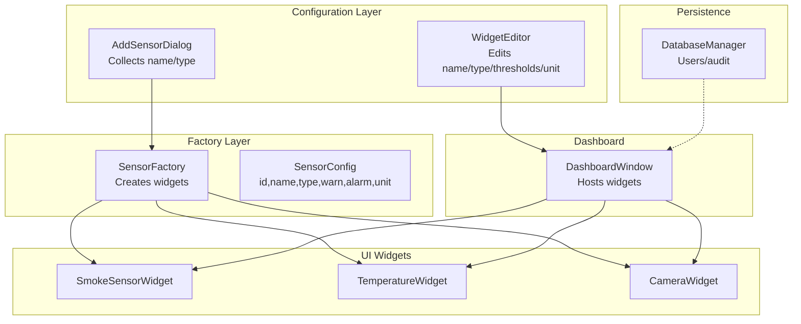
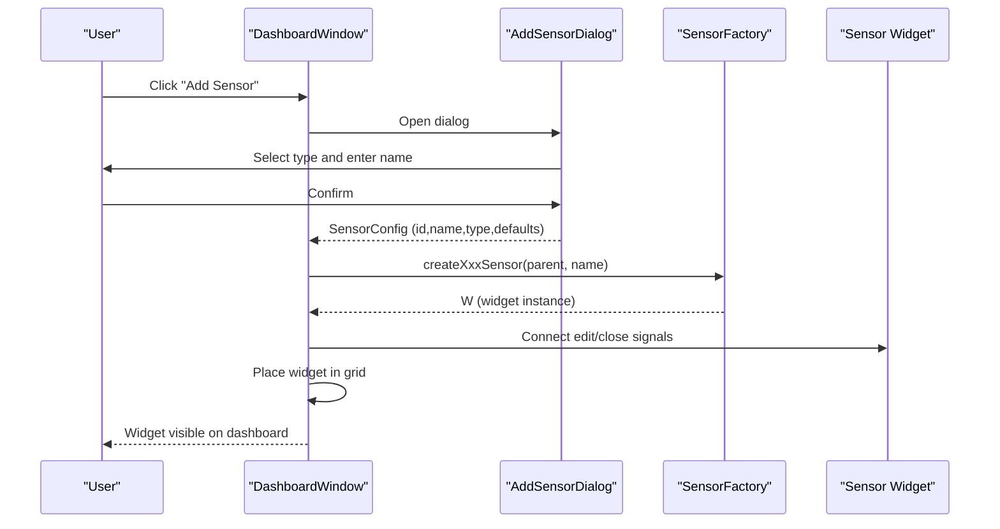
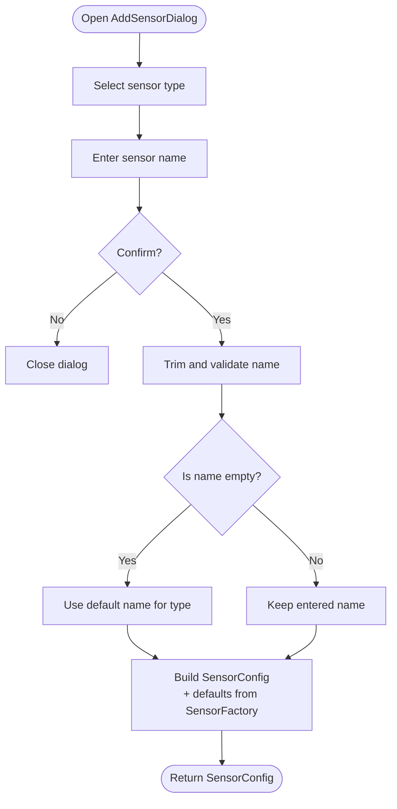
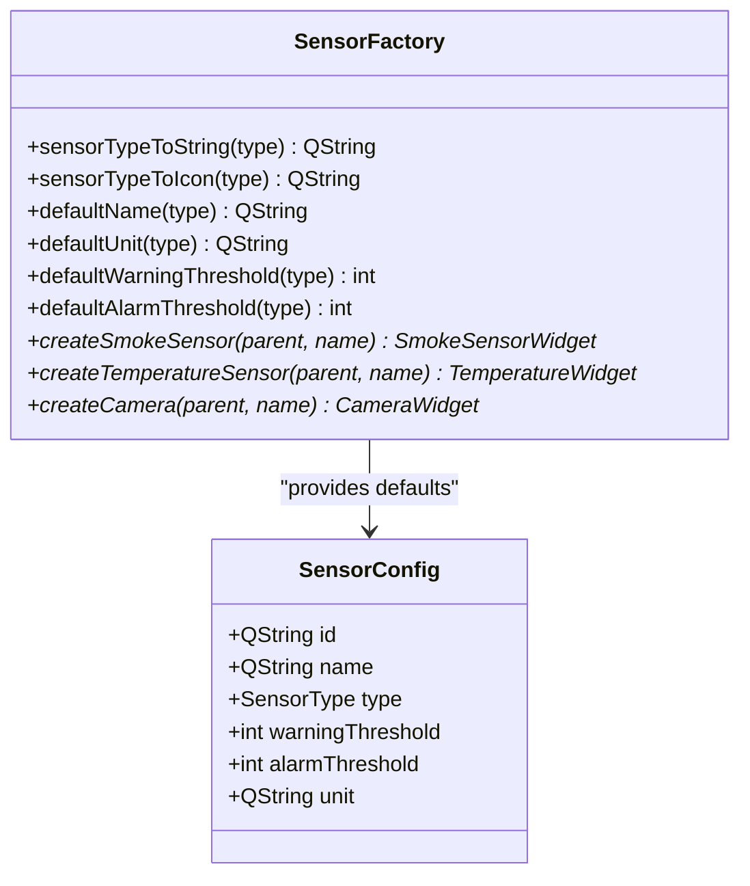
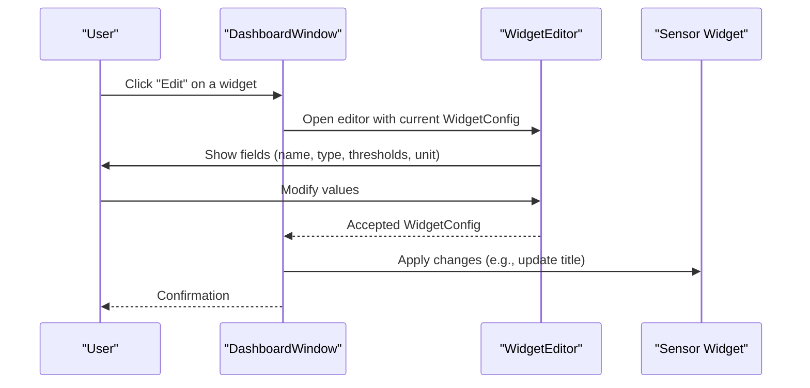
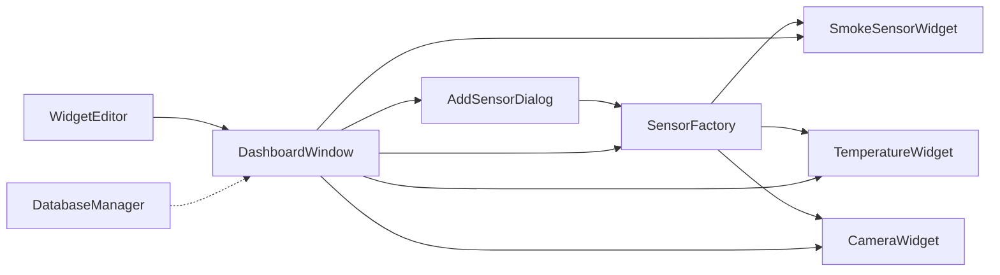

# Sensor Configuration and Management

<cite>
**Referenced Files in This Document**
- [sensorfactory.h](file://sensorfactory.h)
- [sensorfactory.cpp](file://sensorfactory.cpp)
- [addsensordialog.h](file://addsensordialog.h)
- [addsensordialog.cpp](file://addsensordialog.cpp)
- [widgeteditor.h](file://widgeteditor.h)
- [widgeteditor.cpp](file://widgeteditor.cpp)
- [dashboardwindow.h](file://dashboardwindow.h)
- [dashboardwindow.cpp](file://dashboardwindow.cpp)
- [smokesensorwidget.h](file://smokesensorwidget.h)
- [temperaturewidget.h](file://temperaturewidget.h)
- [camerawidget.h](file://camerawidget.h)
- [databasemanager.h](file://databasemanager.h)
- [databasemanager.cpp](file://databasemanager.cpp)
</cite>

## Table of Contents
1. [Introduction](#introduction)
2. [Project Structure](#project-structure)
3. [Core Components](#core-components)
4. [Architecture Overview](#architecture-overview)
5. [Detailed Component Analysis](#detailed-component-analysis)
6. [Dependency Analysis](#dependency-analysis)
7. [Performance Considerations](#performance-considerations)
8. [Troubleshooting Guide](#troubleshooting-guide)
9. [Conclusion](#conclusion)

## Introduction
This document explains the sensor configuration and management system, focusing on:
- The SensorConfig structure and its fields
- The AddSensorDialog interface for creating new sensors
- Threshold management for warning and alarm conditions
- Sensor naming conventions, units, and configuration persistence
- The relationship between configuration and widget creation via the factory pattern
- Practical workflows, validation rules, and error handling during sensor setup

## Project Structure
The sensor subsystem centers around a factory that produces sensor widgets and a dialog that collects configuration inputs. The dashboard integrates newly created widgets into the UI. Supporting components include a widget editor for runtime customization and a database manager for user and audit logging.

**Diagram sources**
- [addsensordialog.cpp:126-147](file://addsensordialog.cpp#L126-L147)
- [sensorfactory.cpp:83-102](file://sensorfactory.cpp#L83-L102)
- [widgeteditor.cpp:119-128](file://widgeteditor.cpp#L119-L128)
- [dashboardwindow.cpp:1155-1252](file://dashboardwindow.cpp#L1155-L1252)
- [databasemanager.cpp:48-64](file://databasemanager.cpp#L48-L64)

**Section sources**
- [sensorfactory.h:19-26](file://sensorfactory.h#L19-L26)
- [sensorfactory.cpp:33-81](file://sensorfactory.cpp#L33-L81)
- [addsensordialog.cpp:23-115](file://addsensordialog.cpp#L23-L115)
- [widgeteditor.cpp:33-117](file://widgeteditor.cpp#L33-L117)
- [dashboardwindow.cpp:1155-1252](file://dashboardwindow.cpp#L1155-L1252)

## Core Components
- SensorConfig: Holds the persistent configuration for a sensor, including identifiers, human-readable name, type, thresholds, and unit.
- SensorFactory: Provides static methods to map types to display strings/icons, defaults for names/units/thresholds, and factory methods to instantiate widgets.
- AddSensorDialog: A modal dialog that lets users select a sensor type and enter a name, then produces a SensorConfig with defaults applied.
- WidgetEditor: A modal dialog for editing widget configurations (name, type, thresholds, unit), with special handling for camera widgets.
- DashboardWindow: Integrates new widgets into the dashboard grid and manages edit/close actions.

**Section sources**
- [sensorfactory.h:19-26](file://sensorfactory.h#L19-L26)
- [sensorfactory.cpp:33-81](file://sensorfactory.cpp#L33-L81)
- [addsensordialog.cpp:126-147](file://addsensordialog.cpp#L126-L147)
- [widgeteditor.cpp:119-128](file://widgeteditor.cpp#L119-L128)
- [dashboardwindow.cpp:1155-1252](file://dashboardwindow.cpp#L1155-L1252)

## Architecture Overview
The system follows a factory pattern to decouple configuration from widget instantiation. The AddSensorDialog captures user intent and delegates to the factory to create the appropriate widget. The DashboardWindow hosts widgets and wires up edit/close actions. The WidgetEditor allows runtime adjustments to widget configuration.

**Diagram sources**
- [dashboardwindow.cpp:1155-1252](file://dashboardwindow.cpp#L1155-L1252)
- [addsensordialog.cpp:126-147](file://addsensordialog.cpp#L126-L147)
- [sensorfactory.cpp:83-102](file://sensorfactory.cpp#L83-L102)

## Detailed Component Analysis

### SensorConfig Structure
SensorConfig encapsulates the essential attributes for a sensor:
- id: Unique identifier string generated at creation time
- name: Human-friendly label for the sensor
- type: Enumerated sensor type
- warningThreshold: Integer threshold for warning state
- alarmThreshold: Integer threshold for alarm state
- unit: String representing measurement unit

Defaults for name, unit, and thresholds are provided per type by SensorFactory.

**Section sources**
- [sensorfactory.h:19-26](file://sensorfactory.h#L19-L26)
- [sensorfactory.cpp:33-81](file://sensorfactory.cpp#L33-L81)

### AddSensorDialog: Creating New Sensors
Responsibilities:
- Presents a list of sensor types with icons
- Captures the sensor name (with a placeholder default based on selected type)
- Validates and normalizes input (fallback to default name if empty)
- Produces a SensorConfig populated with defaults for unit and thresholds

Key behaviors:
- onSensorTypeSelected updates the placeholder name based on the selected type
- onAccept ensures a non-empty name by falling back to the default
- getSensorConfig constructs id, name, type, unit, and thresholds using SensorFactory defaults

**Diagram sources**
- [addsensordialog.cpp:117-132](file://addsensordialog.cpp#L117-L132)
- [addsensordialog.cpp:134-147](file://addsensordialog.cpp#L134-L147)
- [sensorfactory.cpp:33-81](file://sensorfactory.cpp#L33-L81)

**Section sources**
- [addsensordialog.h:10-29](file://addsensordialog.h#L10-L29)
- [addsensordialog.cpp:12-21](file://addsensordialog.cpp#L12-L21)
- [addsensordialog.cpp:117-132](file://addsensordialog.cpp#L117-L132)
- [addsensordialog.cpp:134-147](file://addsensordialog.cpp#L134-L147)

### SensorFactory: Defaults and Factory Methods
Provides:
- Type-to-string and icon mapping for UI presentation
- Default naming convention per type
- Default unit per type
- Default warning and alarm thresholds per type
- Factory methods to create specific widget instances

Naming conventions:
- Default names are localized and follow a consistent pattern per type

Units:
- Percent (%), Celsius (°C), parts per million (ppm), parts per billion (ppb), and empty for camera

Thresholds:
- Per-type integer defaults for warning and alarm boundaries

**Diagram sources**
- [sensorfactory.h:28-40](file://sensorfactory.h#L28-L40)
- [sensorfactory.cpp:7-18](file://sensorfactory.cpp#L7-L18)
- [sensorfactory.cpp:20-31](file://sensorfactory.cpp#L20-L31)
- [sensorfactory.cpp:33-81](file://sensorfactory.cpp#L33-L81)
- [sensorfactory.cpp:83-102](file://sensorfactory.cpp#L83-L102)

**Section sources**
- [sensorfactory.h:10-17](file://sensorfactory.h#L10-L17)
- [sensorfactory.cpp:33-81](file://sensorfactory.cpp#L33-L81)
- [sensorfactory.cpp:83-102](file://sensorfactory.cpp#L83-L102)

### WidgetEditor: Runtime Configuration Editing
Purpose:
- Edit a WidgetConfig (name, type, thresholds, unit, enabled flag)
- Special handling for camera mode (disables threshold editing)

Behavior:
- Pre-populates fields from an existing configuration
- Hides threshold controls when editing a camera widget
- Returns the modified configuration upon acceptance

**Diagram sources**
- [widgeteditor.cpp:12-31](file://widgeteditor.cpp#L12-L31)
- [widgeteditor.cpp:33-117](file://widgeteditor.cpp#L33-L117)
- [widgeteditor.cpp:119-128](file://widgeteditor.cpp#L119-L128)

**Section sources**
- [widgeteditor.h:10-18](file://widgeteditor.h#L10-L18)
- [widgeteditor.cpp:12-31](file://widgeteditor.cpp#L12-L31)
- [widgeteditor.cpp:119-128](file://widgeteditor.cpp#L119-L128)

### DashboardWindow: Integration and Lifecycle
Responsibilities:
- Opens AddSensorDialog and integrates resulting widgets into the dashboard
- Wires edit/close buttons to actions
- Manages widget placement and resizing
- Applies user permissions to enable/disable features

Workflow highlights:
- onAddSensor handles dialog result, creates widget via SensorFactory, connects signals, and places widget in the grid
- Uses absolute positioning with calculated offsets for dynamic sensors

**Section sources**
- [dashboardwindow.h:47-48](file://dashboardwindow.h#L47-L48)
- [dashboardwindow.cpp:1155-1252](file://dashboardwindow.cpp#L1155-L1252)

### Sensor Widgets: Thresholds and Severity
SmokeSensorWidget and TemperatureWidget expose:
- Current value and summary
- Severity state (Normal, Warning, Alarm)
- Edit and Close buttons
- Thresholds used to compute severity

These widgets maintain internal thresholds and compute severity based on measured values.

**Section sources**
- [smokesensorwidget.h:14-52](file://smokesensorwidget.h#L14-L52)
- [temperaturewidget.h:14-53](file://temperaturewidget.h#L14-L53)

### Persistence and Security Context
While the primary persistence shown is for user accounts and audit logs, sensor configuration is primarily in-memory and instantiated at runtime. The database manager supports:
- Initializing the database
- Creating default users
- Authenticating users
- Logging actions

This underpins role-based access that can influence sensor-related UI availability.

**Section sources**
- [databasemanager.h:34-87](file://databasemanager.h#L34-L87)
- [databasemanager.cpp:21-41](file://databasemanager.cpp#L21-L41)
- [databasemanager.cpp:117-135](file://databasemanager.cpp#L117-L135)
- [databasemanager.cpp:158-198](file://databasemanager.cpp#L158-L198)
- [databasemanager.cpp:309-319](file://databasemanager.cpp#L309-L319)

## Dependency Analysis
The following diagram shows key dependencies among components involved in sensor configuration and widget creation.

**Diagram sources**
- [addsensordialog.cpp:126-147](file://addsensordialog.cpp#L126-L147)
- [sensorfactory.cpp:83-102](file://sensorfactory.cpp#L83-L102)
- [dashboardwindow.cpp:1155-1252](file://dashboardwindow.cpp#L1155-L1252)
- [widgeteditor.cpp:119-128](file://widgeteditor.cpp#L119-L128)
- [databasemanager.cpp:48-64](file://databasemanager.cpp#L48-L64)

**Section sources**
- [sensorfactory.h:28-40](file://sensorfactory.h#L28-L40)
- [addsensordialog.h:3](file://addsensordialog.h#L3))
- [dashboardwindow.h:67-71](file://dashboardwindow.h#L67-L71)

## Performance Considerations
- Factory method calls are lightweight; thresholds and defaults are resolved via simple switch statements.
- Dialogs are modal and short-lived; avoid heavy operations in constructors.
- Widget instantiation occurs on demand; defer expensive initialization until the widget is shown.
- Dashboard placement uses simple arithmetic for positions; keep the number of dynamic sensors manageable to avoid layout overhead.

## Troubleshooting Guide
Common issues and resolutions:
- Empty sensor name after adding:
  - The dialog falls back to a default name derived from the selected type. Verify the default name mapping in SensorFactory.
  - See [sensorfactory.cpp:33-44](file://sensorfactory.cpp#L33-L44).
- Unexpected unit or thresholds:
  - Ensure the selected type matches the intended sensor. Defaults are type-specific.
  - See [sensorfactory.cpp:46-81](file://sensorfactory.cpp#L46-L81).
- Widget not appearing on dashboard:
  - Confirm the dialog was accepted and the factory returned a valid widget pointer.
  - Check signal connections for edit/close actions.
  - See [dashboardwindow.cpp:1155-1252](file://dashboardwindow.cpp#L1155-L1252).
- Database connection errors:
  - Review the database manager’s initialization and error signaling.
  - See [databasemanager.cpp:48-64](file://databasemanager.cpp#L48-L64).
- Widget editor not updating widget:
  - Ensure the editor returns a modified configuration and the dashboard applies it (e.g., setting the widget title).
  - See [widgeteditor.cpp:119-128](file://widgeteditor.cpp#L119-L128) and [dashboardwindow.cpp:752-761](file://dashboardwindow.cpp#L752-L761).

**Section sources**
- [sensorfactory.cpp:33-44](file://sensorfactory.cpp#L33-L44)
- [sensorfactory.cpp:46-81](file://sensorfactory.cpp#L46-L81)
- [dashboardwindow.cpp:1155-1252](file://dashboardwindow.cpp#L1155-L1252)
- [databasemanager.cpp:48-64](file://databasemanager.cpp#L48-L64)
- [widgeteditor.cpp:119-128](file://widgeteditor.cpp#L119-L128)
- [dashboardwindow.cpp:752-761](file://dashboardwindow.cpp#L752-L761)

## Conclusion
The sensor configuration and management system cleanly separates concerns:
- AddSensorDialog captures user intent and produces a validated SensorConfig
- SensorFactory centralizes defaults and widget instantiation
- DashboardWindow orchestrates widget lifecycle and user interactions
- WidgetEditor enables runtime customization
- DatabaseManager supports user authentication and auditing

This design yields predictable workflows, clear validation rules, and extensible defaults for new sensor types.