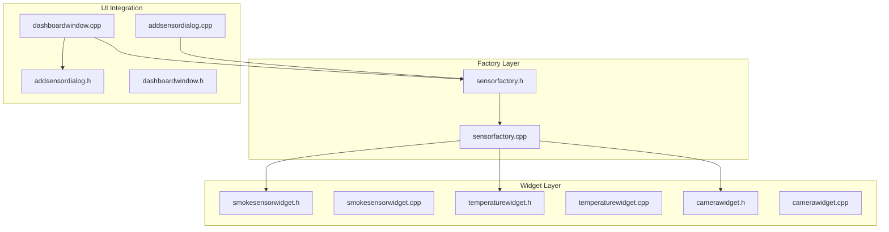
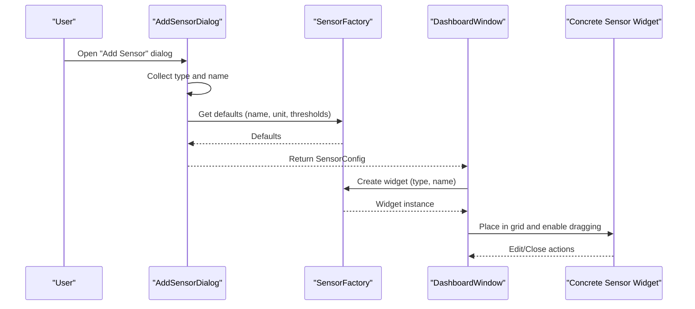
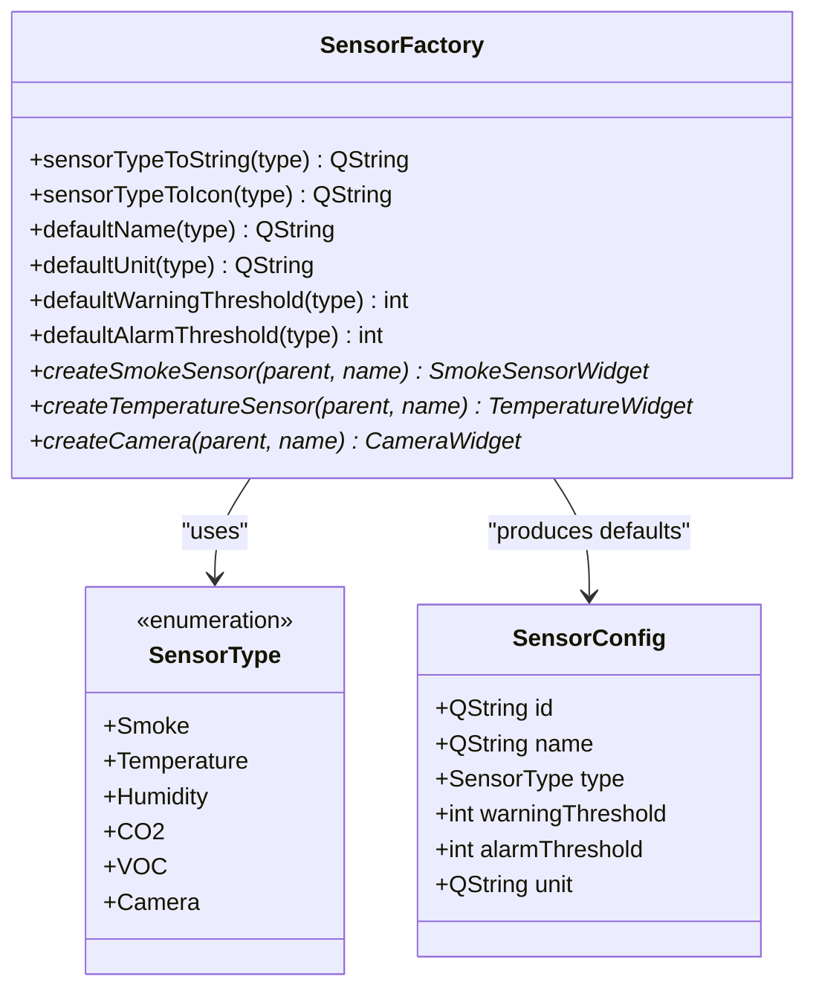
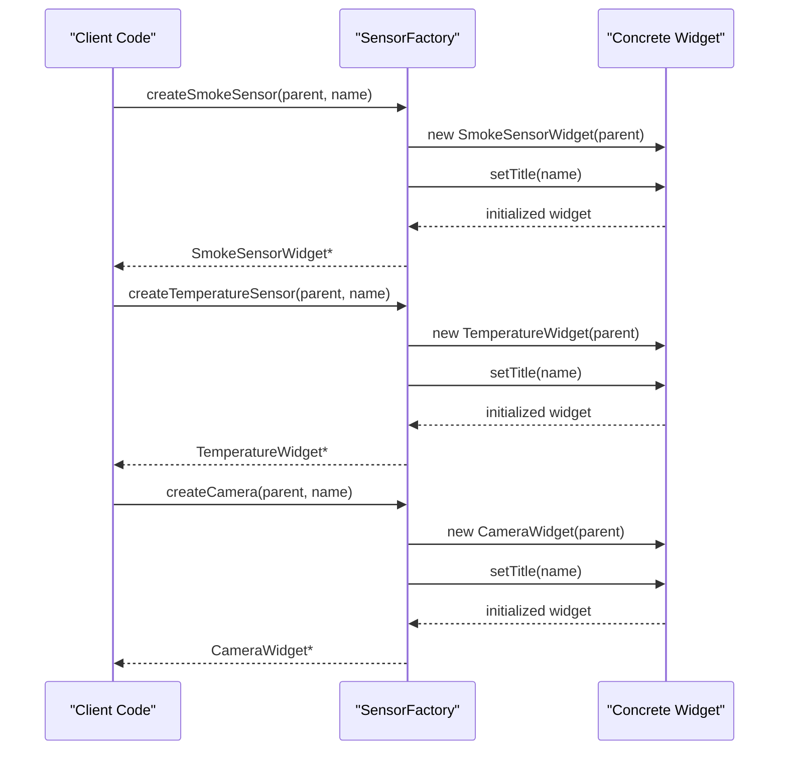
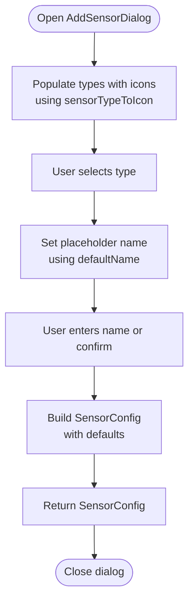
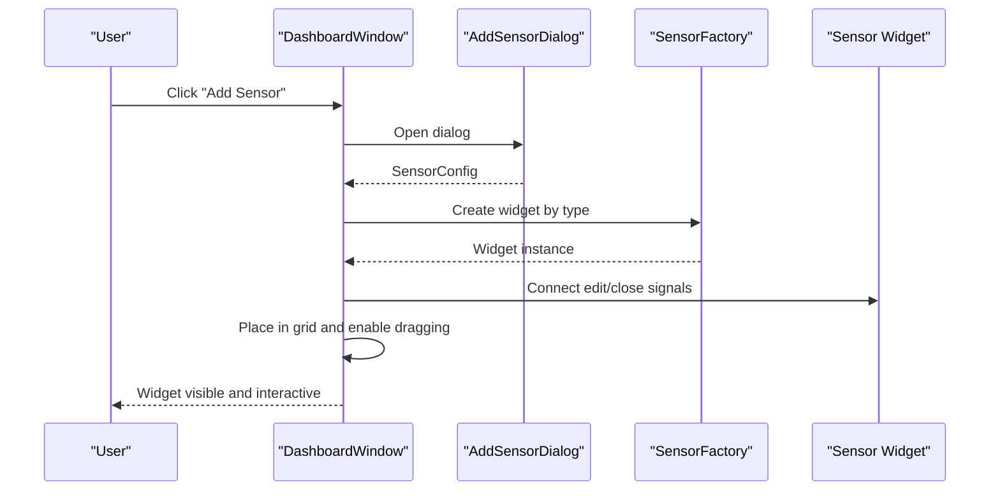
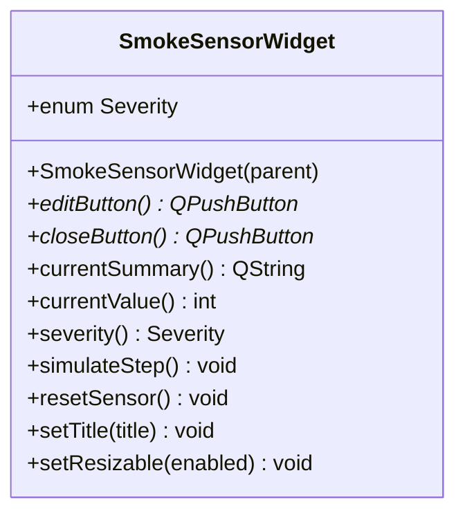
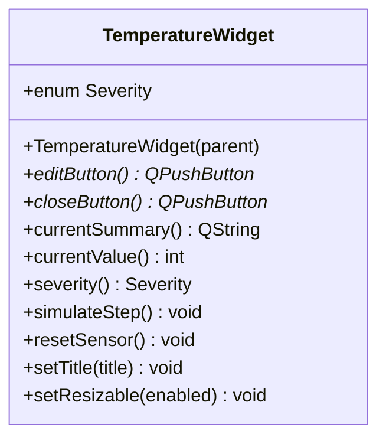
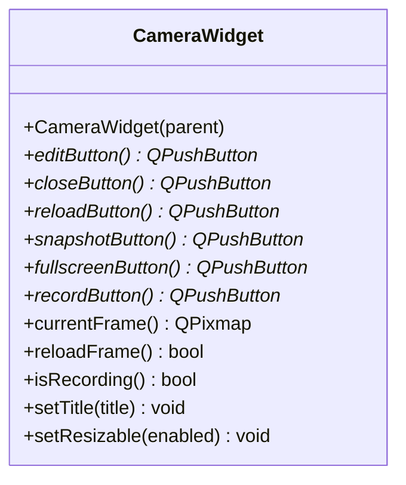
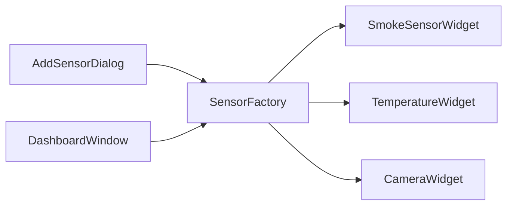

# Sensor Factory Pattern Implementation

<cite>
**Referenced Files in This Document**
- [sensorfactory.h](file://sensorfactory.h)
- [sensorfactory.cpp](file://sensorfactory.cpp)
- [smokesensorwidget.h](file://smokesensorwidget.h)
- [smokesensorwidget.cpp](file://smokesensorwidget.cpp)
- [temperaturewidget.h](file://temperaturewidget.h)
- [temperaturewidget.cpp](file://temperaturewidget.cpp)
- [camerawidget.h](file://camerawidget.h)
- [camerawidget.cpp](file://camerawidget.cpp)
- [addsensordialog.h](file://addsensordialog.h)
- [addsensordialog.cpp](file://addsensordialog.cpp)
- [dashboardwindow.h](file://dashboardwindow.h)
- [dashboardwindow.cpp](file://dashboardwindow.cpp)
</cite>

## Table of Contents
1. [Introduction](#introduction)
2. [Project Structure](#project-structure)
3. [Core Components](#core-components)
4. [Architecture Overview](#architecture-overview)
5. [Detailed Component Analysis](#detailed-component-analysis)
6. [Dependency Analysis](#dependency-analysis)
7. [Performance Considerations](#performance-considerations)
8. [Troubleshooting Guide](#troubleshooting-guide)
9. [Conclusion](#conclusion)

## Introduction
This document explains the SensorFactory pattern implementation used to create specialized sensor widgets in the SurveillanceQT project. It covers the factory method pattern for constructing SmokeSensorWidget, TemperatureWidget, and CameraWidget instances, the SensorType enumeration and its mapping to sensor categories, the SensorConfig structure for configuration management, and the static utility methods that provide defaults for names, units, thresholds, icons, and human-readable type names. Practical examples demonstrate how the factory integrates with the dashboard system via the AddSensorDialog and DashboardWindow.

## Project Structure
The sensor factory pattern spans several files:
- A central factory interface and implementation define creation methods and utility helpers.
- Specialized sensor widgets encapsulate UI and behavior for smoke, temperature, and camera monitoring.
- An add-sensor dialog collects user input and produces SensorConfig objects.
- The dashboard orchestrates widget placement, editing, and lifecycle.

**Diagram sources**
- [sensorfactory.h:10-40](file://sensorfactory.h#L10-L40)
- [sensorfactory.cpp:1-103](file://sensorfactory.cpp#L1-L103)
- [smokesensorwidget.h:10-53](file://smokesensorwidget.h#L10-L53)
- [temperaturewidget.h:11-54](file://temperaturewidget.h#L11-L54)
- [camerawidget.h:9-40](file://camerawidget.h#L9-L40)
- [addsensordialog.h:10-30](file://addsensordialog.h#L10-L30)
- [addsensordialog.cpp:12-148](file://addsensordialog.cpp#L12-L148)
- [dashboardwindow.h:19-99](file://dashboardwindow.h#L19-L99)
- [dashboardwindow.cpp:1155-1252](file://dashboardwindow.cpp#L1155-L1252)

**Section sources**
- [sensorfactory.h:10-40](file://sensorfactory.h#L10-L40)
- [sensorfactory.cpp:1-103](file://sensorfactory.cpp#L1-L103)
- [addsensordialog.cpp:23-148](file://addsensordialog.cpp#L23-L148)
- [dashboardwindow.cpp:1155-1252](file://dashboardwindow.cpp#L1155-L1252)

## Core Components
- SensorType enumeration defines supported sensor categories: Smoke, Temperature, Humidity, CO2, VOC, and Camera.
- SensorConfig structure carries configuration metadata: id, name, type, warningThreshold, alarmThreshold, and unit.
- SensorFactory provides:
  - Static conversion utilities: sensorTypeToString, sensorTypeToIcon, defaultName, defaultUnit, defaultWarningThreshold, defaultAlarmThreshold.
  - Factory methods: createSmokeSensor, createTemperatureSensor, createCamera.

These components form a cohesive factory that centralizes creation and default configuration logic, enabling consistent widget instantiation across the application.

**Section sources**
- [sensorfactory.h:10-26](file://sensorfactory.h#L10-L26)
- [sensorfactory.h:28-40](file://sensorfactory.h#L28-L40)
- [sensorfactory.cpp:7-18](file://sensorfactory.cpp#L7-L18)
- [sensorfactory.cpp:20-31](file://sensorfactory.cpp#L20-L31)
- [sensorfactory.cpp:33-44](file://sensorfactory.cpp#L33-L44)
- [sensorfactory.cpp:46-57](file://sensorfactory.cpp#L46-L57)
- [sensorfactory.cpp:59-81](file://sensorfactory.cpp#L59-L81)

## Architecture Overview
The factory pattern decouples client code from concrete widget construction. Clients request widgets through SensorFactory, which returns specialized instances configured with sensible defaults. The AddSensorDialog gathers user preferences and delegates creation to the factory, while the DashboardWindow manages widget placement and interactions.

**Diagram sources**
- [addsensordialog.cpp:126-147](file://addsensordialog.cpp#L126-L147)
- [sensorfactory.cpp:33-81](file://sensorfactory.cpp#L33-L81)
- [dashboardwindow.cpp:1155-1252](file://dashboardwindow.cpp#L1155-L1252)

## Detailed Component Analysis

### SensorFactory Class
The SensorFactory centralizes creation and default configuration logic:
- Conversion utilities map SensorType to localized strings and emoji icons.
- Default providers supply human-friendly names, units, and threshold values per sensor category.
- Factory methods construct and initialize specialized widgets with a given name.

**Diagram sources**
- [sensorfactory.h:10-40](file://sensorfactory.h#L10-L40)
- [sensorfactory.h:19-26](file://sensorfactory.h#L19-L26)

**Section sources**
- [sensorfactory.h:10-40](file://sensorfactory.h#L10-L40)
- [sensorfactory.cpp:7-18](file://sensorfactory.cpp#L7-L18)
- [sensorfactory.cpp:20-31](file://sensorfactory.cpp#L20-L31)
- [sensorfactory.cpp:33-81](file://sensorfactory.cpp#L33-L81)

### SensorType Enumeration and Categories
SensorType enumerates supported sensor categories. The factory maps each category to:
- Human-readable labels via sensorTypeToString.
- Emoji icons via sensorTypeToIcon.
- Default names, units, and thresholds via dedicated methods.

This design supports extensibility: adding a new category requires updating the enum and the switch statements in SensorFactory.

**Section sources**
- [sensorfactory.h:10-17](file://sensorfactory.h#L10-L17)
- [sensorfactory.cpp:7-18](file://sensorfactory.cpp#L7-L18)
- [sensorfactory.cpp:20-31](file://sensorfactory.cpp#L20-L31)

### SensorConfig Structure
SensorConfig encapsulates configuration metadata produced by AddSensorDialog and consumed by the factory:
- id: unique identifier for persistence or identification.
- name: display label for the widget.
- type: category determining widget behavior and defaults.
- warningThreshold and alarmThreshold: numeric thresholds for severity transitions.
- unit: physical unit for display (e.g., percent, Celsius, ppm).

**Section sources**
- [sensorfactory.h:19-26](file://sensorfactory.h#L19-L26)
- [addsensordialog.cpp:134-147](file://addsensordialog.cpp#L134-L147)

### Factory Methods for Creating Sensors
The factory exposes three creation methods:
- createSmokeSensor(parent, name): constructs a smoke monitor widget and sets its title.
- createTemperatureSensor(parent, name): constructs a temperature monitor widget and sets its title.
- createCamera(parent, name): constructs a camera viewer widget and sets its title.

Each method initializes the widget with a title and returns a pointer to the newly created instance.

**Diagram sources**
- [sensorfactory.cpp:83-102](file://sensorfactory.cpp#L83-L102)
- [smokesensorwidget.h:20-32](file://smokesensorwidget.h#L20-L32)
- [temperaturewidget.h:21-33](file://temperaturewidget.h#L21-L33)
- [camerawidget.h:13-25](file://camerawidget.h#L13-L25)

**Section sources**
- [sensorfactory.cpp:83-102](file://sensorfactory.cpp#L83-L102)

### Static Utility Methods for Defaults and Icons
The factory provides static helpers to standardize defaults:
- sensorTypeToString: returns localized category names.
- sensorTypeToIcon: returns emoji icons for UI lists.
- defaultName: returns a default display name per category.
- defaultUnit: returns a default unit string per category.
- defaultWarningThreshold and defaultAlarmThreshold: return category-specific thresholds.

These methods ensure consistent behavior across dialogs, dashboards, and widgets.

**Section sources**
- [sensorfactory.cpp:7-18](file://sensorfactory.cpp#L7-L18)
- [sensorfactory.cpp:20-31](file://sensorfactory.cpp#L20-L31)
- [sensorfactory.cpp:33-44](file://sensorfactory.cpp#L33-L44)
- [sensorfactory.cpp:46-57](file://sensorfactory.cpp#L46-L57)
- [sensorfactory.cpp:59-81](file://sensorfactory.cpp#L59-L81)

### AddSensorDialog Integration
AddSensorDialog collects user input and produces SensorConfig:
- Populates a list of sensor types with icons using sensorTypeToIcon.
- Sets placeholder text for the name field using defaultName.
- On acceptance, constructs SensorConfig with type, name, unit, and thresholds using defaultUnit, defaultWarningThreshold, and defaultAlarmThreshold.
- Assigns a generated id for uniqueness.

**Diagram sources**
- [addsensordialog.cpp:66-132](file://addsensordialog.cpp#L66-L132)
- [addsensordialog.cpp:134-147](file://addsensordialog.cpp#L134-L147)
- [sensorfactory.cpp:20-31](file://sensorfactory.cpp#L20-L31)
- [sensorfactory.cpp:33-44](file://sensorfactory.cpp#L33-L44)
- [sensorfactory.cpp:46-81](file://sensorfactory.cpp#L46-L81)

**Section sources**
- [addsensordialog.cpp:23-147](file://addsensordialog.cpp#L23-L147)

### Dashboard Integration and Widget Lifecycle
DashboardWindow coordinates sensor widget lifecycle:
- Presents AddSensorDialog and receives SensorConfig.
- Creates the appropriate widget via SensorFactory based on SensorConfig.type.
- Connects edit and close buttons to handlers.
- Places widgets in an absolute-positioned container, enabling drag-and-drop and resizing controls.
- Manages global enable/disable state for all interactive widgets, including dynamically added sensors.

**Diagram sources**
- [dashboardwindow.cpp:1155-1252](file://dashboardwindow.cpp#L1155-L1252)
- [sensorfactory.cpp:83-102](file://sensorfactory.cpp#L83-L102)

**Section sources**
- [dashboardwindow.cpp:1155-1252](file://dashboardwindow.cpp#L1155-L1252)

### SmokeSensorWidget Details
SmokeSensorWidget displays smoke concentration with:
- A chart widget rendering historical values.
- Severity transitions based on current value versus thresholds.
- Timer-driven simulation of readings.
- Edit and close button accessors for integration with the dashboard.

**Diagram sources**
- [smokesensorwidget.h:10-53](file://smokesensorwidget.h#L10-L53)

**Section sources**
- [smokesensorwidget.h:10-53](file://smokesensorwidget.h#L10-L53)
- [smokesensorwidget.cpp:157-378](file://smokesensorwidget.cpp#L157-L378)

### TemperatureWidget Details
TemperatureWidget displays temperature with:
- A chart widget rendering historical values.
- Severity transitions based on current value versus thresholds.
- Timer-driven simulation of readings.
- Edit and close button accessors for integration with the dashboard.

**Diagram sources**
- [temperaturewidget.h:11-54](file://temperaturewidget.h#L11-L54)

**Section sources**
- [temperaturewidget.h:11-54](file://temperaturewidget.h#L11-L54)
- [temperaturewidget.cpp:148-368](file://temperaturewidget.cpp#L148-L368)

### CameraWidget Details
CameraWidget displays a live-like camera feed with:
- A stacked layout for image and overlay controls.
- Record, snapshot, fullscreen, and reload actions.
- Title setting and basic frame reloading.

**Diagram sources**
- [camerawidget.h:9-40](file://camerawidget.h#L9-L40)

**Section sources**
- [camerawidget.h:9-40](file://camerawidget.h#L9-L40)
- [camerawidget.cpp:85-249](file://camerawidget.cpp#L85-L249)

## Dependency Analysis
The factory pattern reduces coupling by centralizing creation logic:
- AddSensorDialog depends on SensorFactory for defaults and creation.
- DashboardWindow depends on SensorFactory to instantiate widgets based on SensorConfig.
- Widgets depend on their own internal logic and are returned by the factory without further dependencies on the dialog or dashboard.

**Diagram sources**
- [addsensordialog.cpp:126-147](file://addsensordialog.cpp#L126-L147)
- [dashboardwindow.cpp:1155-1252](file://dashboardwindow.cpp#L1155-L1252)
- [sensorfactory.cpp:83-102](file://sensorfactory.cpp#L83-L102)

**Section sources**
- [addsensordialog.cpp:126-147](file://addsensordialog.cpp#L126-L147)
- [dashboardwindow.cpp:1155-1252](file://dashboardwindow.cpp#L1155-L1252)
- [sensorfactory.cpp:83-102](file://sensorfactory.cpp#L83-L102)

## Performance Considerations
- Factory methods are lightweight constructors; overhead is minimal.
- Default providers use simple switch statements; complexity is O(1).
- Widget timers drive periodic updates; ensure timer intervals balance responsiveness and CPU usage.
- Absolute positioning in the dashboard avoids expensive layout recalculations but requires manual management of widget bounds.

## Troubleshooting Guide
- If a new SensorType is added, ensure:
  - The enum includes the new value.
  - All switch statements in SensorFactory cover the new type.
  - AddSensorDialog populates the list with an icon via sensorTypeToIcon.
- If widgets do not appear after creation:
  - Verify the dashboard places the widget in the container and calls show().
  - Confirm edit/close button connections are established.
- If defaults are incorrect:
  - Check defaultName, defaultUnit, defaultWarningThreshold, and defaultAlarmThreshold for the intended type.
- If icons are missing in the dialog:
  - Ensure sensorTypeToIcon returns a valid emoji for the selected type.

**Section sources**
- [sensorfactory.cpp:7-18](file://sensorfactory.cpp#L7-L18)
- [sensorfactory.cpp:20-31](file://sensorfactory.cpp#L20-L31)
- [sensorfactory.cpp:33-81](file://sensorfactory.cpp#L33-L81)
- [dashboardwindow.cpp:1155-1252](file://dashboardwindow.cpp#L1155-L1252)

## Conclusion
The SensorFactory pattern cleanly separates creation logic from widget implementations, standardizes defaults, and integrates seamlessly with the dashboard and dialog systems. By centralizing configuration and creation, the pattern improves maintainability, consistency, and extensibility across sensor categories.