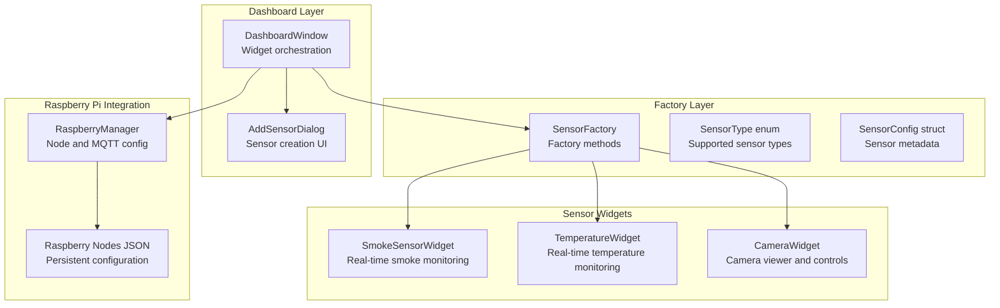
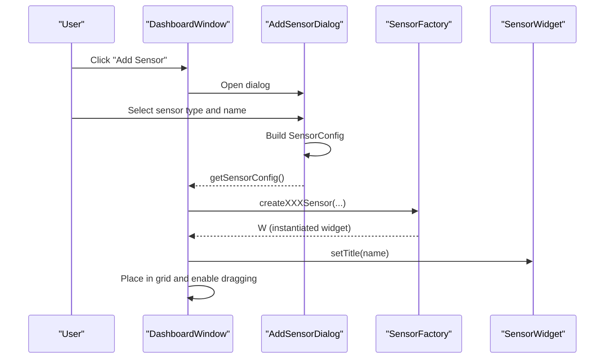
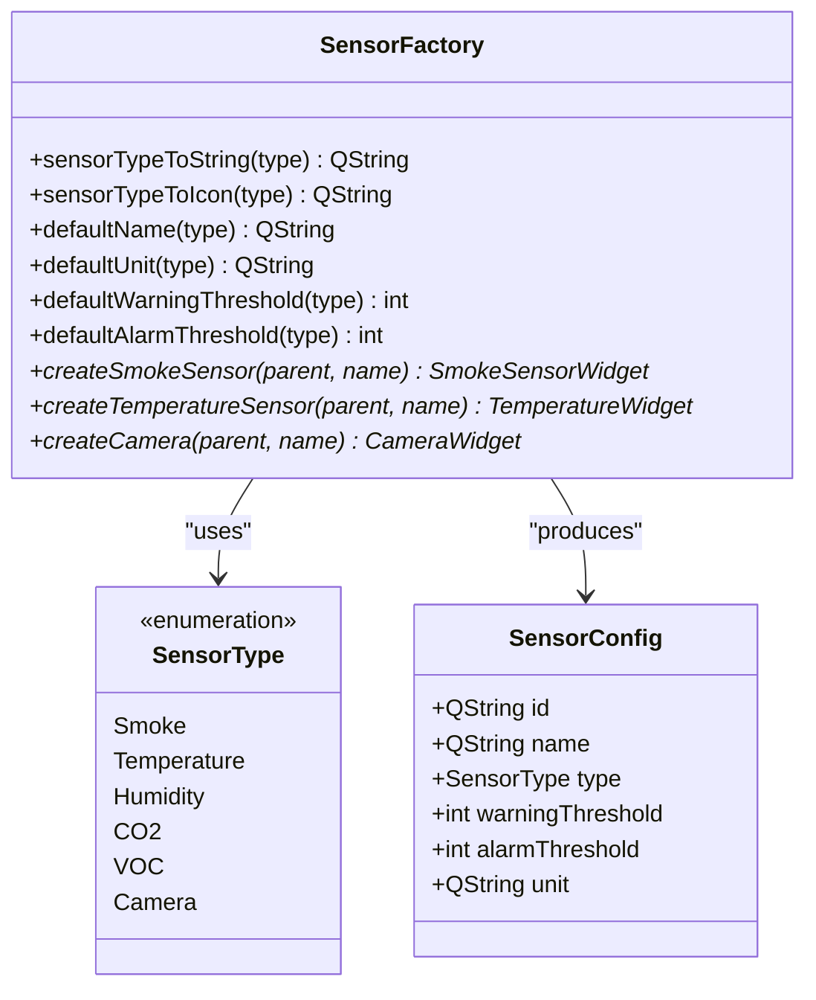
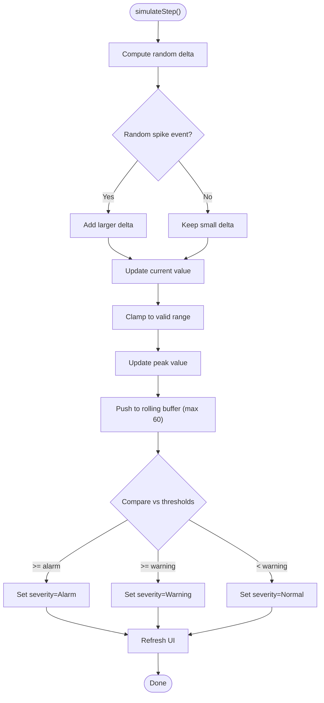
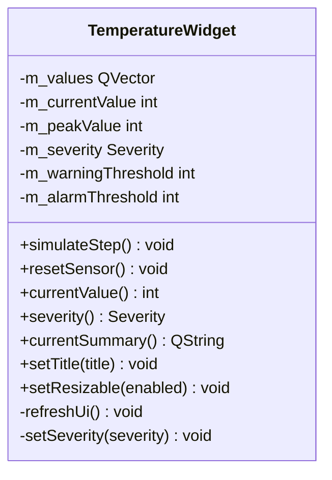
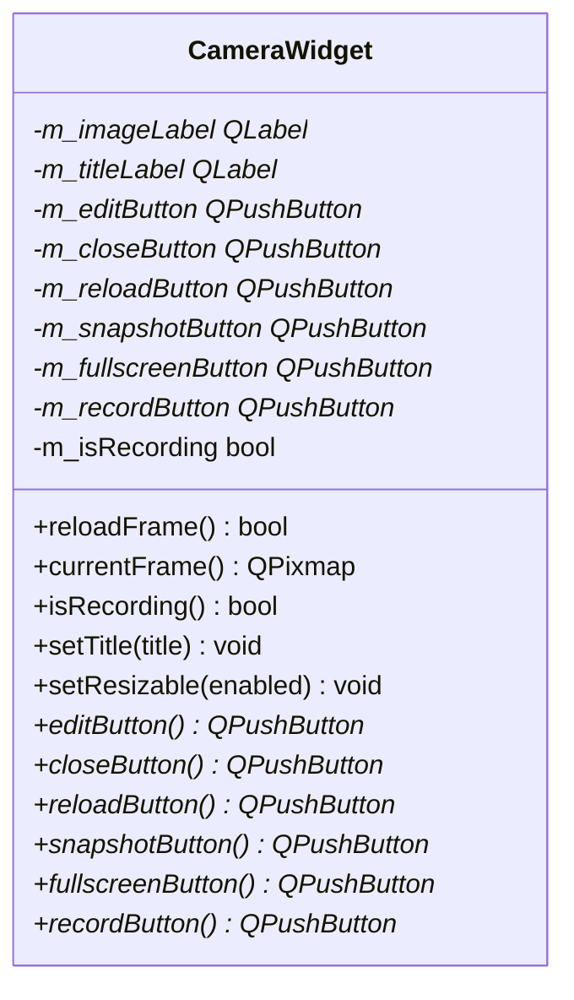
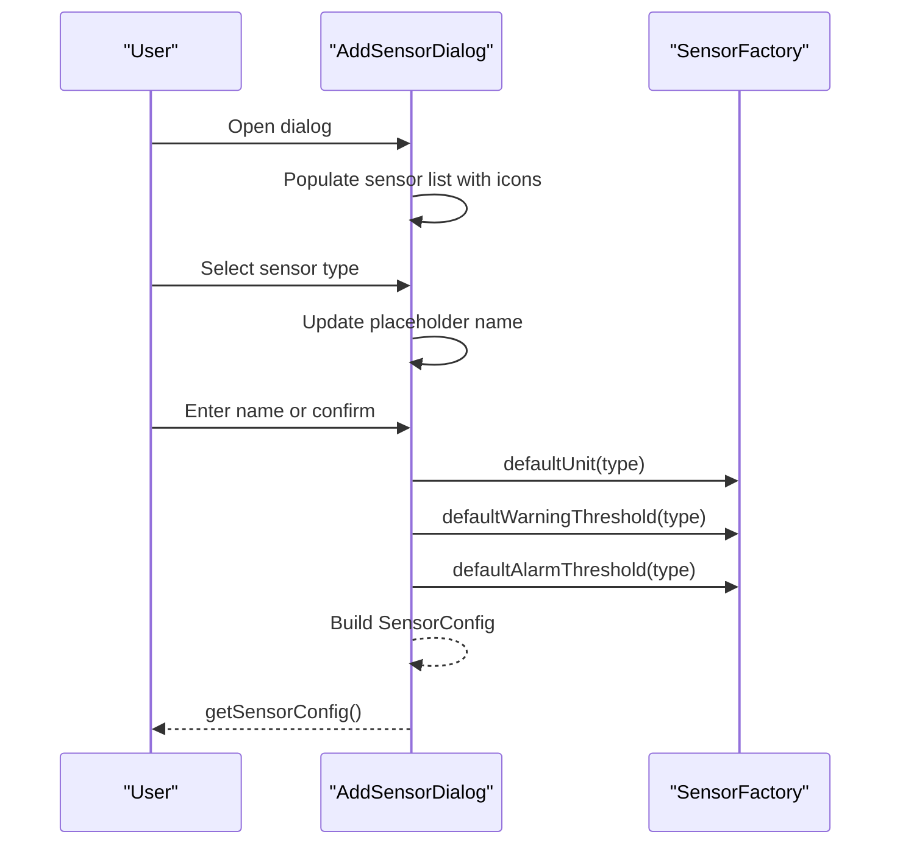
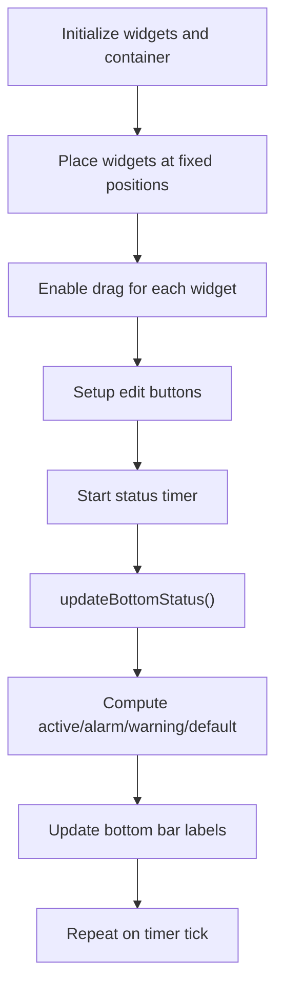
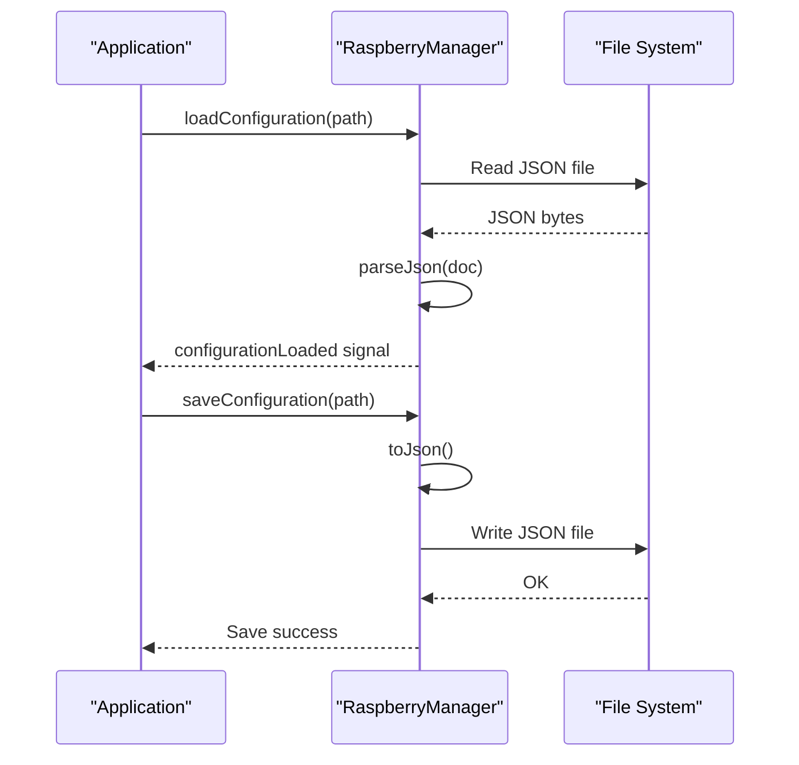
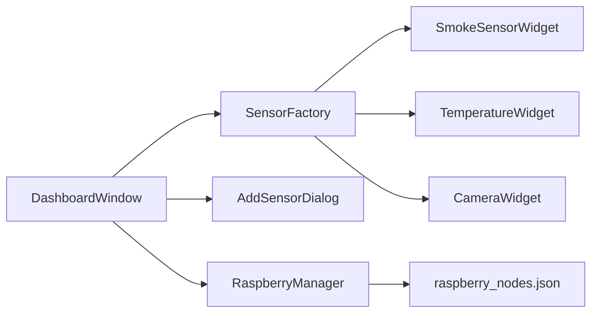

# Sensor Management System

<cite>
**Referenced Files in This Document**
- [sensorfactory.h](file://sensorfactory.h)
- [sensorfactory.cpp](file://sensorfactory.cpp)
- [smokesensorwidget.h](file://smokesensorwidget.h)
- [smokesensorwidget.cpp](file://smokesensorwidget.cpp)
- [temperaturewidget.h](file://temperaturewidget.h)
- [temperaturewidget.cpp](file://temperaturewidget.cpp)
- [camerawidget.h](file://camerawidget.h)
- [camerawidget.cpp](file://camerawidget.cpp)
- [addsensordialog.h](file://addsensordialog.h)
- [addsensordialog.cpp](file://addsensordialog.cpp)
- [dashboardwindow.h](file://dashboardwindow.h)
- [dashboardwindow.cpp](file://dashboardwindow.cpp)
- [raspberrymanager.h](file://raspberrymanager.h)
- [raspberrymanager.cpp](file://raspberrymanager.cpp)
- [raspberry_nodes.json](file://config/raspberry_nodes.json)
</cite>

## Table of Contents
1. [Introduction](#introduction)
2. [Project Structure](#project-structure)
3. [Core Components](#core-components)
4. [Architecture Overview](#architecture-overview)
5. [Detailed Component Analysis](#detailed-component-analysis)
6. [Dependency Analysis](#dependency-analysis)
7. [Performance Considerations](#performance-considerations)
8. [Troubleshooting Guide](#troubleshooting-guide)
9. [Conclusion](#conclusion)

## Introduction
This document explains the sensor management system that powers real-time monitoring of environmental conditions and camera surveillance within a Qt-based dashboard. It focuses on the factory pattern used to instantiate specialized sensor widgets, configuration management for sensors and nodes, threshold-based alerting, and integration with Raspberry Pi sensor networks via MQTT. The system supports:
- Environmental sensors: temperature, humidity, smoke, CO2, VOC
- Camera surveillance
- Real-time data simulation and visualization
- Threshold-based alerting with visual severity states
- Sensor configuration dialogs and persistent storage

## Project Structure
The sensor management system is organized around a factory-driven architecture with dedicated widgets for each sensor type, a dashboard for orchestration, and a manager for Raspberry Pi node and MQTT configuration.

**Diagram sources**
- [dashboardwindow.cpp:71-244](file://dashboardwindow.cpp#L71-L244)
- [sensorfactory.cpp:83-102](file://sensorfactory.cpp#L83-L102)
- [smokesensorwidget.cpp:157-237](file://smokesensorwidget.cpp#L157-L237)
- [temperaturewidget.cpp:148-227](file://temperaturewidget.cpp#L148-L227)
- [camerawidget.cpp:85-180](file://camerawidget.cpp#L85-L180)
- [raspberrymanager.cpp:24-52](file://raspberrymanager.cpp#L24-L52)
- [raspberry_nodes.json](file://config/raspberry_nodes.json)

**Section sources**
- [dashboardwindow.cpp:71-244](file://dashboardwindow.cpp#L71-L244)
- [sensorfactory.h:10-40](file://sensorfactory.h#L10-L40)
- [sensorfactory.cpp:83-102](file://sensorfactory.cpp#L83-L102)
- [raspberrymanager.h:10-107](file://raspberrymanager.h#L10-L107)

## Core Components
- SensorFactory: Centralized factory for creating sensor widgets and providing default configurations, units, and thresholds per sensor type.
- Sensor widgets: Specialized widgets for smoke, temperature, and camera with built-in real-time simulation, charts, and severity alerts.
- AddSensorDialog: UI for selecting sensor type and naming, generating a SensorConfig ready for instantiation.
- DashboardWindow: Hosts sensor widgets, manages drag-and-drop, resizing, and status reporting.
- RaspberryManager: Loads/stores MQTT and node configuration, parses sensor definitions, and exposes broker/app settings.

Key responsibilities:
- Factory encapsulates creation and defaults for consistent UX and behavior.
- Widgets encapsulate UI rendering, data simulation, and alert thresholds.
- Dialog centralizes configuration input and produces SensorConfig objects.
- Manager persists and loads node/sensor definitions and MQTT settings.

**Section sources**
- [sensorfactory.h:19-40](file://sensorfactory.h#L19-L40)
- [sensorfactory.cpp:7-18](file://sensorfactory.cpp#L7-L18)
- [addsensordialog.h:10-30](file://addsensordialog.h#L10-L30)
- [addsensordialog.cpp:126-147](file://addsensordialog.cpp#L126-L147)
- [dashboardwindow.h:67-98](file://dashboardwindow.h#L67-L98)
- [raspberrymanager.h:63-107](file://raspberrymanager.h#L63-L107)

## Architecture Overview
The system follows a layered architecture:
- Presentation: DashboardWindow and sensor widgets render and manage UI.
- Factory: SensorFactory abstracts widget creation and default configuration.
- Configuration: AddSensorDialog and RaspberryManager manage sensor/node definitions and MQTT settings.
- Data flow: Widgets simulate sensor readings and compute severity; Dashboard aggregates status; Manager persists configuration.

**Diagram sources**
- [dashboardwindow.cpp:470-472](file://dashboardwindow.cpp#L470-L472)
- [addsensordialog.cpp:126-147](file://addsensordialog.cpp#L126-L147)
- [sensorfactory.cpp:83-102](file://sensorfactory.cpp#L83-L102)

## Detailed Component Analysis

### SensorFactory: Factory Pattern Implementation
SensorFactory centralizes:
- Mapping SensorType to localized strings, icons, default names, units, and thresholds.
- Creation methods for SmokeSensorWidget, TemperatureWidget, and CameraWidget.

**Diagram sources**
- [sensorfactory.h:10-40](file://sensorfactory.h#L10-L40)
- [sensorfactory.cpp:7-18](file://sensorfactory.cpp#L7-L18)

**Section sources**
- [sensorfactory.h:10-40](file://sensorfactory.h#L10-L40)
- [sensorfactory.cpp:7-18](file://sensorfactory.cpp#L7-L18)
- [sensorfactory.cpp:83-102](file://sensorfactory.cpp#L83-L102)

### SmokeSensorWidget: Real-Time Monitoring and Alerting
SmokeSensorWidget simulates smoke concentration readings, maintains a rolling dataset, and computes severity:
- Severity states: Normal, Warning, Alarm based on thresholds.
- Built-in chart widget renders historical values and threshold lines.
- Timer-driven simulation updates values and triggers UI refresh.

**Diagram sources**
- [smokesensorwidget.cpp:280-307](file://smokesensorwidget.cpp#L280-L307)

**Section sources**
- [smokesensorwidget.h:10-53](file://smokesensorwidget.h#L10-L53)
- [smokesensorwidget.cpp:157-237](file://smokesensorwidget.cpp#L157-L237)
- [smokesensorwidget.cpp:280-307](file://smokesensorwidget.cpp#L280-L307)
- [smokesensorwidget.cpp:318-358](file://smokesensorwidget.cpp#L318-L358)

### TemperatureWidget: Real-Time Monitoring and Alerting
TemperatureWidget mirrors the smoke widget’s pattern with its own thresholds and chart rendering.

**Diagram sources**
- [temperaturewidget.h:11-54](file://temperaturewidget.h#L11-L54)

**Section sources**
- [temperaturewidget.h:11-54](file://temperaturewidget.h#L11-L54)
- [temperaturewidget.cpp:148-227](file://temperaturewidget.cpp#L148-L227)
- [temperaturewidget.cpp:270-297](file://temperaturewidget.cpp#L270-L297)
- [temperaturewidget.cpp:308-348](file://temperaturewidget.cpp#L308-L348)

### CameraWidget: Surveillance Viewer and Controls
CameraWidget provides a viewer with overlay controls for reload, snapshot, fullscreen, record, and editing.

**Diagram sources**
- [camerawidget.h:9-40](file://camerawidget.h#L9-L40)

**Section sources**
- [camerawidget.h:9-40](file://camerawidget.h#L9-L40)
- [camerawidget.cpp:85-180](file://camerawidget.cpp#L85-L180)
- [camerawidget.cpp:225-234](file://camerawidget.cpp#L225-L234)

### AddSensorDialog: Sensor Configuration UI
AddSensorDialog presents a list of sensor types with icons, allows naming, and produces a SensorConfig with defaults applied from SensorFactory.

**Diagram sources**
- [addsensordialog.cpp:23-115](file://addsensordialog.cpp#L23-L115)
- [addsensordialog.cpp:134-147](file://addsensordialog.cpp#L134-L147)
- [sensorfactory.cpp:46-81](file://sensorfactory.cpp#L46-L81)

**Section sources**
- [addsensordialog.h:10-30](file://addsensordialog.h#L10-L30)
- [addsensordialog.cpp:126-147](file://addsensordialog.cpp#L126-L147)
- [sensorfactory.cpp:46-81](file://sensorfactory.cpp#L46-L81)

### DashboardWindow: Widget Orchestration and Status
DashboardWindow hosts sensor widgets, enables dragging/resizing, and aggregates status counts for active, alarm, warning, and default states.

**Diagram sources**
- [dashboardwindow.cpp:71-244](file://dashboardwindow.cpp#L71-L244)
- [dashboardwindow.cpp:574-614](file://dashboardwindow.cpp#L574-L614)

**Section sources**
- [dashboardwindow.h:19-99](file://dashboardwindow.h#L19-L99)
- [dashboardwindow.cpp:71-244](file://dashboardwindow.cpp#L71-L244)
- [dashboardwindow.cpp:574-614](file://dashboardwindow.cpp#L574-L614)

### RaspberryManager: MQTT and Node Configuration
RaspberryManager loads/stores configuration JSON containing broker settings and a list of Raspberry nodes, each with sensors and thresholds. It also exposes convenience methods to convert between string and enum sensor types.

**Diagram sources**
- [raspberrymanager.cpp:24-52](file://raspberrymanager.cpp#L24-L52)
- [raspberrymanager.cpp:211-237](file://raspberrymanager.cpp#L211-L237)

**Section sources**
- [raspberrymanager.h:63-107](file://raspberrymanager.h#L63-L107)
- [raspberrymanager.cpp:24-52](file://raspberrymanager.cpp#L24-L52)
- [raspberrymanager.cpp:181-209](file://raspberrymanager.cpp#L181-L209)
- [raspberrymanager.cpp:211-237](file://raspberrymanager.cpp#L211-L237)
- [raspberry_nodes.json](file://config/raspberry_nodes.json)

## Dependency Analysis
- DashboardWindow depends on SensorFactory for widget creation and on AddSensorDialog for configuration input.
- Sensor widgets depend on internal chart widgets and timers for simulation and rendering.
- RaspberryManager depends on JSON parsing and file I/O for configuration persistence.
- SensorFactory provides defaults consumed by AddSensorDialog and used by widgets.

**Diagram sources**
- [dashboardwindow.cpp:71-244](file://dashboardwindow.cpp#L71-L244)
- [sensorfactory.cpp:83-102](file://sensorfactory.cpp#L83-L102)
- [raspberrymanager.cpp:24-52](file://raspberrymanager.cpp#L24-L52)

**Section sources**
- [dashboardwindow.cpp:71-244](file://dashboardwindow.cpp#L71-L244)
- [sensorfactory.cpp:83-102](file://sensorfactory.cpp#L83-L102)
- [raspberrymanager.cpp:24-52](file://raspberrymanager.cpp#L24-L52)

## Performance Considerations
- Simulation loops: Widgets use timers to periodically update values. Consider adjusting intervals to balance responsiveness and CPU usage.
- Rolling buffers: Limit history length to reduce memory footprint and maintain smooth rendering.
- Rendering: Custom paint routines draw charts; keep repaint regions minimal and avoid unnecessary updates.
- Persistence: JSON parsing and file I/O are synchronous; consider offloading to a worker thread for large configurations.

## Troubleshooting Guide
Common issues and resolutions:
- Sensor thresholds not applying: Verify SensorConfig fields are populated and passed to widgets during creation.
- Camera image not loading: Confirm asset path resolution and fallback behavior; check file existence and permissions.
- MQTT connection errors: Validate broker host/port/credentials in configuration and ensure network connectivity.
- Widget visibility/status counts incorrect: Ensure updateBottomStatus is invoked after severity changes and that widgets are visible.

**Section sources**
- [addsensordialog.cpp:126-147](file://addsensordialog.cpp#L126-L147)
- [camerawidget.cpp:51-81](file://camerawidget.cpp#L51-L81)
- [raspberrymanager.cpp:24-52](file://raspberrymanager.cpp#L24-L52)
- [dashboardwindow.cpp:574-614](file://dashboardwindow.cpp#L574-L614)

## Conclusion
The sensor management system leverages a clean factory pattern to instantiate specialized widgets, integrates real-time simulation and threshold-based alerting, and provides a robust configuration pipeline through dialogs and persistent JSON. The dashboard orchestrates widgets, while RaspberryManager handles MQTT and node definitions, enabling scalable integration with Raspberry Pi sensor networks.