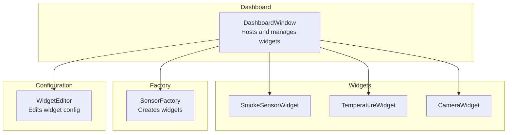
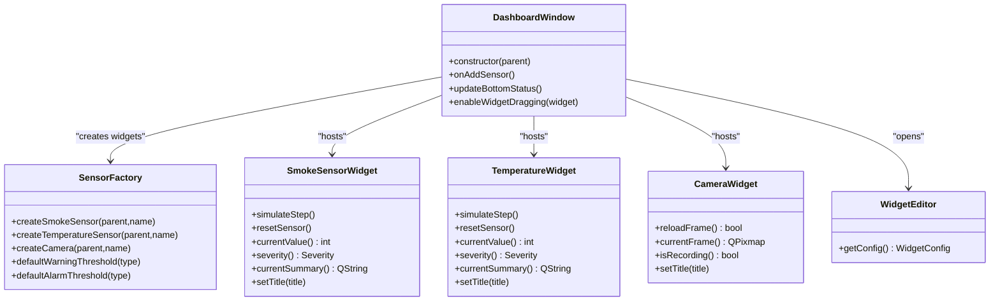
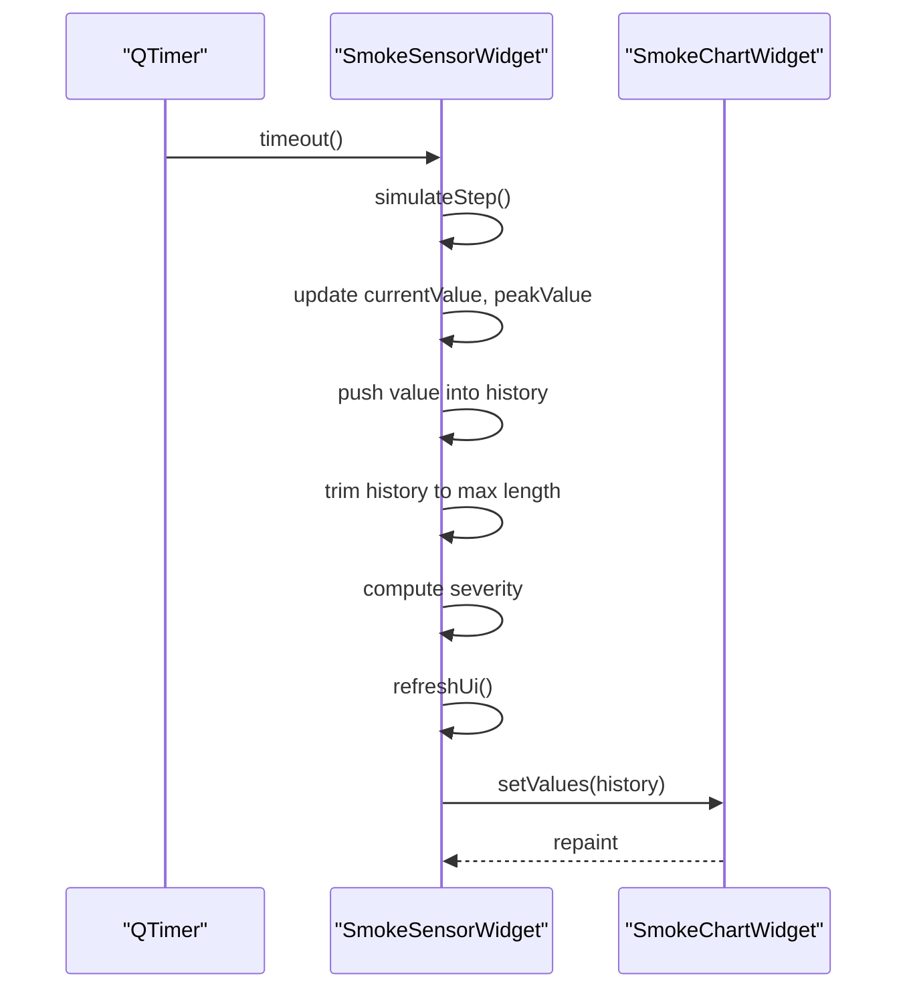
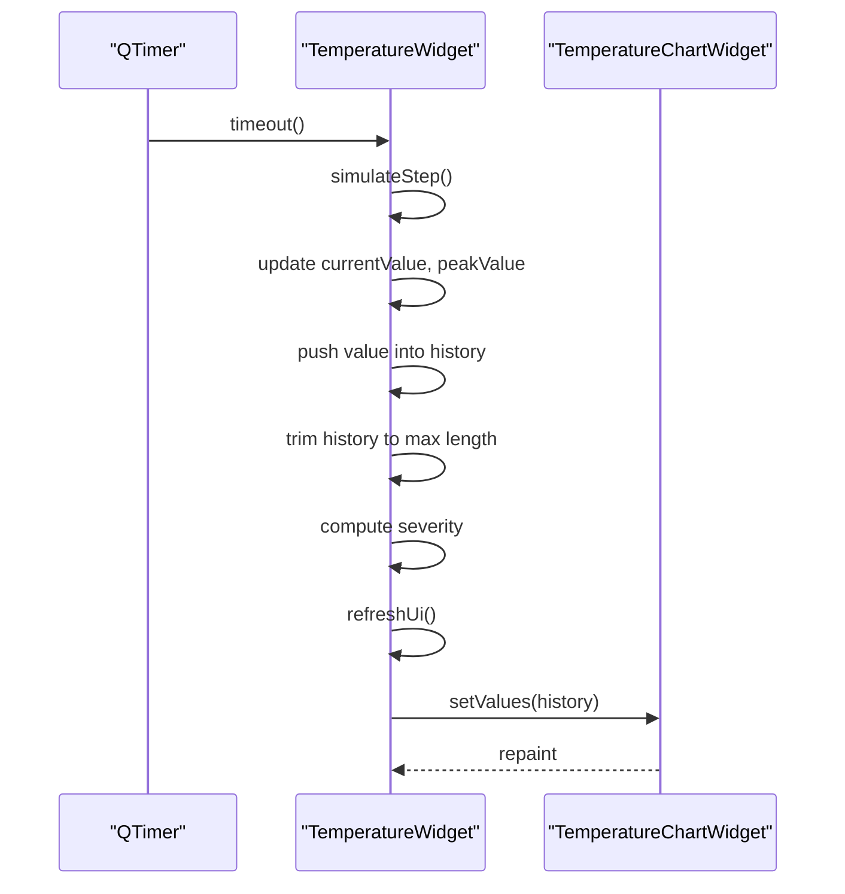
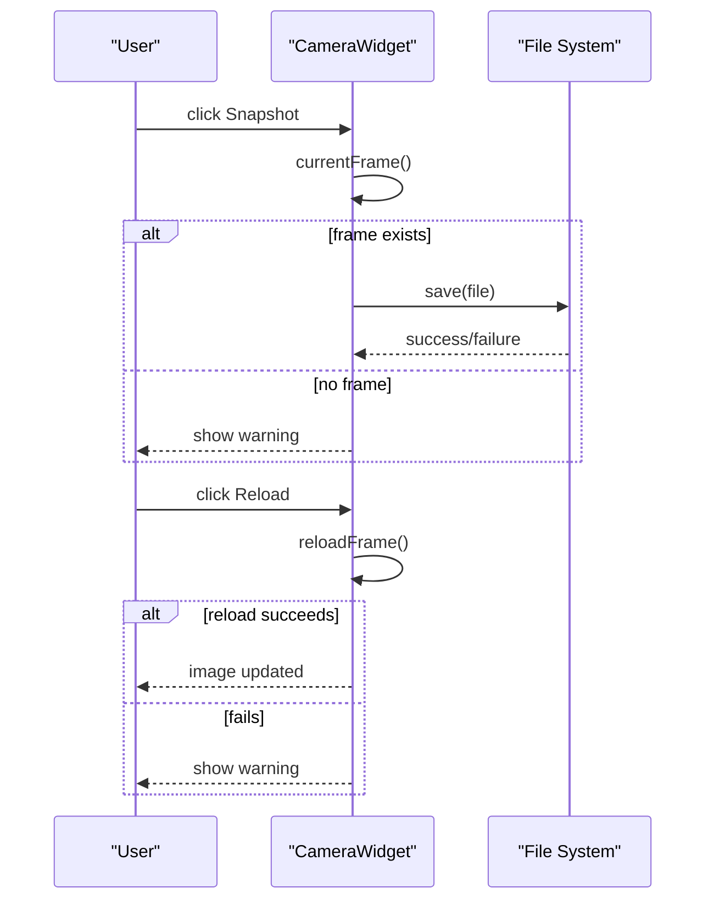
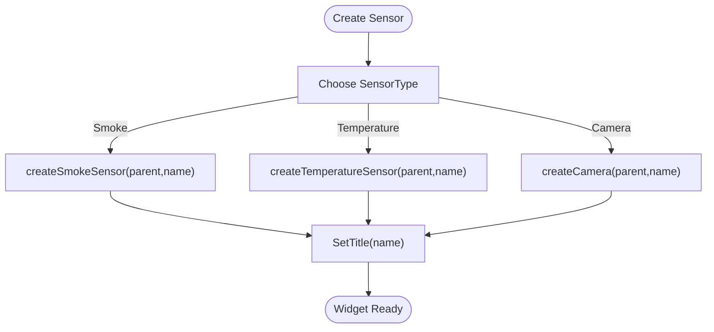
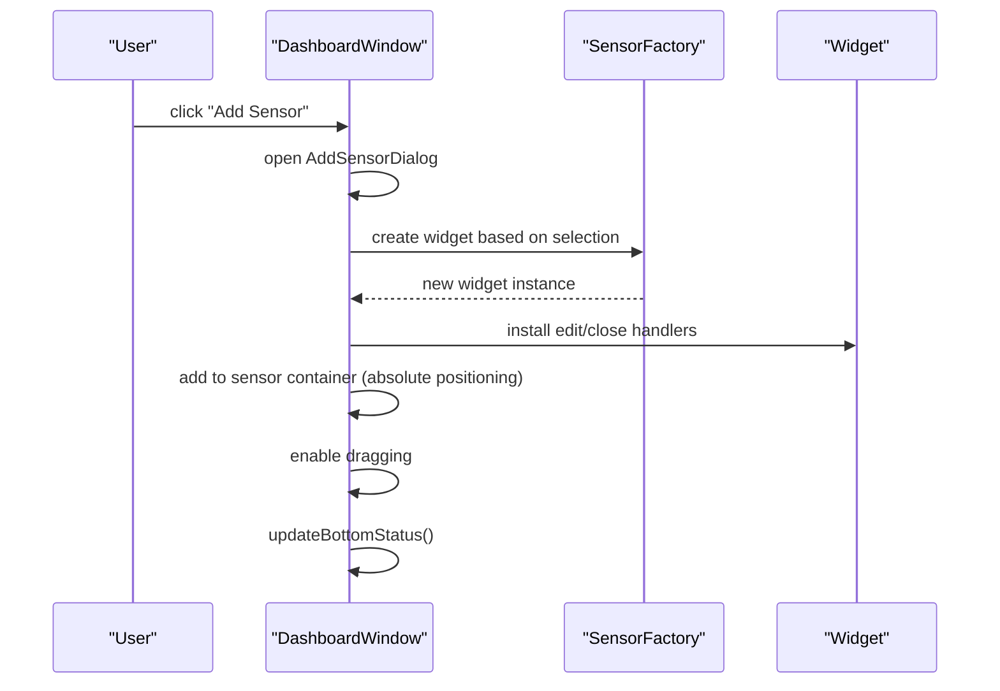
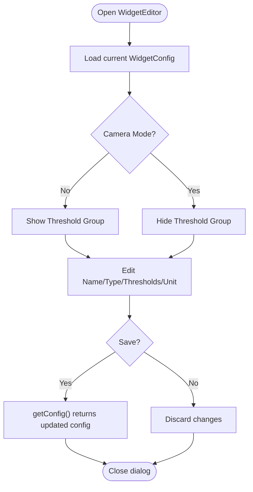
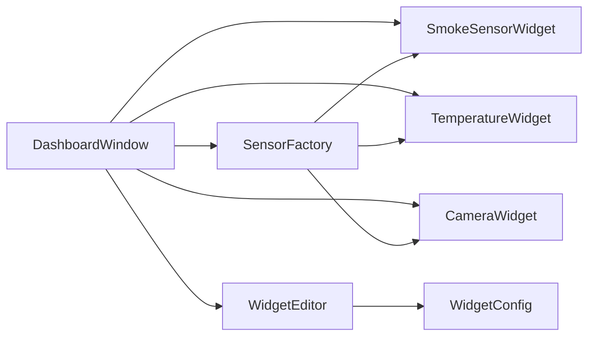

# Supported Sensor Types

<cite>
**Referenced Files in This Document**
- [smokesensorwidget.h](file://smokesensorwidget.h)
- [smokesensorwidget.cpp](file://smokesensorwidget.cpp)
- [temperaturewidget.h](file://temperaturewidget.h)
- [temperaturewidget.cpp](file://temperaturewidget.cpp)
- [camerawidget.h](file://camerawidget.h)
- [camerawidget.cpp](file://camerawidget.cpp)
- [sensorfactory.h](file://sensorfactory.h)
- [sensorfactory.cpp](file://sensorfactory.cpp)
- [dashboardwindow.h](file://dashboardwindow.h)
- [dashboardwindow.cpp](file://dashboardwindow.cpp)
- [widgeteditor.h](file://widgeteditor.h)
- [widgeteditor.cpp](file://widgeteditor.cpp)
</cite>

## Table of Contents
1. [Introduction](#introduction)
2. [Project Structure](#project-structure)
3. [Core Components](#core-components)
4. [Architecture Overview](#architecture-overview)
5. [Detailed Component Analysis](#detailed-component-analysis)
6. [Dependency Analysis](#dependency-analysis)
7. [Performance Considerations](#performance-considerations)
8. [Troubleshooting Guide](#troubleshooting-guide)
9. [Conclusion](#conclusion)

## Introduction
This document describes the supported sensor types in the surveillance system and explains how they are modeled, rendered, and integrated into the dashboard. It focuses on:
- SmokeSensorWidget for environmental smoke detection
- TemperatureWidget for temperature monitoring
- CameraWidget for video surveillance

It covers functionality, data processing, visualization, thresholds, real-time updates, configuration, and integration via the factory system. Examples of instantiation and configuration are included for each sensor type.

## Project Structure
The relevant components are organized around three primary widgets (Smoke, Temperature, Camera), a factory for creating sensors, a dashboard for hosting and managing widgets, and a configuration editor for per-widget customization.

**Diagram sources**
- [dashboardwindow.h:19-99](file://dashboardwindow.h#L19-L99)
- [dashboardwindow.cpp:71-244](file://dashboardwindow.cpp#L71-L244)
- [sensorfactory.h:28-40](file://sensorfactory.h#L28-L40)
- [widgeteditor.h:20-41](file://widgeteditor.h#L20-L41)

**Section sources**
- [dashboardwindow.h:19-99](file://dashboardwindow.h#L19-L99)
- [dashboardwindow.cpp:71-244](file://dashboardwindow.cpp#L71-L244)
- [sensorfactory.h:10-40](file://sensorfactory.h#L10-L40)
- [widgeteditor.h:10-41](file://widgeteditor.h#L10-L41)

## Core Components
- SmokeSensorWidget: Displays smoke concentration with severity, maintains a rolling history, and simulates real-time updates.
- TemperatureWidget: Displays temperature readings with severity, maintains a rolling history, and simulates real-time updates.
- CameraWidget: Displays a still image with controls for reload, snapshot, fullscreen, record toggle, and editing.
- SensorFactory: Provides creation and default configuration helpers for supported sensor types.
- DashboardWindow: Hosts widgets, handles user interactions, and updates status indicators.
- WidgetEditor: Dialog for editing widget name, type, thresholds, and units.

**Section sources**
- [smokesensorwidget.h:10-53](file://smokesensorwidget.h#L10-L53)
- [temperaturewidget.h:11-54](file://temperaturewidget.h#L11-L54)
- [camerawidget.h:9-40](file://camerawidget.h#L9-L40)
- [sensorfactory.h:28-40](file://sensorfactory.h#L28-L40)
- [dashboardwindow.h:19-99](file://dashboardwindow.h#L19-L99)
- [widgeteditor.h:10-41](file://widgeteditor.h#L10-L41)

## Architecture Overview
The dashboard instantiates fixed widgets (smoke, temperature, camera) and supports adding dynamic sensors via the factory. Widgets expose edit/close buttons and status indicators. Thresholds and units are configurable via the editor.

**Diagram sources**
- [dashboardwindow.cpp:71-244](file://dashboardwindow.cpp#L71-L244)
- [sensorfactory.cpp:83-102](file://sensorfactory.cpp#L83-L102)
- [smokesensorwidget.cpp:157-237](file://smokesensorwidget.cpp#L157-L237)
- [temperaturewidget.cpp:148-227](file://temperaturewidget.cpp#L148-L227)
- [camerawidget.cpp:85-180](file://camerawidget.cpp#L85-L180)
- [widgeteditor.cpp:12-31](file://widgeteditor.cpp#L12-L31)

## Detailed Component Analysis

### SmokeSensorWidget
- Purpose: Visualize smoke concentration, track peak values, compute severity, and render a chart.
- Real-time simulation: A timer triggers periodic updates that adjust the current value with random deltas and enforce bounds.
- Rolling history: Maintains up to a fixed number of recent samples; oldest values are dropped when exceeding capacity.
- Severity thresholds: Configurable warning and alarm thresholds; severity updates accordingly.
- Visualization: A custom chart widget renders a line graph with gradient fills, grid lines, and threshold markers.
- UI elements: Title label, state badge (Normal/Warning/Alarm), and a chart area.

**Diagram sources**
- [smokesensorwidget.cpp:231-307](file://smokesensorwidget.cpp#L231-L307)
- [smokesensorwidget.cpp:318-358](file://smokesensorwidget.cpp#L318-L358)

Key behaviors and thresholds:
- Initial values and peak tracking are initialized from a preloaded dataset.
- Warning threshold and alarm threshold are set during construction.
- Severity is computed based on current value versus thresholds.

Examples of instantiation and configuration:
- Construction with default title and thresholds.
- Reset to baseline conditions.
- Title change after creation.

**Section sources**
- [smokesensorwidget.h:10-53](file://smokesensorwidget.h#L10-L53)
- [smokesensorwidget.cpp:157-378](file://smokesensorwidget.cpp#L157-L378)

### TemperatureWidget
- Purpose: Visualize temperature readings, track peak values, compute severity, and render a chart.
- Real-time simulation: Similar to smoke widget, with periodic updates and bounded random changes.
- Rolling history: Maintains a capped list of recent values.
- Severity thresholds: Configurable warning and alarm thresholds; severity updates accordingly.
- Visualization: A custom chart widget renders a line graph with gradient fills, grid lines, and a threshold marker.

**Diagram sources**
- [temperaturewidget.cpp:221-297](file://temperaturewidget.cpp#L221-L297)
- [temperaturewidget.cpp:308-348](file://temperaturewidget.cpp#L308-L348)

Key behaviors and thresholds:
- Initial values and peak tracking are initialized from a preloaded dataset.
- Warning threshold and alarm threshold are set during construction.
- Severity is computed based on current value versus thresholds.

Examples of instantiation and configuration:
- Construction with default title and thresholds.
- Reset to baseline conditions.
- Title change after creation.

**Section sources**
- [temperaturewidget.h:11-54](file://temperaturewidget.h#L11-L54)
- [temperaturewidget.cpp:148-368](file://temperaturewidget.cpp#L148-L368)

### CameraWidget
- Purpose: Display a still image with controls for reload, snapshot, fullscreen, record toggle, and editing.
- Image loading: Attempts to load an asset image from multiple locations, falls back to a solid-color placeholder if not found.
- Controls: Edit, Close, Reload, Snapshot, Fullscreen, Record (toggle).
- Recording state: Tracks whether recording is active (visualized via button state).
- Interaction: Snapshot saves the current frame; Reload refreshes the image; Fullscreen opens a dialog with the current frame scaled to fit.

**Diagram sources**
- [camerawidget.cpp:211-234](file://camerawidget.cpp#L211-L234)

Examples of instantiation and configuration:
- Construction with default title and initial image.
- Title change after creation.
- Toggle recording state via the record button.

**Section sources**
- [camerawidget.h:9-40](file://camerawidget.h#L9-L40)
- [camerawidget.cpp:85-249](file://camerawidget.cpp#L85-L249)

### Sensor Factory Integration
The factory centralizes creation and default configuration for sensors. It exposes:
- Creation methods for SmokeSensorWidget, TemperatureWidget, and CameraWidget.
- Helpers for converting sensor types to human-readable strings and icons.
- Defaults for names, units, warning, and alarm thresholds.

**Diagram sources**
- [sensorfactory.cpp:83-102](file://sensorfactory.cpp#L83-L102)
- [sensorfactory.h:28-40](file://sensorfactory.h#L28-L40)

**Section sources**
- [sensorfactory.h:10-40](file://sensorfactory.h#L10-L40)
- [sensorfactory.cpp:7-102](file://sensorfactory.cpp#L7-L102)

### Dashboard Integration and User Interactions
The dashboard:
- Instantiates smoke, temperature, and camera widgets and places them at fixed positions.
- Enables dragging for each widget.
- Connects edit/close actions to dialogs and handlers.
- Updates bottom status bar with active sensors, alarms, warnings, and defaults.
- Supports adding dynamic sensors via a dialog that uses the factory.

**Diagram sources**
- [dashboardwindow.cpp:1155-1252](file://dashboardwindow.cpp#L1155-L1252)

**Section sources**
- [dashboardwindow.h:19-99](file://dashboardwindow.h#L19-L99)
- [dashboardwindow.cpp:71-244](file://dashboardwindow.cpp#L71-L244)
- [dashboardwindow.cpp:1155-1252](file://dashboardwindow.cpp#L1155-L1252)

### Widget Configuration Editor
The editor allows changing:
- Name
- Type (with special handling for camera mode)
- Warning threshold
- Alarm threshold
- Unit

In camera mode, threshold and unit fields are hidden because cameras do not use numeric thresholds.

**Diagram sources**
- [widgeteditor.cpp:12-31](file://widgeteditor.cpp#L12-L31)
- [widgeteditor.cpp:33-117](file://widgeteditor.cpp#L33-L117)
- [widgeteditor.cpp:119-128](file://widgeteditor.cpp#L119-L128)

**Section sources**
- [widgeteditor.h:10-41](file://widgeteditor.h#L10-L41)
- [widgeteditor.cpp:12-128](file://widgeteditor.cpp#L12-L128)

## Dependency Analysis
- DashboardWindow depends on SensorFactory for creating widgets and on individual widget classes for UI and behavior.
- Widgets depend on Qt’s GUI framework for rendering and timers for periodic updates.
- WidgetEditor depends on the WidgetConfig structure to present and persist configuration.

**Diagram sources**
- [dashboardwindow.cpp:71-244](file://dashboardwindow.cpp#L71-L244)
- [sensorfactory.cpp:83-102](file://sensorfactory.cpp#L83-L102)
- [widgeteditor.h:10-18](file://widgeteditor.h#L10-L18)

**Section sources**
- [dashboardwindow.cpp:71-244](file://dashboardwindow.cpp#L71-L244)
- [sensorfactory.cpp:83-102](file://sensorfactory.cpp#L83-L102)
- [widgeteditor.h:10-18](file://widgeteditor.h#L10-L18)

## Performance Considerations
- Timers: Smoke and Temperature widgets use periodic timers to simulate updates. Consider adjusting intervals based on hardware capabilities and desired responsiveness.
- Rendering: Custom chart widgets paint on demand; avoid excessive repaints by batching updates and limiting frequent resizes.
- Memory: Rolling histories are capped; ensure the cap aligns with visualization needs and memory constraints.
- Image handling: CameraWidget loads images from disk or embedded resources; ensure assets are appropriately sized to balance quality and memory usage.

[No sources needed since this section provides general guidance]

## Troubleshooting Guide
Common issues and resolutions:
- No image loaded for CameraWidget:
  - The widget attempts multiple paths and falls back to a solid-color pixmap. Verify asset availability or allow the fallback.
- Snapshot save failure:
  - The save operation can fail if the destination path is invalid or write-protected. Confirm permissions and target location.
- Reload failure:
  - If the image cannot be reloaded, a warning is shown. Check asset paths and existence.
- Status counts incorrect:
  - The dashboard status relies on widget visibility and severity. Ensure widgets are visible and severity is updated by the simulation loop.

**Section sources**
- [camerawidget.cpp:211-234](file://camerawidget.cpp#L211-L234)
- [dashboardwindow.cpp:574-614](file://dashboardwindow.cpp#L574-L614)

## Conclusion
The surveillance system integrates three primary sensor widgets—smoke detection, temperature monitoring, and video surveillance—through a cohesive architecture. Widgets simulate real-time data, maintain rolling histories, and expose severity-based status indicators. The factory simplifies creation and default configuration, while the dashboard orchestrates placement, interactivity, and status reporting. The editor enables per-widget customization, including thresholds and units for numeric sensors and camera-specific settings.