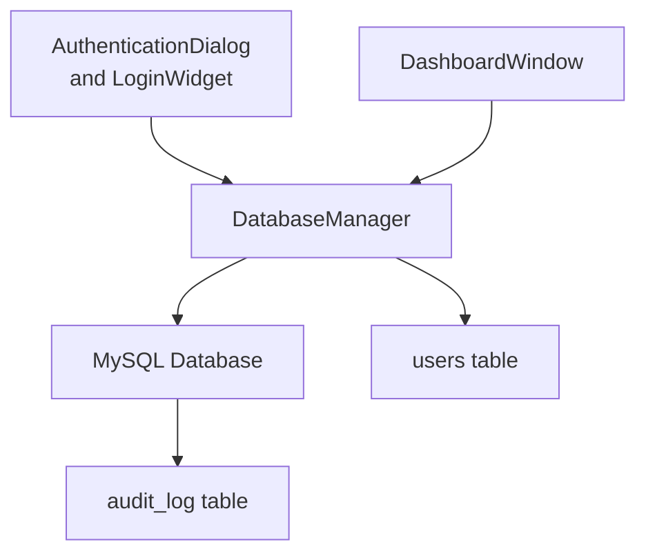
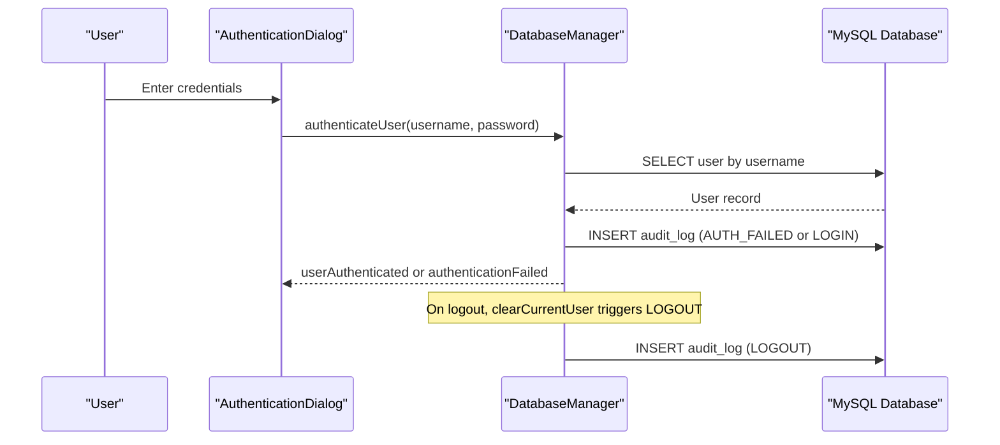
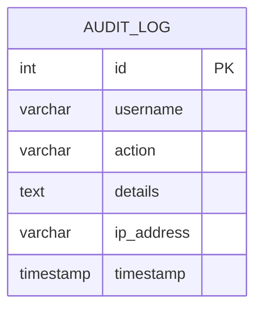
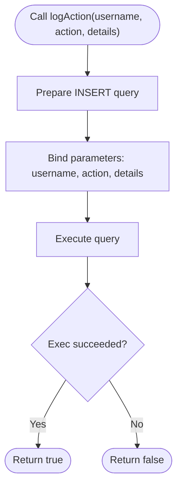
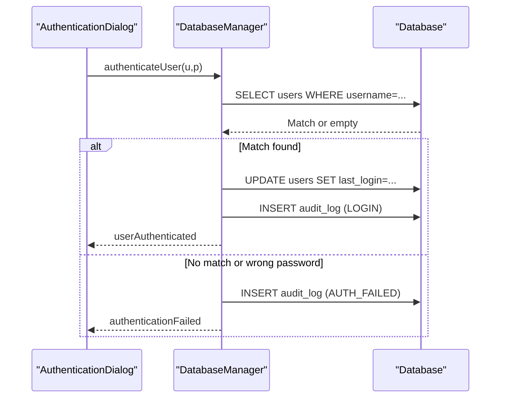
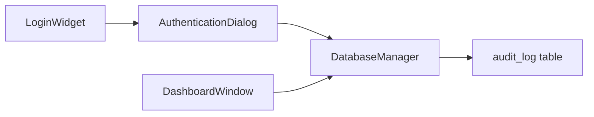

# Audit Logging and Compliance

<cite>
**Referenced Files in This Document**
- [databasemanager.h](file://databasemanager.h)
- [databasemanager.cpp](file://databasemanager.cpp)
- [surveillance_schema.sql](file://database/surveillance_schema.sql)
- [authenticationdialog.h](file://authenticationdialog.h)
- [authenticationdialog.cpp](file://authenticationdialog.cpp)
- [dashboardwindow.cpp](file://dashboardwindow.cpp)
- [loginwidget.h](file://loginwidget.h)
- [loginwidget.cpp](file://loginwidget.cpp)
</cite>

## Table of Contents
1. [Introduction](#introduction)
2. [Project Structure](#project-structure)
3. [Core Components](#core-components)
4. [Architecture Overview](#architecture-overview)
5. [Detailed Component Analysis](#detailed-component-analysis)
6. [Dependency Analysis](#dependency-analysis)
7. [Performance Considerations](#performance-considerations)
8. [Troubleshooting Guide](#troubleshooting-guide)
9. [Conclusion](#conclusion)
10. [Appendices](#appendices)

## Introduction
This document describes the audit logging system implemented in the SurveillanceQT project. It focuses on the logAction() method that records user activities and system events, the audit trail structure, integration with authentication and session lifecycle, and operational considerations for compliance and retention. It also outlines how to extend the system to capture additional operational events and how to view and manage audit logs securely.

## Project Structure
The audit logging capability is centered around the DatabaseManager class, which manages database connections, user authentication, and audit trail persistence. The audit_log table schema is defined in the database initialization script. The UI components for authentication trigger audit events during login/logout and failed attempts.

**Diagram sources**
- [authenticationdialog.cpp:178-194](file://authenticationdialog.cpp#L178-L194)
- [loginwidget.cpp:99-112](file://loginwidget.cpp#L99-L112)
- [databasemanager.cpp:158-198](file://databasemanager.cpp#L158-L198)
- [databasemanager.cpp:295-302](file://databasemanager.cpp#L295-L302)
- [surveillance_schema.sql:36-47](file://database/surveillance_schema.sql#L36-L47)

**Section sources**
- [databasemanager.h:34-87](file://databasemanager.h#L34-L87)
- [databasemanager.cpp:48-115](file://databasemanager.cpp#L48-L115)
- [surveillance_schema.sql:36-47](file://database/surveillance_schema.sql#L36-L47)

## Core Components
- DatabaseManager: Provides database initialization, user authentication, session management, and audit logging via logAction().
- audit_log table: Stores username, action type, details, and timestamp. The schema supports indexing for efficient queries.
- Authentication UI: Triggers audit events on successful login, logout, and failed attempts.

Key responsibilities:
- Initialize database and create audit_log table when using SQLite.
- Log user actions with structured fields: username, action, details, timestamp.
- Emit signals for authentication outcomes and errors to integrate with UI and logging.

**Section sources**
- [databasemanager.h:34-87](file://databasemanager.h#L34-L87)
- [databasemanager.cpp:98-115](file://databasemanager.cpp#L98-L115)
- [surveillance_schema.sql:36-47](file://database/surveillance_schema.sql#L36-L47)

## Architecture Overview
The audit logging architecture integrates tightly with the authentication flow and session lifecycle. The sequence below illustrates how login attempts and session termination produce audit entries.

**Diagram sources**
- [authenticationdialog.cpp:178-194](file://authenticationdialog.cpp#L178-L194)
- [databasemanager.cpp:158-198](file://databasemanager.cpp#L158-L198)
- [databasemanager.cpp:295-302](file://databasemanager.cpp#L295-L302)
- [surveillance_schema.sql:36-47](file://database/surveillance_schema.sql#L36-L47)

## Detailed Component Analysis

### Audit Trail Structure
The audit_log table captures:
- username: Identifier of the acting user.
- action: Type of event (e.g., LOGIN, AUTH_FAILED, LOGOUT).
- details: Optional free-form description of the event.
- timestamp: Automatic insertion of the event time.

Schema highlights:
- Primary key id for unique identification.
- Indexes on username, action, and timestamp to optimize queries.
- Optional ip_address column exists in the schema file but is not currently used by logAction().

**Diagram sources**
- [surveillance_schema.sql:36-47](file://database/surveillance_schema.sql#L36-L47)

**Section sources**
- [surveillance_schema.sql:36-47](file://database/surveillance_schema.sql#L36-L47)
- [databasemanager.cpp:98-115](file://databasemanager.cpp#L98-L115)

### logAction() Method Implementation
Purpose:
- Persist a single audit event with username, action type, and optional details.

Behavior:
- Prepares and executes an INSERT statement into audit_log.
- Uses bound parameters to prevent SQL injection.
- Returns success/failure of the insert operation.

Usage locations:
- Successful login: emits a LOGIN event after updating last_login.
- Failed login attempt: emits AUTH_FAILED immediately upon mismatch.
- Logout: emits LOGOUT when clearing current user.

Extensibility:
- To capture IP address, extend logAction() to accept an ip_address parameter and update the INSERT accordingly.

**Diagram sources**
- [databasemanager.cpp:309-319](file://databasemanager.cpp#L309-L319)

**Section sources**
- [databasemanager.cpp:309-319](file://databasemanager.cpp#L309-L319)
- [databasemanager.cpp:178-194](file://databasemanager.cpp#L178-L194)
- [databasemanager.cpp:298-299](file://databasemanager.cpp#L298-L299)

### Authentication Integration
- AuthenticationDialog collects credentials and invokes DatabaseManager::authenticateUser.
- DatabaseManager::authenticateUser performs validation, updates last_login, and logs either LOGIN or AUTH_FAILED.
- On logout, DatabaseManager::clearCurrentUser logs LOGOUT and emits userLoggedOut.

**Diagram sources**
- [authenticationdialog.cpp:178-194](file://authenticationdialog.cpp#L178-L194)
- [databasemanager.cpp:158-198](file://databasemanager.cpp#L158-L198)

**Section sources**
- [authenticationdialog.cpp:178-194](file://authenticationdialog.cpp#L178-L194)
- [databasemanager.cpp:158-198](file://databasemanager.cpp#L158-L198)
- [databasemanager.cpp:295-302](file://databasemanager.cpp#L295-L302)

### Session Lifecycle and Audit Events
- LOGIN: Logged on successful authentication.
- AUTH_FAILED: Logged on failed password verification.
- LOGOUT: Logged when the user session ends.

These events provide a complete picture of user engagement and potential security incidents.

**Section sources**
- [databasemanager.cpp:178-194](file://databasemanager.cpp#L178-L194)
- [databasemanager.cpp:298-299](file://databasemanager.cpp#L298-L299)

### Extending Audit Coverage
Examples of additional events suitable for logAction():
- User management actions: CREATE_USER, UPDATE_USER, DEACTIVATE_USER.
- Configuration changes: UPDATE_SYSTEM_CONFIG, CHANGE_PASSWORD.
- Module and sensor operations: ADD_MODULE, REMOVE_MODULE, EDIT_WIDGET.
- Network scanning and device management: SCAN_NETWORK, MANAGE_NODE.

Implementation pattern:
- Emit a signal from the relevant component (e.g., ModuleManager, SensorFactory).
- Connect to DatabaseManager::logAction() to persist the event.
- Ensure details include sufficient context (e.g., affected entity, operator notes).

[No sources needed since this section proposes extension patterns without analyzing specific files]

### Viewing and Managing Audit Logs
- Querying: Use SQL SELECT with filters on username, action, and timestamp ranges.
- Index utilization: Leverage existing indexes on username, action, and timestamp for performance.
- Export: Periodically export audit_log rows for external retention systems.

Security considerations:
- Limit access to audit_log to privileged roles.
- Store exports encrypted and enforce access controls.
- Retain logs per policy and purge older entries according to compliance requirements.

[No sources needed since this section provides general guidance]

## Dependency Analysis
The audit logging subsystem depends on:
- DatabaseManager for database operations and event persistence.
- Authentication UI for triggering LOGIN, AUTH_FAILED, and LOGOUT events.
- DashboardWindow for orchestrating authentication and session lifecycle.

**Diagram sources**
- [authenticationdialog.cpp:178-194](file://authenticationdialog.cpp#L178-L194)
- [loginwidget.cpp:99-112](file://loginwidget.cpp#L99-L112)
- [databasemanager.cpp:309-319](file://databasemanager.cpp#L309-L319)
- [dashboardwindow.cpp:900-921](file://dashboardwindow.cpp#L900-L921)

**Section sources**
- [authenticationdialog.cpp:178-194](file://authenticationdialog.cpp#L178-L194)
- [loginwidget.cpp:99-112](file://loginwidget.cpp#L99-L112)
- [databasemanager.cpp:309-319](file://databasemanager.cpp#L309-L319)
- [dashboardwindow.cpp:900-921](file://dashboardwindow.cpp#L900-L921)

## Performance Considerations
- Use bound parameters in logAction() to avoid SQL injection and improve query plans.
- Indexes on username, action, and timestamp support efficient filtering.
- Batch inserts: For high-frequency events, consider batching multiple logAction() calls to reduce transaction overhead.
- Partitioning: For long-term retention, consider partitioning audit_log by date to improve maintenance and query performance.

[No sources needed since this section provides general guidance]

## Troubleshooting Guide
Common issues and resolutions:
- Authentication failures not logged:
  - Verify authenticationFailed signal emission and logAction() invocation paths.
  - Check database connectivity and permissions.
- Missing LOGOUT entries:
  - Ensure clearCurrentUser() is called on logout and that logAction() succeeds.
- Duplicate or missing timestamps:
  - Confirm that the database server time is synchronized and that CURRENT_TIMESTAMP is used consistently.

Operational checks:
- Confirm audit_log table exists and is initialized during startup.
- Monitor databaseError signals from DatabaseManager for persistent failures.

**Section sources**
- [databasemanager.cpp:178-194](file://databasemanager.cpp#L178-L194)
- [databasemanager.cpp:298-299](file://databasemanager.cpp#L298-L299)
- [databasemanager.cpp:58-64](file://databasemanager.cpp#L58-L64)

## Conclusion
The audit logging system provides a robust foundation for tracking user activities and system events. By leveraging logAction() and integrating it with authentication and session lifecycle events, the system ensures visibility into who did what, when, and with what details. Extending the system to cover additional operational events and enforcing secure retention and access controls will further strengthen compliance readiness.

[No sources needed since this section summarizes without analyzing specific files]

## Appendices

### Audit Trail Fields Reference
- username: String identifier of the acting user.
- action: Enumerated event type (e.g., LOGIN, AUTH_FAILED, LOGOUT).
- details: Optional human-readable description of the event.
- timestamp: Automatic insertion of the event time.

**Section sources**
- [surveillance_schema.sql:36-47](file://database/surveillance_schema.sql#L36-L47)
- [databasemanager.cpp:309-319](file://databasemanager.cpp#L309-L319)

### Security Compliance and Regulatory Considerations
- Integrity: Use bound parameters and consistent timestamp sources to prevent tampering and inconsistencies.
- Confidentiality: Restrict access to audit logs to authorized administrators.
- Availability: Ensure reliable database availability and backup strategies for audit data.
- Retention: Define and enforce retention periods aligned with organizational and regulatory requirements.

[No sources needed since this section provides general guidance]