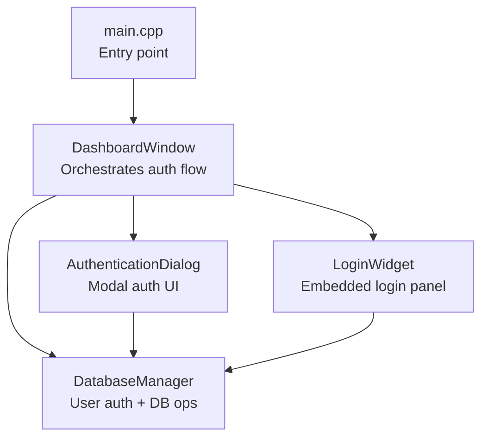
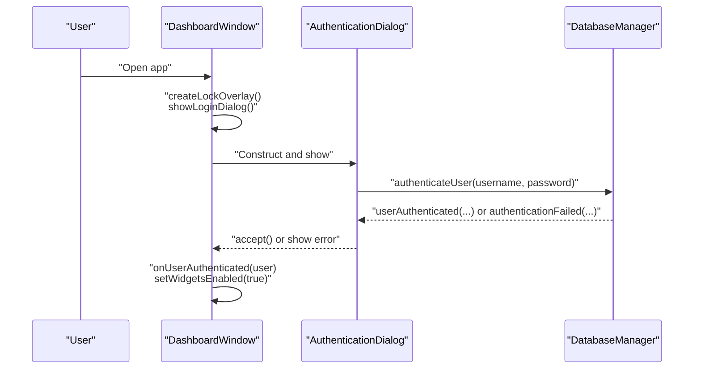
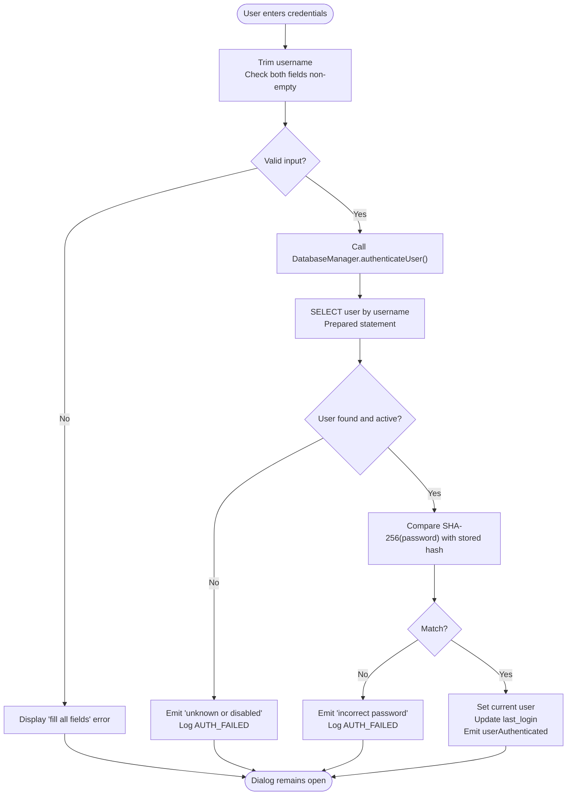
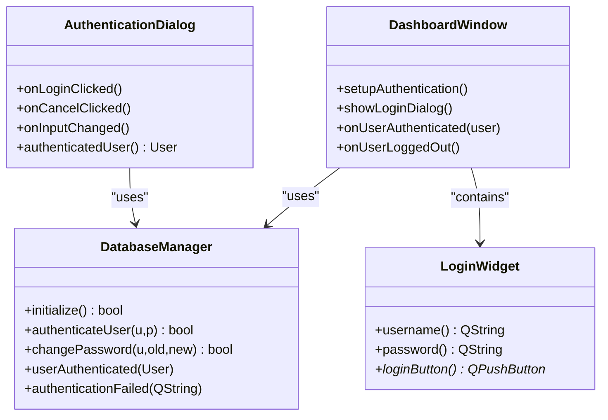

# Authentication System

<cite>
**Referenced Files in This Document**
- [loginwidget.h](file://loginwidget.h)
- [loginwidget.cpp](file://loginwidget.cpp)
- [authenticationdialog.h](file://authenticationdialog.h)
- [authenticationdialog.cpp](file://authenticationdialog.cpp)
- [databasemanager.h](file://databasemanager.h)
- [databasemanager.cpp](file://databasemanager.cpp)
- [dashboardwindow.h](file://dashboardwindow.h)
- [dashboardwindow.cpp](file://dashboardwindow.cpp)
- [main.cpp](file://main.cpp)
</cite>

## Table of Contents
1. [Introduction](#introduction)
2. [Project Structure](#project-structure)
3. [Core Components](#core-components)
4. [Architecture Overview](#architecture-overview)
5. [Detailed Component Analysis](#detailed-component-analysis)
6. [Dependency Analysis](#dependency-analysis)
7. [Performance Considerations](#performance-considerations)
8. [Troubleshooting Guide](#troubleshooting-guide)
9. [Conclusion](#conclusion)

## Introduction
This document describes the authentication system of the SurveillanceQT application. It focuses on the LoginWidget component, the AuthenticationDialog dialog, the DatabaseManager service responsible for user validation and password hashing, and the overall authentication workflow. It also covers form validation, input sanitization, signal-slot connections, error handling, and security measures such as prepared statements and secure password comparison.

## Project Structure
The authentication system spans several UI and service components:
- UI widgets for login input and presentation
- A modal dialog for authentication
- A database manager that handles user queries, password hashing, and session state
- The dashboard window orchestrating authentication flow and UI overlays

**Diagram sources**
- [main.cpp:1-15](file://main.cpp#L1-L15)
- [dashboardwindow.cpp:900-1099](file://dashboardwindow.cpp#L900-L1099)
- [authenticationdialog.cpp:14-41](file://authenticationdialog.cpp#L14-L41)
- [loginwidget.cpp:10-97](file://loginwidget.cpp#L10-L97)
- [databasemanager.cpp:10-382](file://databasemanager.cpp#L10-L382)

**Section sources**
- [main.cpp:1-15](file://main.cpp#L1-L15)
- [dashboardwindow.h:19-99](file://dashboardwindow.h#L19-L99)
- [dashboardwindow.cpp:900-1099](file://dashboardwindow.cpp#L900-L1099)
- [authenticationdialog.h:14-47](file://authenticationdialog.h#L14-L47)
- [authenticationdialog.cpp:14-41](file://authenticationdialog.cpp#L14-L41)
- [loginwidget.h:8-22](file://loginwidget.h#L8-L22)
- [loginwidget.cpp:10-97](file://loginwidget.cpp#L10-L97)
- [databasemanager.h:34-88](file://databasemanager.h#L34-L88)
- [databasemanager.cpp:10-382](file://databasemanager.cpp#L10-L382)

## Core Components
- LoginWidget: Lightweight embedded login panel with username/password fields and a login button. Provides getters for username, password, and the login button pointer.
- AuthenticationDialog: Modal dialog with styled UI, input validation, error display, and role hint. Manages login attempts via DatabaseManager and emits accepted/rejected states.
- DatabaseManager: Central service for database initialization, user creation, authentication, password hashing, session management, and audit logging. Uses prepared statements and emits signals for authentication outcomes.

Key responsibilities:
- Form validation: Ensures non-empty credentials and enables/disables the login button accordingly.
- Input sanitization: Trims username input; password is handled as-is by the UI (echo mode).
- Security: Uses prepared statements with bound parameters and SHA-256 hashed passwords for storage and comparison.
- Signals and slots: Emits authenticationFailed and userAuthenticated to drive UI feedback and state transitions.

**Section sources**
- [loginwidget.h:8-22](file://loginwidget.h#L8-L22)
- [loginwidget.cpp:99-113](file://loginwidget.cpp#L99-L113)
- [authenticationdialog.h:14-47](file://authenticationdialog.h#L14-L47)
- [authenticationdialog.cpp:178-194](file://authenticationdialog.cpp#L178-L194)
- [databasemanager.h:34-88](file://databasemanager.h#L34-L88)
- [databasemanager.cpp:158-198](file://databasemanager.cpp#L158-L198)

## Architecture Overview
The authentication workflow integrates UI components with the DatabaseManager service. Two UI modes exist:
- Embedded LoginWidget inside the dashboard overlay
- Modal AuthenticationDialog for initial authentication

**Diagram sources**
- [dashboardwindow.cpp:900-1099](file://dashboardwindow.cpp#L900-L1099)
- [authenticationdialog.cpp:14-41](file://authenticationdialog.cpp#L14-L41)
- [authenticationdialog.cpp:178-194](file://authenticationdialog.cpp#L178-L194)
- [databasemanager.cpp:158-198](file://databasemanager.cpp#L158-L198)

## Detailed Component Analysis

### LoginWidget Component
- Purpose: Provides a compact login panel with styled inputs and a login button.
- Inputs: QLineEdit for username and password; password field configured in echo mode.
- Behavior: Connects Enter key events on inputs to the login button click to streamline submission.
- Accessors: Exposes username(), password(), and loginButton() for external orchestration.

Security and validation:
- No client-side trimming occurs on the password field.
- The dashboard overlay enforces button enablement based on non-empty inputs.

UI and styling:
- Uses stylesheets to achieve a themed appearance with rounded corners and gradient backgrounds.

**Section sources**
- [loginwidget.h:8-22](file://loginwidget.h#L8-L22)
- [loginwidget.cpp:10-97](file://loginwidget.cpp#L10-L97)
- [loginwidget.cpp:99-113](file://loginwidget.cpp#L99-L113)

### AuthenticationDialog
- Purpose: Modal dialog for user authentication with integrated error messaging and role hint.
- Validation:
  - Requires both username and password to be non-empty.
  - Enables the login button only when both fields have content.
  - Trims username on input; clears error state on input change.
- Error handling:
  - Displays localized error messages via a styled label.
  - Subscribes to DatabaseManager::authenticationFailed to reflect backend errors.
- Role hint:
  - Queries user metadata and displays a human-readable role when username is present.
- Interaction:
  - Accepts on successful authentication; rejects on cancel.

Signal-slot connections:
- Text changes on inputs toggle the login button state.
- Return pressed on password triggers login.
- DatabaseManager::authenticationFailed updates the error label.

**Section sources**
- [authenticationdialog.h:14-47](file://authenticationdialog.h#L14-L47)
- [authenticationdialog.cpp:43-176](file://authenticationdialog.cpp#L43-L176)
- [authenticationdialog.cpp:178-194](file://authenticationdialog.cpp#L178-L194)
- [authenticationdialog.cpp:201-207](file://authenticationdialog.cpp#L201-L207)
- [authenticationdialog.cpp:220-234](file://authenticationdialog.cpp#L220-L234)

### DatabaseManager
- Purpose: Centralized service for database operations and user lifecycle management.
- Initialization:
  - Opens MySQL connection and creates tables for SQLite deployments.
  - Creates default users if the users table is empty.
- Authentication:
  - Prepares and executes a SELECT with bound username parameter.
  - Checks active status and compares SHA-256 hashes of provided password against stored hash.
  - Emits userAuthenticated on success and authenticationFailed on failures.
- Password handling:
  - Hashes passwords using SHA-256 before storing and comparing.
- Session management:
  - Tracks current user, logs actions, and supports logout.
- Audit logging:
  - Records login/logout and failed attempts with timestamps.

Security measures:
- Prepared statements with bound parameters prevent SQL injection.
- Stored passwords are hashed with SHA-256.
- Password comparison uses direct string equality on hex digests.

**Section sources**
- [databasemanager.h:34-88](file://databasemanager.h#L34-L88)
- [databasemanager.cpp:21-41](file://databasemanager.cpp#L21-L41)
- [databasemanager.cpp:158-198](file://databasemanager.cpp#L158-L198)
- [databasemanager.cpp:236-259](file://databasemanager.cpp#L236-L259)
- [databasemanager.cpp:338-341](file://databasemanager.cpp#L338-L341)

### Authentication Workflow
End-to-end flow from login attempt to success or failure:

**Diagram sources**
- [authenticationdialog.cpp:178-194](file://authenticationdialog.cpp#L178-L194)
- [databasemanager.cpp:158-198](file://databasemanager.cpp#L158-L198)
- [databasemanager.cpp:236-259](file://databasemanager.cpp#L236-L259)

## Dependency Analysis
- DashboardWindow depends on DatabaseManager for authentication and session state.
- AuthenticationDialog depends on DatabaseManager for authentication and error signaling.
- LoginWidget is used by DashboardWindow to render an embedded login panel.
- DatabaseManager encapsulates database operations and emits signals consumed by UI components.

**Diagram sources**
- [dashboardwindow.h:19-99](file://dashboardwindow.h#L19-L99)
- [authenticationdialog.h:14-47](file://authenticationdialog.h#L14-L47)
- [databasemanager.h:34-88](file://databasemanager.h#L34-L88)
- [loginwidget.h:8-22](file://loginwidget.h#L8-L22)

**Section sources**
- [dashboardwindow.h:19-99](file://dashboardwindow.h#L19-L99)
- [authenticationdialog.h:14-47](file://authenticationdialog.h#L14-L47)
- [databasemanager.h:34-88](file://databasemanager.h#L34-L88)
- [loginwidget.h:8-22](file://loginwidget.h#L8-L22)

## Performance Considerations
- Prepared statements are used for all database queries, minimizing overhead and preventing re-parsing.
- SHA-256 hashing is constant-time per comparison; consider increasing iterations or switching to bcrypt/scrypt for stronger protection if required.
- UI updates (enabling login button) are triggered by textChanged signals; keep handlers lightweight to avoid blocking the event loop.

## Troubleshooting Guide
Common issues and resolutions:
- Authentication fails immediately:
  - Verify database connectivity and that the users table exists.
  - Ensure default users were created or that the target user exists and is active.
- Error message “unknown or disabled” appears:
  - Confirm the username exists and is not deactivated.
- Error message “incorrect password” appears:
  - Ensure the password matches the stored hash; verify no extra whitespace.
- Login button remains disabled:
  - Ensure both username and password fields are filled; note that only the username is trimmed.
- Modal dialog does not show errors:
  - AuthenticationDialog subscribes to authenticationFailed; confirm the subscription is active.

Signals and slots:
- AuthenticationDialog connects to DatabaseManager::authenticationFailed to display errors.
- DashboardWindow connects to DatabaseManager::userAuthenticated and ::userLoggedOut to update UI state.

**Section sources**
- [authenticationdialog.cpp:38-41](file://authenticationdialog.cpp#L38-L41)
- [authenticationdialog.cpp:178-194](file://authenticationdialog.cpp#L178-L194)
- [dashboardwindow.cpp:911-916](file://dashboardwindow.cpp#L911-L916)
- [databasemanager.cpp:158-198](file://databasemanager.cpp#L158-L198)

## Conclusion
The authentication system combines a clean UI layer (LoginWidget and AuthenticationDialog) with a robust service layer (DatabaseManager) to provide secure and user-friendly authentication. It leverages prepared statements, SHA-256 hashing, and signal-slot communication to maintain reliability and responsiveness. The workflow ensures clear feedback on validation and authentication outcomes, enabling smooth user experiences while preserving security.