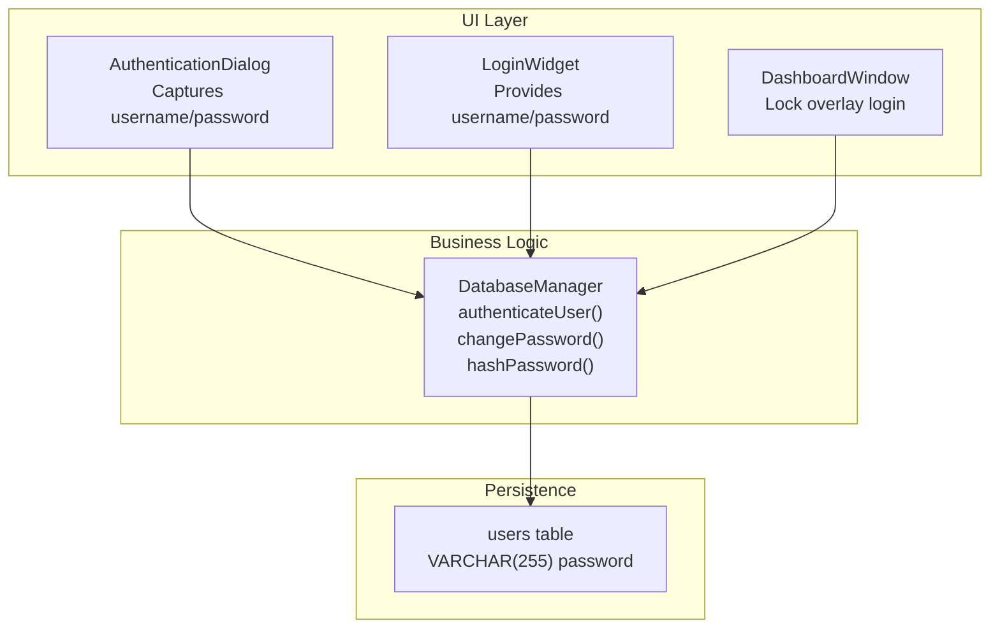
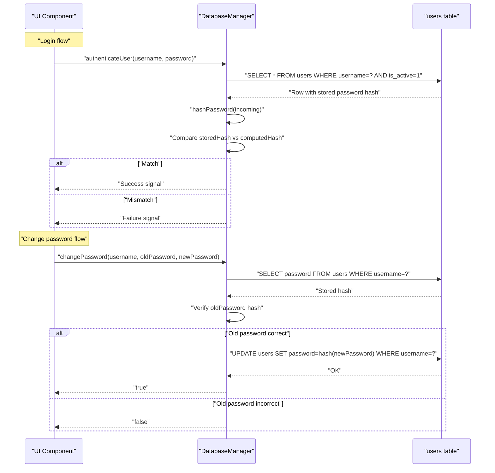
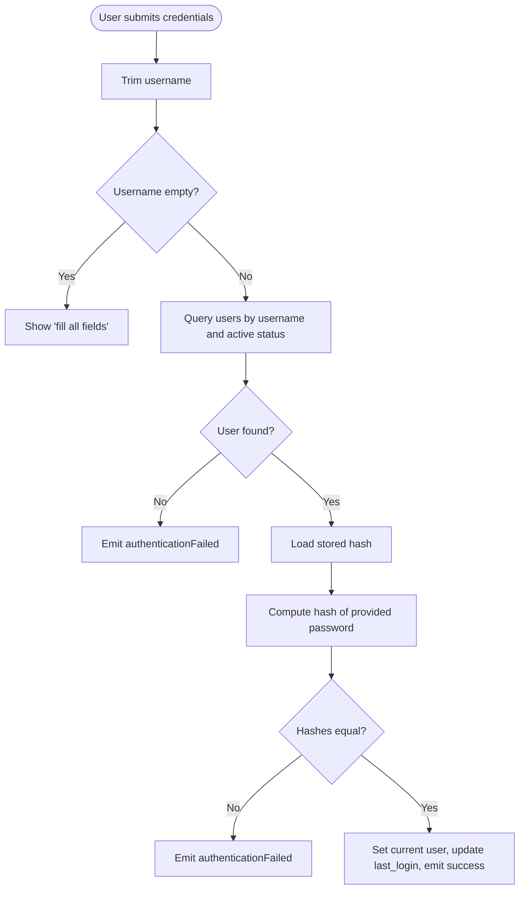
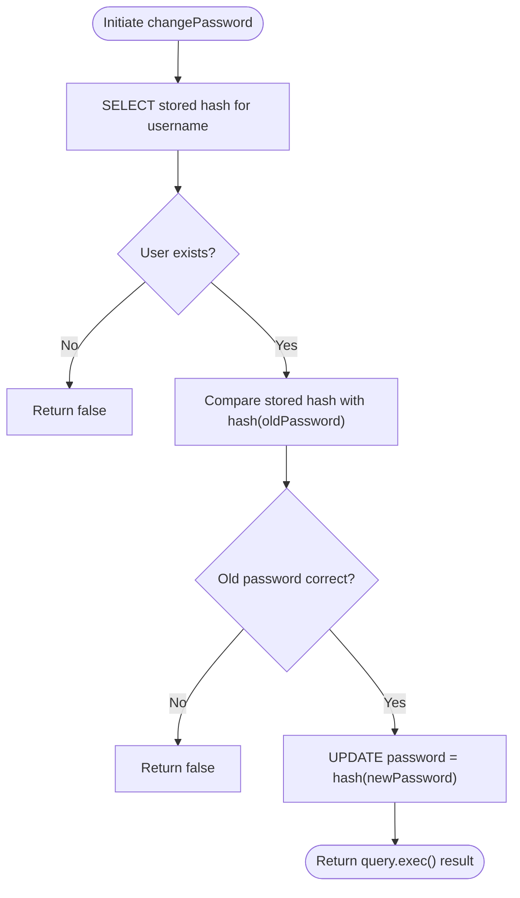
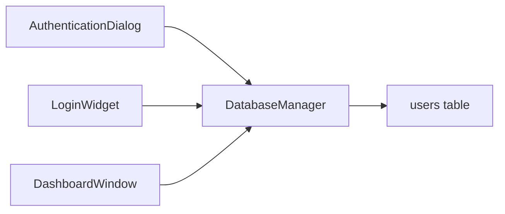

# Password Security and Hashing

<cite>
**Referenced Files in This Document**
- [databasemanager.h](file://databasemanager.h)
- [databasemanager.cpp](file://databasemanager.cpp)
- [authenticationdialog.h](file://authenticationdialog.h)
- [authenticationdialog.cpp](file://authenticationdialog.cpp)
- [loginwidget.h](file://loginwidget.h)
- [loginwidget.cpp](file://loginwidget.cpp)
- [dashboardwindow.cpp](file://dashboardwindow.cpp)
- [surveillance_schema.sql](file://database/surveillance_schema.sql)
</cite>

## Table of Contents
1. [Introduction](#introduction)
2. [Project Structure](#project-structure)
3. [Core Components](#core-components)
4. [Architecture Overview](#architecture-overview)
5. [Detailed Component Analysis](#detailed-component-analysis)
6. [Dependency Analysis](#dependency-analysis)
7. [Performance Considerations](#performance-considerations)
8. [Troubleshooting Guide](#troubleshooting-guide)
9. [Conclusion](#conclusion)
10. [Appendices](#appendices)

## Introduction
This document explains the password security implementation in the project, focusing on how passwords are hashed, stored, verified during authentication, and changed. It documents the hashPassword() method, the authentication and password change flows, and highlights why standard hash functions are not used directly. It also covers the security benefits of using Qt’s cryptographic primitives, outlines current validation rules, and provides best practices and production recommendations.

## Project Structure
The password security logic is centralized in the database manager, with UI components responsible for capturing credentials and triggering authentication/change operations. The database schema defines the storage format for hashed passwords.

**Diagram sources**
- [authenticationdialog.cpp:178-194](file://authenticationdialog.cpp#L178-L194)
- [loginwidget.cpp:99-112](file://loginwidget.cpp#L99-L112)
- [dashboardwindow.cpp:1057-1077](file://dashboardwindow.cpp#L1057-L1077)
- [databasemanager.cpp:158-198](file://databasemanager.cpp#L158-L198)
- [databasemanager.cpp:236-259](file://databasemanager.cpp#L236-L259)
- [databasemanager.cpp:338-341](file://databasemanager.cpp#L338-L341)
- [surveillance_schema.sql:16-31](file://database/surveillance_schema.sql#L16-L31)

**Section sources**
- [databasemanager.h:34-87](file://databasemanager.h#L34-L87)
- [databasemanager.cpp:158-198](file://databasemanager.cpp#L158-L198)
- [databasemanager.cpp:236-259](file://databasemanager.cpp#L236-L259)
- [surveillance_schema.sql:16-31](file://database/surveillance_schema.sql#L16-L31)

## Core Components
- DatabaseManager: Implements authentication, password change, and hashing. Exposes hashPassword(), authenticateUser(), and changePassword().
- UI components: AuthenticationDialog, LoginWidget, and DashboardWindow capture credentials and delegate to DatabaseManager.
- Database schema: Defines the users table with a password column sized to accommodate hex-encoded hashes.

Key responsibilities:
- Hashing: Uses Qt’s cryptographic hash to produce a fixed-length hex string.
- Authentication: Compares incoming password hash with stored hash.
- Password change: Verifies old password before updating with a new hash.
- Storage: Stores only the hex-encoded hash, not plaintext.

Security posture:
- Single-factor hashing with SHA-256 is applied uniformly.
- No salt is used in the current implementation.
- No password strength validation is enforced in code.

**Section sources**
- [databasemanager.h:34-87](file://databasemanager.h#L34-L87)
- [databasemanager.cpp:338-341](file://databasemanager.cpp#L338-L341)
- [databasemanager.cpp:158-198](file://databasemanager.cpp#L158-L198)
- [databasemanager.cpp:236-259](file://databasemanager.cpp#L236-L259)
- [surveillance_schema.sql:16-31](file://database/surveillance_schema.sql#L16-L31)

## Architecture Overview
The authentication and password change flows rely on DatabaseManager’s cryptographic hashing and database queries.

**Diagram sources**
- [databasemanager.cpp:158-198](file://databasemanager.cpp#L158-L198)
- [databasemanager.cpp:236-259](file://databasemanager.cpp#L236-L259)
- [surveillance_schema.sql:16-31](file://database/surveillance_schema.sql#L16-L31)

## Detailed Component Analysis

### Hashing Mechanism and hashPassword()
- Implementation: The hashPassword() method computes a SHA-256 hash of the UTF-8 bytes of the password and returns a lowercase hex string.
- Why standard hash functions are not used directly: The project uses Qt’s QCryptographicHash to ensure portability, correctness, and standardized encoding. Direct C/C++ hashing without a robust library increases risk of subtle errors and non-portable output.
- Storage: The returned hex string is stored in the password column of the users table.

Security considerations:
- SHA-256 is cryptographically strong for hashing, but the current implementation lacks per-user salt.
- Without salt, identical passwords hash to the same value, making rainbow table attacks partially effective if attackers obtain the hash table.
- The schema allows up to 255 characters for the hash, accommodating hex-encoded SHA-256.

Recommendations:
- Add per-user salt and a modern, adaptive KDF (e.g., Argon2, scrypt, or PBKDF2) for stronger resistance against brute-force and precomputation attacks.
- Consider increasing the password field length to support future hash formats.

**Section sources**
- [databasemanager.cpp:338-341](file://databasemanager.cpp#L338-L341)
- [surveillance_schema.sql:16-31](file://database/surveillance_schema.sql#L16-L31)

### Authentication Flow
- Input capture: UI components collect username and password.
- Verification: DatabaseManager authenticates by retrieving the user record, computing the hash of the provided password, and comparing it with the stored hash.
- Feedback: Emits signals for success or failure; UI displays localized messages.

**Diagram sources**
- [authenticationdialog.cpp:178-194](file://authenticationdialog.cpp#L178-L194)
- [databasemanager.cpp:158-198](file://databasemanager.cpp#L158-L198)

**Section sources**
- [authenticationdialog.cpp:178-194](file://authenticationdialog.cpp#L178-L194)
- [databasemanager.cpp:158-198](file://databasemanager.cpp#L158-L198)

### Password Change Process
- Old password verification: Retrieves stored hash and compares with hash of provided old password.
- New password storage: On successful verification, updates the password field with the new hash.
- Error handling: Returns false if the old password does not match or if the database operation fails.

**Diagram sources**
- [databasemanager.cpp:236-259](file://databasemanager.cpp#L236-L259)

**Section sources**
- [databasemanager.cpp:236-259](file://databasemanager.cpp#L236-L259)

### Password Strength and Validation
- Current implementation: There is no client-side or server-side password strength validation in the provided code.
- UI behavior: Inputs are captured via QLineEdit; no immediate feedback or validation rules are enforced.
- Recommendations:
  - Enforce minimum length (e.g., 12 characters).
  - Require mixed character sets (uppercase, lowercase, digits, special characters).
  - Block common dictionary words or sequences.
  - Implement real-time validation feedback in the UI.
  - Consider adding rate limiting and account lockout after failed attempts.

[No sources needed since this section provides general guidance]

### Security Benefits of Qt’s Cryptographic Functions
- Portability and correctness: Qt’s QCryptographicHash ensures consistent hashing across platforms and compilers.
- Standardized output: Produces deterministic hex-encoded strings suitable for database storage.
- Reduced risk of implementation errors: Using a well-tested library minimizes off-by-one or endian-related mistakes.

**Section sources**
- [databasemanager.cpp:338-341](file://databasemanager.cpp#L338-L341)

## Dependency Analysis
The UI components depend on DatabaseManager for authentication and password operations. DatabaseManager depends on Qt’s SQL and cryptographic modules and interacts with the database schema.

**Diagram sources**
- [authenticationdialog.cpp:178-194](file://authenticationdialog.cpp#L178-L194)
- [loginwidget.cpp:99-112](file://loginwidget.cpp#L99-L112)
- [dashboardwindow.cpp:1057-1077](file://dashboardwindow.cpp#L1057-L1077)
- [databasemanager.cpp:158-198](file://databasemanager.cpp#L158-L198)

**Section sources**
- [databasemanager.h:34-87](file://databasemanager.h#L34-L87)
- [databasemanager.cpp:158-198](file://databasemanager.cpp#L158-L198)

## Performance Considerations
- Hash computation cost: SHA-256 is fast and suitable for server-side verification. For high-throughput systems, consider batching and connection pooling.
- Database indexing: The users table includes an index on username, which helps with lookup performance.
- Network latency: Authentication occurs over a local database connection; latency is generally negligible.

[No sources needed since this section provides general guidance]

## Troubleshooting Guide
Common issues and resolutions:
- Authentication failures:
  - Ensure the username exists and is active.
  - Confirm the password matches the stored hash.
  - Check for database connectivity and query errors.
- Password change failures:
  - Verify the old password hash matches the stored value.
  - Ensure the new password is accepted by the system (no validation currently).
- UI feedback:
  - AuthenticationDialog and DashboardWindow show localized error messages on failures.

Operational checks:
- Review emitted signals for authenticationFailed and databaseError.
- Inspect audit logs for AUTH_FAILED entries.

**Section sources**
- [databasemanager.cpp:164-180](file://databasemanager.cpp#L164-L180)
- [databasemanager.cpp:244-251](file://databasemanager.cpp#L244-L251)
- [authenticationdialog.cpp:209-218](file://authenticationdialog.cpp#L209-L218)
- [dashboardwindow.cpp:1062-1066](file://dashboardwindow.cpp#L1062-L1066)

## Conclusion
The project implements a straightforward SHA-256 hashing scheme for password storage, leveraging Qt’s cryptographic library for portability and correctness. While functional, the current design lacks per-user salt and password strength validation. Upgrading to a modern, adaptive KDF and enforcing robust validation rules would significantly improve security. The modular design allows incremental enhancements without disrupting existing flows.

[No sources needed since this section summarizes without analyzing specific files]

## Appendices

### Best Practices for Production Deployments
- Use a modern KDF with salt (Argon2 recommended).
- Enforce strong password policies and real-time validation.
- Implement rate limiting and account lockout.
- Rotate secrets regularly and monitor authentication logs.
- Store secrets securely and restrict database access.

[No sources needed since this section provides general guidance]