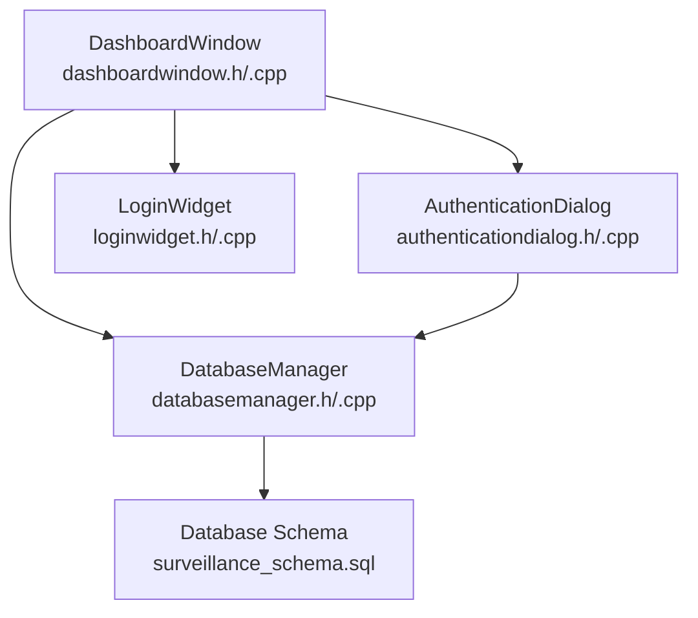
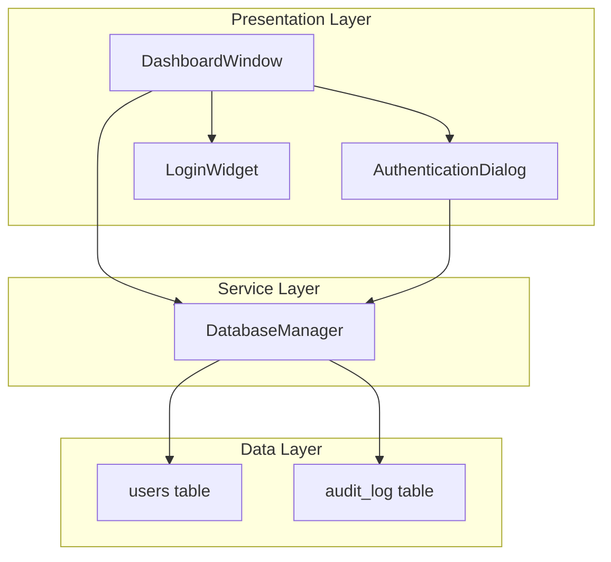
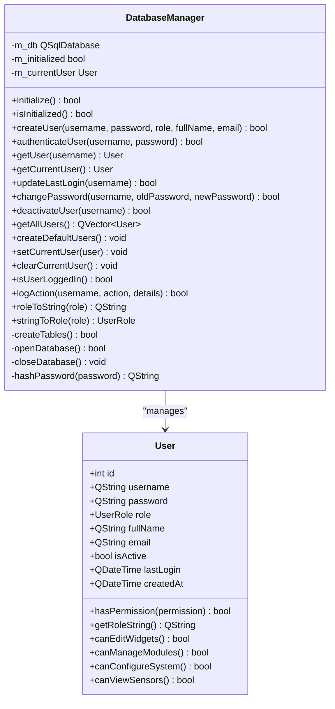
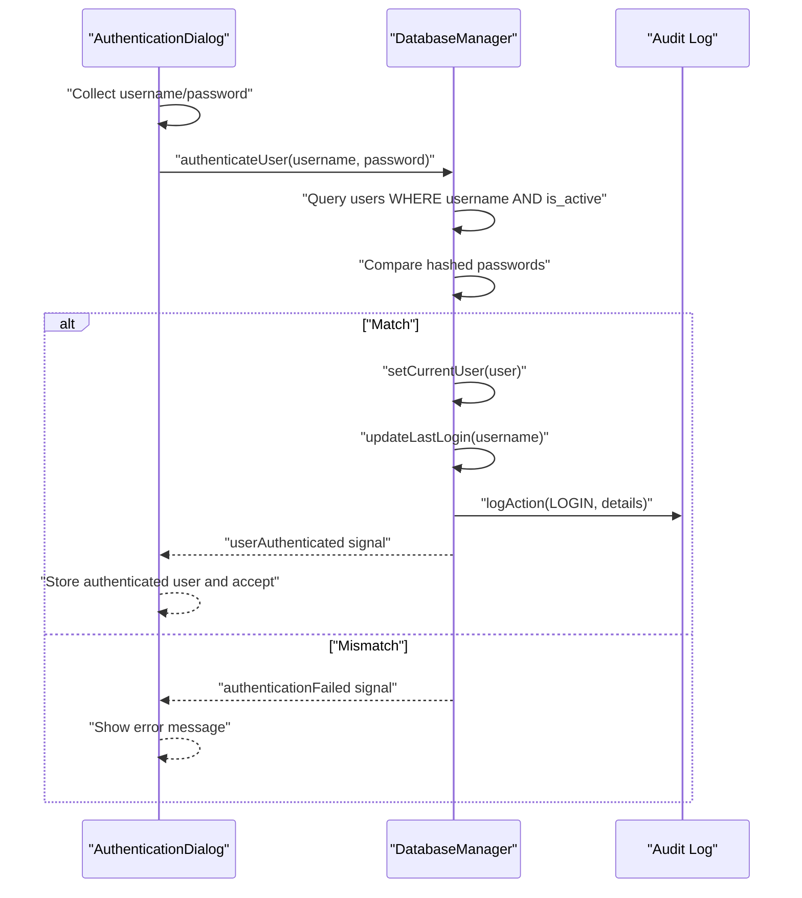
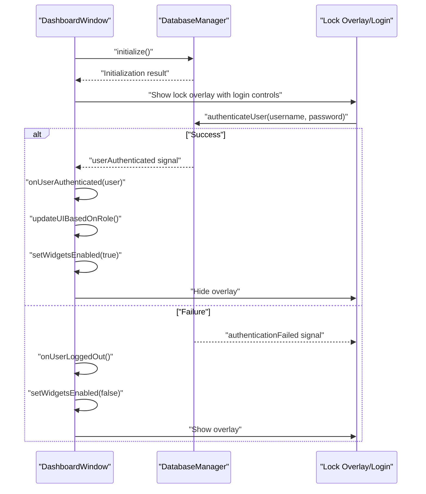
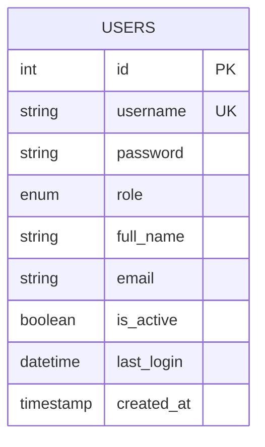
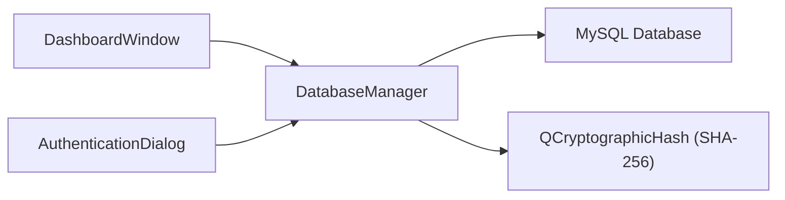

# User Administration Interface

<cite>
**Referenced Files in This Document**
- [databasemanager.h](file://databasemanager.h)
- [databasemanager.cpp](file://databasemanager.cpp)
- [authenticationdialog.h](file://authenticationdialog.h)
- [authenticationdialog.cpp](file://authenticationdialog.cpp)
- [dashboardwindow.h](file://dashboardwindow.h)
- [dashboardwindow.cpp](file://dashboardwindow.cpp)
- [loginwidget.h](file://loginwidget.h)
- [loginwidget.cpp](file://loginwidget.cpp)
- [surveillance_schema.sql](file://database/surveillance_schema.sql)
</cite>

## Table of Contents
1. [Introduction](#introduction)
2. [Project Structure](#project-structure)
3. [Core Components](#core-components)
4. [Architecture Overview](#architecture-overview)
5. [Detailed Component Analysis](#detailed-component-analysis)
6. [Dependency Analysis](#dependency-analysis)
7. [Performance Considerations](#performance-considerations)
8. [Troubleshooting Guide](#troubleshooting-guide)
9. [Conclusion](#conclusion)

## Introduction
This document describes the user administration interface and authentication system for the SurveillanceQT application. It covers the user data model, default user creation, session management, and administrative workflows such as creating users, updating roles, and deactivating accounts. It also documents the authentication dialogs and how user permissions influence UI behavior.

## Project Structure
The user administration functionality spans several core files:
- Database abstraction and user management logic
- Authentication UI components
- Dashboard integration and session lifecycle
- Database schema and default user provisioning

**Diagram sources**
- [databasemanager.h:34-87](file://databasemanager.h#L34-L87)
- [authenticationdialog.h:14-46](file://authenticationdialog.h#L14-L46)
- [dashboardwindow.h:19-98](file://dashboardwindow.h#L19-L98)
- [loginwidget.h:8-21](file://loginwidget.h#L8-L21)
- [surveillance_schema.sql:16-47](file://database/surveillance_schema.sql#L16-L47)

**Section sources**
- [databasemanager.h:1-88](file://databasemanager.h#L1-L88)
- [databasemanager.cpp:1-382](file://databasemanager.cpp#L1-L382)
- [authenticationdialog.h:1-47](file://authenticationdialog.h#L1-L47)
- [authenticationdialog.cpp:1-249](file://authenticationdialog.cpp#L1-L249)
- [dashboardwindow.h:1-99](file://dashboardwindow.h#L1-L99)
- [dashboardwindow.cpp:899-1077](file://dashboardwindow.cpp#L899-L1077)
- [loginwidget.h:1-22](file://loginwidget.h#L1-L22)
- [loginwidget.cpp:1-113](file://loginwidget.cpp#L1-L113)
- [surveillance_schema.sql:1-157](file://database/surveillance_schema.sql#L1-L157)

## Core Components
- DatabaseManager: Central service for user CRUD, authentication, session management, and default user initialization.
- AuthenticationDialog: Modal dialog for username/password input with real-time feedback and error handling.
- DashboardWindow: Orchestrates authentication lifecycle, displays current user, and enforces role-based UI controls.
- LoginWidget: Lightweight login panel used within the dashboard lock overlay.
- Database schema: Defines the users and audit_log tables, including indexes and default users.

Key responsibilities:
- User creation, retrieval, listing, deactivation, and last login updates
- Authentication with password hashing and audit logging
- Session management via current user state
- Role-based UI enabling/disabling

**Section sources**
- [databasemanager.h:34-87](file://databasemanager.h#L34-L87)
- [databasemanager.cpp:117-135](file://databasemanager.cpp#L117-L135)
- [authenticationdialog.cpp:178-194](file://authenticationdialog.cpp#L178-L194)
- [dashboardwindow.cpp:899-921](file://dashboardwindow.cpp#L899-L921)
- [surveillance_schema.sql:16-47](file://database/surveillance_schema.sql#L16-L47)

## Architecture Overview
The system follows a layered architecture:
- Presentation layer: DashboardWindow and AuthenticationDialog
- Service layer: DatabaseManager encapsulating persistence and business logic
- Data layer: MySQL database with users and audit_log tables

**Diagram sources**
- [dashboardwindow.cpp:899-1077](file://dashboardwindow.cpp#L899-L1077)
- [authenticationdialog.cpp:14-41](file://authenticationdialog.cpp#L14-L41)
- [databasemanager.cpp:48-115](file://databasemanager.cpp#L48-L115)
- [surveillance_schema.sql:16-47](file://database/surveillance_schema.sql#L16-L47)

## Detailed Component Analysis

### DatabaseManager: User Administration and Session Management
Responsibilities:
- User management: createUser(), getUser(), getAllUsers(), deactivateUser()
- Authentication: authenticateUser() with password hashing and audit logging
- Session management: setCurrentUser(), clearCurrentUser(), isUserLoggedIn()
- Default users: createDefaultUsers() during initialization
- Utility: updateLastLogin(), changePassword()

Implementation highlights:
- Password hashing using SHA-256 before storage
- Role enumeration mapped to string values ("admin", "operator", "viewer")
- Audit logging for authentication events and logout
- Initialization creates tables for SQLite and seeds default users

**Diagram sources**
- [databasemanager.h:9-32](file://databasemanager.h#L9-L32)
- [databasemanager.h:34-87](file://databasemanager.h#L34-L87)
- [databasemanager.cpp:338-381](file://databasemanager.cpp#L338-L381)

**Section sources**
- [databasemanager.h:9-32](file://databasemanager.h#L9-L32)
- [databasemanager.h:34-87](file://databasemanager.h#L34-L87)
- [databasemanager.cpp:117-135](file://databasemanager.cpp#L117-L135)
- [databasemanager.cpp:137-156](file://databasemanager.cpp#L137-L156)
- [databasemanager.cpp:158-198](file://databasemanager.cpp#L158-L198)
- [databasemanager.cpp:200-221](file://databasemanager.cpp#L200-L221)
- [databasemanager.cpp:228-234](file://databasemanager.cpp#L228-L234)
- [databasemanager.cpp:236-259](file://databasemanager.cpp#L236-L259)
- [databasemanager.cpp:261-267](file://databasemanager.cpp#L261-L267)
- [databasemanager.cpp:269-288](file://databasemanager.cpp#L269-L288)
- [databasemanager.cpp:290-307](file://databasemanager.cpp#L290-L307)
- [databasemanager.cpp:309-319](file://databasemanager.cpp#L309-L319)
- [databasemanager.cpp:321-341](file://databasemanager.cpp#L321-L341)

### AuthenticationDialog: User Login Experience
Responsibilities:
- Collect username and password
- Validate input and show errors
- Trigger authentication via DatabaseManager
- Display detected role for the entered username
- Emit authentication failure messages to UI

Behavior:
- Real-time input validation enables login button only when both fields are filled
- On successful authentication, stores the authenticated user and accepts the dialog
- On failure, shows an error label populated by DatabaseManager signal

**Diagram sources**
- [authenticationdialog.cpp:178-194](file://authenticationdialog.cpp#L178-L194)
- [databasemanager.cpp:158-198](file://databasemanager.cpp#L158-L198)
- [databasemanager.cpp:228-234](file://databasemanager.cpp#L228-L234)
- [databasemanager.cpp:309-319](file://databasemanager.cpp#L309-L319)

**Section sources**
- [authenticationdialog.h:14-46](file://authenticationdialog.h#L14-L46)
- [authenticationdialog.cpp:178-194](file://authenticationdialog.cpp#L178-L194)
- [authenticationdialog.cpp:201-218](file://authenticationdialog.cpp#L201-L218)
- [authenticationdialog.cpp:220-234](file://authenticationdialog.cpp#L220-L234)

### DashboardWindow: Session Lifecycle and Role-Based UI
Responsibilities:
- Initialize DatabaseManager and set up authentication UI
- Manage session state: onUserAuthenticated(), onUserLoggedOut()
- Enforce role-based UI: updateUIBasedOnRole()
- Provide logout functionality: logout()

Lifecycle:
- On startup, initializes DatabaseManager and sets up a lock overlay with login controls
- On successful authentication, updates UI labels, enables widgets, and hides overlay
- On logout or failed authentication, re-enables lock overlay and disables interactive widgets

**Diagram sources**
- [dashboardwindow.cpp:899-921](file://dashboardwindow.cpp#L899-L921)
- [dashboardwindow.cpp:833-853](file://dashboardwindow.cpp#L833-L853)
- [dashboardwindow.cpp:855-869](file://dashboardwindow.cpp#L855-L869)
- [dashboardwindow.cpp:1079-1105](file://dashboardwindow.cpp#L1079-L1105)
- [dashboardwindow.cpp:1107-1129](file://dashboardwindow.cpp#L1107-L1129)

**Section sources**
- [dashboardwindow.h:19-98](file://dashboardwindow.h#L19-L98)
- [dashboardwindow.cpp:899-921](file://dashboardwindow.cpp#L899-L921)
- [dashboardwindow.cpp:833-853](file://dashboardwindow.cpp#L833-L853)
- [dashboardwindow.cpp:855-869](file://dashboardwindow.cpp#L855-L869)
- [dashboardwindow.cpp:1079-1105](file://dashboardwindow.cpp#L1079-L1105)
- [dashboardwindow.cpp:1107-1129](file://dashboardwindow.cpp#L1107-L1129)

### LoginWidget: Minimal Login Panel
Responsibilities:
- Provide username and password fields
- Return pre-filled default credentials for convenience
- Integrate with parent dialogs for Enter-key submission

Usage:
- Used inside AuthenticationDialog and DashboardWindow lock overlay

**Section sources**
- [loginwidget.h:8-21](file://loginwidget.h#L8-L21)
- [loginwidget.cpp:99-112](file://loginwidget.cpp#L99-L112)

### User Data Model and Default Setup
Fields:
- id: integer primary key
- username: unique text
- password: hashed text
- role: enum string ("admin", "operator", "viewer")
- full_name: optional text
- email: optional text
- is_active: boolean flag
- last_login: datetime
- created_at: timestamp

Default users created automatically if the users table is empty:
- admin: full rights
- operateur: medium rights
- visiteur: read-only

**Diagram sources**
- [surveillance_schema.sql:16-31](file://database/surveillance_schema.sql#L16-L31)
- [databasemanager.cpp:117-135](file://databasemanager.cpp#L117-L135)

**Section sources**
- [surveillance_schema.sql:16-31](file://database/surveillance_schema.sql#L16-L31)
- [databasemanager.cpp:117-135](file://databasemanager.cpp#L117-L135)
- [databasemanager.h:15-32](file://databasemanager.h#L15-L32)

## Dependency Analysis
- DashboardWindow depends on DatabaseManager for authentication and session state
- AuthenticationDialog depends on DatabaseManager for authentication and error signaling
- DatabaseManager depends on Qt SQL for database operations and QCryptographicHash for password hashing
- Database schema defines the contract for user records and audit trails

**Diagram sources**
- [dashboardwindow.cpp:899-921](file://dashboardwindow.cpp#L899-L921)
- [authenticationdialog.cpp:38-41](file://authenticationdialog.cpp#L38-L41)
- [databasemanager.cpp:338-341](file://databasemanager.cpp#L338-L341)

**Section sources**
- [dashboardwindow.cpp:899-921](file://dashboardwindow.cpp#L899-L921)
- [authenticationdialog.cpp:38-41](file://authenticationdialog.cpp#L38-L41)
- [databasemanager.cpp:338-341](file://databasemanager.cpp#L338-L341)

## Performance Considerations
- Password hashing uses SHA-256; consider configurable cost factors for stronger security if needed
- Database queries use prepared statements and bind parameters to prevent SQL injection
- Indexes exist on username, role, and is_active for efficient lookups
- Initialization checks ensure default users are only created when the table is empty

## Troubleshooting Guide
Common issues and resolutions:
- Authentication failures: Check username existence, active status, and password match. Review emitted authenticationFailed signals and error labels.
- Database connection errors: Verify MySQL host, port, database name, and credentials; confirm databaseError signals.
- No default users: Ensure initialization runs and the users table is empty before seeding.
- Session state inconsistencies: Confirm setCurrentUser/clearCurrentUser usage and isUserLoggedIn checks.

**Section sources**
- [databasemanager.cpp:158-198](file://databasemanager.cpp#L158-L198)
- [databasemanager.cpp:48-65](file://databasemanager.cpp#L48-L65)
- [databasemanager.cpp:117-135](file://databasemanager.cpp#L117-L135)
- [authenticationdialog.cpp:209-218](file://authenticationdialog.cpp#L209-L218)

## Conclusion
The user administration interface integrates a robust DatabaseManager with intuitive authentication dialogs and a role-aware dashboard. It supports secure user lifecycle management, session control, and permission-driven UI behavior. The default user setup streamlines initial deployment, while audit logging ensures traceability of authentication events.