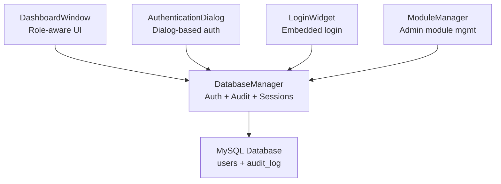
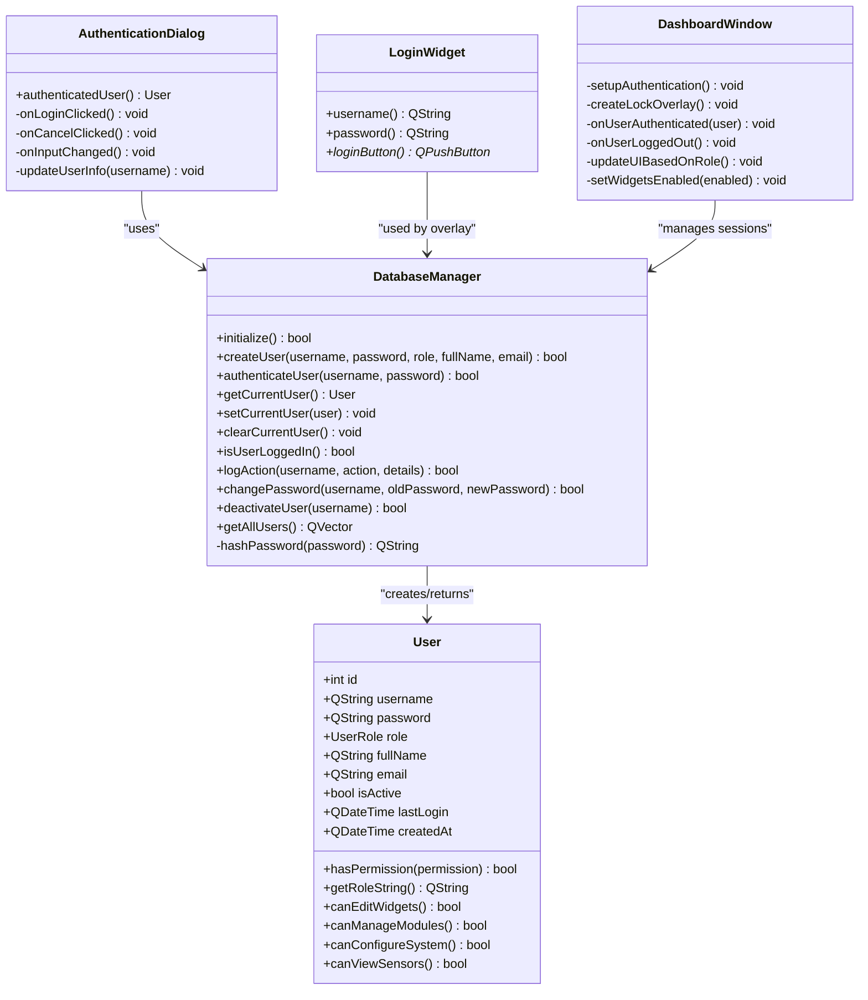
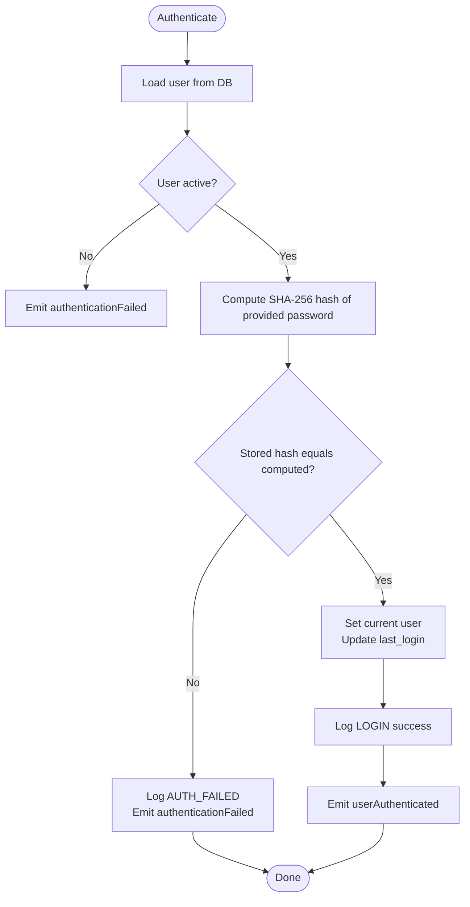
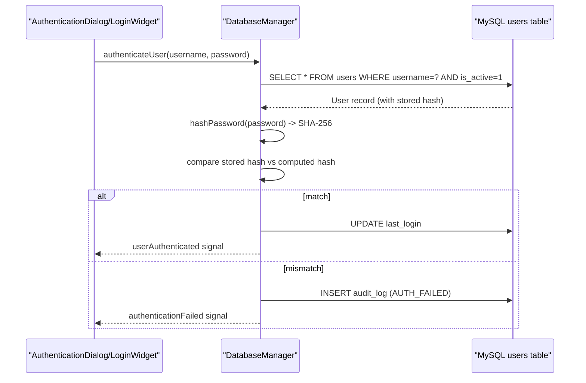
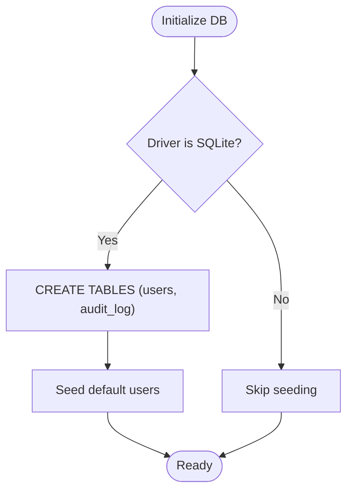
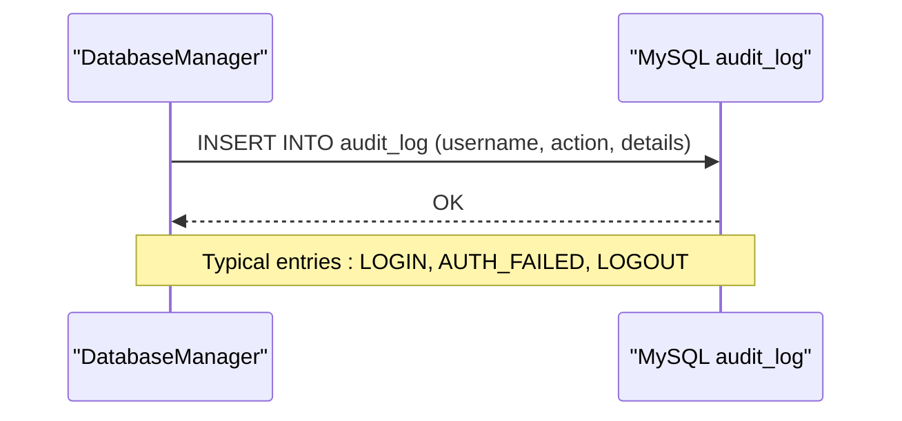
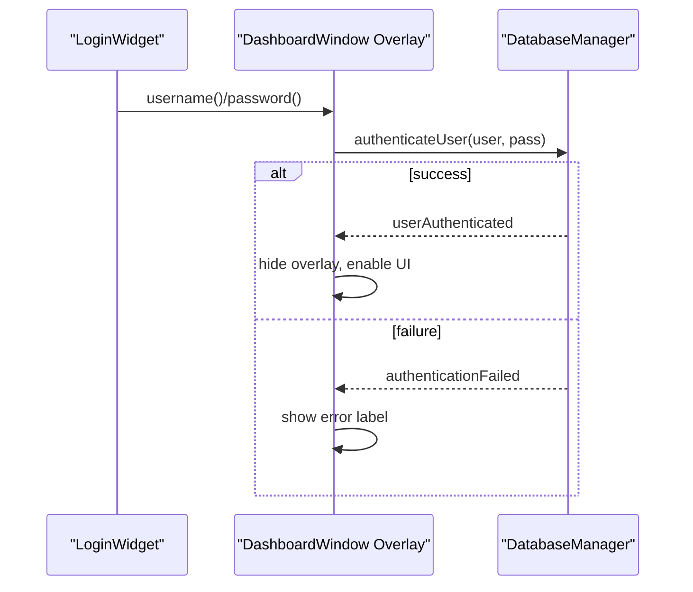
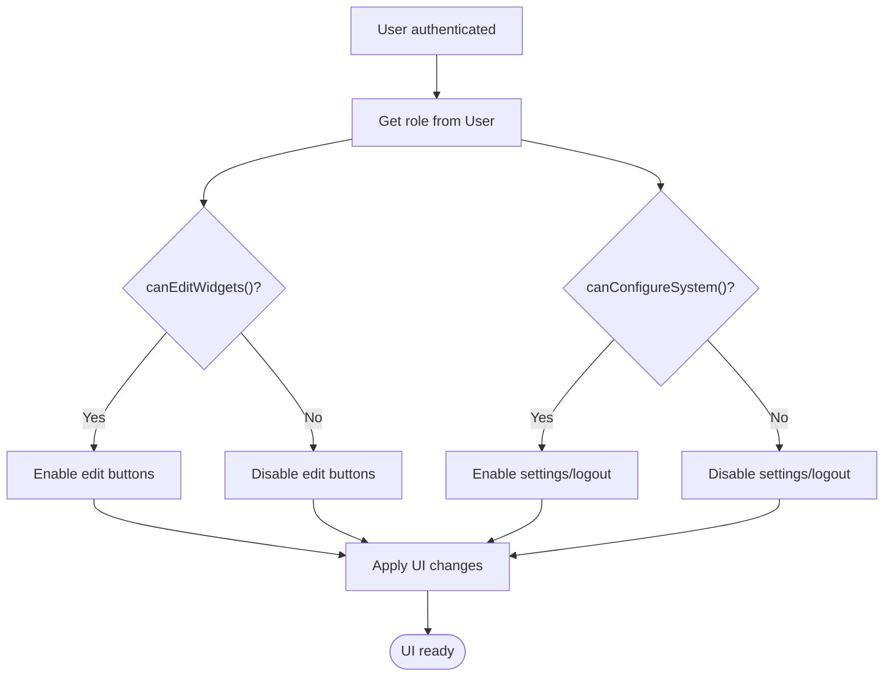
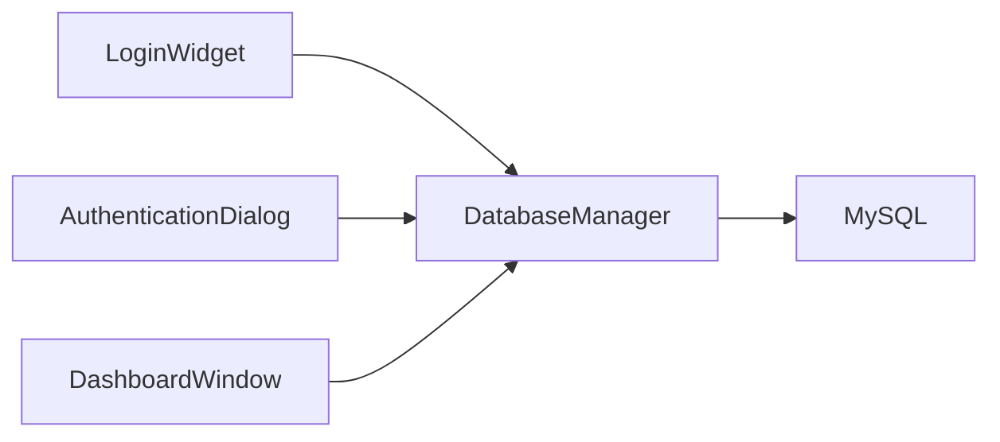

# User Management System

<cite>
**Referenced Files in This Document**
- [loginwidget.h](file://loginwidget.h)
- [loginwidget.cpp](file://loginwidget.cpp)
- [authenticationdialog.h](file://authenticationdialog.h)
- [authenticationdialog.cpp](file://authenticationdialog.cpp)
- [databasemanager.h](file://databasemanager.h)
- [databasemanager.cpp](file://databasemanager.cpp)
- [dashboardwindow.h](file://dashboardwindow.h)
- [dashboardwindow.cpp](file://dashboardwindow.cpp)
- [modulemanager.h](file://modulemanager.h)
- [modulemanager.cpp](file://modulemanager.cpp)
</cite>

## Table of Contents
1. [Introduction](#introduction)
2. [Project Structure](#project-structure)
3. [Core Components](#core-components)
4. [Architecture Overview](#architecture-overview)
5. [Detailed Component Analysis](#detailed-component-analysis)
6. [Dependency Analysis](#dependency-analysis)
7. [Performance Considerations](#performance-considerations)
8. [Troubleshooting Guide](#troubleshooting-guide)
9. [Conclusion](#conclusion)
10. [Appendices](#appendices)

## Introduction
This document describes the user management system for the SurveillanceQT application. It covers the multi-level authentication model (Admin, Operator, Viewer), password hashing using Qt’s cryptographic functions, user registration and role assignment, permission hierarchies, audit logging, and the LoginWidget implementation including form validation, session management, and security measures. It also documents the user administration interface capabilities and best practices for managing user accounts.

## Project Structure
The user management system spans several UI and backend components:
- UI authentication surfaces: LoginWidget and AuthenticationDialog
- Central authentication and session management: DatabaseManager
- Dashboard integration and role-based UI control: DashboardWindow
- Module administration: ModuleManager (used by Administrators)

**Diagram sources**
- [dashboardwindow.cpp:900-921](file://dashboardwindow.cpp#L900-L921)
- [authenticationdialog.cpp:14-41](file://authenticationdialog.cpp#L14-L41)
- [loginwidget.cpp:10-97](file://loginwidget.cpp#L10-L97)
- [databasemanager.cpp:48-65](file://databasemanager.cpp#L48-L65)

**Section sources**
- [dashboardwindow.h:19-99](file://dashboardwindow.h#L19-L99)
- [dashboardwindow.cpp:900-921](file://dashboardwindow.cpp#L900-L921)
- [authenticationdialog.h:14-47](file://authenticationdialog.h#L14-L47)
- [authenticationdialog.cpp:14-41](file://authenticationdialog.cpp#L14-L41)
- [loginwidget.h:8-22](file://loginwidget.h#L8-L22)
- [loginwidget.cpp:10-97](file://loginwidget.cpp#L10-L97)
- [databasemanager.h:34-88](file://databasemanager.h#L34-L88)
- [databasemanager.cpp:48-65](file://databasemanager.cpp#L48-L65)
- [modulemanager.h:18-52](file://modulemanager.h#L18-L52)
- [modulemanager.cpp:17-31](file://modulemanager.cpp#L17-L31)

## Core Components
- DatabaseManager: Provides user lifecycle operations (create, authenticate, update last login, change password, deactivate), session management (setCurrentUser, clearCurrentUser, isUserLoggedIn), and audit logging (logAction). Implements password hashing via QCryptographicHash::Sha256.
- User model: Holds user identity, role, metadata, and helper methods to compute permissions and role strings.
- AuthenticationDialog: Modal dialog for username/password entry, real-time validation, and feedback on authentication failures.
- LoginWidget: Lightweight embedded login panel used within the locked dashboard overlay.
- DashboardWindow: Orchestrates authentication flow, manages role-based UI visibility, and controls widget enablement.
- ModuleManager: Administrative module management dialog (used by Admins) for adding/editing/removing modules.

Key responsibilities:
- Multi-level authentication: Admin (all rights), Operator (limited editing), Viewer (read-only).
- Security: SHA-256 hashed passwords persisted; audit trail for login attempts and actions.
- Session management: Current user stored in-memory; logout clears state and logs out.

**Section sources**
- [databasemanager.h:9-32](file://databasemanager.h#L9-L32)
- [databasemanager.cpp:137-198](file://databasemanager.cpp#L137-L198)
- [databasemanager.cpp:338-341](file://databasemanager.cpp#L338-L341)
- [authenticationdialog.cpp:178-194](file://authenticationdialog.cpp#L178-L194)
- [loginwidget.cpp:99-112](file://loginwidget.cpp#L99-L112)
- [dashboardwindow.cpp:833-869](file://dashboardwindow.cpp#L833-L869)
- [modulemanager.cpp:181-229](file://modulemanager.cpp#L181-L229)

## Architecture Overview
The authentication and user management architecture centers around DatabaseManager, which encapsulates:
- Identity and credentials: users table with role and timestamps
- Audit: audit_log table for tracking actions
- Sessions: in-memory current user state
- Permissions: derived from role via User helpers

**Diagram sources**
- [databasemanager.h:15-87](file://databasemanager.h#L15-L87)
- [authenticationdialog.h:14-47](file://authenticationdialog.h#L14-L47)
- [loginwidget.h:8-22](file://loginwidget.h#L8-L22)
- [dashboardwindow.h:19-99](file://dashboardwindow.h#L19-L99)

## Detailed Component Analysis

### Multi-Level Authentication and Permission Hierarchies
- Roles:
  - Admin: All permissions (can manage users, configure system, edit widgets)
  - Operator: Limited editing (can edit widgets), cannot manage users or configure system
  - Viewer: Read-only (can view sensors)
- Permission helpers:
  - hasPermission(permission): Admin always true; Operator disallowed from managing users/system; Viewer restricted to viewing sensors
  - canEditWidgets(): Admin and Operator
  - canManageModules(): Admin only
  - canConfigureSystem(): Admin only
  - canViewSensors(): All roles

**Diagram sources**
- [databasemanager.cpp:158-198](file://databasemanager.cpp#L158-L198)
- [databasemanager.cpp:309-319](file://databasemanager.cpp#L309-L319)

**Section sources**
- [databasemanager.h:9-13](file://databasemanager.h#L9-L13)
- [databasemanager.cpp:344-381](file://databasemanager.cpp#L344-L381)

### Password Hashing Implementation and Security Compliance
- Hashing: Passwords are hashed using QCryptographicHash::Sha256 and stored as hex-encoded strings.
- Security considerations:
  - SHA-256 is applied to UTF-8 encoded password bytes.
  - Stored hashes are compared directly during authentication.
  - No salt is implemented in the current code; consider adding per-user salt for stronger compliance with modern security standards.

**Diagram sources**
- [databasemanager.cpp:158-198](file://databasemanager.cpp#L158-L198)
- [databasemanager.cpp:309-319](file://databasemanager.cpp#L309-L319)
- [databasemanager.cpp:338-341](file://databasemanager.cpp#L338-L341)

**Section sources**
- [databasemanager.cpp:338-341](file://databasemanager.cpp#L338-L341)
- [databasemanager.cpp:158-198](file://databasemanager.cpp#L158-L198)

### User Registration, Role Assignment, and Default Accounts
- Registration:
  - createUser inserts a new user with a hashed password and role string.
  - Role is persisted as a string ("admin", "operator", "viewer").
- Default users:
  - On first-time initialization with SQLite driver, default users are created: admin, operateur, visiteur.
- Deactivation:
  - deactivateUser sets is_active to 0.

**Diagram sources**
- [databasemanager.cpp:21-41](file://databasemanager.cpp#L21-L41)
- [databasemanager.cpp:74-115](file://databasemanager.cpp#L74-L115)
- [databasemanager.cpp:117-135](file://databasemanager.cpp#L117-L135)

**Section sources**
- [databasemanager.cpp:137-156](file://databasemanager.cpp#L137-L156)
- [databasemanager.cpp:117-135](file://databasemanager.cpp#L117-L135)
- [databasemanager.cpp:261-267](file://databasemanager.cpp#L261-L267)

### Audit Logging System
- Tables:
  - users: stores user credentials, role, activity flags, timestamps
  - audit_log: records username, action, details, timestamp
- Events logged:
  - Successful login (LOGIN)
  - Failed login attempts (AUTH_FAILED)
  - Logout events (LOGOUT)
- Methods:
  - logAction writes entries to audit_log
  - clearCurrentUser emits LOGOUT when ending a session

**Diagram sources**
- [databasemanager.cpp:309-319](file://databasemanager.cpp#L309-L319)
- [databasemanager.cpp:290-302](file://databasemanager.cpp#L290-L302)

**Section sources**
- [databasemanager.cpp:74-115](file://databasemanager.cpp#L74-L115)
- [databasemanager.cpp:309-319](file://databasemanager.cpp#L309-L319)

### LoginWidget Implementation: Form Validation, Session Management, and Security Measures
- UI elements:
  - Username and password fields with echo mode set to password
  - Login button bound to Enter key on both fields
- Behavior:
  - Exposes username(), password(), and loginButton() for integration
  - Used within the dashboard lock overlay to gate access until successful authentication
- Security measures:
  - Password field masked
  - Real-time enablement of login button when both fields are non-empty
  - Authentication failures surfaced to the overlay for user feedback

**Diagram sources**
- [loginwidget.cpp:99-112](file://loginwidget.cpp#L99-L112)
- [dashboardwindow.cpp:1057-1077](file://dashboardwindow.cpp#L1057-L1077)
- [databasemanager.cpp:158-198](file://databasemanager.cpp#L158-L198)

**Section sources**
- [loginwidget.h:8-22](file://loginwidget.h#L8-L22)
- [loginwidget.cpp:10-97](file://loginwidget.cpp#L10-L97)
- [dashboardwindow.cpp:1057-1077](file://dashboardwindow.cpp#L1057-L1077)

### Role-Based UI Control and Best Practices for User Account Management
- Role-based UI:
  - updateUIBasedOnRole enables/disables edit buttons and settings based on current user role
  - setWidgetsEnabled toggles interactivity of widgets and panels
- Best practices:
  - Admins should manage users and modules; Operators can edit widget configurations; Viewers see read-only dashboards
  - Use deactivateUser to disable compromised or unused accounts
  - Regularly review audit_log for failed login attempts and suspicious activity
  - Consider enforcing password policies and periodic password changes

**Diagram sources**
- [dashboardwindow.cpp:1079-1105](file://dashboardwindow.cpp#L1079-L1105)
- [databasemanager.cpp:363-381](file://databasemanager.cpp#L363-L381)

**Section sources**
- [dashboardwindow.cpp:1079-1105](file://dashboardwindow.cpp#L1079-L1105)
- [databasemanager.cpp:363-381](file://databasemanager.cpp#L363-L381)

### User Administration Interface Functionality
- ModuleManager provides administrative capabilities:
  - Add/Edit/Delete modules
  - Reorder modules
  - Visual indicators for enabled/disabled modules
- Accessible to Admins; Operators and Viewers cannot access this dialog in the current implementation.

**Section sources**
- [modulemanager.h:18-52](file://modulemanager.h#L18-L52)
- [modulemanager.cpp:181-229](file://modulemanager.cpp#L181-L229)
- [modulemanager.cpp:280-297](file://modulemanager.cpp#L280-L297)

## Dependency Analysis
- DashboardWindow depends on DatabaseManager for authentication and session state.
- AuthenticationDialog and LoginWidget both delegate to DatabaseManager for authentication.
- DatabaseManager depends on Qt SQL and cryptographic modules for persistence and hashing.
- Audit logging is decoupled via signals and direct SQL insertion.

**Diagram sources**
- [dashboardwindow.cpp:900-921](file://dashboardwindow.cpp#L900-L921)
- [authenticationdialog.cpp:14-41](file://authenticationdialog.cpp#L14-L41)
- [loginwidget.cpp:10-97](file://loginwidget.cpp#L10-L97)
- [databasemanager.cpp:48-65](file://databasemanager.cpp#L48-L65)

**Section sources**
- [dashboardwindow.cpp:900-921](file://dashboardwindow.cpp#L900-L921)
- [authenticationdialog.cpp:14-41](file://authenticationdialog.cpp#L14-L41)
- [loginwidget.cpp:10-97](file://loginwidget.cpp#L10-L97)
- [databasemanager.cpp:48-65](file://databasemanager.cpp#L48-L65)

## Performance Considerations
- Database queries are lightweight; ensure indexes on frequently queried columns (e.g., username) if scaling to large user bases.
- Audit logging occurs on every login attempt; consider batching or rate-limiting in high-throughput scenarios.
- Password hashing is CPU-lightweight; avoid excessive re-hashing in tight loops.

## Troubleshooting Guide
- Authentication fails immediately:
  - Verify database connectivity and credentials; check databaseError signals.
  - Confirm user exists and is active.
- Incorrect password:
  - Ensure password matches the SHA-256 hash stored in the database.
  - Review authenticationFailed signals and audit_log entries.
- Login dialog does not appear:
  - Ensure setupAuthentication initializes DatabaseManager and creates the lock overlay.
- UI remains disabled after login:
  - Check updateUIBasedOnRole and setWidgetsEnabled logic for role checks.

**Section sources**
- [databasemanager.cpp:58-64](file://databasemanager.cpp#L58-L64)
- [databasemanager.cpp:164-178](file://databasemanager.cpp#L164-L178)
- [dashboardwindow.cpp:917-921](file://dashboardwindow.cpp#L917-L921)
- [dashboardwindow.cpp:1079-1105](file://dashboardwindow.cpp#L1079-L1105)

## Conclusion
The SurveillanceQT user management system implements a robust multi-level authentication model with clear role-based permissions, secure password hashing, and comprehensive audit logging. The LoginWidget and AuthenticationDialog provide intuitive, secure entry points, while DashboardWindow integrates authentication into the UI with role-aware controls. Administrators can manage modules and users, while Operators and Viewers operate within appropriate constraints. For enhanced security, consider adding per-user salt and password policies.

## Appendices
- Default credentials:
  - admin: admin123
  - operateur: operateur123
  - visiteur: visiteur123
- Audit log fields:
  - username, action, details, timestamp