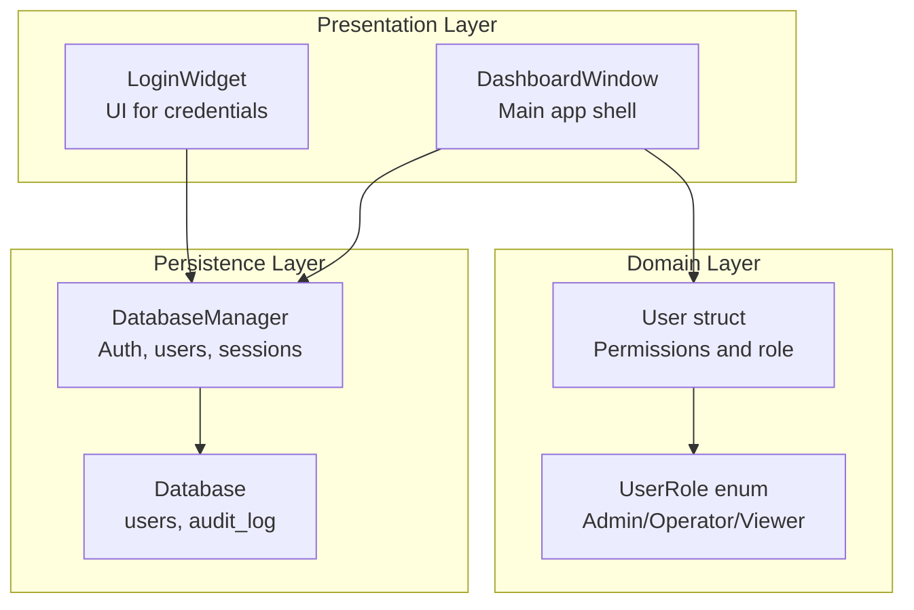
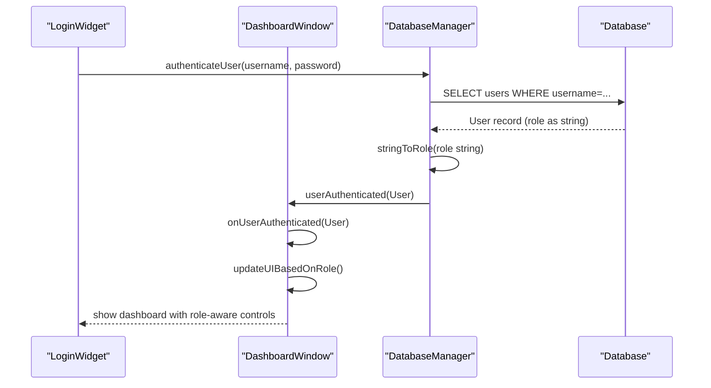
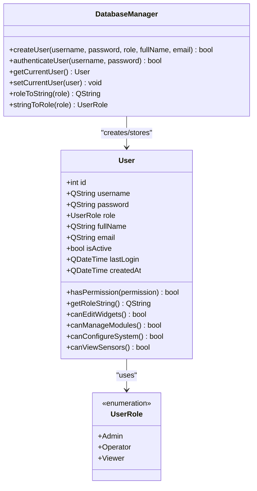
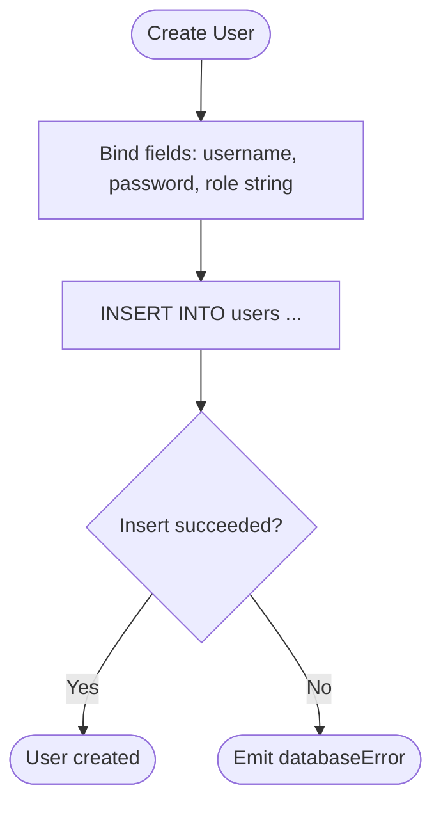
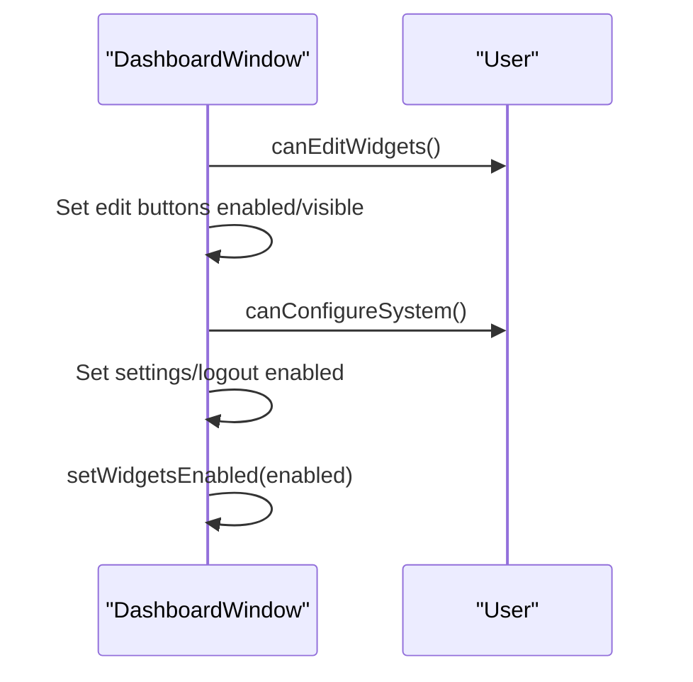
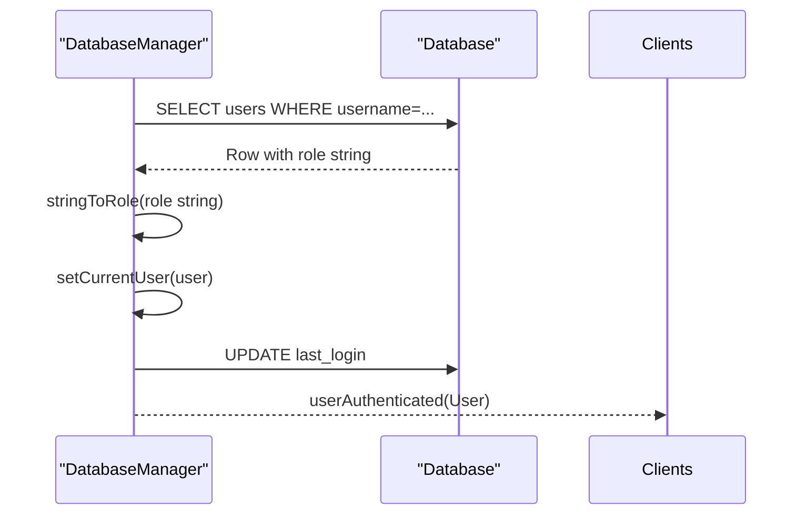
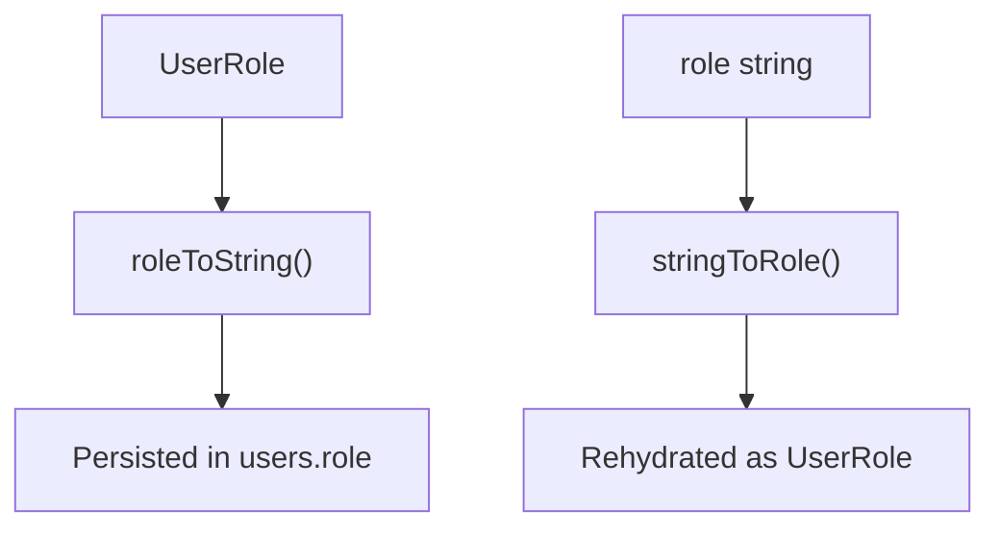
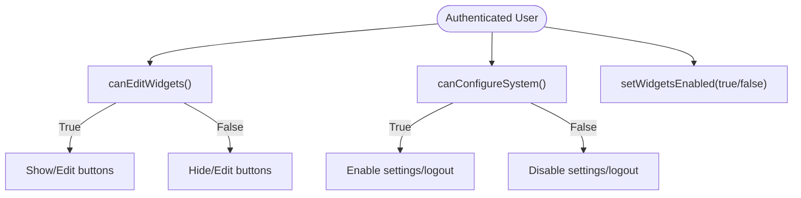
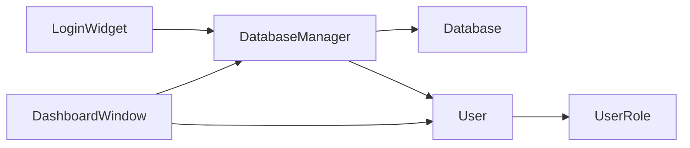

# User Roles and Permissions

<cite>
**Referenced Files in This Document**
- [databasemanager.h](file://databasemanager.h)
- [databasemanager.cpp](file://databasemanager.cpp)
- [dashboardwindow.h](file://dashboardwindow.h)
- [dashboardwindow.cpp](file://dashboardwindow.cpp)
- [loginwidget.h](file://loginwidget.h)
- [loginwidget.cpp](file://loginwidget.cpp)
</cite>

## Table of Contents
1. [Introduction](#introduction)
2. [Project Structure](#project-structure)
3. [Core Components](#core-components)
4. [Architecture Overview](#architecture-overview)
5. [Detailed Component Analysis](#detailed-component-analysis)
6. [Dependency Analysis](#dependency-analysis)
7. [Performance Considerations](#performance-considerations)
8. [Troubleshooting Guide](#troubleshooting-guide)
9. [Conclusion](#conclusion)

## Introduction
This document describes the role-based access control (RBAC) system used in the SurveillanceQT application. It defines three user roles—Admin (full rights), Operator (medium rights for modifying certain parameters), and Viewer (read-only access)—and documents the underlying data model, permission-checking methods, and runtime enforcement mechanisms. It also covers role assignment during user creation, role-to-string conversion utilities, and role-based UI element visibility controls.

## Project Structure
The RBAC system spans several components:
- Data model and permissions: User struct and UserRole enum
- Persistence and session management: DatabaseManager
- Authentication UI: LoginWidget
- Application shell and runtime enforcement: DashboardWindow

**Diagram sources**
- [databasemanager.h:9-32](file://databasemanager.h#L9-L32)
- [databasemanager.cpp:158-198](file://databasemanager.cpp#L158-L198)
- [loginwidget.h:8-21](file://loginwidget.h#L8-L21)
- [dashboardwindow.h:19-98](file://dashboardwindow.h#L19-L98)

**Section sources**
- [databasemanager.h:9-32](file://databasemanager.h#L9-L32)
- [dashboardwindow.h:19-98](file://dashboardwindow.h#L19-L98)
- [loginwidget.h:8-21](file://loginwidget.h#L8-L21)

## Core Components
- UserRole enum: Defines Admin, Operator, and Viewer with descriptive comments.
- User struct: Holds identity and role, plus permission-checking helpers:
  - hasPermission(permission): Evaluates granular permission strings against role.
  - getRoleString(): Returns localized role name.
  - canEditWidgets(): True for Admin and Operator.
  - canManageModules(): True for Admin.
  - canConfigureSystem(): True for Admin.
  - canViewSensors(): True for all roles.
- DatabaseManager: Handles user lifecycle, authentication, current user session, and role persistence via string mapping.

**Section sources**
- [databasemanager.h:9-32](file://databasemanager.h#L9-L32)
- [databasemanager.cpp:343-381](file://databasemanager.cpp#L343-L381)
- [databasemanager.cpp:321-336](file://databasemanager.cpp#L321-L336)

## Architecture Overview
The RBAC architecture centers on the User struct and DatabaseManager. Authentication resolves a User record from the database, sets the current session, and triggers UI updates. Permission checks are performed at runtime to control UI visibility and enablement.

**Diagram sources**
- [databasemanager.cpp:158-198](file://databasemanager.cpp#L158-L198)
- [databasemanager.cpp:331-336](file://databasemanager.cpp#L331-L336)
- [dashboardwindow.cpp:833-853](file://dashboardwindow.cpp#L833-L853)
- [dashboardwindow.cpp:1079-1105](file://dashboardwindow.cpp#L1079-L1105)

## Detailed Component Analysis

### User Role Model and Permission Methods
The User struct encapsulates role and permission logic:
- hasPermission(permission): Enforces role-based permission gates.
- getRoleString(): Converts internal role to a human-readable string.
- canEditWidgets(), canManageModules(), canConfigureSystem(), canViewSensors(): Convenience methods for UI and feature gating.

**Diagram sources**
- [databasemanager.h:9-32](file://databasemanager.h#L9-L32)
- [databasemanager.cpp:137-156](file://databasemanager.cpp#L137-L156)
- [databasemanager.cpp:321-336](file://databasemanager.cpp#L321-L336)
- [databasemanager.cpp:343-381](file://databasemanager.cpp#L343-L381)

**Section sources**
- [databasemanager.h:9-32](file://databasemanager.h#L9-L32)
- [databasemanager.cpp:343-381](file://databasemanager.cpp#L343-L381)

### Role Assignment During User Creation
- createUser(...) persists a new user with role mapped to a lowercase string ("admin", "operator", "viewer").
- createDefaultUsers(...) seeds three default users with distinct roles for out-of-the-box usability.

**Diagram sources**
- [databasemanager.cpp:137-156](file://databasemanager.cpp#L137-L156)
- [databasemanager.cpp:117-135](file://databasemanager.cpp#L117-L135)

**Section sources**
- [databasemanager.cpp:137-156](file://databasemanager.cpp#L137-L156)
- [databasemanager.cpp:117-135](file://databasemanager.cpp#L117-L135)

### Runtime Role Validation and UI Enforcement
- Authentication populates the current user session and triggers UI updates.
- updateUIBasedOnRole() enables/disables editing controls and settings based on canEditWidgets() and canConfigureSystem().
- setWidgetsEnabled() toggles interactivity for all widgets and dynamic sensors.

**Diagram sources**
- [dashboardwindow.cpp:1079-1105](file://dashboardwindow.cpp#L1079-L1105)
- [dashboardwindow.cpp:1107-1129](file://dashboardwindow.cpp#L1107-L1129)
- [databasemanager.cpp:363-371](file://databasemanager.cpp#L363-L371)

**Section sources**
- [dashboardwindow.cpp:1079-1105](file://dashboardwindow.cpp#L1079-L1105)
- [dashboardwindow.cpp:1107-1129](file://dashboardwindow.cpp#L1107-L1129)
- [databasemanager.cpp:363-371](file://databasemanager.cpp#L363-L371)

### Authentication Flow and Current User Management
- authenticateUser(...) queries the database, validates credentials, maps role string to UserRole, sets current user, updates last login, logs the action, and emits userAuthenticated.
- setCurrentUser(...) stores the authenticated user in memory for the session.
- clearCurrentUser() logs the action and emits userLoggedOut.

**Diagram sources**
- [databasemanager.cpp:158-198](file://databasemanager.cpp#L158-L198)
- [databasemanager.cpp:228-234](file://databasemanager.cpp#L228-L234)
- [databasemanager.cpp:290-302](file://databasemanager.cpp#L290-L302)
- [databasemanager.cpp:331-336](file://databasemanager.cpp#L331-L336)

**Section sources**
- [databasemanager.cpp:158-198](file://databasemanager.cpp#L158-L198)
- [databasemanager.cpp:290-302](file://databasemanager.cpp#L290-L302)
- [databasemanager.cpp:331-336](file://databasemanager.cpp#L331-L336)

### Role-to-String Conversion Utilities
- roleToString(UserRole): Serializes role to lowercase string for storage.
- stringToRole(QString): Deserializes stored role string to UserRole.

**Diagram sources**
- [databasemanager.cpp:321-336](file://databasemanager.cpp#L321-L336)

**Section sources**
- [databasemanager.cpp:321-336](file://databasemanager.cpp#L321-L336)

### Permission Checking Examples
- hasPermission("manage_users"): Only Admin passes; Operator and Viewer fail.
- hasPermission("configure_system"): Only Admin passes; Operator and Viewer fail.
- hasPermission("view_sensors"): Only Viewer must pass; Admin and Operator pass implicitly via hasPermission logic.
- canEditWidgets(): Admin and Operator allowed; Viewer denied.
- canManageModules(): Admin only.
- canConfigureSystem(): Admin only.
- canViewSensors(): All roles allowed.

Note: The hasPermission method enforces a policy where Admin bypasses checks, Operator is restricted from managing users and configuring system, and Viewer is restricted to viewing sensors.

**Section sources**
- [databasemanager.cpp:343-351](file://databasemanager.cpp#L343-L351)
- [databasemanager.cpp:363-381](file://databasemanager.cpp#L363-L381)

### Role-Based UI Element Visibility Controls
- Edit buttons on widgets are shown/hidden based on canEditWidgets().
- Settings/logout actions are enabled only for roles with canConfigureSystem().
- All interactive widgets and dynamic sensors are enabled/disabled via setWidgetsEnabled().

**Diagram sources**
- [dashboardwindow.cpp:1079-1105](file://dashboardwindow.cpp#L1079-L1105)
- [dashboardwindow.cpp:1107-1129](file://dashboardwindow.cpp#L1107-L1129)

**Section sources**
- [dashboardwindow.cpp:1079-1105](file://dashboardwindow.cpp#L1079-L1105)
- [dashboardwindow.cpp:1107-1129](file://dashboardwindow.cpp#L1107-L1129)

## Dependency Analysis
- User depends on UserRole for policy decisions.
- DatabaseManager depends on User for session state and on the database for persistence.
- DashboardWindow depends on DatabaseManager for authentication events and on User for runtime permission checks.
- LoginWidget provides credentials to DatabaseManager.

**Diagram sources**
- [databasemanager.h:9-32](file://databasemanager.h#L9-L32)
- [dashboardwindow.h:19-98](file://dashboardwindow.h#L19-L98)
- [loginwidget.h:8-21](file://loginwidget.h#L8-L21)

**Section sources**
- [databasemanager.h:9-32](file://databasemanager.h#L9-L32)
- [dashboardwindow.h:19-98](file://dashboardwindow.h#L19-L98)
- [loginwidget.h:8-21](file://loginwidget.h#L8-L21)

## Performance Considerations
- Permission checks are O(1) and lightweight, suitable for frequent UI updates.
- Authentication involves a single database query per login attempt; caching the current user reduces repeated lookups.
- Role string serialization/deserialization is negligible overhead compared to database operations.

## Troubleshooting Guide
- Authentication fails:
  - Verify credentials and that the user is active.
  - Check database errors emitted by DatabaseManager.
- Unexpected permission denial:
  - Confirm the user’s role and the specific permission being checked.
  - Review hasPermission logic for Admin bypass and Operator restrictions.
- UI controls not updating:
  - Ensure onUserAuthenticated() is invoked after successful authentication.
  - Verify updateUIBasedOnRole() runs and setWidgetsEnabled() is called.

**Section sources**
- [databasemanager.cpp:158-198](file://databasemanager.cpp#L158-L198)
- [databasemanager.cpp:343-351](file://databasemanager.cpp#L343-L351)
- [dashboardwindow.cpp:833-853](file://dashboardwindow.cpp#L833-L853)
- [dashboardwindow.cpp:1079-1105](file://dashboardwindow.cpp#L1079-L1105)

## Conclusion
The RBAC system is centered on a compact User model with explicit permission helpers and a DatabaseManager that manages authentication and session state. Roles are persisted as strings and mapped to enums at runtime. Permission checks and UI updates are integrated into the authentication flow, ensuring consistent enforcement across the application. The design supports straightforward extension for additional roles or permissions.