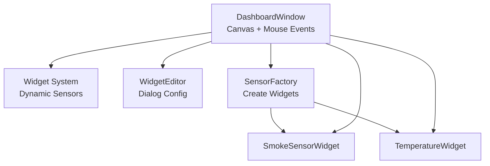
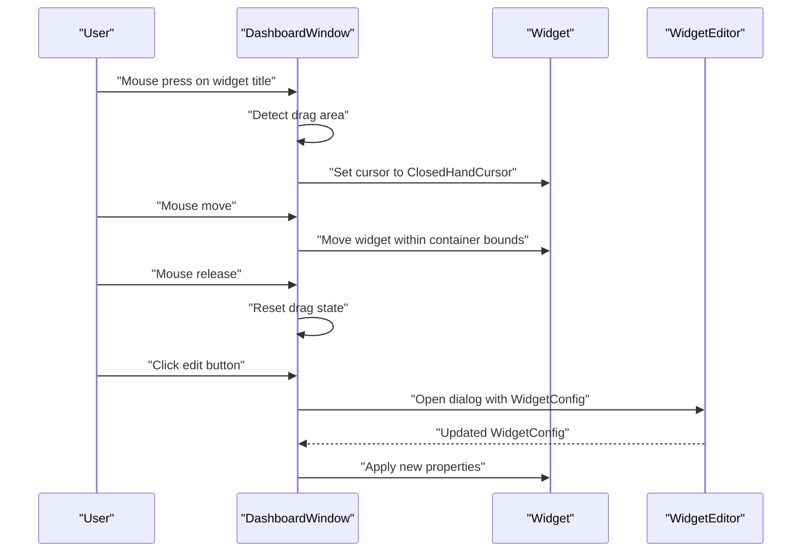
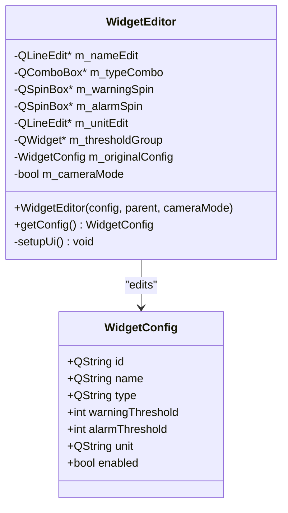
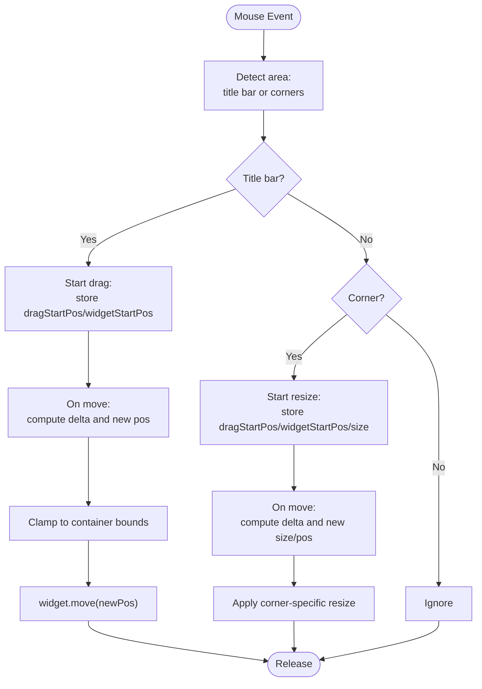
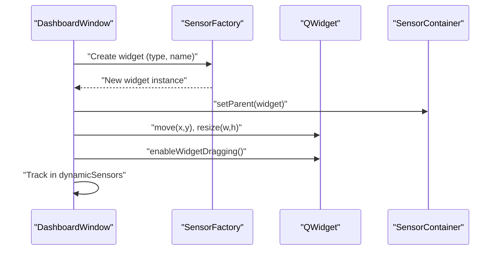
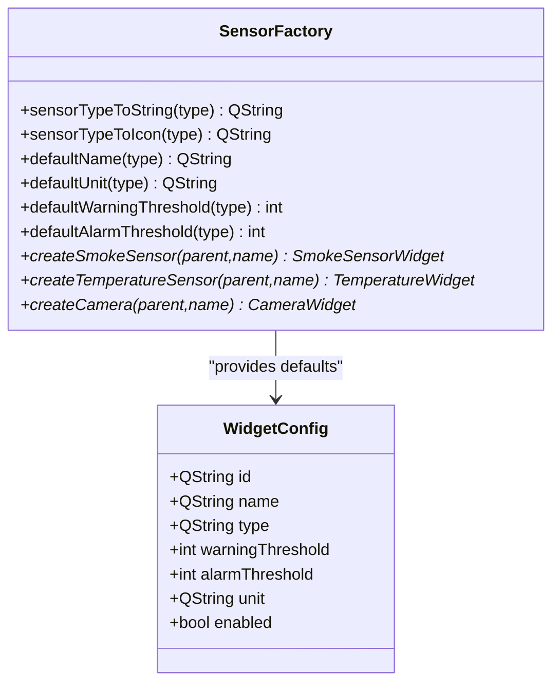
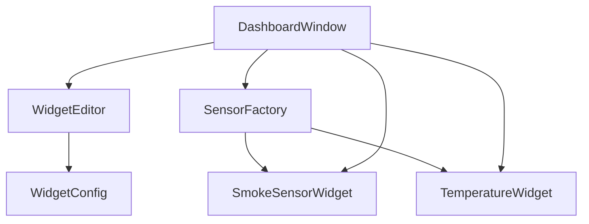

# Drag-and-Drop Interface

<cite>
**Referenced Files in This Document**
- [widgeteditor.h](file://widgeteditor.h)
- [widgeteditor.cpp](file://widgeteditor.cpp)
- [dashboardwindow.h](file://dashboardwindow.h)
- [dashboardwindow.cpp](file://dashboardwindow.cpp)
- [sensorfactory.h](file://sensorfactory.h)
- [sensorfactory.cpp](file://sensorfactory.cpp)
- [smokesensorwidget.h](file://smokesensorwidget.h)
- [temperaturewidget.h](file://temperaturewidget.h)
</cite>

## Table of Contents
1. [Introduction](#introduction)
2. [Project Structure](#project-structure)
3. [Core Components](#core-components)
4. [Architecture Overview](#architecture-overview)
5. [Detailed Component Analysis](#detailed-component-analysis)
6. [Dependency Analysis](#dependency-analysis)
7. [Performance Considerations](#performance-considerations)
8. [Troubleshooting Guide](#troubleshooting-guide)
9. [Conclusion](#conclusion)

## Introduction
This document explains the drag-and-drop interface implementation used to manage widgets on the dashboard. It focuses on the WidgetEditor class that provides a dialog-based configuration system for widget properties, the DashboardWindow class that orchestrates mouse events and widget manipulation, and the underlying WidgetConfig structure that stores widget metadata. Practical workflows for creating, moving, resizing, and configuring widgets are documented with code-level diagrams and step-by-step sequences.

## Project Structure
The drag-and-drop and configuration features span several modules:
- DashboardWindow manages the canvas, mouse interactions, and widget lifecycle.
- WidgetEditor provides a modal dialog to edit widget properties.
- SensorFactory creates widget instances with sensible defaults.
- SmokeSensorWidget and TemperatureWidget are concrete widget types with edit/close controls.

**Diagram sources**
- [dashboardwindow.h:19-99](file://dashboardwindow.h#L19-L99)
- [widgeteditor.h:20-41](file://widgeteditor.h#L20-L41)
- [sensorfactory.h:28-41](file://sensorfactory.h#L28-L41)
- [smokesensorwidget.h:10-53](file://smokesensorwidget.h#L10-L53)
- [temperaturewidget.h:11-54](file://temperaturewidget.h#L11-L54)

**Section sources**
- [dashboardwindow.h:19-99](file://dashboardwindow.h#L19-L99)
- [widgeteditor.h:20-41](file://widgeteditor.h#L20-L41)
- [sensorfactory.h:28-41](file://sensorfactory.h#L28-L41)
- [smokesensorwidget.h:10-53](file://smokesensorwidget.h#L10-L53)
- [temperaturewidget.h:11-54](file://temperaturewidget.h#L11-L54)

## Core Components
- WidgetConfig: Holds widget identity and configuration (id, name, type, thresholds, unit, enabled).
- WidgetEditor: Dialog that edits WidgetConfig with name, type, thresholds, and unit fields.
- DashboardWindow: Hosts widgets, handles mouse press/move/release, and manages dragging/resizing.
- SensorFactory: Creates widget instances and provides defaults for thresholds and units.
- Concrete widgets: SmokeSensorWidget and TemperatureWidget expose edit/close actions.

**Section sources**
- [widgeteditor.h:10-18](file://widgeteditor.h#L10-L18)
- [widgeteditor.h:20-41](file://widgeteditor.h#L20-L41)
- [dashboardwindow.h:19-99](file://dashboardwindow.h#L19-L99)
- [sensorfactory.h:19-26](file://sensorfactory.h#L19-L26)
- [sensorfactory.h:28-41](file://sensorfactory.h#L28-L41)
- [smokesensorwidget.h:20-34](file://smokesensorwidget.h#L20-L34)
- [temperaturewidget.h:21-35](file://temperaturewidget.h#L21-L35)

## Architecture Overview
The drag-and-drop system centers around DashboardWindow’s mouse event handlers and a shared sensor container. Widgets are positioned absolutely within the container and support both dragging and corner resizing. A dialog-driven configuration system allows editing of widget properties.

**Diagram sources**
- [dashboardwindow.cpp:1355-1405](file://dashboardwindow.cpp#L1355-L1405)
- [widgeteditor.cpp:119-129](file://widgeteditor.cpp#L119-L129)

## Detailed Component Analysis

### WidgetEditor: Dialog-Based Configuration
WidgetEditor is a QDialog that exposes fields for:
- Name: QLineEdit
- Type: QComboBox (values depend on camera mode)
- Thresholds: QSpinBox for warning and alarm
- Unit: QLineEdit
- Mode: Camera mode hides thresholds and locks type

Behavior:
- On construction, fields are populated from a provided WidgetConfig.
- In camera mode, threshold group is hidden and type combo is disabled.
- getConfig() returns a modified copy of the original configuration.

**Diagram sources**
- [widgeteditor.h:20-41](file://widgeteditor.h#L20-L41)
- [widgeteditor.h:10-18](file://widgeteditor.h#L10-L18)

**Section sources**
- [widgeteditor.h:10-18](file://widgeteditor.h#L10-L18)
- [widgeteditor.h:20-41](file://widgeteditor.h#L20-L41)
- [widgeteditor.cpp:12-31](file://widgeteditor.cpp#L12-L31)
- [widgeteditor.cpp:33-117](file://widgeteditor.cpp#L33-L117)
- [widgeteditor.cpp:119-129](file://widgeteditor.cpp#L119-L129)

### DashboardWindow: Drag-and-Resize Mechanics
DashboardWindow implements mouse event handling for:
- Drag detection: Recognizes the title bar region and starts dragging.
- Dragging: Moves the widget within the sensor container bounds.
- Resizing: Detects corner regions and resizes accordingly.
- Cursor feedback: Updates cursor shape based on proximity to edges/corners.

Key logic:
- Mouse press identifies draggable/resizable areas and sets cursors.
- Mouse move updates widget position or size depending on mode.
- Mouse release resets internal state.

**Diagram sources**
- [dashboardwindow.cpp:1355-1436](file://dashboardwindow.cpp#L1355-L1436)

**Section sources**
- [dashboardwindow.h:26-32](file://dashboardwindow.h#L26-L32)
- [dashboardwindow.cpp:1355-1436](file://dashboardwindow.cpp#L1355-L1436)

### Widget Placement and Lifecycle
- Fixed widgets are placed during initialization with absolute coordinates and sizes.
- Dynamic widgets are added via SensorFactory and positioned with addSensorToGrid.
- enableWidgetDragging attaches mouse handlers to allow dragging/resizing.

**Diagram sources**
- [dashboardwindow.cpp:1131-1153](file://dashboardwindow.cpp#L1131-L1153)
- [sensorfactory.cpp:83-102](file://sensorfactory.cpp#L83-L102)

**Section sources**
- [dashboardwindow.cpp:163-184](file://dashboardwindow.cpp#L163-L184)
- [dashboardwindow.cpp:1131-1153](file://dashboardwindow.cpp#L1131-L1153)
- [sensorfactory.cpp:83-102](file://sensorfactory.cpp#L83-L102)

### WidgetConfig: Properties and Defaults
WidgetConfig encapsulates widget metadata:
- Identity: id, name
- Type: type
- Thresholds: warningThreshold, alarmThreshold
- Unit: unit
- State: enabled

Defaults are provided by SensorFactory for threshold values and units per sensor type.

**Diagram sources**
- [widgeteditor.h:10-18](file://widgeteditor.h#L10-L18)
- [sensorfactory.h:19-26](file://sensorfactory.h#L19-L26)
- [sensorfactory.h:28-41](file://sensorfactory.h#L28-L41)
- [sensorfactory.cpp:7-81](file://sensorfactory.cpp#L7-L81)

**Section sources**
- [widgeteditor.h:10-18](file://widgeteditor.h#L10-L18)
- [sensorfactory.h:19-26](file://sensorfactory.h#L19-L26)
- [sensorfactory.cpp:7-81](file://sensorfactory.cpp#L7-L81)

### Practical Workflows

#### Creating a New Widget
- Open the add sensor dialog and select a sensor type.
- Use SensorFactory to instantiate the widget with a default name.
- Place the widget in the sensor container and enable dragging.

References:
- [dashboardwindow.cpp:1155-1200](file://dashboardwindow.cpp#L1155-L1200)
- [sensorfactory.cpp:83-102](file://sensorfactory.cpp#L83-L102)

#### Moving a Widget
- Press and hold the widget’s title bar.
- Drag within the sensor container boundaries.
- Release to drop the widget at the new position.

References:
- [dashboardwindow.cpp:1355-1405](file://dashboardwindow.cpp#L1355-L1405)

#### Resizing a Widget
- Hover near a corner to change the cursor to a sizing arrow.
- Drag the corner to resize while maintaining aspect constraints.
- Release to finalize the new size.

References:
- [dashboardwindow.cpp:1407-1436](file://dashboardwindow.cpp#L1407-L1436)

#### Configuring Widget Properties
- Click the edit button on a widget to open WidgetEditor.
- Adjust name, type, thresholds, and unit.
- Save to apply the new configuration.

References:
- [widgeteditor.cpp:119-129](file://widgeteditor.cpp#L119-L129)
- [smokesensorwidget.h:22-23](file://smokesensorwidget.h#L22-L23)
- [temperaturewidget.h:23-24](file://temperaturewidget.h#L23-L24)

## Dependency Analysis
The following diagram shows how components depend on each other in the drag-and-drop and configuration pipeline.

**Diagram sources**
- [dashboardwindow.h:19-99](file://dashboardwindow.h#L19-L99)
- [widgeteditor.h:20-41](file://widgeteditor.h#L20-L41)
- [sensorfactory.h:28-41](file://sensorfactory.h#L28-L41)
- [smokesensorwidget.h:20-34](file://smokesensorwidget.h#L20-L34)
- [temperaturewidget.h:21-35](file://temperaturewidget.h#L21-L35)

**Section sources**
- [dashboardwindow.h:19-99](file://dashboardwindow.h#L19-L99)
- [widgeteditor.h:20-41](file://widgeteditor.h#L20-L41)
- [sensorfactory.h:28-41](file://sensorfactory.h#L28-L41)
- [smokesensorwidget.h:20-34](file://smokesensorwidget.h#L20-L34)
- [temperaturewidget.h:21-35](file://temperaturewidget.h#L21-L35)

## Performance Considerations
- Dragging and resizing occur on the UI thread; keep computations minimal in mouse handlers.
- Clamping widget positions avoids expensive layout recalculations.
- Using absolute positioning in the sensor container reduces grid overhead for dynamic widgets.

## Troubleshooting Guide
- Widget does not move: Verify enableWidgetDragging is called after adding the widget to the sensor container.
- Resize handles not visible: Ensure the widget’s corner proximity triggers cursor changes.
- Configuration not applied: Confirm WidgetEditor::getConfig is used to update widget properties.

**Section sources**
- [dashboardwindow.cpp:1146-1153](file://dashboardwindow.cpp#L1146-L1153)
- [dashboardwindow.cpp:1372-1388](file://dashboardwindow.cpp#L1372-L1388)
- [widgeteditor.cpp:119-129](file://widgeteditor.cpp#L119-L129)

## Conclusion
The drag-and-drop interface combines a robust mouse event handler in DashboardWindow with a flexible dialog-based configuration system via WidgetEditor. Together with SensorFactory, it enables intuitive creation, placement, movement, resizing, and customization of widgets on the dashboard.