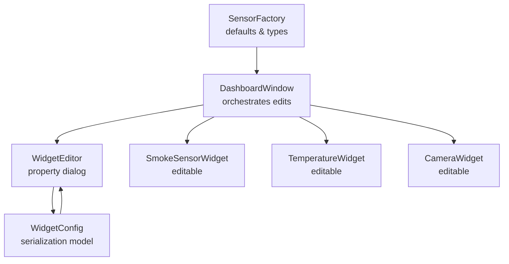
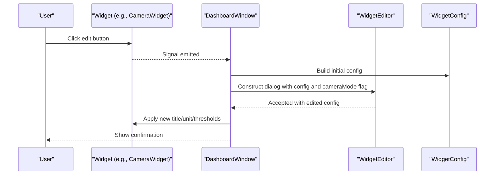
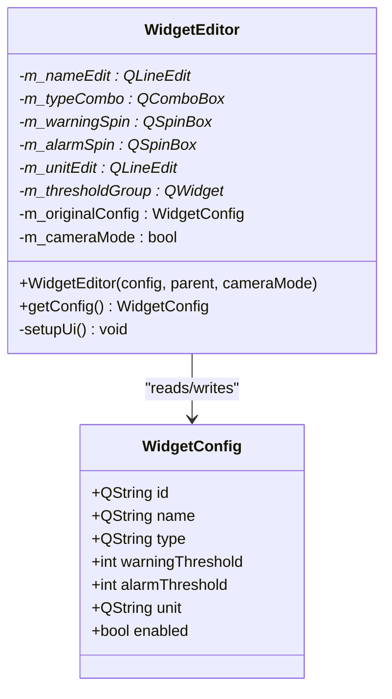
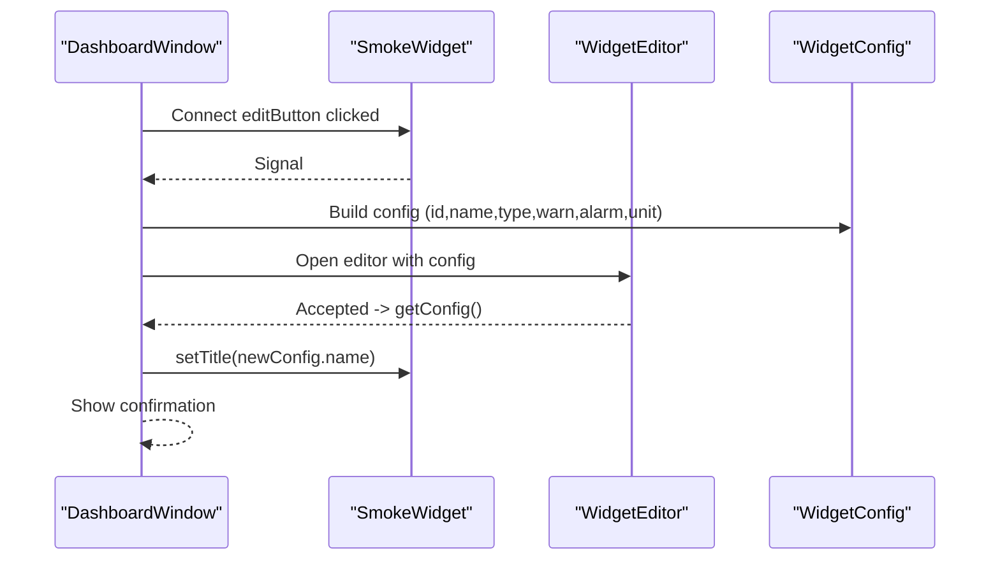
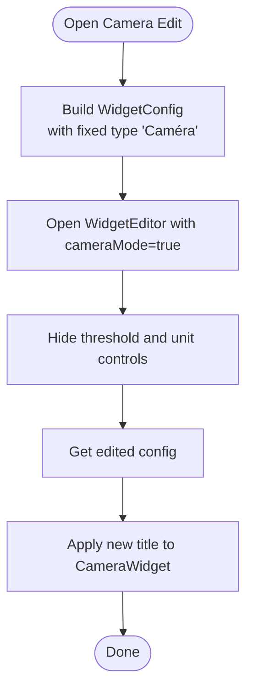
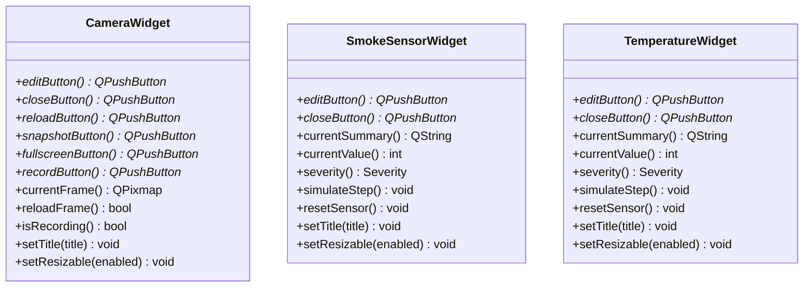
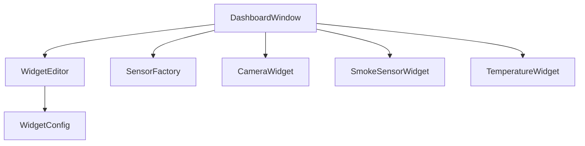

# Edit Mode and Configuration

<cite>
**Referenced Files in This Document**
- [widgeteditor.h](file://widgeteditor.h)
- [widgeteditor.cpp](file://widgeteditor.cpp)
- [dashboardwindow.h](file://dashboardwindow.h)
- [dashboardwindow.cpp](file://dashboardwindow.cpp)
- [camerawidget.h](file://camerawidget.h)
- [camerawidget.cpp](file://camerawidget.cpp)
- [sensorfactory.h](file://sensorfactory.h)
- [sensorfactory.cpp](file://sensorfactory.cpp)
- [smokesensorwidget.h](file://smokesensorwidget.h)
- [smokesensorwidget.cpp](file://smokesensorwidget.cpp)
- [temperaturewidget.h](file://temperaturewidget.h)
</cite>

## Table of Contents
1. [Introduction](#introduction)
2. [Project Structure](#project-structure)
3. [Core Components](#core-components)
4. [Architecture Overview](#architecture-overview)
5. [Detailed Component Analysis](#detailed-component-analysis)
6. [Dependency Analysis](#dependency-analysis)
7. [Performance Considerations](#performance-considerations)
8. [Troubleshooting Guide](#troubleshooting-guide)
9. [Conclusion](#conclusion)

## Introduction
This document explains the edit mode and configuration system used to customize widgets in the surveillance dashboard. It covers how widgets enter and exit edit mode, the visual indicators and user interactions involved, and the implementation of the WidgetEditor dialog for property modification. It also documents the WidgetConfig structure and how it supports serialization and deserialization of widget properties, including special handling for camera widgets. Validation rules, default value handling, and error prevention mechanisms are included to ensure robust configuration workflows.

## Project Structure
The edit and configuration system spans several components:
- DashboardWindow orchestrates widget interactions and opens the editor dialogs.
- WidgetEditor provides a modal dialog for editing widget properties.
- WidgetConfig defines the serializable configuration model.
- SensorFactory supplies default values and type metadata for sensors.
- Individual widget classes (e.g., CameraWidget, SmokeSensorWidget, TemperatureWidget) expose edit controls and maintain thresholds and units.

**Diagram sources**
- [dashboardwindow.cpp:730-805](file://dashboardwindow.cpp#L730-L805)
- [widgeteditor.h:10-18](file://widgeteditor.h#L10-L18)
- [sensorfactory.cpp:7-81](file://sensorfactory.cpp#L7-L81)

**Section sources**
- [dashboardwindow.h:19-98](file://dashboardwindow.h#L19-L98)
- [dashboardwindow.cpp:71-244](file://dashboardwindow.cpp#L71-L244)

## Core Components
- WidgetConfig: The configuration model holding widget identity, name, type, thresholds, unit, and enabled state. It enables serialization/deserialization of widget properties.
- WidgetEditor: A QDialog that presents form controls for editing name, type, thresholds, and unit. It supports a camera-specific mode that hides threshold and unit controls.
- DashboardWindow: Manages widget edit triggers, constructs initial WidgetConfig values, and applies edited configurations back to widgets.
- SensorFactory: Supplies default values and metadata for supported sensor types, including thresholds and units.
- Widget subclasses: Expose edit and close buttons and implement title updates and camera frame reloading.

**Section sources**
- [widgeteditor.h:10-18](file://widgeteditor.h#L10-L18)
- [widgeteditor.cpp:12-31](file://widgeteditor.cpp#L12-L31)
- [dashboardwindow.cpp:742-805](file://dashboardwindow.cpp#L742-L805)
- [sensorfactory.h:19-26](file://sensorfactory.h#L19-L26)
- [sensorfactory.cpp:59-81](file://sensorfactory.cpp#L59-L81)

## Architecture Overview
The edit mode workflow connects user actions to configuration updates:
- Users click an edit button on a widget.
- DashboardWindow prepares a WidgetConfig with current values and opens WidgetEditor.
- WidgetEditor collects user input and returns a modified WidgetConfig.
- DashboardWindow applies the returned configuration to the widget.

**Diagram sources**
- [dashboardwindow.cpp:730-805](file://dashboardwindow.cpp#L730-L805)
- [widgeteditor.cpp:12-31](file://widgeteditor.cpp#L12-L31)
- [widgeteditor.h:20-26](file://widgeteditor.h#L20-L26)

## Detailed Component Analysis

### WidgetEditor Dialog
WidgetEditor is a modal dialog that:
- Initializes UI with dark theme and styled controls.
- Populates fields from an existing WidgetConfig.
- Supports camera mode by hiding threshold and unit controls and disabling type selection.
- Returns the edited configuration via getConfig().

Key behaviors:
- Name field: QLineEdit for textual widget name.
- Type field: QComboBox with predefined options; disabled in camera mode.
- Threshold group: QSpinBox controls for warning and alarm thresholds; hidden in camera mode.
- Unit field: QLineEdit placeholder for units like °C, %, ppm; hidden in camera mode.
- Buttons: Save and Cancel mapped to QDialogButtonBox.

**Diagram sources**
- [widgeteditor.h:20-40](file://widgeteditor.h#L20-L40)
- [widgeteditor.cpp:33-117](file://widgeteditor.cpp#L33-L117)
- [widgeteditor.cpp:119-128](file://widgeteditor.cpp#L119-L128)

**Section sources**
- [widgeteditor.h:10-18](file://widgeteditor.h#L10-L18)
- [widgeteditor.cpp:12-31](file://widgeteditor.cpp#L12-L31)
- [widgeteditor.cpp:33-117](file://widgeteditor.cpp#L33-L117)
- [widgeteditor.cpp:119-128](file://widgeteditor.cpp#L119-L128)

### WidgetConfig Structure
WidgetConfig encapsulates all editable properties:
- Identity: id
- Presentation: name
- Classification: type
- Thresholds: warningThreshold, alarmThreshold
- Units: unit
- State: enabled

It is used to:
- Initialize WidgetEditor with current values.
- Capture edited values after user confirmation.
- Support serialization/deserialization of widget settings.

Validation and defaults:
- Thresholds are integer values with a spin box range suitable for typical sensor readings.
- Unit is optional and hidden in camera mode.
- Type is constrained to supported sensor types or fixed to “Caméra” in camera mode.

**Section sources**
- [widgeteditor.h:10-18](file://widgeteditor.h#L10-L18)
- [widgeteditor.cpp:89-102](file://widgeteditor.cpp#L89-L102)

### DashboardWindow Edit Orchestration
DashboardWindow manages edit interactions:
- Provides edit buttons for smoke, temperature, and camera widgets.
- Constructs WidgetConfig with current values and opens WidgetEditor.
- Applies edited configuration back to the widget (e.g., updating title).
- Special handling for camera mode: hides thresholds and unit fields.

**Diagram sources**
- [dashboardwindow.cpp:730-761](file://dashboardwindow.cpp#L730-L761)
- [dashboardwindow.cpp:742-761](file://dashboardwindow.cpp#L742-L761)

**Section sources**
- [dashboardwindow.cpp:730-761](file://dashboardwindow.cpp#L730-L761)
- [dashboardwindow.cpp:763-782](file://dashboardwindow.cpp#L763-L782)
- [dashboardwindow.cpp:784-805](file://dashboardwindow.cpp#L784-L805)

### Camera Mode and Special Handling
Camera widgets differ from other widgets:
- Camera mode is activated by passing a cameraMode flag to WidgetEditor.
- In camera mode, threshold and unit controls are hidden and disabled.
- The type is fixed to “Caméra” and cannot be changed.
- Title updates are applied directly to the CameraWidget.

**Diagram sources**
- [dashboardwindow.cpp:784-805](file://dashboardwindow.cpp#L784-L805)
- [widgeteditor.cpp:27-31](file://widgeteditor.cpp#L27-L31)
- [widgeteditor.cpp:68-82](file://widgeteditor.cpp#L68-L82)

**Section sources**
- [dashboardwindow.cpp:784-805](file://dashboardwindow.cpp#L784-L805)
- [widgeteditor.cpp:27-31](file://widgeteditor.cpp#L27-L31)
- [widgeteditor.cpp:68-82](file://widgeteditor.cpp#L68-L82)

### Sensor Defaults and Validation
SensorFactory provides default values and metadata:
- Default names, units, and thresholds per sensor type.
- Ensures consistent initial configuration for new or dynamically added widgets.

Validation rules:
- Threshold spin boxes have a bounded range appropriate for sensor values.
- Camera mode disables threshold and unit editing, preventing invalid combinations.
- Type selection is restricted to supported sensor types; camera type is fixed in camera mode.

**Section sources**
- [sensorfactory.h:19-26](file://sensorfactory.h#L19-L26)
- [sensorfactory.cpp:59-81](file://sensorfactory.cpp#L59-L81)
- [widgeteditor.cpp:89-102](file://widgeteditor.cpp#L89-L102)

### Widget Subclasses and Edit Controls
- CameraWidget exposes edit, close, reload, snapshot, fullscreen, and record controls. Titles can be updated via setTitle().
- SmokeSensorWidget and TemperatureWidget expose edit and close controls and support threshold-based severity states.

**Diagram sources**
- [camerawidget.h:9-39](file://camerawidget.h#L9-L39)
- [smokesensorwidget.h:10-52](file://smokesensorwidget.h#L10-L52)
- [temperaturewidget.h:11-53](file://temperaturewidget.h#L11-L53)

**Section sources**
- [camerawidget.cpp:182-241](file://camerawidget.cpp#L182-L241)
- [smokesensorwidget.cpp:239-370](file://smokesensorwidget.cpp#L239-L370)

## Dependency Analysis
The edit mode system exhibits clear separation of concerns:
- DashboardWindow depends on widget classes to trigger edits and apply changes.
- WidgetEditor depends on WidgetConfig for input/output and on UI controls for data collection.
- SensorFactory provides defaults consumed by DashboardWindow during initialization.

**Diagram sources**
- [dashboardwindow.cpp:71-244](file://dashboardwindow.cpp#L71-L244)
- [widgeteditor.h:10-18](file://widgeteditor.h#L10-L18)
- [sensorfactory.cpp:7-81](file://sensorfactory.cpp#L7-L81)

**Section sources**
- [dashboardwindow.cpp:71-244](file://dashboardwindow.cpp#L71-L244)
- [widgeteditor.h:10-18](file://widgeteditor.h#L10-L18)
- [sensorfactory.cpp:7-81](file://sensorfactory.cpp#L7-L81)

## Performance Considerations
- WidgetEditor uses lightweight Qt controls and avoids heavy computations during configuration editing.
- DashboardWindow defers expensive operations (e.g., network scanning) to timers and background tasks, keeping the UI responsive during edits.
- Camera frame operations (reload, snapshot) are handled asynchronously to prevent blocking the UI.

## Troubleshooting Guide
Common issues and resolutions:
- Empty or invalid threshold values: Ensure threshold spin boxes remain within the configured range. WidgetEditor enforces bounds.
- Attempting to edit camera thresholds: In camera mode, threshold controls are hidden and disabled by design.
- Applying configuration to widgets: Confirm that the widget’s edit button is enabled and visible for the current user role.
- Camera frame errors: If reload fails, a warning dialog informs the user. Verify asset availability and paths.

**Section sources**
- [widgeteditor.cpp:89-102](file://widgeteditor.cpp#L89-L102)
- [dashboardwindow.cpp:206-231](file://dashboardwindow.cpp#L206-L231)
- [dashboardwindow.cpp:616-639](file://dashboardwindow.cpp#L616-L639)

## Conclusion
The edit mode and configuration system provides a consistent, role-aware mechanism for customizing widgets. WidgetEditor centralizes property editing with clear validation and camera-specific handling. WidgetConfig serves as the single source of truth for serialized settings, enabling reliable persistence and updates across widget types. Together, these components deliver a robust, user-friendly configuration experience.