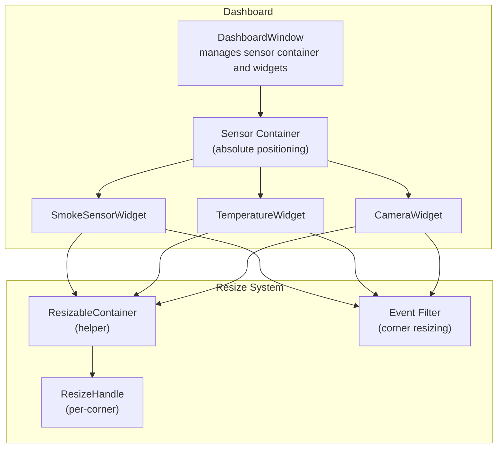
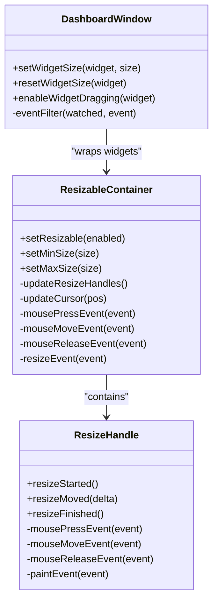
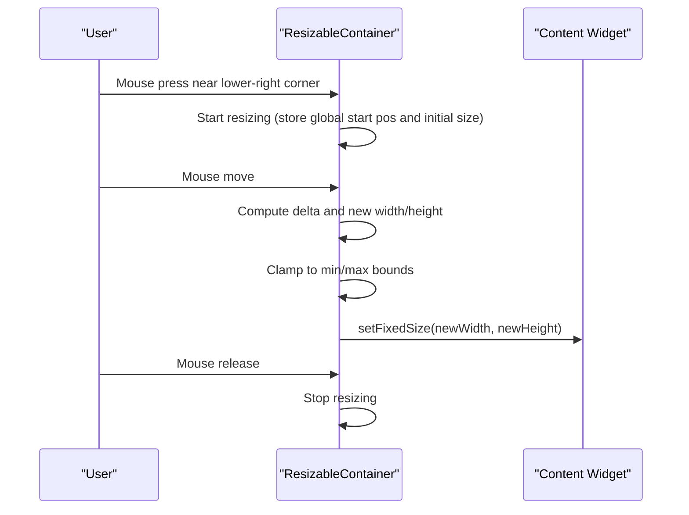
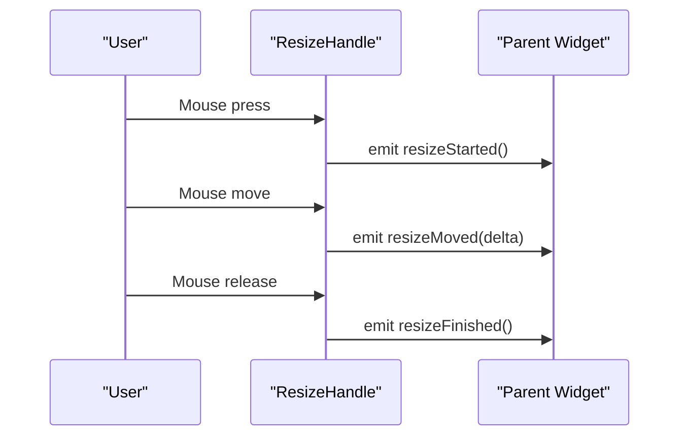
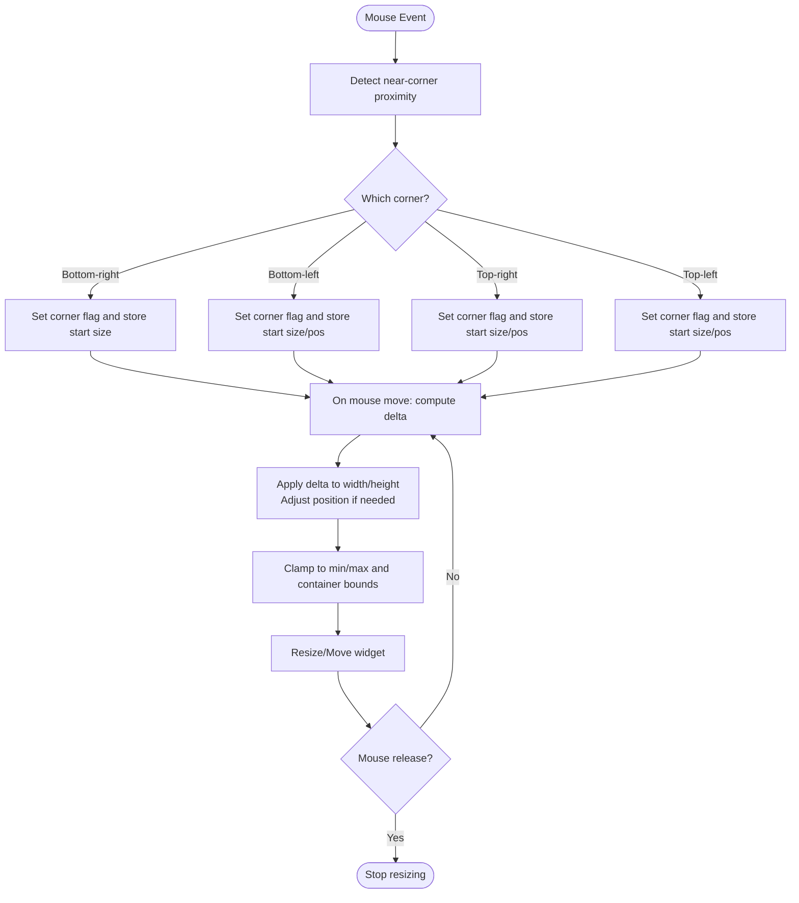
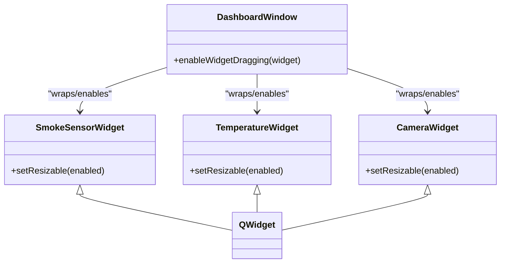
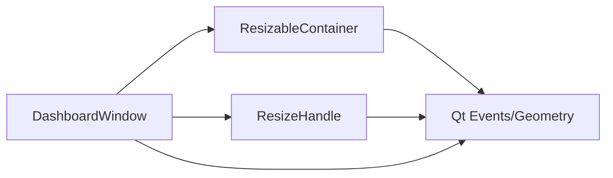

# Resize System

<cite>
**Referenced Files in This Document**
- [resizablehelper.h](file://resizablehelper.h)
- [resizablehelper.cpp](file://resizablehelper.cpp)
- [resizehandle.h](file://resizehandle.h)
- [resizehandle.cpp](file://resizehandle.cpp)
- [dashboardwindow.h](file://dashboardwindow.h)
- [dashboardwindow.cpp](file://dashboardwindow.cpp)
- [smokesensorwidget.h](file://smokesensorwidget.h)
- [temperaturewidget.h](file://temperaturewidget.h)
- [camerawidget.h](file://camerawidget.h)
- [widgeteditor.h](file://widgeteditor.h)
- [widgeteditor.cpp](file://widgeteditor.cpp)
</cite>

## Table of Contents
1. [Introduction](#introduction)
2. [Project Structure](#project-structure)
3. [Core Components](#core-components)
4. [Architecture Overview](#architecture-overview)
5. [Detailed Component Analysis](#detailed-component-analysis)
6. [Dependency Analysis](#dependency-analysis)
7. [Performance Considerations](#performance-considerations)
8. [Troubleshooting Guide](#troubleshooting-guide)
9. [Conclusion](#conclusion)

## Introduction
This document explains the resize system implemented in the project. It covers two complementary approaches:
- A lightweight container-based resizing helper that enables dynamic widget resizing with size constraints and cursor feedback.
- A more advanced per-corner resize handle system that integrates with the dashboard’s absolute-positioned widgets and supports multiple resize edges with visual feedback.

The resize system integrates with the Qt layout and event model, affects widget positioning within the dashboard’s sensor container, and provides configuration hooks for minimum/maximum sizes and per-widget resizing toggles.

## Project Structure
The resize system spans several files:
- Resizable container helper: ResizableContainer encapsulates a content widget and exposes resize handles and constraints.
- Resize handle component: ResizeHandle is a small interactive widget that emits resize events and renders a visual indicator.
- Dashboard integration: DashboardWindow manages absolute-positioned widgets, implements per-corner resizing via an event filter, and exposes quick resize presets.
- Sensor widgets: SmokeSensorWidget, TemperatureWidget, and CameraWidget expose a setResizable method to toggle resizing behavior.

**Diagram sources**
- [dashboardwindow.cpp:163-185](file://dashboardwindow.cpp#L163-L185)
- [resizablehelper.h:8-37](file://resizablehelper.h#L8-L37)
- [resizehandle.h:6-33](file://resizehandle.h#L6-L33)
- [smokesensorwidget.h](file://smokesensorwidget.h#L33)
- [temperaturewidget.h](file://temperaturewidget.h#L34)
- [camerawidget.h](file://camerawidget.h#L27)

**Section sources**
- [dashboardwindow.cpp:163-185](file://dashboardwindow.cpp#L163-L185)
- [resizablehelper.h:8-37](file://resizablehelper.h#L8-L37)
- [resizehandle.h:6-33](file://resizehandle.h#L6-L33)
- [smokesensorwidget.h](file://smokesensorwidget.h#L33)
- [temperaturewidget.h](file://temperaturewidget.h#L34)
- [camerawidget.h](file://camerawidget.h#L27)

## Core Components
- ResizableContainer: A QFrame wrapper that hosts a content widget and provides a resize handle in the lower-right corner. It enforces min/max sizes and updates the handle position on resize.
- ResizeHandle: A small QWidget that draws a visual indicator and emits signals for resize start/move/finish. It sets appropriate cursors based on its corner position.
- DashboardWindow: Implements per-corner resizing via an event filter, supports quick preset resizing, and manages absolute-positioned widgets inside a sensor container.

Key capabilities:
- Size constraint enforcement via min/max setters.
- Cursor feedback indicating resize availability.
- Per-corner resizing with boundary checks and minimum/maximum limits.
- Integration with dashboard grid-like absolute positioning.

**Section sources**
- [resizablehelper.h:8-37](file://resizablehelper.h#L8-L37)
- [resizablehelper.cpp:7-149](file://resizablehelper.cpp#L7-L149)
- [resizehandle.h:6-33](file://resizehandle.h#L6-L33)
- [resizehandle.cpp:6-80](file://resizehandle.cpp#L6-L80)
- [dashboardwindow.cpp:1293-1475](file://dashboardwindow.cpp#L1293-L1475)

## Architecture Overview
The resize system combines a helper container and a per-corner handle system. ResizableContainer centralizes resizing logic for a single content widget, while ResizeHandle offers a reusable, visual resizing control. DashboardWindow coordinates resizing across multiple widgets using an event filter and provides quick presets.

**Diagram sources**
- [resizablehelper.h:8-37](file://resizablehelper.h#L8-L37)
- [resizehandle.h:6-33](file://resizehandle.h#L6-L33)
- [dashboardwindow.h:19-98](file://dashboardwindow.h#L19-L98)

## Detailed Component Analysis

### ResizableContainer (Helper)
ResizableContainer wraps a content widget and adds a resize handle in the lower-right corner. It:
- Exposes setters to enable resizing and configure min/max sizes.
- Updates the handle position on resize and on show/hide.
- Handles mouse press/move/release to resize the container.
- Enforces size bounds and updates cursor feedback.

**Diagram sources**
- [resizablehelper.cpp:83-139](file://resizablehelper.cpp#L83-L139)

Key behaviors:
- Lower-right resize area detection.
- Bound enforcement using min/max sizes.
- Cursor changes based on hover proximity to the handle.
- Handle placement at the bottom-right corner.

Customization options:
- Min/max size setters.
- Toggle resizing on/off.
- Content widget replacement via constructor.

**Section sources**
- [resizablehelper.h:8-37](file://resizablehelper.h#L8-L37)
- [resizablehelper.cpp:7-149](file://resizablehelper.cpp#L7-L149)

### ResizeHandle (Per-Corner Handle)
ResizeHandle is a small interactive widget that:
- Draws a subtle visual indicator depending on its corner position.
- Emits resizeStarted, resizeMoved, and resizeFinished signals.
- Sets directional cursors (diagonal sizing based on corner).

**Diagram sources**
- [resizehandle.cpp:27-53](file://resizehandle.cpp#L27-L53)

Integration notes:
- ResizeHandle is intended to be placed on widget edges/corners.
- Signals can be connected to parent widget logic to apply deltas.

**Section sources**
- [resizehandle.h:6-33](file://resizehandle.h#L6-L33)
- [resizehandle.cpp:6-80](file://resizehandle.cpp#L6-L80)

### DashboardWindow (Event Filter and Presets)
DashboardWindow implements per-corner resizing for absolute-positioned widgets:
- Uses an event filter to detect clicks near corners and edges.
- Supports four corners: bottom-right, bottom-left, top-right, top-left.
- Applies deltas to width/height and adjusts position when resizing from corners that shift origin.
- Enforces minimum sizes and container boundaries.
- Provides quick resize presets via a menu (small, medium, large, auto).

**Diagram sources**
- [dashboardwindow.cpp:1309-1474](file://dashboardwindow.cpp#L1309-L1474)

Additional features:
- Quick presets adjust minimum/maximum sizes to fixed values and trigger layout recalculation.
- Drag-and-drop integration for moving widgets within the container.

**Section sources**
- [dashboardwindow.cpp:1293-1475](file://dashboardwindow.cpp#L1293-L1475)
- [dashboardwindow.h:19-98](file://dashboardwindow.h#L19-L98)

### Sensor Widgets Integration
Sensor widgets (SmokeSensorWidget, TemperatureWidget, CameraWidget) expose a setResizable method to toggle resizing behavior. This allows downstream consumers to enable/disable resizing consistently across widget types.

**Diagram sources**
- [smokesensorwidget.h](file://smokesensorwidget.h#L33)
- [temperaturewidget.h](file://temperaturewidget.h#L34)
- [camerawidget.h](file://camerawidget.h#L27)
- [dashboardwindow.cpp:1282-1291](file://dashboardwindow.cpp#L1282-L1291)

**Section sources**
- [smokesensorwidget.h](file://smokesensorwidget.h#L33)
- [temperaturewidget.h](file://temperaturewidget.h#L34)
- [camerawidget.h](file://camerawidget.h#L27)
- [dashboardwindow.cpp:1282-1291](file://dashboardwindow.cpp#L1282-L1291)

## Dependency Analysis
- ResizableContainer depends on Qt’s event system and geometry APIs to manage resizing and cursor feedback.
- ResizeHandle depends on QPainter for drawing and Qt’s signal/slot mechanism for emitting resize events.
- DashboardWindow orchestrates resizing across multiple widgets using an event filter and applies quick presets by setting min/max sizes.

**Diagram sources**
- [resizablehelper.cpp:1-150](file://resizablehelper.cpp#L1-L150)
- [resizehandle.cpp:1-81](file://resizehandle.cpp#L1-L81)
- [dashboardwindow.cpp:1293-1475](file://dashboardwindow.cpp#L1293-L1475)

**Section sources**
- [resizablehelper.cpp:1-150](file://resizablehelper.cpp#L1-L150)
- [resizehandle.cpp:1-81](file://resizehandle.cpp#L1-L81)
- [dashboardwindow.cpp:1293-1475](file://dashboardwindow.cpp#L1293-L1475)

## Performance Considerations
- Event filtering in DashboardWindow runs on every mouse move; keep computations minimal (bounds clamping and basic arithmetic).
- Frequent resize calls can trigger layout recalculations; batching or throttling could help if performance becomes an issue.
- Using setFixedSize during resize avoids expensive layout passes, which is efficient for immediate visual updates.

## Troubleshooting Guide
Common issues and resolutions:
- Resize handle not visible: Ensure the container is enabled and the handle is shown; verify updateResizeHandles placement after resize events.
- Resize does nothing: Confirm that resizing is enabled and the mouse press occurs within the lower-right resize area.
- Widget resizes outside container bounds: Verify container boundaries are considered when computing new positions and sizes.
- Preset resizing not applied: Ensure setWidgetSize/resetWidgetSize is called and the sensor container triggers adjustSize.

**Section sources**
- [resizablehelper.cpp:46-81](file://resizablehelper.cpp#L46-L81)
- [dashboardwindow.cpp:1254-1280](file://dashboardwindow.cpp#L1254-L1280)
- [dashboardwindow.cpp:1408-1452](file://dashboardwindow.cpp#L1408-L1452)

## Conclusion
The resize system provides flexible, user-driven resizing for dashboard widgets. ResizableContainer offers a simple helper for single-widget resizing with constraints and visual feedback, while ResizeHandle provides a reusable, visual control for per-corner resizing. DashboardWindow extends this with an event-filter-based system that supports multiple corners, boundary detection, and quick presets. Together, these components enable precise control over widget sizing within the dashboard’s absolute-positioned layout.