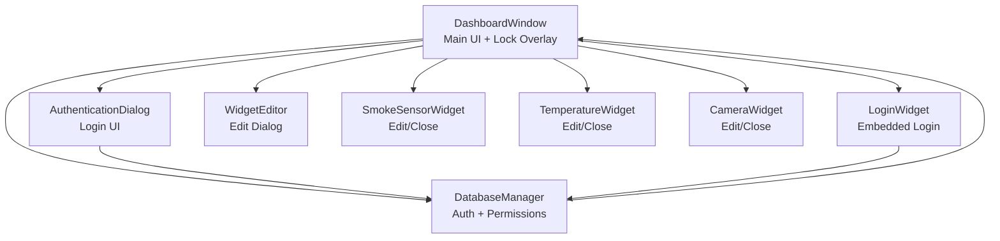
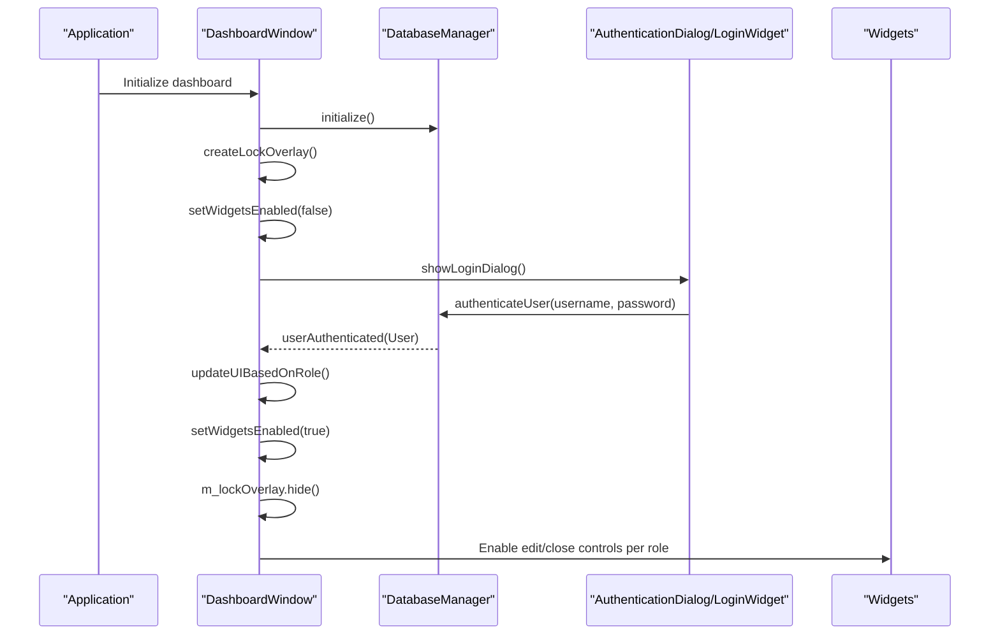
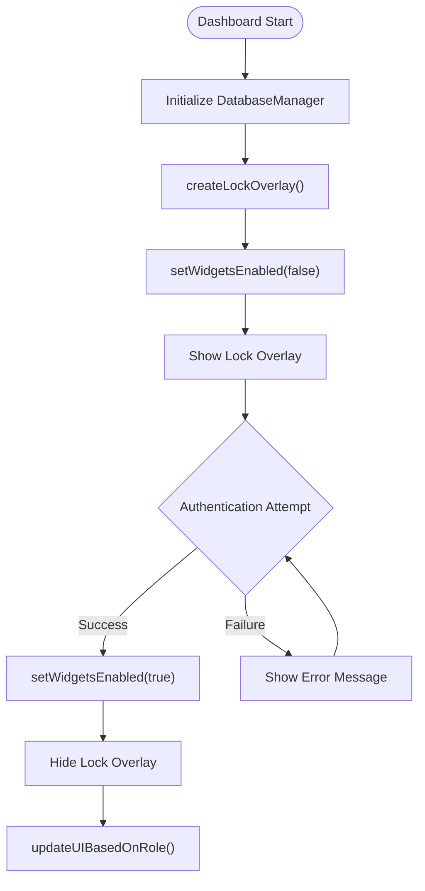
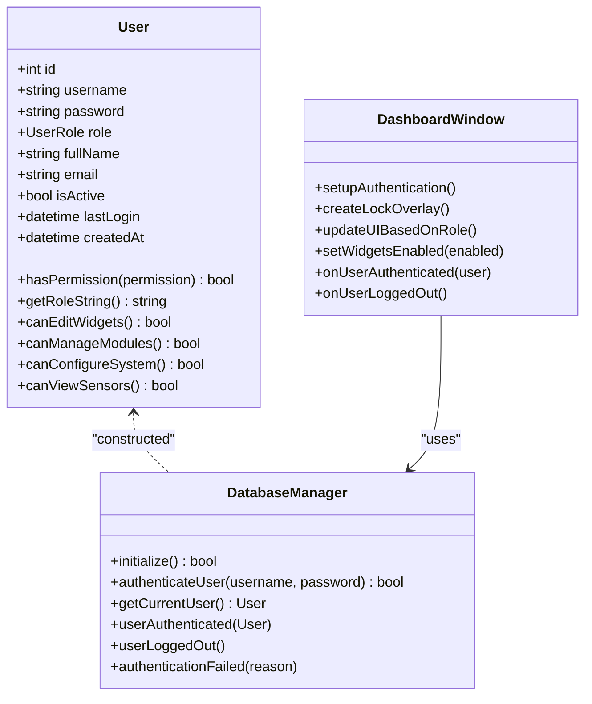
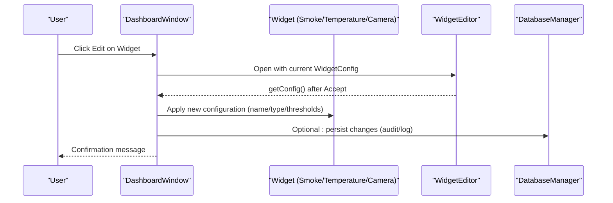
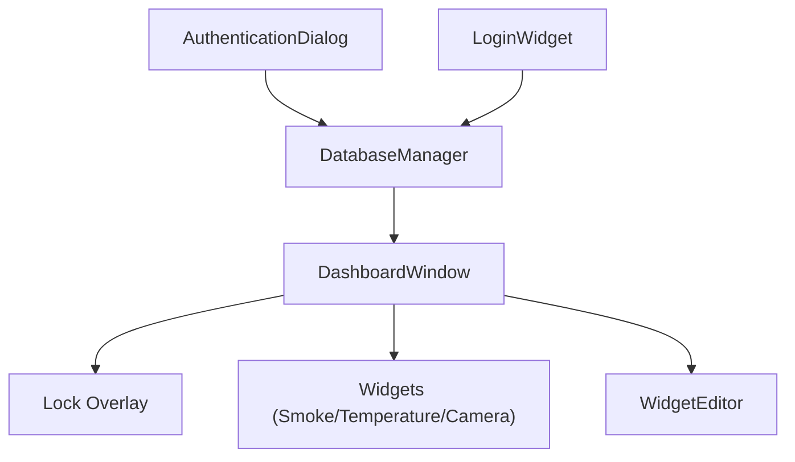

# Security Overlay and Lock System

<cite>
**Referenced Files in This Document**
- [dashboardwindow.h](file://dashboardwindow.h)
- [dashboardwindow.cpp](file://dashboardwindow.cpp)
- [authenticationdialog.h](file://authenticationdialog.h)
- [authenticationdialog.cpp](file://authenticationdialog.cpp)
- [databasemanager.h](file://databasemanager.h)
- [databasemanager.cpp](file://databasemanager.cpp)
- [widgeteditor.h](file://widgeteditor.h)
- [widgeteditor.cpp](file://widgeteditor.cpp)
- [loginwidget.h](file://loginwidget.h)
- [loginwidget.cpp](file://loginwidget.cpp)
- [smokesensorwidget.h](file://smokesensorwidget.h)
- [temperaturewidget.h](file://temperaturewidget.h)
- [camerawidget.h](file://camerawidget.h)
</cite>

## Table of Contents
1. [Introduction](#introduction)
2. [Project Structure](#project-structure)
3. [Core Components](#core-components)
4. [Architecture Overview](#architecture-overview)
5. [Detailed Component Analysis](#detailed-component-analysis)
6. [Dependency Analysis](#dependency-analysis)
7. [Performance Considerations](#performance-considerations)
8. [Troubleshooting Guide](#troubleshooting-guide)
9. [Conclusion](#conclusion)

## Introduction
This document explains the security overlay and lock system that protects widget configurations in the SurveillanceQT application. It covers the lock overlay mechanism that prevents unauthorized modifications to critical widgets, visual indicators, and user permission checks. It also documents the integration with the authentication system, how different user roles affect widget access and modification capabilities, and the security validation processes, permission checking algorithms, and enforcement mechanisms. Practical workflows and best practices for maintaining system integrity are included.

## Project Structure
The security and widget management features are implemented across several key components:
- Dashboard window: hosts the main UI, manages the lock overlay, and controls widget interactions.
- Authentication dialog and login widget: provide user authentication and role-based UI updates.
- Database manager: handles user authentication, role resolution, and permission checks.
- Widget editor: defines the configuration model for widgets and enables editing dialogs.
- Widget classes: smoke sensor, temperature, and camera widgets expose edit/close controls.

**Diagram sources**
- [dashboardwindow.h:19-99](file://dashboardwindow.h#L19-L99)
- [dashboardwindow.cpp:923-1077](file://dashboardwindow.cpp#L923-L1077)
- [authenticationdialog.h:14-47](file://authenticationdialog.h#L14-L47)
- [authenticationdialog.cpp:14-249](file://authenticationdialog.cpp#L14-L249)
- [loginwidget.h:8-22](file://loginwidget.h#L8-L22)
- [loginwidget.cpp:10-113](file://loginwidget.cpp#L10-L113)
- [databasemanager.h:34-88](file://databasemanager.h#L34-L88)
- [databasemanager.cpp:158-198](file://databasemanager.cpp#L158-L198)
- [widgeteditor.h:20-41](file://widgeteditor.h#L20-L41)
- [widgeteditor.cpp:12-129](file://widgeteditor.cpp#L12-L129)
- [smokesensorwidget.h:10-53](file://smokesensorwidget.h#L10-L53)
- [temperaturewidget.h:11-54](file://temperaturewidget.h#L11-L54)
- [camerawidget.h:9-40](file://camerawidget.h#L9-L40)

**Section sources**
- [dashboardwindow.h:19-99](file://dashboardwindow.h#L19-L99)
- [dashboardwindow.cpp:923-1077](file://dashboardwindow.cpp#L923-L1077)
- [authenticationdialog.h:14-47](file://authenticationdialog.h#L14-L47)
- [authenticationdialog.cpp:14-249](file://authenticationdialog.cpp#L14-L249)
- [loginwidget.h:8-22](file://loginwidget.h#L8-L22)
- [loginwidget.cpp:10-113](file://loginwidget.cpp#L10-L113)
- [databasemanager.h:34-88](file://databasemanager.h#L34-L88)
- [databasemanager.cpp:158-198](file://databasemanager.cpp#L158-L198)
- [widgeteditor.h:20-41](file://widgeteditor.h#L20-L41)
- [widgeteditor.cpp:12-129](file://widgeteditor.cpp#L12-L129)
- [smokesensorwidget.h:10-53](file://smokesensorwidget.h#L10-L53)
- [temperaturewidget.h:11-54](file://temperaturewidget.h#L11-L54)
- [camerawidget.h:9-40](file://camerawidget.h#L9-L40)

## Core Components
- Lock overlay: A full-screen semi-transparent overlay that blocks widget interactions until successful authentication.
- Authentication system: Provides login UI, validates credentials, and emits user events.
- Permission engine: Uses user roles to enable or disable widget editing and system configuration actions.
- Widget editor: Presents configurable fields for widget metadata and thresholds (where applicable).

Key responsibilities:
- Lock overlay creation and lifecycle management.
- Enabling/disabling widgets based on authentication and permissions.
- Role-based UI updates for edit controls and settings access.
- Secure editing workflow via the widget editor dialog.

**Section sources**
- [dashboardwindow.cpp:923-1077](file://dashboardwindow.cpp#L923-L1077)
- [dashboardwindow.cpp:1079-1129](file://dashboardwindow.cpp#L1079-L1129)
- [databasemanager.cpp:344-382](file://databasemanager.cpp#L344-L382)
- [widgeteditor.h:10-41](file://widgeteditor.h#L10-L41)
- [widgeteditor.cpp:12-129](file://widgeteditor.cpp#L12-L129)

## Architecture Overview
The security overlay and lock system integrates tightly with the dashboard UI and authentication subsystem. On startup, the dashboard initializes the database manager, sets up the lock overlay, and disables all interactive widgets. Successful authentication reveals the overlay, updates the UI based on the user’s role, and enables appropriate controls.

**Diagram sources**
- [dashboardwindow.cpp:923-1077](file://dashboardwindow.cpp#L923-L1077)
- [dashboardwindow.cpp:833-853](file://dashboardwindow.cpp#L833-L853)
- [dashboardwindow.cpp:1079-1129](file://dashboardwindow.cpp#L1079-L1129)
- [databasemanager.cpp:158-198](file://databasemanager.cpp#L158-L198)
- [authenticationdialog.cpp:178-194](file://authenticationdialog.cpp#L178-L194)
- [loginwidget.cpp:99-113](file://loginwidget.cpp#L99-L113)

## Detailed Component Analysis

### Lock Overlay and Authentication Flow
The lock overlay is a full-screen QWidget that:
- Covers the entire dashboard area.
- Displays a login card with username/password fields and error feedback.
- Disables widget interactions until authentication succeeds.
- Updates visibility on login/logout events.

**Diagram sources**
- [dashboardwindow.cpp:923-1077](file://dashboardwindow.cpp#L923-L1077)
- [dashboardwindow.cpp:1079-1129](file://dashboardwindow.cpp#L1079-L1129)
- [dashboardwindow.cpp:833-853](file://dashboardwindow.cpp#L833-L853)
- [authenticationdialog.cpp:178-194](file://authenticationdialog.cpp#L178-L194)

**Section sources**
- [dashboardwindow.cpp:923-1077](file://dashboardwindow.cpp#L923-L1077)
- [dashboardwindow.cpp:833-853](file://dashboardwindow.cpp#L833-L853)
- [authenticationdialog.cpp:178-194](file://authenticationdialog.cpp#L178-L194)
- [loginwidget.cpp:99-113](file://loginwidget.cpp#L99-L113)

### Permission Model and Role-Based Access Control
User roles and permissions are defined centrally:
- Admin: full access (edit widgets, configure system, manage users).
- Operator: can edit widgets and view sensors; restricted system configuration.
- Viewer: read-only access to sensors.

**Diagram sources**
- [databasemanager.h:15-32](file://databasemanager.h#L15-L32)
- [databasemanager.cpp:344-382](file://databasemanager.cpp#L344-L382)
- [databasemanager.cpp:158-198](file://databasemanager.cpp#L158-L198)
- [dashboardwindow.cpp:899-921](file://dashboardwindow.cpp#L899-L921)
- [dashboardwindow.cpp:1079-1129](file://dashboardwindow.cpp#L1079-L1129)

**Section sources**
- [databasemanager.h:9-32](file://databasemanager.h#L9-L32)
- [databasemanager.cpp:344-382](file://databasemanager.cpp#L344-L382)
- [dashboardwindow.cpp:1079-1129](file://dashboardwindow.cpp#L1079-L1129)

### Widget Editor and Secure Configuration Management
The widget editor dialog encapsulates configuration editing for widgets. It supports:
- Name and type editing.
- Threshold configuration for applicable widgets.
- Unit specification.
- Mode-specific behavior (e.g., camera mode hides thresholds).

**Diagram sources**
- [dashboardwindow.cpp:742-825](file://dashboardwindow.cpp#L742-L825)
- [widgeteditor.h:10-41](file://widgeteditor.h#L10-L41)
- [widgeteditor.cpp:12-129](file://widgeteditor.cpp#L12-L129)
- [databasemanager.cpp:309-319](file://databasemanager.cpp#L309-L319)

**Section sources**
- [dashboardwindow.cpp:742-825](file://dashboardwindow.cpp#L742-L825)
- [widgeteditor.h:10-41](file://widgeteditor.h#L10-L41)
- [widgeteditor.cpp:12-129](file://widgeteditor.cpp#L12-L129)

### Visual Indicators and User Feedback
- Lock overlay: Semi-transparent dark background with a centered login card.
- Authentication dialog: Rounded card with styled inputs, error label, and role hint.
- Login widget: Minimal embedded login panel with styled inputs and button.
- Status labels: User role and network status displayed in the dashboard bottom bar.

These visuals reinforce security posture and provide clear feedback during authentication and operation.

**Section sources**
- [dashboardwindow.cpp:923-1077](file://dashboardwindow.cpp#L923-L1077)
- [authenticationdialog.cpp:43-249](file://authenticationdialog.cpp#L43-L249)
- [loginwidget.cpp:10-113](file://loginwidget.cpp#L10-L113)

## Dependency Analysis
The security overlay and lock system depends on:
- DatabaseManager for authentication and permission queries.
- DashboardWindow for orchestrating overlay lifecycle and UI updates.
- Widget editor for secure configuration changes.
- Widget classes for exposing edit/close controls.

**Diagram sources**
- [databasemanager.cpp:158-198](file://databasemanager.cpp#L158-L198)
- [dashboardwindow.cpp:923-1077](file://dashboardwindow.cpp#L923-L1077)
- [dashboardwindow.cpp:1079-1129](file://dashboardwindow.cpp#L1079-L1129)
- [authenticationdialog.cpp:178-194](file://authenticationdialog.cpp#L178-L194)
- [loginwidget.cpp:99-113](file://loginwidget.cpp#L99-L113)

**Section sources**
- [databasemanager.cpp:158-198](file://databasemanager.cpp#L158-L198)
- [dashboardwindow.cpp:923-1077](file://dashboardwindow.cpp#L923-L1077)
- [dashboardwindow.cpp:1079-1129](file://dashboardwindow.cpp#L1079-L1129)
- [authenticationdialog.cpp:178-194](file://authenticationdialog.cpp#L178-L194)
- [loginwidget.cpp:99-113](file://loginwidget.cpp#L99-L113)

## Performance Considerations
- Overlay rendering: The lock overlay uses a single QWidget with minimal child widgets; resizing is handled efficiently via geometry updates.
- Authentication: Database queries are lightweight; hashing is performed server-side for MySQL and client-side for SQLite.
- Widget enabling: Batch enabling/disabling toggles are applied to all interactive widgets to minimize redundant UI updates.
- Event filtering: Drag and resize logic for widgets is optimized with minimal state and cursor updates.

## Troubleshooting Guide
Common issues and resolutions:
- Authentication failures: The system emits an authentication failure signal with a reason; the overlay displays an error label. Verify credentials and database connectivity.
- Overlay not hiding after login: Ensure the authenticated user event is received and updateUIBasedOnRole is called.
- Widgets remain disabled: Confirm setWidgetsEnabled is invoked with true after authentication.
- Role-based edit controls not updating: Verify updateUIBasedOnRole reads the current user role and toggles edit button visibility/enabled state accordingly.

**Section sources**
- [authenticationdialog.cpp:209-218](file://authenticationdialog.cpp#L209-L218)
- [dashboardwindow.cpp:833-853](file://dashboardwindow.cpp#L833-L853)
- [dashboardwindow.cpp:1079-1129](file://dashboardwindow.cpp#L1079-L1129)

## Conclusion
The security overlay and lock system provides a robust foundation for protecting widget configurations by enforcing authentication and role-based access control. The lock overlay prevents unauthorized interactions, while the permission engine ensures that only authorized users can modify widgets or system settings. The widget editor offers a secure, controlled interface for configuration changes, and the authentication dialog provides clear feedback and role hints. Together, these components maintain system integrity and enforce security policies consistently across the application.