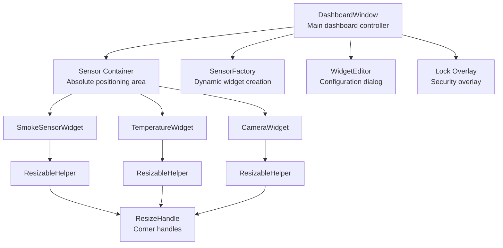
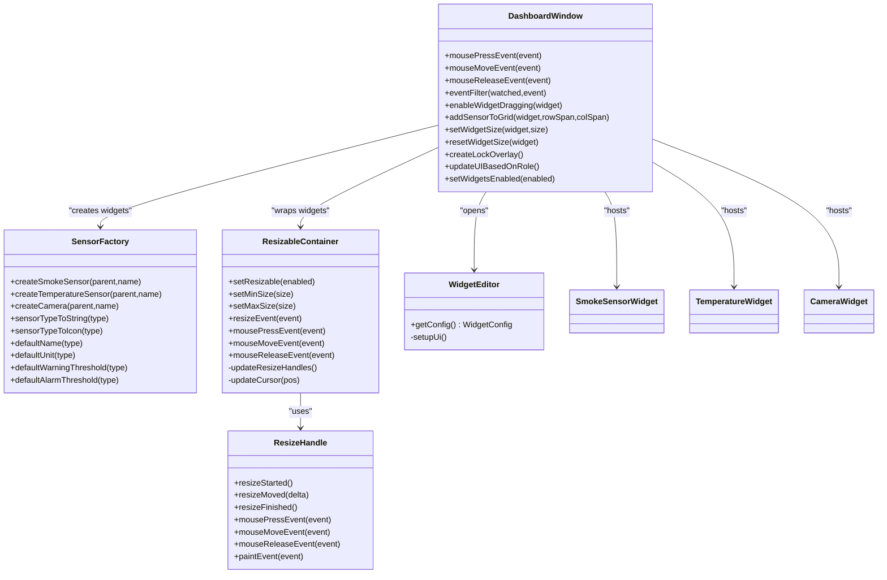
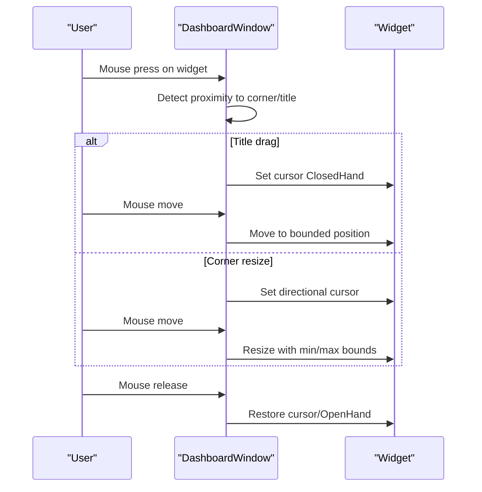
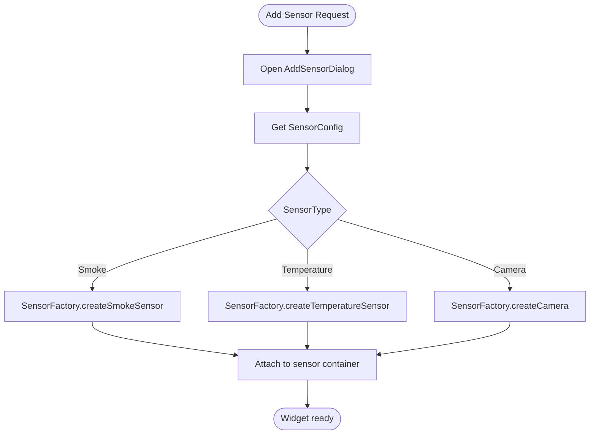
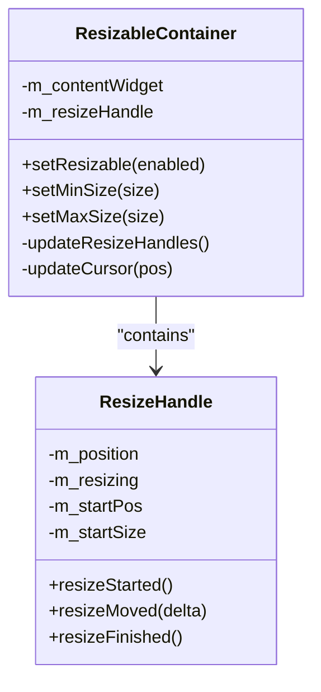
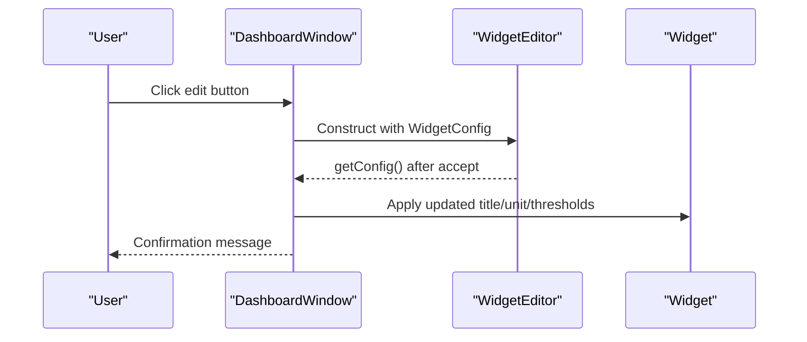
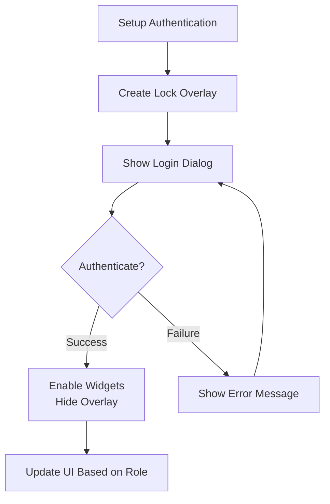
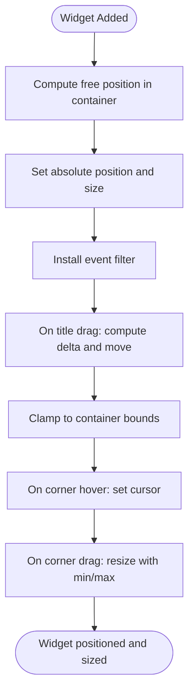
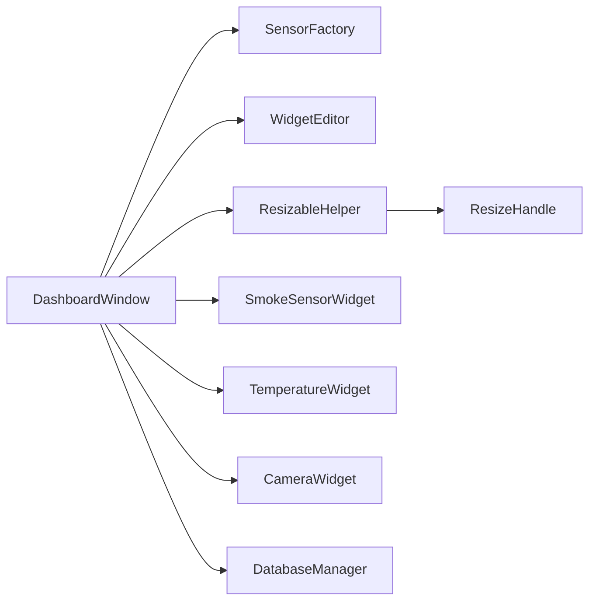

# Widget System Architecture

<cite>
**Referenced Files in This Document**
- [dashboardwindow.h](file://dashboardwindow.h)
- [dashboardwindow.cpp](file://dashboardwindow.cpp)
- [sensorfactory.h](file://sensorfactory.h)
- [sensorfactory.cpp](file://sensorfactory.cpp)
- [resizablehelper.h](file://resizablehelper.h)
- [resizablehelper.cpp](file://resizablehelper.cpp)
- [resizehandle.h](file://resizehandle.h)
- [resizehandle.cpp](file://resizehandle.cpp)
- [widgeteditor.h](file://widgeteditor.h)
- [widgeteditor.cpp](file://widgeteditor.cpp)
- [smokesensorwidget.h](file://smokesensorwidget.h)
- [smokesensorwidget.cpp](file://smokesensorwidget.cpp)
- [temperaturewidget.h](file://temperaturewidget.h)
- [temperaturewidget.cpp](file://temperaturewidget.cpp)
- [camerawidget.h](file://camerawidget.h)
- [camerawidget.cpp](file://camerawidget.cpp)
</cite>

## Table of Contents
1. [Introduction](#introduction)
2. [Project Structure](#project-structure)
3. [Core Components](#core-components)
4. [Architecture Overview](#architecture-overview)
5. [Detailed Component Analysis](#detailed-component-analysis)
6. [Dependency Analysis](#dependency-analysis)
7. [Performance Considerations](#performance-considerations)
8. [Troubleshooting Guide](#troubleshooting-guide)
9. [Conclusion](#conclusion)

## Introduction
This document explains the widget system architecture used in the SurveillanceQT dashboard. It covers the drag-and-drop interface design, the widget factory pattern for dynamic component creation, resize handle functionality, edit mode and configuration system, lock overlay security features, and widget positioning algorithms. It also details the ResizableHelper implementation, the ResizeHandle component, and the WidgetEditor’s role in managing widget properties and user customization options. Finally, it describes the integration with the dashboard layout system and event handling mechanisms.

## Project Structure
The widget system centers around a dashboard window that hosts multiple specialized widgets. Widgets are organized under a dedicated sensor container supporting absolute positioning and custom drag-and-drop behavior. A factory creates sensor widgets dynamically, while a configuration dialog allows editing of widget properties. Resize helpers and resize handles provide interactive resizing capabilities.

**Diagram sources**
- [dashboardwindow.h](file://dashboardwindow.h)
- [dashboardwindow.cpp](file://dashboardwindow.cpp)
- [sensorfactory.h](file://sensorfactory.h)
- [sensorfactory.cpp](file://sensorfactory.cpp)
- [resizablehelper.h](file://resizablehelper.h)
- [resizablehelper.cpp](file://resizablehelper.cpp)
- [resizehandle.h](file://resizehandle.h)
- [resizehandle.cpp](file://resizehandle.cpp)
- [widgeteditor.h](file://widgeteditor.h)
- [widgeteditor.cpp](file://widgeteditor.cpp)
- [smokesensorwidget.h](file://smokesensorwidget.h)
- [temperaturewidget.h](file://temperaturewidget.h)
- [camerawidget.h](file://camerawidget.h)

**Section sources**
- [dashboardwindow.h](file://dashboardwindow.h)
- [dashboardwindow.cpp](file://dashboardwindow.cpp)

## Core Components
- DashboardWindow: Central orchestrator for UI layout, drag-and-drop, resizing, authentication, and dynamic widget management.
- SensorFactory: Factory for creating smoke, temperature, and camera widgets with default configurations.
- ResizableHelper: Frame wrapper enabling interactive resizing with min/max bounds and corner handle updates.
- ResizeHandle: Corner handle component emitting resize events for precise user-driven sizing.
- WidgetEditor: Dialog for editing widget properties including name, type, thresholds, and units.
- Widget implementations: SmokeSensorWidget, TemperatureWidget, CameraWidget with internal charts and controls.

**Section sources**
- [dashboardwindow.h](file://dashboardwindow.h)
- [sensorfactory.h](file://sensorfactory.h)
- [resizablehelper.h](file://resizablehelper.h)
- [resizehandle.h](file://resizehandle.h)
- [widgeteditor.h](file://widgeteditor.h)
- [smokesensorwidget.h](file://smokesensorwidget.h)
- [temperaturewidget.h](file://temperaturewidget.h)
- [camerawidget.h](file://camerawidget.h)

## Architecture Overview
The dashboard composes a fixed set of widgets plus a dynamic grid area for user-added sensors. Drag-and-drop is implemented via an event filter that detects title-bar drags and corner resizes. Resizing is handled either by a single integrated handle in the ResizableHelper or by individual corner ResizeHandle components. The WidgetEditor provides a unified configuration interface for widget customization. Authentication integrates a lock overlay that restricts access until proper credentials are provided.

**Diagram sources**
- [dashboardwindow.h](file://dashboardwindow.h)
- [dashboardwindow.cpp](file://dashboardwindow.cpp)
- [sensorfactory.h](file://sensorfactory.h)
- [sensorfactory.cpp](file://sensorfactory.cpp)
- [resizablehelper.h](file://resizablehelper.h)
- [resizablehelper.cpp](file://resizablehelper.cpp)
- [resizehandle.h](file://resizehandle.h)
- [resizehandle.cpp](file://resizehandle.cpp)
- [widgeteditor.h](file://widgeteditor.h)
- [widgeteditor.cpp](file://widgeteditor.cpp)
- [smokesensorwidget.h](file://smokesensorwidget.h)
- [temperaturewidget.h](file://temperaturewidget.h)
- [camerawidget.h](file://camerawidget.h)

## Detailed Component Analysis

### Drag-and-Drop Interface Design Implementation
- Event Filter: DashboardWindow installs an event filter on draggable widgets to intercept mouse events. It distinguishes between:
  - Title-bar drag: Initiates movement with cursor feedback.
  - Corner resize: Detects proximity to corners (within 15 pixels) and starts resizing with directional cursors.
- Movement Bounds: Positions are clamped to the sensor container boundaries to prevent widgets from being dragged outside the visible area.
- Cursor Feedback: Cursors change based on region: OpenHand for title bar, SizeFDiag/SizeBDiag for corners, Arrow otherwise.

**Diagram sources**
- [dashboardwindow.cpp](file://dashboardwindow.cpp)

**Section sources**
- [dashboardwindow.cpp](file://dashboardwindow.cpp)

### Widget Factory Pattern for Dynamic Component Creation
- Purpose: Encapsulate creation logic and default configuration for sensor widgets.
- Responsibilities:
  - Create smoke, temperature, and camera widgets with a given parent and name.
  - Provide default metadata (type strings, icons, units, thresholds).
- Integration: DashboardWindow uses SensorFactory to instantiate widgets when adding sensors dynamically.

**Diagram sources**
- [sensorfactory.h](file://sensorfactory.h)
- [sensorfactory.cpp](file://sensorfactory.cpp)
- [dashboardwindow.cpp](file://dashboardwindow.cpp)

**Section sources**
- [sensorfactory.h](file://sensorfactory.h)
- [sensorfactory.cpp](file://sensorfactory.cpp)
- [dashboardwindow.cpp](file://dashboardwindow.cpp)

### Resize Handle Functionality
- ResizableHelper:
  - Wraps a content widget and exposes resizable behavior with min/max constraints.
  - Provides a single handle in the lower-right corner that updates position on resize events.
  - Changes cursor to indicate resize availability and enforces minimum/maximum sizes.
- ResizeHandle:
  - Standalone corner handle component emitting resizeStarted, resizeMoved, and resizeFinished signals.
  - Draws a small visual indicator and sets appropriate cursors per corner.

**Diagram sources**
- [resizablehelper.h](file://resizablehelper.h)
- [resizablehelper.cpp](file://resizablehelper.cpp)
- [resizehandle.h](file://resizehandle.h)
- [resizehandle.cpp](file://resizehandle.cpp)

**Section sources**
- [resizablehelper.h](file://resizablehelper.h)
- [resizablehelper.cpp](file://resizablehelper.cpp)
- [resizehandle.h](file://resizehandle.h)
- [resizehandle.cpp](file://resizehandle.cpp)

### Edit Mode and Configuration System
- WidgetEditor:
  - Presents a form to edit widget properties: name, type, warning/alarm thresholds, and unit.
  - Hides threshold controls in camera mode.
  - Returns updated configuration via getConfig().
- DashboardWindow Integration:
  - Opens WidgetEditor for existing widgets and newly added sensors.
  - Applies edited titles and persists configuration changes.

**Diagram sources**
- [widgeteditor.h](file://widgeteditor.h)
- [widgeteditor.cpp](file://widgeteditor.cpp)
- [dashboardwindow.cpp](file://dashboardwindow.cpp)

**Section sources**
- [widgeteditor.h](file://widgeteditor.h)
- [widgeteditor.cpp](file://widgeteditor.cpp)
- [dashboardwindow.cpp](file://dashboardwindow.cpp)

### Lock Overlay Security Features
- Lock Overlay:
  - Full-screen overlay that blocks interaction until authentication succeeds.
  - Created during setup and shown/hidden based on authentication state.
- Authentication Lifecycle:
  - On successful authentication, overlay is hidden and widgets are enabled.
  - On logout or failed authentication, overlay is shown and widgets disabled.
- Role-Based UI:
  - Updates edit button visibility and settings button availability according to user roles.

**Diagram sources**
- [dashboardwindow.cpp](file://dashboardwindow.cpp)

**Section sources**
- [dashboardwindow.cpp](file://dashboardwindow.cpp)

### Widget Positioning Algorithms
- Absolute Positioning:
  - Fixed widgets are placed with explicit coordinates and sizes.
  - Dynamic sensors are added to the sensor container with computed positions based on insertion order.
- Drag-and-Drop:
  - Event filter computes deltas and applies bounded movement within the sensor container.
- Resizing:
  - Corner proximity detection triggers resize mode with directional cursors.
  - New sizes are clamped to minimum/maximum bounds and container limits.

**Diagram sources**
- [dashboardwindow.cpp](file://dashboardwindow.cpp)

**Section sources**
- [dashboardwindow.cpp](file://dashboardwindow.cpp)

### ResizableHelper Implementation Details
- Initialization:
  - Creates a content layout and embeds the provided content widget.
  - Adds a resize handle in the lower-right corner with a diagonal cursor.
- Resizing Logic:
  - On mouse press inside the handle area, captures start position and size.
  - During mouse move, calculates new width/height deltas and clamps to min/max.
  - On release, stops resizing and restores cursor.
- Cursor Management:
  - Updates cursor when hovering over the handle area versus general widget area.

**Section sources**
- [resizablehelper.h](file://resizablehelper.h)
- [resizablehelper.cpp](file://resizablehelper.cpp)

### ResizeHandle Component Details
- Visual Indicator:
  - Paints a small ellipse in the center to indicate the handle.
- Interaction:
  - Emits resizeStarted on press, resizeMoved on move, and resizeFinished on release.
  - Sets cursor based on corner position (diagonal vs anti-diagonal).
- Parent Integration:
  - Relies on parent widget size for delta calculations.

**Section sources**
- [resizehandle.h](file://resizehandle.h)
- [resizehandle.cpp](file://resizehandle.cpp)

### WidgetEditor Role and Configuration Dialog
- Form Fields:
  - Name, type (with predefined options), threshold group (warning/alarm), and unit.
  - Threshold group hidden in camera mode.
- Behavior:
  - Accept/Reject via QDialogButtonBox.
  - getConfig returns updated WidgetConfig reflecting user changes.

**Section sources**
- [widgeteditor.h](file://widgeteditor.h)
- [widgeteditor.cpp](file://widgeteditor.cpp)

### Integration with Dashboard Layout System and Event Handling
- Layout Composition:
  - DashboardWindow builds a chrome/body/bottom bar structure with a sensor container for widgets.
  - Fixed widgets are positioned initially; dynamic widgets are appended later.
- Event Handling:
  - Global mouse events are captured via event filters installed on draggable widgets.
  - Signals emitted by ResizeHandle integrate with ResizableHelper for coordinated resizing.
- Authentication Hooks:
  - DatabaseManager emits authentication events consumed by DashboardWindow to toggle overlays and enable/disable widgets.

**Section sources**
- [dashboardwindow.h](file://dashboardwindow.h)
- [dashboardwindow.cpp](file://dashboardwindow.cpp)

## Dependency Analysis
The widget system exhibits clear separation of concerns:
- DashboardWindow depends on SensorFactory for creation, WidgetEditor for configuration, and manages ResizableHelper/ResizeHandle integration.
- Widget implementations encapsulate UI rendering and internal state, exposing minimal APIs for external control.
- Authentication subsystem drives UI enablement and overlay visibility.

**Diagram sources**
- [dashboardwindow.h](file://dashboardwindow.h)
- [sensorfactory.h](file://sensorfactory.h)
- [resizablehelper.h](file://resizablehelper.h)
- [resizehandle.h](file://resizehandle.h)
- [widgeteditor.h](file://widgeteditor.h)
- [smokesensorwidget.h](file://smokesensorwidget.h)
- [temperaturewidget.h](file://temperaturewidget.h)
- [camerawidget.h](file://camerawidget.h)

**Section sources**
- [dashboardwindow.h](file://dashboardwindow.h)
- [sensorfactory.h](file://sensorfactory.h)
- [resizablehelper.h](file://resizablehelper.h)
- [resizehandle.h](file://resizehandle.h)
- [widgeteditor.h](file://widgeteditor.h)
- [smokesensorwidget.h](file://smokesensorwidget.h)
- [temperaturewidget.h](file://temperaturewidget.h)
- [camerawidget.h](file://camerawidget.h)

## Performance Considerations
- Event Filtering: Using a single event filter on draggable widgets avoids per-widget overhead and centralizes logic.
- Min/Max Constraints: Enforcing bounds early prevents excessive layout recomputation.
- Painter Antialiasing: Chart drawing uses antialiasing; consider caching rendered paths for frequently redrawn charts.
- Overlay Visibility: Showing/hiding the lock overlay only toggles visibility rather than recreating UI elements.

## Troubleshooting Guide
- Widgets not moving:
  - Ensure enableWidgetDragging was called and the event filter is installed.
  - Verify the title bar region detection and cursor changes during drag.
- Resize handle not responding:
  - Confirm the handle is visible and within the lower-right corner proximity.
  - Check min/max size constraints and that the widget is not at container edges.
- Authentication overlay remains:
  - Verify DatabaseManager emits userAuthenticated and that updateUIBasedOnRole is invoked.
  - Ensure setWidgetsEnabled(true) is called post-authentication.
- Dynamic sensors not appearing:
  - Confirm addSensorToGrid is called with a valid parent and that enableWidgetDragging is applied.

**Section sources**
- [dashboardwindow.cpp](file://dashboardwindow.cpp)
- [resizablehelper.cpp](file://resizablehelper.cpp)
- [resizehandle.cpp](file://resizehandle.cpp)

## Conclusion
The widget system combines a robust drag-and-drop interface, a flexible factory pattern for dynamic creation, and a configurable editor to deliver a secure, extensible dashboard. ResizableHelper and ResizeHandle provide precise user-driven sizing, while the lock overlay and role-based UI ensure appropriate access control. The architecture cleanly separates concerns and offers clear extension points for future enhancements.